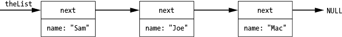
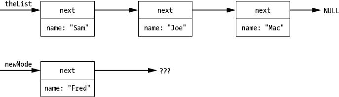
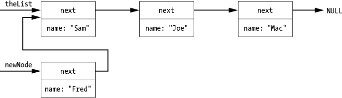
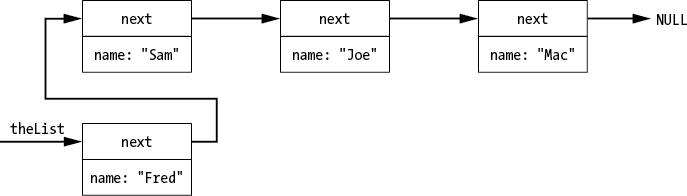
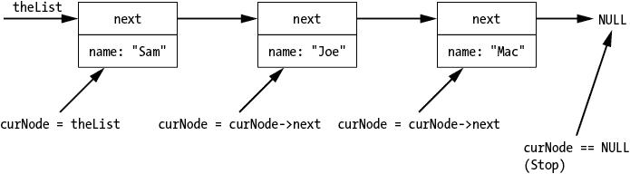
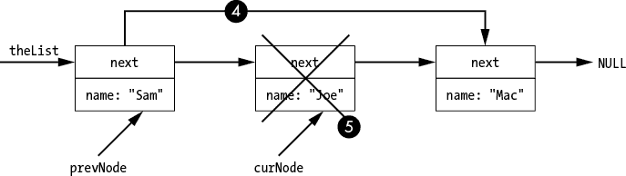

# 动态内存


嵌入式系统的随机存取内存（RAM）非常有限。到目前为止，我们将空闲内存划分为一个小栈，没有空间容纳其他内容。当处理更大的系统时，我们有了数 GB 的内存，这使得我们可以更轻松地将内存划分为两个部分：栈和堆。

我们在第七章讨论了栈。栈是程序为每个过程分配局部变量和临时值的地方。堆则有点不同。你可以决定何时从堆中分配内存，以及何时将内存返回堆中。使用堆，你可以创建非常复杂和大型的数据结构。例如，网页浏览器使用堆来存储构成网页的结构元素。

本章描述了如何分配和释放内存。此外，我们还将探讨如何实现一个链表数据结构，以展示常见的动态内存操作，并讨论如何调试常见的内存问题。

## 基本的堆内存分配与释放

我们使用 `malloc` 函数从堆中获取内存。以下是该函数的一般形式：

```
`pointer` = malloc(`number-of-bytes`);
```

这个函数从堆中获取 `number-of-bytes` 字节并返回指向它们的指针。内存是未初始化的，因此它包含随机值。如果程序堆内存耗尽，函数将返回 `NULL` 指针。

清单 13-1 中的程序为堆上的一个结构分配内存，然后对其什么也不做。

**simple.c**

```
#include <stdlib.h>
#include <stdio.h>

// Singly linked list with name as payload
struct aList {
     struct aList* next; // Next node on the list
     char name[50];      // Name for this node
};

int main() {
    struct aList* listPtr = malloc(sizeof(*listPtr));
    if (listPtr == NULL) {
        printf("ERROR: Ran out of memory\n");
        exit(8);
    }
    return (0);
}
```

清单 13-1：一个简单的指针分配

为了使程序更可靠，我们使用 `sizeof(*listPtr)` 来确定分配多少字节，这是一个常见的设计模式：

```
`pointer` = malloc(sizeof(*`pointer`));
```

一个常见的设计错误是省略了星号，像这样：

```
struct aList* listPtr = malloc(sizeof(listPtr));
```

有事物和指向事物的指针。`listPtr` 变量是一个指针，而 `*listPtr` 表达式是一个事物。指针是小的：在 64 位系统上为 8 字节。事物的大小，在这个例子中，是 56 字节。设计模式确保你为变量分配了正确的字节数，因为变量在 `malloc` 的参数中会重复出现。

你经常会看到结构本身，而不是指向结构的指针，用在 `sizeof` 中：

```
struct aList* listPtr = malloc(sizeof(struct aList));
```

这样做是可行的，但有些危险。假设有人改变了 `listPtr` 的类型。例如，以下是不正确的：

```
struct aListImproved* listPtr = malloc(sizeof(struct aList));
```

那么发生了什么呢？一开始我们有以下正确但危险的声明：

```
struct aList* listPtr = malloc(sizeof(struct aList));
```

一切都正常，因为 `listPtr` 是指向 `struct aList` 的指针。只要类型匹配，一切都没有问题。现在假设有人决定修改代码，使得 `listPtr` 指向新的、改进版的 `aList`，称为 `aListImproved`，*但是他们没有在* `malloc` *函数中更改类型*。更糟糕的是，假设代码不再是简单的、显而易见的一行代码，而是像这样：

```
struct aListImproved* listPtr;
// 3,000 lines of dense code

// WRONG
listPtr = malloc(sizeof(struct aList));
```

这段代码没有为新字段分配足够的空间，因此每次有人使用这些新字段时，随机的内存就会被覆盖。

一个好的做法是检查 `malloc` 是否返回了 `NULL` 指针，以此判断是否耗尽了内存：

```
if (listPtr == NULL) {
    printf("ERROR: Ran out of memory\n");
    exit(8);
}
```

即使你认为 `malloc` 永远不会失败，这一点也是至关重要的。

我们的程序有 *内存泄漏*，这意味着它没有回收所使用的内存。当程序回收内存时，它会被返回到堆中，以便之后的 `malloc` 可以重新使用。为了做到这一点，我们使用 `free` 函数：

```
free(listPtr);
listPtr = NULL;
```

将 `listPtr` 设置为 `NULL` 是一种设计模式，它确保在内存被释放后，不会再尝试使用这块内存。C 语言并没有强制要求这样做。

如果我们在没有先将释放的 `listPtr` 设置为 `NULL` 的情况下使用它，我们将写入本不该写入的内存。下面是一个示例：

```
free(listPtr);
listPtr->name[0] = '\0'; // Wrong, but will execute and
                         // possibly create a strange error
                         // much later in the program
```

当我们向已释放的内存写入数据时，可能会发生一些程序错误，调试起来会很困难，因为错误和之前的错误之间的关系不容易发现。

如果我们在明显的方式中犯错，那就很好，比如这样：

```
free(listPtr);
listPtr = NULL;
listPtr->name[0] = '\0';  // Program crashes with a good
                          // indication of where and why
```

这是一种偏执编程的形式。其思路是将一个微妙且难以发现的错误转化为一个能够崩溃整个程序的错误，这样更容易找到问题。

## 链表

现在我们有了堆并且可以在其中存储数据，我们将使用一种叫做 *单向链表* 的原始数据结构，这比数组有多个优势。它没有固定大小，而且在使用它时，插入和删除操作比数组要快得多。（数组的优势在于查找速度较快。）

假设我们需要为电话簿存储多个姓名。问题在于我们不知道会有多少个姓名，而且姓名可能随时被添加或删除。对于嵌入式系统来说，这个问题很简单。我们创建一个数组来存储姓名。如果数组空间用完，我们告诉用户无法再存储更多姓名。如果我们有内存并且有堆，使用链表会更好。在极其有限的嵌入式系统中，我们两者都没有。

我们链表中的每个元素，称为 *节点*，都是从堆中分配的。为了跟踪这些元素，我们有一个指向第一个节点的指针。第一个节点有一个指向第二个节点的指针，依此类推，直到我们到达最后一个节点。它的指针是 `NULL`，表示链表的结束。节点的数量没有固定限制。如果我们需要更多的节点，只需从堆中分配一个新的节点。

这是链表的结构：

```
#define NAME_SIZE 20    // Max number of characters in a name
/**
 * A node in the linked list
 */
struct linkedList {
    struct linkedList* next;    // Next node
    char name[NAME_SIZE];       // Name of the node
};
```

`next` 指针指向下一个节点（或 `NULL`），而 `name` 数组最多存储 20 个字符。图 13-1 是该链表的示意图。



图 13-1：单向链表

单向链表提供了一种非常简单的方式，将不确定数量的项存储在堆中。

### 添加一个节点

要将一个节点（例如“Fred”）添加到列表中，我们必须先创建一个。在代码中，我们让`newNode`变量指向新创建的节点。此时内存布局如图 13-2 所示。



图 13-2：创建新节点

图 13-2 展示了我们的链表（不包括“Fred”）以及我们为“Fred”分配的新节点。接下来，我们让新节点的`next`指针指向列表的起始位置（参见图 13-3）。



图 13-3：新节点的`next`指针指向列表的起始位置。

最后一步是将`theList = newNode`，将指针移动到我们的列表头部，指向新的第一个节点（参见图 13-4）。



图 13-4：将新节点移动到列表头部

清单 13-2 展示了将新节点添加到列表开头的代码。

```
static void addName(void)
{
    printf("Enter word to add: ");

    char line[NAME_SIZE];       // Input line

    if (fgets(line, sizeof(line), stdin) == NULL)
        return;

    if (line[strlen(line)-1] == '\n')
        line[strlen(line)-1] = '\0';

    // Get a new node.
    struct linkedList* newNode = malloc(sizeof(*newNode));

    strncpy(newNode->name, line, sizeof(newNode->name)-1);
    newNode->name[sizeof(newNode->name)-1] = '\0';
    newNode->next = theList;
    theList = newNode;
}
```

清单 13-2：将单词添加到链表中

我们从函数声明开始，`static`关键字表示该函数仅对当前文件中的代码可见。我们首先请求要添加的单词，并使用`fgets`函数获取它，其通用形式如下：

```
fgets(`array`, `size`, `file`)
```

该函数从`file`读取一行并将其放入`array`中。`size`是要放入数组的字节数，包括字符串结束符（`\0`）。在此例中，数组是`line`（输入行），文件是`stdin`（标准输入，换句话说，就是终端）。如果`fgets`返回`NULL`，表示我们因为错误或数据读取完毕无法读取`stdin`。此时，我们放弃并返回，因为没有获取到单词。

`fgets`函数最多读取`size`-1 个字符，因为它总是将字符串结束符（`\0`）放入数组中。如果输入的行短于`size`，整个行都会被放入缓冲区，包括换行符。如果输入的行较长，则输入会被截断。

我们不能依赖缓冲区中有换行符，也不希望有。如果字符串中的最后一个字符（通过`strlen`函数找到，该函数返回字符串的字符数）是换行符，我们通过将其改为空字符（`'\0'`）来删除它。接着，我们为新节点分配内存，并通过将`line`复制到节点的名称中来填充它。

`strncpy`函数将第二个参数（`line`）复制到第一个参数（`newNode->name`）中，但只复制第三个参数指定的字符数。如果要复制的数据（`line`）比`size`参数更多，函数会限制复制的字符数，并且不会在末尾插入字符串结束符（`\0`），因此为了安全起见，我们手动在`name`数组的末尾添加一个结束符。

我们让`newNode`指向第一个节点，然后将`theList`指向新节点，如图 13-3 和 13-4 所示。

### 打印链表

打印链表的规则很简单。这里是一个示例：

```
for (const struct linkedList* curNode = 1 theList;
   2 curNode != NULL;
   3 curNode = curNode->next){
    printf("%s, ", curNode->name);
}
```

我们从第一个节点 1 开始，打印它，然后转到下一个节点 3。我们继续执行，直到链表 2 遍历完为止。在这个示例中，`for` 循环的初始化、结束条件和迭代语句分布在三行代码中。代码确实会在列表末尾添加一个额外的逗号，但我相信你能弄清楚如何修复这个问题。图 13-5 展示了它的工作原理。



图 13-5：打印列表

由于我们的链表是一个简单的数据结构，打印过程也很简单，而 C 语言的 `for` 循环的灵活性使得遍历链表变得容易。

### 删除节点

要删除一个节点，我们首先遍历链表并找到我们想要的节点。接下来，我们移除该节点，然后将前一个节点连接到下一个节点。遍历链表的代码如下：

```
static void deleteWord(void)
{
    printf("Enter word to delete: ");

    char line[NAME_SIZE];       // Input line

    if (fgets(line, sizeof(line), stdin) == NULL)
        return;

    if (line[strlen(line)-1] == '\n')
        line[strlen(line)-1] = '\0';

    struct linkedList* prevNode = NULL; // Pointer to previous node
  1 for (struct linkedList* curNode = theList;
         curNode != NULL;
         curNode = curNode->next) {
       2 if (strcmp(curNode->name, line) == 0) {
            if (prevNode == NULL) {
              3 theList = curNode->next;
            } else {
              4 prevNode->next = curNode->next;
            }
          5 free(curNode);
            curNode = NULL;
            return;
        }
      6 prevNode = curNode;
    }
    printf("WARNING: Node not found %s\n", line);
}
```

我们使用一个 `for` 循环，和打印时的方式差不多 1，但不是打印节点，而是使用 `strcmp` 函数 2 来检查它是否是我们想要的节点，该函数如果字符串相同则返回 `0`。如果它不是我们想要的节点，我们更新指向前一个节点的指针 6（这是删除时需要的），然后使用 `for` 循环进入下一个节点。

如果我们确实找到了节点（假设是“Joe”），`prevNode` 会指向“Sam”，`curNode` 会指向“Joe”，如 图 13-6 所示。

接下来，我们让“Sam”节点指向“Mac”节点，跳过“Joe”节点 4。然后我们通过释放它 *并且* 将指针设置为 `NULL` 5 来删除该节点，这在 `prevNode` 设置时是有效的。如果我们想删除第一个节点“Sam”，我们需要更改链表的指针，跳过已删除的节点 3。



图 13-6：删除节点 `“Joe”`

### 将一切整合在一起

清单 13-3 是一个小型命令行程序，旨在交互式编辑和打印链表。

**linked.c**

```
/**
 * Demonstrate a singly linked list.
 */
#include <stdio.h>
#include <stdlib.h>
#include <string.h>
#include <stdbool.h>

#define NAME_SIZE 20    // Max number of characters in a name
/**
 * A node in the linked list
 */
struct linkedList {
    struct linkedList* next;    // Next node
    char name[NAME_SIZE];       // Name of the node
};
// The linked list of words
static struct linkedList* theList = NULL;

/**
 * Add a name to the linked list.
 */
static void addName(void)
{
    printf("Enter word to add: ");

    char line[NAME_SIZE];       // Input line

    if (fgets(line, sizeof(line), stdin) == NULL)
        return;

    if (line[strlen(line)-1] == '\n')
        line[strlen(line)-1] = '\0';

    // Get a new node.
    struct linkedList* newNode = malloc(sizeof(*newNode));

 strncpy(newNode->name, line, sizeof(newNode->name)-1);
    newNode->name[sizeof(newNode->name)-1] = '\0';
    newNode->next = theList;
    theList = newNode;
}

/**
 * Delete a word from the list.
 */
static void deleteWord(void)
{
    printf("Enter word to delete: ");

    char line[NAME_SIZE];       // Input line

    if (fgets(line, sizeof(line), stdin) == NULL)
        return;

    if (line[strlen(line)-1] == '\n')
        line[strlen(line)-1] = '\0';

    struct linkedList* prevNode = NULL; // Pointer to the previous node
    for (struct linkedList* curNode = theList;
         curNode != NULL;
         curNode = curNode->next) {
        if (strcmp(curNode->name, line) == 0) {
            if (prevNode == NULL) {
                theList = curNode->next;
            } else {
                prevNode->next = curNode->next;
            }
            free(curNode);
            curNode = NULL;
            return;
        }
        prevNode = curNode;
    }
    printf("WARNING: Node not found %s\n", line);
}

/**
 * Print the linked list.
 */
static void printList(void)
{
    // Loop over each node in the list.
    for (const struct linkedList* curNode = theList;
         curNode != NULL;
         curNode = curNode->next) {
        printf("%s, ", curNode->name);
    }
    printf("\n");
}

int main()
{

    while (true) {
        printf("a-add, d-delete, p-print, q-quit: ");
        char line[100]; // An input line
        if (fgets(line, sizeof(line), stdin) == NULL)
            break;

        switch (line[0]) {
            case 'a':
                addName();
                break;
            case 'd':
                deleteWord();
                break;
            case 'p':
                printList();
                break;
            case 'q':
                exit(8);
            default:
                printf(
                    "ERROR: Unknown command %c\n", line[0]);
                break;
        }
    }
}
```

清单 13-3：实现链表的程序

用户通过输入命令来添加或删除节点（按名称）、打印列表或退出程序。当用户添加或删除节点时，程序会动态分配或释放内存。

## 动态内存问题

使用动态内存时，可能会出现几种常见错误，例如内存泄漏、在释放内存后仍使用指针，以及在结构体末尾写入数据并破坏随机内存。让我们看看每个错误以及如何避免它。

*内存泄漏* 发生在内存被分配后从未释放的情况下。这里有一个示例：

```
{
    int* dynamicArray;    // A dynamic array
    // Allocate 100 elements.
    dynamicArray = malloc(sizeof(int) * 100);
}
```

每次程序执行这段代码时，它都会分配 400 字节的内存。如果程序运行足够长时间，它将消耗所有可用内存并崩溃。（实际上，它会消耗足够的内存资源，导致其他程序变得非常慢，然后才使用大量内存，使得计算机完全无法使用，运行一段时间后，最终内存耗尽。）

在释放内存后使用指针（通常称为 *释放后使用*）可能导致随机结果或覆盖随机内存。让我们看一个例子：

```
free(nodePtr);
nextPtr = nodePtr->Next;   // Illegal
```

在这种情况下，`free` 函数可能会在节点中写入书籍记录或其他数据，结果 `nextPtr` 变为未定义。

正如本章早些时候提到的，简单的设计模式将限制这种代码造成的损害。我们总是在释放指针后将其设置为 `NULL`：

```
free(nodePtr);
nodePtr = NULL;
nextPtr = nodePtr->Next;   // Crashes the program
```

我们将未定义的、随机的行为替换为可重现的、可预测的行为。崩溃的原因容易找到。

我们将要考虑的最后一个动态内存问题是写入结构体末尾之外的数据。正如你之前看到的，没什么能阻止你写入数组末尾之外的内容。你可以对分配的内存做同样的事：

```
int* theData;   // An array of data
*theData = malloc(sizeof(*theData)*10);
theData[0] = 0;
theData[10] = 10; // Error
```

使用 C 语言没有好的方法来防止或检测这些类型的错误。需要外部工具或增强型编译。

## Valgrind 与 GCC 地址清理器

内存错误已经成为一个严重问题，许多工具被创建出来以尝试检测它们，包括 Valgrind 和 GCC 地址清理器。

Valgrind 是开源的，并且可以免费在 [`valgrind.org`](http://valgrind.org) 上获取，适用于 Linux 和 macOS。它的设计目标是发现以下问题：内存泄漏、写入数组或分配的内存块的末尾、在释放内存后使用指针，以及基于未初始化内存的值做出决策。

Valgrind 是一个运行时工具。你不需要重新编译代码来使用它；相反，你正常编译程序，然后将程序作为参数与 Valgrind 一起运行。

列表 13-4 显示了一个泄漏内存的程序。

```
/**
 * Leaks memory and uses it badly.
 * Generates warnings when compiled.
 * Generates errors when run.
 *
 * Please don't program like this.
 */
#include <stdlib.h>

static void leak(void)
{
    char* data = malloc(100);
}

int main()
{
    leak();
    return (0);
}
```

列表 13-4：一个有内存泄漏的程序

列表 13-5 显示了在 Valgrind 下运行此程序，且泄漏检查设置为最大时的结果。

```
$ **valgrind --leak-check=full ./leaker**
`--snip--`
==14500== 100 bytes in 1 blocks are definitely lost in loss record 1 of 1
==14500==    at 0x4C2FB0F: malloc (in /usr/lib/valgrind/vgpreload_memcheck-amd64-linux.so)
==14500==    by 0x10865B: leak (leaker.c:12) 1
==14500==    by 0x10866B: main (leaker.c:17)
==14500==
==14500== LEAK SUMMARY:
==14500==    definitely lost: 100 bytes in 1 blocks
`--snip--`
```

列表 13-5：Valgrind 结果

从此输出中，我们可以看到第 12 行正在泄漏 1。

GCC 地址清理器旨在仅检测内存泄漏和写入数组或分配的内存块末尾之外的操作。与 Valgrind 不同，它是一个编译时工具，因此你需要使用 `–fsanitize=address` 标志编译代码以使用它。之后，当你运行程序时，它会自动生成报告，如 列表 13-6 所示。

```
$ **/leaker**

=================================================================
==14427==ERROR: LeakSanitizer: detected memory leaks

Direct leak of 100 byte(s) in 1 object(s) allocated from:
    #0 0x7f07c712cb50 in __interceptor_malloc (/usr/lib/x86_64-linux-gnu/libasan.so.4+0xdeb50)
    #1 0x5607aef0b7fb in leak /home/sdo/bare/xx.leaker/leaker.c:15
    #2 0x5607aef0b80b in main /home/sdo/bare/xx.leaker/leaker.c:17
    #3 0x7f07c6c7eb96 in __libc_start_main (/lib/x86_64-linux-gnu/libc.so.6+0x21b96)

SUMMARY: AddressSanitizer: 100 byte(s) leaked in 1 allocation(s).
```

列表 13-6：地址清理器结果

内存问题自第一台计算机时代以来就困扰着程序，它们很难找到。地址清理器是一个能帮助我们找到这些问题的工具。

## 总结

堆允许你根据需要为程序添加和移除额外的内存。它使你能够创建大型、复杂和精妙的数据结构。各种数据结构和数据结构设计的描述可能足以填满一本书。

本章介绍了单链表，它是数据结构的“Hello World”。随着你的进展，你可以学习如何使用堆来存储更复杂的数据。现在，你已经掌握了基础，接下来你将如何使用这些知识完全取决于你自己。

## 编程问题

1.  修改示例 13-3 中的程序，它实现了一个链表，使得链表中的节点始终保持顺序。

1.  给定两个有序的链表，创建一个函数返回它们的公共节点列表。你可以创建一个新的列表，也可以创建一个列表，其主体只是指向另一个列表中某个节点的指针。

1.  修改示例 13-3 中的程序，使用双向链表。每个节点将有一个指向下一个节点的`next`指针，以及一个指向前一个节点的`previous`指针。

1.  编写一个函数，反转单链表的顺序。

1.  编写一个函数，删除链表中的重复节点。
