## 第三章：2

**比特币基础**

根据我们的经验，最简单的方式让一个人对比特币产生兴趣，就是让他用比特币购买一些东西。这也是我们自己被吸引进来的方式。在本章中，我们将帮助你完成第一次比特币交易，而不需要担心太多技术性内容。不过，在这个过程中，我们会讨论比特币是如何运作的。阅读完本章后，你将了解比特币的基础知识——足够在任何鸡尾酒会上聊上几句。

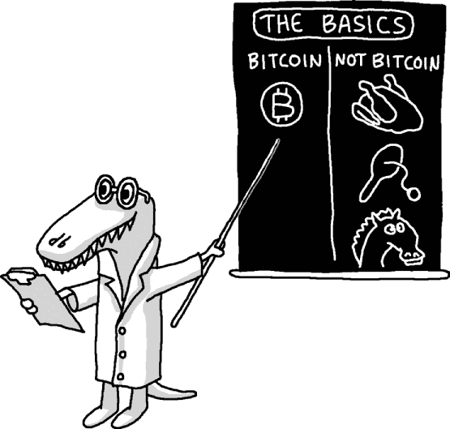

### 比特币如何简单运作

在比特币系统中，每个人都共同合作来追踪其他人的资金，如第一章中提到的那样，系统中没有中央权威（例如银行或政府）。为了最好地理解系统是如何运作的，我们先通过一个使用美元的例子来讲解。

想象一下，全球只有 2100 万个比特币存在，并且有一份详细的清单列出了所有拥有这些比特币的人。每个人，包括你（尽管你只有 5 美元），都有一份这份清单。当你给朋友 2 美元时，你必须从自己的清单上减去 2 美元，并将 2 美元加到她的清单上。在通知她交易完成后，她也会更新她的清单。事实上，全球每个人都需要更新这份清单，否则清单就会不准确。因此，不仅你需要通知你的朋友，还需要公开宣布你正在更新清单。如果你试图欺骗系统，给朋友 1000 美元，作弊行为会很容易被发现，因为大家都知道你只有 5 美元。

现在，想象所有交易都在通过互联网相互通信的计算机上进行，并将*美元*替换为*比特币*。这就是比特币的运作方式。实际上很简单。那么，为什么比特币看起来如此复杂呢？

答案是三重的：首先是一个棘手的问题，关于如何评估任何新货币系统的单位（无论是比特币还是贝壳）。一项理发服务应该值 5000 个比特币还是 0.005 个比特币？其次，实施和使用比特币涉及许多细节，尽管总体概念相当简单。例如，如何获取一份清单，或者比特币是如何最初分配的？第三，比特币世界使用了大量全新的、不熟悉的词汇（例如，挖矿）。

我们将把关于比特币价值的第一个问题留到后面的章节讨论。在本章中，我们将通过解释比特币中使用的主要概念来解决后两个问题，即比特币地址、私钥、比特币钱包和区块链。我们还将简要讨论比特币挖矿，并带你完成接收和发送第一次比特币的过程，让你看到系统是如何运作的。但首先，你需要更详细地了解比特币的单位。

### 比特币单位

如在第一章中所解释，比特币指的是整个货币系统，而比特币则是该货币的单位。虽然总货币供应量被限制为 2100 万个比特币，但每个比特币可以进一步细分为更小的单位；例如，0.1 比特币和 0.001 比特币。最小的单位是比特币的亿分之一（0.00000001 比特币），为了纪念中本聪，这个单位被称为*satoshi*。因此，商品的定价可以非常精确，且人们可以轻松地使用准确的零钱支付这些商品（例如，商家可以将一加仑牛奶定价为 0.00152374 比特币，或 152,374 satoshis）。

商家通常不会在价格标签上写出*bitcoins*，而是使用简写的货币代码*BTC*或*XBT*；例如，5 比特币会写作 5 BTC。尽管自比特币开发之初，BTC 这一缩写已被广泛使用，但最近一些商家和网站开始使用 XBT，因为它更符合某些国际命名标准^1。随着比特币的价值上涨，使用比特币的千分之一甚至百万分之一单位变得越来越普遍，这些单位分别被称为*毫比特币（mBTC）*和*微比特币（μBTC）*。许多人提出了比特币较小单位的更简单名称，其中一个被广泛接受的名称是将微比特币（虽然很难发音）简称为*bits*。

1 比特币 = 1 BTC 或 1 XBT

1 BTC = 1,000 mBTC

1 mBTC = 1,000 μBTC

1 μBTC = 100 satoshis = 1 bit

现在你已经了解了各种比特币单位的术语，接下来你需要扩大你的比特币词汇量，那么让我们来谈谈什么是比特币地址。

### 比特币地址

比特币使用一种公开账本，记录着比特币的数量以及其所有者的身份。但与其将人名与账户关联，账本只列出*比特币地址*。每个地址可以看作是一个人的化名（或者是一个人群体、企业等），而使用化名正是人们能够使用比特币而无需透露个人信息的原因。以下是一个比特币地址的示例：

```
13tQ1fbTMB6GxUJfMqCSDgivc8fvkHEh3J

```

类似于银行账户号码，比特币地址由一串字母和数字组成（通常以数字 1 开头）。要将比特币发送给他人（例如，在线商户、朋友或家庭成员），你只需要知道他们的比特币地址。反过来，当你与他人分享你的地址时，他们也能向你发送比特币。由于比特币地址输入起来较为繁琐，许多人使用*二维码（QR）*来表示他们的地址（见图 2-1）。^(2) 为了方便，你可以将你的比特币地址，无论是输入的还是二维码（或两者兼有），放在你的名片、个人网站或店面（如果你是商户的话）上。尽管你需要互联网连接来*发送*比特币，但你不需要连接互联网来*接收*比特币。例如，如果你在某个慈善组织工作，并发放包含你比特币地址和类似“请考虑用比特币捐赠”的语句的名片，你的组织可以在你睡觉时收取比特币。

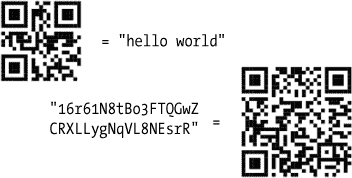

*图 2-1：QR 码可以用来表示任意数据。它们易于通过智能手机扫描，因此非常方便用于共享比特币地址所使用的长字符串。*

如你所知，在传统银行中，从一个账户转账到另一个账户意味着银行会更新其私有账本，记录该银行所有账户的信息。如果火灾或其他灾难摧毁了这个账本，那么关于谁拥有这些资产的信息可能永远丢失。虽然比特币也使用账本，但它的副本是分布在全球数百万台计算机上的。因此，不存在单一的故障点，并且记录在比特币账本上的交易是永久性的，无法抹去。从一个地址转账到另一个地址，相当于向比特币网络上的所有计算机发送指令，要求它们以相同的方式更新每一个账本。

由于比特币账本上的所有交易都是*公开信息*，保持隐私（如果需要的话）可能会有挑战。虽然账本上没有个人信息，但如果你将比特币地址与朋友共享或将其发布在别人能与你身份关联的公开场所，那么该地址上的比特币余额（包括所有进出的交易）将为所有人所知。为了增强隐私性，你可以使用多个比特币地址，但仅公开其中的一些地址。^(3)

那么，如何将比特币从一个地址转移到另一个地址（即，如何花费它们）呢？这个操作需要一个私钥。

### 私钥

*私钥*，像比特币地址一样，是一串长长的数字和字母（通常以数字 5 开头）。与比特币地址一样，二维码常常用于表示私钥，因为它们很长。每个私钥与一个比特币地址配对，并能够*解锁*该地址上的比特币（即，将其转移到其他地方）。^(4) 以下是一个私钥的示例：

```
5J2ae37Jwqzt7kSp9rE17Mi2LbkHXx4tzNSzbq7xDp2cQJCzhYo

```

而比特币地址类似于银行账户号码，私钥则更像一个 PIN：你需要它来授权提款或支出。当一笔交易广播到比特币网络，指示将比特币从一个地址转移到另一个地址时，网络上的计算机会检查交易是否已经授权，然后才会对公共账本进行更新。具体来说，他们会检查交易是否已经*数字签名*，且该签名只能由拥有相应私钥的人创建。与 PIN 类似，私钥应该保密。如果有人获得了你的私钥，他就可以花掉你的比特币。

请注意，尽管私钥可以用来生成数字签名，但数字签名无法用来获取私钥。数字签名也不能重复使用以进行新交易；因此，向比特币网络广播已签名的交易并不会构成风险。这个操作本质上与使用信用卡在线支付不同。当你使用信用卡时，你将信用卡号提供给某人以授权交易。该号码随后可以被（恶意地）重复使用，授权更多你未曾打算的交易。

与你和银行都知道的 PIN 不同，*只有你知道私钥*。在这种情况下，你面临的风险是，如果你丢失了存储比特币的地址的私钥，那么这些比特币将永远被锁在该地址中。显然，丢失私钥是非常严重的！幸运的是，你可以轻松地制作私钥的数字备份，或者把它写在纸上并保存在安全的地方。然而，丢失比特币地址并不是问题，因为它可以从相应的私钥恢复（本章后面将介绍的比特币钱包程序可以自动为你完成这项操作）。

尽管只使用一个地址和私钥就可以使用比特币，但在实践中，大多数人会使用多个地址，每个地址都有自己的私钥，并将它们存储在数字钱包中。

### 比特币钱包

*比特币钱包*是由一个人拥有的一组地址和私钥的集合。拥有多个比特币地址可以帮助你更好地管理资金。你可能希望为支付房租、网上购物和将来买房存储比特币而拥有不同的地址。因此，一个人可能在他的钱包里有两枚比特币，这些比特币分布在多个不同的比特币地址中（见图 2-2）。

使用多个地址的形式，也有助于保持隐私。这是因为比特币所维护的公共账本，任何人都可以查看，但它无法知道两个地址是否属于同一个钱包并由同一个人拥有（只要该人没有做出任何表明两个地址相互关联的行为，例如使用两个账户中的比特币进行一次购买）。

为了管理多个地址和私钥，人们使用比特币*钱包程序*。^(5)。比特币钱包是一个抽象的概念，指的是一组比特币地址，而钱包程序是一个具体的工具，帮助用户执行常见的比特币任务，如创建新的比特币地址、向他人发送比特币、备份私钥等。但需要注意的是，关于比特币钱包的术语并不是总是一致的。通常，比特币钱包程序被简称为*比特币钱包*，这容易混淆这两个不同的概念。当你保存一个比特币钱包（可能是为了制作备份副本）时，你会创建一个*钱包文件*，其中包含多个比特币地址的信息。之后，你可以将钱包文件加载到比特币钱包程序中。

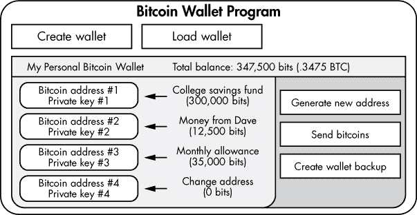

*图 2-2：比特币钱包是一个组织良好的地址集合及其相应的私钥。比特币钱包程序存在的目的是帮助执行常见任务，如发送比特币和管理钱包中的比特币。*

有许多比特币钱包程序可以选择；大多数是免费的下载，可以在你的笔记本电脑、手机上运行，甚至可以在你的网页浏览器中使用。我们将在第三章中探讨各种比特币钱包程序，但在本章中，我们将使用 Electrum 钱包，它是开源的、跨平台的，并且非常简单易用。

**获取一些“入门资金”来了解比特币**

你需要少量的比特币（少于 1 美元）来完成本章的内容。如果你有一个比特币用户朋友，可以考虑请她给你一些零钱用于练习。否则，可以访问 *[`newbiecoins.com/`](http://newbiecoins.com/)*，这是我们（作者）将作为公共服务维护的网站，列出一些其他提供免费比特币的小额赠送的网站。通常会有 *一些* 信誉良好的网站为新手提供比特币赠送，但这种赠送活动的情况是动态变化的，网站每天都可能有变动，所以我们无法在本书中列出具体的网站。

#### *使用 Electrum 创建您的第一个比特币钱包*

为了跟上本节内容，请下载并安装 Electrum（* [`electrum.org/`](http://electrum.org/) *）。如果您选择使用其他比特币钱包程序，本书接下来页面上的大部分说明同样适用于它。

当您第一次运行 Electrum 时，系统会要求您创建一个新钱包（或者恢复一个旧钱包，我们现在暂时忽略恢复选项），如图 2-3 所示。

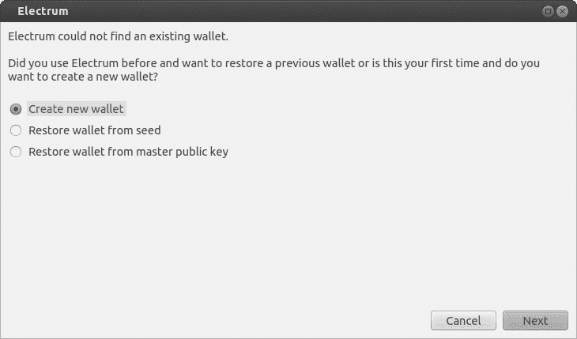

*图 2-3：使用 Electrum 创建一个新的比特币钱包*

下一步是 Electrum 特有的；也就是说，它不是大多数比特币钱包程序的标准功能。应用程序会呈现一个*种子*，由 12 个随机选择的单词组成，并要求您将其写下来（参见图 2-4）。Electrum 使用这个种子来创建您的比特币地址和私钥；因此，种子必须像您的私钥一样保密。因为本章我们只会处理少量的比特币，所以您现在不必过于谨慎。然而，您应该开始牢记这些安全细节。种子的一个重要优点是，如果您丢失了计算机（比如因火灾或被盗），所有内容——您的钱包、比特币地址、私钥和（最重要的）您的钱——都可以从种子中恢复。

下一步是让您创建密码的选项。虽然密码是可选的，但它非常重要。如果您的计算机被盗或不小心落入不法之手，密码可以防止他人花费您的比特币。由于 Electrum（和其他比特币钱包程序）使用密码来加密存储您的比特币钱包，因此没有密码，钱包将无法使用。在许多其他比特币钱包程序中，如果忘记密码，您可能会永久失去访问钱包的权限。但在 Electrum 中，您可以通过种子恢复钱包（无需密码）。

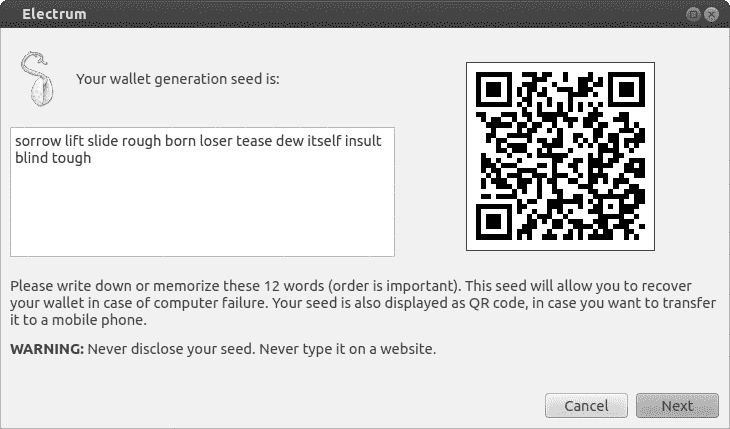

*图 2-4：Electrum 向您展示了一个种子。*

在最后一步中，Electrum 会要求您输入如何连接到远程服务器的指示。选择**自动连接**，然后点击**下一步**（参见图 2-5）。

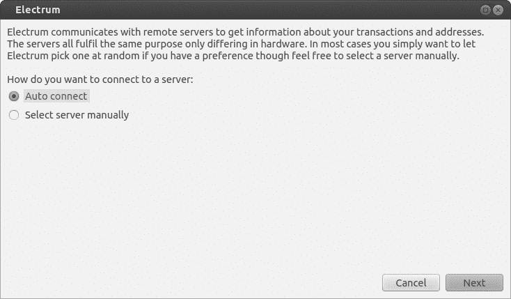

*图 2-5：选择您的服务器连接*

您应该看到一个类似于图 2-6 的屏幕。右下角的绿色点表示您已连接到比特币网络。恭喜！您刚刚设置了您的第一个比特币钱包！现在，您可以向钱包中充值比特币了。

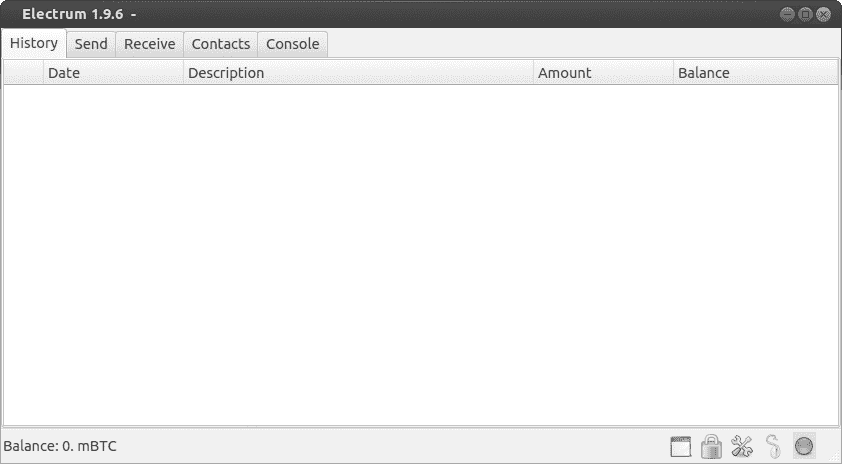

*图 2-6：这是您的第一个比特币钱包！*

#### *在您的钱包中获取比特币*

在接收标签页中（参见图 2-7），您应该能看到多个比特币接收地址的列表。

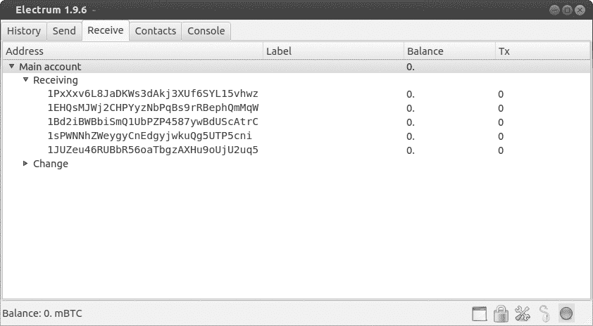

*图 2-7：接收标签页*

你可以与朋友分享这些地址，这样他们就能向你发送一些起始比特币——这是一种获得比特币的方式！此时，如果你想将大量资金投入比特币，请参阅第四章，我们将在那里详细讨论如何操作（但出于安全原因，务必先阅读第三章）。

要将少量比特币转入你的钱包——无论是从朋友那里还是从* [`newbiecoins.com/`](http://newbiecoins.com/)*这样的网站——你需要将你的比特币公共地址提供给那个朋友或网站。写这篇文章时，测试用的小额比特币大约是 0.5 毫比特币（mBTC）。如果你在阅读时，0.5 mBTC 的金额比较大，你也可以使用更小的数额。在朋友（或网站）发送这些比特币几分钟后，你应该能在你的 Electrum 钱包中看到 0.5 mBTC 的余额。（实际上，余额通常会即时更新。）干得好！你现在拥有比特币了，这使你能够展望未来！如何做到这一点？继续往下看。

**注意**

*将私人比特币密钥导入钱包是有风险的。当涉及到小额资金时，你可以使用私人密钥导入资金，但绝不要将这种方法作为管理大额资金的策略，除非你是高级比特币用户。本章末尾的漫画展示了为何直接使用私人比特币密钥可能非常危险。*

#### *使用你的钱包消费比特币*

尽管现在有成千上万的商家接受比特币，但你用 0.5 毫比特币（mBTC）能买到的东西并不多。你需要在互联网上搜寻优惠的交易！

或者，如果你想进行世纪交易，可以以仅需 0.1 mBTC 的低价在线进行算命。

访问 *[`befuddled.org/`](http://befuddled.org/)*，进入我们的算命网站，我们直接将其链接到水晶球。当你将 0.1 mBTC 发送到服务器的比特币地址时，服务器会将*算命请求*传送给水晶球，水晶球则会预测你的未来。


要获得你的财富，使用 Electrum 的发送功能，将网站的比特币地址粘贴到*支付给*字段中。在*金额*字段中，指定**0.1 mBTC**（如果你的单位设置为 BTC，则输入 0.0001；通过选择工具 ▸ 首选项 ▸ 基本单位来更改默认单位）。比特币交易还需要支付费用。在*费用*字段中，输入**0.1 mBTC**（这个金额可能比实际需要的稍多，但我们现在不必担心这个问题）。你的屏幕应该会显示类似于图 2-8 的内容。

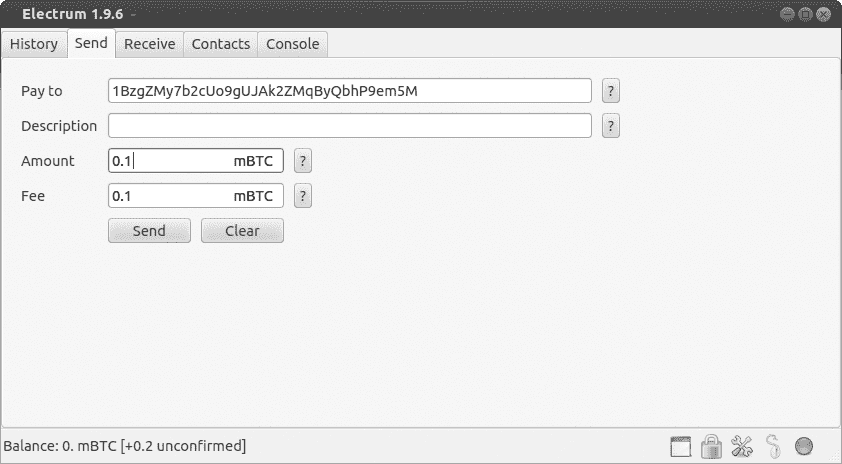

*图 2-8：通过 Electrum 发送比特币*

当你点击**发送**时，Electrum 会要求输入你的密码，并确认交易已被传输。几乎立即，你应该会在网站上看到你的财富。欢迎来到未来！你刚刚完成了第一次比特币交易！

Electrum 的历史记录部分展示了你过去进行的交易。显示为*待处理*的交易尚未记录在比特币公共账本上（这通常发生在交易发送后大约 10 分钟）。

如果你对自己的财富不感兴趣，但想练习发送比特币，你会高兴地知道，现在许多慈善机构和非营利组织都接受比特币。一些组织为无家可归者提供食物，捍卫在线隐私权，并支持开源软件（包括比特币）。通过在线搜索，你会找到许多发布了比特币地址的非营利组织。我们推荐你将免费的毫比特币捐赠给 Sean's Outpost，这是一个位于佛罗里达州彭萨科拉，专门为无家可归者提供食物的慈善机构（其捐赠的比特币地址可以在其网站上找到，* [`seansoutpost.com/`](http://seansoutpost.com/) *）。与算命网站不同的是，当你捐赠时，可能不会收到网站的回复。但请放心，如果 Electrum 的历史记录部分显示为*已确认*，那么收款方已经接受了你的比特币。（有时，确认状态会通过一个小的拨号图标来表示，或者交易可能会显示多个确认。）

你可能会好奇，Electrum 是如何获得比特币地址的。答案是通过你的比特币钱包程序。

#### *由你的比特币钱包程序生成的比特币地址*

当你运行一个比特币钱包程序时，它可以在离线状态下为你生成一个新的比特币地址。无需与比特币网络进行任何通信，这一不寻常的特性让很多人感到惊讶。对于其他地址或号码来说，例如当你创建一个新的电子邮件地址时，你必须首先查明这个地址是否被别人使用。同样，当你获得一个新的电话号码或开设银行账户时，也需要确认该号码或账户是否已经被使用。然而，当你想要一个新的比特币地址时，系统会从所有可能的比特币地址中随机选取一个。那么，随机生成的比特币地址与其他人生成的比特币地址相同的概率有多大呢？我们可以用一个类比来说明：想象地球上所有的沙粒——来自所有沙滩和沙漠。当你随机选取一个沙粒作为你的，而另一个人也随机选取一个沙粒作为他的，你们俩选中相同沙粒的概率比你们俩生成相同比特币地址的概率要高出万亿倍。^(6)

虽然你可以在离线状态下创建比特币地址，但你必须在线才能查看你地址中的余额或向他人发送比特币。这是因为这些额外的操作需要你访问比特币的公共账本，我们接下来将讨论这个问题。

### 区块链

所有比特币交易都会被记录到*区块链*中。在本书的其余部分，我们将把比特币账本称为区块链。这个名称的原因是，新交易以大块（即*区块*）的形式附加到账本上。每当一个新的比特币交易广播到网络时，网络上的计算机将其添加到一个不断增长的交易池中。然后，约每 10 分钟，这个交易池中的交易会被打包成一个区块，并添加到区块链中（参见图 2-9）。为了正常运行，所有比特币钱包程序都需要访问最新的区块链副本，每当一个区块被添加时，钱包程序会复制并将该区块添加到它们自己的区块链中。

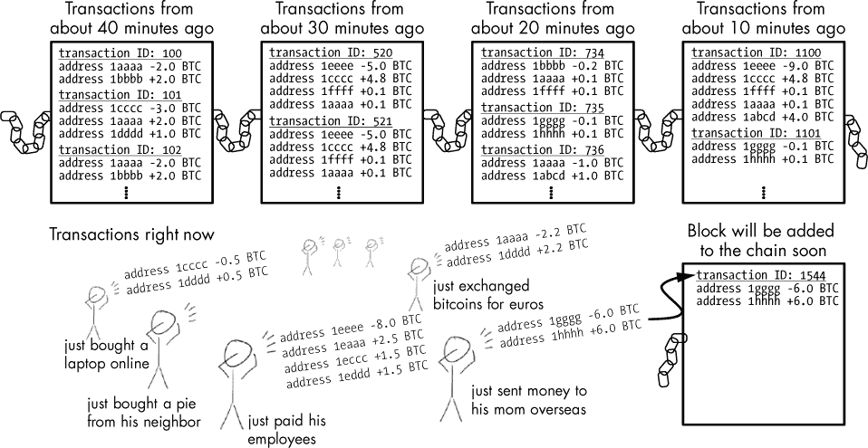

*图 2-9：比特币交易被分组为区块，每 10 分钟被添加到区块链中。*

在比特币网络上，收集交易并将其添加到区块链的成千上万台计算机被称为*矿工*。我们将在本章后面解释矿工及其所做的详细工作。现在，记住，任何人都可以成为矿工（包括你自己），只需在连接到比特币网络的计算机上运行开源的比特币挖矿软件。在任何给定的时刻，成千上万的矿工都连接到比特币网络。他们都自愿提供自己的计算机，用于将新交易添加到区块链中（稍后我们将解释为什么他们这么做）。

每个添加到区块链的区块都是由网络上的*单个*矿工添加的。然后，比特币网络上的其他人都会跟随更新他们自己的区块链副本（这包括其他矿工和比特币钱包程序）。为什么只有一个矿工添加区块，怎么决定是成千上万的矿工中的哪一个呢？这就是比特币变得有趣——并且有点技术性。

让我们先考虑一下为什么有人会想要更新区块链。当然，如果你想进行交易，你的比特币钱包程序需要最新的区块链副本。然而，你可能几个月都不想发送或接收比特币，那么为什么在这段时间里还要更新区块链副本呢？为了让比特币系统正常运作，许多人需要保持最新的区块链副本。原因是，如果只有一个人拥有最新副本，她就能操控人们账本上的比特币数量。因此，仅凭善意不足以让系统持续运作。但奖励的诱惑始终具有吸引力。

#### *区块链彩票*

为了激励用户尽可能频繁地更新区块链，比特币使用了一种基于彩票的奖励系统。许多人成为矿工，尝试成为*第一个*将区块添加到区块链的人。然后，基于某种概率，选出一个赢家，允许他添加一个区块。

使用像这样的抽奖机制来运行比特币的目的是什么呢？好吧，假设 Crowley 想从 Clarice 那里买一辆 10,000 美元的车。（你将在第五章的漫画中了解更多关于我们朋友 Crowley 鳄鱼的故事。）如果使用传统货币，两个人进行这笔交易时，他们很可能会去银行，并通过银行账户之间的转账完成交易（或者使用类似的银行汇票；见图 2-10）。


*图 2-10：Crowley 通过传统银行将 10,000 美元转给 Clarice。*

他们会在银行这样做，因为他们需要一个可信的第三方（一个“银行家”），来管理一个“货币账本”并将账本中的资金从一个人的账户转移到另一个人的账户。银行家的工作是发布一个 Crowley 和 Clarice 可以信任的公告；也就是说，确认账本已正确更新。（银行家可能会佩戴单片眼镜，戴高顶礼帽，吸着雪茄，也可能不会。）

在比特币系统中，我们还需要一个人来调整账本，在这种情况下，意味着通过添加一个区块来调整区块链。事实证明，任何人都可以担任这个角色，只要他与交易的任何一方没有关联，因为那样可能会导致利益冲突。通过彩票随机选一个人来担任此角色有助于实现这一点。因此，在比特币中，一次彩票抽奖选出一个随机矿工，然后矿工会向网络宣布某些比特币交易是有效的（见图 2-11）。

当然，矿工*确实*有可能认识最近交易中的某一方。这也是为什么区块被安排成链的原因：大约每 10 分钟，当下一位彩票中奖者被宣布时，这位中奖者也会在她的公告中确认，她同意前一位彩票中奖者的所有交易（见图 2-12）。


*图 2-11：一个运行比特币挖矿软件的随机人被选中来确认比特币交易。*

在这个过程中，每一位比特币挖矿彩票的中奖者都会获得奖励，即一定数量的比特币。奖励包括该区块内所有交易的手续费，这激励矿工将尽可能多的交易收集到一个区块中，从而增加他们的奖励。为了有资格获得 10 分钟后添加的下一个区块的奖励，矿工需要拥有最新的区块链副本才能参与下一轮。这个过程是由开源比特币挖矿软件自动完成的，这些软件运行在矿工控制的计算机上。由于这种激励机制，成千上万的矿工不断帮助处理比特币用户的交易，确保区块链始终保持最新。

奖励彩票由社区运行；没有中央权威来选择赢家。我们暂时跳过技术细节（它们在第八章中有讲解），只说矿工不断生成随机数，直到找到一个中奖的数字。这大约需要十分钟。然后，社区通过加密技术验证该矿工找到的数字是否为中奖数字，矿工将一个新区块添加到区块链并收集奖励。当发生这种情况时，通常的说法是矿工*找到了一个区块*。


*图 2-12：在比特币中，每个彩票赢家不仅确认她自己的交易区块，还确认所有之前的区块（她认为是有效的）。*

#### *区块链分叉*

彩票系统在大多数情况下按预期工作。但偶尔，两个矿工会同时找到一个区块，区块链就会出现*分叉*，导致两个不同的分支（参见图 2-13）。

以以下场景为例：假设 Crowley 和 Satoshi 是矿工，并且在几秒钟内找到了中奖数字。如果他们在比特币网络上相距较远（例如，位于地球的两端），网络的一部分会将 Crowley 识别为赢家，另一部分则会将 Satoshi 识别为赢家。在这种情况下，Crowley 和 Satoshi 都会将一个区块添加到区块链上（每个人都认为自己是这一轮的赢家）。问题出现在网络的一部分复制了 Crowley 的区块，另一部分复制了 Satoshi 的区块。结果，两个区块链发生了不一致！

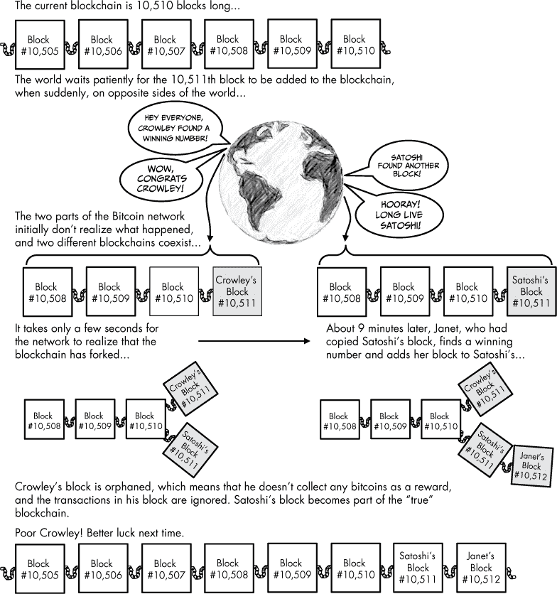

*图 2-13：比特币矿工 Crowley 和 Satoshi 同时找到一个区块，创建了区块链的两个副本。解决分叉问题发生在 Satoshi 的区块链版本在 Crowley 之前添加了另一个区块，而 Satoshi 获得了奖励。*

回想一下，你的比特币钱包程序需要一个最新的区块链副本才能正常运行，但它无法解决分叉的区块链问题。矿工和比特币钱包程序必须决定使用两个区块链版本中的哪一个。通过等待哪一个分支先添加另一个区块来解决分叉问题，这大约会在 10 分钟后发生。然后，较长的分支将被视为*真实*的区块链，较短的分支将被整个比特币网络忽略或*孤立*。

对于大多数用户来说，分叉和忽略孤立区块的过程完全不被注意，也不会对比特币的使用产生负面影响。在我们的例子中，只有输掉的矿工 Crowley 遭遇了显著的影响，因为只有两个参与的矿工中的一个能获得奖励。输掉的矿工无疑会感到失望，但矿工们预期这种情况会时不时发生，因此当它发生时并不感到意外。

#### *交易确认、双重支付和不可逆性*

*交易确认*是比特币中的一个常见概念。一些接受比特币的在线商家可能会要求一笔或多笔交易确认，才会交付商品或服务。每笔交易都会存在于区块链中的某个区块中。它后面的区块是较旧的，前面的区块是较新的。一个区块相对于区块链尖端的位置被称为*区块深度*。最新添加的区块深度为 1，它后面的区块深度为 2，以此类推。一笔交易的确认次数等于它所在区块的深度。因此，尚未被添加到区块链的交易确认次数为零；当它被添加到一个新区块时，确认次数为 1；当一个区块被添加到它前面时，确认次数为 2；依此类推。这个概念足够简单，但为什么商家需要交易确认呢？

对于低价值的交易，例如购买一杯咖啡，商家通常不会要求交易确认。你只需发送比特币，拿到咖啡，然后继续前行。一般来说，比特币交易是不可逆的，商家在你点击发送后的几秒钟内就能知道你已经为饮品（或你购买的其他物品）付款。然而，如果商家出售高价物品，如汽车，就需要考虑交易确认。

一个拥有强大计算资源的恶意用户（想象一下像詹姆斯·邦德风格的超级反派）可能会试图进行*双重支付*，这本质上是试图欺骗接收方接受已经同时发送给其他人的比特币（这个“其他人”可以是超级反派控制的另一个比特币地址）。当比特币网络上的矿工检测到两笔使用相同比特币的交易（但发送到不同的地址）时，他们通常会接受他们先接收到的那一笔，并忽略第二笔。更重要的是，这两笔交易不可能同时被添加到区块中，因为它们互相矛盾。超级反派的意图是让商家发货，但让交易被忽略并未被添加到区块链中。

幸运的是，这种狡猾的方案通常不会成功，因为许多商家使用特殊的监控软件，并且能够识别出当两个冲突的比特币交易同时广播时（此时超级恶棍可能会被踢出汽车经销商处）。商家防止这种支付欺诈的一个更简单的解决方案是等待 10 分钟，直到交易至少有一个确认，才同意发货。然而，如果超级恶棍拥有真正非凡的资源，例如价值数百万美元的计算机硬件，他可以尝试让比特币网络将区块链中的最新区块孤立，从而导致一个交易确认被忽略。为了应对这种遥远的可能性，销售高端商品的商家通常会等到交易有两个确认后，才将钥匙交给买家。一般来说，交易物品的价值越高，商家要求更多的确认才能认为交易已经完成。恶意黑客双重支付这些比特币的成本随着每个确认的增加呈指数级上升。

现在，您已经了解了比特币区块链的基本功能和概念，接下来将学习关于比特币挖矿的内容，这也许是比特币最神秘的方面。

### 比特币挖矿

*比特币挖矿*是收集交易并以区块的形式将其添加到区块链中的竞争过程。为什么叫做挖矿？这个术语源自比特币最初是如何分发的。尽管比特币的总供应量上限为 2100 万，但这一总量是随着时间的推移缓慢达到的。最初，比特币的供应量为零。比特币矿工通过处理他人的交易获得奖励；每个奖励是一小部分*新铸造的*比特币，这增加了流通中的总供应量。从这个意义上讲，比特币挖矿类似于黄金挖掘：地球上的黄金是有限的，矿工们随着时间的推移慢慢开采它。

如前所述，矿工必须通过反复随机生成数字来找到某个获胜号码，从而赢得这些新铸造的比特币。因为快速的计算机可以更迅速地生成这些随机数字，这就促使矿工使用越来越强大的计算机来挖掘比特币。在比特币的初期，个人计算机通常用于生成随机数字，但很快人们开始制造专门用于比特币挖矿的计算机。如今，挖掘比特币需要大量资金、专业知识和廉价电力的支持。事实上，比特币挖矿的发展与黄金开采的变化类似。曾几何时，挖掘黄金可以由一个人在河床上淘金完成，但现在的挖掘工作是由大型公司使用昂贵的钻探设备进行的。

寻找区块的挖矿奖励有两个组成部分：第一部分是交易费用。当你向某人发送比特币时，会额外加上一小部分比特币作为交易费用。^(7) 交易费用通常是几分钱，属于矿工在赢得区块链“彩票”并将新块添加到区块链时获得的奖励的一部分。由于一个区块包含了数百或数千笔交易，矿工的奖励是该新块中所有交易费用的总和。奖励的第二部分是一定数量的新铸造的比特币。

新铸造的比特币奖励数量会随着时间逐渐减少。前 210,000 个区块——基于每个区块间隔 10 分钟，大约需要 4 年时间才能挖出——为每个获胜矿工提供了每个区块 50 个新铸造的比特币，以及交易费用。接下来的 210,000 个区块（从 210,001 到 420,000 区块）每个区块只奖励矿工 25 个新铸造的比特币。此后，奖励将降至 12.5 个比特币，再到 6.725 个比特币，依此类推。因为这个挖矿过程是*唯一*的新比特币来源，所以它也是比特币流通总量永远不会超过 2100 万个的原因。

尽管每四年新铸造的比特币奖励数量会减半，但随着比特币用户基础的增长，每个区块的交易费用将继续增长。最终，用户交易费用将超过新铸造的比特币奖励。到那时，比特币网络将完全通过交易费用维持运营。

### 比特币系统的复杂性

我们大多数人习惯使用集中式支付服务（例如 PayPal、信用卡）。我们将信任放在运行这些服务的公司上，并且不需要了解支付系统是如何运作的。但比特币没有可以信任的公司；相反，我们可以检查系统，决定是否信任它。

如果你调查一下主要信用卡公司用于促进支付的系统，你可能会对它的复杂性感到惊讶。因为我们通常不会考虑数字支付系统是如何运作的，所以比特币系统对大多数人来说令人困惑和复杂并不奇怪。读完这一章后，你应该能对整个系统的运作有一个相当清晰的了解。在后续章节中，我们将进一步探讨一些具体的细节，比如比特币矿工使用的硬件和程序；然而，比特币系统的整体解释不会发生变化，仍将按照本章的描述。从现在开始，我们可以集中精力获取比特币，并思考它们将如何影响我们的全球经济！

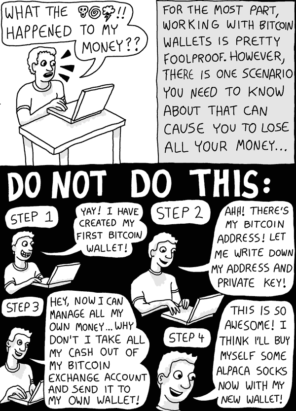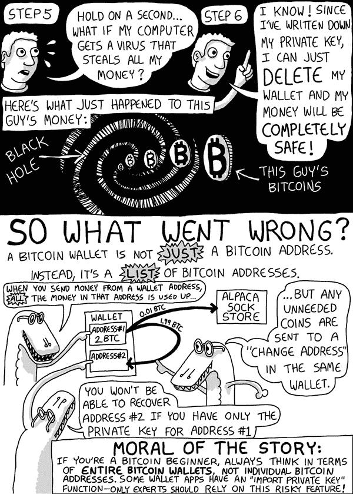
