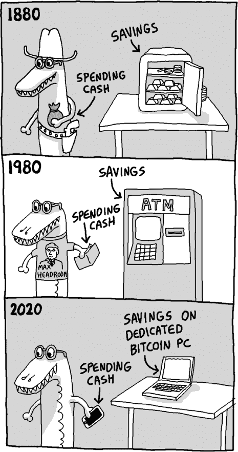
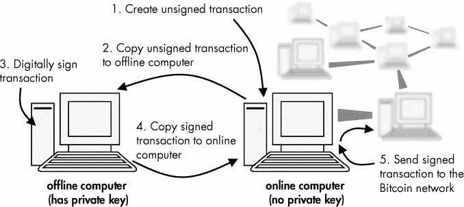
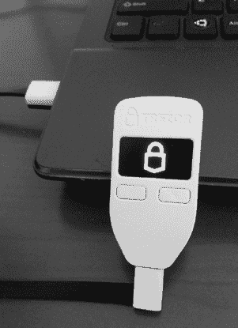
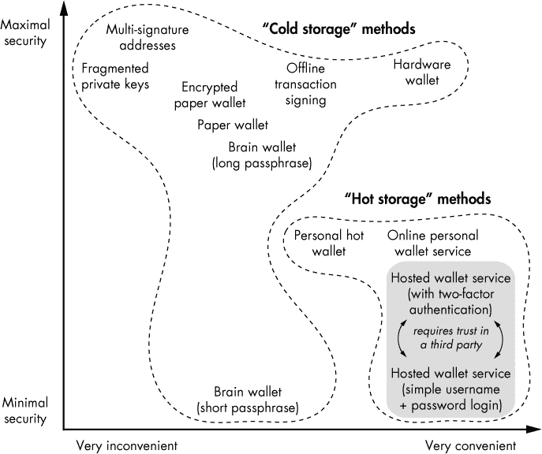

## 第四章：3

**安全、可靠且便捷地存储你的比特币**

不幸的是，无法做到百分之百的保障防止丢失，但如果操作得当，比特币可以被存储得*极其*安全可靠，也许比任何其他金融资产都更加安全。然而，如果存储不当，比特币会因技术故障（例如，计算机或硬盘故障）或日常灾难而容易丢失，并且它们也容易成为盗贼的目标。因此，在你购买大量比特币之前，你需要学习如何——以及如何*不*——存储它们。

在本章中，我们将解释存储比特币的各种方法，并评论它们对于不同使用场景的适用性。有些存储方法比其他方法更安全，但也不那么方便。一旦你掌握了本章讨论的这些方法和概念，你将能够处理任何数量的比特币。



### 存储你的私钥

*你的*比特币存储在哪里？这是一个出乎意料的棘手问题。你必须知道，(1) 你的账户中比特币的*数量*记录在区块链上，并且 (2) 要*访问*这些比特币，你需要使用私钥。区块链的存储位置可能与私钥不同，而且因为两者都是使用比特币所必需的，乍一看，似乎很难确切地说出*比特币*存储在哪里。但是，区块链的多个完全相同的副本分布在全世界各地，而且因为没有任何灾难能抹去区块链的每一个副本，你不需要担心它是如何以及存储在哪里的。相反，你应该关注你的私钥。你（只有你）知道你的私钥，所以你存储这个私钥的地方就是*你的比特币所在之处*。因此，存储比特币实际上意味着存储你的私钥。如果你使用比特币钱包，它是由地址和私钥组成的集合，那么你的比特币就存储在你存储这个集合的地方（通常是在计算机、手机或可移动 USB 驱动器上的*钱包文件*）。

本章的其余部分将解释存储你的私钥（或私钥集合）面临的挑战，即如何防止私钥的意外丢失和盗窃。比特币允许你*成为自己的银行*。但是，成为自己的银行意味着你需要承担巨大的责任，并采取严密的安全措施。作为替代，你可以信任第三方服务提供商来做你的比特币银行，这样你就不需要直接担心安全问题；相反，你需要信任你的服务提供商来保护你的比特币安全。幸运的是，安全地存储比特币是很简单的，即使是初学者也能做到（见“纸钱包” 第 39 页 page 39）。

### 热存储与冷存储

比特币的存储方法通常根据私钥是否存储在连接互联网的设备上来区分为热存储或冷存储。*热存储*指的是私钥存储在在线设备或计算机上。*冷存储*指的是私钥无法通过互联网访问。例如，如果你使用一台离线计算机生成一个比特币地址及其对应的私钥，任何发送到该地址的比特币都属于冷存储。但如果你的地址是在一台离线计算机上生成的，别人如何向你发送比特币呢？你只需要与他们分享！你可以安全地复制你的比特币公钥并将其发布在网站上（或者通过电子邮件发送给你的朋友）。然而，私钥只存在于生成它的离线计算机上，并且保持机密。

因为发送比特币需要私钥和互联网连接，热钱包使用起来更方便，但冷存储方法更安全，更适合长期存储比特币。请注意，热钱包不能通过离线变成冷钱包。^(1) 一旦私钥暴露在互联网上，就不能再假设它能提供与从未暴露的私钥相同的保护。

有时，一些公司可能会宣传将客户的比特币资金存储在冷存储中作为安全功能，但同时声称这些资金可以方便地自动转移到热钱包中。这是一个警告信号。如果任何公司声称它有*自动化过程*可以将资金从冷钱包转移到热钱包，那么很可能*没有*任何资金存储在冷存储中。冷存储需要一个人亲自访问离线计算机并*手动*授权比特币交易。在《存储大量比特币》的第 38 页中，你将学习如何做到这一点。

### 个人钱包与托管钱包

许多公司提供比特币钱包服务和程序，帮助你存储比特币。对于外行人来说，是否这些公司提供的是个人钱包还是托管钱包并不总是很清楚。使用*个人钱包*时，只有你知道私钥。创建软件的公司不会控制你的比特币。或者，使用*托管钱包*时，第三方知道你的私钥并且不会透露给你，但公司会代表你发送、接收和存储比特币（这类似于传统银行存储现金在保险库中，并不会给你开锁的钥匙）。一些公司还提供*软件即服务*。在这种情况下，他们将钱包软件托管在他们的服务器上，但不托管私钥。用户可以使用自己的私钥登录、发送和接收比特币，并监控比特币交易（公司永远不会接触到私钥）。我们将这种服务称为*在线个人钱包*，因为私钥并没有被托管。

对于两种类型的钱包，用户界面可能看起来相似并且功能相似，但使用其中一种钱包与使用另一种钱包的后果却截然不同。特别是，比特币被盗时谁应负责，可能取决于谁有权访问私钥。如果你不确定，问问自己是否有访问私钥的权限。

**注意**

*如果使用多个私钥来控制相同的比特币，责任划分可能会变得模糊。一些在线服务要求使用两个私钥才能花费相同的比特币，一个由公司持有，另一个由客户持有。在这些情况下，责任划分可能更棘手（尽管正如你在 “分散私钥与多签名地址” 中看到的那样，在 第 41 页 提到，使用多个私钥来存储比特币通常是一个好主意）。*

使用托管钱包的好处在于它用户友好，你无需*直接*担心比特币的存储安全。然而，托管公司必须既是*值得信赖*的，又是*有能力*的，确保它不会恶意地带着你的比特币消失，或者让小偷窃取它们。另一个需要考虑的细节是，政府或执法机关可以要求托管公司交出你的比特币。即使你对这一要求有异议，公司也可能会遵从这个请求。

尽管由于易用性，托管钱包可能是许多未来比特币用户的热门选择，但我们将重点讨论个人钱包。即使你决定使用托管钱包并让他人管理安全和保护细节，本章也将帮助你在选择托管钱包服务提供商时做出明智的决定。

### 安全性、保障性和便利性

在比较存储方法时，考虑三个主要因素：

1\. 安全性（防止比特币的意外丢失）

2\. 安全性（防止比特币被盗）

3\. 便利性（轻松快速地花费比特币的能力）

这些因素有时可能互相冲突。那些使*你*方便花费比特币的方法，可能无意中也让*小偷*更容易花费它们。同样，制作许多私钥副本并交给朋友和家人保管是防止意外丢失的好策略；然而，这种策略也增加了私钥落入不法之手的可能性。将安全性、保障性和便利性结合成一种存储方法是一个不断创新的领域，一些新的方法已经展示了三者之间的优秀平衡（参见 “特别提及：比特币硬件钱包” 在 第 42 页）。

大多数人使用两种存储方式：一种是便捷但安全性较低的小额比特币存储方法，另一种是存储大量比特币的方式，虽然不太便捷，但安全性极高。正如克劳利鳄鱼在本章开头的漫画中所示，这就像是将少量现金放在口袋里，但将大部分钱存放在传统银行账户中。

在接下来的章节中，我们将存储方法分为两类：

• 适用于小额比特币存储的方法，这些方法便捷、易于使用，并且*合理*安全

• 用于长期存储大量比特币的方法，这些方法极为安全可靠（但不那么便捷）

### 小额比特币存储

许多易于使用的比特币存储方法很方便，但它们都有一个共同的根本缺陷：一个足够精明的攻击者可能突破安全层，远程访问你的比特币。然而，这种情况与传统在线银行的安全事件并没有太大不同。无论攻击者是在本地还是在其他国家，只要他能盗取你的身份信息并破解登录凭证，就能窃取你的银行账户。例如，如果你通过笔记本电脑访问你的网上银行账户，恶意程序可能会监视你的按键（即*键盘记录器*）并窃取你的密码。银行通过实施严格的每日提款限额或其他措施来缓解这一缺陷，从而减少欺诈访问带来的影响。对于比特币而言，最佳的缓解策略是将大部分资金存储在冷钱包中，冷钱包无法远程访问，仅将更便捷的方法用于日常消费。

以下小节描述了三种可靠且易于使用的发送和接收小额比特币的方法：

• 在线托管钱包服务

• 在线个人钱包服务

• 个人热钱包

#### *在线托管钱包服务*

如本章前面简要讨论过的，在线托管钱包服务因其易用性而广受欢迎，用户通常无需了解比特币的内部工作原理。无需安装软件；用户只需通过网站注册并登录自己的钱包。在线托管钱包之所以显得熟悉，是因为它们的运作方式类似于大多数传统金融服务。例如，当你开设一个银行账户时，银行会代表你管理资金，处理所有转账、存款、账单支付和安全措施。比特币托管钱包也是如此：尽管比特币属于你，但它们并不直接由你持有（因为你无法访问私钥）。例如，如果钱包服务提供商破产，你可能会失去比特币。

许多服务提供商代表数百或数千人持有比特币，并且已经投资了大量的安全措施。但如果服务提供商没有透露其存储方法的详细信息，确实很难确定它是否足够安全。要保持谨慎；如果你能够仅通过用户名和简单密码访问你的托管钱包，这表明你的服务提供商可能容易受到在线攻击（如果你可以轻松访问你的比特币，小偷也能如此）。优质的钱包服务提供商，例如美国公司 Coinbase（它还提供便捷的比特币购买方式；参见第四章），要求用户使用双重身份验证来访问他们的比特币。双重身份验证除了用户名和密码外，还需要使用手机或其他二次设备。

不幸的是，由于比特币世界如此新，任何托管钱包提供商都无法声称拥有长期没有发生安全事件的比特币存储记录。^(2) 基于这个原因，目前我们建议你不要将大量比特币托付给任何第三方。另外，请注意，托管钱包在使用比特币时提供的隐私最少，因为服务提供商知道你是谁，你拥有多少比特币，以及你所有的进出交易。

#### *在线个人钱包服务*

在线个人钱包，例如 Blockchain.info 提供的 My Wallet 服务，^(3) 看起来和表现得很像托管钱包，但有一个关键区别。^(4) 这些钱包服务为你提供发送和接收比特币的工具，但它们不知道你的私钥。相反，当网站在你的设备上本地加载时（即不再与远程服务器通信），你通过输入的密码生成私钥。每当你向某人发送比特币时，签名的交易会发送到网络服务器，但你的密码（因此你的私钥）永远不会离开你的设备。从根本上来说，这意味着这些服务无法窃取你的资金。此外，如果公司破产或以其他方式消失，你只是暂时不便，且你的比特币不会丢失。

虽然和托管钱包一样易于使用，在线个人钱包却把更大的责任交给了用户。通常，你通过用户名和密码在线访问这些钱包，就像访问托管钱包一样，但如果你忘记了密码，在这种情况下你将没有任何补救措施。因为服务提供商不知道你的密码，所以它们无法帮助你找回密码。^(5) 如果你使用这种方式，务必在多个安全地点记录下你的密码！

与托管钱包相比，在线个人钱包通常提供更大的隐私保护，尤其是当它们不要求注册账户时提供任何个人身份信息。然而，服务提供商可能会跟踪使用模式和其他数据，这些数据可能随后会被执法机构要求提供。

#### *个人热钱包*

就像在第二章中讨论的 Electrum 钱包，个人热钱包是一个在你拥有的设备上运行的软件程序。因为不需要第三方来操作个人热钱包，所以使用它保持了比特币去中心化的精神。这些程序让你完全控制你的比特币，同时不牺牲便利性。然而，相比使用在线钱包服务，使用个人热钱包会给你带来更大的责任。你的私钥保存在连接互联网并与比特币网络通信的同一设备上（这是热钱包的标志特征）；因此，你需要警惕保护你的设备免受恶意软件、病毒和其他黑客攻击，这些攻击可能导致盗窃。

黑客盗窃有可能发生在你身上吗？要成为攻击目标，你必须将大量比特币存放在热钱包中，并且以某种方式公开这些信息。这两个条件都不推荐！使用个人热钱包就像携带传统的实体钱包；被抢劫的可能性不大，但你不应该在钱包里放太多现金或随意挥舞，以防万一。

和实体钱包一样，你也有可能丢失你的热钱包。如果你将私钥存储在电脑上，请记住，电脑可能会丢失、被盗或被损坏——而你热钱包里的比特币可能比电脑还值钱！幸运的是，与实体钱包不同，你可以备份你的比特币钱包。不过，要注意*在哪里*存储备份。例如，你可能会避免使用云存储。

许多个人热钱包可供选择（不同选择的详细讨论请参见第九章）。推荐使用 Electrum (*[`electrum.org/`](http://electrum.org/)*）和 Multibit (*[`multibit.org/`](http://multibit.org/)*）。这两款都是开源的，已经使用多年，支持大多数平台，且*轻便*（不需要大量计算机资源）。原始热钱包 Bitcoin Core（前身为 Bitcoin-Qt；*[`bitcoin.org/`](http://bitcoin.org/)*）需要大量计算机资源才能运行；因此，普通用户可能不选择使用它。

### 存储大量比特币

如前所述，冷存储方法需要物理访问无法通过互联网获取的信息。这五种存储方法大大降低了盗窃的风险：

• 纸质钱包

• 加密纸质钱包

• 离线交易签名

• 分散的私钥

• 多重签名地址

与其担心网络盗贼，你只需担心本地窃贼（并且仅限那些了解比特币的人）。这些方法大多适合将大量比特币长期安全存储。然而，如果你存储的是大量比特币财富，建议你请安全专家审计你的存储方法。

请注意，只要使用少量比特币，你可以在在线计算机上安全地尝试这五种方法中的任何一种。一旦你对某种方法感到熟悉，你将需要一台专用的离线计算机（首选），或者至少一台可以临时断开网络的计算机。

在评估冷存储方法时，使用开源比特币钱包生成器*([`bitaddress.org/`](http://bitaddress.org/))*会很方便。

**注意**

*你可以下载整个网站* [`bitaddress.org/`](http://bitaddress.org/) *并在断开互联网后在你的计算机上运行它。*

当你首次访问该网站时，你将被要求随机地将光标移动到一个由字母和数字组成的框中（或输入字母），以提供一个源随机性，网站将用它来生成比特币地址。你需要这么做的原因是，计算机生成随机数字是非常具有挑战性的，因为它们遵循严格的指令，导致结果更具可预测性。对于不重要的应用程序，比如在计算机上玩纸牌游戏，使用普通的随机数生成器来洗牌并不是什么大问题，但对于存储资金来说，高质量的随机性非常重要。

#### *纸钱包*

使用纸钱包可能是最简单且最流行的冷存储方法之一。这包括在离线计算机上生成一个比特币地址和私钥，然后将两者写在一张纸上，但不将这些信息保存在计算机上。之后，你可以将纸条存放在文件柜、个人保险箱或银行的保管箱里。将纸条安全地锁好后，你可以继续将比特币发送到关联的比特币地址以便保存。当你最终决定使用存储的比特币时，你可以使用大多数比特币钱包程序中提供的*导入私钥*或*导入纸钱包*功能。此时，你的比特币将不再处于冷存储状态。

如果你只想花费部分存储的比特币，而将其余的保存在纸钱包中，在将私钥导入热钱包后，你应该立即将剩余的比特币存储到*新的*纸钱包中（纸钱包仅限一次使用）。但务必在导入旧纸钱包中的比特币之前，提前准备好新的纸钱包。

**注意**

*另外，您可以使用一种名为*离线交易签名*的技术来花费部分纸钱包中的比特币，*该技术在《离线交易签名》一章中有详细描述，见第 40 页。*

只要您将纸质钱包的私钥保存在安全的地方，纸钱包方法适合无限期地存储大量比特币。然而，请注意洪水和火灾等物理风险。此外，切勿扫描、拍照或以其他复制方式暴露您的纸质私钥，否则您将危及纸钱包的安全。您的比特币安全性取决于您存储私钥的方式中最不安全的方法。特别地，请考虑一些办公室复印机会保存它们复印过的每一份文件的记录。最安全的纸钱包备份方法是手写几份副本，并将这些副本安全存储，这也是推荐的方法。

#### *加密纸钱包*

加密纸钱包方法是为了进一步提高纸钱包的安全性而发明的。其本质是，您不再直接写下私钥，而是写下其加密版本。唯一能解密您的私钥的方法是使用您选择的密码，这样可以防止小偷访问您的私钥和比特币。

有数百种加密方案可用于此目的，但最常见的方案是*BIP38 加密*。

**注意**

*比特币开发者社区维护着一个功能清单，称为*比特币改进提案（BIPs）*，*而此加密标准在清单中排第 38 位（已经实现的功能，如此标准，通常仍以其 BIP 编号被称呼）。*

要创建 BIP38 加密的纸钱包（请访问*[`bitaddress.org/`](http://bitaddress.org/)*，并来回摇动鼠标，直到生成足够的随机数据并且出现纸钱包标签），您需要选择一个密码短语，然后生成一个比特币地址及其相关的加密私钥。您的私钥应以数字 6 开头，而普通私钥则以数字 5 开头。

**注意**

*在计算机科学中，密码通常有两种功能：一种是用来*认证*用户，要求用户在适当时提供密码，另一种是用来*加密*数据。对于认证，通常可以使用较短的单词长度密码（尽管这通常不是一个好主意）。然而，用于数据加密的密码必须总是很长：如果密码短于 40 个字符，它们通常容易破解。因此，当密码用于此目的时，如本节所述，通常会约定称其为*密码短语*。*

但需要警告的是：如果你忘记了密码短语，你将永远无法访问你的比特币。因此，最好将密码短语写下来并存放在与纸钱包不同的位置。和普通纸钱包一样，制作加密纸钱包的备份副本，以防洪水、火灾或盗窃。始终假设你的钱包是不安全的，以确保你对安全保持警惕。如果你的加密纸钱包被盗，使用你的副本将比特币导入到热钱包中，然后将其存储在新的加密纸钱包中。即使罪犯最终确定了你的密码短语，到那时你已经将比特币转移了。

#### *离线交易签名*

离线交易签名是比特币业务或经常处理大量比特币的高级用户的入门级安全方法。此方法需要两台计算机，且比使用纸钱包更为先进。一台计算机拥有一个个人热钱包，像 Electrum 一样工作，但省略了私钥。因此，当你点击*发送比特币*时，系统会要求你使用第二台计算机执行额外的授权步骤，第二台计算机包含私钥且不连接到互联网。第二台离线计算机也安装有比特币钱包程序，仅用于授权或*数字签名*交易。你使用离线计算机创建一个包含数字签名交易的文件，然后将该文件复制到在线计算机并广播到比特币网络（见图 3-1）。



*图 3-1：离线与在线计算机如何协同工作，安全签署比特币交易而不暴露私钥到互联网的示意图*

在线计算机从未接触私钥。离线交易签名类似于一个没有签名权限的财务管理员开具支票，而支票需要授权人签名后才能邮寄出去。虽然这种方法非常安全，且可以用于存储相当大量的比特币，但每天进行大量交易可能会是一个繁琐的过程。一个潜在的风险是丢失存储在离线计算机上的私钥，因此你应该备份这些私钥以确保其可靠的长期存储。另一个风险是，如果你的离线计算机被盗或被扣押，你的私钥可能会遭到泄露。

离线交易签名相比仅从纸钱包导入私钥的一个优点是，冷钱包到热钱包的过渡永远不会发生。即使你从存储比特币的地址进行消费，你的比特币始终处于冷存储中。

如果你有两台计算机，可以使用 Electrum 离线交易签名功能。另一个强烈推荐的离线交易签名钱包是 Armory Bitcoin 客户端（*[`bitcoinarmory.com/`](http://bitcoinarmory.com/)*），它是开源的，并且设计时最大限度地考虑了安全性。Armory 提供了许多高级安全功能，如果你对高安全性 Bitcoin 存储非常重视并且是高级 Bitcoin 用户，绝对应该探索这个选项。

#### *分割私钥和多重签名地址*

分割私钥和多重签名地址涉及将花费 Bitcoin 所需的信息分割成多个部分，并将它们存储在不同的地理位置。这两种技术都能实现极高的 Bitcoin 存储安全性。作为企业级的 Bitcoin 安全策略，它们应由大型 Bitcoin 企业（如主要的货币交易所、持有 Bitcoin 资产的对冲基金等）实施。让我们逐一了解这两种策略。

##### 分割私钥

使用一种称为*秘密分享*的加密技巧，Bitcoin 私钥可以被分割成多个碎片，而只需要特定数量的碎片就能重建该私钥。这有时被称为“m *of* n*”私钥，其中*m*和*n*分别代表所需的碎片数量和可用的碎片数量。例如，私钥可能被分成五个碎片，但任何三个碎片都可以用来重建该私钥，这就是所谓的“3 of 5”私钥。单个碎片本身不会泄露任何关于私钥的有意义信息。这个策略对于高安全性的 Bitcoin 存储非常有用，因为公司可以将每个碎片存储在不同的安全地点；如果某个碎片损坏或被泄露，Bitcoin 仍然安全。此外，其他碎片还可以用来将 Bitcoin 转移到新的地址。多个不同的加密协议可以用于秘密分享，但最流行的是 Shamir 的秘密分享方法，组织可以轻松在网上找到其开源实现。

##### 多重签名地址

使用多重签名地址，或者使用多个私钥，而不是将单一私钥分割成多个部分，也提供了类似级别的高度安全存储。比特币存储在一个需要多个私钥才能使用的地址中。公司可以指定有多少个密钥以及完成交易所需的密钥数量；例如，如果指定了三个密钥，任何两个密钥都足以完成交易。为了安全保存，企业也可以将这些密钥分配给不同的人，以防止组织将移动比特币的权力托付给单一人员。例如，比特币银行可以确保没有任何单一员工（即使是 CEO 或总裁）能单独移动客户的资金。每个比特币银行的员工都可以拥有自己的私钥，所有的密钥对应同一个比特币地址，但单一私钥不足以转移比特币。为了授权从银行的比特币地址转移比特币，需要多个员工使用他们的私钥对交易进行数字签名。多个私钥和单一私钥的多个片段之间有一个主要区别：使用多个私钥时，任何时候都不会有一个人拥有完全控制权，而使用多个私钥片段时，合并这些片段并构建私钥的人拥有完全控制权。使用多个私钥是一种极其安全且负责任的方式来管理大量比特币。

### 特别提及：比特币硬件钱包

硬件钱包是一种相对较新的比特币存储方法。它是一个小型设备，能够放进口袋，并以一种方式存储你的私钥，使得没有人能够从设备中提取它们。硬件钱包充当了之前提到的离线交易签名方法中的离线计算机，但它更加便捷，因为你可以将它插入到你的在线计算机中。即使你的在线计算机上有病毒，你的比特币也永远不会处于风险之中。当你在在线计算机上的比特币钱包软件中点击*发送比特币*时，你需要在硬件设备上确认交易——通常是按一个按钮。硬件钱包使用内部存储的私钥对交易进行签名，然后将其发送到在线计算机。

这种方法几乎和使用个人热钱包一样方便，但它更安全，因为你的私钥不可能暴露在互联网上。设备上的比特币将始终处于冷存储状态。这个方法的一个缺点是你需要购买一件硬件设备，而不是仅仅下载一个免费的开源程序。使用硬件钱包的另一个缺点是，你可能会丢失它，这可能导致比特币丢失（尽管一些硬件钱包提供备份比特币的方法）。虽然硬件钱包在方便性和安全性之间达到了很好的平衡，但你可能不想依赖它来存储比特币几十年，因为目前没有关于这种设备的使用寿命或耐用性的相关数据。

**TREZOR**

一款受到了广泛关注的硬件钱包品牌是 Trezor (*[`www.bitcointrezor.com/`](http://www.bitcointrezor.com/)*）。我们认为 Trezor 硬件钱包是一个优秀且相对易于使用的设备，但由于 Trezor 设备是新的，仍然存在可能会发现某个 bug 或安全漏洞的风险（这也是比特币本身的一个原则性问题）。

Trezor 由 SatoshiLabs 创建（见图 3-2），它是一个小型设备，用来“存储你的比特币”（也就是存储你的私钥）。当你想花费比特币时，你使用 USB 线将 Trezor 连接到笔记本电脑。它不一定要连接到你自己的笔记本电脑；你可以使用任何陌生人的笔记本电脑，仍然能够安全地花费你的比特币。这可能就是 Trezor 的定义特点：它不要求你信任你插入的笔记本电脑。如果你正在旅行且没有携带自己的笔记本电脑，这一点尤其有用：你可以在目的地使用任何一台电脑。由于大多数比特币是通过利用智能手机和笔记本电脑中的安全漏洞被盗的，使用 Trezor 显著降低了比特币被盗的风险。那么它是如何工作的呢？



*图 3-2：Trezor 设备*

智能手机和笔记本电脑也是可以存储私钥的设备，但与 Trezor 不同，它们将这些私钥视为任何其他数据，即可以查看、复制或修改的信息。笔记本电脑上的病毒可以搜索私钥数据，复制它们并将其广播到远程服务器，导致比特币被盗。而 Trezor 则永远不会允许你或病毒查看或复制私钥数据。相反，当你想花费比特币时，它使用其内部私钥签署一笔交易，然后将交易交给你。Trezor 就像一个偏执的厨师，他永远不会透露自己的秘方，但会随时为你烹饪。

配置 Trezor 稍微有些繁琐（对于初学者来说可能需要 5 到 10 分钟），但这只需要做一次。

1. 将 Trezor 插入你的笔记本电脑。

2\. 访问 *[`mytrezor.com/`](https://mytrezor.com/)*。安装必要的插件，使你的笔记本能够与 Trezor 通信。插件安装完成后，你可能需要重新启动浏览器以继续操作。

3\. 再次访问 *[`mytrezor.com/`](https://mytrezor.com/)*。网站会识别到你的 Trezor 设备尚未配置，并要求你为设备设置一个唯一的名称。输入一个名称并点击 **继续**。

4\. 使用笔记本输入一个新的 PIN 码。

5\. 再次输入 PIN 码以确认你在上一步没有出错。

6\. Trezor 设备现在会显示恢复种子，以便在你丢失设备的情况下恢复你的比特币。这是 Trezor 唯一一次会间接显示（其私钥是从种子派生的）其私钥的时刻。一旦配置过程完成，私钥将永远无法再次查看或访问。将恢复种子写在纸上（或两张纸上），并保存在安全的地方。

7\. 恭喜你，已经准备好使用你的 Trezor 了！如果你在其他地方存有比特币，可以通过点击“账户 ▸ 收款”来查找一个接收比特币的地址，将比特币发送到你的 Trezor。

操作 Trezor 要简单得多：

1\. 将 Trezor 插入笔记本。

2\. 打开笔记本上的比特币钱包程序，这个程序已经配置好能与 Trezor 配合使用（或者访问 *[`mytrezor.com/`](https://mytrezor.com/)*，这是由 SatoshiLabs 创建的专为 Trezor 用户设计的网站）。

3\. 在笔记本上，选择你想要花费的比特币数量以及你想要发送的地址。点击 **发送**。

4\. Trezor 会要求你输入 PIN 码。（这是为了防止有人盗取你的 Trezor 并花费你的比特币。）使用笔记本输入 PIN 码。

5\. Trezor 会显示交易细节。按下 Trezor 上相应的按钮以确认交易（或按另一个按钮以拒绝交易）。Trezor 现在会创建一个签名的比特币交易并将其发送到笔记本电脑。

6\. 笔记本自动将交易广播到比特币网络。你的比特币已被发送！

这些步骤只需一分钟即可完成，对于在线购物等任务非常方便（然而，Trezor 并非设计用来在像咖啡店的收银机这样的销售终端上使用）。

Trezor 还支持一些高级功能，如使用密码（除了 PIN 码）和用于多个账户的分层确定性钱包。由于篇幅有限，这些功能无法完全覆盖，但你可以访问 Trezor 网站 (*[`www.bitcointrezor.com/`](http://www.bitcointrezor.com/)*) 获取更多详情。本文写作时，Trezor 的售价约为 120 美元，但只能使用比特币支付。

### 特别提及：比特币脑钱包

使用脑钱包存储比特币是一种独特且令人震惊的技术。在这种方法中，你通过*记住你的私钥*，将比特币完全存储在大脑中。我们需要事先注意到，这种存储方法在几个方面是不切实际的，只推荐给比特币/加密学专家使用。因为没有任何实际的物品可以被盗或被没收，所以当你无法控制你的物理环境时（例如，住在宿舍、通过安检等），可以使用这种方法来存储比特币。然而，你必须创建一个既长又难忘的密码短语，这样你才能记住，特别是当你需要存储大量比特币时。然后你将密码短语输入到一个计算机程序中（该程序运行在离线计算机上），该程序接受任何文本作为输入，并输出一个私钥和比特币地址。在以下示例中，密码短语很短且容易猜测，因此你存储的比特币将面临风险。

```
passphrase: "bitcoin for the befuddled" <--- way too short
private key: 5JS1PoX1e7b48VnBtaeYohJvoe8NTGBTdBa9KELJR9UjoeL9ukx
bitcoin adddress: 1EjtJ53dXFT7cmP5ETiQuyc9fPy96FEPBh

```

然而，以下的密码短语足够复杂。

```
passphrase: "crowley likes beaches, lisp programming, ravioli and sasquatches
conradbarski chriswilmer nostarchpress"
private key: 5Ke7Unhs9Ghc4UmhVZXptjPZiVFn48fnN1xGeoctsKrHdpdJtAD
bitcoin address: 1FqwT4844gvjP6GCELW5NaR1gMCQKRcaSP

```

在离线计算机上生成密码短语后，你*忽略*私钥，只复制比特币地址。你不希望将私钥存储在任何地方，即使是在离线计算机上。当你想转移比特币时，你将需要私钥，这时你可以从记住的密码短语中*重新创建*它（并将其导入到比特币钱包中，如 Electrum，或者用于离线交易签名）。通过不将私钥存储在任何地方，你可以防止别人从你那里偷取它，无论是通过物理方式还是数字方式。当然，你可以写下你的密码短语并将其保存在安全的地方，但那就不严格是一个*脑*钱包了（然而，这可能是一个好主意）。

脑钱包适用于存储大量比特币的中长期存储（几年），但不适合日常交易。此外，将大量比特币存储在脑钱包中长达数十年可能存在风险，因为你可能会忘记密码。此外，人类本能上在选择计算机无法猜测的密码短语方面存在缺陷，越来越强大的计算机可能能够猜测出人类生成的每一个密码短语。对于长期存储大量比特币，最安全的做法是使用随机生成的私钥（并且使用高质量的随机源）。

### 选择适合你的存储方法

最好的存储方式是从小处着手，选择一种你觉得舒适的简单存储方法（见图 3-2）。记住，使用复杂的比特币存储方案时，*人为错误*是一个真实的风险因素。一旦你对比特币的运作方式更加熟悉，你可以逐渐增加你拥有的比特币数量和使用的安全级别。

尽管没有任何系统是百分之百安全的，但你可以比黄金或传统货币更安全地存储比特币。存储比特币可能*看起来*不像在传统银行账户中存放现金那样安全，但原因可能仅仅是因为许多人对不熟悉的技术感到不那么放心。也许有一天，我们会回头看，认为一个无法伪造、基于加密原理的去中心化货币比传统货币更安全这一点本应显而易见。



*图 3-3：比特币存储方法的总结。这些策略涵盖了从低安全性（但便捷）到高安全性（但不便捷）的整个范围。这个图表并不全面，因为新的方法正在不断开发。例如，图表中最好的方法之一——硬件钱包，在 2014 年之前是无法实现的，而比特币的开始时间是五年前。*
