## **7**

**比特币背后的加密技术**

比特币依赖于加密技术来运作，这也是它有时被称为*加密货币*的原因。^(1) 但是，加密技术在比特币中扮演什么角色，为什么它是必要的呢？我们将首先简要介绍一些必要的加密技术概念（如果你已经熟悉这些概念，可以直接跳到第 137 页的“比特币为何需要加密技术”部分），然后我们将探讨比特币中使用的具体加密方法。

如果你翻到这一章只是因为你想知道比特币使用的加密技术是否安全，那么你可以放心，因为比特币仅使用经过验证的加密技术：比特币使用的所有加密方法，过去已被各国政府和大公司广泛应用于保护金融、医疗和其他敏感信息，以及个人身份数据。

事实上，比特币中的加密技术可以说是*无聊的*，因为它依赖于非常保守的加密算法。但在一些学科领域，如会计和牙科，*无聊*其实是好事；对于比特币来说，保守且成熟的加密技术有助于使其更加安全。真正有趣的部分是比特币如何*使用*加密技术。


幸运的是，正如你所看到的，尽管比特币的加密技术对专家来说可能是陈词滥调，但对于新手来说，它依然非常有趣！

### **加密技术简述**

历史上，加密技术用于在必要时发送秘密信息，以保护信息的安全。信息通过系统地加密，或称为*加密*，使得只有接收者知道如何*解密*。一条加密得当的信息可能对接收者来说能理解为战斗计划，但对其他人来说，这就像是乱七八糟的文字拼盘，配上一碗字母汤。历史上，加密和解密是繁琐的任务，只用于安全的秘密通信（通常是军事或非法的浪漫性质）。随着计算机的出现，它们能够在毫秒内完成曾经需要数小时才能手动完成的任务，现在加密技术已被大众日常使用，用于加密/解密非常重要（例如，金融）和不太重要（例如，付费电视）通信。或许令人惊讶的是，计算机的便捷性和速度促使了加密方法的应用不仅仅局限于加密秘密信息。常见的例子包括使用用户名和密码登录网站以及使用注册码安装软件。两者都使用了加密技术，但在这两种情况下都没有涉及信息加密。

除了加密信息外，现代密码学还用于验证信息的有效性（通过*加密哈希函数*）和证明身份（通过*数字签名*）。例如，如果没有现代密码学，你将无法区分两个自称是你银行网站的完全相同的网站。其中一个可能是虚假的，由小偷操控来窃取你的钱财。但只有你银行的网站能够提供正确的数字签名。在我们解释数字签名和加密哈希函数如何工作之前，让我们先了解一下单向函数，这是这两者所依赖的特性。

#### ***单向函数***

*单向函数* 是一种数学函数，基于输入容易计算出输出，但反向操作却很困难。什么是“容易”或“困难”的精确定义并不存在，而是取决于计算的复杂性和解决问题所需的努力。

一个典型的例子叫做*整数因式分解*，它要求你将一个整数^(2)写成仅由素数组成的乘积。例如，6 的因子是 2 和 3，这两者都是素数。给定素因子作为输入，乘它们得到输出整数是很容易的，但反过来却不行（至少对于更大的数字来说）。给定一个大整数，找到它的素因子是非常困难的。已知的唯一方法是系统地猜测不同的素因子组合，但找到正确答案所需的时间会随着数字位数的增加而指数级增长。想象一下，在脑海中计算 2 × 7 × 7。计算出答案 98 其实并不困难；然而，如果你得到数字 98，并且要求找出它的素因子，生成 2、2 和 7 将会更为困难。一台典型的笔记本电脑可以在不到一秒的时间内因式分解一个 60–80 位的数字，但所需时间是指数级增长的：因式分解一个 300 位或更大的数字将需要现代超级计算机几十年的时间。

```
Prime factors (2,7,7,13) → 2x7x7x13       → Output integer 1274      (easy)
Output integer 1274      → ???????????    → Prime factors (2,7,7,13) (hard)

```

另一个单向函数，虽然稍微复杂一些，但在密码学中常见的函数涉及到*离散对数*。考虑一个整数集合 {0, 1, 2, 3, ..., *n* − 1}，其中 *n* 是一个素数，并且我们只使用模 *n* 的模算术：^(3)

```
Example: n = 7    3 + 6 (mod 7) = 2    3 x 6 (mod 7) = 4

```

将一个整数 *a* 提升到 *k* 次方来计算整数 *b* 是很容易的（比如，你可以用一个口袋计算器完成这项操作）：

```
Example: a^k (mod n) = b    3² (mod 5) = 4

```

然而，离散对数问题，即给定 *a, b* 和 *n*，找出 *k* 是非常困难的。已知的求解 *k* 的方法是对 0 到 *n* 之间的每个值进行猜测，以满足前述方程。*n* 的值越大，计算 *k* 就越困难（所需时间也越长）。

```
Example:
a = 4; k = 4781; n = 17627 → 4⁴⁷⁸¹ (mod 17627) = 2685 → b = 2685 (easy)
a = 4; b = 2685; n = 17627 → ?????                       → k = 4781 (hard)

```

在计算机的早期，人们开始利用这些单向函数的非对称性来构建各种类别的密码学算法，这也是我们接下来要讨论的内容。

#### ***密码学哈希函数验证信息***

密码学哈希函数是单向函数，设计用于将任意数据作为输入（例如，数字、简短信息、图片或莎士比亚的全集），并生成固定长度的输出（例如，128 位或 256 位数字）。这个输出被称为*哈希*或*哈希值*。哈希值可以像指纹一样，作为文件或文本的唯一标识符。它们的设计方式使得两个不同的输入产生相同哈希值的可能性极小（当这种情况发生时，称为*碰撞*）。特别是，即使输入数据发生微小变化，例如在莎士比亚全集中改变一个字母，也会导致生成一个与原哈希值完全不同的新哈希值。

一种常用的密码学哈希函数是 MD5（消息摘要算法，第五版），它将任何数据作为输入并输出一个 128 位的哈希值，如下所示：

```
MD5("hello world")      = 5eb63bbbe01eeed093cb22bb8f5acdc3

```

正如你所看到的，在*mysecretpasswordisCATS*中仅更改一个字符就会导致完全不同的哈希输出：

```
MD5("mysecretpasswordisCATS") = 399257907fd42e2ee3fcb39b04192b04
MD5("mysecretpasswordisBATS") = b12d76c8b8c063616dbf7b8b7349aed0

```

这种特性使得哈希函数可以用于验证某些信息是否正确，或与其他人声称的正确信息进行匹配，而不需要仔细检查实际信息。例如，MD5 用于检查下载的文件是否安全可用，并且在数据传输过程中没有发生错误。如果下载的数据的 MD5 哈希值与可靠来源提供的哈希值匹配，那么你可以确定该数据没有隐藏的病毒，也没有在文件传输过程中损坏。文件的任何轻微改动都会导致哈希值发生明显变化。哈希值就像一个防篡改的封条：如果它被破坏了，千万不要购买该产品。

密码学哈希函数的另一个更令人兴奋的应用是证明你知道一个秘密密码而不将其透露。假设你是一个敌后间谍。经过多天在黑暗中旅行后，你终于到达一个守卫的仓库，与同胞特工见面。前门的守卫要求你提供秘密代码，但你不确定他是否是你方的人员。你需要证明你知道密码，但又不想冒着让密码落入敌人之手的风险！你该怎么办？你给他密码的哈希值。如果他知道密码，他就能计算出哈希值并验证你也知道密码。如果他不知道密码并且不应该知道，你就没有泄露它。

这个极具戏剧性的例子描述了当你为一个网站创建新账户并设置用户名和密码时的标准程序。密码从不存储在网站的服务器上；而是存储密码的哈希值，服务器会检查你输入的哈希值是否与记录中的哈希值匹配。因此，如果服务器被盗或遭到黑客攻击，密码将不会被泄露。

#### ***公钥密码学***

公钥密码学的发明出现在 1970 年代，是一次重大的突破，推动了我们今天所依赖的许多技术。直到那时，所有的加密方法都需要发送方和接收方知道相同的秘密加密密钥来加密和解密消息（也叫做*对称密钥*密码学）。然而，这种方法存在一个问题，因为它假设发送方和接收方在某个较早的时间有一种安全的方式来沟通，以便决定加密密钥，而不必担心有人窃听。

在公钥密码学（也叫做*非对称密钥*密码学）中，创建了两把不同的密钥：一把公钥用于*加密*消息，另一把私钥用于*解密*消息（没错，就是用于花费比特币的那把私钥）。使用非对称密钥密码学，通过不安全的渠道（如无线电或互联网）进行安全通信变得简单：你将公钥分享给希望与你通信的人，然后任何人都可以发送加密消息，而只有你能用私钥解密。因为公钥无法用于解密消息，即使它落入错误的手中也没有危险。如果别人希望你发送*加密*消息给他们，他们会给你*他们*的公钥，依此类推。

非对称密钥密码学是如何工作的？原始方法被称为*RSA 加密*，以其开发者 Ron Rivest、Adi Shamir 和 Leonard Adleman 命名，基于整数分解。^(4) 假设 Crowley 想要使用 RSA 方法与其他人通信。Crowley 首先需要创建一把公钥和一把私钥（见表 7-1）。他可以在任何时间创建这些密钥，然后开始通信。

**表 7-1：** 使用 RSA 方法发送加密消息

| **步骤** | **说明** | **示例** |
| --- | --- | --- |
| 1 | Crowley 选择两个质数，*p* 和 *q*，并将它们相乘得到质数乘积 *n*。回想一下，这是一种单向函数；仅凭 *n* 是无法轻易获得 *p* 和 *q* 的。 | *p* = 71, *q* = 149 *n* = 71 × 149 = 10579 |
| 2 | Crowley 计算 *t* = (*p* − 1)(*q* − 1)。 | *t* = (71 − 1) × (149 − 1)= 10360 |
| 3 | Crowley 选择一个整数 *e*，使得 *e* 和 *t* 没有共同的约数（当然除了 1）。他有许多可能的 *e* 值可供选择。这就是 Crowley 的公钥。 | 选择 *e* = 3453 |
| 4 | 克劳利找到 *d*，使得 *d* × *e* (mod *t*) = 1。这是克劳利的私钥。 | *d* × 3453 (mod 10360) = 1，当 *d* = 10357 时满足 |

一旦公钥和私钥生成，克劳利可以广泛分发公钥（以及质数积 *n*）。这样任何人都可以使用这个公钥加密只供克劳利查看的消息。

当然，要加密和解密消息，你需要某种方法将文本转换为数学形式，这被称为 *编码*。将数字转换回文本称为 *解码*。编码和解码不应与加密或解密混淆，因为你并不是在混淆信息。存在许多不同的编码方案，使用哪种方案并不重要，但所有相关方需要使用相同的方案。

假设字母 *a* 对应 0，字母 *b* 对应 1，字母 *c* 对应 2，以此类推。在表 7-2 中，我们使用这种方法对消息“fade”进行了编码。

**表 7-2：** 使用简单方案对单词“Fade”进行编码

| **字母** | **从零开始的字母位置** |
| --- | --- |
| F | 5 |
| A | 0 |
| D | 3 |
| E | 4 |

现在我们已经有了一个编码后的消息，准备发送给克劳利，并且也有了克劳利的公钥，我们可以加密这个消息，使得只有克劳利能够解密，正如表 7-3 所示。

**表 7-3：** 使用克劳利的公钥加密单词“Fade”

| **步骤** | **指令** | **示例** |
| --- | --- | --- |
| 1 | 要加密消息，使用公钥 *e* 进行计算：*c* = *m*^e (mod *n*)。*c* 被称为密文 | *c* = 5034³⁴⁵³ (mod 10579) = 5272，解码为 *fchc* |
| 2 | 要解密消息，使用私钥 *d* 进行计算：*m* = *c*^d (mod *n*)。*m* 是原始消息 | *m* = 5272¹⁰³⁵⁷ (mod 10579) = 5034，解码为 *fade* |

几乎可以使用相同的方案来证明一个人的身份，这种方式被称为 *数字签名*。

#### ***数字签名***

在前面描述的公钥加密方案中，任何人都可以向你发送加密消息，而你却不知道他们是谁。假设克劳利在他的岛屿上，试图与另一个岛屿上的佐藤安排转交菠萝。如果克劳利收到两条信息，内容相互矛盾，但都声称来自佐藤（例如：“把菠萝送到北岛。——你的朋友，佐藤”和“把菠萝送到南岛。——你的朋友，佐藤”），克劳利怎么知道哪条信息才是真正来自佐藤呢？

幸运的是，中本聪可以使用一个技巧来证明自己的身份*以及*信息的真实性：他不仅可以使用自己的公钥加密信息，还可以使用自己的私钥进行加密。这种反向加密方法颠倒了加密数学原理，正如你所预期的那样：尽管加密信息非常困难（只有拥有私钥的人才能完成加密），但解密信息却非常容易（任何拥有公钥的人都可以解密）。

因此，如果中本聪使用这种反向加密方法加密消息：“我的名字是中本聪，我住在南岛，我承诺会支付你一些菠萝的钱，”任何人，包括克劳利，都可以使用中本聪的公钥解密这条消息（假设这个公钥已经被确认是百分之百真实的）。然后克劳利可以说：“我知道中本聪是地球上唯一拥有他私钥的人，而这条消息是由一个必须能够访问该私钥的人写的；因此，这些话是中本聪说的。”

当你使用这种方法来证明你的身份时，公钥和私钥的功能发生了逆转。中本聪可以使用他的私钥加密一条消息，其他人则可以使用他的公钥解密它。因为其他人拥有中本聪的公钥，消息的内容就不再是秘密，但消息被私钥加密这一事实证明了它不可能是由其他任何人发送的。

##### **为什么这叫做数字签名？**

术语*数字签名*的使用源于这样一个事实：发送反向加密的最方便方式是传递两部分信息：*消息*和*消息签名*。

想一想：中本聪在发送的消息中没有什么需要隐藏的（事实上，他明确希望每个人都能阅读他的消息）；因此，可以说对中本聪来说，直接发送未加密的消息，然后再以加密形式发送一份副本会更为方便。如果克劳利怀疑这条信息是否确实是中本聪写的，他可以轻松地阅读消息，并且只有在有疑虑时，才会使用中本聪的公钥解密副本。

然而，发送两次消息似乎效率不高。显然，中本聪必须发送整个*未加密*的消息才能让世界看到这条消息。但*加密*消息能不能缩短呢？事实上是可以的，通过使用加密哈希函数。记住，如果任何人试图篡改一条消息，该消息的哈希值会发生变化。因此，中本聪可以简单地计算出他消息的哈希值，然后仅使用他的私钥加密*该哈希值*。然后，任何阅读该消息的人都可以使用他的公钥解密中本聪的哈希输出，并计算出未加密消息的哈希值，检查两者是否一致。

记住，消息的哈希值无论原始消息多长，都是一段很短的数据。因此，通过仅加密原始消息的哈希值，你可以创建一个非常短的数字签名来表示一个更长的消息。更重要的是，即使对未加密的消息进行最微小的修改，也会导致加密哈希值完全不同，从而防止任何拦截者篡改已签名的消息。因此，数字签名不仅证明了真正的中本聪签署了消息，而且还证明了他签署了一条非常特定的消息。在这方面，数字签名甚至比模拟的手写签名更好。

#### ***使用数字签名***

使用 RSA 加密方案，实现数字签名非常简单。假设我们使用与表 7-2 中相同的编码方案，并且我们希望以未加密但已签名的方式发送消息“fade”。表 7-4 展示了如何使用数字签名证明消息的作者身份。

现在我们可以发送消息“fade”，并用*ifda*进行签名。接收者无需任何额外信息即可读取消息，因为它可以直接读取。但为了验证发送者的身份，接收者需要知道所使用的哈希函数（在本例中是 MD5）、素数积*n*和发送者的公钥*e*。接收者随后使用公钥解密签名以获得哈希值，本例中是 8808，并检查它是否与消息“fade”的 MD5 哈希值匹配。如果匹配，接收者就知道消息来自哪里，并且消息在传输过程中没有被篡改。

**表 7-4：** 使用 RSA 加密签名消息“Fade”

| **步骤** | **说明** | **示例** |
| --- | --- | --- |
| 1 | 使用合适的加密哈希函数（例如 MD5）计算消息的哈希值。哈希输出必须小于素数积*n*，这可以通过计算输出的模来实现。^**h* = MD5(*message*) (mod *n*) | *fade* 编码为 5034*h* = MD5(5034) (mod 10579)= 8808 |
| 2 | 使用 RSA 加密方法加密哈希值*h*，即计算：*s* = *h*^d (mod *n*)，其中*s*是签名（它是一个密文） | *s* = 8808¹⁰³⁵⁷ (mod 10579)= 8530 解密为 *ifda* |

* 如果你在跟随本教程，记住哈希函数的输入格式非常重要。整数 5034 的 MD5 哈希值与单词*5034*（文本格式）的 MD5 哈希值不同。对于数字，还需要指定数字的进制。

这就是数字签名的工作原理。当然，在这个例子中，选择的素数积是一个较小的数字，因此例子比较容易理解。在实际应用中，RSA 加密使用的是 512 位或 1024 位的素数积（甚至更高的位数用于军事通信），它看起来大致是这样的：

```
Example RSA-1024 key:
570854064335125300374580392844230066956632116097468377067570536794795107733730 255544946767158528487632613554731246509184251330806267264906570307315620158833 679440939508928340421956875991672660426563565615307186600294486104820050904319 1065262154874848937338866257399506142323572694928592907380693479819082939185

```

其他一些小细节在实际操作中有所不同，进一步增强了程序的安全性。

### **为什么比特币需要加密技术**

那么，为什么比特币必须依赖加密技术才能正常工作，即使比特币并不涉及发送秘密消息？在比特币中，哈希函数和数字签名用于以下几个重要目的：

• 使用数字签名授权交易

• 验证交易历史的有效性

• 比特币挖矿中的工作量证明

• 比特币私钥的额外保护

让我们探索比特币需要加密技术的功能，然后深入了解比特币使用的具体方法。

#### ***使用数字签名授权交易***

比特币使用数字签名来授权交易，以便只有你，*而且仅仅是你*，可以花费你拥有的比特币。在信用卡支付和银行转账中，你通过提供个人身份的证明来授权交易（而如今，你需要提供的证明越来越多，负担也越来越重）。而在比特币中，没有任何个人信息与比特币地址相关联；相反，你必须证明你拥有私钥。将私钥展示给别人肯定可以作为证明，但通过知道私钥，那些你展示过私钥的人就可能声称*他们拥有*该地址上的比特币。因此，你需要证明你拥有私钥，而不必实际共享它。但问题远不止于此。

一笔比特币交易包含相当多的信息：转移的比特币数量、接收地址、交易费用等等。你不希望这些信息在未经你许可的情况下被更改，因此，除了证明你拥有正在发送的比特币外，你还需要确保交易细节完全按照你所写的执行。比特币交易是一条包含指令的信息，通过用数字签名对其进行签名，你可以同时证明你拥有私钥，并确保交易细节正是你所意图的。如果签名缺失或与公钥不匹配，比特币网络中的节点会认为该交易无效，并不会将其加入区块链。

#### ***验证交易历史的有效性***

比特币依赖于区块链在网络中的节点广泛分发。但是，你怎么能确保网络中的任何单个节点拥有的区块链副本没有被偷偷篡改呢？恶意攻击者可能试图分发一个伪造的区块链，其中仅有一笔交易被篡改以利于攻击者。然而，这种攻击绝对行不通，原因有很多。一个原因是交易历史的最小变化就会完全改变该交易后所有区块的*区块哈希*。

区块链中的每个区块都包含一个交易列表和上一个区块交易的哈希值。因此，要想单独修改中间区块中的一个交易，必须导致预期区块哈希与下一个区块记录的哈希值不匹配，这几乎是不可能的。

这种验证为单个节点提供了一种高效的方式来检查其区块链副本中的交易是否被篡改。节点无需检查整个交易历史中的每一笔交易，而只需检查每个区块的哈希值是否与后续区块记录的哈希值匹配。

#### ***比特币挖矿中的工作量证明***

比特币挖矿基于一种抽奖系统，你只能通过反复猜测数字来获胜，但这使得他人容易检查你是否猜对了。如果这听起来像是单向函数，那是因为它确实是。比特币挖矿中使用的单向函数是加密哈希函数。矿工会得到输出标准（输出可以是低于某个阈值的任意数字），但由于加密哈希函数的设计使得逆向计算对应的输入非常困难，因此比特币矿工只能随机选择不同的输入，希望输出能低于阈值。一旦矿工确定了正确的输入值，他或她可以通过与他人共享该值来轻松证明自己的工作，其他人可以轻松重新计算哈希值。

#### ***比特币私钥的额外保护***

使用数字签名授权交易需要与他人共享你的公钥。虽然从公钥计算私钥在计算上被认为是不可行的，但仅凭输出计算哈希函数的输入同样困难，而且同时做两者则更难。用户共享的是一个*比特币地址*，这是公钥的加密哈希值。事实上，公钥会被使用两种不同的加密哈希函数进行两次哈希处理，从而生成比特币地址。这一额外保护措施确保了通过对比特币地址的任何分析都无法揭示底层的私钥。

比特币使用加密哈希函数来完成其他多项重要任务。接下来，你将探讨比特币使用的具体加密方法。

### **比特币使用的加密方法**


公钥加密是一个高级框架，可以通过多种不同的方式实现。你已经了解了如何使用将整数分解为大素数的 RSA 方法来实现数字签名。那么比特币中的数字签名是如何实现的呢？存在多种不同的加密哈希函数，尽管之前提到的 MD5 方法被广泛使用，但它对于加密货币来说并不够安全（MD5 中已发现碰撞，导致两个不同的输入得到相同的输出）。

SHA256 和 RIPEMD160 是比特币协议中使用的两种加密哈希函数。

#### ***加密哈希函数：SHA256 和 RIPEMD160***

安全哈希算法（SHA）由美国国家安全局（NSA）开发。竞赛完整性原语评估信息摘要（RIPEMD）由汉斯·多贝廷（Hans Dobbertin）、安东·博塞尔（Antoon Bosselaers）和巴特·普雷内尔（Bart Preneel）在鲁汶天主教大学（Katholieke Universiteit Leuven）设计。^(5)

前缀*SHA*和*RIPEMD*指的是底层算法，而数字后缀 256 和 160 则指示输出的位长。其他 SHA 函数，如 SHA224 和 SHA512，也会输出不同位长的哈希值。

SHA256 和 RIPEMD160 都被广泛使用，但 SHA 方法更为流行，并且得到了密码学家更高程度的审查。在本文撰写时，没有人发现 SHA256 或 RIPEMD160 中存在碰撞，这是衡量加密哈希函数安全性的重要标准。

在比特币协议中，SHA256 和 RIPEMD160 一起用于保护数字签名中使用的公钥。SHA256 方法还用于比特币挖矿中的工作量证明功能，以及作为数字签名算法的一部分。以下是使用 SHA256 和 RIPEMD160 对一个稍微有变化的句子进行加密的示例（以下所有输出均为 16 进制格式）：

```
SHA256("Crowley is trapped on an island")
= 1e8f7e62b42f07766c3c4367e670a328d73b7eb596602198f126324f013f30a5

```

通过单一字符的变化，产生了完全不同的结果：

```
SHA256("Crowley is trapped on an Island")
= 91a382b6584261e0e7690da2c43cec9f7ce251b47396b543bddb3ed6ada8c9cc

```

使用 RIPEMD160 时也会发生相同的情况：

```
RIPEMD160("Crowley is trapped on an island")
= 64d50d0853d09d97c4567117a616954ca648e46c

```

这个哈希完全不同：

```
RIPEMD160("Crowley is trapped on an Island")
= b84aec162a0aa5786541b5e4f3286f8734e3bc3c

```

正如你所期待并欣赏的那样，一个有效的哈希函数中，文本中的微小变化（例如将*Island*一词大写）会完全改变两种方法产生的哈希值。

现在你已经了解了比特币使用的哈希函数，让我们讨论比特币数字签名所使用的算法。

### **克劳利和不幸的果冻填充甜甜圈事件**

在本章余下的部分，我们将讨论椭圆曲线加密（ECC）的详细信息。但在深入讨论该算法的细节之前，为了帮助你理解其背后的基本概念，让我们给你讲个故事。


一天，克劳利正在开车穿过加密镇（Cryptoville），悠闲地做着自己的事，突然，砰！他的车被抛向了空中！

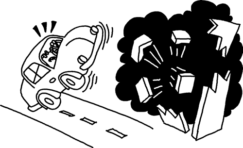

他开车经过了一家甜甜圈店，那家店正在尝试打破世界上最大果冻填充甜甜圈的纪录。不幸的是，面包师傅错误地计算了应该注入甜甜圈的果冻压力，导致了爆炸。

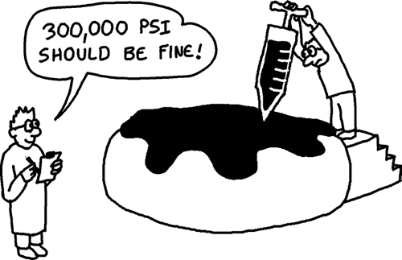

在空中翻滚了一会儿后，克劳利安全着陆，并松了口气，意识到自己没有受伤。然而，这次可怕的经历让他有些震惊，车上也满是果冻。由于他在空中翻滚过，已经迷失了方向，不再知道自己在加密镇的哪个地方。现在他该怎么办？

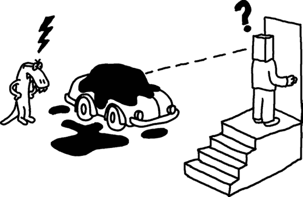

就在这时，佐藤从附近的一栋房子里走了出来。克劳利无意中发现了佐藤神秘住所的所在！

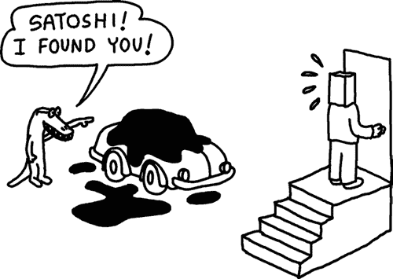

克劳利随后向佐藤解释了发生在他和他车上的事情。听到克劳利迷路了，佐藤既感到担忧，也稍微松了口气，因为这意味着他的住址仍然是个秘密。

克劳利请求佐藤载他回家，或者打电话叫拖车。但佐藤拒绝了，他说：“如果我做了其中一件事，你就能知道自己在加密镇的位置，进而推算出我的秘密住址。幸运的是，我还有一个主意：不如你进我家做客，喝杯咖啡，恢复一下因为今天那场惊魂经历而有些混乱的思绪。我过几个小时就回来，到时候再告诉你如何把你和你的车送回家。”


果然，佐藤过了一会儿后拿着一台 iPod 回到了屋里。“好吧，克劳利，事情是这样。我开着自己的车开到了你家。在这个过程中，我用这台 iPod 记录了我的驾驶过程，每当我做出某个动作时，就在录音中标记出来。比如，当我将方向盘左转 10 度时，我在录音中说了这一点。如果我从 20 英里每小时加速到 40 英里每小时，我也会记录下来。我所做的每一件事，我都会在准确的时间记录下来。”

克劳利这时明白了计划：尽管他的车上覆盖着果冻，无法透过窗户看清楚外面，但他仍然可以根据录音带上的简单指示来操作。毕竟，他的车引擎还正常运转，而且他可以看到车内仪表盘上的速度表。佐藤补充道：“仅凭我在 iPod 上录下的指示，你很难逆向推算出汽车驾驶的精确物理原理。因此，我的家在哪个地方，你永远也不会知道。不过，为了让你更加难以猜出，我还特意绕了一大圈，几乎穿过了整个加密镇，才开到你家！”

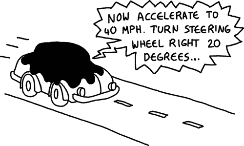

但果然，使用佐藤的 iPod，克劳利能够在看不见车窗外任何事物的情况下将车开回家。他仅仅是跟随指示操作，当录音结束时，他就回到家了。他依然完全不知道佐藤住在哪里，但他奇迹般地避免了撞到行人或其他车辆！


为了感谢佐藤的帮助，克劳利给佐藤发了一封电子邮件，邀请他周六晚上到克劳利家吃千层面，并请他提出一个合适的晚餐时间。下面是佐藤的回信：

谢谢克劳利——晚餐听起来不错，我很喜欢千层面！我们晚上 9:25 见面吧。

哦，为了证明这封邮件是合法的，我可以告诉你，我当时正开车在 Main Street 的 300 号街区，朝北行驶，速度恰好为 38.7 英里每小时，而 iPod 显示的是 9 分钟 25 秒。

作为一个严格验证身份的人，克劳利验证了这个事实：他首先让他的车（仍然覆盖着果冻）被拖到电子邮件中提到的位置，然后在 9 分钟 25 秒时启动了 iPod。按照 iPod 上的指示明确操作，直到完成，他再次走出车外，发现自己已经回到家了！

这个愚蠢的寓言旨在给你大致概述一种创建数字签名的方式：假设佐藤的家庭地址是佐藤的私钥，而克劳利的家庭地址是公钥。iPod 上的指示是一个难以逆向的单向函数。使用这些信息，你可以*签名*任意消息（在本例中为数字*925*，即会议时间）。只有知道私钥的人（佐藤的家庭地址）才能生成这个签名。

正如你所看到的，使用 ECC 时，我们将“绕着城镇开车”，通过在一个特殊的二维曲线上跳跃，从一个点到另一个点，这使得逆向工程这些指令变得更加困难。然而，整个过程仍然大致类似于这个故事中的情节。

#### ***沿直线移动***

在我们开始思考驾驶时如何绕过弯道之前，让我们先用一个更简单的情景，假设是在一条直线上驾驶（见图 7-1）。

如果我们有一条通过原点的直线（即，*x* = 0，*y* = 0 的点），我们可以通过使用两个点 A 和 B 来创建一个新点 C，只需将 A 和 B 相加即可。下面是加法的显而易见公式：

A(*x*[1], *y*[1]) + B(*x*[2], *y*[2]) = C(*x*[3], *y*[3]) *x*[3] = *x*[1] + *x*[2] *y*[3] = *y*[1] + *y*[2]

我们需要将两个 x 坐标相加，得到一个新的*x*（简单地说，1 + 3 = 4），并将两个 y 坐标相加（同样是 1 + 3 = 4）。请注意，我们也可以使用一个简单的几何技巧来生成点 C，而不使用算术：只需从点 B 开始，然后按与点 A 从原点的角度和距离相同的方向移动。

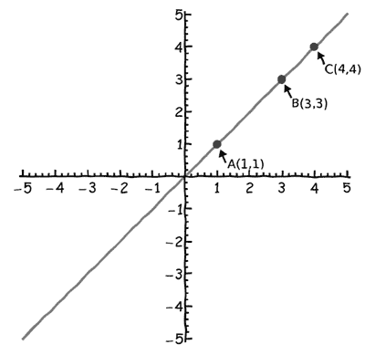

*图 7-1：将直线上的两点（A 和 B）相加得到点 C*

对于直线，这一加法过程非常简单，但对于加密学而言并不有用（同样，对于创建难以逆向工程的“汽车”行驶指令也没有用）。但正如你将看到的，椭圆曲线上的点加法过程是完全不同的。

#### ***椭圆曲线数字签名算法（ECDSA）***

与基于整数因式分解的方案不同，比特币的数字签名是基于椭圆曲线加密（ECC）。尽管整数因式分解在理论上运作良好，但随着计算机的变得更快，以及用于因式分解整数的算法不断改进，逐渐需要使用更大的质因子来确保合理的安全性。RSA 加密使用的推荐加密密钥大小在 1024 位和 4096 位之间。相比之下，椭圆曲线提供相同的功能，但不受整数因式分解技术进步的影响；因此，可以使用更短的密钥（在 ECC 中，256 位密钥被认为提供与 1024 位 RSA 密钥相当的安全性）。简而言之，ECC 被认为比基于整数因式分解的方法在相同密钥长度下更强。

比特币使用椭圆曲线创建数字签名，具体来说，使用一种称为椭圆曲线数字签名算法（ECDSA）的协议。椭圆曲线是任何满足以下方程的二维曲线：

*y*² = *x*³ + *ax* + *b*

一些满足此方程的曲线示例显示在图 7-2 中。公钥/私钥对是通过选择位于这些椭圆曲线上的点来生成的，这些点在数学上是相互关联的。

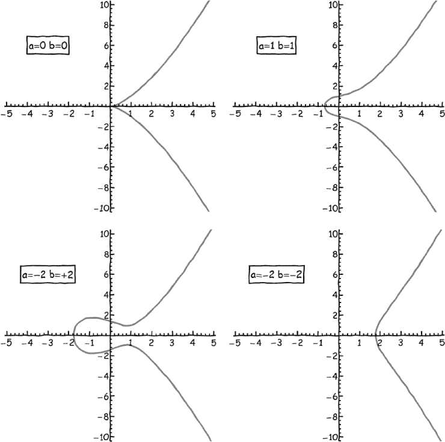

*图 7-2：使用我们起始方程中的不同参数可以生成不同的椭圆曲线。*

与直线的性质一样，当你将曲线上任何两点的坐标相加时，结果是曲线上的另一个点。

然而，在椭圆曲线中，*加法*有特殊含义，定义如下：

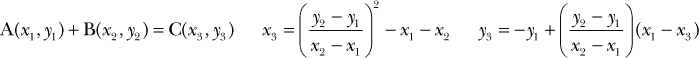

显然，两个点的加法公式比我们用于直线的加法公式要复杂得多。图 7-3 展示了一个示例椭圆曲线，其中有两个点 A 和 B，通过遵循这些加法规则得到的结果点是 C。

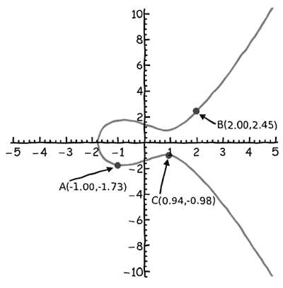

*图 7-3：通过我们特殊的加法方法，将椭圆曲线上的两个点（A 和 B）相加得到点 C。*

在图 7-3 的例子中，点 A 和 B 没有任何特殊之处。选择不同的 A 和 B 点会导致不同的点 C（见图 7-4），这就是使用这种加法进行加密的全部意义：在之前的果冻甜甜圈事件中，克劳利不得不绕远路返回家中，以保持中本聪的住址不被暴露。通过这种加法方法在椭圆曲线上反复跳跃，可以帮助你在数字签名系统中模糊你的私钥，就像你很快会看到的那样。

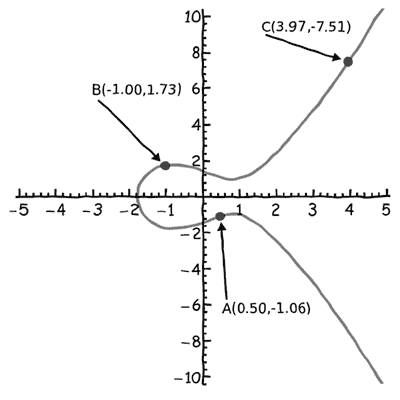

*图 7-4：当选择不同的点 A 和 B 时，会创建不同的点 C。*

类似于直线，你可以使用几何技巧来计算在椭圆曲线上两个点的和（即，无需进行繁琐的算术运算）。只需画一条通过点 A 和 B 的直线，并找到该直线与曲线的另一个交点。然后，从交点处画一条垂直线，看看它还与椭圆曲线相交的其他位置。第二次交点就是点 C（见图 7-5）。

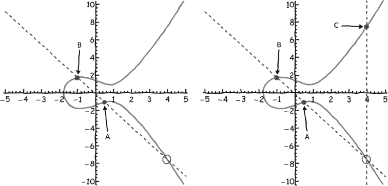

*图 7-5：通过简单的几何方法，你可以通过画一条经过点 A 和 B 的直线，再垂直移动来找到点 C。*

椭圆曲线的一个基本性质是，任何与至少两个点相交的直线也必须与第三个点相交（除了垂直线和与曲线某点相切的线^(6)）。

当然，如果我们想“环绕”我们的椭圆曲线，就像我们在概念性例子中提到的汽车那样，问题就在于我们需要两个点才能生成每个新点：就像汽车一样，理想的情况是从一个点到另一个点，这样我们的“车”就只需在一个地方停留。幸运的是，椭圆曲线也可以通过一种形式的乘法来实现这一点，即将曲线上的一个点与一个整数相乘，这相当于将一个点与自身多次相加。看起来似乎几何技巧在这种情况下不起作用。那么，如果两个点在同一个地方，如何画出一条通过这两个点的直线呢？你可以通过想象当你考虑将两个非常接近的点 A 和 B 相加时发生的情况来猜测：通过 A 和 B 的直线将类似于这些点附近曲线的切线。因此，当我们将 A + A（或者等价地，将 A 乘以 2）时，我们会画出在点 A 处的切线，并找到它与曲线的其他交点。然后，我们像之前一样画一条垂直线，以找到结果点 2A（见图 7-6）。

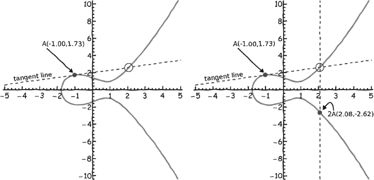

*图 7-6：仅通过一个起始点，我们可以使用通过点 A 的切线将其乘以 2。*

要计算 3A，你首先计算 2A，就像我们刚才做的那样，然后再加上一个 A 就像加两个不重叠的点。在椭圆曲线术语中，计算*k*A，其中*k*是任意整数，称为点乘法。对于大的*k*值，计算*k*A 在没有高效实现的情况下是计算密集型的。

如同我们的概念性例子一样，我们现在将使用点乘法来“驱动”从曲线上的一个点到另一个点。在椭圆曲线加密（ECC）中，点乘法用于从私钥生成公钥。然而，我们的果冻夹心甜甜圈故事与 ECC 实际工作方式之间将有一个重要的区别。在我们的故事中，佐藤的房子代表了私钥，而克劳利的房子代表了公钥，但在 ECC 中，起始点和目标点是*公开*已知的——只有它们之间的路径是保密的。因此，实际上是*路径*是私钥；目标点是公钥（就像之前一样），而起始点只是一个大家一致同意使用的标准位置。在 ECC 中，就好像佐藤的家庭住址广为人知，位于一个非常复杂的迷宫的中心——每个人都知道他住在哪里，但没有人知道如何到达那里。给定一个之前约定的曲线上的点 G 和一个私钥*d*，公钥 Q 通过点乘法计算得出，满足 Q = *d*G。请注意，公钥是曲线上的一个点，而私钥只是一个整数。

到目前为止，我们一直将椭圆曲线描绘为平滑、连续的函数，延伸到无限远。然而，计算机的内存是有限的，不能使用实数作为曲线上点的坐标而不引入舍入误差（在密码学中这是不可接受的）。对于实际应用，只允许使用整数值的椭圆曲线上的点，并且使用模运算将所有点限制在某些边界内（例如，从 0 到 512）。这种只使用整数值点的技术通过一个例子最为形象。让我们首先选择比特币使用的相同椭圆曲线，这条曲线叫做*Koblitz 曲线*（图 7-7），使用参数*a* = 0 和*b* = 7。

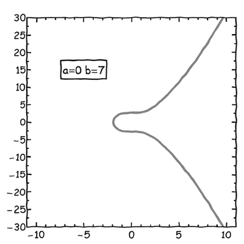

*图 7-7：一个 Koblitz 曲线*

然后我们选择一个质数模*p*，使得椭圆曲线满足这个方程：

*y*² = *x*² + *ax* + *b*(mod*p*)

**注意**

*在这种数学符号中，模运算是在加法之后执行的，所以你首先计算* x*²* + ax + b*，然后对结果执行模* p*运算。*

比特币使用一个非常大的*p*值（具体为*p* = 2²⁵⁶ − 2³² − 2⁹ − 2⁸ − 2^(7) − 2⁶ − 2⁴ − 1），这个值对加密强度非常重要，但我们可以使用一个较小的数字来说明“在 Koblitz 曲线上以整数值的点进行行驶”是如何工作的。让我们选择*p* = 67。事实上，许多曲线都满足模方程（即每一条曲线都可以通过多次加或减*p*到*b*参数；参见图 7-8 中的左图），在这些曲线中，我们可以使用所有具有整数坐标的点（在图 7-8 中作为点显示）。

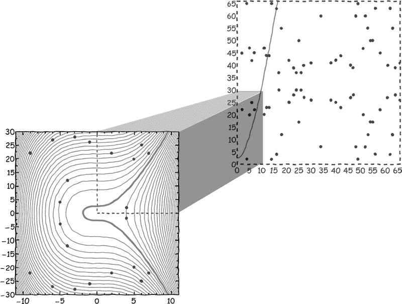

*图 7-8：左边是我们熟悉的椭圆曲线的标准图（粗体曲线），以及通过使用其他倍数的*p*所绘制的附加曲线（细线曲线）。右边是坐标平面的更大部分，扩展了右上象限。这是使用基于整数的 ECC 变种时最方便的曲线部分。*

给定*p* = 67，只有 79 个具有整数坐标的唯一点存在，其中 78 个可以在右上象限找到，满足 0 < *x* < 66 和 0 < *y* < 66（如图 7-8 右图所示；注意左图显示的是整个范围）。唯一点的数量，*n*，被称为曲线的*阶*。第 79 个点是*零*点，它并不在(0,0)处，正如你可能期望的那样，而是位于*y* = 无穷大处。零点非常重要，因为它是加法或点乘法操作的有效输出，因此需要小心处理（请参见“椭圆点加法与点乘法伪代码”中的示例代码，位于第 158 页）。

在我们生成公钥/私钥对之前的最后一步，我们需要选择 79 个点中的一个作为*生成器*点，G。生成器需要具备这样的性质：通过将 G 乘以某个整数*k*，可以计算出其他 78 个点（即，你可以通过计算 G、2G、3G、...、79G 来*生成*每个点）。如果我们选择点(5,47)作为生成器点，我们可以检查通过依次递增*k*，是否能够到达集合中的每一个点（参见图 7-9）。

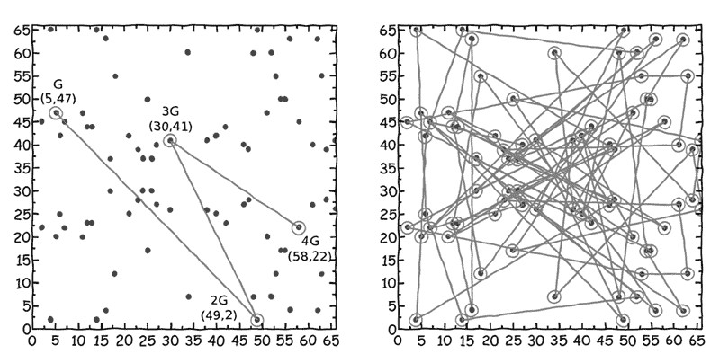

*图 7-9：左边，从点 G 开始，我们连续乘以 G 来生成新的点，分别是 2G、3G 和 4G。右边展示了这种乘法操作继续重复时会发生什么。*

如果曲线的阶是素数（即有素数个点），则除零点外的任何点都可以作为生成点。如果阶不是素数，则无论*k*值如何，某些点只会遍历到部分点（这可能会导致加密强度的下降）。在我们的案例中，我们可以安全地使用点（5,47），因为它可以生成其他所有 78 个点（如图 7-9 所示）。

回到我们概念上的汽车示例，图中的点 G 可能是佐藤的家，点 4G 则可能是克劳利的家。两点之间的部分代表了穿越加密城（Cryptoville）的复杂旅程。在执行点乘运算之前，从 G 到 4G 的路径显然并不直观。4G 中的 4 透露了答案，也就是说，连接这两点的路径可以通过从 G 出发走三步来找到。然而，如果 G 和 4G 被标记为 A 和 B，则可能需要很长时间才能猜出如何从一个点到达另一个点。换句话说，如果你只知道起点和终点（即公钥），则很难猜出路径（即私钥）。但是，如果你知道起点和路径，那么计算终点就很容易了。就比特币而言，这意味着即使某人知道包含你资金的比特币地址（这是基于公钥的），他也无法通过该地址推算出你的私钥来花费这些比特币。

#### ***使用 ECDSA 签署比特币交易***

现在我们已经选择了*p*、*a*、*b*和 G，并确定了阶*n*，我们拥有了创建公钥/私钥对所需的所有信息，可以按照表 7-5 中的步骤进行操作。⁷

**表 7-5：** 使用 ECDSA 创建公钥/私钥对，假设*p* = 67，*a* = 0，*b* = 7，G = (5,47)，*n* = 79

| **步骤** | **说明** | **示例** |
| --- | --- | --- |
| 1 | 生成私钥*d*，它可以是从 1 到(*n* − 1)之间的任何整数。私钥应该难以猜测。可以使用随机数生成器或其他巧妙的方法来生成。^* | *d* = 从 1 到 78 的随机数选择*d* = 13。 |
| 2 | 通过将私钥*d*与生成点 G 进行点乘，生成公钥 Q。请注意，这是一种单向计算。给定 G 和 Q，很难确定*d*的值。 | Q = *d* × G = 13 × (5,47) = (7,22)（见图 7-10） |

* 一种巧妙的生成看似随机但易于记忆的私钥的方法是通过构造一个口令短语（即*克劳利和佐藤坐在树上*），然后将其输入到加密哈希函数中，输出一个整数。这被称为使用脑钱包（brainwallet）。由于比特币使用的曲线上的点数略少于 2²⁵⁶（因为*p*值比我们使用的要大得多），脑钱包可以使用 SHA256 哈希函数（因为它的输出是 256 位的）。

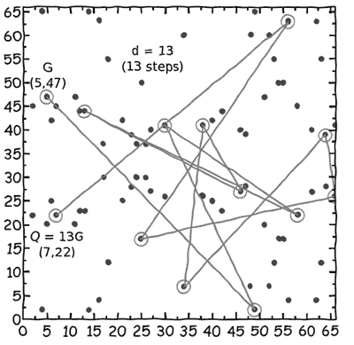

*图 7-10：以下是我们在进行点乘以创建数字签名时“经过”的 13 个点。*

现在让我们来看一下如何使用我们的私钥和公钥（或者比特币交易）来签名消息：接收者需要我们至今为止计算出的所有值，除了私钥，即 *p*、*a*、*b*、G、*n* 和 Q，以验证签名的有效性。假设我们的消息是：*请更新区块链，将 5 个比特币从 Crowley 转给 Satoshi*。签名消息的步骤列在表 7-6 中。

**表 7-6：** 使用 ECDSA 签名消息，假设 *p* = 67，*a* = 0，*b* = 7，G = (5,47)，*n* = 79，*d* = 13

| **步骤** | **指令** | **示例** |
| --- | --- | --- |
| 1 | 计算消息的哈希值 *h*。比特币协议使用 SHA256 函数来实现此目的。哈希的输出需要小于 *n*，因此我们需要计算 *h* = SHA256(*message*) (mod *n*)。 | *h* = SHA256(“请更新区块链，将 5 个比特币从 Crowley 转给 Satoshi”)(mod 79) = 46 |
| 2 | 选择一个介于 1 和(*n* − 1)之间的随机整数 *k*。 | *k* = 从 1 到 78 的随机整数 选择 *k* = 6。 |
| 3 | 计算点 (*r*, *s**) = *k*G。 | (*r*, *s**) = *k* × G = 6 × (5,47) = (46,27) |
| 4 | 找到 *s* 使得 *s* × *k* (mod *n*) = (*h* + (*r* × *d*)) (mod *n*)。签名是数字对 (*r*, *s*)（除非巧合，否则不是椭圆曲线上的点）。 | 左边：*s* × *k* (mod *n*) = *s* × 6 (mod 79) 右边：(*h* + (*r* × *d*)) (mod *n*) = (46 + (46 × 13)) (mod 79) = 12 左边 = 右边，当 *s* = 2 时 |

当消息被签名时，接收者将需要 *p*、*a*、*b*、*n*、G、Q 和签名对 (*r*, *s*)（当然还有消息）。然而，*p*、*a*、*b*、*n* 和 G 是比特币协议的标准参数，因此不需要与每个交易共享。唯一需要共享的特定于您消息的信息是 Q、(*r*, *s*) 和消息。消息接收者可以使用表 7-7 中的步骤来验证您是否用私钥签署了消息。

**表 7-7：** 使用 ECDSA 验证签名，假设接收者得到了 Q = (7,22)，(*r* = 46，*s* = 2) 和消息

| **步骤** | **指令** | **示例** |
| --- | --- | --- |
| 1 | 重复计算消息的哈希值以获得哈希：*h* = SHA256(*message*) (mod *n*) | *h* = SHA256(“请更新区块链，将 5 个比特币从 Crowley 转给 Satoshi”)(mod 79) = 46 |
| 2 | 找到 *w* 使得 *w* × *s* (mod *n*) = 1 (*w* 是 *s* 的 *模逆*)。 | *w* × *s* (mod *n*) = 1 *w* × 2 (mod 79) = 1, *w* → 40 |
| 3 | 计算 *u* = *h* × *w* (mod *n*)。 | *u* = *h* × *w* (mod *n*) = 46 × 40 (mod 79) = 23 |
| 4 | 计算 *v* = *r* × *w* (mod *n*)（如果 *u* 和 *v* 相同，那只是巧合）。 | *v* = *r* × *w* (mod *n*) = 46 × 40 (mod 79) = 23 |
| 5 | 计算 (*tx*,*ty*) = *u*G + *v*Q。 | (*tx*,*ty*) = *u* × G + *v* × Q= 23 × (5,47) + 23 × (7,22)= (11,47) + (2,22) = (46,27) |
| 6 | 如果 *tx* = *r*，则签名有效。 | *tx* = 46, *r* = 46，签名有效 |

在我们的汽车示例中，我们通过将消息与汽车行驶到目的地途中经过的一个点关联，能够以类似的方式*签名消息*。然而，这里是这个类比的局限所在：在汽车示例中，提供汽车行驶路径的某些信息会泄露出一些关于汽车行驶路径的线索，从而稍微泄露了中本聪地址的秘密。使用表 7-7 中的数学公式可以证明，签署一份文档并不会提供任何有用的信息，因而不会泄露私钥。我们可以签署任意多的文档，而私钥将继续保持完全隐匿。

所以，这就是比特币是如何被花费的。当你用私钥签署比特币交易时，比特币网络中的其他节点可以检查你的签名是否有效（通过匹配公钥和交易内容），并安全地确认是你授权了该交易。当然，如果你的私钥落入不法分子之手，别人就可以签署交易并窃取你的比特币。

请注意，直到你真正需要花费比特币时，才需要分享公钥。虽然原则上提前分享公钥在签署交易时应该没有问题，但有可能会发现 ECC 中的某个弱点，攻击者只要有足够的时间和计算能力，就能从公钥推算出私钥（即给定方程 Q = *d*G 中的 G 和 Q，推算出 *d*）。那么，为什么如果不必要要给攻击者额外的时间呢？如果攻击者不知道你的公钥，那么推算出私钥的能力会大大降低。出于这个原因，比特币用户共享的通常是*地址*而不是公钥。

本书前面详细描述的比特币地址实际上是公钥的哈希值，使用 SHA256 和 RIPEMD160 哈希函数生成。首先，将公钥输入 SHA256 哈希函数，然后将输出作为输入传递给 RIPEMD160 哈希函数。最终得到的双重哈希值以标准方式生成比特币地址。^(8) 当你从比特币地址花费比特币时，你必须提供你的公钥，其他人可以通过重复相同的双重哈希计算来检查公钥是否与比特币地址对应（当然，签名证明了你拥有私钥）。

在加密学中，双重哈希方案产生了极其强大的安全性。仅凭一个比特币地址，攻击者想要猜测私钥，需要同时在三种不同的加密方法——SHA256、RIPEMD160 和 ECDSA——中发现弱点。如果其中一种方法发现了弱点，而其他方法没有问题，那么在任何人的比特币面临风险之前，会有时间更新比特币使用的加密方法。

### **比特币加密技术的安全性**

对于那些刚接触比特币的人来说，一个常见的焦虑是，是否比特币所使用的加密技术足够安全，能够抵御威胁。一个拥有强大计算资源的大型政府是否能够破解比特币的加密技术？一个非常聪明的黑客是否能摧毁整个系统？未来的超级强大计算机，比如量子计算机，又如何呢？

这些是当一个人在决定比特币是否是一个稳健的协议以及是否值得投资时，应该有的健康担忧。每个比特币私钥都是介于 1 和 2²⁵⁶之间的一个数字，*理论上*，计算机可以继续生成数十亿次、数万亿次的数字，直到找到一个能够访问你比特币的数字。然而，2²⁵⁶是一个*非常*大的数字；实际上，它大约是 10⁷⁷，即一个后面跟着 77 个零的数字。换个角度看，地球上的原子大约是 10⁵⁰个。如果你随机选择一个地球上的原子，然后再随机选择第二个原子，那么你选择到同一个原子的概率将会*显著*高于随机猜测某人的私钥。

一个基于尚未发明的未来技术的超级强大计算机，能否猜出一个私钥？理论物理学家估算出，执行最简单计算（将 0 变成 1 或反之）所需的最少能量是至少 3 × 10^(−21) 焦耳（这被称为兰道限制^(9)）。一个每次计算都使用这种能量的计算机，理论上将是热力学定律允许的最有效计算机。如果你能够利用太阳的 100%能量（不仅仅是落在地球上的那小部分，而是整个太阳的能量，假设你建造一个完全包围太阳的完美太阳能面板球体），而且没有任何损耗，你理论上每年能够捕获 10³⁴焦耳的能量。如果你用这笔能量持续 100 年，并将所有能量都输入到这个为单一目的（猜测某人比特币私钥）设计的最高效计算机中，它理论上只能执行 10⁵⁵次计算。当然，计算私钥比翻转 0 为 1 要复杂，但即便我们假设这台计算机可以计算 10⁵⁵个私钥，它也会在甚至没有一万亿分之一的机会正确猜中之前就用完能量。

总之，无论未来技术如何发展，物理上是不可能创造出一台通过随机猜测私钥窃取比特币的计算机。然而，这并不能消除一个担忧，即比特币使用的加密方法中可能存在某种弱点。也许像我们想象的那样，通过比特币地址反向推算出私钥并不那么困难。在这里，重要的是要注意，比特币使用的加密方法是政府和大公司用于确保通信、金融交易和网络安全的标准方法。如果比特币所使用的加密方法存在弱点，那么全世界所使用的方法也就存在弱点。

同样，如果发现加密标准存在*弱点*，需要使用新的方法，则可以在不影响比特币功能的前提下更新比特币使用的方法。未来可能会使用 SHA256 算法的新版本，或者 ECDSA 可能会被替换为其他数字签名算法。然而，比特币对加密技术的依赖总体上不会改变。

最终结论是，比特币的加密技术具有坚实的技术基础。如果黑客真的窃取了你的比特币，更可能的情况是，黑客是通过发现*特定实现*中的加密漏洞，或者通过我们讨论过的其他方法（例如通过计算机病毒窃取你的私钥）来实现的。黑客通过发现加密数学原理中的漏洞来窃取你的资金的可能性要小得多。

### **椭圆曲线点加法和点乘法的伪代码**

为了跟随本章早些时候提到的椭圆曲线数字签名示例，你需要能够使用模运算正确地计算椭圆点加法和点乘法操作。以下是这些操作实现的伪代码：

```
Assumptions: p, a, b, G, and n are defined elsewhere
Elliptic curve point summation (ECPS): A + B = C
ECPS(A,B) returns a point on the elliptic curve, C
Begin
    If A is the zero point then return C = B➊
    If B is the zero point then return C = A
    If Ax != Bx then➋
        find inv such that inv*(Bx – Ax) (mod p) == 1
        lambda = (By – Ay)*inv (mod p)
        Cx = lambda² – Ax – Bx
        Cy = -Ay + lambda*(Ax – Cx)
        return C = (Cx (mod p), Cy (mod p))
    If Ax == Bx and Ay != By then return C = the zero point➌
    If Ax == Bx and Ay == By then➍
        find inv such that inv*2Ay (mod p) == 1
        lambda = (3*Ax² + a)*inv (mod p)
        Cx = lambda² – 2Ax
        Cy = -Ay + lambda*(Ax – Cx)
        return C = (Cx (mod p), Cy (mod p))
End

```

在这个椭圆曲线点加法（ECPS）伪代码中，它允许你将椭圆曲线上的两个点相加以生成第三个点，我们首先检查 A 或 B 是否是零点 ➊（回想一下，这是椭圆曲线上的唯一特殊点，本质上位于无限远处）。接下来，我们处理两个点具有不同* x *位置的典型情况，并且我们不需要担心点之间的斜率被零除 ➋。然后，我们处理斜率确实为零的情况，这迫使 C 位于零点 ➌。最后，我们处理 A 和 B 相同的情况，在这种情况下，我们需要使用数学导数来计算 C，通过点的切线来计算 ➍。

```
Elliptic curve point multiplication (ECPM): kA = C
ECPM(k,A) returns a point on the elliptic curve, C
Begin
    C = A
    Do the following k times:
        C = ECPS(C,A)➊
    return C
End

```

对于椭圆曲线乘法，我们只需重复运行 ECPS 函数➊。这是非常低效的！实际上，这种点乘法的方法低效到，已不再是一个“单向”函数。计算公钥（已知私钥）和猜测私钥（已知公钥）同样困难。对于本章使用的少量点，使用我们这种暴力破解的方法是可以的，但在实际应用中，需要采用更高效的点乘法方案。我们将此留作读者的练习。
