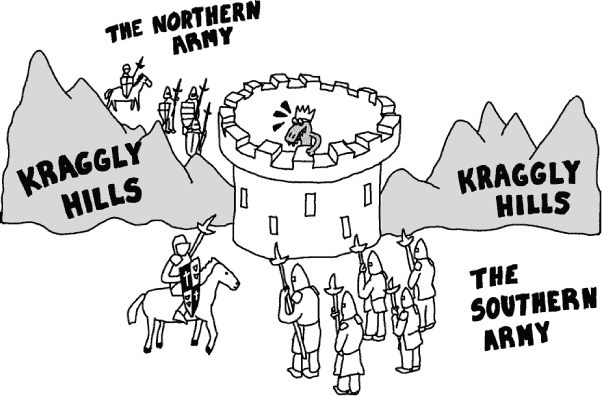
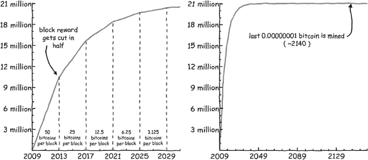
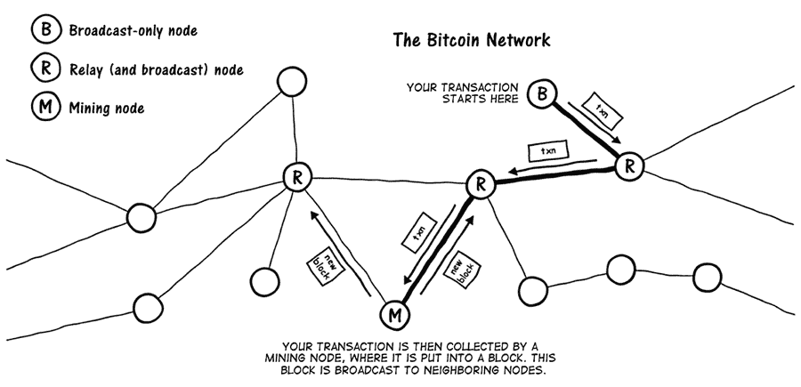
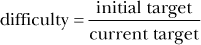
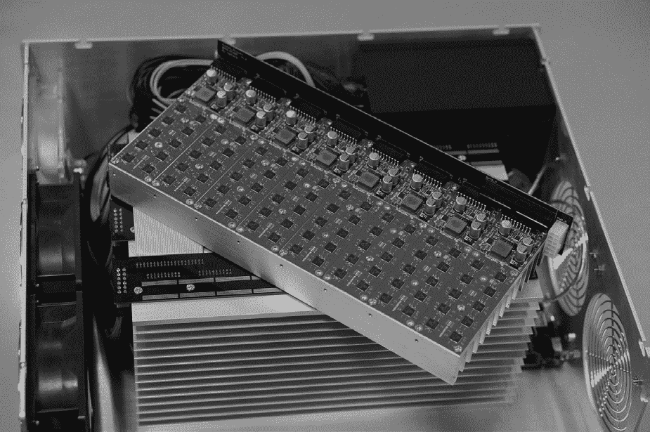
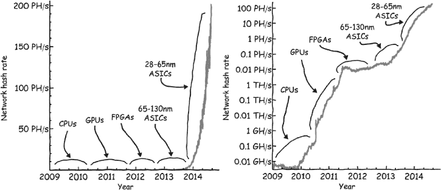
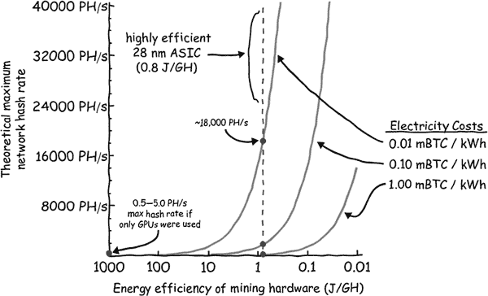
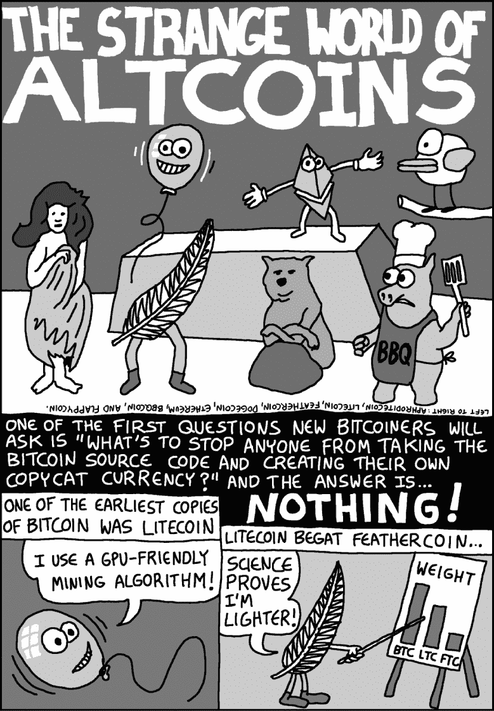
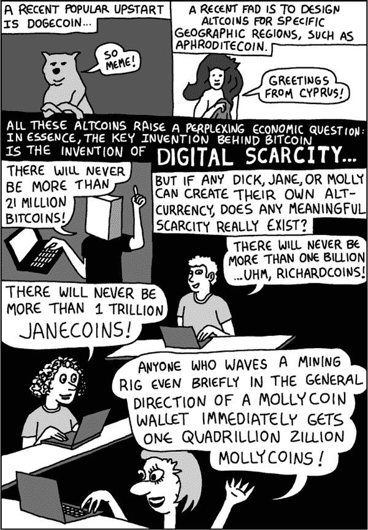
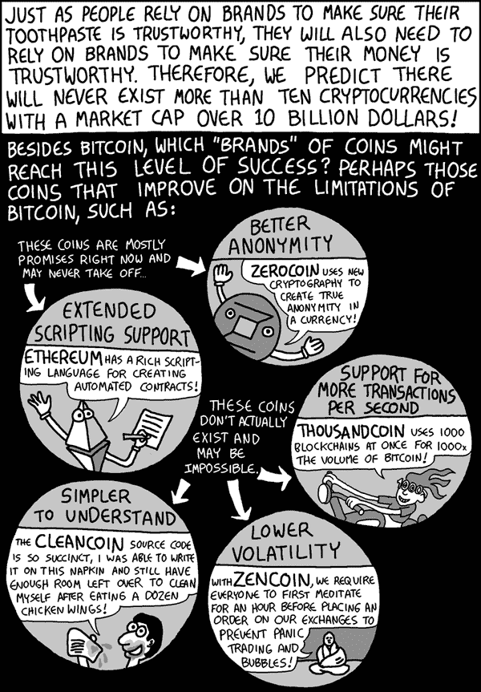

## 第八章：8

**比特币挖矿**

新的比特币是通过比特币挖矿创造的。从某种意义上说，比特币挖矿类似于挖掘黄金：它需要时间和精力——因此才有了“挖矿”这一术语。挖黄金和挖比特币的区别在于，比特币矿工使用电力和计算劳动力，而不是体力劳动。挖矿也是将新的比特币交易添加到区块链或公共账本的过程。通过将一个新的交易区块添加到区块链中，添加该区块的矿工将获得新铸造的比特币（以及作为交易费用的旧比特币）。

每个区块挖掘出的新比特币数量正在逐渐减少，并将继续减少，直到所有 2100 万个比特币被挖掘出来。但与挖掘黄金不同，比特币矿工确切知道剩下多少比特币可以被挖掘。到 2140 年，每一个比特币都会被挖掘出来，并进入流通。

尽管挖掘比特币*潜在地*可能是有利可图的，但并非每个人都适合。从某种意义上来说，就像黄金一样，大多数人，即使他们非常渴望获得黄金，也不会自己去挖掘。类似地，挖掘比特币以获取利润是具有挑战性和风险的。你应该挖比特币吗？可能不应该。在这一章中，我们将探讨其困难和风险，但简短的答案是，决定是否挖比特币就像决定是否挖黄金一样。要想在经济上有意义地挖掘黄金，需要具备高度的专业知识、获取廉价劳动力和电力、筹集（并承担风险！）大量资本，并且等待数年才能看到投资回报。如果你正在阅读这本书，最好把比特币挖掘交给专业人士来做。*然而*，如果你并非为了利润，而是仅仅为了娱乐挖掘（少量）比特币，完全可以这么做！

### 为什么需要比特币挖矿？

每当有人创造一种新货币时，通常会出现一个尴尬的问题：他们需要弄清楚如何分发新铸造的钱。如果是政府创造货币，这个问题很容易解决，因为政府可以直接补偿自己，并用这笔钱支付政府服务。（或者，就像在美国一样，政府可以利用联邦储备和国债承销的复杂方案，最终达到相同的结果，提供联邦政府可以使用的资本，这些资本源自铸币过程。）然而，如果你是在创造像比特币这样的去中心化货币，且没有中央方参与，分发新铸造的钱就变得出奇困难。比特币设计的部分智慧在于，中本聪找到了一个合理的分发比特币的方式。货币将分发给那些愿意进行计算工作来保护网络的人，也就是*矿工*。

由于保护比特币网络需要付出努力、时间和金钱，任何愿意做这项工作的人都应获得金钱奖励。因此，中本聪使用比特币作为矿工激励的策略，作为一种去中心化的机制来*分发*新币，并通过挖矿过程创建了一个致力于保护网络的社区。让我给你讲个小故事，帮助你理解挖矿是如何保护比特币网络的。

#### *两位将军的寓言*

“胖王死了！”他们在国王死后的那天，在加密城镇公国的大街小巷喊道。卡尔国王在平民中不受欢迎，因为他对农民的残忍，唯一能与他的体型相媲美的就是他的暴虐。不幸的是，他的儿子克劳利同一天被加冕为国王，人们认为他极其像父亲。

基于这些原因，北方将军和南方将军联手策划推翻君主制。他们迅速征服了城堡墙外的大部分领土。要解放这个土地免于暴政的唯一任务就是攻占加密城堡！


两位将军的军队聚集在城堡的南北两侧。城堡的东西两侧是克拉格利山脉，这是一片险峻的山脉，悬崖陡峭，历代许多加密城镇的居民都葬身其中。



在城堡的南边，南方的将军惊呼道：“是时候进攻了！我将向北方发送进攻的消息！”然而，接着将军想到，他的信使必须穿越克拉格利山脉。如果途中出了什么差错，导致消息未能传达怎么办？如果发生这种情况，他——南方的将军——就会单独进攻城堡，可能会被敌人击败。于是，南方的将军修改了计划：“我将向北方发送进攻的消息，并要求北方将军回复确认，表示他收到了我的消息！”

当北方的将军收到消息时，他宣称：“太棒了！我们肯定会胜利！我将把确认消息发送到南方。哦，不过，为了确保万无一失，我会让南方的将军回个消息，以确认他收到了我的确认。我当然不想单独进攻城堡。”

收到确认消息后，南方将军断言：“太好了，我们差不多准备好了。现在我只需要等北方发送确认，确认将军收到了我的确认确认。胜利就属于我们——或许是明天！”

那天晚上，克劳利国王的手下悄悄潜入南北营地，在将军们睡觉时将他们暗杀。

#### *将寓言应用于比特币*

在两位将军的故事中，两方需要就一个计划达成共识。然而，他们的沟通方式依赖于不可靠的媒介——必须穿越险峻山脉的信使。因此，他们天真的尝试达成共识，导致了一个关于确认的无限循环，最终导致了他们的灭亡。那么，将军们是否能采用其他策略来协调他们的攻击呢？

这个寓言基于一个古老的数学难题，在比特币存在之前就已经被研究过。这个问题的简短回答是，将军们永远无法百分之百确定另一位将军已经同意参与攻击，这一点可以通过数学证明。^(1)

这个问题的更广泛版本，称为*拜占庭将军问题*，与前面的寓言相同，只不过涉及的不仅仅是两位将军。在这个更广泛的版本中，涉及的不止两支军队，我们不仅可以假设消息是不可靠的，还可以假设其中一位或两位将军可能与克劳利国王暗中合作，向其他将军发送误导性的消息。

这正是一个去中心化的加密货币需要解决的问题：即如何确定通过网络发送的哪些比特币交易是有效的？换句话说，如果两笔冲突的交易通过网络发送，并且涉及相同的比特币，那么应该优先处理哪一笔交易？事实上，比特币为拜占庭将军问题提供了一种概率性解决方案。


本质上，将军们需要挖掘*区块*，这需要大量的计算资源来解决。在这些区块中，他们会指出攻击应发生的确切时间。此外，一旦某位将军发现另一位将军已完成一个区块，这位将军应停止自己创建新的独立区块的努力。相反，每位将军应创建一个包含“我确认同意 ABC 将军区块中的时间”这一信息的区块。然后其他将军应创建自己的区块以链接到这个新区块，并包含“我确认同意 XYZ 将军对 ABC 将军区块中时间的确认。”通过不断重复这个过程，这些区块将形成一个*区块链*，并增强最初区块中建议的时间（即*创世区块*）的权重。这个确切的区块链策略是中本聪在创建比特币后不久描述的。^(2)

然而，关于该算法的描述仍然有一些未解之谜：我们是不是又回到了原点，不断堆积确认，直到无穷无尽？令人惊讶的是，答案是*不*。由于创建区块需要计算工作，每生成一个新块作为对先前区块的确认，就提供了关于整个将军群体拥有的总计算能力的统计信息。因此，当某个创世区块比其他创世区块多积累大约六个确认时，几乎（但不完全）可以确定大多数将军已经达成一致，支持建议的攻击时间。（然而，由于这是一个概率性解决方案，确定性始终略低于 100%，这也是为什么原始的“两将军问题”在纯理论意义上仍被认为没有解决。但是通过中本聪的方法，确定性可以非常接近 100%。）

然而，使用工作量证明和区块链来协调将军们的攻击这一方法仍然存在一个微妙的缺陷：一个懒惰的将军可以通过不使用她的计算机进行挖矿来欺骗网络。由于区块是通过解答挖矿难题随机分配的，任何一个将军都可以在整个过程中保持计算机关闭——节省电力——但仍然从共识中获益。没有人会发现她逃避了责任，因为无论如何，并不是每个参与者都会成功挖到区块。但在比特币的情况下，中本聪有一个天才之处，他加入了一个额外的细节来解决这个“搭便车”问题：系统会用比特币作为奖励支付给矿工！通过支付丰厚的奖励，比特币网络始终保持着足够数量的矿工，这在没有内建货币的拜占庭将军问题的简单解法中是无法实现的。

现在你已经对比特币挖矿及其重要性有了很好的概念理解，接下来我们将深入探讨比特币挖矿是如何帮助防止网络攻击以及如何促进新货币的分发。

#### *通过挖矿防止攻击*

挖矿是如何防止攻击的？在设计一个点对点支付网络时，创建者必须假设网络中的一些节点会试图欺骗其他节点，而且网络中的所有节点都会按自己的利益行事。那么，比特币网络可能出现什么问题呢？一个明显的问题是有人可能会创建一个交易，将自己分配一百万个比特币。然而，由于所有比特币账户的公共记录存在于区块链中，任何人都可以轻易识别出某人在试图把自己没有的钱转给自己；除非一个人能提供一个有效的签名，证明交易中使用的比特币地址包含一百万个比特币，否则比特币网络中的其他节点将不会接受这个交易。

然而，更难以发现的问题是，当一个节点创建一个账本，其中包含一笔消费自己比特币的交易（她可以为此创建数字签名），然后产生第二个账本，在这个账本中这些比特币没有被消费（或者被发送到其他人）。一个恶意节点可以先在区块链中添加一笔交易，将比特币发送给你，然后在你给她一些有价值的东西（例如，一块蛋糕）后，她可能会创建一个新的账本，其中这笔交易根本不存在。第二个账本将与第一个账本发生冲突，因此这种滥用行为肯定不会被忽视，但也无法明确知道哪个账本是正确的。可以推测，第一个账本是正确的，任何随后创建的与之冲突的账本都是无效的（毕竟，你已经把蛋糕给了她）。但是网络中的节点可能会对哪个账本先出现产生分歧（尤其是那些具有恶意意图的节点），而且没有中央权威，谁来判断哪些节点是正确的呢？比特币挖矿解决了交易排序的问题，让每个人都能达成共识，知道哪些交易先发生。

每个比特币用户不断从网络中的其他用户那里接收区块。这些区块可能属于比特币区块链中不同的、相互竞争的分支，因此代表着*真实账本*的冲突版本。因此，运行在每个用户计算机上的软件会不断评估网络上出现的区块，并决定哪个区块最可信，最有可能成为未来被接受的区块链的一部分。它是如何做出决策的呢？

它简单地选择包含最多区块的那个（即，最长的区块链）。这被认为是最旧的，因此最先出现。一个包含 12 个区块的区块链比包含 7 个区块的区块链存在得更久。然而，这种决定信任哪个链的方法只有在恶意节点不能创建第二个账本、立刻向其添加 10 个（或更多）区块并使其看起来像第二个账本早于第一个的情况下才能奏效。

因此，比特币软件会检查在竞争分支中添加每个区块所需要的计算工作量。用来添加区块的工作量是容易验证的（他们称之为工作量证明算法，因为你可以证明你做了这项工作）。具有“最多工作量”的分支通常是最长的那个（即，包含最多区块的那个），但是如果有人通过创建一个包含大量“简单”区块的长分支来作弊，那么它不会被算作有效。为了让恶意节点创建第二个账本、删除他旧的交易并说服其他人他的账本是第一个，他必须*比网络的其余部分更快地添加区块*。实现这种欺诈的唯一方式是私下控制比整个比特币网络还多的计算能力。这种滥用被称为*51%攻击*，而且有充分的理由解释为什么它从未发生过。

执行 51%攻击的唯一方式是比网络中其他所有人加起来更大规模地投资比特币挖矿，而获得的唯一优势是能够*双重消费*自己的比特币。但这样做的奖励是有限的：这种攻击将削弱人们对比特币系统的信任，攻击者的比特币也会贬值。

假设有一个恶意攻击者决定进行这样的投资。那么，什么更具利润：滥用账本还是收集挖矿奖励？比特币挖矿的经济激励强烈支持后者。因此，如果有人确实积累了滥用系统的能力，唯一的经济优势将是诚实地使用这种能力，并且简单地比其他人更好地挖矿比特币。

#### *通过挖矿分发新货币*

正如本章开始时提到的，除了正确地排序交易外，比特币挖矿还作为一种分发新数字货币的机制。创造一种新货币并广泛分发并不是一件容易的事。中本聪本可以最初将 2100 万个比特币分配给自己，然后随意发放。但那样的话会显得有些随机，最有可能的是无法创造出一种有意义、有价值的货币。

由于比特币的设计目标是有限供应的货币，矿工不能无限期地生成新的比特币。这意味着中本聪需要以某种方式选择一个时间点，到那时所有比特币将被生成。如果所有比特币都在比特币的第一年就被生成出来，这种货币将过于偏向早期采用者。相反，如果比特币生成得太慢，新的参与者可能没有足够的动力去冒险并将他们的计算能力投入到这个名为比特币的新奇项目中。而且，如果比特币生成得如此缓慢，以至于需要数千年才能挖完所有比特币，那么比特币可能不会被视为有限的商品，而是作为一种供应不断膨胀的资产。无论是好是坏，中本聪选择了一种方案，根据该方案，比特币将在一个世纪的时间里分发，每四年大约减半一次，直到总量最终达到 2100 万（见图 8-1）。



*图 8-1：比特币随时间的奖励变化：左侧图表显示了比特币奖励的计划，直到 2031 年。右侧图表将时间范围延伸至 2169 年。*

左侧图表显示了直到 2031 年，比特币的总流通量。正如你所看到的，流通中的比特币数量持续增加，但增速随着时间的推移变慢，因为区块奖励会在固定的时间间隔内减半。因此，矿工每隔几分钟获得的比特币数量（她在挖矿竞赛中获胜时）在未来几年将会大幅减少。

到 2031 年，约 2100 万个比特币将几乎全部分发完毕。然而，少量的比特币将会在那之后继续分发。右侧的图表展示了直到 2169 年的分发计划。比特币在前五年内的成功表明，中本聪在估算比特币分发速度时至少是对的。

当所有比特币都被挖掘完后，比特币挖矿将不再具有分发的目的；而仅仅成为一个安全处理交易的机制。

那时人们还会继续挖比特币吗？公共账本会发生什么？在比特币全部挖完后，作为比特币矿工的奖励将不再是新生成的比特币，而仅仅是用户支付的交易费用（这些费用未来几年可能会相当可观）。

### 比特币挖矿是如何工作的？

比特币涉及一个遍布全球的计算机网络，这些计算机不断地相互广播和转发新的交易。该网络中的每台计算机都是一个*节点*。由于比特币的去中心化性质，一些节点可能会在随机的时间出现或消失，而不会影响整个网络。不存在特别的中央节点。

节点可以分为三类：仅广播交易的节点；广播并转发交易的节点；以及广播、转发并创建带有交易的新区块的节点。每种类型的节点都需要比上一类节点更多的计算资源。三者中的最后一种包括比特币矿工节点，需要最强大的计算机。

当一个比特币节点启动时（即当你在计算机上启动比特币软件时），它通过互联网连接到其他节点，形成一个有些杂乱无章（但也很强健）的*网状网络*。网状网络没有中央节点来管理流量。相反，所有节点平等地共享跨网络传播信息的责任。

图 8-2 展示了比特币网状网络的一个小片段可能的样子。



*图 8-2：比特币网络的概念图。圆圈代表节点，所有节点通过网络连接（用线条表示）与其他节点随机连接。交易和新挖出的区块持续通过这个网络进行广播。*

在这张图中，你可以看到例如当你用比特币购买一杯咖啡时会发生什么。你很可能会通过手机进行操作，并且运行的是最基本类型的节点——*仅广播节点*（图中顶部标记为*B*的圆圈）。交易步骤如下：

1\. 启动节点（你的手机）创建一个交易，将你的比特币转移到咖啡店拥有的比特币地址。然后，这个节点会立即将该交易发送到网状网络中的同伴节点，这些节点很可能是转发节点。

2. *中继节点*只是将这个交易传播到其他中继节点，允许交易迅速传播到网络的每个角落并被每个人接收。实际上，这并不像看起来那么简单，因为中继节点需要提防恶意或垃圾交易：如果一个中继节点只是转发任何消息，比特币网络将迅速在大量垃圾交易中崩溃。因此，所有中继节点会检查交易的格式是否正确，确保其具有有效的签名，并查阅最新版本的区块链，以确保交易所花费的资金确实在源账户中可用。

3. 如果交易通过验证，它将在几秒钟内到达网络上的所有*矿工节点*。这些矿工节点将此交易加入一个初步的区块中，并会尝试进行挖矿（我们稍后会更详细地描述这个过程）。

4. 如果挖矿成功，新挖出的区块将会被广播到整个网络，确认该区块的交易并给予矿工矿工奖励。虽然通常需要几分钟的时间来挖掘一个区块，但一旦区块被发现，它将在几秒钟内遍布整个网络。

最终，每一笔交易必须被记录在区块链上。因此，只有广播的节点必须直接与矿工节点连接，或者通过中继节点间接连接。矿工节点还可能对交易应用特定的任意标准，例如偏好那些交易手续费较高的交易。如果手续费过低，某些矿工（或中继节点）可能会忽略该交易。然而，仅仅因为一些节点忽略了交易，并不意味着其他节点也会忽略：只要交易找到了接受它的矿工节点，这笔交易最终会被加入到区块链中。通常，矿工节点会尽量收集尽可能多的交易（以收取更多的手续费）。虽然每笔交易附带的手续费很小，但一个区块中可以包含成千上万笔交易，这些手续费的总和，支付给矿工的金额可能是可观的。但由于内存限制，^(4)每个区块可以包含的交易数量有一个最大限制。因此，一些矿工会排除那些手续费过低（或为零）的交易。

尽管所有矿工节点都收集交易并将其整理成区块，但只有一个节点（幸运的那个）将其区块添加到区块链中。^(5) 幸运的矿工随后会收集到矿工奖励，这个奖励包括区块奖励（每个区块中新铸造的比特币）和所有新增区块的交易手续费。中继交易的节点和没有添加区块的矿工不会从交易手续费或其他途径获得任何比特币。

一旦幸运的矿工被选中，新区块就会广播到网络的其余部分，所有其他矿工节点将停止处理他们的旧区块，开始处理一个新的区块。那么，幸运的节点是如何决定的呢？它是通过找到 SHA256 哈希函数的一个特殊输入来*解决区块*的节点。

#### *矿工如何解决区块*

比特币挖矿需要大量的计算能力，但矿工们到底计算什么？他们反复计算某些信息（称为*区块头*）的双重 SHA256 哈希^(6)，这些信息在他们的新区块中会有所变化。当创建一个交易区块时，区块头包含了有关该区块的信息摘要，包括创建时间、区块内交易的哈希值和其他数据，我们稍后将详细探讨。重要的是，区块头中有一个字段用于存储一个任意数字，称为*随机数*^(7)，由矿工选择。事实上，这个数字*是区块中唯一完全由矿工控制的部分*。那么矿工是如何选择这个随机数值的呢？

一个已解决的区块（即一个将被其他节点接受为区块链一部分，并且矿工会因此获得报酬的区块）出现在区块头的双重 SHA256 哈希结果小于某个预定阈值时，这个阈值被称为*难度目标*。如果结果大于目标，区块就保持未解决状态。此时，矿工必须尝试不同的随机数，这个随机数包含在区块头中，因此影响哈希值。因为加密哈希函数在输入变化即使是最微小的情况下也会产生完全不同的输出，所以更改随机数值会导致整个区块头的哈希发生彻底变化。通过不断更改随机数值，最终会找到一个小于目标值的哈希输出。通常，矿工会在这个过程中将随机数递增 1，直到找到一个成功的随机数值。当找到有效的随机数时，区块就解决了。^(8)

#### *区块的结构*

让我们更详细地看看区块的结构，以便你能理解矿工的操作如何融入整个过程。从顶层来看，一个比特币区块基本上有四个部分：

```
 Anatomy of a Block
➊ blocksize (e.g., 868 KB)
➋ block header (see below)
➌ transaction count (e.g., 1,278)
➍ list of transactions

```

*区块大小*是区块顶部的一个数字，表示整个区块的大小➊。紧随其后的是区块头➋，我们稍后会详细讨论。区块的其余部分存储了交易数量➌，然后是所有交易的列表➍。其中之一是区块奖励，矿工将其添加到区块中以自己分配一些新的比特币。这些比特币是凭空创造的。所有现存的比特币最初都起源于这样的区块奖励。

包括随机数➏在内，区块头由六个数据部分组成：

```
 Block header structure
➊ bitcoin version number
➋ double SHA256 hash of the previous block header
➌ double SHA256 hash of all of the transactions in the block
➍ current timestamp
➎ the difficulty target
➏ the nonce

```

在顶部是一个版本号 ➊。它的存在是为了便于在未来比特币区块链结构发生重大变化时区分旧版和新版区块，因为比特币在不断完善。接下来，区块头包含前一个区块头的哈希值 ➋。这是一个非常重要的字段，因为这个值将区块串联成链：当矿工挖掘一个区块时，他们不仅在确保自己区块中的交易，还在确保构成当前链版本的所有先前区块中的交易。通过创建这个区块，矿工实际上是在投下一个票，声明：“我相信这是所有比特币交易的真实历史，我的区块是在其他矿工的工作基础上建立的，正如前一个矿工区块的哈希所示。”

接下来，头部包含当前区块中所有交易的哈希值 ➌。当比特币网络中的一个节点从其他节点接收到一个区块时，这个哈希值使它们能够验证区块中的交易是否被篡改；交易的哈希值必须与该字段中的值完全匹配。

随后，一个时间戳 ➍ 表示区块的创建时间。大多数情况下，比特币忽略现实世界的时间。事实上，在区块链中挖矿区块可以被看作是一个原始的顺序时钟，这个时钟通过新挖掘的区块的*滴答*声来表示，比特币唯一考虑的时间概念就是这个时钟的滴答。

然而，设置区块难度是比特币需要识别现实世界时间的一个特定实例。区块难度 ➎ 是通过前一个区块的时间戳定期计算的，也是区块头的一部分。因为比特币的设计是大约每 10 分钟解决一个新区块，所以它需要一种方法来衡量区块之间在最近过去的间隔时间，这就是时间戳字段存在的原因。如果比特币的难度不基于现实世界的时间定期调整，其区块速率将取决于该货币的流行度。因此，如果比特币变得过于流行或不够流行，网络可能会变得不稳定。在这两种情况下，区块速率将变得不合理，比特币网络将不再正常运行。

那么，难度目标值是如何决定的呢？当比特币创建时，目标被设置为这个特定的*简单*数字：

26959535291011309493156476344723991336010898738574164086137773096960

≈ 2.7 × 10⁶⁷ 或 2²²⁴

为了更好地理解这个值，SHA256 哈希函数输出的值介于 0 和 2²⁵⁶ 之间（约 1.16 × 10⁷⁷），而这个目标要求输出必须小于 2²²⁴（大约是最大输出的十亿分之一）。这类似于要求一个生成 0 到 1 之间值的随机数生成器必须输出小于 0.000000001 的数字，才能解决一个区块。这个目标值是比特币使用过的*最容易*的值。在 2009 年，大多数普通个人计算机每秒可以计算大约 100 万次哈希，也就是 1 兆哈希每秒（MH/s）。因为哈希小于这个目标值的几率是十亿分之一，1 MH/s 的计算机大约需要 1,000 秒（约 17 分钟）才能有较大的机会^(9)解决一个区块。

如果一台更快的计算机开始以 2 MH/s 的速度进行挖矿，目标值会自动降低，以减少找到区块的几率（从而使得时间变得更长）。区块链头部存储的难度表示为比特币（最初启动时使用的）初始目标与当前目标之间的比率。最初，难度等于 1（因为最初的目标*就是*当前的目标），此后它大部分时间在增加。如果哈希率下降（例如，由于计算机退出网络），以致于区块的发现速度比十分钟平均速度更慢，难度会下降（在比特币的前五年里，这种情况发生得非常少）。

正如你所看到的，目标数值非常大且不易操作。因此，在讨论比特币挖矿时，通常会计算一个*难度*，即当前目标数值与中本聪创世区块上的目标数值之间的比率：



难度并不会立即根据哈希率的增加或减少而调整。相反，难度每当区块链增长 2,016 个区块时才会调整，这大约每两周发生一次（2,016 × 10 分钟 = 14 天）。如果挖出 2,016 个区块的时间少于两周，难度会增加；但如果超过两周，难度会减少。

在最初的五年里，比特币的挖矿难度从 1 增加到了超过 500 亿。在这个难度下，一台普通的个人计算机（如平板电脑、笔记本电脑等）要解决一个区块可能需要每 350 万年才有一次机会！这个难度对应的网络哈希率约为 360,000,000,000 MH/s，或 360 拍哈希每秒（PH/s）。全球所有传统超级计算机的哈希率加起来都不到 1 PH/s。

用于比特币挖矿的计算能力的惊人增长来源于更广泛的应用和越来越专业化的硬件的使用。在第一年，大多数矿工使用他们笔记本电脑上的 CPU 来挖掘比特币。后来，人们意识到他们可以重新利用原本为要求较高的电脑游戏设计的显卡来挖掘比特币。这些显卡，特别是其中的图形处理单元（GPU），比 CPU 快了数千倍且更加节能。不久之后，硬件开发者发现，他们可以使用现场可编程门阵列（FPGA），这是一种用于计算机芯片原型开发的专业设备，来比 GPU 更快地挖掘比特币。直到这一点，没人专门制造用于挖掘比特币的硬件。GPU 和 FPGA 是现成的硬件，只是被重新用于比特币挖矿。然而，当比特币经济变得庞大时，计算机芯片开发者开始觉得制造*专用集成电路（ASIC）*来挖掘比特币是值得的，就像图 8-3 中的那种。



*图 8-3：Avalon 公司的一台早期 ASIC 比特币挖矿机。排列成网格的小芯片是每个定制的 ASIC 芯片，旨在执行比特币哈希操作。*

这些单一用途的计算机芯片是专门为以最快、最节能的方式挖掘比特币而制造的。比特币 ASIC 被优化用于计算 SHA256 哈希。如今，几乎所有比特币挖矿都是使用基于 ASIC 的硬件完成的。通过设计具有越来越小特征（从 130 纳米到 65 纳米，再到 28 纳米等）的芯片，速度和效率不断提升。因此，每单位面积上可以进行更多的计算。硬件性能的每一次突破都会导致网络哈希率按数量级增加（见图 8-4），尤其是在比特币价格上涨的同时（进一步证明了对挖矿硬件的资本投资是合理的）。



*图 8-4：比特币网络上随着时间推移执行的计算量（以太哈希为单位，或每秒万亿次哈希）。左侧的图表使用传统的线性坐标系，2013 年 ASIC 矿工的巨大计算能力使得所有先前的挖矿方法相形见绌。右侧图表则使用对数坐标系来显示网络的哈希率，这使得我们可以更清晰地看到网络计算能力的进展，从 CPU，到 GPU，再到 FPGA，最后到 ASIC 挖矿。*

在 50 亿的难度下，一台能够达到 10 TH/s 的比特币矿机大约每 8 个月才能找到一个区块，这是平均时间，且波动性可能非常大。对于那些希望获得更稳定收入的比特币矿工来说，最好的做法是与其他矿工联合挖矿，这种方式被称为联合挖矿。

#### *联合挖矿*

尽管网络每大约 10 分钟就会解决一个区块，但个体矿工可能几个月才会解决一个区块。面对如此不可预测的收入流，规划和运营比特币挖矿可能会非常困难。为了让奖励更加规律和可预测，大多数没有控制巨大计算能力（即，占网络哈希率超过 1%）的矿工都会加入矿池。

*矿池*是指矿工们将计算资源集中起来，共同挖掘并分配区块奖励。从网络的角度来看，矿池是一个单一的矿工节点，但实际上，成百上千的个体矿工正在该节点内计算哈希。矿池的解决区块频率高于单个矿工；因此，矿工的收入更为频繁。当区块奖励在矿工之间分配时，通常会根据每个矿工贡献的哈希数量按比例分配。由于很难准确知道每个矿工贡献了多少哈希，通常会用计算出的*股份*来衡量贡献。虽然每个矿池的具体细节不同，但当矿工计算出一个小于真实目标、容易达到的哈希时，就会获得一份股份。因此，个体矿工可能需要多年才能找到一个小于真实目标的哈希，而只需几分钟就能找到一个小于矿池股份目标的哈希。矿工累积的股份数量代表了他为矿池贡献了多少算力。

通过使用矿池，一位普通的比特币用户可以尝试挖矿，并通过中等功率的计算设备（例如，可以插入 USB 接口的廉价比特币 ASIC 矿机）收集少量比特币。尽管考虑到电力成本，这可能不会带来盈利，但通过为网络贡献计算能力，积累一些微比特币还是很有趣的。

### 比特币挖矿盈利

你应该挖比特币吗？简而言之，可能不应该。比特币挖矿需要大量的计算能力，这需要电力、昂贵的硬件和空间。你的投资回报将严重依赖于其他矿工的数量以及他们提供的计算能力。因为网络分发的比特币数量不受矿工数量的影响，矿工越多，奖励就会越稀释。^(10) 比特币挖矿只对那些拥有最有效硬件（无论是能源还是资本效率）的矿工有利，且电力成本最低。由于硬件制造商每台挖矿设备的资本成本最低，许多盈利的比特币挖矿公司自己制造硬件。这些制造商还可能雇佣自己的研发工程师设计更新、更高效的计算芯片（即 ASICs）用于比特币挖矿。总而言之，比特币挖矿是一个极具竞争力的行业，并且随着比特币的普及，可能会变得更加竞争。

或许如果你拥有自己的风力发电场或太阳能电池板阵列，并且有更多的电力，不知道如何使用，你*可能*能够通过比特币挖矿获利。但这仍然需要仔细考虑资本成本和与直接购买比特币相比的机会成本。评估比特币挖矿项目可行性的常见错误是过于看重汇率（无论你使用的是哪种货币）。你应该始终将比特币挖矿的回报与你为相同的初始投资可以购买的比特币数量进行比较。未来的汇率对你的投资决策几乎不应有任何影响。如果今天在比特币价格为每个$200 时，挖矿没有盈利，那么明天即使价格涨到每个$1,000，也无所谓；你应该直接购买比特币，而不是挖矿。

合理预测未来的哈希率也很重要。虽然不可能准确预测未来，但比特币网络的哈希率在比特币的前 10 年里很可能会迅速增加。^(11) 请看下面的示例计算，记住即使挖矿比直接购买比特币更有利可图，挖矿仍然需要付出更多的努力！

```

Example calculation: To mine or to buy?
Equipment: One super-duper-hashing-miner made by Miners-R-Us
      Hash rate: 1 TH/s
      Power consumption: 0.4 kW
      Price: 5 BTC (includes shipping)
Local electricity cost: 0.001 BTC/kWh → monthly power costs: 0.30 BTC
Current difficulty: 4 billion
Time to solve a block   = difficulty * 2³² / (hash rate)
                        = 4 billion * 2³² / 1 TH/s = 6.5 months per block
                        (0.153 blocks per month)
New bitcoins per block = 25 BTC
Avg. transaction fees per block = 0.5 BTC
Total mining reward per block = 25.5 BTC
Revenue per month = Total mining reward per block * blocks per month
                  = 25.5 BTC * 0.153 = 3.92 BTC

Scenario #1 – Difficulty increases by 100% per month
Month 1: Rev. = 3.92 BTC, Power costs = 0.30 BTC, Monthly profit = 3.62 BTC
Month 2: Rev. = 1.96 BTC, Power costs = 0.30 BTC, Monthly profit = 1.66 BTC
Month 3: Rev. = 0.98 BTC, Power costs = 0.30 BTC, Monthly profit = 0.68 BTC
Month 4: Rev. = 0.49 BTC, Power costs = 0.30 BTC, Monthly profit = 0.19 BTC
Month 5: (Power costs exceed revenue → turn off mining device!)
Total profits: 3.62 + 1.66 + 0.68 + 0.19 – 5 = 1.15 BTC (mining is profitable)

Scenario #2 – Difficulty increases by 200% per month
Month 1: Rev. = 3.92 BTC, Power costs = 0.30 BTC, Monthly profit = 3.62 BTC
Month 2: Rev. = 1.31 BTC, Power costs = 0.30 BTC, Monthly profit = 1.01 BTC
Month 3: Rev. = 0.44 BTC, Power costs = 0.30 BTC, Monthly profit = 0.14 BTC
Month 4: (Power costs exceed revenue → turn off mining device!)
Total profits: 3.62 + 1.01 + 0.14 – 5 = -0.24 BTC (better to just buy bitcoins)

```

如果你决定购买比特币挖矿硬件，要小心。任何出售比特币挖矿硬件的人都已经计算出，卖给你比自己使用硬件挖矿更有利可图。仔细研究供应商、硬件细节和运输时间。比预期晚几个月收到挖矿设备，可能意味着你的投资回报是正向还是负向的差别（因为网络哈希率将更高）。

### 理论哈希率极限

随着计算机性能变得更强大且能效更高，尤其是如果比特币的采纳继续呈指数增长，预计网络的哈希率将显著增长。它能增长到多高？如果越来越多的计算机开始挖矿，并且比特币的价格保持不变，^(12)最终每个矿工获得的比特币将无法覆盖电力成本。最终，可以认为网络哈希率的上限取决于挖矿硬件的能效（参见表 8-1）。

**表 8-1：** 不同类型比特币挖矿硬件的能效（计算为哈希率与功耗的比值）^*

| **挖矿设备** | **哈希率（GH/s）** | **功率（W）** | **每哈希能量（J/GH）** |
| --- | --- | --- | --- |
| **单核 CPU 的笔记本** | 0.0005 | 100 | 200,000 |
| **高效四核 CPU 的笔记本** | 0.02 | 50 | 2,500 |
| **中端 GPU（400 核心）** | 0.1 | 200 | 2,000 |
| **高端 GPU（2000+核心）** | 0.5 | 300 | 600 |
| **高端 FPGA** | 0.8 | 40 | 50 |
| **130 纳米 ASIC 设备** | 10.0 | 80 | 8 |
| **65 纳米 ASIC 设备** | 60 | 240 | 4 |
| **28 纳米 ASIC 设备** | 1,000 | 800 | 0.8 |

*数值代表典型挖矿设备；具体设计可能会有显著差异。*

要确定使用某种类型的硬件进行比特币挖矿是否盈利，我们必须结合三个因素：硬件的能效、电力成本和网络的总体哈希率。图 8-5 中的图表展示了这三个因素之间的关系。

图表中的曲线显示了考虑电力成本后硬件需要多先进。右侧的线条表示电力成本较高的情况。显然，如果电力成本更高，你需要更先进的硬件配置才能在挖矿中盈利。在这种情况下，*更先进的硬件*是指每消耗一焦耳能量所需的电力较少的硬件。



*图 8-5：用于比较硬件效率、电力成本和比特币网络哈希率的盈利性阈值曲线。根据你当前的电力成本，可以绘制出一条曲线，表明你的挖矿硬件（以 J/GH 为单位）在某一网络哈希率下需要达到的效率，以实现盈利。如果你能绘制出一条低于*你电力成本曲线的点，那么你就能够在比特币网络上盈利性地进行挖矿。*

如果比特币的价值增加，电力的相对成本降低，那么网络哈希率的盈亏平衡点将增加。如果一台挖矿设备的能效为 0.8 J/GH，电力成本仅为每千瓦时 0.01 mBTC，那么挖矿不再可行的网络哈希率将为 18,000 PH/s，相应的难度为 2.5 万亿。那么，哈希率是否可能超越目前的水平呢？

表 8-1 中的 ASIC 设计显示，随着特征尺寸的减小，每个哈希的能耗会降低。如果我们假设未来存在高效能的 14 纳米 ASIC，仅消耗 0.1 J/GH，那么在 0.01 mBTC/kWh 的情况下，盈亏平衡的哈希率将超过 100,000 PH/s。虽然目前还没有小于 14 纳米尺寸的计算机芯片，但摩尔定律^(13)一直在挑战怀疑论者的预测，即计算机芯片已经达到了最小的特征尺寸。显然，网络的哈希率有可能远远超过今天的水平。

### 比特币挖矿中的去中心化

比特币的成功依赖于它作为一个去中心化网络的特性。在比特币的初期，任何人都可以作为挖矿节点加入比特币网络；然而，现在挖矿主要由那些拥有资源、专业知识和资本的专业人士进行，这些资源和能力是普通人无法企及的。这一趋势是否在*重新中心化*比特币？这是比特币用户、矿工和开发者之间的一个辩论话题。

另一个我们尚未详细讨论的相关话题是每个区块可以包含的交易数量的限制。显然，存在一个真实的物理限制，即一个区块中不可能包含无限多的交易。然而，比特币协议中规定了一个较小的规则性限制（即，尽管物理限制可能在每个区块数百万笔交易的范围内，但规则性限制则在数千笔交易的范围内）。这一自我设限的最初目的是^(14)防止区块链被无意义的交易（即垃圾邮件）膨胀，但也有人认为这一限制有更大的作用，那就是保持去中心化。

除了拥有能够快速执行 SHA256 哈希计算的计算设备外，挖矿节点*和*中继节点还必须具备足够的存储空间来存储区块链的完整副本。如果构成区块链的区块变得比现在大得多，不仅矿工们需要更快的计算机，他们的系统也需要具备存储大量数据的能力（可能以大型数据中心的形式）。这将进一步增加矿工的资本需求，并不可避免地导致一些人放弃这一职业。更少的挖矿节点将使得网络逐步变得更加中心化。正因如此，一些矿工提倡将每个区块的交易数量限制在一个较小的范围内（尽管这最终会推高交易费用）。这种愿望是否有其合理性？

尽管这是一个复杂的问题，但我们可以通过黄金开采的类比来解释。黄金是一种集中控制的商品吗？只有极少数人拥有开采黄金所需的资源、时间和专业知识。然而，黄金开采并没有垄断，任何资金充足的企业都可以寻找黄金并尝试开采。类似地，尽管比特币挖矿可能不再适合普通用户，而是成为由公司和组织进行的商业活动，但单一机构永远无法获得比特币挖矿的独占控制权。不过，最好密切关注未来比特币矿工的数量变化。


