## **10**

**2030 年比特币**

那么，假设比特币取得了巨大成功。2030 年，世界会是什么样子？

到 2030 年，2000 万个比特币正在流通，除去 2100 万个比特币的最大供应量中剩余的 100 万个比特币，其他都已经被开采出来。

不幸的是，未来对克劳利来说并不如意：他没有仔细阅读第三章，并在 2019 年那次臭名昭著的 WhatsMyInstaSnapAppBook.com 黑客事件中失去了所有比特币。因此，他现在过着做房地产经纪人的生活，周末开半挂车横跨国家。

那么，2000 万个比特币究竟会是什么样子呢？好吧，克劳利并不知道，如果这 2000 万个比特币每一个都像便士一样大，并且被尽可能紧密地堆叠在一起，它们几乎正好能填满克劳利那辆美国标准尺寸、53 英尺长的半挂车的内部！

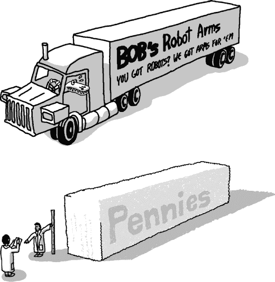

### **2030 年，比特币将值多少钱？**

很可能，在 2030 年，比特币的价值将是*零*：尽管这种货币早期取得了非凡的成功，但 2030 年实在太遥远了，期间可能发生的很多事件都能导致它的灭亡。然而，如果比特币成功实现主流采用，我们仍可以预测比特币的价值。

在本章接下来的部分，我们假设有 10 亿人定期使用比特币。这个数字不包括所有人，因为传统货币仍然会被使用。那么，在这个未来的世界里，一个典型的比特币用户可能拥有多少比特币呢？

假设到 2030 年将有 2000 万个比特币在流通，平均每个人将拥有 0.02 个比特币。当然，财富从来不会平均分配，极有可能前 1%的人拥有超过 50%的比特币（不幸的是，比特币可能无法单独解决这一问题）。因此，普通人将大约拥有 0.01 个比特币，在那时，这个数量可能被称为 10,000 微比特币。

回到那个关于半挂车中充满了便士大小比特币的例子，普通人的储蓄将只包含一个便士的碎片，差不多是一个立方毫米大小的沙粒。

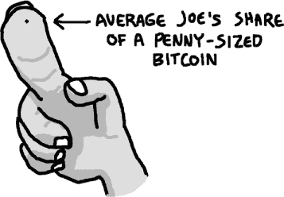

正如在第六章中讨论的那样，比特币能够实现的最高价值是作为一种价值储藏工具，在这种情况下，普通人可能会将其 1,250 美元的储蓄存入比特币。如果这个极端的情景成立，那么计算单个比特币的价值将是 1,250 美元除以 0.01，结果是荒谬的 125,000 美元每个比特币。

### **2030 年的比特币挖矿**

使用比特币购买早晨的咖啡、午餐、汽车燃料和一些在线产品，一个普通用户每天可能会进行 10 笔交易。^(1) 如果有 10 亿人每天进行 10 笔交易，这将是一个巨大的交易量！事实上，这个数字将超过每秒 100,000 笔交易，是今天 VISA 处理交易量的 25 到 50 倍。如果交易费用保持低廉（这是大多数人采用这种货币的前提）——假设每笔交易费用为一分钱——那么每天的交易费用将高达 1 亿美元！

尽管到 2030 年每个区块的矿工奖励将少于两枚比特币（基于当前的计划），如果在此期间比特币的价值显著上涨，矿工奖励仍然可能是可观的。

但大多数交易可能是链下交易。(*链下交易*是指那些不是通过区块链处理的比特币交易，而是由比特币钱包供应商管理的账本处理的交易，目的是节省小额支付的交易费用。) 因此，那些每天 10 亿笔交易可能只有 100 万笔交易会被记录在区块链上。然而，无论它们如何处理和对账，任何一个有 10 亿用户的支付系统每天都会生成数十亿笔交易。

挖矿将变得非常具有竞争性，利润率将非常低。只有那些拥有最具能效的矿机和最低电费的人才能继续维持运营。假设最有效的挖矿技术需要 0.1 J/GH，电费为每千瓦时 0.10 美元，并且每天产生 1 亿美元的交易费用，那么盈亏平衡的算力将超过 500 EH/s（500,000 PH/s）！即便假设挖矿技术的计算密度比目前高出 100 倍，实现这种挖矿能力所需要的 ASIC 硬件将填满大约 5000 座小型公寓楼。

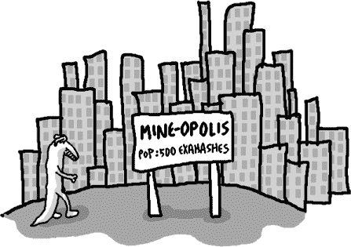

在超过 500 EH/s 的算力和 0.1 J/GH 的能效下，需要投入到挖矿的电力将大大增加。比特币挖矿将消耗超过 50GW 的电力，约占美国当前电力生产的 5%，以及全球电力输出的 0.3%。当然，如果电力成本上升，网络算力将下降。比特币挖矿不需要特定的算力才能正常运行；然而，电力越便宜，运行比特币挖矿的人就越多。

到这时，我们已经乐于推测在这个由比特币主导的世界中，比特币的价格以及可能围绕它演变的基础设施。但是，2030 年对于一个普通的比特币用户来说，生活会是怎样的呢？

### **2030 年比特币用户的日常生活**

让我们跟随 Crowley 的一天展开。事情从 Crowley 早晨醒来开始。Crowley 晚上佩戴着优化睡眠的手链，手链会匿名上传他的睡眠前生命体征到互联网。利用这些信息，全球的机器学习系统使用比特币竞标 Crowley 的闹钟何时响起，考虑到他的身体状况和睡眠/觉醒周期。最高出价者是让 Crowley 睡得最久的那个。

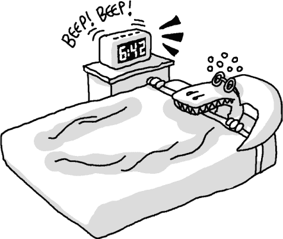

因为 Crowley 喜欢在早晨长时间洗热水澡，他以前常常洗完澡后热水用完。但最近，他所在公寓楼的一位住户安装了一台工业级热水器，现在通过向其他租户出售热水来帮助分担费用。Crowley 的热水龙头上安装了一块芯片，可以自动将比特币支付到热水器的芯片中。当 Crowley 顺时针转动淋浴阀时，更多的比特币被支付，热水也从淋浴喷头中流出。

当 Crowley 离开家时，他从手表上向正在修剪草坪的机器人割草机发送了几个 satoshi。街上的一家割草机维修店制造这些割草机并免费提供给顾客。每台割草机都自己收集收入，并用这些比特币支付网络上的程序员，以改进其 AI 算法，从而赚取更多的钱。此外，这些割草机会到割草机维修店进行升级，并用它们的比特币收入支付升级费用。

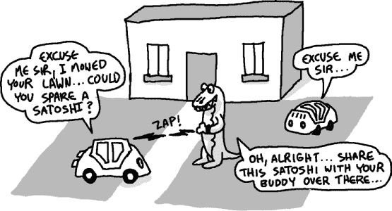

今天，Crowley 在上班途中错过了公交车。显然，今天早晨成功竞标的闹钟没有检测到 Crowley 的宿醉，导致时间设定过于紧张。通常情况下，他的手链会向获胜的竞标者发放 20 个 satoshi 作为奖励；然而，由于手链计算出 Crowley 错过了公交车，它从一个由获胜闹钟竞标者设立的托管账户中提取了 100 个 satoshi 的保险金。结果，今天的竞标者*亏损*了（程序员有一些算法调试需要做）。

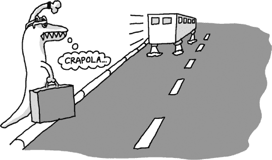

利用托管账户中的 satoshi，手链开始了一个临时的比特币拍卖，邀请所有附近停放的自动驾驶汽车看看是否愿意租给 Crowley。进入获胜的汽车后，Crowley 出发去上班。

今天，Crowley 的房地产客户正在购买一套房子。自从 2023 年《数字房地产改革法案》通过以来，所有的房产都通过简单地追踪分配给每个房产的一个特定 satoshi 来进行管理。这个 satoshi 类似于*有色币*，就像 2014 年的产权搜索一样。实际上，如果这个 satoshi 被转交给另一个人，新的拥有者将被赋予该房产的法律所有权。

到 2030 年，克劳利只需让他的比特币钱包通过追踪与房子相关的 satoshi 在区块链上的所有权进行产权搜索。这不仅相当于一项详尽的产权搜索，且保证 100%准确，而且他的钱包软件可以瞬间完成这一搜索，并且是免费的。

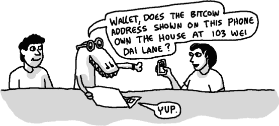

**什么是彩色币？**

货币的一个定义特征是它是可替代的：如果你想用五分钱买一颗糖，而你口袋里有几枚五分钱，你不需要考虑用哪一枚——任何一枚都适合。不过，由于比特币区块链是公开的，因此我们可以追踪每一枚硬币随时间的历史，实际上可以创建一种不同类型的货币，这种货币不可替代——一种不同的货币，其中不同的硬币可能会被标记上不同类型的“颜色”。

举个例子，假设你在一个只能容纳 400 人的剧院里举办音乐会。确保当天不会超过 400 人到场的一个方法是，将 400 毫比特币分发给你最亲密的 400 个朋友，然后简单地告诉他们：“请来参加我的演出！不过，如果你那天不能来，随时可以将这些毫比特币交易或转卖给任何人。它们是你可以根据需要自由使用的！”

然后，在音乐会当天，你会要求任何到场的人将其中一枚这些 400 毫比特币发还给你。通过分析区块链，你理论上可以追踪每一枚毫比特币的历史，验证它们是否都是你最初分发的 400 枚。这 400 枚毫比特币本身没有什么特殊之处，唯一特别的是你决定任意赋予这 400 枚比特币一个额外的特殊价值（即进入音乐会的资格）。这被称为对这些硬币进行*着色*。这个过程的好处是：（1）不会超过 400 人能拿着有效票到达你的音乐会；（2）你的朋友们可以完全自由地做任何他们想做的事。这个相同的系统也可以用来追踪更重要资产的所有权；例如，确定谁拥有某栋房子的产权。

当然，在实际操作中，亲自追踪区块链中的每一枚比特币会非常痛苦。然而，已经有软件可以自动化地以这种方式对比特币进行标记和追踪。最为成熟的协议和工具共享一个名字——“彩色币”（Colored Coins），并且可以在*[`coloredcoins.org/`](http://coloredcoins.org/)*上找到。

为了完成房屋的出售，买方和卖方只需输入一个多重签名交易：在一次交易中，买方将 150 微比特币（房屋费用）发送到卖方地址，而卖方将单色的 satoshi 发送给买方。通过使用单一交易，直到双方都用各自的私钥签署交易后，交易才会生效。该交易还包含 1%的佣金，发送到房地产代理的地址。

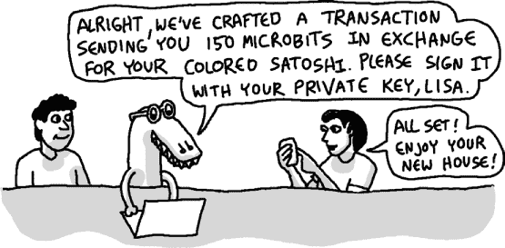

由于区块链用于跟踪财产所有权，因此这座房子的所有权保险和交易完成费用（不包括代理佣金）只是交易费用，可能只需要不到一分钱。

一天工作结束后，克劳利给他的妈妈（她是一只尼罗鳄）汇了一些钱。她所在的村庄，和 2030 年布隆迪的每个村庄一样，都有一个比特币摊位，可以以 0.5%的佣金将比特币兑换为布隆迪法郎。当然，现如今世界各地几乎所有地方都可以直接用比特币购买大多数物品，所以这笔佣金并不是必须的开支。

克劳利决定不搭公交，而是趁着这美好的一天走路回家并在途中吃晚餐。克劳利并不知道，正好走在他路上的索非亚刚为她的家人做了一大份沙拉，并意识到做得有点多，会有剩菜。

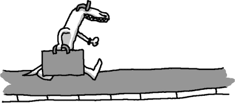

出于这个原因，她拍下剩余的沙拉照片，并将其上传到一个食物共享网站。在该网站上，评论员通过比特币支付，提供沙拉口味的评分。在几秒钟内，克劳利的手机响了，因为他之前请求过一份口味评分至少为 8 分的餐食，且不超过 15 个 satoshi，这正是他回家的路上能得到的，而索非亚的沙拉正好符合他的要求！

当克劳利按下索非亚门铃时，门铃中的 NFC 芯片与克劳利的手表通信，建立了一个关于晚餐沙拉的合同：门铃会自动向克劳利的手表发送一张账单，要求支付 15 个 satoshi 作为进入索非亚临时餐馆的费用。

索非亚怎么知道可以信任克劳利进入她的家呢？克劳利订阅了一个匿名评分服务，该服务以 1 个 satoshi 的费用保证索非亚，克劳利的可信度评分为 9.5 分（满分 10）。这个评分服务以脚本的形式内嵌在比特币区块链中。用户支付小额费用参与评分服务，评分服务（一个计算机程序）利用这些费用支付其在线广告费用。实际上，它是一个没有所有者的金融实体，存在于网络空间并为自己的资源付费。这种实体被称为*分布式自治公司*，得益于区块链技术，它才得以实现。

一整天忙碌工作后，终于回到家，克劳利在电视前的躺椅上放松。他最喜欢的电影（*《哈利·波特与分叉区块链》*）正在播放时，突然出现了一则披萨广告。“该死！”他喊道，“我今天晚餐吃的是一份健康沙拉，但现在真想来一片披萨。”

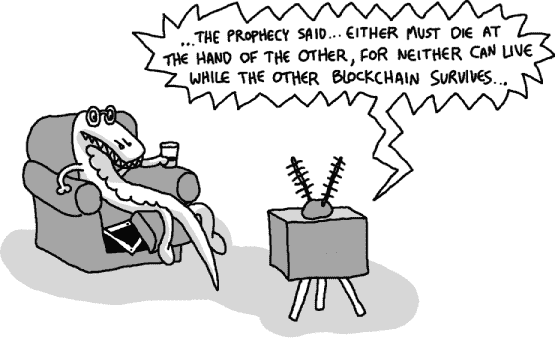

这则广告突然打断克劳利电影的原因并非偶然。就在此时，一辆经过他家门前的披萨车进入了克劳利电视的自动比特币广告拍卖，成功赢得了展示披萨广告的权利！

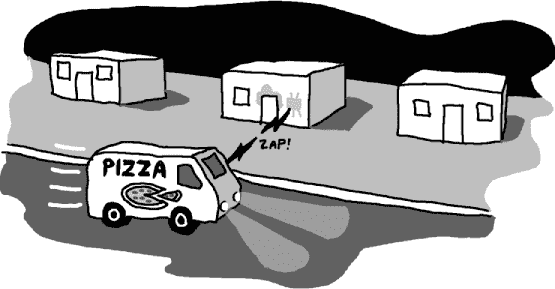

克劳利只需张开嘴巴：响应中，克劳利电视的手势识别系统会自动向披萨车发送 8 个聪（satoshi）。

很快，这辆披萨车把一片披萨放到了从克劳利家中延伸出来的传送带上。

几秒钟内，一只机器人手臂从克劳利躺椅的底部伸出，抓起传送带上的一片披萨，把它送进了克劳利的嘴里。

你可能认为一个完全依赖去中心化比特币交易的世界会是一个可怕的反乌托邦。然而，在阅读了 2030 年典型比特币使用者的一天生活的精彩描述后，那里的一切都通过比特币运作，我们相信你的担忧已经彻底消除了。

### **比特币终极游戏**

1687 年，艾萨克·牛顿出版了他的*《自然哲学的数学原理》*，这本书无疑是人类历史上最伟大的智力作品之一。它让牛顿成名，因为它首次揭示了能够精确描述行星及其他物体在引力作用下运动的简单数学公式。

尽管这一成就非常伟大，但*《原理》*其中隐藏着另一个更具意义的思想：即微积分的思想。^(2) 现代社会依赖的大多数技术——电脑、手机，甚至原子弹——如果没有引力理论也能存在；然而，如果没有微积分，这些技术几乎不可能出现。

在 17 世纪的欧洲，并不是每个人都能理解微积分的价值。牛顿几乎是单纯为了能第一次解释行星运动这一更具浪漫与诗意的问题，而创造了这一非常抽象的创新。

当然，现在评估中本聪的比特币白皮书是否会出现在重要科学出版物的历史中为时尚早。但有一点是明确的：就像牛顿必须首先发现微积分来解释星体的运动一样，中本聪也必须首先发现分布式匿名账本的理念，即区块链，才能发明出完全分布式数字货币的理想化概念。

然而，与微积分和引力定律不同的是，区块链和数字货币的概念是紧密相连的；它们是阴阳相依的。没有区块链所提供的安全性，分布式货币根本无法存在。同样，区块链也无法创造出来，除非给予人们创造它的激励，而唯一可能有效的激励就是分布式货币！

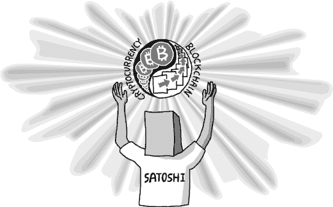

于是，这正是中本聪的天才所在：一个能够设想出两项独立技术的人，这两项技术单独来看显然是不可能且不实际的。在 2000 年代中期，当中本聪制定出他的原始白皮书时，世界上第一次有一个人清晰地意识到，尽管这两项技术单独存在时是不可能的，但如果将这两个理念结合成一个紧密交织的系统，它们不仅变得可能，而且实际上是可行的！

比特币的真正未来已经显现：分布式资产账本技术与激励性货币的结合，注定会永远存在于我们的生活中。^(3) 这是一个机制，可以在许多需要将信任委托给中央仲裁者的情境中大幅提升效率。尽管毫无疑问政府和中央权威将继续存在，并在世界未来中扮演重要角色，但当前这些政府和其他权威机构所执行的许多工作也是不必要的重复性和琐碎事务。

就像机器人帮助世界减少了繁重的体力劳动一样，数字货币技术现在为我们提供了自动化官僚主义琐事的工具。乐观地说，整个全人类都将因此受益。
