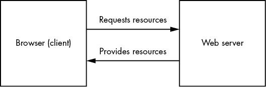
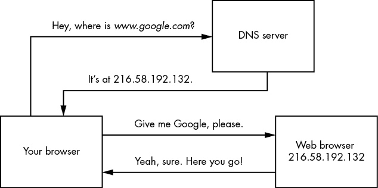
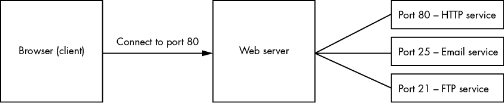
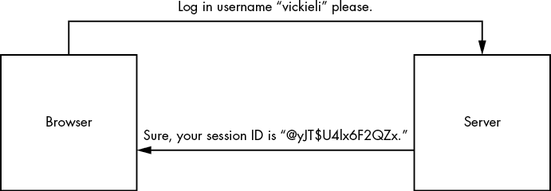
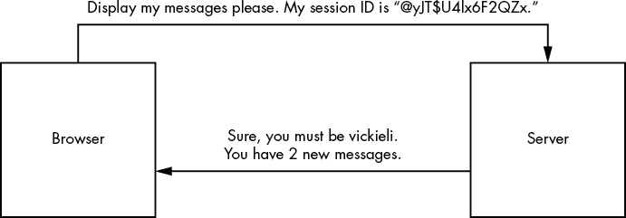

# 3

互联网如何工作


在你开始寻找 bug 之前，让我们先花点时间了解一下互联网的工作原理。发现网页漏洞的关键在于利用这一技术中的薄弱环节，因此，所有优秀的黑客都应该对其有一个扎实的理解。如果你已经熟悉这些过程，可以跳过，直接进入我对互联网安全控制的讨论。

以下问题提供了一个很好的起点：当你在浏览器中输入*www.google.com*时发生了什么？换句话说，浏览器是如何从像 google.com 这样的域名，找到你正在寻找的网页的？我们一起来探讨一下。

## 客户端-服务器模型

互联网由两种设备组成：客户端和服务器。*客户端* 请求资源或服务，而*服务器* 提供这些资源和服务。当你使用浏览器访问网站时，浏览器充当客户端并请求从 web 服务器获取网页。然后，web 服务器会将网页发送给你的浏览器（见图 3-1）。



图 3-1：互联网客户端从服务器请求资源。

一个网页不过是由 web 服务器发送的一组资源或文件。例如，至少服务器会发送给你的浏览器一个用*超文本标记语言 (**HTML)* 编写的文本文件，这种语言告诉浏览器应该显示什么内容。大多数网页还包括*层叠样式表 (**CSS**)* 文件，以使页面更加美观。有时，网页还包含*JavaScript (**JS)* 文件，这些文件使得网页能够进行动画处理，并且能够在不经过服务器的情况下响应用户输入。例如，JavaScript 可以在用户滚动页面时调整图像大小，并且在将用户输入发送到服务器之前，在客户端验证这些输入。最后，你的浏览器可能会接收到嵌入式资源，如图像和视频。浏览器会将这些资源合并，展示出你所看到的网页。

服务器不仅仅是将网页返回给用户。Web API 允许应用程序请求其他系统的数据。这使得应用程序能够相互交互，并以受控的方式共享数据和资源。例如，Twitter 的 API 允许其他网站向 Twitter 的服务器发送请求，以获取公开推文及其作者等数据。API 还为互联网的许多其他功能提供支持，我们将在第二十四章中重新探讨它们以及相关的安全问题。

## 域名系统

那么，浏览器和其他 web 客户端是如何知道在哪里找到这些资源的呢？每个连接到互联网的设备都有一个独特的*互联网协议（IP）* 地址，其他设备可以利用这个地址找到它。然而，IP 地址由数字和字母组成，对人类来说很难记住。例如，旧版的 IP 地址格式 IPv4 像这样：123.45.67.89。新版的 IPv6 看起来更复杂：2001:db8::ff00:42:8329。

这时*域名系统（DNS）*发挥作用。DNS 服务器充当互联网的电话簿，将域名转换为 IP 地址（图 3-2）。当你在浏览器中输入一个域名时，DNS 服务器必须首先将该域名转换为 IP 地址。我们的浏览器会询问 DNS 服务器：“这个域名对应的 IP 地址是什么？”



图 3-2：DNS 服务器会将域名转换为 IP 地址。

## 互联网端口

在浏览器获取到正确的 IP 地址后，它会尝试通过端口连接到该 IP 地址。*端口*是设备上的逻辑划分，用来标识特定的网络服务。我们通过端口号来识别端口，端口号的范围是 0 到 65,535。

端口允许服务器同时为互联网提供多个服务。由于对某些端口接收的流量有约定，端口号还允许服务器快速将到达的互联网消息转发到相应的服务进行处理。例如，如果一个互联网客户端连接到端口 80，网页服务器就能理解客户端希望访问其网页服务（图 3-3）。



图 3-3：端口允许服务器提供多个服务。端口号帮助将客户端请求转发到正确的服务。

默认情况下，我们使用端口 80 来处理 HTTP 消息，使用端口 443 来处理 HTTPS，HTTPS 是 HTTP 的加密版本。

## HTTP 请求和响应

一旦连接建立，浏览器和服务器通过*超文本传输协议（**HTTP**）*进行通信。HTTP 是一套规则，规定了如何构建和解释互联网消息，以及网页客户端和网页服务器应如何交换信息。

当你的浏览器想要与服务器交互时，它会发送*HTTP 请求*给服务器。HTTP 请求有不同的类型，最常见的是 GET 和 POST。按惯例，GET 请求从服务器获取数据，而 POST 请求将数据提交给服务器。其他常见的 HTTP 方法包括 OPTIONS，用于请求某个 URL 允许的 HTTP 方法；PUT，用于更新资源；DELETE，用于删除资源。

这是一个示例 GET 请求，它请求服务器的*www.google.com*主页：

```
GET / HTTP/1.1
Host: www.google.com
User-Agent: Mozilla/5.0
Accept: text/html,application/xhtml+xml,application/xml
Accept-Language: en-US
Accept-Encoding: gzip, deflate
Connection: close
```

让我们一起走一遍这个请求的结构，因为在本书中你会看到很多这样的例子。所有的 HTTP 请求都由请求行、请求头和可选的请求体组成。前面的例子仅包含了请求行和请求头。

*请求行*是 HTTP 请求的第一行。它指定了请求方法、请求的 URL 和所使用的 HTTP 版本。在这里，你可以看到客户端正在使用 HTTP 版本 1.1 向*www.google.com*的主页发送 HTTP GET 请求。

剩下的几行是 HTTP*请求头*。这些头部用于将关于请求的附加信息传递给服务器。这允许服务器定制发送给客户端的结果。在前面的示例中，`Host`头指定了请求的主机名。`User-Agent`头包含请求软件的操作系统和软件版本，例如用户的 Web 浏览器。`Accept`、`Accept-Language`和`Accept-Encoding`头告诉服务器响应应该采用什么格式。而`Connection`头则告诉服务器在响应后是否应保持网络连接。

你可能会在请求中看到一些其他常见的头部。`Cookie`头用于将客户端的 Cookie 发送到服务器。`Referer`头指定链接到当前页面的上一网页的地址。`Authorization`头包含用于认证用户的凭证。

在服务器接收到请求后，它会尝试满足请求。服务器会通过使用*HTTP 响应*返回构建网页所需的所有资源。一个 HTTP 响应包含多个内容：HTTP 状态码，用来指示请求是否成功；HTTP 头部，包含浏览器和服务器用来相互通信的有关认证、内容格式和安全策略的信息；以及 HTTP 响应体，即你请求的实际网页内容。网页内容可以包括 HTML 代码、CSS 样式表、JavaScript 代码、图片等。

这是一个 HTTP 响应的示例：

```
1 HTTP/1.1 200 OK2 Date: Tue, 31 Aug 2021 17:38:14 GMT
[...]3 Content-Type: text/html; charset=UTF-84 Server: gws5 Content-Length: 190532
<!doctype html>
[...]
<title>Google</title>
[...]
<html>
```

注意第一行中的`200 OK`消息。这是状态码。200 范围内的 HTTP 状态码表示请求成功。300 范围表示重定向到另一个页面，而 400 范围表示客户端出错，比如请求了一个不存在的页面。500 范围表示服务器本身出现了错误。

作为一个漏洞奖励猎人，你应该时刻关注这些状态码，因为它们能告诉你很多关于服务器运行情况的信息。例如，状态码 403 表示资源对你是禁止的。这可能意味着页面上隐藏了敏感数据，如果你能够绕过访问控制，可能就能访问到这些数据。

响应中用冒号（`:`）分隔的接下来几行是 HTTP 响应头。它们允许服务器将有关响应的附加信息传递给客户端。在这种情况下，你可以看到响应时间是`Tue, 31 Aug 2021 17:38:14 GMT`。`Content-Type`头表示响应体的文件类型。在本例中，该页面的`Content-Type`是`text/html`。服务器版本是 Google Web Server（`gws`），`Content-Length`为 190,532 字节。通常，额外的响应头会指定内容的格式、语言和安全策略。

除了这些，你还可能会遇到一些其他常见的响应头。`Set-Cookie` 头由服务器发送给客户端，用于设置一个 cookie。`Location` 头表示页面重定向的 URL。`Access-Control-Allow-Origin` 头指示哪些来源可以访问页面内容。（我们将在第十九章中详细讨论这一点。）`Content-Security-Policy` 控制浏览器允许加载的资源的来源，而 `X-Frame-Options` 头指示页面是否可以在 iframe 中加载（第八章将进一步讨论这一点）。

空白行之后的数据是响应体，包含网页的实际内容，比如 HTML 和 JavaScript 代码。一旦浏览器接收到构建网页所需的所有信息，它会为你渲染所有内容。

## 网络安全控制

现在你已经对信息如何在互联网中传输有了高层次的理解，接下来让我们深入探讨一些基本的安全控制措施，这些措施能够保护信息免受攻击者的侵害。为了有效地寻找漏洞，你通常需要想出创造性的方式绕过这些控制，因此你首先需要理解它们是如何工作的。

### 内容编码

在 HTTP 请求和响应中传输的数据并不总是以纯文本的形式进行传输。网站通常会以不同的方式对消息进行编码，以防止数据损坏。

数据编码作为一种方式，用于在支持不同内容类型有限的机器之间可靠地传输二进制数据。用于编码的字符是常见的字符，在互联网协议中不会作为受控字符使用。因此，当你使用常见的编码方案对内容进行编码时，你可以放心，数据将完整地传输到目的地。相反，如果你以原始状态传输数据，当互联网协议误解消息中的特殊字符时，数据可能会出现问题。

*Base64 编码* 是最常见的数据编码方式之一。它常用于在网页消息中传输图像和加密信息。这是字符串 `"Content Encoding"` 的 Base64 编码版本：

```
Q29udGVudCBFbmNvZGluZw==
```

Base64 编码的字符集包括大写字母 A 到 Z、小写字母 a 到 z、数字字符 0 到 9、字符 + 和 /，最后是用于填充的 = 字符。*Base64url* *编码* 是 Base64 的一种修改版本，专门用于 URL 格式。它与 Base64 相似，但使用了不同的非字母数字字符，并且省略了填充。

另一种常见的编码方法是十六进制编码。*十六进制编码*，或称*hex*，是一种用基数 16 格式表示字符的方法，其中字符的范围是从 0 到 F。十六进制编码占用的空间比 base64 多，效率也较低，但提供了更易于人类阅读的编码字符串。这是字符串`"Content Encoding"`的十六进制编码版本；你可以看到它比 base64 对应的编码版本占用更多的字符：

```
436f6e74656e7420456e636f64696e67
```

*URL 编码*是一种将字符转换为更容易通过互联网传输的格式的方法。URL 编码字符串中的每个字符可以通过其指定的十六进制数字表示，并以 % 符号开头。有关 URL 编码的更多信息，请参阅维基百科：[`en.wikipedia.org/wiki/Percent-encoding`](https://en.wikipedia.org/wiki/Percent-encoding)*。*

例如，单词*localhost*可以用它的 URL 编码等效形式表示，即`%6c%6f%63%61%6c%68%6f%73%74`。你可以使用像 URL Decode and Encode（[`www.urlencoder.org/`](https://www.urlencoder.org/)）这样的 URL 计算器来计算主机名的 URL 编码等效形式。

我们将在第十三章讨论 SSRF 时介绍几种额外的字符编码类型——八进制编码和双字编码。当你在调查网站时看到编码内容时，始终尝试解码它，以发现网站想要传达的内容。你可以使用 Burp Suite 的解码器来解码编码的内容。我们将在下一章介绍如何操作。或者，你也可以使用 CyberChef（[`gchq.github.io/CyberChef/`](https://gchq.github.io/CyberChef/)）来解码 base64 内容和其他类型的编码内容。

服务器有时还会在传输前*加密*其内容。这可以保持客户端和服务器之间的数据私密性，并防止任何拦截流量的人窃听消息。

### 会话管理和 HTTP Cookie

为什么每次关闭电子邮件标签页后你不需要重新登录？因为网站记住了你的会话。*会话管理*是一个过程，它允许服务器处理来自同一用户的多个请求，而不要求用户再次登录。

网站会为每个已登录的用户维护一个会话，并且当你登录网站时，一个新的会话开始（图 3-4）。服务器会为你的浏览器分配一个相关的*会话 ID*，作为你身份的证明。会话 ID 通常是一个长且不可预测的序列，旨在无法猜测。当你登出时，服务器结束会话并撤销会话 ID。如果你没有手动登出，网站可能也会定期结束会话。



图 3-4：在你登录后，服务器为你创建一个会话并发放会话 ID，该 ID 唯一地标识一个会话。

大多数网站使用 cookie 来在 HTTP 请求中传递会话信息。*HTTP cookies* 是网站服务器发送到你浏览器的小片数据。当你登录网站时，服务器为你创建一个会话，并将会话 ID 作为 cookie 发送到你的浏览器。浏览器收到 cookie 后，会将其存储，并在每次向同一服务器发起请求时都包含它（图 3-5）。

这就是服务器如何知道是你的原因！在会话 cookie 生成之后，服务器会跟踪它并用它来验证你的身份。最后，当你登出时，服务器会使会话 cookie 无效，从而防止它再次使用。下次你登录时，服务器将为你创建一个新的会话和一个新的关联会话 cookie。



图 3-5：你的会话 ID 与存储在服务器上的会话信息相关联。

### 基于令牌的身份验证

在基于会话的身份验证中，服务器存储你的信息，并使用相应的会话 ID 来验证你的身份，而 *基于令牌的身份验证* 系统则直接将这些信息存储在某种令牌中。令牌允许服务器通过解码令牌本身来推断你的身份，而不是将信息存储在服务器端并使用会话 ID 查询它。这样，应用程序就不必在服务器端存储和维护会话信息。

这个系统有一个风险：如果服务器使用令牌中包含的信息来确定用户的身份，用户是否可以修改令牌中的信息，从而冒充其他人登录？为了防止像这样的令牌伪造攻击，一些应用程序对令牌进行加密，或对令牌进行编码，使得只有应用程序本身或其他授权方可以读取。如果用户无法理解令牌的内容，他们可能也无法有效篡改它。加密或编码令牌并不能完全防止令牌伪造。攻击者仍然有办法在不理解令牌内容的情况下篡改加密的令牌。但这比篡改明文令牌要困难得多。攻击者通常可以解码编码的令牌来篡改它们。

应用程序保护令牌完整性的另一种更可靠方法是对令牌进行签名，并在令牌到达服务器时验证其签名。*签名*用于验证数据的完整性。它们是只有知道秘密密钥的人才能生成的特殊字符串。由于没有办法在没有秘密密钥的情况下生成有效的签名，并且只有服务器知道这个秘密密钥，因此有效签名表明令牌可能没有被客户端或任何第三方篡改。尽管应用程序的实现可能有所不同，但基于令牌的身份验证就是这样工作的：

1.  用户使用他们的凭证进行登录。

1.  服务器验证这些凭证并为用户提供一个签名令牌。

1.  用户在每次请求时都会发送令牌，以证明他们的身份。

1.  在接收到并验证令牌后，服务器会从令牌中读取用户的身份信息并响应机密数据。

### JSON Web 令牌

*JSON Web Token（**JWT**）*是最常用的认证令牌类型之一。它由三个部分组成：头部、负载和签名。

*头部*标识用于生成签名的算法。它是一个包含算法名称的 base64url 编码字符串。下面是 JWT 头部的示例：

```
eyBhbGcgOiBIUzI1NiwgdHlwIDogSldUIH0K
```

这个字符串是以下文本的 base64url 编码版本：

```
{ "alg" : "HS256", "typ" : "JWT" }
```

*负载*部分包含有关用户身份的信息。这个部分在用于令牌之前，也会进行 base64url 编码。以下是负载部分的示例，它是`{ "``user_name``" : "``admin``", }`的 base64url 编码字符串：

```
eyB1c2VyX25hbWUgOiBhZG1pbiB9Cg
```

最后，*签名*部分验证用户是否篡改了令牌。它通过将头部与负载连接在一起，然后使用头部中指定的算法和密钥对其进行签名来计算。下面是 JWT 签名的示例：

```
4Hb/6ibbViPOzq9SJflsNGPWSk6B8F6EqVrkNjpXh7M
```

对于这个特定的令牌，签名是通过使用密钥`key`，使用 HS256 算法对字符串`eyBhbGcgOiBIUzI1NiwgdHlwIDogSldUIH0K.eyB1c2VyX25hbWUgOiBhZG1pbiB9Cg`进行签名生成的。完整的令牌将每个部分（头部、负载和签名）连接在一起，使用句点（`.`）分隔它们：

```
eyBhbGcgOiBIUzI1NiwgdHlwIDogSldUIH0K.eyB1c2VyX25hbWUgOiBhZG1pbiB9Cg.4Hb/6ibbViPOzq9SJflsNGPWSk6B8F6EqVrkNjpXh7M
```

当正确实现时，JSON Web 令牌提供了一种安全的方式来识别用户。当令牌到达服务器时，服务器可以通过检查签名是否正确来验证令牌是否被篡改过。然后，服务器可以通过使用负载部分中的信息推断用户的身份。而且，由于用户无法访问用于签署令牌的密钥，他们无法篡改负载并自行签署令牌。

但如果实现不当，攻击者可以绕过安全机制并伪造任意令牌。

#### 操作`alg`字段

有时应用程序在令牌到达服务器后未能验证其签名。这使得攻击者可以通过提供无效或空白签名，轻松绕过安全机制。

攻击者伪造令牌的一种方式是篡改令牌头部中的`alg`字段，该字段列出了用于编码签名的算法。如果应用程序未限制 JWT 中使用的算法类型，攻击者可以指定要使用的算法，从而可能危及令牌的安全性。

JWT 支持`none`选项作为算法类型。如果`alg`字段设置为`none`，即使令牌的签名部分为空，也会被认为是有效的。例如，考虑以下令牌：

```
eyAiYWxnIiA6ICJOb25lIiwgInR5cCIgOiAiSldUIiB9Cg.eyB1c2VyX25hbWUgOiBhZG1pbiB9Cg.
```

这个令牌只是这两个数据块的 base64url 编码版本，没有签名部分：

```
{ "alg" : "none", "typ" : "JWT" } { "user" : "admin" }
```

这个功能最初是为了调试目的而使用的，但如果在生产环境中没有关闭，它会允许攻击者伪造任何他们想要的令牌，并冒充任何人。

攻击者还可以通过更改`alg`字段的算法类型来利用这一点。JWT 使用的两种最常见签名算法是 HMAC 和 RSA。HMAC 要求令牌用密钥签署，然后再用相同的密钥验证。当使用 RSA 时，令牌首先用私钥创建，然后用相应的公钥进行验证，公钥是任何人都可以读取的。对于 HMAC 令牌，密钥和 RSA 令牌的私钥必须保密，这是至关重要的。

假设某个应用程序最初设计时使用 RSA 令牌。这些令牌用私钥 A 签署，私钥 A 对外部是保密的。然后，令牌用公钥 B 进行验证，公钥 B 是公开的，任何人都可以访问。只要令牌始终作为 RSA 令牌处理，这种做法是没问题的。现在，如果攻击者将`alg`字段更改为 HMAC，他们可能通过用 RSA 公钥 B 签署伪造的令牌，创建有效的令牌。当签名算法切换为 HMAC 时，令牌仍然用 RSA 公钥 B 进行验证，但这时，令牌也可以使用同一个公钥进行签署。

#### 暴力破解密钥

也有可能通过猜测或*暴力破解*来获取签署 JWT 所使用的密钥。攻击者可以从很多信息入手：签署令牌时使用的算法、已签名的负载以及结果签名。如果用来签署令牌的密钥不够复杂，他们可能很容易进行暴力破解。如果攻击者无法暴力破解密钥，他们可能会尝试泄露密钥。若存在其他漏洞，比如目录遍历、外部实体攻击（XXE）或 SSRF 等，攻击者可能会读取存储密钥值的文件，窃取密钥并签署任意令牌。我们将在后续章节讨论这些漏洞。

#### 阅读敏感信息

由于 JSON Web 令牌用于访问控制，它们通常包含有关用户的信息。如果令牌没有加密，任何人都可以对令牌进行 base64 解码，并读取令牌的负载。如果令牌包含敏感信息，可能会成为信息泄露的源头。正确实现的 JSON Web 令牌签名部分提供数据完整性，而非保密性。

这些只是 JWT 安全问题的一些例子。想了解更多 JWT 漏洞的例子，可以搜索*JWT 安全问题*。任何身份验证机制的安全性不仅取决于其设计，还取决于其实现。JWT 是可以安全的，但前提是要正确实施。

### 同源策略

*同源策略（**SOP**)* 是一条限制来自一个源的脚本如何与另一个源的资源进行交互的规则。用一句话来说，SOP 就是：来自页面 A 的脚本只能在页面 A 和页面 B 属于同一源的情况下访问页面 B 的数据。这条规则保护现代网页应用程序，并防止许多常见的网络漏洞。

如果两个 URL 共享相同的协议、主机名和端口号，那么它们就被认为是同源的。让我们来看一些例子。页面 A 的 URL 是：

1.  *https://medium.com/@vickieli*

它使用 HTTPS，记住，HTTPS 默认使用端口 443。现在，查看以下页面，依据 SOP 判断哪些与页面 A 具有相同的源：

1.  *https://medium.com/*

1.  *http://medium.com/*

1.  *https://twitter.com/@vickieli7*

1.  *https://medium.com:8080/@vickieli*

*https://medium.com/* 的 URL 与页面 A 属于同一源，因为这两个页面共享相同的源、协议、主机名和端口号。其他三个页面与页面 A 不属于同一源。*http://medium.com/* 与页面 A 属于不同的源，因为它们的协议不同。*https://medium.com/* 使用 HTTPS，而 *http://medium.com/* 使用 HTTP。*https://twitter.com/@vickieli7* 也是不同源，因为它有不同的主机名。最后，*https://medium.com:8080/@vickieli* 也是不同源，因为它使用端口 8080，而不是端口 443。

现在，让我们通过一个例子来看 SOP 是如何保护我们的。假设你已登录到你的银行网站 *onlinebank.com*。不幸的是，你在同一个浏览器中点击了一个恶意网站 *attacker.com*。

恶意网站向 *onlinebank.com* 发出一个 GET 请求以获取你的个人信息。由于你已登录银行，你的浏览器会自动将你的 cookies 包含在每个发送到 *onlinebank.com* 的请求中，即使请求是由恶意网站上的脚本生成的。由于请求中包含了有效的会话 ID，*onlinebank.com* 的服务器会通过发送包含你信息的 HTML 页面来满足该请求。然后，恶意脚本读取并获取页面上的私人电子邮件地址、家庭住址和银行信息。

幸运的是，SOP 会阻止在 *attacker.com* 上托管的恶意脚本读取从 *onlinebank.com* 返回的 HTML 数据。这避免了页面 A 上的恶意脚本获取嵌入在页面 B 中的敏感信息。

## 学习编程

现在你应该有了坚实的基础，能够帮助你理解我们将要讨论的大多数漏洞。在设置你的黑客工具之前，我建议你学习编程。编程技能非常有用，因为寻找漏洞涉及许多重复性任务，通过学习 Python 或 Shell 脚本等编程语言，你可以将这些任务自动化，从而节省大量时间。

你还应该学习阅读 JavaScript，这是大多数网站使用的编程语言。阅读一个网站的 JavaScript 代码可以帮助你了解它的工作原理，让你快速找到漏洞。许多顶级黑客表示，他们的秘诀就是阅读 JavaScript，寻找隐藏的端点、不安全的编程逻辑和秘密密钥。我也通过阅读 JavaScript 源代码发现了许多漏洞。

Codecademy 是一个学习编程的好资源。如果你更喜欢阅读书籍的话，*《Learn Python the Hard Way》*（Zed Shaw 著，Addison-Wesley Professional，2013）是学习 Python 的好方法。而阅读*《Eloquent JavaScript》第三版*（Marijn Haverbeke 著，No Starch Press，2019）是掌握 JavaScript 的最佳途径之一。
