# 4

环境设置与流量拦截


如果您在一个精心设计的实验室中寻找漏洞，您将节省大量的时间和精力。在本章中，我将一步步指导您设置黑客攻击环境。您将配置浏览器与 Burp Suite 配合使用，Burp Suite 是一个 web 代理工具，允许您查看和修改浏览器与 web 服务器之间发送的 HTTP 请求和响应。您将学习如何使用 Burp 的功能拦截网络流量、发送自动化和重复的请求、解码编码内容，并对比请求。我还会讲解如何做好漏洞赏金笔记。

本章仅关注设置 web 攻击环境。如果您的目标是攻击移动应用程序，您将需要额外的设置和工具。我们将在第二十三章中介绍这些内容，届时将讨论移动端黑客攻击。

## 选择操作系统

在继续之前，您需要做的第一件事是选择一个操作系统。您的操作系统将限制您可用的黑客工具。我建议使用基于 Unix 的系统，如 Kali Linux 或 macOS，因为许多开源黑客工具都是为这些系统编写的。*Kali Linux* 是一款为数字取证和黑客攻击设计的 Linux 发行版。它包括许多有用的漏洞赏金工具，如 Burp Suite、DirBuster 和 Gobuster 等侦察工具，以及 Wfuzz 等模糊测试工具。您可以从 [`www.kali.org/downloads/`](https://www.kali.org/downloads/) 下载 Kali Linux。

如果这些选项无法使用，您可以随意使用其他操作系统进行黑客攻击。只需记住，您可能需要学习使用与本书中提到的工具不同的工具。

## 设置基本工具：浏览器和代理

接下来，您需要一个 web 浏览器和一个 web 代理。您将使用浏览器来检查目标应用程序的功能。我推荐使用 Firefox，因为它是与代理配合使用时最简单的浏览器。您还可以在黑客攻击时使用两个不同的浏览器：一个用于浏览目标，另一个用于在互联网上研究漏洞。这样，您可以轻松地隔离目标应用程序的流量，以便进一步检查。

*代理* 是位于客户端和服务器之间的软件；在这种情况下，它位于您的浏览器和您交互的 web 服务器之间。它在将您的请求传递给服务器之前拦截请求，并在将服务器的响应传递给您之前拦截响应，像这样：

1.  浏览器 <--------------> 代理 <--------------> 服务器

在漏洞赏金猎取中，使用代理是至关重要的。代理允许您查看和修改发送到服务器的请求以及从服务器返回到浏览器的响应，正如我在本章后面所解释的那样。没有代理，浏览器和服务器将自动交换信息，而您对此一无所知，您只能看到最终的网页结果。代理则会捕获所有信息，确保在信息传递给预定的接收者之前先被捕捉到。

因此，代理可以通过检查和分析往返服务器的流量来执行侦察。它们还可以让您检查有趣的请求，寻找潜在的漏洞，并通过篡改请求来利用这些漏洞。

例如，假设您访问了您的电子邮件收件箱，并拦截了通过代理返回您的电子邮件的请求。这是一个 GET 请求，URL 中包含了您的用户 ID。您还会注意到请求中包含了一个带有用户 ID 的 Cookie：

```
GET /emails/USER_ID HTTP/1.1
Host: example.com
Cookie: user_id=USER_ID
```

在这种情况下，您可以尝试将 URL 中的 `USER_ID` 和 `Cookie` 头部中的用户 ID 改为另一个用户的 ID，看看是否能够访问另一个用户的电子邮件。

两种代理工具在漏洞悬赏猎人中尤其受欢迎：Burp Suite 和 Zed Attack Proxy（ZAP）。本节将向您展示如何设置 Burp，但您也可以选择使用 ZAP。

### 打开内置浏览器

Burp Suite 和 ZAP 都带有内置浏览器。如果您选择使用这些内置浏览器进行测试，您可以跳过接下来的两个步骤。要使用 Burp Suite 的内置浏览器，请在启动后点击 Burp 的 Proxy 选项卡中的**Open browser**（图 4-1）。这个内置浏览器的流量将自动通过 Burp 路由，无需额外设置。

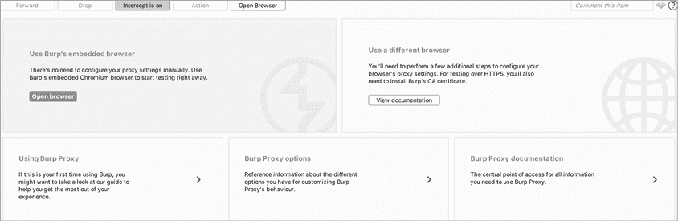

图 4-1：您可以使用 Burp 的内置浏览器进行测试，而不是使用您自己的外部浏览器。

### 设置 Firefox

Burp 的内置浏览器提供了一种方便的方式，能够通过最小的设置开始漏洞猎捕。然而，如果您像我一样，喜欢使用自己习惯的浏览器进行测试，您可以设置 Burp 与您的浏览器一起使用。让我们设置 Burp 与 Firefox 一起使用。

首先下载并安装您的浏览器和代理。您可以从 [`www.mozilla.org/firefox/new/`](https://www.mozilla.org/firefox/new/) 下载 Firefox 浏览器，从 [`portswigger.net/burp/`](https://portswigger.net/burp/) 下载 Burp Suite。

漏洞悬赏猎人使用 Burp Suite 的两个版本之一：Professional 或 Community。使用 Burp Suite Professional 需要购买许可证，而 Community 版本则是免费的。Burp Suite Pro 包含漏洞扫描器和其他便捷功能，例如保存工作会话以便稍后恢复。它还提供了 Burp intruder 的完整版本，而 Community 版本仅包含有限版本。在本书中，我介绍了如何使用 Community 版本来进行漏洞猎捕。

现在，您需要配置浏览器，使其通过代理路由流量。本节将教您如何配置 Firefox 以与 Burp Suite 配合使用。如果您使用的是其他浏览器-代理组合，请查阅它们的官方文档以获取教程。

启动 Firefox。然后通过选择 **Preferences**▶**General**▶**Network Settings** 打开连接设置页面。您可以从 Firefox 右上角的菜单中访问 Preferences 选项卡（图 4-2）。

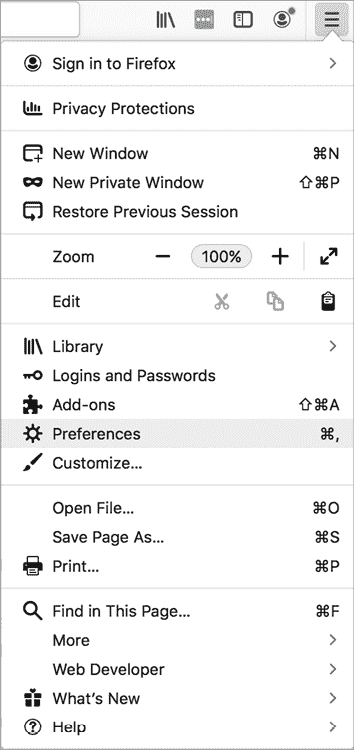

图 4-2：你可以在 Firefox 的右上角找到首选项选项。

连接设置页面应该与 Figure 4-3 中的样子相似。

选择 **Manual proxy configuration** 并为所有协议类型输入 IP 地址 **127.0.0.1** 和端口 **8080**。这将告诉 Firefox 使用你机器上端口 8080 上运行的服务作为所有流量的代理。127.0.0.1 是本地主机的 IP 地址，它标识你的当前计算机，因此你可以用它来访问你机器上运行的网络服务。由于 Burp 默认运行在 8080 端口上，这个设置告诉 Firefox 将所有流量通过 Burp 路由。点击 **OK** 来完成设置。现在，Firefox 会通过 Burp 路由所有流量。

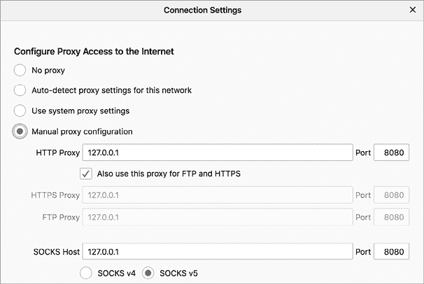

图 4-3：在连接设置页面配置 Firefox 的代理设置。

### 配置 Burp

下载 Burp Suite 后，打开它并点击 **Next**，然后点击 **Start Burp**。你应该会看到一个像 Figure 4-4 的窗口。

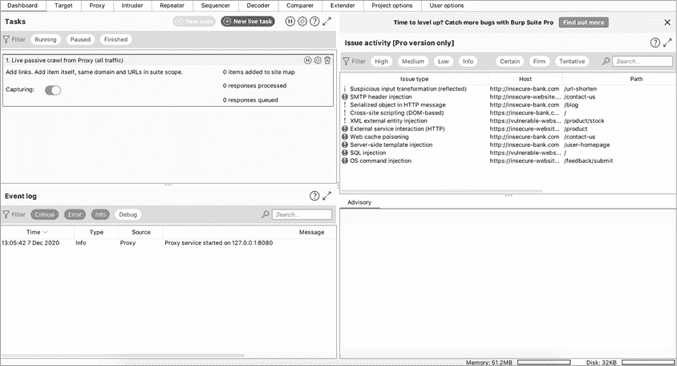

图 4-4：Burp Suite Community Edition 启动窗口

现在让我们配置 Burp，使其能够与 HTTPS 流量一起工作。HTTPS 通过加密你的流量来保护数据的隐私，确保通信中的两方（你的浏览器和服务器）才能解密流量。这也意味着你的 Burp 代理无法拦截往返浏览器的 HTTPS 流量。为了解决这个问题，你需要通过安装 Burp 的证书颁发机构（CA）证书，向 Firefox 显示你的 Burp 代理是一个受信任的方。

让我们在 Firefox 上安装 Burp 的证书，这样你就可以处理 HTTPS 流量了。打开并运行 Burp，并将你的代理设置为 127.0.0.1:8080，然后在浏览器中访问 *http://burp/*。你应该会看到 Burp 的欢迎页面 (Figure 4-5)。点击右上角的 **CA Certificate** 来下载证书文件，然后点击 **Save File** 将其保存在一个安全的位置。


图 4-5：访问 *http://burp/* 以下载 Burp 的 CA 证书。

接下来，在 Firefox 中点击 **Preferences**▶**Privacy & Security**▶**Certificates**▶**View Certificates**▶**Authorities**。点击 **Import** 并选择你刚才保存的文件，然后点击 **Open**。按照对话框中的提示，信任该证书以识别网站 (Figure 4-6)。

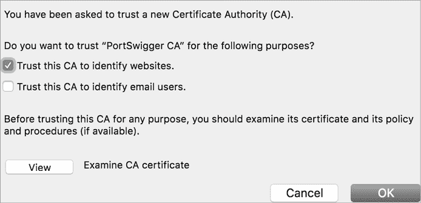

图 4-6：在 Firefox 的对话框中选择 ***Trust this CA to identify websites*** 选项。

重启 Firefox。现在你应该可以拦截 HTTP 和 HTTPS 流量了。

让我们进行一次测试，确保 Burp 正常工作。切换到 Burp 的 Proxy 标签页，通过点击 **Intercept is off** 来开启流量拦截。按钮现在应该显示为 Intercept is on (Figure 4-7)。这意味着你现在正在拦截来自 Firefox 或嵌入式浏览器的流量。

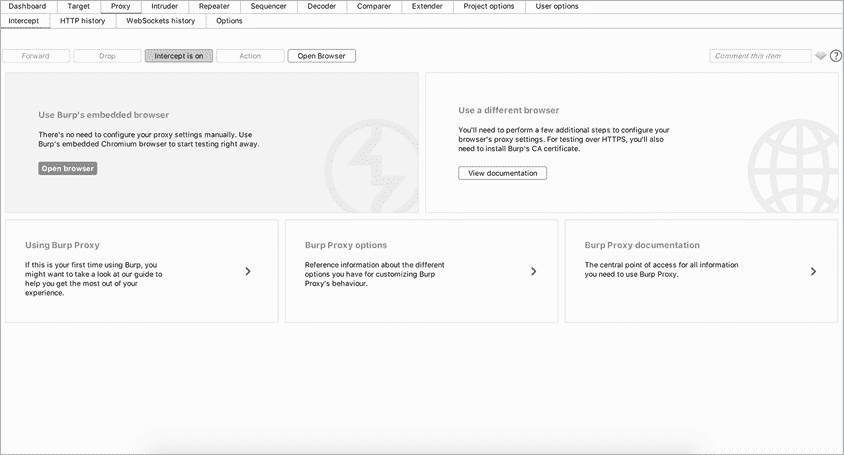

图 4-7：拦截开启意味着你现在正在拦截流量。

然后打开 Firefox 并访问 [`www.google.com/`](https://www.google.com/)。在 Burp 的代理中，你应该会看到主窗口开始填充各个请求。Burp 代理中的 **Forward** 按钮将把当前请求发送到指定的服务器。点击 **Forward**，直到你看到带有主机名 *www.google.com* 的请求。如果你看到这个请求，说明 Burp 正在正确地拦截 Firefox 的流量。它应该像这样开始：

```
GET / HTTP/1.1
Host: www.google.com
```

点击 **Forward** 将请求发送到 Google 的服务器。你应该会看到 Google 的主页出现在你的 Firefox 窗口中。

如果你在 Burp 的窗口中看不到请求，可能是你没有正确安装 Burp 的 CA 证书。请按照本章中的步骤重新安装证书。此外，检查你是否在 Firefox 的连接设置中将代理设置为 127.0.0.1:8080。

## 使用 Burp

Burp Suite 除了 Web 代理外，还有许多有用的功能。Burp Suite 还包括一个 *intruder* 用于自动化攻击，一个 *repeater* 用于操控单个请求，一个 *decoder* 用于解码编码内容，和一个 *comparer* 工具用于比较请求和响应。在 Burp 的所有功能中，这些对于漏洞奖励猎人来说是最有用的，所以我们将在这里探讨它们。

### 代理

让我们看看如何使用 Burp *代理* 来检查请求、修改它们，并将其转发到 Burp 的其他模块。打开 Burp 并切换到代理标签，开始探索它的功能！要开始拦截流量，确保拦截按钮显示“拦截已开启”（图 4-8）。

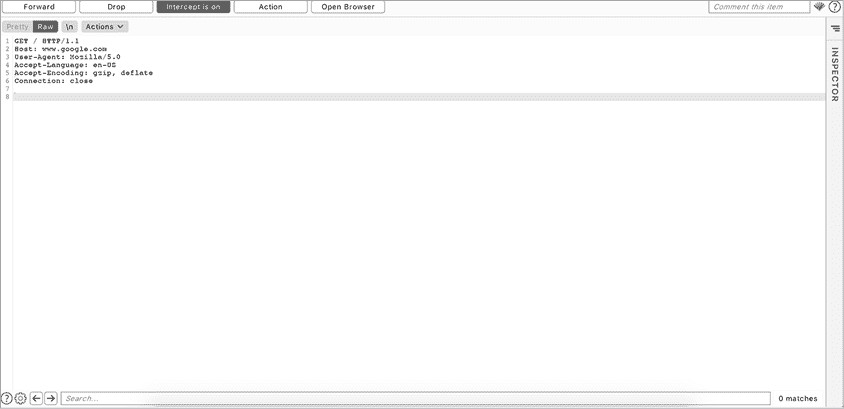

图 4-8：Burp 代理标签显示拦截已开启。

当你在 Firefox 或 Burp 的内置浏览器中浏览一个网站时，你应该会看到一个 HTTP/HTTPS 请求出现在主窗口中。当拦截功能开启时，你浏览器发送的每个请求都会通过 Burp，除非你在代理窗口中点击 **Forward**，否则它不会发送到服务器。你可以利用这个机会在发送请求到服务器之前修改请求，或者将其转发到 Burp 的其他模块。你还可以使用窗口底部的搜索栏来搜索请求或响应中的字符串。

要将请求转发到另一个 Burp 模块，右键点击请求并选择 **Send to** ***Module***（图 4-9）。

让我们通过使用 Burp 代理来练习拦截和修改流量！进入 Burp 代理并开启流量拦截。然后打开 Firefox 或 Burp 的内置浏览器，访问 [`www.google.com/`](https://www.google.com/)。如同前面一节中所做的，点击 **Forward**，直到你看到带有主机名 *www.google.com* 的请求。你应该会看到类似于以下的请求：

```
GET / HTTP/1.1
Host: www.google.com
User-Agent: Mozilla/5.0Accept-Language: en-US
Accept-Encoding: gzip, deflate
Connection: close
```

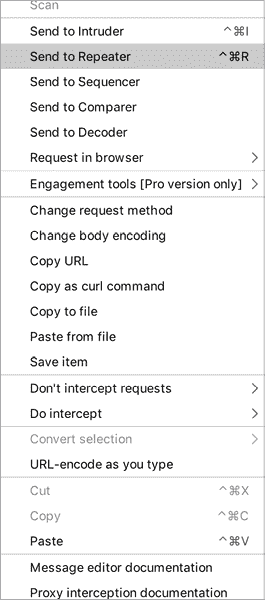

图 4-9：你可以通过右键点击请求或响应将其转发到不同的 Burp 模块。

在发送请求之前，让我们先修改一下这个请求。将`Accept-Language`头部的值更改为`de`。

```
GET / HTTP/1.1
Host: www.google.com
User-Agent: Mozilla/5.0
Accept-Language: **de**
Accept-Encoding: gzip, deflate
Connection: close
```

点击**转发**将请求发送到谷歌的服务器。你应该会看到谷歌的德语主页在你的浏览器窗口中显示出来（图 4-10）。

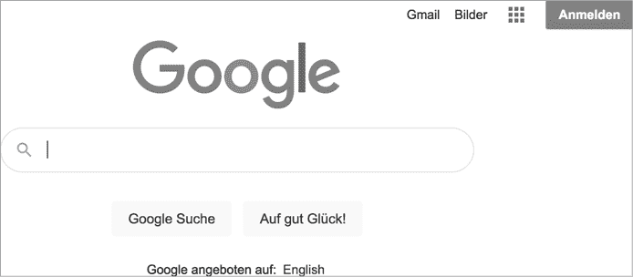

图 4-10：谷歌的德语主页

如果你是德语使用者，可以反向进行测试：将`Accept-Language`头部的值从`de`切换到`en`。你应该会看到谷歌的英文主页。恭喜！你现在已经成功地通过代理拦截、修改并转发了一个 HTTP 请求。

### 入侵者

Burp 的*入侵者*工具可以自动发送请求。如果你使用的是 Burp 的社区版，入侵者将是一个有限的试用版本。但它仍然允许你进行像*暴力破解*这样的攻击，攻击者会使用一组预设的值提交大量请求到服务器，查看服务器是否有不同的响应。例如，一个黑客获取了常用密码的列表后，可以通过反复提交登录请求，使用所有常见密码来尝试突破你的账户。你可以通过右键单击代理窗口中的请求并选择**发送到入侵者**来将请求发送到入侵者。

入侵者选项卡中的**目标**屏幕让你指定要攻击的主机和端口（图 4-11）。如果你从代理转发请求，主机和端口会为你自动填充。

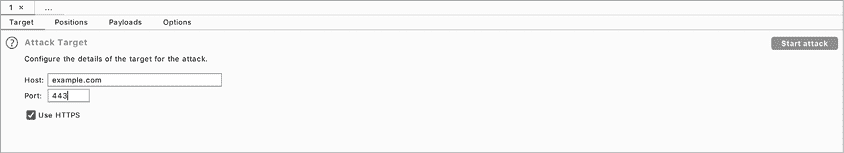

图 4-11：你可以在目标屏幕上指定要攻击的主机和端口。

入侵者提供了多种自定义攻击的方式。对于每个请求，你可以选择使用的有效载荷和有效载荷位置。*有效载荷*是你想要插入到请求中特定位置的数据。*有效载荷位置*则指定哪些请求部分将被你选择的有效载荷替代。例如，假设用户通过向*example.com/login*发送 POST 请求登录*example.com*。在 Burp 中，这个请求可能看起来像这样：

```
POST /login HTTP/1.1
Host: example.com
User-Agent: Mozilla/5.0
Accept: text/html,application/xhtml+xml,application/xml
Accept-Language: en-US
Accept-Encoding: gzip, deflate
Connection: close 
username=vickie&password=abc123
```

POST 请求体包含两个参数：`username`和`password`。如果你想暴力破解一个用户的账户，可以只更改请求中的`password`字段，保持其他部分不变。为了实现这一点，指定有效载荷位置在**位置**屏幕中（图 4-12）。要将请求的一部分添加到有效载荷位置，选中该文本并点击右侧的**添加**。

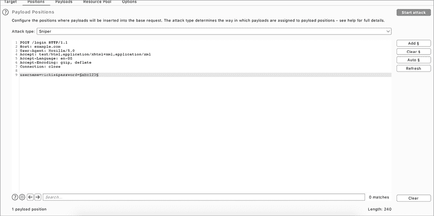

图 4-12：你可以在位置屏幕上指定有效载荷位置。

然后，切换到**有效负载**屏幕（图 4-13）。在这里，你可以选择插入请求的有效负载。为了暴力破解登录密码，你可以在这里添加常用密码列表。你还可以例如使用一组数字来暴力破解请求中的 ID，或使用你从互联网上下载的攻击有效负载列表。重用他人共享的攻击有效负载可以帮助你更快地找到漏洞。我们将在第二十五章详细讲解如何使用重用的有效负载来寻找漏洞。


图 4-13：在有效负载屏幕上选择你的有效负载列表。

一旦指定了这些内容，点击**开始攻击**按钮以启动自动化测试。入侵者会为你列出的每个有效负载发送一个请求并记录所有响应。然后你可以查看响应和响应代码，并寻找有趣的结果。

### 重放器

*重放器*可能是你最常用的工具（图 4-14）。你可以使用它修改请求并详细检查服务器响应。你还可以使用它将有趣的请求收藏，以便稍后再回来查看。

尽管重放器和入侵者都允许你操作请求，但这两种工具的目的截然不同。入侵者通过自动发送经过程序修改的请求来自动化攻击，而重放器则用于对单个请求进行手动、详细的修改。

通过右键点击请求并选择**发送到重放器**，将请求发送到重放器。

重放器屏幕的左侧是请求。你可以在这里修改请求，并通过点击顶部的**发送**按钮将修改后的请求发送到服务器。服务器返回的相应响应将显示在右侧。

重放器适合手动利用漏洞，尝试绕过过滤器，测试不同的攻击方法，目标是相同的端点。

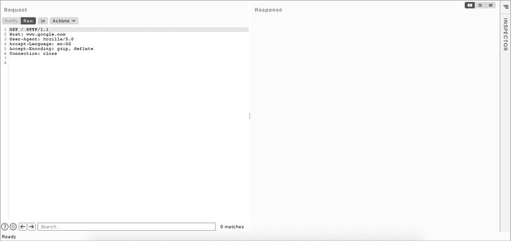

图 4-14：重放器适用于对请求进行仔细检查和手动利用。

### 解码器

Burp 的*解码器*是一个方便的工具，用于编码和解码你在请求和响应中发现的数据（图 4-15）。我通常使用它来解码、操作并重新编码应用数据，然后再将其转发给应用程序。

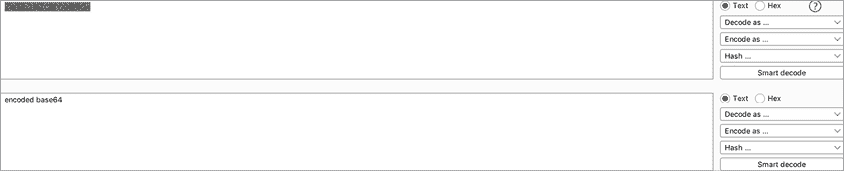

图 4-15：你可以使用解码器解码应用数据，以便阅读或操作其明文。

通过在任何请求或响应中高亮一段文本，然后右键点击并选择**发送到解码器**，将数据发送到解码器。使用右侧的下拉菜单指定用于编码或解码消息的算法。如果你不确定消息使用了哪种编码算法，可以尝试**智能解码**。Burp 会尝试检测编码方式并相应地解码消息。

### 比较器

*比较器*是一种比较请求或响应的方式（图 4-16）。它会突出显示两块文本之间的差异。你可能会使用它来检查参数差异如何影响从服务器得到的响应，例如。

通过高亮显示请求或响应中的文本块，然后右键点击并选择**发送到比较器**，可以将数据发送到比较器。

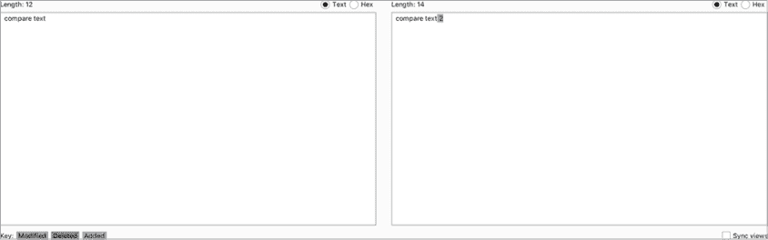

图 4-16：比较器将突出显示两块文本之间的差异。

### 保存 Burp 请求

你也可以在 Burp 中保存请求和响应。只需右键点击任何请求并选择**复制 URL**、**复制为 curl 命令**或**复制到文件**，将这些结果存储到该目标的笔记文件夹中。复制 URL 选项复制请求的 URL。复制为 curl 命令选项复制整个请求，包括请求方法、URL、头部和主体，以 curl 命令的形式。复制到文件选项将整个请求保存到单独的文件中。

## 关于...做笔记的最后提醒

在开始查找下章中的漏洞之前，给你一句建议：组织技能对于成功参与漏洞悬赏至关重要。当你处理具有大范围的目标或同时黑客多个目标时，从目标收集到的信息可能会迅速膨胀，变得难以管理。

通常，你不会立刻找到漏洞。相反，你会发现很多奇怪的行为和配置错误，这些问题当前可能无法被利用，但你可以在后续攻击中将它们与其他行为结合起来。你需要对找到的任何新功能、配置错误、小漏洞和可疑端点做好笔记，以便快速回头使用它们。

笔记还有助于你规划攻击。你可以跟踪你的黑客进展、已测试的功能和仍需检查的功能。这样可以避免通过反复测试相同的功能浪费时间。

笔记的另一个好用法是记录你了解到的漏洞信息。记录每个漏洞的细节，如其理论概念、潜在影响、利用步骤以及示例概念验证代码。随着时间的推移，这将增强你的技术技能，并积累一个技术库，必要时可以重新访问。

由于这些笔记往往会膨胀并变得非常杂乱，从一开始就将其组织好是非常重要的。我喜欢使用 Sublime Text ([`www.sublimetext.com/`](https://www.sublimetext.com/)) 在纯文本文件中做笔记，并通过将它们分类到目录中来组织，针对每个目标和主题再创建子目录。

例如，你可以为每个正在处理的目标创建一个文件夹，如 Facebook、Google 或 Verizon。然后，在这些文件夹中创建文件，记录有趣的端点、新的和隐藏的功能、侦察结果、草稿报告和 POC（概念验证）。

找到一种适合你的笔记和组织策略。例如，如果你像我一样更喜欢以纯文本存储笔记，你可以寻找一个让你感觉最舒适的集成开发环境（IDE）或文本编辑器。有些人喜欢使用 Markdown 格式来做笔记。在这种情况下，Obsidian（[`obsidian.md/`](https://obsidian.md/)）是一个非常好的工具，可以以有序的方式展示你的笔记。如果你喜欢使用思维导图来组织想法，可以试试思维导图工具 XMind（[`www.xmind.net/`](https://www.xmind.net/)）。

将你的漏洞赏金笔记保存在一个集中位置，比如外部硬盘或云存储服务（如 Google Drive 或 Dropbox），并且不要忘记定期备份你的笔记！

总结一下，以下是一些帮助你做好笔记的技巧：

+   记录任何异常行为、新特性、配置错误、轻微的漏洞和可疑的端点，以便跟踪潜在的安全漏洞。

+   做笔记以跟踪你的黑客进展，已经测试的特性以及那些你还需要检查的特性。

+   在学习时做笔记：记下你所学到的每个漏洞的信息，比如它的理论概念、潜在影响、利用步骤以及示例 POC 代码。

+   从一开始就保持笔记的有序，这样当你需要时就能轻松找到！

+   找到一个适合你的笔记和组织流程。你可以尝试一些笔记工具，如 Sublime Text、Obsidian 和 XMind，找出最适合你的工具。
