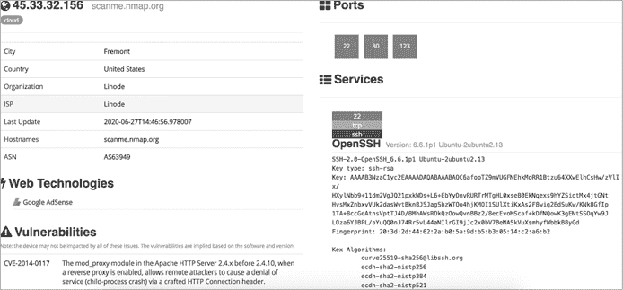
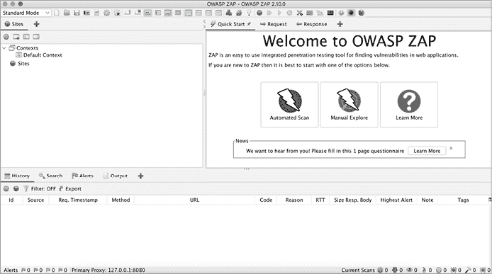
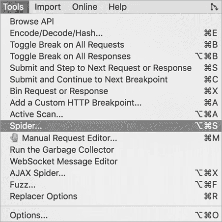
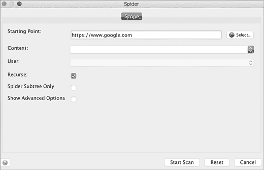
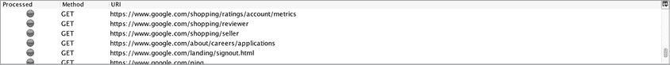
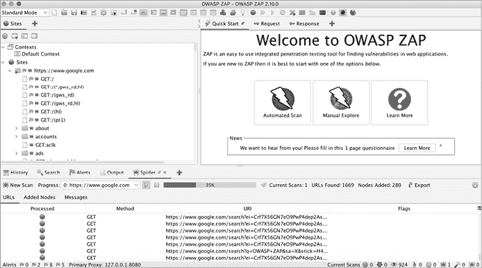
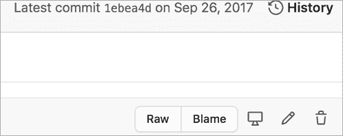
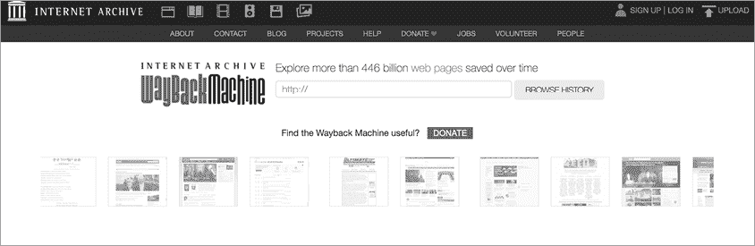

# Web 渗透测试侦察


攻击任何目标的第一步是进行*侦察*，简单来说，就是收集关于目标的信息。侦察很重要，因为它是你了解应用程序攻击面的方法。为了最有效地寻找漏洞，你需要在决定最有效的攻击方法之前，发现所有可能的攻击目标的方式。

例如，如果一个应用程序不使用 PHP，就没有必要测试它的 PHP 漏洞；如果组织没有使用 Amazon Web Services (AWS)，你也不应该浪费时间尝试破解其存储桶。通过了解目标的工作原理，你可以为发现漏洞奠定坚实的基础。侦察技能是区分一个优秀黑客和一个无效黑客的关键。

在本章中，我将介绍最有用的侦察技术，供漏洞赏金猎人使用。然后，我将带你学习如何编写 bash 脚本来自动化侦察任务，并提高效率。*Bash* 是一个在 macOS 和 Linux 系统上可用的 shell 解释器。虽然本章假设你使用的是 Linux 系统，但你应该能够在其他操作系统上安装许多这些工具。你需要在使用这些工具之前先安装它们。我在本章的末尾包含了所有工具的链接。

在你继续之前，请验证你是否被允许对目标进行侵入式侦察，再尝试任何与目标进行主动交互的技术。特别是，端口扫描、爬虫和目录暴力破解等活动可能会在网站上生成大量不必要的流量，并且可能不受组织的欢迎。

## 手动浏览目标

在我们深入讨论其他内容之前，首先手动浏览应用程序会帮助你了解它。尝试通过浏览每一页和点击每个链接，发现应用程序中用户可以访问的每一个功能。访问你通常不使用的功能。

例如，如果你在进行 Facebook 渗透测试，尝试创建一个事件、玩一个游戏，并使用支付功能，如果你之前从未这样做过。注册每个权限级别的账户，以揭示应用程序的所有功能。例如，在 Slack 上，你可以创建工作区的所有者、管理员和成员。还可以创建属于不同频道的用户，但在同一个工作区下。这样，你就可以看到不同用户在应用程序中的视图。

这应该能给你一个大致的了解，关于*攻击面*（攻击者可以尝试利用应用程序的所有不同点）的样子，数据输入点在哪里，以及不同用户之间如何互动。然后，你可以开始更深入的侦察过程：了解应用程序的技术和结构。

## Google Dorking

在寻找漏洞时，你经常需要研究漏洞的细节。如果你正在利用潜在的跨站脚本攻击（XSS）漏洞，你可能想要找到你在 GitHub 上看到的某个特定有效载荷。高级搜索引擎技巧将帮助你快速、准确地找到所需的资源。

事实上，高级 Google 搜索是一种黑客经常使用的强大技术，用于执行侦察。黑客将其称为*Google dorking*。对于普通人来说，Google 只是一个用来查找图片、视频和网页的文本搜索工具。但对于黑客而言，Google 可以成为发现有价值信息的手段，如隐藏的管理员门户、解锁的密码文件和泄露的身份验证密钥。

Google 的搜索引擎有自己内置的查询语言，可以帮助你筛选搜索结果。以下是一些可以与任何 Google 搜索一起使用的最有用的操作符：

**site**

1.  告诉 Google 只显示来自某个特定网站的结果。这将帮助你快速找到你正在研究的主题的最权威来源。例如，如果你想搜索 Python 的 `print()` 函数的语法，你可以通过以下搜索将结果限制为官方 Python 文档：`print site:python.org`。

**inurl**

1.  查找 URL 匹配搜索字符串的页面。这是搜索特定网站上存在漏洞页面的一种强大方式。假设你读了一篇博客，介绍了网站上名为*/course/jumpto.php*的页面可能表明存在远程代码执行漏洞。你可以通过搜索`inurl:"/course/jumpto.php" site:example.com`来检查目标是否存在该漏洞。

**intitle**

1.  查找页面标题中的特定字符串。这很有用，因为它可以帮助你找到包含特定类型内容的页面。例如，web 服务器上的文件列表页面通常在标题中包含*index of*。你可以使用此查询来搜索网站上的目录页面：`intitle:"index of" site:example.com`*。

**link**

1.  查找包含指定 URL 链接的网页。你可以用它来查找关于不常见技术或漏洞的文档。例如，假设你正在研究不常见的正则表达式拒绝服务（ReDoS）漏洞。你可以轻松找到它的定义，但可能很难找到实例。`link` 操作符可以发现引用漏洞 Wikipedia 页面来定位讨论同一话题的页面：`link:"https://en.wikipedia.org/wiki/ReDoS"`。

**filetype**

1.  查找具有特定文件扩展名的页面。这是一个非常强大的黑客工具；黑客经常使用它来定位目标站点上可能敏感的文件，比如日志文件和密码文件。例如，以下查询会在目标站点上搜索日志文件，这些文件通常具有*.log*文件扩展名：`filetype:log site:example.com`。

**Wildcard (`*`)**

1.  你可以在搜索中使用通配符运算符 (`*`) 来表示*任何字符或字符序列*。例如，以下查询将返回任何以*how to hack*开头并以*using Google*结尾的字符串。它会匹配像*how to hack websites using Google*、*how to hack applications using Google*等字符串：`"how to hack * using Google"`。

**引号 (`"` `"`)**

1.  在搜索词周围添加引号可以强制精确匹配。例如，这个查询将搜索包含短语*如何黑客攻击*的页面：`"how to hack"`。而这个查询将搜索包含*how*、*to* 和 *hack* 的页面，但它们不一定会出现在一起：`how to hack`。

**或运算符 (`|`)**

1.  或运算符由管道字符 (`|`) 表示，可以用来搜索一个或另一个搜索词，或者同时搜索两者。管道字符必须用空格分隔。例如，这个查询将在 Reddit 或 Stack Overflow 上搜索*如何黑客攻击*：`"how to hack" site:(reddit.com | stackoverflow.com)`。而这个查询将搜索提到*SQL 注入*或*SQLi*的网页：`(SQL Injection | SQLi)`。*SQLi* 是一个常用于指代 SQL 注入攻击的缩写，我们将在第十一章讨论这一点。

**减号 (`-`)**

1.  减号运算符 (`-`) 排除某些搜索结果。例如，假设你有兴趣了解讨论黑客攻击的网站，但不包括那些讨论黑客攻击 PHP 的网站。这个查询将搜索包含*如何黑客攻击网站*但不包含*php*的页面：`"how to hack websites" -php`。

你可以通过多种方式使用高级搜索引擎选项来提高工作效率。你甚至可以搜索*Google 搜索运算符*以发现更多功能。这些运算符可能比你预期的更有用。例如，查找某个公司所有子域名的方法如下：

```
site:*.example.com
```

你还可以寻找可能导致漏洞的特殊端点。*Kibana* 是一个数据可视化工具，展示服务器操作数据，如服务器日志、调试信息和服务器状态。被攻击的 Kibana 实例可以让攻击者收集关于网站运行的广泛信息。许多 Kibana 仪表盘位于 *app/kibana* 路径下，因此这个查询将揭示目标是否有 Kibana 仪表盘。你可以尝试访问该仪表盘，看看它是否没有保护：

```
site:example.com inurl:app/kibana
```

Google 可以找到由第三方在线托管的公司资源，例如 Amazon S3 存储桶（我们将在第 74 页的“第三方托管”部分详细讨论这些内容）：

```
site:s3.amazonaws.com `COMPANY_NAME`
```

查找可能指示敏感文件的特殊扩展名。除了 *.log*，它通常表示日志文件外，还可以搜索 *.php*、*cfm*、*asp*、*.jsp* 和 *.pl*，这些扩展名通常用于脚本文件：

```
site:example.com ext:php
site:example.com ext:log
```

最后，你还可以结合多个搜索词进行更精确的搜索。例如，这个查询将在*example.com*网站上搜索包含*password*的文本文件：

```
site:example.com ext:txt password
```

除了构建自己的查询外，可以查看 Google Hacking Database（[`www.exploit-db.com/google-hacking-database/`](https://www.exploit-db.com/google-hacking-database/)），这是黑客和安全从业者用来共享 Google 搜索查询以查找与安全相关信息的网站。它包含许多在侦察过程中对你有帮助的搜索查询。例如，你可以找到搜索包含密码的文件、常见的管理员门户 URL 或者使用易受攻击软件构建的页面的查询。

当你使用 Google 搜索进行侦察时，请记住，如果你发送大量搜索查询，Google 会开始要求来自你网络的访问者在继续搜索前进行 CAPTCHA 挑战。这可能会对你网络上的其他人造成困扰，所以我不建议在企业或共享网络上进行 Google dorking。

## 范围发现

现在让我们深入了解侦察过程。首先，始终验证目标的范围。一款程序的*范围*会在其政策页面上明确，说明哪些子域名、产品和应用程序是你可以攻击的。仔细核实哪些公司资产在范围内，以避免在侦察和攻击过程中越界。例如，如果*example.com*的政策规定*dev.example.com*和*test.example.com*不在范围内，那么你不应对这些子域名进行任何侦察或攻击。

验证完这些内容后，了解实际的范围。你可以攻击哪些域名、子域名和 IP 地址？组织在这些机器上托管了哪些公司资产？

### WHOIS 和反向 WHOIS

当公司或个人注册域名时，他们需要向域名注册商提供识别信息，如邮寄地址、电话号码和电子邮件地址。任何人都可以通过使用`whois`命令查询这些信息，该命令查找每个已知域名的注册人和所有者信息。你可能能够找到关联的联系信息，如电子邮件、姓名、地址或电话号码：

```
$ **whois** `facebook.com`
```

这些信息并不总是可用的，因为一些组织和个人使用一种叫做*域名隐私*的服务，在这种服务中，第三方服务提供商会将用户的信息替换为转发服务的相关信息。

然后你可以进行*反向 WHOIS* 搜索，通过使用组织名称、电话号码或电子邮件地址查询数据库，找到与其注册的域名。通过这种方式，你可以找到所有属于同一所有者的域名。反向 WHOIS 对于查找不公开的、模糊的或内部域名非常有用。使用像 ViewDNS.info（[`viewdns.info/reversewhois/`](https://viewdns.info/reversewhois/)）这样的公共反向 WHOIS 工具进行此类搜索。WHOIS 和反向 WHOIS 将为你提供一组良好的顶级域名供你使用。

### IP 地址

发现目标的顶级域名的另一种方法是查找 IP 地址。通过运行`nslookup`命令查找你已知域名的 IP 地址。你可以看到这里的*facebook.com* 位于 157.240.2.35：

```
$ **nslookup facebook.com**
Server: 192.168.0.1
Address: 192.168.0.1#53
Non-authoritative answer:
Name: facebook.com
Address: 157.240.2.35
```

一旦你找到了已知域名的 IP 地址，就执行反向 IP 查找。*反向 IP* 搜索是通过给定一个 IP 或域名来查找托管在同一服务器上的域名。你也可以使用 ViewDNS.info 进行查找。

还可以对一个 IP 地址运行`whois`命令，然后查看目标是否有专用的 IP 范围，通过检查`NetRange`字段来确认。*IP 范围*是一个 IP 地址块，所有地址都属于同一个组织。如果该组织拥有专用的 IP 范围，那么你在该范围内找到的任何 IP 都属于该组织：

```
$ whois 157.240.2.35**NetRange:       157.240.0.0 - 157.240.255.255**
CIDR:           157.240.0.0/16
NetName:        THEFA-3
NetHandle:      NET-157-240-0-0-1
Parent:         NET157 (NET-157-0-0-0-0)
NetType:        Direct Assignment
OriginAS:
Organization:   Facebook, Inc. (THEFA-3)
RegDate:        2015-05-14
Updated:        2015-05-14
Ref:            https://rdap.arin.net/registry/ip/157.240.0.0
OrgName:        Facebook, Inc.
OrgId:          THEFA-3
Address:        1601 Willow Rd.
City:           Menlo Park
StateProv:      CAPostalCode:     94025
Country:        US
RegDate:        2004-08-11
Updated:        2012-04-17
Ref:            https://rdap.arin.net/registry/entity/THEFA-3
OrgAbuseHandle: OPERA82-ARIN
OrgAbuseName:   Operations
OrgAbusePhone:  +1-650-543-4800
OrgAbuseEmail:  noc@fb.com
OrgAbuseRef:    https://rdap.arin.net/registry/entity/OPERA82-ARIN
OrgTechHandle: OPERA82-ARIN
OrgTechName:   Operations
OrgTechPhone:  +1-650-543-4800
OrgTechEmail:  noc@fb.com
OrgTechRef:    https://rdap.arin.net/registry/entity/OPERA82-ARIN
```

查找范围内的 IP 地址的另一种方法是查看自治系统，这些是公共互联网中的可路由网络。*自治系统编号（**ASNs**）*标识这些网络的所有者。通过检查两个 IP 地址是否共享同一 ASN，你可以判断这两个 IP 是否属于同一个所有者。

要确定一个公司是否拥有专用的 IP 范围，可以运行多个 IP 到 ASN 的转换，看这些 IP 是否映射到同一个 ASN。如果一个范围内的许多地址都属于同一个 ASN，那么该组织可能拥有专用的 IP 范围。从以下输出可以推断，157.240.2.21 到 157.240.2.34 范围内的任何 IP 很可能属于 Facebook：

```
$ **whois -h whois.cymru.com 157.240.2.20**
AS      | IP               | AS Name
32934   | 157.240.2.20     | FACEBOOK, US
$ **whois -h whois.cymru.com 157.240.2.27**
AS      | IP               | AS Name
32934   | 157.240.2.27     | FACEBOOK, US
$ **whois -h whois.cymru.com 157.240.2.35**
AS      | IP               | AS Name
32934   | 157.240.2.35     | FACEBOOK, US
```

`whois`命令中的`-h`标志设置了 WHOIS 服务器，以便从中获取信息，*whois.cymru.com* 是一个将 IP 转换为 ASN 的数据库。如果公司有专用的 IP 范围且没有将这些地址标记为不可范围，你可以计划攻击该范围内的每一个 IP。

### 证书解析

查找主机的另一种方法是利用用于加密 Web 流量的安全套接字层（SSL）证书。SSL 证书的*主题备用名称*字段允许证书所有者指定使用相同证书的附加主机名，因此你可以通过解析此字段来找到这些主机名。可以使用像 crt.sh、Censys 和 Cert Spotter 等在线数据库来查找某个域名的证书。

例如，通过使用 crt.sh 运行证书搜索，可以找到 *facebook.com* 的 SSL 证书。你会看到很多其他属于 Facebook 的域名也列在其中：

```
X509v3 Subject Alternative Name: DNS:*.facebook.com DNS:*.facebook.net DNS:*.fbcdn.net DNS:*.fbsbx.com DNS:*.messenger.com DNS:facebook.com DNS:messenger.com DNS:*.m.facebook.com DNS:*.xx.fbcdn.net DNS:*.xy.fbcdn.net DNS:*.xz.fbcdn.net
```

crt.sh 网站也提供了一个有用的工具，允许你以 JSON 格式而非 HTML 格式检索信息，方便解析。只需在请求 URL 中添加 URL 参数`output=json`：*https://crt.sh/?q=facebook.com&output=json.*

### 子域名枚举

在找到尽可能多的目标域名后，尽量找到这些域名的更多子域名。每个子域名代表一个攻击网络的新角度。枚举子域名的最佳方法是使用自动化工具。

像 Sublist3r、SubBrute、Amass 和 Gobuster 这样的工具可以通过多种词表和策略自动枚举子域名。例如，Sublist3r 通过查询搜索引擎和在线子域名数据库来工作，而 SubBrute 是一种暴力破解工具，通过猜测可能的子域名，直到找到真实的子域名。Amass 结合了 DNS 区域传输、证书解析、搜索引擎和子域名数据库来查找子域名。你可以构建一个工具，将多个工具的结果结合起来，以获得最佳的结果。我们将在第 80 页的“编写你自己的侦察脚本”中讨论如何做到这一点。

要使用许多子域名枚举工具，你需要为程序提供一个包含可能出现在子域名中的术语的词表。你可以在网上找到一些其他黑客制作的优秀词表。Daniel Miessler 的 SecLists 位于[`github.com/danielmiessler/SecLists/`](https://github.com/danielmiessler/SecLists/)是一个相当全面的词表。你还可以使用像 Commonspeak2（[`github.com/assetnote/commonspeak2`](https://github.com/assetnote/commonspeak2)/）这样的词表生成工具，根据最新的互联网数据生成词表。最后，你可以结合在线找到的多个词表或自己生成的词表，以获得最全面的结果。以下是一个简单的命令，用于删除两个词表集合中的重复项：

```
sort -u wordlist1.txt wordlist2.txt
```

`sort`命令行工具用于排序文本文件中的行。当提供多个文件时，它将对所有文件进行排序，并将输出写入终端。`-u`选项告诉`sort`返回排序列表中仅包含唯一项。

Gobuster 是一种暴力破解工具，用于发现目标 Web 服务器上的子域名、目录和文件。它的 DNS 模式用于子域名暴力破解。在此模式下，你可以使用`-d`标志指定你要暴力破解的域名，使用`-w`标志指定你要使用的词表：

```
gobuster dns -d `target_domain` -w `wordlist` 
```

一旦你找到了足够多的子域名，你可以通过识别模式来发现更多。例如，如果你找到*example.com*的两个子域名，分别是*1.example.com*和*3.example.com*，你可以猜测*2.example.com*也可能是一个有效的子域名。一个自动化这个过程的好工具是 Altdns（[`github.com/infosec-au/altdns/`](https://github.com/infosec-au/altdns/)），它通过其他子域名名称的排列组合来发现子域名。

此外，你可以根据你对公司技术栈的了解来发现更多的子域名。例如，如果你已经知道*example.com*使用 Jenkins，你可以检查*jenkins.example.com*是否是一个有效的子域名。

还要查找子域名的子域名。在你找到例如*dev.example.com*之后，你可能会找到像*1.dev.example.com*这样的子域名。你可以通过递归运行枚举工具来查找子域名的子域名：将第一次运行的结果添加到你的已知域名列表中，并再次运行该工具。

### 服务枚举

接下来，枚举你找到的机器上托管的服务。由于服务通常运行在默认端口上，一种有效的发现方法是通过端口扫描机器，使用主动扫描或被动扫描。

在*主动扫描*中，你直接与服务器进行交互。主动扫描工具发送请求以连接到目标机器的端口，寻找开放的端口。你可以使用像 Nmap 或 Masscan 这样的工具进行主动扫描。例如，这个简单的 Nmap 命令可以揭示 *scanme.nmap.org* 上的开放端口：

```
$ **nmap scanme.nmap.org**
Nmap scan report for scanme.nmap.org (45.33.32.156)
Host is up (0.086s latency).
Other addresses for scanme.nmap.org (not scanned): 2600:3c01::f03c:91ff:fe18:bb2f
Not shown: 993 closed ports
PORT STATE SERVICE
22/tcp open ssh
25/tcp filtered smtp
80/tcp open http
135/tcp filtered msrpc
445/tcp filtered microsoft-ds
9929/tcp open nping-echo
31337/tcp open Elite
Nmap done: 1 IP address (1 host up) scanned in 230.83 seconds
```

另一方面，在*被动扫描*中，你使用第三方资源了解机器的端口，而无需与服务器交互。被动扫描更为隐蔽，有助于攻击者避免被检测到。为了在不主动扫描机器的情况下发现其服务，你可以使用*Shodan*，这是一个搜索引擎，允许用户查找连接到互联网的机器。

使用 Shodan，你可以根据主机名或 IP 地址等标准发现摄像头、web 服务器，甚至是电厂。例如，如果你对 *scanme.nmap.org* 的 IP 地址 45.33.32.156 进行 Shodan 搜索，你会得到图 5-1 中的结果。你可以看到，该搜索结果与我们的端口扫描结果不同，并且提供了关于服务器的额外信息。



图 5-1：*scanme.nmap.org* 的 Shodan 搜索结果页面

Shodan 的替代工具包括 Censys 和 Project Sonar。结合从不同数据库中收集的信息，能够获得最佳结果。通过这些数据库，你还可能找到目标的 IP 地址、证书和软件版本。

### 目录暴力破解

你可以做的下一个事情是对你找到的 web 服务器的目录进行暴力破解。找到服务器上的目录很有价值，因为通过这些目录，你可能会发现隐藏的管理员面板、配置文件、密码文件、过时的功能、数据库副本和源代码文件。目录暴力破解有时可以直接让你接管服务器！

即使你无法立即找到任何漏洞，目录信息通常也能告诉你应用程序的结构和技术。例如，包含 *phpmyadmin* 的路径名通常意味着该应用程序是用 PHP 构建的。

你可以使用 Dirsearch 或 Gobuster 进行目录暴力破解。这些工具使用字典列表来构建 URL，然后向 web 服务器请求这些 URL。如果服务器以 200 范围内的状态码响应，说明该目录或文件存在。这意味着你可以访问该页面，查看应用程序在其中托管的内容。404 状态码意味着目录或文件不存在，而 403 状态码表示它存在但被保护。仔细检查 403 页面，看看是否可以绕过保护来访问内容。

下面是运行 Dirsearch 命令的示例。`-u` 标志指定主机名，`-e` 标志指定构建 URL 时使用的文件扩展名：

```
$ **./dirsearch.py -u scanme.nmap.org -e php**
Extensions: php | HTTP method: get | Threads: 10 | Wordlist size: 6023
Error Log: /tools/dirsearch/logs/errors.log
Target: scanme.nmap.org
[12:31:11] Starting:
[12:31:13] 403 -  290B  - /.htusers
[12:31:15] 301 -  316B  - /.svn  ->  http://scanme.nmap.org/.svn/
[12:31:15] 403 -  287B  - /.svn/
[12:31:15] 403 -  298B  - /.svn/all-wcprops
[12:31:15] 403 -  294B  - /.svn/entries
[12:31:15] 403 -  297B  - /.svn/prop-base/
[12:31:15] 403 -  296B  - /.svn/pristine/
[12:31:15] 403 -  291B  - /.svn/tmp/
[12:31:15] 403 -  315B  - /.svn/text-base/index.php.svn-base
[12:31:15] 403 -  293B  - /.svn/props/
[12:31:15] 403 -  297B  - /.svn/text-base/
[12:31:40] 301 -  318B  - /images  ->  http://scanme.nmap.org/images/
[12:31:40] 200 -   7KB  - /index
[12:31:40] 200 -   7KB  - /index.html
[12:31:53] 403 -  295B  - /server-status
[12:31:53] 403 -  296B  - /server-status/
[12:31:54] 301 -  318B  - /shared  ->  http://scanme.nmap.org/shared/
Task Completed 
```

Gobuster 的 Dir 模式用于查找特定域或子域上的附加内容，包括隐藏的目录和文件。在此模式下，你可以使用 `-u` 标志指定要暴力破解的域或子域，使用 `-w` 标志指定要使用的字典列表：

```
gobuster dir -u `target_url` -w `wordlist`
```

手动访问通过暴力破解找到的所有页面可能非常耗时。相反，可以使用截图工具，如 EyeWitness（[`github.com/FortyNorthSecurity/EyeWitness/`](https://github.com/FortyNorthSecurity/EyeWitness/)）或 Snapper（[`github.com/dxa4481/Snapper/`](https://github.com/dxa4481/Snapper/)），自动验证每个位置是否托管了某个页面。EyeWitness 接受一个 URL 列表，并对每个页面进行截图。在照片图库应用中，你可以快速浏览这些截图，找到看起来有趣的页面。留意隐藏的服务，如开发者或管理员面板、目录列出页面、分析页面，以及看起来过时且维护不当的页面。这些都是常见的漏洞出现的地方。

### 网站爬虫

发现目录和路径的另一种方法是通过 *网页爬虫*，或称网页抓取，这是用来识别网站上所有页面的过程。网页爬虫工具从一个页面开始访问。然后它识别页面中嵌入的所有 URL 并访问这些页面。通过递归访问网站所有页面中找到的所有 URL，网页爬虫可以揭示应用中的许多隐藏端点。

OWASP Zed Attack Proxy (ZAP) 在 [`www.zaproxy.org/`](https://www.zaproxy.org/) 上有一个内置的网页爬虫工具你可以使用（图 5-2）。这个开源安全工具包括扫描器、代理和许多其他功能。Burp Suite 有一个等效的工具叫做 *crawler*，但我更喜欢 ZAP 的爬虫工具。



图 5-2：OWASP ZAP 的启动页面

通过打开 ZAP 并选择 **工具**▶**爬虫**，可以访问其爬虫工具（图 5-3）。



图 5-3：你可以通过工具▶爬虫找到爬虫工具。

你应该看到一个用于指定起始 URL 的窗口（图 5-4）。



图 5-4：你可以指定要扫描的目标 URL。

点击 **开始扫描**。你应该看到 URLs 在底部窗口弹出（图 5-5）。



图 5-5：扫描结果会显示在 OWASP ZAP 窗口的底部窗格。

你还应该看到 ZAP 窗口左侧出现一个网站树（图 5-6）。它以有组织的格式显示了在目标服务器上找到的文件和目录。



图 5-6：左侧窗口中的网站树显示了在目标服务器上找到的文件和目录。

### 第三方托管

查看公司使用的第三方托管痕迹。例如，查找该组织的 S3 存储桶。*S3*（简单存储服务）是亚马逊的在线存储产品。组织可以支付费用将资源存储在*存储桶*中，供其 Web 应用程序使用，或者将 S3 存储桶作为备份或存储位置。如果一个组织使用 Amazon S3，其 S3 存储桶可能包含隐藏的端点、日志、凭证、用户信息、源代码以及其他可能对你有用的信息。

如何找到一个组织的存储桶？一种方法是通过 Google dorking，正如前面提到的那样。大多数存储桶使用 URL 格式*BUCKET.s3.amazonaws.com* 或 *s3.amazonaws.com/BUCKET*，因此以下搜索词可能会找到结果：

```
site:s3.amazonaws.com `COMPANY_NAME`
site:amazonaws.com `COMPANY_NAME`
```

如果公司为其 S3 存储桶使用自定义 URL，尝试使用更灵活的搜索词。公司通常仍然会在自定义存储桶 URL 中放置像*aws*和*s3*这样的关键词，所以可以尝试以下搜索：

```
amazonaws s3 `COMPANY_NAME`
amazonaws bucket `COMPANY_NAME`
amazonaws `COMPANY_NAME`
s3 `COMPANY_NAME`
```

另一种寻找存储桶的方法是搜索公司的公开 GitHub 仓库，查找 S3 URL。试着在这些仓库中搜索*s3*这个词。我们将在“GitHub Recon”部分讨论如何使用 GitHub 进行侦查。

*GrayhatWarfare*（[`buckets.grayhatwarfare.com/`](https://buckets.grayhatwarfare.com/)）是一个在线搜索引擎，你可以用它来查找公开暴露的 S3 存储桶（图 5-7）。它允许你通过关键词搜索存储桶。输入与目标相关的关键词，如应用程序、项目或组织名称，以找到相关存储桶。


图 5-7：GrayhatWarfare 主页

最后，你可以尝试使用关键词进行暴力破解存储桶。*Lazys3*（[`github.com/nahamsec/lazys3/`](https://github.com/nahamsec/lazys3/)）是一个帮助你实现这一点的工具。它依赖一个单词列表来猜测常见存储桶名称的排列组合。另一个有用的工具是*Bucket Stream*（[`github.com/eth0izzle/bucket-stream/`](https://github.com/eth0izzle/bucket-stream/)），它解析属于某个组织的证书，并根据证书中找到的域名排列组合来查找 S3 存储桶。Bucket Stream 还会自动检查存储桶是否可访问，从而节省了你的时间。

一旦你找到了几个属于目标组织的存储桶，使用 AWS 命令行工具查看是否能访问其中一个。使用以下命令安装该工具：

```
pip install awscli
```

然后按照亚马逊的文档配置它与 AWS 配合使用，文档地址为[`docs.aws.amazon.com/cli/latest/userguide/cli-chap-configure.html`](https://docs.aws.amazon.com/cli/latest/userguide/cli-chap-configure.html)。现在你应该能够通过`aws s3`命令直接从终端访问存储桶。试着列出你找到的存储桶的内容：

```
aws s3 ls s3://`BUCKET_NAME`/
```

如果成功，看看你是否能够通过将文件复制到本地机器来读取任何有趣的文件内容：

```
aws s3 cp s3://`BUCKET_NAME`/`FILE_NAME/path/to/local/directory`
```

收集通过存储桶泄露的任何有用信息，并将其用于未来的利用！如果该组织泄露了诸如活跃的 API 密钥或个人信息等内容，你应该立刻报告。单独暴露的 S3 存储桶通常被视为一种漏洞。你还可以尝试向存储桶上传新文件或删除文件。如果你能篡改其内容，可能会影响网页应用的操作或损坏公司数据。例如，这个命令将把你本地的文件 *TEST_FILE* 复制到目标的 S3 存储桶中：

```
aws s3 cp TEST_FILE s3://`BUCKET_NAME`/
```

而这个命令将删除你刚刚上传的 *TEST_FILE*：

```
aws s3 rm s3://`BUCKET_NAME`/TEST_FILE
```

这些命令是一种无害的方式，证明你对某个存储桶具有写入权限，而不会实际篡改目标公司的文件。

始终上传并删除你自己的测试文件。除非你愿意承担高额的诉讼费用，否则在测试过程中不要冒险删除重要的公司资源。

### GitHub 侦察

在组织的 GitHub 仓库中搜索意外提交的敏感数据，或可能导致发现漏洞的信息。

从查找与你目标相关的 GitHub 用户名开始。你应该能够通过 GitHub 的搜索栏搜索组织名称或产品名称，或通过检查已知员工的 GitHub 账户来找到这些用户名。

当你找到需要审计的用户名后，访问他们的页面。查找与你测试的项目相关的仓库并记录下来，同时记录下该组织顶级贡献者的用户名，这将帮助你找到更多相关的仓库。

然后深入代码。对于每个仓库，特别关注 Issues 和 Commits 部分。这些部分充满了潜在的信息泄漏：它们可能指引攻击者找到未解决的 bug、问题代码以及最近的代码修复和安全补丁。最近的代码更可能包含 bug，因为它们经受的时间考验较少。查看任何已实现的保护机制，看看是否可以绕过它们。你还可以在 Code 部分搜索可能存在漏洞的代码片段。找到感兴趣的文件后，查看文件页面右上角的 Blame 和 History 部分，了解它是如何开发的（图 5-8）。



图 5-8：History 和 Blame 部分

我们将在第二十二章深入探讨源代码审查，但在侦察阶段，重点寻找硬编码的密钥、API 密钥、加密密钥和数据库密码等机密信息。在组织的仓库中搜索*key*、*secret*和*password*等术语，寻找硬编码的用户凭证，这些凭证可以用于访问内部系统。找到泄露的凭证后，你可以使用 KeyHacks（[`github.com/streaak/keyhacks/`](https://github.com/streaak/keyhacks/)）检查这些凭证是否有效，并了解如何利用它们访问目标的服务。

你还应该在项目中搜索敏感功能。看看是否有源代码处理重要功能，如身份验证、密码重置、状态更改操作或私密信息读取。注意涉及用户输入的代码，例如 HTTP 请求参数、HTTP 头部、HTTP 请求路径、数据库条目、文件读取和文件上传，因为这些可能为攻击者提供了利用应用程序漏洞的潜在入口点。还要查找任何配置文件，因为它们可以帮助你收集更多有关基础设施的信息。另外，搜索旧的端点和 S3 存储桶 URL，看看是否可以攻击这些。记录这些文件，以便日后进一步审查。

过时的依赖项和未检查的危险函数使用也是导致漏洞的重要来源。注意正在使用的依赖项和导入项，并查看版本列表，看看它们是否已经过时。记录所有过时的依赖项。你可以稍后使用这些信息，寻找可以作用于目标的公开披露漏洞。

像 Gitrob 和 TruffleHog 这样的工具可以自动化 GitHub 的侦查过程。*Gitrob* ([`github.com/michenriksen/gitrob/`](https://github.com/michenriksen/gitrob/)) 可以定位推送到 GitHub 公共仓库中的潜在敏感文件。*TruffleHog* ([`github.com/trufflesecurity/truffleHog/`](https://github.com/trufflesecurity/truffleHog/)) 专门通过执行正则表达式搜索和扫描高熵字符串来查找仓库中的秘密。

## 其他隐蔽的 OSINT 技巧

到目前为止，我讨论的许多策略都是 *开放源代码情报（OSINT）* 的例子，即从公开的信息源收集情报的实践。本节详细介绍了你可能使用的其他 OSINT 来源，以提取有价值的信息。

首先，查看公司发布的工程职位招聘信息。工程职位的招聘广告通常会透露公司使用的技术。例如，可以看看类似这样的广告：

**全栈工程师**

1.  最低资格要求：

1.  精通 Python 和 C/C++

1.  有 Linux 经验

1.  有 Flask、Django 和 Node.js 的经验

1.  有亚马逊 Web 服务（AWS）经验，特别是 EC2、ECS、S3 和 RDS

从这些信息中，你可以得知公司使用 Flask、Django 和 Node.js 构建其 Web 应用程序。工程师们很可能在后台使用 Python、C 和 C++，并且运行在 Linux 机器上。最后，他们使用 AWS 外包运营和文件存储。

如果找不到相关的职位招聘信息，可以搜索员工在 LinkedIn 上的个人资料，阅读员工的个人博客或他们在 Stack Overflow 和 Quora 等论坛上的工程问题。公司顶尖员工的专业知识通常反映了开发中使用的技术。

另一个信息来源是员工的 Google 日历。人们的工作日历通常包含会议记录、幻灯片，甚至有时包含登录凭证。如果员工不小心将他们的日历公开，你就可能获得这些信息。组织或其员工的社交媒体页面也可能泄露有价值的信息。例如，黑客曾发现一些有效凭证出现在办公室自拍背景中的便利贴上！

如果公司有工程邮件列表，可以注册加入，以便了解公司的技术和开发过程。同时，检查公司的 SlideShare 或 Pastebin 账户。有时，当组织在会议上演讲或举行内部会议时，他们会将幻灯片上传到 SlideShare 以供参考。你可能能够找到关于公司技术栈和面临的安全挑战的信息。

Pastebin（[`pastebin.com/`](https://pastebin.com/)）是一个用于在线暂时存储文本的网站。人们用它来跨机器或与他人共享文本。工程师有时用它来与同事共享源代码或服务器日志，以便查看或协作，因此它可能是一个重要的信息来源。你也可能会发现上传的凭证和开发者评论。你可以访问 Pastebin，搜索目标组织的名称，看看会发生什么！你也可以使用自动化工具，如 PasteHunter（[`github.com/kevthehermit/PasteHunter/`](https://github.com/kevthehermit/PasteHunter/)）来扫描公开粘贴的数据。

最后，参考类似 Wayback Machine 的存档网站（[`archive.org/web/`](https://archive.org/web/)），这是一个互联网内容的数字化记录（图 5-9）。它记录了网站在不同时间点的内容。通过 Wayback Machine，你可以找到旧的端点、目录列表、被遗忘的子域名、URL 和仍在使用的过时文件。Tomnomnom 的工具 Waybackurls（[`github.com/tomnomnom/waybackurls/`](https://github.com/tomnomnom/waybackurls/)）可以自动从 Wayback Machine 提取端点和 URL。



图 5-9：Wayback Machine 存档了互联网，并允许你查看已被网站删除的页面。

## 技术栈指纹识别

指纹识别技术可以帮助你更好地理解目标应用程序。*指纹识别*是识别机器或应用程序使用的软件品牌和版本。这些信息使你能够对应用程序执行有针对性的攻击，因为你可以搜索与特定版本相关的已知配置错误和公开披露的漏洞。例如，如果你知道服务器使用的是一个老版本的 Apache，而这个版本可能受到已披露的漏洞的影响，你可以立即尝试利用该漏洞攻击服务器。

安全社区将已知漏洞分类为 *Common Vulnerabilities and Exposures (**CVEs)* 并为每个 CVE 分配一个编号以供参考。可以在 CVE 数据库 ([`cve.mitre.org/cve/search_cve_list.html`](https://cve.mitre.org/cve/search_cve_list.html)) 中搜索它们。

对应用程序进行指纹识别的最简单方法是直接与应用程序进行交互。首先，在一台机器上运行带有 `-sV` 参数的 Nmap，以启用端口扫描时的版本检测。在这里，你可以看到 Nmap 尝试为我们识别目标主机上运行的某些软件：

```
$ **nmap scanme.nmap.org -sV**
Starting Nmap 7.60 ( https://nmap.org )
Nmap scan report for scanme.nmap.org (45.33.32.156)Host is up (0.065s latency).
Other addresses for scanme.nmap.org (not scanned): 2600:3c01::f03c:91ff:fe18:bb2f
Not shown: 992 closed ports
PORT STATE SERVICE VERSION
22/tcp open ssh **OpenSSH 6.6.1p1 Ubuntu 2ubuntu2.13 (Ubuntu Linux; protocol 2.0)**
25/tcp filtered smtp
80/tcp open http **Apache httpd 2.4.7 ((Ubuntu))**
135/tcp filtered msrpc
139/tcp filtered netbios-ssn
445/tcp filtered microsoft-ds
9929/tcp open nping-echo **Nping echo**
31337/tcp open tcpwrapped
Service Info: OS: Linux; CPE: cpe:/o:linux:linux_kernel
Service detection performed. Please report any incorrect results at https://nmap.org/submit/.
Nmap done: 1 IP address (1 host up) scanned in 9.19 seconds
```

接下来，在 Burp 中，发送 HTTP 请求到服务器，检查使用的 HTTP 头部，以便获得关于技术栈的洞察。服务器可能泄漏许多对指纹识别其技术有用的信息：

```
Server: Apache/2.0.6 (Ubuntu)
X-Powered-By: PHP/5.0.1
X-Generator: Drupal 8
X-Drupal-Dynamic-Cache: UNCACHEABLE
Set-Cookie: PHPSESSID=abcde;
```

HTTP 头部信息，如 `Server` 和 `X-Powered-By`，是技术的重要指示器。`Server` 头部通常会透露服务器上运行的软件版本。`X-Powered-By` 显示服务器或脚本语言的使用情况。此外，某些头部信息仅由特定技术使用。例如，只有 Drupal 使用 `X-Generator` 和 `X-Drupal-Dynamic-Cache`。技术特定的 cookies，如 `PHPSESSID` 也是线索；如果服务器返回一个名为 `PHPSESSID` 的 cookie，那么该网站很可能是用 PHP 开发的。

网页的 HTML 源代码也可以提供线索。许多 Web 框架或其他技术会在源代码中嵌入一个标识。右键单击页面，选择 **查看源代码**，然后按 CTRL-F 搜索像 *powered by*、*built with* 和 *running* 这样的短语。例如，你可能会在源代码中找到 `Powered by: WordPress 3.3.2`。

检查技术特定的文件扩展名、文件名、文件夹和目录。例如，根目录下的一个名为 *phpmyadmin* 的文件，如 *https://example.com/phpmyadmin*，意味着该应用程序运行的是 PHP。一个名为 *jinja2* 的目录包含模板，意味着该网站可能使用 Django 和 Jinja2。你可以通过访问特定技术的文档，了解更多关于该技术文件系统标识的信息。

有多个应用程序可以自动化这一过程。*Wappalyzer* ([`www.wappalyzer.com/`](https://www.wappalyzer.com/)) 是一个浏览器扩展，它可以识别网站上使用的内容管理系统、框架和编程语言。*BuiltWith* ([`builtwith.com/`](https://builtwith.com/)) 是一个网站，它显示网站使用了哪些 Web 技术。*StackShare* ([`stackshare.io/`](https://stackshare.io/)) 是一个在线平台，允许开发者分享他们使用的技术。你可以用它来查看该组织的开发者是否发布了他们的技术栈。最后，Retire.js 是一个检测过时 JavaScript 库和 Node.js 包的工具。你可以使用它检查网站上的过时技术。

## 编写你自己的侦察脚本

你可能已经意识到，好的侦察是一个广泛的过程。但它不一定是耗时的或难以管理的。我们已经讨论了几种利用自动化力量来简化过程的工具。

有时你可能会发现编写自己的脚本非常有用。*脚本*是由程序执行的一系列命令。它们用于自动化任务，比如数据分析、网页生成和系统管理。对于我们这些漏洞赏金猎人来说，脚本是快速高效地进行侦察、测试和利用的一种方式。例如，你可以编写一个脚本来扫描目标的新子域名，或者枚举服务器上可能敏感的文件和目录。一旦你学会了编写脚本，可能性是无限的。

本节特别介绍了 bash 脚本——它们是什么以及为什么你应该使用它们。你将学习如何使用 bash 来简化你的侦察过程，甚至编写你自己的工具。我假设你已经具备编程语言的基础知识，包括变量、条件语句、循环和函数，因此，如果你不熟悉这些概念，请在 Codecademy ([`www.codecademy.com/`](https://www.codecademy.com/)) 上参加入门编码课程或阅读一本编程书籍。

Bash 脚本，或任何类型的 shell 脚本，对于管理复杂性和自动化重复任务非常有用。如果你的命令涉及多个输入参数，或者一个命令的输入依赖于另一个命令的输出，那么手动输入所有这些内容可能会迅速变得复杂，并增加编程错误的风险。另一方面，你可能有一组命令需要执行多次。此时，脚本非常有用，因为它可以避免你一次又一次地输入相同的命令。每次运行脚本即可，轻松完成。

### 理解 Bash 脚本基础

让我们编写第一个脚本。打开任何文本编辑器跟着做。你编写的每个 shell 脚本的第一行应该是 *shebang* *行*。它以一个井号（`#`）和一个感叹号（`!`）开头，声明脚本使用的解释器。这使得纯文本文件能够像二进制文件一样执行。我们将使用它来指示我们使用的是 bash。

假设我们想编写一个脚本，执行两个命令；它应该先运行 Nmap，然后再在目标上运行 Dirsearch。我们可以这样将命令放入脚本中：

```
#!/bin/bash
nmap scanme.nmap.org
/PATH/TO/dirsearch.py -u scanme.nmap.org -e php
```

这个脚本并不是很有用；它只能扫描一个网站，*scanme.nmap.org*。相反，我们应该让用户提供输入参数给 bash 脚本，这样他们就可以选择要扫描的网站。在 bash 语法中，`$1` 表示传入的第一个参数，`$2` 是第二个参数，以此类推。此外，`$@` 表示所有传入的参数，而 `$#` 表示参数的总数。让我们允许用户通过第一个输入参数来指定目标，将其分配给变量 `$1`：

```
#!/bin/bash
nmap $1
/PATH/TO/dirsearch.py -u $1 -e php
```

现在，无论用户传入什么域名作为第一个参数，命令都将执行。

请注意，脚本的第三行包含 */PATH/TO/dirsearch.py*。你应该将 */PATH/TO/* 替换为你存储 Dirsearch 脚本的目录的绝对路径。如果你没有指定其位置，计算机会尝试在当前目录中查找，除非你将 Dirsearch 文件存储在与 shell 脚本相同的目录中，否则 bash 将找不到它。

确保脚本可以找到要使用的命令的另一种方法是通过 `PATH` 变量，`PATH` 是 Unix 系统中的一个环境变量，用于指定可执行二进制文件的位置。如果你运行此命令将 Dirsearch 的目录添加到 `PATH`，你就可以在任何地方运行该工具，而无需指定其绝对路径：

```
export PATH="PATH_TO_DIRSEARCH:$PATH"
```

执行此命令后，你应该能够直接使用 Dirsearch：

```
#!/bin/bash
nmap $1
dirsearch.py -u $1 -e php
```

请注意，重新启动终端后，你需要再次运行 `export` 命令，以便 `PATH` 包含 Dirsearch 的路径。如果你不想一遍又一遍地导出 `PATH`，可以将 `export` 命令添加到你的 *~/**.bash_profile* 文件中，该文件用于存储你的 bash 配置和偏好设置。你可以通过使用你喜欢的文本编辑器打开 *~/.bash_profile*，并将 `export` 命令添加到文件的末尾。

脚本已经完成！将其保存在当前目录，并命名为 *recon.sh*。*.sh* 扩展名是 shell 脚本的常见扩展名。确保终端的工作目录与存储脚本的目录相同，可以通过运行命令 `cd /``location``/``of``/``your``/``script` 来确认。然后在终端中执行此命令来运行脚本：

```
$ ./recon.sh
```

你可能会看到类似以下的消息：

```
permission denied: ./recon.sh
```

这是因为当前用户没有执行脚本的权限。出于安全考虑，大多数文件默认不能执行。你可以通过在终端中运行以下命令，向所有人添加执行权限来修正这个问题：

```
$ chmod +x recon.sh
```

`chmod` 命令用于修改文件权限，`+x` 表示我们要为所有用户添加执行权限。如果你只想为脚本的所有者授予执行权限，可以改用以下命令：

```
$ chmod 700 recon.sh
```

现在像之前一样运行脚本。尝试将 *scanme.nmap.org* 作为第一个参数传入。你应该会看到 Nmap 和 Dirsearch 的输出：

```
$ **./recon.sh scanme.nmap.org**
Starting Nmap 7.60 ( https://nmap.org )
Nmap scan report for scanme.nmap.org (45.33.32.156)
Host is up (0.062s latency).
Other addresses for scanme.nmap.org (not scanned): 2600:3c01::f03c:91ff:fe18:bb2f
Not shown: 992 closed ports
PORT      STATE    SERVICE
22/tcp    open     ssh
25/tcp    filtered smtp
80/tcp    open     http
135/tcp   filtered msrpc
139/tcp   filtered netbios-ssn
445/tcp   filtered microsoft-ds
9929/tcp  open     nping-echo
31337/tcp open     Elite
Nmap done: 1 IP address (1 host up) scanned in 2.16 seconds
Extensions: php | HTTP method: get | Threads: 10 | Wordlist size: 6023
Error Log: /Users/vickieli/tools/dirsearch/logs/errors.log
Target: scanme.nmap.org
[11:14:30] Starting:
[11:14:32] 403 -  295B  - /.htaccessOLD2
[11:14:32] 403 -  294B  - /.htaccessOLD
[11:14:33] 301 -  316B  - /.svn  ->  http://scanme.nmap.org/.svn/
[11:14:33] 403 -  298B  - /.svn/all-wcprops
[11:14:33] 403 -  294B  - /.svn/entries
[11:14:33] 403 -  297B  - /.svn/prop-base/
[11:14:33] 403 -  296B  - /.svn/pristine/
[11:14:33] 403 -  315B  - /.svn/text-base/index.php.svn-base
[11:14:33] 403 -  297B  - /.svn/text-base/
[11:14:33] 403 -  293B  - /.svn/props/
[11:14:33] 403 -  291B  - /.svn/tmp/
[11:14:55] 301 -  318B  - /images  ->  http://scanme.nmap.org/images/ 
[11:14:56] 200 -    7KB - /index
[11:14:56] 200 -    7KB - /index.html[11:15:08] 403 -  296B  - /server-status/
[11:15:08] 403 -  295B  - /server-status
[11:15:08] 301 -  318B  - /shared  ->  http://scanme.nmap.org/shared/
Task Completed
```

### 将工具输出保存到文件

为了以后分析 recon 结果，你可能想将脚本的输出保存到一个单独的文件中。这时，输入和输出重定向就派上用场了。*输入重定向*是使用文件的内容或另一个程序的输出作为脚本的输入。*输出重定向*是将程序的输出重定向到另一个位置，比如文件或另一个程序。以下是一些最常用的重定向操作符：

1.  `PROGRAM` `>` `FILENAME` 将程序的输出写入具有该名称的文件中。（它会首先清空文件中的任何内容。如果文件不存在，它还会创建该文件。）

1.  `PROGRAM` `>>` `FILENAME` 将程序的输出追加到文件末尾，而不清除文件的原始内容。

1.  `PROGRAM` `<` `FILENAME` 从文件读取内容，并将其用作程序的输入。

1.  `PROGRAM1` `|` `PROGRAM2` 将`PROGRAM1`的输出作为`PROGRAM2`的输入。

例如，我们可以将 Nmap 和 Dirsearch 扫描的结果分别写入不同的文件：

```
#!/bin/bash
echo "Creating directory $1_recon." 1
mkdir $1_recon 2
nmap $1 > $1_recon/nmap 3
echo "The results of nmap scan are stored in $1_recon/nmap."
/PATH/TO/dirsearch.py -u $1 -e php 4 --simple-report=$1_recon/dirsearch
echo "The results of dirsearch scan are stored in $1_recon/dirsearch."
```

`echo`命令 1 将消息打印到终端。接下来，`mkdir`创建一个名为*DOMAIN_recon*的目录 2。我们将`nmap`的结果存储到新创建的目录 3 中的名为*nmap*的文件中。Dirsearch 的`simple-report`标志 4 将在指定位置生成报告。我们将 Dirsearch 的结果存储到新目录中的名为*dirsearch*的文件中。

你可以通过引入变量来引用文件、名称和值，使脚本更易管理。在 bash 中，可以使用以下语法为变量赋值：`VARIABLE_NAME``=``VARIABLE_VALUE`。注意等号两边不要有空格。引用变量的语法是`$``VARIABLE_NAME`。让我们将这些实现到脚本中：

```
#!/bin/bash
PATH_TO_DIRSEARCH="/Users/vickieli/tools/dirsearch"
DOMAIN=$1
DIRECTORY=${DOMAIN}_recon 1
echo "Creating directory $DIRECTORY."
mkdir $DIRECTORYnmap $DOMAIN > $DIRECTORY/nmap
echo "The results of nmap scan are stored in $DIRECTORY/nmap."
$PATH_TO_DIRSEARCH/dirsearch.py -u $DOMAIN -e php –simple-report=$DIRECTORY/dirsearch 2
echo "The results of dirsearch scan are stored in $DIRECTORY/dirsearch."
```

我们使用`${DOMAIN}_recon`而不是`$DOMAIN_recon`1，因为否则 bash 会将`DOMAIN_recon`的整体识别为变量名。大括号告诉 bash，`DOMAIN`是变量名，`_recon`是我们附加的纯文本。注意，我们还将 Dirsearch 的路径存储在一个变量中，以便将来可以轻松更改 2。

通过重定向，现在你可以编写运行多个工具的 Shell 脚本，并将它们的输出保存在不同的文件中。

### 将扫描日期添加到输出中

假设你想将当前日期添加到脚本的输出中，或选择要运行的扫描，而不是总是运行 Nmap 和 Dirsearch。如果你想编写具有更多功能的工具，像这样，你需要了解一些高级 Shell 脚本概念。

例如，一个有用的功能是*命令替换*，即对命令的输出进行操作。使用`$()`会告诉 Unix 执行括号内的命令，并将其输出赋值给变量的值。让我们练习使用这个语法：

```
#!/bin/bash
PATH_TO_DIRSEARCH="/Users/vickieli/tools/dirsearch"
TODAY=$(date) 1
echo "This scan was created on $TODAY" 2
DOMAIN=$1
DIRECTORY=${DOMAIN}_recon
echo "Creating directory $DIRECTORY."
mkdir $DIRECTORY
nmap $DOMAIN > $DIRECTORY/nmap
echo "The results of nmap scan are stored in $DIRECTORY/nmap."
$PATH_TO_DIRSEARCH/dirsearch.py -u $DOMAIN -e php --simple-report=$DIRECTORY/dirsearch
echo "The results of dirsearch scan are stored in $DIRECTORY/dirsearch."
```

在第 1 行，我们将`date`命令的输出赋值给变量`TODAY`。`date`命令显示当前的日期和时间。这样我们可以输出一条信息，指示我们执行扫描的日期 2。

### 添加选项以选择要运行的工具

现在，为了选择性地运行某些工具，你需要使用条件语句。在 bash 中，`if`语句的语法如下。注意，条件语句以`fi`关键字结束，即`if`的反向拼写：

```
if [ `condition 1` ]
then # Do if condition 1 is satisfied
elif [ `condition 2` ]
then # Do if condition 2 is satisfied, and condition 1 is not satisfied
else # Do something else if neither condition is satisfied
fi
```

假设我们希望用户能够指定扫描的`MODE`，像这样：

```
$ ./recon.sh scanmme.nmap.org MODE
```

我们可以像这样实现这个功能：

```
#!/bin/bash
PATH_TO_DIRSEARCH="/Users/vickieli/tools/dirsearch"
TODAY=$(date)
echo "This scan was created on $TODAY"
DIRECTORY=${DOMAIN}_recon
echo "Creating directory $DIRECTORY."
mkdir $DIRECTORY 
if [ $2 == "nmap-only" ] 1
then nmap $DOMAIN > $DIRECTORY/nmap 2 echo "The results of nmap scan are stored in $DIRECTORY/nmap."
elif [ $2 == "dirsearch-only" ] 3
then   $PATH_TO_DIRSEARCH/dirsearch.py -u $DOMAIN -e php –simple-report=$DIRECTORY/dirsearch 4 echo "The results of dirsearch scan are stored in $DIRECTORY/dirsearch."
else 5 nmap $DOMAIN > $DIRECTORY/nmap 6 echo "The results of nmap scan are stored in $DIRECTORY/nmap." $PATH_TO_DIRSEARCH/dirsearch.py -u $DOMAIN -e php --simple-report=$DIRECTORY/dirsearch echo "The results of dirsearch scan are stored in $DIRECTORY/dirsearch."
fi
```

如果用户指定了`nmap-only` 1，我们只运行`nmap`并将结果存储到名为*nmap* 2 的文件中。如果用户指定了`dirsearch-only` 3，我们只执行并存储 Dirsearch 的结果 4。如果用户没有指定任何选项 5，我们运行两个扫描 6。

现在，你可以通过在命令中指定其中一个来让工具只运行 Nmap 或 Dirsearch 命令：

```
$ ./recon.sh scanme.nmap.org nmap-only
$ ./recon.sh scanme.nmap.org dirsearch-only
```

### 运行附加工具

如果你想要从 crt.sh 工具获取信息的选项呢？例如，你想在这三种模式之间切换，或者一次运行所有三个侦察工具：

```
$ ./recon.sh scanme.nmap.org nmap-only
$ ./recon.sh scanme.nmap.org dirsearch-only
$ ./recon.sh scanme.nmap.org crt-only
```

我们可以重写`if-else`语句来处理三种选项：首先，我们检查`MODE`是否为`nmap-only`。然后检查`MODE`是否为`dirsearch-only`，最后检查`MODE`是否为`crt-only`。但是这会有很多`if-else`语句，使得代码变得复杂。

相反，我们使用 bash 的`case`语句，它允许你将多个值与一个变量进行匹配，而无需遍历冗长的`if-else`语句列表。`case`语句的语法如下所示。请注意，语句以`esac`结束，或者说是`case`的反向写法：

```
case $`VARIABLE_NAME` in case1) `Do something` ;; case2) `Do something` ;;  caseN) `Do something` ;; *)        Default case, this case is executed if no other case matches. ;; 
esac
```

我们可以通过使用`case`语句来改进我们的脚本，而不是使用多个`if-else`语句：

```
#!/bin/bash
PATH_TO_DIRSEARCH="/Users/vickieli/tools/dirsearch"
TODAY=$(date)
echo "This scan was created on $TODAY"
DOMAIN=$1
DIRECTORY=${DOMAIN}_recon
echo "Creating directory $DIRECTORY."
mkdir $DIRECTORY
case $2 in nmap-only) nmap $DOMAIN > $DIRECTORY/nmap echo "The results of nmap scan are stored in $DIRECTORY/nmap." ;; dirsearch-only) $PATH_TO_DIRSEARCH/dirsearch.py -u $DOMAIN -e php --simple-report=$DIRECTORY/dirsearch echo "The results of dirsearch scan are stored in $DIRECTORY/dirsearch." ;;          crt-only)        curl "https://crt.sh/?q=$DOMAIN&output=json" -o $DIRECTORY/crt 1 echo "The results of cert parsing is stored in $DIRECTORY/crt." ;; *) nmap $DOMAIN > $DIRECTORY/nmap echo "The results of nmap scan are stored in $DIRECTORY/nmap." $PATH_TO_DIRSEARCH/dirsearch.py -u $DOMAIN -e php --simple-report=$DIRECTORY/dirsearch echo "The results of dirsearch scan are stored in $DIRECTORY/dirsearch." curl "https://crt.sh/?q=$DOMAIN&output=json" -o $DIRECTORY/crt echo "The results of cert parsing is stored in $DIRECTORY/crt." ;;
esac
```

`curl`命令 1 用于下载页面内容。我们在这里使用它从 crt.sh 下载数据。而`curl`的`-o`选项让你指定输出文件。但注意，我们的代码有很多重复！每种类型的扫描代码重复了两次。让我们通过使用函数来减少重复。bash 函数的语法如下所示：

```
`FUNCTION_NAME()`
{ `DO_SOMETHING`
}
```

在你声明了一个函数之后，可以像调用其他 shell 命令一样在脚本中调用它。让我们为脚本添加函数：

```
#!/bin/bash
PATH_TO_DIRSEARCH="/Users/vickieli/tools/dirsearch"
TODAY=$(date)
echo "This scan was created on $TODAY"
DOMAIN=$1
DIRECTORY=${DOMAIN}_recon
echo "Creating directory $DIRECTORY."
mkdir $DIRECTORY
nmap_scan() 1
{ nmap $DOMAIN > $DIRECTORY/nmap echo "The results of nmap scan are stored in $DIRECTORY/nmap."
}
dirsearch_scan() 2
{ $PATH_TO_DIRSEARCH/dirsearch.py -u $DOMAIN -e php --simple-report=$DIRECTORY/dirsearch echo "The results of dirsearch scan are stored in $DIRECTORY/dirsearch."
}
crt_scan() 3
{ curl "https://crt.sh/?q=$DOMAIN&output=json" -o $DIRECTORY/crt echo "The results of cert parsing is stored in $DIRECTORY/crt."
}
case $2 in 4 nmap-only) nmap_scan ;; dirsearch-only) dirsearch_scan ;;          crt-only)        crt_scan ;; *)        nmap_scan dirsearch_scan crt_scan ;; 
esac
```

你可以看到我们简化了代码。我们创建了三个函数，`nmap_scan` 1、`dirsearch_scan` 2 和 `crt_scan` 3。我们将`scan`和`echo`命令放入这些函数中，这样我们就可以反复调用它们，而无需一遍又一遍地写相同的代码 4。这种简化在这里可能看起来不多，但通过函数重用代码，当你编写更复杂的程序时，它将为你节省大量麻烦。

请记住，所有 bash 变量都是*全局*的，除了输入参数如`$1`、`$2`和`$3`。这意味着像`$DOMAIN`、`$DIRECTORY`和`$PATH_TO_DIRSEARCH`这样的变量在我们声明它们后将可以在整个脚本中使用，即使它们是在函数内声明的。另一方面，像`$1`、`$2`和`$3`这样的参数值只能指代函数调用时传入的值，因此你不能在函数内使用脚本的输入参数，如下所示：

```
nmap_scan()
{ nmap $1 > $DIRECTORY/nmap  echo "The results of nmap scan are stored in $DIRECTORY/nmap."
}
nmap_scan
```

这里，函数中的`$1`指的是`nmap_scan`被调用时传入的第一个参数，而不是我们的*recon.sh*脚本被调用时传入的参数。由于`nmap_scan`没有传入任何参数，`$1`是空的。

### 解析结果

现在我们有一个执行三种类型扫描并将结果存储到文件中的工具。但扫描之后，我们仍然需要手动读取并理解复杂的输出文件。有没有办法加速这个过程呢？

假设你想在输出文件中搜索某些信息。你可以使用*全局正则表达式打印*（*`grep`*）来完成。这个命令行工具用于在文本、文件和命令输出中执行搜索。一个简单的`grep`命令如下所示：

```
grep password file.txt
```

这告诉`grep`在文件*file.txt*中搜索字符串`password`，然后在标准输出中打印匹配的行。例如，我们可以快速搜索 Nmap 输出文件，查看目标是否开放了 80 端口：

```
$ grep 80 TARGET_DIRECTORY/nmap
80/tcp open http
```

你还可以通过在搜索字符串中使用正则表达式来使搜索更加灵活。*正则表达式*，或*regex*，是一种描述搜索模式的特殊字符串。它可以帮助你仅显示输出的特定部分。例如，你可能已经注意到，Nmap 命令的输出如下所示：

```
Starting Nmap 7.60 ( https://nmap.org )
Nmap scan report for scanme.nmap.org (45.33.32.156)
Host is up (0.065s latency).
Other addresses for scanme.nmap.org (not scanned): 2600:3c01::f03c:91ff:fe18:bb2f
Not shown: 992 closed ports
PORT STATE SERVICE
22/tcp open ssh
25/tcp filtered smtp
80/tcp open http
135/tcp filtered msrpc
139/tcp filtered netbios-ssn
445/tcp filtered microsoft-ds
9929/tcp open nping-echo
31337/tcp open Elite
Nmap done: 1 IP address (1 host up) scanned in 2.43 seconds
```

你可能希望从文件中剔除不相关的消息，使其更像这样：

```
PORT STATE SERVICE
22/tcp open ssh
25/tcp filtered smtp
80/tcp open http
135/tcp filtered msrpc
139/tcp filtered netbios-ssn
445/tcp filtered microsoft-ds
9929/tcp open nping-echo
31337/tcp open Elite
```

使用此命令过滤掉 Nmap 输出开始和结尾的消息，只保留报告的核心部分：

```
grep -E "^\S+\s+\S+\s+\S+$" DIRECTORY/nmap > DIRECTORY/nmap_cleaned
```

`-E`标志告诉`grep`你正在使用正则表达式。正则表达式由两部分组成：常量和运算符。*常量*是字符串集，而*运算符*是表示对这些字符串进行操作的符号。这两种元素结合起来，使正则表达式成为强大的模式匹配工具。以下是表示字符的正则表达式运算符的快速概述：

1.  `\d`匹配任何数字。

1.  `\w`匹配任何字符。

1.  `\s`匹配任何空白字符，而`\S`匹配任何非空白字符。

1.  `.`匹配任何单个字符。

1.  `\`转义特殊字符。

1.  `^`匹配字符串或行的开头。

1.  `$`匹配字符串或行的结尾。

还有几个运算符指定要匹配的字符数量：

1.  `*`匹配前一个字符零次或多次。

1.  `+`匹配前一个字符一次或多次。

1.  `{3}`匹配前一个字符三次。

1.  `{1, 3}`匹配前一个字符一次到三次。

1.  `{1, }`匹配前一个字符一次或多次。

1.  `[``abc``]`匹配括号中的一个字符。

1.  `[``a``-``z``]`匹配`a`到`z`范围内的一个字符。

1.  `(``a``|``b``|``c``)`匹配`a`、`b`或`c`。

让我们再看一遍这里的正则表达式。记住`\s`匹配任何空白字符，而`\S`匹配任何非空白字符吗？这意味着`\s+`将匹配一个或多个空白字符，而`\S+`将匹配一个或多个非空白字符。这个正则表达式模式指定我们应提取包含三个字符串并由两个空格分隔的行：

```
"^\S+\s+\S+\s+\S+$"
```

过滤后的输出将如下所示：

```
PORT STATE SERVICE
22/tcp open ssh
25/tcp filtered smtp
80/tcp open http
135/tcp filtered msrpc
139/tcp filtered netbios-ssn
445/tcp filtered microsoft-ds
9929/tcp open nping-echo
31337/tcp open Elite
```

为了处理命令输出中可能存在的额外空格，让我们在搜索字符串周围再添加两个可选的空格：

```
"^\s*\S+\s+\S+\s+\S+\s*$"
```

你可以使用更多高级的正则表达式特性来进行更复杂的匹配。然而，这一组简单的操作符足以满足我们的需求。要了解完整的正则表达式语法，请阅读 RexEgg 的备忘单([`www.rexegg.com/regex-quickstart.html`](https://www.rexegg.com/regex-quickstart.html))。

### 构建主报告

如果你想从所有三个输出文件生成一个主报告怎么办？你需要解析来自 crt.sh 的 JSON 文件。你可以使用`jq`来完成这项任务，`jq`是一个处理 JSON 的命令行工具。如果我们检查来自 crt.sh 的 JSON 输出文件，我们可以看到需要提取每个证书项的`name_value`字段来获取域名。这个命令正是这么做的：

```
$ jq -r ".[] | .name_value" $DOMAIN/crt
```

`-r`标志告诉`jq`将输出直接写入标准输出，而不是将其格式化为 JSON 字符串。`.[]`遍历 JSON 文件中的数组，`.name_value`提取每个项的`name_value`字段。最后，`$DOMAIN/crt`是`jq`命令的输入文件。要了解更多关于`jq`的工作原理，请阅读它的手册([`stedolan.github.io/jq/manual/`](https://stedolan.github.io/jq/manual/))。

要将所有输出文件合并为主报告，可以编写一个像这样的脚本：

```
#!/bin/bash
PATH_TO_DIRSEARCH="/Users/vickieli/tools/dirsearch"
DOMAIN=$1
DIRECTORY=${DOMAIN}_recon
echo "Creating directory $DIRECTORY."
mkdir $DIRECTORY
nmap_scan()
{ nmap $DOMAIN > $DIRECTORY/nmap echo "The results of nmap scan are stored in $DIRECTORY/nmap."
}
dirsearch_scan()
{ $PATH_TO_DIRSEARCH/dirsearch.py -u $DOMAIN -e php --simple-report=$DIRECTORY/dirsearch echo "The results of dirsearch scan are stored in $DIRECTORY/dirsearch."
}
crt_scan()
{ curl "https://crt.sh/?q=$DOMAIN&output=json" -o $DIRECTORY/crt echo "The results of cert parsing is stored in $DIRECTORY/crt."
}
case $2 in nmap-only) nmap_scan ;; dirsearch-only) dirsearch_scan ;; crt-only) crt_scan ;; *) nmap_scan dirsearch_scan crt_scan ;; 
esac
echo "Generating recon report from output files..."
TODAY=$(date)
echo "This scan was created on $TODAY" > $DIRECTORY/report 1
echo "Results for Nmap:" >> $DIRECTORY/report
grep -E "^\s*\S+\s+\S+\s+\S+\s*$" $DIRECTORY/nmap >> $DIRECTORY/report 2
echo "Results for Dirsearch:" >> $DIRECTORY/report
cat $DIRECTORY/dirsearch >> $DIRECTORY/report 3
echo "Results for crt.sh:" >> $DIRECTORY/report
jq -r ".[] | .name_value" $DIRECTORY/crt >> $DIRECTORY/report 4
```

首先，我们创建一个名为*report*的新文件，并将今天的日期写入文件 1，以跟踪报告生成的时间。然后，我们将`nmap`和`dirsearch`命令的结果追加到报告文件中 2。`cat`命令将文件内容打印到标准输出，但我们也可以用它将文件的内容重定向到另一个文件 3。最后，我们从 crt.sh 报告中提取域名，并将其追加到报告文件的末尾 4。

### 扫描多个域名

如果我们想一次扫描多个域名怎么办？在侦察目标时，我们可能会从组织的多个域名开始。例如，我们知道 Facebook 拥有*facebook.com*和*fbcdn.net*两个域名。但是我们当前的脚本只允许一次扫描一个域名。我们需要编写一个能够通过单个命令扫描多个域名的工具，像这样：

```
./recon.sh facebook.com fbcdn.net nmap-only
```

当我们像这样扫描多个域名时，我们需要一种方式来区分哪些参数指定扫描`MODE`，哪些指定目标域名。正如你已经从我介绍的工具中看到的，大多数工具都允许用户通过使用命令行*选项*或*标志*来修改工具的行为，例如`-u`和`--simple-report`。

`getopts` 工具通过使用单字符标志从命令行解析选项。它的语法如下，其中 `OPTSTRING` 指定 `getopts` 应该识别的选项字母。例如，如果它应该识别选项 `-m` 和 `-i`，你应该指定 `mi`。如果你希望一个选项包含参数值，该字母后面应该跟一个冒号，像这样：`m:i`。`NAME` 参数指定存储选项字母的变量名。

```
getopts `OPTSTRING` `NAME`
```

为了实现我们的多域扫描功能，我们可以让用户使用 `-m` 标志来指定扫描模式，并假设所有其他参数都是域名。在这里，我们告诉 `getopts` 当选项标志是 `-m` 时识别该选项，并且该选项应包含一个输入值。`getopts` 工具还会自动将任何选项的值存储到 `$OPTARG` 变量中。我们可以将该值存储到名为 `MODE` 的变量中：

```
getopts "m:" OPTION
MODE=$OPTARG
```

现在，如果你运行带有 `-m` 标志的 shell 脚本，脚本就会知道你指定了扫描 `MODE`！注意，当 `getopts` 遇到一个不以 `-` 字符开头的参数时，它会停止解析参数，因此在运行脚本时，你需要将扫描模式放在域名参数之前：

```
./recon.sh -m nmap-only facebook.com fbcdn.net
```

接下来，我们需要一种方法来读取每个域名参数并对它们进行扫描。我们可以使用循环！Bash 有两种类型的循环：`for` 循环和 `while` 循环。`for` 循环更适合我们的目的，因为我们已经知道我们正在循环的值的数量。一般来说，当你已经有一个值的列表需要遍历时，你应该使用 `for` 循环。当你不确定需要遍历多少个值，但希望指定执行停止的条件时，你应该使用 `while` 循环。

下面是 bash 中 `for` 循环的语法。对于 `LIST_OF_VALUES` 中的每一项，bash 会执行 `do` 和 `done` 之间的代码一次：

```
for i in `LIST_OF_VALUES`
do `DO SOMETHING`
done
```

现在让我们通过使用 `for` 循环来实现我们的功能：

```
1 for i in "${@:$OPTIND:$#}"
do # Do the scans for $i
done
```

我们创建了一个数组 1，包含所有命令行参数，除了那些已经被 `getopts` 解析的参数，它会将解析后的第一个参数的索引存储到名为 `$OPTIND` 的变量中。字符 `$@` 代表包含所有输入参数的数组，而 `$#` 是传入的命令行参数的数量。`"${@:OPTIND:}"` 通过切片数组来移除 `MODE` 参数，比如 `nmap-only`，确保我们只遍历输入中的域名部分。数组切片是从数组中提取子集的一种方式。在 bash 中，你可以使用这种语法切片数组（注意命令周围的引号是必要的）：

```
"${INPUT_ARRAY:START_INDEX:END_INDEX}"
```

`$i` 变量代表参数数组中的当前项。然后我们可以将循环包裹在代码周围：

```
#!/bin/bash
PATH_TO_DIRSEARCH="/Users/vickieli/tools/dirsearch"
nmap_scan()
{ nmap $DOMAIN > $DIRECTORY/nmap echo "The results of nmap scan are stored in $DIRECTORY/nmap."
}
dirsearch_scan()
{ $PATH_TO_DIRSEARCH/dirsearch.py -u $DOMAIN -e php --simple-report=$DIRECTORY/dirsearch echo "The results of dirsearch scan are stored in $DIRECTORY/dirsearch."
}
crt_scan()
{ curl "https://crt.sh/?q=$DOMAIN&output=json" -o $DIRECTORY/crt echo "The results of cert parsing is stored in $DIRECTORY/crt."
}
getopts "m:" OPTION
MODE=$OPTARG
for i in "${@:$OPTIND:$#}" 1
do DOMAIN=$i DIRECTORY=${DOMAIN}_recon echo "Creating directory $DIRECTORY." mkdir $DIRECTORY case $MODE in nmap-only) nmap_scan ;; dirsearch-only) dirsearch_scan ;; crt-only) crt_scan ;; *) nmap_scan dirsearch_scan crt_scan ;;      esac echo "Generating recon report for $DOMAIN..." TODAY=$(date) echo "This scan was created on $TODAY" > $DIRECTORY/report if [ -f $DIRECTORY/nmap ];then 2 echo "Results for Nmap:" >> $DIRECTORY/report grep -E "^\s*\S+\s+\S+\s+\S+\s*$" $DIRECTORY/nmap >> $DIRECTORY/report fi if [ -f $DIRECTORY/dirsearch ];then 3 echo "Results for Dirsearch:" >> $DIRECTORY/report cat $DIRECTORY/dirsearch >> $DIRECTORY/report fi if [ -f $DIRECTORY/crt ];then 4 echo "Results for crt.sh:" >> $DIRECTORY/report jq -r ".[] | .name_value" $DIRECTORY/crt >> $DIRECTORY/report fi done 5
```

`for` 循环以 `for` 关键字开始，并以 `done` 关键字结束。注意，我们还在报告部分添加了一些行，以查看是否需要为每种类型的扫描生成报告。我们检查 Nmap 扫描、Dirsearch 扫描或 crt.sh 扫描的输出文件是否存在，以便确定是否需要为该扫描类型生成报告。

括号包围的条件意味着我们将内容传递给 `test` 命令：`[ -f $DIRECTORY/nmap ]` 等同于 `test -f $DIRECTORY/nmap`。

`test` 命令评估一个条件并输出 `true` 或 `false`。`-f` 标志测试一个文件是否存在。但你可以测试更多条件！让我们来看看一些有用的测试条件。`-eq` 和 `-ne` 标志分别测试相等和不等。如果 `$3` 等于 `1`，则返回 `true`：

```
if [ $3 -eq 1 ]
```

如果 `$3` 不等于 `1`，则返回 `true`：

```
if [ $3 -ne 1 ]
```

`-gt`、`-ge`、`-lt` 和 `-le` 标志分别测试大于、大于或等于、小于和小于或等于：

```
if [ $3 -gt 1 ]
if [ $3 -ge 1 ]
if [ $3 -lt 1 ]
if [ $3 -le 1 ]
```

`-z` 和 `-n` 标志测试一个字符串是否为空。这些条件都为真：

```
if [ -z "" ]
if [ -n "abc" ]
```

`-d`、`-f`、`-r`、`-w` 和 `-x` 标志检查目录和文件状态。你可以使用它们检查文件的存在和权限，然后再让你的 shell 脚本操作它们。例如，这个命令如果 */bin* 是一个存在的目录，则返回 `true`：

```
if [ -d /bin]
```

如果 */bin/bash* 是一个存在的文件，这个命令返回 `true`：

```
if [ -f /bin/bash ]
```

如果 */bin/bash* 是一个可读文件，这个命令返回 `true`：

```
if [ -r /bin/bash ]
```

或可写文件：

```
if [ -w /bin/bash ]
```

或可执行文件：

```
if [ -x /bin/bash ]
```

你还可以使用 `&&` 和 `||` 来组合测试表达式。这个命令只有在两个表达式都为真时才返回 `true`：

```
if [ $3 -gt 1 ] && [ $3 -lt 3 ]
```

如果其中至少一个条件为真，则这个命令返回 `true`：

```
if [ $3 -gt 1 ] || [ $3 -lt 0 ]
```

你可以通过运行 `man test` 在 `test` 命令的手册中找到更多的比较标志。（如果你不确定正在使用的命令，你可以在终端中输入 `man` 然后是命令名称，以访问该命令的手册文件。）

### 编写一个函数库

随着代码库的扩大，你应该考虑编写一个 *函数库* 来重用代码。我们可以将所有常用的函数存储在一个名为 *scan.lib* 的单独文件中。这样，我们就可以根据需要在未来的侦查任务中调用这些函数：

```
#!/bin/bash
nmap_scan()
{ nmap $DOMAIN > $DIRECTORY/nmap echo "The results of nmap scan are stored in $DIRECTORY/nmap."
}
dirsearch_scan()
{ $PATH_TO_DIRSEARCH/dirsearch.py -u $DOMAIN -e php --simple-report=$DIRECTORY/dirsearch echo "The results of dirsearch scan are stored in $DIRECTORY/dirsearch."
}
crt_scan()
{ curl "https://crt.sh/?q=$DOMAIN&output=json" -o $DIRECTORY/crt echo "The results of cert parsing is stored in $DIRECTORY/crt."
}
```

在另一个文件中，我们可以源文件库来使用其中的所有函数和变量。我们通过 `source` 命令并跟上脚本路径来源一个脚本：

```
#!/bin/bash
source ./scan.lib
PATH_TO_DIRSEARCH="/Users/vickieli/tools/dirsearch"
getopts "m:" OPTION
MODE=$OPTARG
for i in "${@:$OPTIND:$#}"
do DOMAIN=$i DIRECTORY=${DOMAIN}_recon echo "Creating directory $DIRECTORY." mkdir $DIRECTORY case $MODE in nmap-only) nmap_scan ;; dirsearch-only) dirsearch_scan ;;  crt-only)  crt_scan ;; *)        nmap_scan dirsearch_scan crt_scan ;;  esac echo "Generating recon report for $DOMAIN..." TODAY=$(date) echo "This scan was created on $TODAY" > $DIRECTORY/report if [ -f $DIRECTORY/nmap ];then echo "Results for Nmap:" >> $DIRECTORY/report grep -E "^\s*\S+\s+\S+\s+\S+\s*$" $DIRECTORY/nmap >> $DIRECTORY/report fi if [ -f $DIRECTORY/dirsearch ];then echo "Results for Dirsearch:" >> $DIRECTORY/report cat $DIRECTORY/dirsearch >> $DIRECTORY/report fi if [ -f $DIRECTORY/crt ];then echo "Results for crt.sh:" >> $DIRECTORY/report jq -r ".[] | .name_value" $DIRECTORY/crt >> $DIRECTORY/report fi
done
```

使用库在构建多个需要相同功能的工具时非常有用。例如，你可能会构建多个网络工具，而它们都需要 DNS 解析。在这种情况下，你可以只编写一次功能，并在所有工具中使用它。

### 构建交互式程序

如果你想构建一个交互式程序，在执行期间接受用户输入该怎么办？假设如果用户输入命令行选项`-i`，你希望程序进入一个交互模式，在此模式下，你可以在进行时指定要扫描的域名：

```
./recon.sh -i -m nmap-only
```

为此，你可以使用`read`。该命令读取用户输入并将输入的字符串存储到一个变量中：

```
echo "Please enter a domain!"
read $DOMAIN
```

这些命令将提示用户输入一个域名，然后将输入存储在名为`$DOMAIN`的变量中。

要反复提示用户，我们需要使用`while`循环，这将不断打印提示符，直到用户退出程序。下面是`while`循环的语法。只要`CONDITION`为真，`while`循环就会重复执行`do`和`done`之间的代码：

```
while `CONDITION`
do `DO SOMETHING`
done
```

我们可以使用`while`循环反复提示用户输入域名，直到用户输入`quit`：

```
while [ $INPUT != "quit" ];do echo "Please enter a domain!" read INPUT  if [ $INPUT != "quit" ];then scan_domain $INPUT report_domain $INPUT fi
done
```

我们还需要一种方法，让用户实际调用`-i` *选项，而我们当前的* `getopts` *命令并没有做到这一点。我们可以使用* `while` *循环通过反复使用* `getopts` *来解析选项：*

```
while getopts "m:i" OPTION; do case $OPTION in m)   MODE=$OPTARG ;;  i)   INTERACTIVE=true ;; esac
done
```

*在这里，我们指定了一个* `while` *循环，用于反复获取命令行选项。如果选项标志是* `-m` *，我们将* `MODE` *变量设置为用户指定的扫描模式。如果选项标志是* `-i` *，我们将* `$INTERACTIVE` *变量设置为* `true` *。然后，在脚本的后续部分，我们可以通过检查`$INTERACTIVE` *变量的值来决定是否启动交互模式。把这一切放在一起，我们得到最终的脚本：*

```
#!/bin/bash
source ./scan.lib
while getopts "m:i" OPTION; do case $OPTION in m)   MODE=$OPTARG ;;  i)   INTERACTIVE=true ;; esac
done
scan_domain(){ DOMAIN=$1 DIRECTORY=${DOMAIN}_recon echo "Creating directory $DIRECTORY." mkdir $DIRECTORY case $MODE in nmap-only) nmap_scan ;; dirsearch-only) dirsearch_scan ;; crt-only) crt_scan ;; *)        nmap_scan dirsearch_scan crt_scan ;;      esac
}
report_domain(){ DOMAIN=$1 DIRECTORY=${DOMAIN}_recon echo "Generating recon report for $DOMAIN..." TODAY=$(date) echo "This scan was created on $TODAY" > $DIRECTORY/report if [ -f $DIRECTORY/nmap ];then echo "Results for Nmap:" >> $DIRECTORY/report grep -E "^\s*\S+\s+\S+\s+\S+\s*$" $DIRECTORY/nmap >> $DIRECTORY/report fi if [ -f $DIRECTORY/dirsearch ];then echo "Results for Dirsearch:" >> $DIRECTORY/report cat $DIRECTORY/dirsearch >> $DIRECTORY/report fi if [ -f $DIRECTORY/crt ];then echo "Results for crt.sh:" >> $DIRECTORY/report jq -r ".[] | .name_value" $DIRECTORY/crt >> $DIRECTORY/report fi
}
if [ $INTERACTIVE ];then 1 INPUT="BLANK" while [ $INPUT != "quit" ];do 2 echo "Please enter a domain!" read INPUT  if [ $INPUT != "quit" ];then 3 scan_domain $INPUT report_domain $INPUT fi done
else for i in "${@:$OPTIND:$#}";do scan_domain $i report_domain $i  done
fi
```

在这个程序中，我们首先检查用户是否通过指定`-i` *选项* 1* 选择了交互模式。然后，我们通过使用* `while` *循环* 2* 反复提示用户输入域名。如果用户输入的不是关键字* `quit` *，我们假定他们输入了一个目标域名，于是我们为该域名进行扫描并生成报告。* `while` *循环将继续运行，直到用户输入* `quit` *，这将导致* `while` *循环退出，程序终止* 3*。*

交互式工具可以帮助你的工作流程更顺畅。例如，你可以构建测试工具，让你根据初步结果选择如何继续进行。

### 使用特殊变量和字符

你现在已经掌握了足够的 bash 知识，可以构建许多多功能的工具。本节提供了一些关于 Shell 脚本特性的小贴士。

在 Unix 中，命令成功时返回`0`，失败时返回一个正整数。变量`$?`包含上一个执行命令的退出值。你可以使用这些值来测试执行的成功与失败：

```
#!/bin/sh
chmod 777 script.sh
if [ "$?" -ne "0" ]; then echo "Chmod failed. You might not have permissions to do that!"
fi
```

另一个特殊变量是`$$`，它包含当前进程的 ID。当你需要为脚本创建临时文件时，这很有用。如果你有多个相同脚本或程序的实例同时运行，每个实例可能都需要自己的临时文件。在这种情况下，你可以为每个实例创建名为`/tmp/script_name_$$`的临时文件。

还记得我们在本章早些时候谈到的 shell 脚本中的变量作用域吗？那些不是输入参数的变量对整个脚本是全局的。如果你希望其他程序也能使用这个变量，你需要导出这个变量：

```
export `VARIABLE_NAME`=`VARIABLE_VALUE`
```

假设在你的一个脚本中你设置了变量`VAR`：

```
VAR="hello!"
```

如果你不导出它或在另一个脚本中引用它，值将在脚本退出后被销毁。但是，如果你在第一个脚本中导出了`VAR`并在运行第二个脚本之前运行了第一个脚本，那么第二个脚本将能够读取`VAR`的值。

你还应该注意 Bash 中的特殊字符。在 Unix 中，通配符字符`*`表示*所有*。例如，以下命令将打印当前目录下所有扩展名为*.txt*的文件名：

```
$ ls *.txt
```

反引号（`` ` ``）表示命令替换。你可以使用反引号和前面提到的`$()`命令替换语法来实现相同的目的。这个`echo`命令将打印`whoami`命令的输出：

```
echo `whoami`
```

大多数特殊字符，如通配符或单引号，在放入双引号中时不会被解释为特殊字符。相反，它们会被视为字符串的一部分。例如，以下命令将回显字符串`"abc '*' 123"`：

```
$ echo "abc '*' 123"
```

另一个重要的特殊字符是反斜杠（`\`），它是 Bash 中的转义字符。它告诉 Bash 某个字符应被字面解释，而不是作为特殊字符。

某些特殊字符，如双引号、美元符号、反引号和反斜杠，即使在双引号内依然是特殊字符，因此如果你希望 Bash 将它们视为字面意义，你必须通过反斜杠来转义它们：

```
$ echo "\" is a double quote. \$ is a dollar sign. \` is a backtick. \\ is a backslash."
```

这个命令将回显：

```
" is a double quote. $ is a dollar sign. ` is a backtick. \ is a backslash.
```

你还可以在换行符前使用反斜杠，表示代码行尚未结束。例如，以下命令

```
chmod 777 \
script.sh
```

这与下面的命令是相同的：

```
chmod 777 script.sh
```

恭喜！你现在可以编写 bash 脚本了。刚开始学习 Bash 脚本可能会觉得很吓人，但一旦掌握了它，它将成为你黑客武器库中的一个强大工具。你将能够执行更好的侦查工作，进行更高效的测试，并拥有更加结构化的黑客工作流程。

如果你打算实现大量自动化，最好从一开始就开始组织你的脚本。建立一个脚本目录，并按功能对脚本进行分类。这将成为你开发自己黑客方法论的起点。当你收集了一些常用脚本时，你可以使用脚本自动运行它们。例如，你可以将脚本分为侦查脚本、模糊测试脚本、自动化报告等。这样，每次你发现喜欢的脚本或工具时，就可以迅速将它们有序地整合到你的工作流程中。

### 定时自动扫描

现在，让我们将你的自动化提升到一个新的层次，通过构建一个警报系统，在扫描中发现有趣内容时及时通知我们。这将节省我们手动运行命令并反复检查结果的时间。

我们可以使用 cron 作业来安排我们的扫描。*Cron* 是一种基于 Unix 的操作系统上的作业调度器。它允许你安排作业定期运行。例如，你可以每天在同一时间运行一个检查特定网站新端点的脚本，或者每天运行一个扫描器检查相同目标上的漏洞。通过这种方式，你可以监控应用程序行为的变化，并找到可能的利用方式。

你可以通过编辑名为 *crontab* 的文件来配置 Cron 的行为。Unix 为每个用户保留不同的 crontab 副本。通过运行以下命令来编辑你自己用户的 crontab：

```
crontab -e
```

所有 crontab 都遵循相同的语法：

```
A B C D E `command_to_be_executed`
A: Minute (0 – 59)
B: Hour (0 – 23)
C: Day (1 – 31)
D: Month (1 – 12)
E: Weekday (0 – 7) (Sunday is 0 or 7, Monday is 1...)
```

每一行都指定了一个命令以及它应该运行的时间，使用五个数字。第一个数字，范围从 0 到 59，指定命令应该运行的分钟。第二个数字指定小时，范围从 0 到 23。第三个和第四个数字分别是命令应该运行的日期和月份。最后一个数字是命令应该运行的星期几，范围从 0 到 7。0 和 7 都表示命令应该在星期日运行；1 表示命令应该在星期一运行，以此类推。

例如，你可以将这行添加到你的 crontab 中，每天晚上 9:30 运行你的侦查脚本：

```
30 21 * * * ./scan.sh
```

你还可以批量运行目录中的脚本。crontab 中的 `run-parts` 命令告诉 Cron 运行存储在目录中的所有脚本。例如，你可以将所有的侦查工具存储在一个目录中，并定期扫描你的目标。以下行告诉 Cron 每天晚上 9:30 运行我安全目录中的所有脚本：

```
30 21 * * * run-parts /Users/vickie/scripts/security
```

接下来，`git diff` 是一个输出两个文件之间差异的命令。你需要安装 Git 程序才能使用它。你可以使用 `git diff` 来比较不同时间的扫描结果，这样你就能快速看到自上次扫描以来目标是否发生了变化：

```
git diff `SCAN_1` `SCAN_2`
```

这将帮助你识别目标的新域名、子域名、端点和其他新资源。你可以编写类似这样的脚本，每天通知你目标上的新变化：

```
#!/bin/bash
DOMAIN=$1
DIRECTORY=${DOMAIN}_recon
echo "Checking for new changes about the target: $DOMAIN.\n Found these new things."
git diff <SCAN AT TIME 1> <SCAN AT TIME 2>
```

然后使用 Cron 来安排它：

```
30 21 * * * ./scan_diff.sh facebook.com
```

这些自动化技术帮助我快速找到目标上的新 JavaScript 文件、端点和功能。我特别喜欢用这种技术自动发现子域接管漏洞。我们将在第二十章讨论子域接管。

另外，你也可以使用 GitHub 来跟踪变化。设置一个仓库，将你的扫描结果存储在 [`github.com/new/`](https://github.com/new/) 上。GitHub 有一个通知功能，它会告诉你仓库中的重要事件发生时。这个功能位于每个仓库页面的 Settings▶Notifications。提供一个电子邮件地址，GitHub 会用它来通知你有关更改的内容。然后，在存储扫描结果的目录中，运行以下命令以在该目录中启动 `git`：

```
git init
git remote add origin https://`PATH_TO_THE_REPOSITORY`
```

最后，使用 Cron 定期扫描目标并将文件上传到 GitHub：

```
30 21 * * * ./recon.sh facebook.com
40 21 * * * git add *; git commit -m "new scan"; git push -u origin master
```

GitHub 会向你发送一封电子邮件，通知你在新的扫描过程中发生了哪些文件变化。

## 关于 Recon API 的说明

本章中提到的许多工具都提供 API，允许你将其服务集成到你的应用程序和脚本中。我们将在第二十四章详细讨论 API，但现在你可以把 API 想象成可以用来查询服务数据库的端点。通过使用这些 API，你可以从脚本中查询侦察工具并将结果添加到你的侦察报告中，而无需手动访问它们的网站。

例如，Shodan 有一个 API（[`developer.shodan.io/`](https://developer.shodan.io/)），允许你查询其数据库。你可以通过访问以下 URL 获取主机的扫描结果：*https://api.shodan.io/shodan/host/{ip}?key={YOUR_API_KEY}*。你可以配置你的 bash 脚本，将请求发送到该 URL 并解析结果。LinkedIn 也有一个 API（[`www.linkedin.com/developers/`](https://www.linkedin.com/developers/)），允许你查询其数据库。例如，你可以使用此 URL 来获取 LinkedIn 上某个用户的信息：*https://api.linkedin.com/v2/people/{PERSON ID}*。Censys API（[`censys.io/api`](https://censys.io/api)）允许你通过查询端点 *https://censys.io/api/v1* 来访问证书。

本章中提到的其他工具，如 BuiltWith、Google 搜索和 GitHub 搜索，都有自己的 API 服务。这些 API 可以帮助你通过将第三方工具集成到侦察脚本中，更高效地发现资产和内容。请注意，大多数 API 服务要求你在其网站上创建一个账户，以获取 *API 密钥*，这是大多数 API 服务验证用户身份的方式。你可以在 [`github.com/lanmaster53/recon-ng-marketplace/wiki/API-Keys/`](https://github.com/lanmaster53/recon-ng-marketplace/wiki/API-Keys/) 找到关于如何获取流行侦察服务的 API 密钥的信息。

## 开始黑客攻击吧！

既然你已经进行了广泛的侦察，那么接下来应该如何处理你收集的数据呢？利用你所收集的信息来规划你的攻击！根据应用程序的功能和技术优先安排你的测试。

例如，如果你发现一个处理信用卡号码的功能，你可以首先寻找可能泄露信用卡号码的漏洞，比如 IDOR（第十章）。专注于敏感功能，如信用卡和密码，因为这些功能更可能包含关键漏洞。在你的侦察过程中，你应该能够大致了解公司关心什么以及它在保护什么敏感数据。在整个漏洞狩猎过程中，针对这些特定的信息进行攻击，以最大化你发现问题的商业影响。你还可以将搜索集中在影响你发现的特定技术栈的漏洞或错误上，或者集中在你能够找到的源代码元素上。

而且别忘了，侦察不是一次性的活动。你应该继续监控你的目标，关注它们的变化。组织不断修改他们的系统、技术和代码库，因此持续的侦察可以确保你始终了解攻击面是什么样的。通过结合使用 bash、调度工具和警报工具，建立一个侦察引擎，让它为你完成大部分工作。

## 本章提到的工具

在本章中，我介绍了许多你可以在侦察过程中使用的工具。还有许多其他优秀的工具。这里提到的只是我个人的偏好。我已按时间顺序将它们列出，供你参考。

在使用这些工具之前，一定要了解它们是如何工作的！理解你使用的软件可以让你根据自己的工作流程定制它。

### 范围发现

1.  WHOIS 查找域名或 IP 的所有者。

1.  ViewDNS.info 反向 WHOIS ([`viewdns.info/reversewhois/`](https://viewdns.info/reversewhois/)) 是一个通过使用关键词搜索反向 WHOIS 数据的工具。

1.  `nslookup` 查询互联网域名服务器以获取有关主机的 IP 信息。

1.  ViewDNS 反向 IP ([`viewdns.info/reverseip/`](https://viewdns.info/reverseip/)) 根据 IP 或域名查找托管在同一服务器上的域名。

1.  crt.sh ([`crt.sh/`](https://crt.sh/))、Censys ([`censys.io/`](https://censys.io/)) 和 Cert Spotter ([`sslmate.com/certspotter/`](https://sslmate.com/certspotter/)) 是你可以用来查找域名证书信息的平台。

1.  Sublist3r ([`github.com/aboul3la/Sublist3r/`](https://github.com/aboul3la/Sublist3r/))、SubBrute ([`github.com/TheRook/subbrute/`](https://github.com/TheRook/subbrute/))、Amass ([`github.com/OWASP/Amass/`](https://github.com/OWASP/Amass/)) 和 Gobuster ([`github.com/OJ/gobuster/`](https://github.com/OJ/gobuster/)) 用于枚举子域名。

1.  Daniel Miessler 的 SecLists ([`github.com/danielmiessler/SecLists/`](https://github.com/danielmiessler/SecLists/)) 是一个在侦察和黑客攻击的各个阶段中可以使用的关键词列表。例如，它包含可以用来暴力破解子域名和文件路径的列表。

1.  Commonspeak2 ([`github.com/assetnote/commonspeak2/`](https://github.com/assetnote/commonspeak2/))生成的列表可以用于利用公开数据进行子域名和文件路径的暴力破解。

1.  Altdns ([`github.com/infosec-au/altdns`](https://github.com/infosec-au/altdns))通过使用常见子域名的排列组合进行子域名暴力破解。

1.  Nmap ([`nmap.org/`](https://nmap.org/))和 Masscan ([`github.com/robertdavidgraham/masscan/`](https://github.com/robertdavidgraham/masscan/))扫描目标的开放端口。

1.  Shodan ([`www.shodan.io/`](https://www.shodan.io/))、Censys ([`censys.io/`](https://censys.io/))和 Project Sonar ([`www.rapid7.com/research/project-sonar/`](https://www.rapid7.com/research/project-sonar/))可以用来查找目标的服务，而无需主动扫描。

1.  Dirsearch ([`github.com/maurosoria/dirsearch/`](https://github.com/maurosoria/dirsearch/))和 Gobuster ([`github.com/OJ/gobuster`](https://github.com/OJ/gobuster))是用于发现隐藏文件路径的目录暴力破解工具。

1.  EyeWitness ([`github.com/FortyNorthSecurity/EyeWitness/`](https://github.com/FortyNorthSecurity/EyeWitness/))和 Snapper ([`github.com/dxa4481/Snapper/`](https://github.com/dxa4481/Snapper/))能够抓取一系列 URL 的截图，可以用来快速扫描在枚举路径中有趣的页面。

1.  OWASP ZAP ([`owasp.org/www-project-zap/`](https://owasp.org/www-project-zap/))是一个安全工具，包含了扫描器、代理等多种功能。其网页爬虫可用于发现 Web 服务器上的内容。

1.  GrayhatWarfare ([`buckets.grayhatwarfare.com/`](https://buckets.grayhatwarfare.com/))是一个在线搜索引擎，您可以使用它查找公开的 Amazon S3 桶。

1.  Lazys3 ([`github.com/nahamsec/lazys3/`](https://github.com/nahamsec/lazys3/))和 Bucket Stream ([`github.com/eth0izzle/bucket-stream/`](https://github.com/eth0izzle/bucket-stream/))通过使用关键词进行桶的暴力破解。

### OSINT

1.  Google Hacking 数据库([`www.exploit-db.com/google-hacking-database/`](https://www.exploit-db.com/google-hacking-database/))包含了常用的 Google 搜索词，这些搜索词常常能揭示漏洞或敏感文件。

1.  KeyHacks ([`github.com/streaak/keyhacks/`](https://github.com/streaak/keyhacks/))帮助您确定一组凭证是否有效，并学习如何使用它们访问目标服务。

1.  Gitrob ([`github.com/michenriksen/gitrob/`](https://github.com/michenriksen/gitrob/))用于查找可能被推送到 GitHub 公开仓库中的敏感文件。

1.  TruffleHog ([`github.com/trufflesecurity/truffleHog/`](https://github.com/trufflesecurity/truffleHog/))专门通过搜索字符串模式和高熵字符串，在公开的 GitHub 仓库中查找密钥。

1.  PasteHunter ([`github.com/kevthehermit/PasteHunter/`](https://github.com/kevthehermit/PasteHunter/)) 扫描在线粘贴站点以查找敏感信息。

1.  Wayback Machine ([`archive.org/web/`](https://archive.org/web/)) 是一个互联网内容的数字档案库。你可以使用它查找网站及其文件的旧版本。

1.  Waybackurls ([`github.com/tomnomnom/waybackurls/`](https://github.com/tomnomnom/waybackurls/)) 从 Wayback Machine 获取 URL。

### 技术栈指纹识别

1.  CVE 数据库 ([`cve.mitre.org/cve/search_cve_list.html`](https://cve.mitre.org/cve/search_cve_list.html)) 包含了公开披露的漏洞。你可以使用其网站来搜索可能影响目标的漏洞。

1.  Wappalyzer ([`www.wappalyzer.com/`](https://www.wappalyzer.com/)) 能识别网站上使用的内容管理系统、框架和编程语言。

1.  BuiltWith ([`builtwith.com/`](https://builtwith.com/)) 是一个展示网站使用哪些 web 技术的网站。

1.  StackShare ([`stackshare.io/`](https://stackshare.io/)) 是一个在线平台，允许开发者分享他们使用的技术。你可以用它收集关于目标的信息。

1.  Retire.js ([`retirejs.github.io/retire.js/`](https://retirejs.github.io/retire.js/)) 检测过时的 JavaScript 库和 Node.js 包。

### 自动化

1.  Git ([`git-scm.com/`](https://git-scm.com/)) 是一个开源的版本控制系统。你可以使用其 `git diff` 命令来跟踪文件的更改。

你现在应该对如何对目标进行侦察有了扎实的理解。记得在整个侦察过程中保持详细的笔记，因为你收集的信息随着时间的推移可能会大幅增加。一旦你对如何对目标进行侦察有了全面的理解，你可以尝试利用像 Nuclei ([`github.com/projectdiscovery/nuclei/`](https://github.com/projectdiscovery/nuclei/)) 或 Intrigue Core ([`github.com/intrigueio/intrigue-core/`](https://github.com/intrigueio/intrigue-core/)) 这样的侦察平台，使侦察过程更加高效。但在刚开始时，我建议你使用单个工具进行手动侦察，或者编写自己的自动化侦察脚本来了解这个过程。
