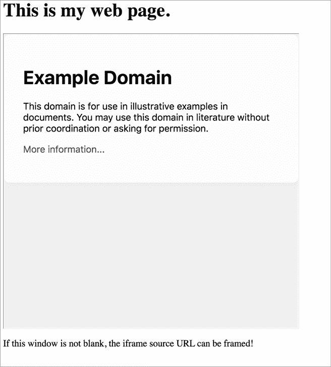
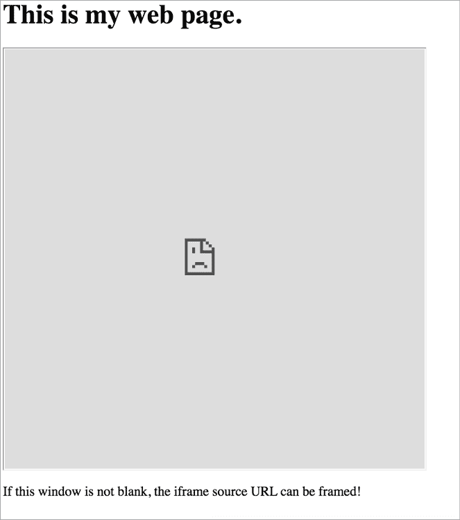
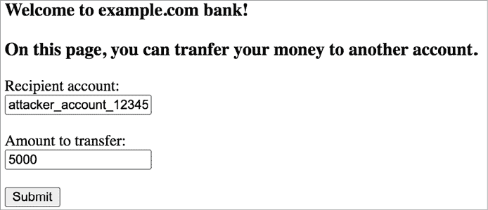
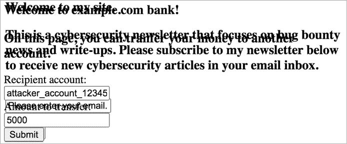
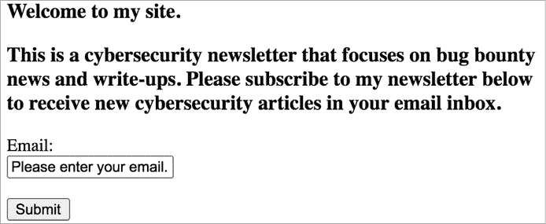
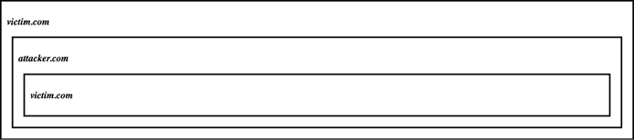

# 第八章：点击劫持


*点击劫持*，或者用户界面重定向，是一种通过伪装按钮为合法的恶意按钮来诱使用户点击的攻击。攻击者通过使用 HTML 页面叠加技术将一个网页隐藏在另一个网页中，从而实现这一点。让我们讨论这个有趣且易于利用的漏洞，为什么它是个问题，以及你如何发现它的实例。

请注意，点击劫持在漏洞奖励计划中很少被视为有效漏洞，因为它通常涉及大量的用户交互。许多计划明确将点击劫持列为不在范围内，所以在开始漏洞发现之前，务必查看计划的政策！然而，如果你能证明点击劫持漏洞的影响，某些计划仍然接受这类报告。我们将在本章后面讨论一个已被接受的报告。

## 机制

点击劫持依赖于一个叫做*iframe*的 HTML 特性。HTML iframe 允许开发者通过在页面中放置`<iframe>`标签并在标签的`src`属性中指定要嵌套的 URL，来将一个网页嵌入到另一个网页中。例如，保存以下页面为 HTML 文件并用浏览器打开：

```
<html> <h3>This is my web page.</h3> <iframe src="https://www.example.com" width="500" height="500"></iframe> <p>If this window is not blank, the iframe source URL can be framed!</p>
</html>
```

你应该会看到一个看起来像图 8-1 的网页。注意，一个框将*www.example.com*放置在更大页面的一个区域中。



图 8-1：如果 iframe 不是空白的，iframe 的`src`属性中指定的页面可以被嵌套！

有些网页无法被嵌套。如果你将一个无法嵌套的页面放入一个 iframe 中，你应该会看到一个空白的 iframe，如图 8-2 所示。



图 8-2：如果 iframe 是空白的，iframe 源无法被嵌套。

Iframe 有很多用途。你在网页顶部或侧边常看到的在线广告就是 iframe 的例子；公司使用这些来在你的社交媒体或博客中嵌入预制的广告。Iframe 还允许你在网页中嵌入其他互联网资源，比如视频和音频。例如，这个 iframe 允许你在外部网站中嵌入 YouTube 视频：

```
<iframe width="560" height="315"
src="https://www.youtube.com/embed/d1192Sqk" frameborder="0"
allow="accelerometer; autoplay; encrypted-media; gyroscope; picture-in-picture" allowfullscreen>
</iframe>
```

Iframe 使得我们的互联网更加生动和互动。但它们也可能对被嵌套的网页构成危险，因为它们引入了点击劫持攻击的可能性。假设*example.com*是一个银行网站，它包含一个可以通过点击按钮转账的页面。你可以通过 URL*https://www.example.com/transfer_money*访问余额转账页面。

这个 URL 接受两个参数：收款人账户 ID 和转账金额。如果你访问带有这些参数的 URL，例如*https://www.example.com/transfer_money?recipient=RECIPIENT_ACCOUNT&amount=AMOUNT_TO_TRANSFER*，页面上的 HTML 表单将会预填充（图 8-3）。你只需要点击提交按钮，HTML 表单将发起转账请求。



图 8-3：预填充了 HTTP POST 参数的余额转账页面

现在想象一下，一个攻击者将这个敏感的银行页面嵌入到自己网站的 iframe 中，就像这样：

```
<html> <h3>Welcome to my site!</h3> <iframe src="https://www.example.com/transfer_money? recipient=attacker_account_12345&amount=5000"  width="500" height="500"> </iframe>
</html>
```

这个 iframe 嵌入了余额转账页面的 URL。它还传递了 URL 参数，以便预填充转账接收人和金额。攻击者将这个 iframe 隐藏在一个看似无害的网站上，然后诱使用户点击敏感页面上的一个按钮。为了实现这一点，他们通过将多个 HTML 元素重叠，以一种遮挡银行表单的方式进行布局。看一下这个 HTML 页面，举个例子：

```
<html> <style> #victim-site { width:500px; height:500px; 1 opacity:0.00001; 2 z-index:1; } #decoy { 3 position:absolute; width:500px; height:500px; 4 z-index:-1; } </style> <div **id="decoy**"> <h3>Welcome to my site!</h3> <h3>This is a cybersecurity newsletter that focuses on bug
bounty news and write-ups!  Please subscribe to my newsletter below to receive new
cybersecurity articles in your email inbox!</h3> <form action="/subscribe" method="post"> <label for="email">Email:</label> 5 <br> <input type="text" id="email" value="Please enter your email!"> 6 <br><br> <input type="submit" value="Submit"> </form> </div> <iframe **id="victim-site"**src="https://www.example.com/transfer_money?  recipient=attacker_account_12345&amount=5000"  width="500" height="500"> </iframe>
</html>
```

你可以看到，我们在 HTML 页面顶部添加了一个 `<style>` 标签。任何位于 `<style>` 标签之间的内容都是用于指定 HTML 元素样式的 CSS 代码，例如字体颜色、元素大小和透明度。我们可以通过为 HTML 元素分配 ID 并在样式表中引用这些 ID 来设置样式。

在这里，我们将诱饵元素的位置设置为 `absolute`，使得诱饵页面与包含受害者网站的 iframe 重叠。没有 `absolute` 位置指令时，HTML 会将这些元素显示在屏幕的不同位置。诱饵元素包括一个“订阅新闻通讯”按钮，我们精心调整 iframe 的位置，使得转账余额按钮直接覆盖在这个订阅按钮上，使用 HTML 的换行标签 `<br>` 创建新的行。然后，我们通过将 iframe 的透明度设置为非常低的值 1，使其变得不可见。最后，我们将 iframe 的 z-index 设置为比诱饵元素更高的值。*z-index* 设置了不同 HTML 元素的堆叠顺序。如果两个 HTML 元素重叠，z-index 值较大的元素会显示在上面。

通过为受害者网站的 iframe 和诱饵表单设置这些 CSS 属性，我们得到了一个看起来像是订阅新闻通讯的页面，但其中包含一个隐形的表单，将用户的资金转入攻击者的账户。让我们将 iframe 的透明度设置回 `opacity:1`，以查看页面的实际布局。你可以看到，转账余额按钮正好位于“订阅新闻通讯”按钮的正上方（图 8-4）。



图 8-4：转账余额按钮正好位于“订阅按钮”上方。受害者以为自己在订阅新闻通讯，但实际上他们正在点击授权转账余额的按钮。

一旦我们将 iframe 的透明度重置为 `opacity:0.00001`，使得敏感表单不可见，网站看起来就像一个正常的新闻通讯页面（图 8-5）。



图 8-5：攻击者通过将敏感表单设为不可见来欺骗用户点击按钮。

如果用户已登录到银行网站，他们也将登录到 iframe 中，因此银行网站的服务器会将由 iframe 发送的请求视为合法。当用户点击看似无害的按钮时，他们实际上在 *example.com* 执行了余额转账！他们不小心将 5,000 美元从银行账户余额转账到了攻击者的账户，而不是订阅新闻邮件。这就是为什么我们称这种攻击为 *用户界面重塑* 或 *点击劫持*：攻击者通过重塑用户界面来劫持用户的点击，将原本属于他们页面的点击用在了受害者网站上。

这是一个简化的示例。实际上，支付应用程序不会以这种方式实现，因为这会违反数据安全标准。另一个需要记住的事情是，关键功能上存在一个容易防止的漏洞，例如在余额转账页面上的点击劫持漏洞，表明该应用程序没有遵循安全开发的最佳实践。这个示例应用程序可能还包含其他漏洞，你应该对其进行广泛的测试。

## 预防

点击劫持漏洞发生必须满足两个条件。首先，漏洞页面必须具有在用户的代理下执行状态更改操作的功能。*状态更改操作* 会以某种方式更改用户的账户，例如更改用户的账户设置或个人数据。其次，漏洞页面必须允许被其他网站的 iframe 框架化。

HTTP 响应头 `X-Frame-Options` 允许网页指示该页面的内容是否可以在 iframe 中渲染。浏览器将遵循该头部提供的指令。否则，页面默认是可以被框架化的。

这个头部提供了两个选项：`DENY` 和 `SAMEORIGIN`。如果页面使用 `DENY` 选项，则该页面无法被框架化。`SAMEORIGIN` 选项允许来自相同源的页面进行框架化：即共享相同协议、主机和端口的页面。

```
X-Frame-Options: DENY
X-Frame-Options: SAMEORIGIN
```

为了防止敏感操作上的点击劫持，网站应该在包含状态更改操作的所有页面上提供其中一个选项。

`Content-Security-Policy` 响应头是另一种可能的防御点击劫持的方法。该头的 `frame-ancestors` 指令允许网站指示页面是否可以被框架化。例如，将该指令设置为 `'none'` 将阻止任何网站框架化该页面，而将指令设置为 `'self'` 则允许当前站点框架化该页面：

```
Content-Security-Policy: frame-ancestors 'none';
Content-Security-Policy: frame-ancestors 'self';
```

将 `frame-ancestors` 设置为特定的来源将允许该来源框架化内容。此头部将允许当前站点以及 *example.com* 的任何子域上的页面框架化其内容：

```
Content-Security-Policy: frame-ancestors 'self' *.example.com;
```

除了实现`X-Frame-Options`和`Content-Security-Policy`以确保敏感页面不能被框架嵌入外，另一种防止点击劫持的方法是使用`SameSite` Cookies。Web 应用程序通过`Set-Cookie`头指示用户的浏览器设置 Cookies。例如，以下头部会使客户端浏览器将 Cookie `PHPSESSID`的值设置为`UEhQU0VTU0lE`：

```
Set-Cookie: PHPSESSID=UEhQU0VTU0lE 
```

除了基本的`cookie_name=cookie_value`指定外，`Set-Cookie`头还允许多个可选标志来保护用户的 Cookies。其中之一是`SameSite`标志，它有助于防止点击劫持攻击。当 Cookie 的`SameSite`标志设置为`Strict`或`Lax`时，该 Cookie 在通过第三方 iframe 发出的请求中将不会被发送：

```
Set-Cookie: PHPSESSID=UEhQU0VTU0lE; Max-Age=86400; Secure; HttpOnly; SameSite=Strict
Set-Cookie: PHPSESSID=UEhQU0VTU0lE; Max-Age=86400; Secure; HttpOnly; SameSite=Lax 
```

这意味着任何需要受害者认证的点击劫持攻击，例如我们之前提到的银行示例，即使没有 HTTP 响应头限制框架嵌入，也无法成功，因为受害者在点击劫持的请求中不会被认证。

## 点击劫持的狩猎

通过查找包含敏感状态改变操作并且可以被框架嵌入的页面，来发现点击劫持漏洞。

### 第 1 步：查找状态改变的操作

点击劫持漏洞只有在目标页面包含状态改变操作时才有价值。你应寻找那些允许用户更改其帐户的页面，如更改帐户详情或设置的页面。否则，即使攻击者能够劫持用户的点击，也无法对网站或用户的账户造成任何损害。这就是为什么你应该从识别网站上的状态改变操作开始。

例如，假设你正在测试*example.com*的子域，它在*bank.example.com*上处理银行功能。浏览整个 Web 应用程序，点击所有链接，并记录下所有的状态改变选项，以及它们所在页面的 URL：

**在***bank.example.com*****上的状态改变请求

+   更改密码：*bank.example.com/password_change*

+   转账余额：*bank.example.com/transfer_money*

+   取消链接外部账户：*bank.example.com/unlink*

你还应检查该操作是否仅通过点击即可完成。点击劫持只能伪造用户的点击，而不能伪造他们的键盘操作。需要用户显式输入值的攻击是可能的，但通常不可行，因为它们需要大量的社会工程学。例如，在这个银行页面上，如果应用程序要求用户显式输入收款账户和转账金额，而不是从 URL 参数加载这些信息，那么使用点击劫持攻击将不可行。

### 第 2 步：检查响应头

然后，逐一查看你找到的每个状态更改功能，并重新访问包含这些功能的页面。打开你的代理，拦截包含该网页的 HTTP 响应。查看该页面是否带有 `X-Frame-Options` 或 `Content-Security-Policy` 响应头。

如果该页面没有任何这些响应头，可能会容易受到点击劫持攻击。如果状态更改操作要求用户登录才能执行，你还应该检查该站点是否使用了 `SameSite` cookies。如果使用了，你将无法利用点击劫持攻击该站点需要身份验证的功能。

尽管设置 HTTP 响应头是防止这些攻击的最佳方法，但网站可能已经实施了更为隐蔽的保护措施。例如，一种名为 *frame-busting* 的技术通过 JavaScript 代码来检查页面是否在 iframe 中，并且是否被一个受信任的网站框架嵌套。框架破坏是一种不可靠的防止点击劫持的方式。事实上，框架破坏技术常常可以被绕过，正如我将在本章后面展示的那样。

你可以通过创建一个 HTML 页面来框架嵌套目标页面，从而确认页面是否可以被框架嵌套。如果目标页面显示在框架中，那么该页面是可以被框架嵌套的。这段 HTML 代码是一个不错的模板：

```
<HTML> <head> <title>Clickjack test page</title> </head> <body> <p>Web page is vulnerable to clickjacking if the iframe is populated with the target page!</p> <iframe src="URL_OF_TARGET_PAGE" width="500" height="500"></iframe> </body>
</html>
```

### 第三步：确认漏洞

通过对你的测试账户执行点击劫持攻击来确认漏洞。你应该尝试通过你刚刚构建的框架页面执行状态更改操作，并查看操作是否成功。如果你能通过点击仅在 iframe 中触发该操作，那么该操作就容易受到点击劫持攻击。

## 绕过保护

当站点实施了适当的保护时，点击劫持是不可行的。如果现代浏览器显示一个带有 `X-Frame-Options` 保护的页面，你就不能在该页面上利用点击劫持，必须找到其他漏洞，如 XSS 或 CSRF，以实现相同的效果。然而，有时即使页面缺少防止点击劫持的响应头，该页面也不会在你的测试 iframe 中显示。如果网站本身未能实施完整的点击劫持防护，你可能能够绕过这些缓解措施。

如果网站使用了框架破坏技术而不是 HTTP 响应头和 `SameSite` cookies，以下是你可以尝试的一个例子：找到框架破坏代码中的漏洞。例如，开发人员常犯的错误是在尝试检测受保护页面是否被恶意页面框架嵌套时，仅仅将顶层框架与当前框架进行比较。如果顶层框架与被框架页面具有相同的来源，开发人员可能会允许这种情况，因为他们认为框架站点的域是安全的。从本质上讲，保护代码的结构如下：

```
if (top.location == self.location){ // Allow framing.
}
else{ // Disallow framing.
}
```

如果是这种情况，搜索受害者网站上允许嵌入自定义 iframe 的位置。例如，许多社交媒体网站允许用户在个人资料中分享链接。这些功能通常通过将 URL 嵌入 iframe 中来显示信息和链接的缩略图。其他常见的需要自定义 iframe 的功能包括允许嵌入视频、音频、图片、自定义广告和网页构建器。

如果你找到这些功能中的某一个，你可能能够通过使用*双重 iframe 技巧*绕过点击劫持保护。这个技巧的原理是将你的恶意页面嵌套在受害者域名中的页面内。首先，构建一个页面，该页面嵌套受害者的目标功能。然后将整个页面放入受害者网站托管的 iframe 中（见图 8-6）。



图 8-6：你可以尝试将你的网站放入由受害者网站托管的 iframe 中，以绕过不正确的框架检查。

这样，`top.location` 和 `self.location` 都指向 *victim.com*。防止框架破坏的代码会判断最内层的 *victim.com* 页面被另一个 *victim.com* 页面在同一域内嵌套，因此认为这种嵌套是安全的。中介的攻击者页面将不会被发现。

总是问问自己，开发者在实施保护机制时是否可能遗漏了某些边界情况。你能利用这些边界情况为自己谋取利益吗？

我们来看一个示例报告。Periscope 是一个直播视频应用程序，2019 年 7 月 10 日，发现其存在点击劫持漏洞。你可以在 [`hackerone.com/reports/591432/`](https://hackerone.com/reports/591432/) 找到公开的漏洞报告。*该网站使用了* `X-Frame-Options ALLOW-FROM` 指令来防止点击劫持。这个指令允许页面指定可以嵌套它的 URL，但它是一个过时的指令，许多浏览器不再支持。这意味着如果受害者使用的是不支持该指令的浏览器，如最新的 Chrome、Firefox 和 Safari 浏览器，那么子域名 *https://canary-web.pscp.tv* 和 *https://canary-web.periscope.tv* 上的所有功能都容易受到点击劫持攻击。由于 Periscope 的账户设置页面允许用户停用账户，攻击者可以通过将设置页面嵌套在 iframe 中，诱使用户停用他们的账户。

## 提升攻击

网站经常提供没有点击劫持保护的页面。只要页面不包含可利用的操作，缺乏点击劫持保护通常不会被认为是漏洞。另一方面，如果可嵌套的页面包含敏感操作，点击劫持的影响就会相应地严重。

专注于应用程序的最关键功能，以实现最大的商业影响。例如，假设一个网站有两个可嵌套的页面。第一个页面包含一个执行用户银行余额转账的按钮，而第二个页面包含一个更改用户网站主题颜色的按钮。虽然这两个页面都存在点击劫持漏洞，但第一个页面的点击劫持漏洞影响远大于第二个页面。

你还可以将多个点击劫持漏洞组合起来，或者将点击劫持与其他漏洞链式结合，开辟更严重的安全问题。例如，应用程序通常会根据用户的偏好发送或披露信息。如果你能通过点击劫持改变这些设置，通常就能诱导敏感信息泄露。假设*bank.example.com*包含多个点击劫持漏洞。其中一个允许攻击者更改账户的账单电子邮件，另一个允许攻击者将账户摘要发送到其账单电子邮件。恶意页面的 HTML 如下所示：

```
<html> <h3>Welcome to my site!</h3> <iframe  src="https://bank.example.com/change_billing_email?email=attacker@attacker.com"  width="500" height="500"> </iframe> <iframe src="https://bank.example.com/send_summary" width="500" height="500"> </iframe>
</html>
```

你可以首先将受害者的账单电子邮件更改为你自己的电子邮件地址，然后让受害者将账户摘要发送到你的电子邮件地址，从而泄露账户摘要报告中的信息。根据账户摘要披露的内容，你可能能够收集到包括街道地址、电话号码和与账户关联的信用卡信息！请注意，为了使此攻击成功，受害者用户必须点击攻击者网站两次。

## 关于点击劫持负载的交付说明

在漏洞悬赏报告中，你通常需要向公司展示，攻击者如何有效地利用你发现的漏洞。这意味着你需要了解攻击者如何在现实环境中利用点击劫持漏洞。

点击劫持漏洞依赖于用户交互。为了使攻击成功，攻击者必须构建一个足够具吸引力的网站，促使用户点击。通常这并不难，因为用户在点击网页时往往不会采取预防措施。但如果你希望你的攻击更具说服力，可以查看社交工程工具包（[`github.com/trustedsec/social-engineer-toolkit/`](https://github.com/trustedsec/social-engineer-toolkit/)）。这个工具集可以做很多事情，其中之一是帮助你克隆著名网站并用于恶意目的。然后，你可以将 iframe 放置在克隆的网站上。

根据我的经验，最有效的隐藏按钮位置是在“请接受本网站使用 Cookies！”弹窗的正上方。用户通常会点击此按钮以关闭窗口，而不会多加思考。

## 找到你的第一个点击劫持漏洞！

现在你已经了解了点击劫持漏洞是什么，如何利用它们以及如何升级它们，快去找到你的第一个点击劫持漏洞吧！按照本章所述的步骤进行：

1.  找出网站上会改变状态的操作，并记录下它们的 URL 位置。标记出那些只需要鼠标点击即可执行的操作，供进一步测试使用。

1.  检查这些页面的`X-Frame-Options`、`Content-Security-Policy`头信息以及`SameSite`会话 cookie。如果你无法找到这些保护特性，那么该页面可能存在漏洞！

1.  制作一个 HTML 页面，将目标页面嵌套其中，并在浏览器中加载该页面，查看页面是否已被嵌套。

1.  通过对自己测试账户执行模拟的点击劫持攻击来确认该漏洞的存在。

1.  设计一种巧妙的方式将你的有效载荷传递给最终用户，并考虑该漏洞可能带来的更大影响。

1.  撰写你的第一次点击劫持报告！
