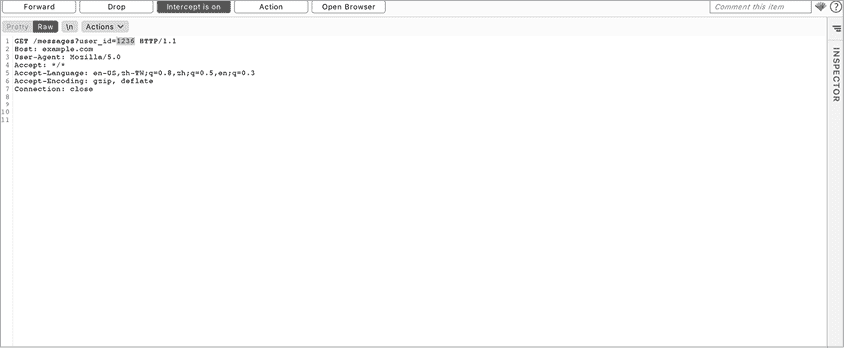
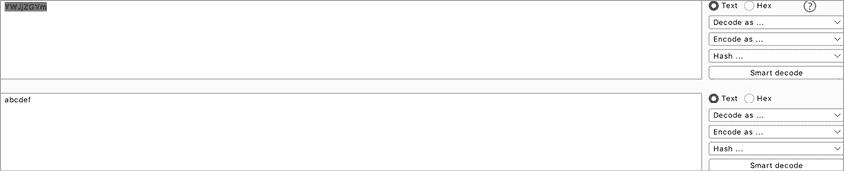

# 第十章：不安全的直接对象引用


像 XSS 和开放重定向，*不安全的直接对象引用（**IDORs**）* 是几乎每个 Web 应用程序中都存在的一种漏洞。它们发生在应用程序根据用户的请求直接授予资源访问权限时，且没有进行验证。

在本章中，我们将探讨这些是如何工作的。然后我们将深入了解应用程序如何防止 IDOR，并且如何绕过这些常见的保护机制。

## 机制

尽管 IDOR 这个名字又长又吓人，但其实很容易理解；它本质上是缺失的访问控制。当用户可以通过直接引用对象 ID、对象编号或文件名来访问本不属于他们的资源时，就会发生 IDOR。

例如，假设 *example.com* 是一个社交媒体网站，允许你与他人聊天。当你注册时，你会注意到你在网站上的用户 ID 是 *1234*。该网站允许你通过点击主页上的“查看您的消息”按钮来查看与朋友的所有消息。当你点击该按钮时，你会被重定向到这个位置，显示你所有的直接消息：*https://example.com/messages?user_id=1234*。

那么，如果你将 URL 栏中的 URL 更改为 *https://example.com/messages?user_id=1233* 呢？

你会发现现在可以看到另一个用户 *1233* 与他们的朋友之间的所有私人消息。在这一点上，你已经发现了一个 IDOR 漏洞。该应用程序没有基于用户身份限制消息的访问。相反，它允许用户请求任何他们希望的消息。该应用程序天真地信任用户输入，并根据用户提供的 `user_id` 值直接加载资源，就像这段示例代码一样：

```
messages = load_messages(request.user_id)
display_messages(messages)
```

IDOR 不仅限于读取其他用户的信息。你还可以利用它来代表另一个用户编辑数据。例如，假设用户可以提交一个 POST 请求来更改密码。该 POST 请求必须包含该用户的 ID 和新密码，并且必须将请求发送到 */change_password* 端点：

```
POST /change_password
(POST request body)
user_id=**1234**&new_password=12345
```

在这种情况下，如果应用程序没有验证提交的用户 ID 是否对应当前登录的用户，攻击者可能会通过发送一个不属于他们的用户 ID 来更改其他人的密码，例如：

```
POST /change_password
(POST request body)
user_id=**1233**&new_password=12345
```

最后，IDOR 还可能影响数据库对象以外的资源。另一种类型的 IDOR 发生在应用程序直接引用系统文件时。例如，以下请求允许用户访问他们上传的文件：*https://example.com/uploads?file=user1234-01.jpeg*。

由于`file`参数的值是`user1234–01.jpeg`，我们可以很容易推断用户上传的文件遵循`USER_ID-FILE_NUMBER``.``FILE_EXTENSION`的命名规则。因此，另一个用户上传的文件可能被命名为`user1233–01.jpeg`。如果应用程序没有限制用户访问属于其他用户的文件，攻击者可以通过猜测文件名访问任何人的上传文件，像这样：*https://example.com/uploads?file=user1233-01.jpeg*。

恶意用户甚至可能通过这个端点读取敏感的系统文件！例如，*/etc/shadow*是 Unix 系统上的一个文件，用来记录用户密码。由于它是敏感的，不应暴露给普通用户。如果你能够通过像*https://example.com/uploads?file=/PATH/TO/etc/shadow*这样的 URL 读取文件，那么你就发现了一个漏洞！攻击者能够读取位于 Web 根目录之外的文件，也称为*路径遍历攻击*，或者目录遍历攻击。我们将在第十七章中详细讨论目录遍历攻击。

## 预防

IDOR 攻击发生在应用程序未能做到两点时。首先，它未能基于用户身份实现访问控制。其次，它未能随机化对象 ID，而是保持对数据对象（如文件或数据库条目）的引用是可预测的。

在本章的第一个示例中，你能够看到属于用户*1233*的消息，因为服务器在发送私人信息之前没有检查登录用户的身份。服务器没有验证你确实是用户*1233*。它只是返回了你请求的信息。

在这种情况下，由于用户 ID 仅仅是数字，因此很容易推断你也可以获取用户*1232*和用户*1231*的消息，方法如下：

1.  *https://example.com/messages?user_id=1232*

1.  *https://example.com/messages?user_id=1231*

这就是为什么该漏洞被称为不安全的*直接对象* *引用*。用户的 ID 被用来直接引用该网站上用户的私人消息。如果没有通过适当的访问控制进行保护，这些可预测的*直接对象引用*会暴露它们背后的数据，允许任何人抓取与该引用相关的信息。

应用程序可以通过两种方式预防 IDOR 攻击。首先，应用程序可以在授予访问资源的权限之前，检查用户的身份和权限。例如，应用程序可以检查用户的会话 Cookie 是否对应于用户请求的消息的`user_id`。

其次，网站可以使用唯一的、不可预测的密钥或哈希标识符来引用每个用户的资源。*哈希*是指将一个值转换成另一个字符串的单向过程。使用安全算法和秘密密钥对 ID 进行哈希处理，可以使攻击者很难猜测出哈希后的 ID 字符串。如果*example.com*将请求结构化为如下形式，攻击者将无法再访问其他用户的消息，因为攻击者无法猜测出如此长且随机的`user_key`值：

```
https://example.com/messages?user_key=6MT9EalV9F7r9pns0mK1eDAEW
```

但是，这种方法并不能完全防止 IDOR 漏洞。攻击者仍然可以泄露用户信息，如果他们能够找到窃取这些 URL 或`user_keys`的方法。防止 IDOR 漏洞的最佳方式是精细化的访问控制，或者结合访问控制与 ID 随机化或哈希处理 ID。

## 寻找 IDOR 漏洞

让我们来寻找一些 IDOR 漏洞吧！发现 IDOR 漏洞的最佳方式是通过源代码审查，检查所有的直接对象引用是否都受到了访问控制的保护。我们将在第二十二章中讨论如何进行源代码审查。但如果你无法访问应用程序的源代码，这里有一种简单且有效的方式来测试 IDOR 漏洞。

### 步骤 1：创建两个账户

首先，在目标网站上创建两个不同的账户。如果用户可以在网站上拥有不同的权限，针对每种权限级别创建两个账户。例如，创建两个管理员账户、两个普通用户账户、两个组成员账户和两个非组成员账户。这将帮助你测试相似用户账户之间以及具有不同权限的用户之间的访问控制问题。

继续前面的例子，你可以在*example.com*上创建两个账户：用户*1235*和用户*1236*。其中一个账户将作为你的攻击者账户，用来进行 IDOR 攻击，另一个账户作为受害者账户，用来观察攻击的效果。这两个用户的消息页面将具有以下 URL：

1.  *https://example.com/messages?user_id=1235*（攻击者）

1.  *https://example.com/messages?user_id=1236*（受害者）

如果应用程序不允许你创建这么多账户，你可以联系公司请求更多账户。如果你解释你正在参与他们的漏洞悬赏计划，公司通常会给你额外的账户。另外，如果该应用有付费会员服务，向公司请求一个高级账户，或者你可以自己支付购买。通常来说，购买这些会员是值得的，因为你可以获得新的功能来进行测试。

除了使用两个账户进行测试外，你还应该重复测试过程，但不登录。查看你是否能够在未认证的会话中访问合法用户所能访问的信息或功能。

### 步骤 2：发现功能

接下来，尽可能多地发现应用程序的功能。使用你拥有的最高权限账户，浏览应用程序，寻找需要测试的功能。

特别注意那些返回用户信息或修改用户数据的功能。记录下来以备后用。以下是一些可能存在 IDOR 漏洞的*example.com*功能：

1.  该端点允许你读取用户消息：

```
https://example.com/messages?user_id=1236
```

1.  这个端点允许你读取用户文件：

```
https://example.com/uploads?file=user1236-01.jpeg
```

1.  该端点删除用户消息：

```
POST /delete_message
(POST request body)
message_id=user1236-0111
```

1.  这个端点用于访问小组文件：

```
https://example.com/group_files?group=group3
```

1.  这个端点删除一个小组：

```
POST /delete_group
(POST request body)
group=group3
```

### 第 3 步：捕获请求

浏览你在前一步中映射的每个应用功能，并捕获所有从 Web 客户端到服务器的请求。仔细检查每个请求，找出包含数字、用户名或 ID 的参数。记住，你可以通过请求中的不同位置触发 IDOR 漏洞，例如 URL 参数、表单字段、文件路径、头部和 Cookies。

为了提高测试效率，使用两个浏览器，并在每个浏览器中登录不同的账户。然后修改来自一个浏览器的请求，看看该变更是否立即反映到另一个账户上。例如，假设你创建了两个账户，*1235*和*1236*。在 Firefox 中登录*1235*，在 Chrome 中登录*1236*。

使用 Burp 修改来自 Firefox 的流量。在 Proxy 标签页中开启拦截功能，并在代理文本窗口中编辑请求（图 10-1）。通过观察 Chrome 中受害者账户的变化来检查你的攻击是否成功。

另外，请注意，像表示状态转移（REST）和 GraphQL 这样的 API 也经常容易受到 IDOR 攻击。我们将在第二十四章中详细讨论 API 的黑客攻击。务必留意这些端点。你可以使用第五章中的侦察技巧来发现其他端点。然后按照此测试方法替换这些端点中发现的 ID。



图 10-1：在 Burp 的代理窗口中修改请求，以切换 ID。

### 第 4 步：更改 ID

最后，切换敏感请求中的 ID，查看返回的信息是否也发生了变化。看看你是否能通过攻击者账户访问受害者账户的信息。并检查你是否能从第一个账户修改第二个用户的账户。

例如，在这个设置中，你可以尝试通过 Firefox 浏览器访问用户*1236*有权限的功能：

1.  该端点允许你读取用户消息：

```
https://example.com/messages?user_id=1236
```

1.  这个端点允许你读取用户文件：

```
https://example.com/uploads?file=user1236-01.jpeg
```

1.  该端点删除用户消息：

```
POST /delete_message
(POST request body)
message_id=user1236-0111
```

1.  这个端点用于访问小组文件：

```
https://example.com/group_files?group=group3
```

1.  该端点删除一个小组：

```
POST /delete_group
(POST request body)
group=group3
```

如果这些请求成功访问或修改了用户*1236*的信息，那么你就发现了一个 IDOR 漏洞。

## 绕过 IDOR 保护

IDOR 并不总是像简单地更换数字 ID 那么简单。随着应用程序功能的增加，它们引用资源的方式通常也变得更加复杂。现代 Web 应用程序已经开始实施更多的 IDOR 防护措施，许多现在使用更复杂的 ID 格式。这意味着简单的数字 IDOR 变得越来越少。那么，我们如何绕过这些障碍，依然发现 IDOR 呢？

IDOR 在应用程序中可能以不同的方式表现出来。除了你平常使用的数字 ID，以下是一些需要注意的地方。

### 编码的 ID 和哈希的 ID

首先，不要忽视编码和哈希的 ID。当遇到一个看似随机的字符串时，始终怀疑它是编码过的，并尝试解码。你还应该学会识别最常见的编码方案，如 base64、URL 编码和 base64url。例如，看看这个端点的 ID：

1.  *https://example.com/messages?user_id=MTIzNQ*

1.  *https://example.com/messages?user_id=MTIzNg*

这些`user_id`只是用户 ID 的 base64url 编码版本。`MTIzNQ`是*1235*的 base64url 编码字符串，`MTIzNg`是*1236*的编码版本。一些应用程序使用容易反转的编码方案。在这种情况下，你可以通过使用在线 base64url 编码器编码你的假 ID 并执行 IDOR。

一开始你可能无法判断网站使用的是哪种编码方案。在这种情况下，可以使用 Burp 解码器中的智能解码工具（图 10-2），或者简单地尝试用不同的编码方案（URL 编码、HTML 编码、十六进制编码、八进制编码、base64、base64url 等）解码字符串，以弄清楚使用的编码方案。一旦你积累了更多解码数据的经验，你会更直觉地知道编码方案是什么。



图 10-2：你可以尝试使用 Burp 解码器中的不同方法来解码字符串，或者使用智能解码工具，看看 Burp 是否能检测到编码方案。

如果应用程序使用的是哈希或随机化的 ID，看看这个 ID 是否可预测。有时应用程序使用生成熵值不足的算法。*熵*是 ID 的随机性程度。一个字符串的熵值越高，它就越难猜测。有些 ID 没有足够的熵值，经过仔细分析后是可以预测的。在这种情况下，尝试创建几个账户，分析这些 ID 是如何生成的。你可能能找到一种模式，从而预测其他用户的 ID。

### 泄露的 ID

也有可能应用程序通过另一个 API 端点或其他公共页面泄露 ID，比如用户的个人资料页面。我曾经找到一个 API 端点，允许用户通过哈希的`conversation_id`值来获取详细的直接消息。请求如下所示：

```
GET /messages?conversation_id=O1SUR7GJ43HS93VAR8xxxx
```

乍一看，这似乎是安全的，因为`conversation_id`是一个长的、随机的字母数字序列。但我后来发现，任何人只要使用公开的用户 ID，就可以请求每个用户的`conversation_id`列表！以下请求会返回该用户的`conversation_id`列表：

```
GET /messages?user_id=1236
```

由于每个用户的个人资料页面上公开了 `user_id`，我可以通过首先获取他们的 `user_id`，然后检索属于该用户的 `conversation_id` 列表，最后通过他们的 `conversation_id` 加载消息，从而读取任何用户的消息。

### 即使应用没有要求，还是向应用提供一个 ID

在现代 Web 应用程序中，你通常会遇到应用使用 cookies 而非 ID 来识别用户可访问的资源的场景。

例如，当你向某个端点发送以下 GET 请求时，应用程序会根据你的会话 cookie 推断出你的身份，然后将与该用户相关的消息发送给你：

```
GET /api_v1/messages
Host: example.com
Cookies: session=`YOUR_SESSION_COOKIE`
```

由于你不知道另一个用户的会话 cookie，因此无法使用这些会话 cookie 来读取他们的消息。这可能会让人觉得应用程序对 IDOR 攻击是安全的。但一些应用程序会实施一种替代方式来获取资源，使用对象 ID。有时这样做是为了开发人员的方便，或为了向后兼容，或者仅仅是因为开发人员忘记移除某个测试功能。

如果应用生成的请求中没有 ID，请尝试向请求中添加一个。将`id`*，*`user_id`*，*`message_id`*，*或其他对象引用*附加到 URL 查询或 POST 请求体参数中，看看它是否会对应用的行为产生影响。例如，假设这个请求显示了你的消息：

```
GET /api_v1/messages
```

那么也许这个请求会显示另一个用户的消息：

```
GET /api_v1/messages?user_id=`ANOTHER_USERS_ID`
```

### 留意盲目 IDOR

尽管如此，有时容易受到 IDOR 攻击的端点并不会直接响应泄露的信息。它们可能会导致应用程序在其他地方泄露信息：在导出文件、电子邮件中，甚至可能是文本警报中。例如，假设 *example.com* 上的这个端点允许用户将收据副本通过电子邮件发送给自己：

```
POST /get_receipt
(POST request body)
receipt_id=3001
```

这个请求会将收据 3001 的副本发送到当前用户的注册电子邮件地址。那么，如果你请求一个属于其他用户的收据，收据 2983，会怎么样呢？

```
POST /get_receipt
(POST request body)
receipt_id=2983
```

尽管 HTTP 响应没有变化，但你可能会在你的电子邮件收件箱收到收据 2983 的副本！恶意请求往往会导致信息泄露，可能是在未来某个时刻。我曾经发现一个 IDOR 漏洞，导致一个月后在月度报告中发生信息泄露。

### 更改请求方法

如果某个 HTTP 请求方法不起作用，你可以尝试其他许多方法：GET、POST、PUT、DELETE、PATCH 等等。应用程序通常会在相同的端点上启用多种请求方法，但未能为每种方法实施相同的访问控制。例如，如果这个 GET 请求不容易受到 IDOR 攻击，并且没有返回另一个用户的资源

```
GET example.com/uploads/user1236-01.jpeg
```

你也可以尝试使用 DELETE 方法来删除资源。DELETE 方法会从目标 URL 移除资源：

```
DELETE example.com/uploads/user1236-01.jpeg
```

如果 POST 请求不起作用，你还可以尝试使用 PUT 方法更新另一个用户的资源。PUT 方法会在目标 URL 上更新或创建资源：

```
PUT example.com/uploads/user1236-01.jpeg
(PUT request body)`NEW_FILE`
```

另一个常常有效的技巧是切换 POST 和 GET 请求。如果有像这样的 POST 请求

```
POST /get_receipt
(POST request body)
receipt_id=2983
```

你可以尝试将其重写为 GET 请求，如下所示：

```
GET /get_receipt?receipt_id=2983
```

### 更改请求的文件类型

有时，切换请求文件的文件类型会导致服务器以不同的方式处理授权。应用程序在如何让用户标识信息时可能会比较灵活：它们可能允许用户使用 ID 引用文件或直接使用文件名。然而，应用程序通常未能对每种引用方式实施相同的访问控制。

例如，应用程序通常将信息存储为 JSON 文件类型。尝试在请求 URL 的末尾添加 *.json* 扩展名，看看会发生什么。如果该请求被服务器阻止

```
GET /get_receipt?receipt_id=2983
```

然后尝试这个：

```
GET /get_receipt?receipt_id=2983.json
```

## 升级攻击

IDOR 的影响取决于受影响的功能，因此为了最大化漏洞的严重性，你应当首先查看关键功能中的 IDOR。*基于读取的* *IDOR*（泄露信息但不会改变数据库）和*基于写操作的* *IDOR*（可以以未授权的方式更改数据库）都可能具有较大影响。

就状态变化的、基于写操作的 IDOR 来说，查看密码重置、密码更改和账户恢复功能中的 IDOR，因为这些功能通常对业务的影响最大。相比之下，像改变电子邮件订阅设置这样的功能就不那么重要了。

对于非状态变化（基于读取的）IDOR，查看应用程序中处理敏感信息的功能。例如，查看处理直接消息、个人信息和私人内容的功能。考虑哪些应用功能使用了这些信息，并据此查找 IDOR。

你还可以将 IDOR 与其他漏洞结合起来，以增加它们的影响。例如，基于写操作的 IDOR 可以与自我 XSS 结合，形成存储型 XSS。密码重置端点上的 IDOR 与用户名枚举结合，可能导致大规模账户接管。或者，管理员账户上的写操作 IDOR 甚至可能导致 RCE！我们将在第十八章讨论 RCE。

## 自动化攻击

在熟练掌握 IDOR 猎杀技巧后，你可以尝试使用 Burp 或自己的脚本来自动化 IDOR 猎杀。例如，你可以使用 Burp 的入侵者工具来遍历 ID 以找到有效的 ID。Burp 扩展工具 Autorize ([`github.com/Quitten/Autorize/`](https://github.com/Quitten/Autorize/)) 通过低权限账户访问高权限账户来扫描授权问题，而 Burp 扩展工具 Auto Repeater ([`github.com/nccgroup/AutoRepeater/`](https://github.com/nccgroup/AutoRepeater/)) 和 AuthMatrix ([`github.com/SecurityInnovation/AuthMatrix/`](https://github.com/SecurityInnovation/AuthMatrix/)) 允许你自动化切换 cookie、头信息和参数的过程。有关如何使用这些工具的更多信息，请进入 Burp 窗口的 Extender 标签页，然后到 BAppStore 标签页查找你想使用的扩展。

## 查找你的第一个 IDOR！

现在你已经了解了什么是 IDOR，如何绕过 IDOR 保护以及如何提升 IDOR 攻击，你已经准备好寻找第一个 IDOR 了！加入一个漏洞悬赏计划，并按照本章讨论的步骤进行操作：

1.  为每个应用角色创建两个账户，并指定一个为攻击者账户，另一个为受害者账户。

1.  在应用程序中发现可能导致 IDOR 的功能。注意那些返回敏感信息或修改用户数据的功能。

1.  重新检查在第 2 步中发现的功能。使用代理在浏览敏感功能时拦截你的浏览器流量。

1.  使用代理拦截每个敏感请求，并切换请求中看到的 ID。如果切换 ID 能让你访问其他用户的信息或更改他们的数据，那么你可能已经发现了一个 IDOR。

1.  如果应用程序似乎对 IDOR 免疫，不要灰心！利用这个机会尝试绕过保护的技术！如果应用程序使用编码、哈希或随机化的 ID，你可以尝试解码或预测这些 ID。你也可以尝试在应用程序未要求提供 ID 时提供一个 ID。最后，有时改变请求方法类型或文件类型也能起到决定性作用。

1.  监控导出文件、电子邮件和文本警报中的信息泄露。当前的 IDOR 可能会导致未来的信息泄露。

1.  撰写你的第一个 IDOR 报告！
