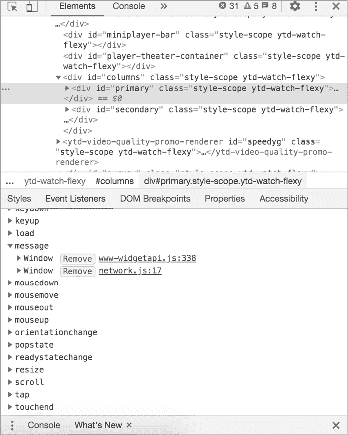
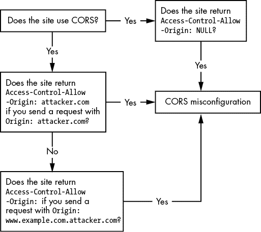

# 19

同源策略漏洞


第三章介绍了同源策略（SOP），这是现代 web 应用中部署的基本防御之一。SOP 限制了来自一个站点的脚本如何与另一个站点的资源进行交互，并且它在防止许多常见的 web 漏洞中起着至关重要的作用。

但是，网站通常会放松 SOP 以获得更多灵活性。这些受控和有意的 SOP 绕过可能会带来不利影响，因为攻击者有时会利用这些技术中的配置错误来绕过 SOP。这些漏洞可能导致私人信息泄露，并常常导致更多的漏洞，如身份验证绕过、账户接管和大规模数据泄露。在本章中，我们将讨论应用如何放宽或规避 SOP，以及攻击者如何利用这些功能来危及应用程序。

## 机制

这里是 SOP 如何工作的简要回顾。由于 SOP 的存在，来自页面 A 的脚本只能在页面 B 的来源相同的情况下访问数据。两个 URL 被认为具有*相同来源*，如果它们共享相同的协议、主机名和端口号。现代 web 应用通常基于 HTTP cookies 进行身份验证，服务器根据浏览器自动包含的 cookies 采取行动。这使得 SOP 尤其重要。当 SOP 被实施时，恶意网页无法利用存储在你浏览器中的 cookies 来访问你的私人信息。你可以在第三章中阅读更多关于 SOP 的详细信息。

实际上，SOP 对现代 web 应用来说通常过于严格。例如，如果遵循该策略，同一组织的多个子域或多个域将无法共享信息。由于 SOP 缺乏灵活性，大多数网站会找到放宽它的方法。这通常是问题出现的地方。

比如，假设你是一个攻击者，试图从一个银行网站窃取信息，*a.example.com*，并找出一个用户的账户号码。你知道用户的银行信息位于 *a.example.com/user_info*。你的受害者已经登录到银行网站 *a.example.com*，并且在同一个浏览器中也访问了你的站点 *attacker.com*。

你的站点向 *a.example.com/user_info* 发起一个 GET 请求，试图获取受害者的个人信息。由于受害者已经登录银行，浏览器会在每个请求中自动包括他们的 cookies，即使请求是由你恶意站点上的脚本生成的。不幸的是，由于 SOP 的存在，受害者的浏览器不会允许你的站点读取从 *a.example.com* 返回的数据。

但是现在，假设你意识到 *a.example.com* 通过 SOP 绕过技术将信息传递给 *b.example.com*。如果你能够找出使用的技术并加以利用，你可能能够窃取受害者在银行网站上的私人信息。

网站绕过 SOP（同源策略）的最简单方法是通过 JavaScript 更改页面的来源。通过在页面的 JavaScript 中使用 `document.domain` 将两个页面的来源设置为相同的域名，可以让页面共享资源。例如，你可以将 *a.example.com* 和 *b.example.com* 的域名都设置为 *example.com*，这样它们就可以进行交互：

```
document.domain = "example.com"
```

然而，这种方法有其局限性。首先，你只能将页面的 *document.domain* 设置为超域名；例如，你可以将 *a.example.com* 的来源设置为 *example.com*，但不能设置为 *example2.com*。因此，如果你想与超域名或同级子域共享资源，这种方法才会奏效。

### 利用跨源资源共享

由于这些局限性，大多数网站改为使用跨源资源共享（CORS）来放宽 SOP。CORS 是一种保护服务器数据的机制。它允许服务器通过 HTTP 响应头 `Access-Control-Allow-Origin` 明确指定允许访问其资源的来源列表。

例如，假设我们正在尝试将位于 *a.example.com/user_info* 的以下 JSON 数据发送到 *b.example.com*：

```
{"username": "vickieli", "account_number": "12345"}
```

在 SOP 下，*b.example.com* 无法访问 JSON 文件，因为 *a.example.com* 和 *b.example.com* 的来源不同。但使用 CORS 时，用户的浏览器会代表 *b.example.com* 发送一个 `Origin` 头部：

```
Origin: https://b.example.com
```

如果 *b.example.com* 是允许访问 *a.example.com* 上资源的允许列表中的一部分，*a.example.com* 将发送请求的资源以及 `Access-Control-Allow-Origin` 头部。该头部将告诉浏览器，特定的来源被允许访问该资源：

```
Access-Control-Allow-Origin: b.example.com
```

应用程序也可以返回带有通配符字符（`*`）的 `Access-Control-Allow-Origin` 头部，表示该页面上的资源可以被任何域名访问：

```
Access-Control-Allow-Origin: *
```

另一方面，如果请求页面的来源未被允许访问资源，用户的浏览器将阻止请求页面读取数据。

CORS 是实现跨源通信的一个好方法。然而，CORS 只有在允许的来源列表正确定义的情况下才是安全的。如果 CORS 配置错误，攻击者可能利用配置漏洞访问受保护的资源。

CORS 配置的最基本错误是允许 `null` 来源。如果服务器将 `Access-Control-Allow-Origin` 设置为 `null`，浏览器将允许任何具有 `null` 来源头部的站点访问资源。这是不安全的，因为任何来源都可以创建一个 `null` 来源的请求。例如，使用 `data:` URL 方案生成的跨站请求将具有 `null` 来源。

另一个错误配置是将`Access-Control-Allow-Origin`头设置为请求页面的来源，而不验证请求者的来源。如果服务器没有验证来源并且返回任何来源的`Access-Control-Allow-Origin`，那么该头部将完全绕过 SOP，移除跨源通信的所有限制。

总结来说，如果服务器将`Access-Control-Allow-Origin`头设置为`null`或任意来源的请求页面，它允许攻击者窃取站外信息：

```
Access-Control-Allow-Origin: null
Access-Control-Allow-Origin: https://attacker.com
```

另一个可被利用的错误配置是站点使用弱正则表达式来验证来源。例如，如果策略仅检查来源 URL 是否以*www.example.com*开头，攻击者可以使用*www.example.com.attacker.com*这样的来源来绕过该策略。

```
Access-Control-Allow-Origin: https://www.example.com.attacker.com
```

一个有趣的但不可被利用的配置是将允许的来源设置为通配符（`*`）。这不可被利用，因为 CORS 不允许凭据（包括 Cookies、认证头或客户端证书）与请求一起发送到这些页面。由于凭据不能发送到这些页面，因此无法访问任何私人信息：

```
Access-Control-Allow-Origin: *
```

开发人员可以通过创建一个定义明确的 CORS 策略，设置严格的白名单和强大的 URL 验证来防止 CORS 错误配置。对于包含敏感信息的页面，服务器应该仅在请求来源在白名单中时，在`Access-Control-Allow-Origin`头中返回请求页面的来源。对于公共信息，服务器可以简单地使用通配符`*`来表示`Access-Control-Allow-Origin`。

### 利用 postMessage()

一些站点通过使用`postMessage()`来绕过 SOP。这个方法是一个使用 JavaScript 语法的 Web API。你可以用它向另一个窗口发送基于文本的消息：

```
RECIPIENT_WINDOW.postMessage(MESSAGE_TO_SEND, TARGET_ORIGIN);
```

接收窗口将通过使用一个事件处理器来处理消息，当接收窗口接收到消息时，该事件处理器将被触发：

```
window.addEventListener("message",EVENT_HANDLER_FUNCTION);
```

由于使用`postMessage()`需要发送方获得接收方窗口的引用，因此消息只能在窗口及其 iframe 或弹出窗口之间发送。这是因为只有相互打开的窗口才会有相互引用的方式。例如，一个窗口可以使用`window.open`来引用它打开的新窗口。或者，它可以使用`window.opener`来引用生成当前窗口的窗口。它可以使用`window.frames`来引用嵌入的 iframe，并且使用`window.parent`来引用当前 iframe 的父窗口。

例如，假设我们试图将位于*a.example.com/user_info*的 JSON 数据传递给*b.example.com*：

```
{'username': 'vickieli', 'account_number': '12345'}
```

*a.example.com*可以打开*b.example.com*并向其窗口发送消息。`window.open()`函数打开一个特定 URL 的窗口，并返回该窗口的引用：

```
var recipient_window = window.open("https://b.example.com", b_domain)
recipient_window.postMessage("{'username': 'vickieli', 'account_number': '12345'}", "*");
```

同时，*b.example.com*会设置事件监听器来处理它接收到的数据：

```
function parse_data(event) { // Parse the data
}
window.addEventListener("message", parse_data);
```

正如你所看到的，`postMessage()` 并不会直接绕过 SOP，而是提供了一种不同来源页面之间互相传递数据的方式。

`postMessage()` 方法可以是实现跨来源通信的可靠方式。然而，在使用它时，消息的发送者和接收者都应该验证对方的来源。当页面执行弱来源检查或完全没有来源检查时，就会出现漏洞。

首先，`postMessage()` 方法允许发送者将接收者的来源指定为参数。如果发送者页面没有指定目标来源，而是使用通配符目标来源，那么信息泄露到其他网站就变得可能：

```
RECIPIENT_WINDOW.postMessage(MESSAGE_TO_SEND, *);
```

在这种情况下，攻击者可以创建一个恶意 HTML 页面，监听来自发送者页面的事件。然后，他们可以通过恶意链接或假图像诱使用户触发 `postMessage()`，使受害者页面将数据发送到攻击者的页面。

为了防止这个问题，开发者应该始终将 `TARGET_ORIGIN` 参数设置为目标网站的 URL，而不是使用通配符来源：

```
recipient_window.postMessage(
"{'username': 'vickieli', 'account_number': '12345'}", **"https://b.example.com"**);
```

另一方面，如果消息接收者没有验证 `postMessage()` 来源的页面，那么攻击者就有可能向网站发送任意数据，并代表受害者触发不必要的操作。例如，假设 *b.example.com* 允许 *a.example.com* 基于 `postMessage()` 触发密码更改，如下所示：

```
recipient_window.postMessage(
"{'action': 'password_change', 'username': 'vickieli', 'new_password': 'password'}", 
"https://b.example.com");
```

页面 *b.example.com* 然后会接收到消息并处理请求：

```
function parse_data(event) { // If "action" is "password_change", change the user's password
}
window.addEventListener("message", parse_data);
```

请注意，任何窗口都可以向 *b.example.com* 发送消息，因此任何页面都可以在 *b.example.com* 上发起密码更改！为了利用这一行为，攻击者可以嵌入或打开受害者页面，以获得其窗口引用。然后，他们就可以自由地向该窗口发送任意消息。

为了防止这个问题，页面应该在处理消息之前验证消息发送者的来源：

```
function parse_data(event) {1 if (event.origin == "https://a.example.com"){ // If "action" is "password_change", change the user's password }
}
window.addEventListener("message", parse_data);
```

这一行 1 通过将发送者的来源与可接受的来源进行比较，验证发送者的来源。

### 利用带填充的 JSON

*带填充的 JSON（**JSONP**）* 是另一种绕过 SOP 的技术。它允许发送者将 JSON 数据作为 JavaScript 代码发送。不同来源的页面可以通过处理 JavaScript 来读取 JSON 数据。

为了了解这个如何运作，让我们继续之前的示例，在这个示例中，我们尝试将位于 *a.example.com/user_info* 的以下 JSON 块传递到 *b.example.com*：

```
{"username": "vickieli", "account_number": "12345"}
```

SOP 允许 HTML 的 `<script>` 标签跨来源加载脚本，因此 *b.example.com* 获取跨来源数据的一个简单方法是将数据作为脚本加载在 `<script>` 标签中：

```
<script src="https://a.example.com/user_info"></script>
```

通过这种方式，*b.example.com* 本质上会在一个脚本标签中包含 JSON 数据块。但这将导致语法错误，因为 JSON 数据不是有效的 JavaScript。

```
<script> {"username": "vickieli", "account_number": "12345"}
</script>
```

JSONP 通过将数据包装在一个 JavaScript 函数中来解决这个问题，并将数据作为 JavaScript 代码而非 JSON 文件发送。

请求页面将资源作为脚本包含，并指定一个回调函数，通常在名为`callback`或`jsonp`的 URL 参数中。这个回调函数是接收页面上的预定义函数，准备处理数据：

```
<script src="https://a.example.com/user_info?callback=parseinfo"></script>
```

位于 *a.example.com* 的页面将返回包含在指定回调函数中的数据：

```
parseinfo({"username": "vickieli", "account_number": "12345"})
```

接收页面将实际上包含这个脚本，它是有效的 JavaScript 代码：

```
<script> parseinfo({"username": "vickieli", "account_number": "12345"})
</script>
```

接收页面随后可以通过运行 JavaScript 代码并处理`parseinfo()`函数来提取数据。通过将数据作为脚本发送，而不是 JSON 数据，JSONP 允许跨源读取资源。以下是 JSONP 工作流中发生的步骤总结：

1.  数据请求者将数据的 URL 包含在脚本标签中，并附上回调函数的名称。

1.  数据提供者返回包含在指定回调函数中的 JSON 数据。

1.  数据请求者接收该功能并通过运行返回的 JavaScript 代码处理数据。

你通常可以通过查找包含带有*jsonp*或*callback*字样的 URL 的脚本标签，来判断一个站点是否使用了 JSONP。

但是 JSONP 存在风险。当在某个端点启用 JSONP 时，攻击者只需在他们的网站上嵌入相同的脚本标签并请求 JSONP 负载中包装的数据，像这样：

```
<script src="https://a.example.com/user_info?callback=parseinfo"></script>
```

如果用户在浏览攻击者网站的同时，已经登录 *a.example.com*，则用户的浏览器会将他们的凭据包含在此请求中，允许攻击者提取受害者的机密数据。

这就是为什么 JSONP 适用于仅传输公共数据的原因。虽然可以通过使用 CSRF 令牌或为 JSONP 请求保持允许列表的 Referer 标头来增强 JSONP 的安全性，但这些保护措施通常可以被绕过。

JSONP 的另一个问题是，站点 *b.example.com* 必须完全信任站点 *a.example.com*，因为它正在运行来自 *a.example.com* 的任意 JavaScript。如果 *a.example.com* 被攻破，攻击者就可以在 *b.example.com* 上执行他们想要的 JavaScript，因为 *b.example.com* 在 `<script>` 标签中包含了来自 *a.example.com* 的文件。这相当于一次 XSS 攻击。

现在，由于 CORS 是一种可靠的跨源通信选项，网站不再像以前那样频繁使用 JSONP。

### 通过使用 XSS 绕过 SOP

最后，XSS 本质上是一次完全的 SOP 绕过，因为在页面上运行的任何 JavaScript 都在该页面的安全上下文下操作。如果攻击者能够在受害者页面上执行恶意脚本，该脚本就可以访问受害者页面的资源和数据。因此，记住，如果你能找到 XSS，就相当于绕过了保护该页面的 SOP。

## 寻找 SOP 绕过

让我们开始通过你所学到的知识来寻找 SOP 绕过漏洞！SOP 绕过漏洞是由于 SOP 放宽技术的错误实现导致的。因此，首先需要做的是确定目标应用是否以某种方式放宽了 SOP。

### 步骤 1：确定是否使用了 SOP 放宽技术

你可以通过寻找每种 SOP 放宽技术的特征来确定目标是否正在使用 SOP 放宽技术。在浏览网页应用时，打开代理并寻找任何跨源通信的迹象。例如，CORS 站点通常会返回包含 `Access-Control-Allow-Origin` 头部的 HTTP 响应。如果站点使用 `postMessage()`，你可以通过检查页面（例如，在 Chrome 中右键点击它并选择 **检查**，然后导航到 **事件监听器**）并找到 `message` 事件监听器（图 19-1）。

如果你看到一个 URL 被加载在 `<script>` 标签中并带有回调函数，那么该站点可能正在使用 JSONP：

```
<script src="https://a.example.com/user_info?callback=parseinfo"></script>
<script src="https://a.example.com/user_info?jsonp=parseinfo"></script>
```

如果你看到跨源通信的线索，尝试本章提到的技术，看看你是否能够绕过 SOP 并从站点窃取敏感信息！



图 19-1：在 Chrome 浏览器中查找页面的事件监听器

### 步骤 2：查找 CORS 配置错误

如果站点使用 CORS，检查 `Access-Control-Allow-Origin` 响应头部是否设置为 `null`。

```
Origin: null
```

如果没有，向该站点发送带有源头头部 `attacker.com` 的请求，看看响应中的 `Access-Control-Allow-Origin` 是否设置为 `attacker.com`。（你可以通过拦截请求并在代理中编辑它来添加一个 Origin 头部。）

```
Origin: attacker.com
```

最后，通过提交包含允许站点的 Origin 头部（如 *www.example.com.attacker.com*）来测试该站点是否正确验证了源 URL。查看 `Access-Control-Allow-Origin` 头部是否返回攻击者域的源。

```
Origin: www.example.com.attacker.com
```

如果返回了这些 `Access-Control-Allow-Origin` 头部值中的一个，则说明你已经找到了 CORS 配置错误。攻击者将能够绕过 SOP 并将信息偷偷带出站点（图 19-2）。



图 19-2：该站点是否易受 CORS 配置错误漏洞的影响？

### 步骤 3：查找 postMessage 漏洞

如果站点使用 `postMessage`，检查你是否可以作为一个不受信任的站点发送或接收消息。创建一个包含 iframe 的 HTML 页面，iframe 嵌入接受消息的目标页面。尝试向该页面发送触发状态变化行为的消息。如果目标页面无法被嵌入，改为作为新窗口打开：

```
var recipient_window = window.open("https://TARGET_URL", target_domain)
recipient_window.postMessage("RANDOM MESSAGE", "*");
```

你还可以创建一个 HTML 页面，监听来自目标页面的事件，并触发目标站点的 postMessage。看看你是否能够从目标页面接收到敏感数据。

```
var sender_window = window.open("https://TARGET_URL", target_domain)
function parse_data(event) { // Run some code if we receive data from the target }
window.addEventListener("message", parse_data);
```

### 步骤 4：查找 JSONP 问题

最后，如果该站点使用 JSONP，请查看是否可以在您的站点上嵌入一个脚本标签，并请求包裹在 JSONP 有效负载中的敏感数据：

```
<script src="https://TARGET_URL?callback=parseinfo"></script>
```

### 步骤 5：考虑缓解因素

当目标站点不依赖于 cookie 进行身份验证时，这些 SOP 绕过配置错误可能无法被利用。例如，当站点使用自定义头或秘密请求参数来验证请求时，您可能需要找到一种方法伪造这些头信息，以便提取敏感数据。

## 升级攻击

SOP 绕过漏洞通常意味着攻击者可以读取私人信息或以其他用户的身份执行操作。这意味着这些漏洞在任何升级尝试之前通常具有较高的严重性。但是，您仍然可以通过自动化或使用您找到的信息进行攻击的转折来升级 SOP 绕过问题。您能通过自动化 SOP 绕过漏洞的利用来收集大量用户数据吗？您能使用找到的信息造成更大的损害吗？例如，如果您能够提取受害者的安全问题，您是否可以利用这些信息完全接管用户的帐户？

许多研究人员仅仅报告 CORS 配置错误，而没有展示漏洞的影响。在发送报告之前，请考虑问题的影响。例如，如果一个公开可读的页面与空的`Access-Control-Allow-Origin`头一起提供，那么它不会对应用程序造成损害，因为该页面不包含任何敏感信息。一份好的 SOP 绕过报告将包括潜在的攻击场景，并表明攻击者如何利用该漏洞。例如，攻击者能窃取什么数据，容易程度如何？

## 寻找您的第一个 SOP 绕过漏洞！

继续并开始寻找您的第一个 SOP 绕过漏洞。要发现 SOP 绕过漏洞，您需要了解目标站点使用的 SOP 放松技术。您可能还需要熟悉 JavaScript，以便制作有效的 POC（概念证明）。

1.  查找应用程序是否使用了任何 SOP 放松技术。该应用程序是否使用了 CORS、`postMessage`或 JSONP？

1.  如果站点使用 CORS，请通过提交测试的`Origin`头来测试 CORS 白名单的强度。

1.  如果站点使用`postMessage`，查看您是否可以作为不受信任的站点发送或接收消息。

1.  如果站点使用 JSONP，请尝试在您的站点上嵌入一个脚本标签，并请求包裹在 JSONP 有效负载中的敏感数据。

1.  确定您可以使用漏洞窃取的信息的敏感性，并查看您是否可以做更多的事情。

1.  向程序提交您的漏洞报告！
