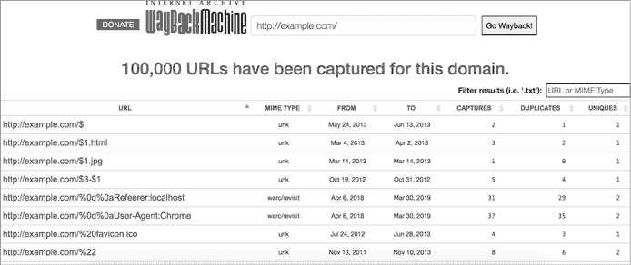
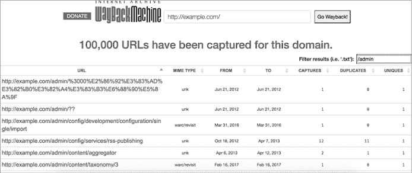
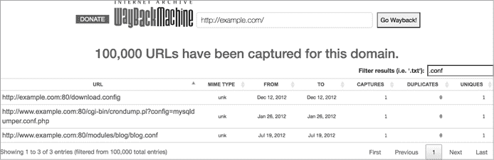

# 21

信息泄露


第十章中涉及的 IDOR 漏洞是应用程序泄露用户私密信息的常见方式。但攻击者也可以通过其他方式从目标应用程序中揭露敏感信息。我称这些漏洞为*信息泄露*漏洞。这些漏洞很常见；事实上，它们是我在漏洞奖励猎捕过程中最常发现的漏洞类型，即使我在寻找其他类型的漏洞时也是如此。

这些漏洞可能以多种方式发生，具体取决于应用程序。在本章中，我们将讨论几种可能导致应用程序泄露数据的方式，以及如何最大化自己发现信息泄露的机会。本章深入探讨了第五章中提到的一些技术，但重点是通过使用这些技术提取敏感和私密信息。

## 机制

信息泄露发生在应用程序未能正确保护敏感信息时，导致用户可以访问本不该提供给他们的信息。这些敏感信息可能包括帮助攻击的技术细节，如软件版本号、内部 IP 地址、敏感文件名和文件路径。它还可能包括源代码，攻击者可以对其进行源代码审查。此外，有时应用程序还会泄露用户的私密信息，例如用户的年龄、银行账户号码、电子邮件地址和邮寄地址，给未经授权的第三方。

大多数系统的目标是隐藏开发信息，包括软件版本号和配置文件，以防止外部世界访问，因为这些信息允许攻击者收集有关应用程序的信息，并规划如何有效地攻击它。例如，了解应用程序使用的确切软件版本将使攻击者能够寻找公开披露的漏洞，这些漏洞可能影响该应用程序。配置文件通常包含诸如访问令牌和内部 IP 地址等信息，攻击者可以利用这些信息进一步攻破组织。

通常，应用程序会在 HTTP 响应头、HTTP 响应体或其他服务器响应中泄露版本号。例如，许多应用程序使用的`X-Powered-By`头部会显示该应用程序运行的框架：

```
X-Powered-By: PHP/5.2.17
```

另一方面，应用程序由于未对文件应用适当的访问控制，或者不小心将敏感文件上传到公开的代码库，导致泄露敏感配置文件，这些文件是外部用户可以访问的。

应用程序应该保护的另一个信息是它们的源代码。当应用程序的后端代码泄露给公众时，泄露的代码可以帮助攻击者理解应用程序的逻辑，并寻找逻辑漏洞、硬编码凭证或公司基础设施的信息，例如内部 IP 地址。应用程序可能会通过不小心发布私人代码仓库、在公开的 GitHub 或 GitLab 仓库中共享代码片段，或者将代码上传到像 Pastebin 这样的第三方网站来泄露源代码。

最后，应用程序通常通过将敏感信息包含在其公开代码中而泄露敏感信息。开发人员可能会不小心将凭证、内部 IP 地址、信息性代码注释和用户的私人信息等内容放入公开源代码中，比如 HTML 和 JavaScript 文件，这些文件会被提供给用户。

## 防范措施

完全防止敏感信息泄露是困难的。但通过在开发过程中保护数据，你可以可靠地降低信息泄露的可能性。

你应该采取的最重要措施是避免将凭证和其他敏感信息硬编码到可执行代码中。相反，你可以将敏感信息放在单独的配置文件中，或存储在像 Vault（[`github.com/hashicorp/vault/`](https://github.com/hashicorp/vault/)）这样的秘密存储系统中。另外，定期审核你的公共代码仓库，以确保没有敏感文件被意外上传。工具可以帮助你监控代码中的密钥，例如 secret-bridge（[`github.com/duo-labs/secret-bridge/`](https://github.com/duo-labs/secret-bridge/)）。如果你必须将敏感文件上传到生产服务器，请应用细粒度的访问控制，以限制用户对文件的访问。

接下来，删除从服务和服务器响应中透露的有关后端服务器设置和软件版本的技术细节。在处理所有异常时，返回一个通用的错误页面给用户，而不是一个揭示错误细节的技术页面。

## 信息泄露的侦查

你可以使用几种策略来寻找信息泄露漏洞，具体取决于你所针对的应用程序和你要寻找的内容。一个好的起点是使用第五章介绍的侦查技术来查找软件版本号和配置信息。然后，你可以开始查找暴露的配置文件、数据库文件以及上传到生产服务器上的其他敏感文件，这些文件没有得到保护。以下步骤讨论了一些你可以尝试的技术。

### 第一步：尝试路径遍历攻击

首先尝试进行路径遍历攻击，以读取服务器的敏感文件。*路径遍历攻击*用于访问 web 应用程序根文件夹之外的文件。这个过程通过添加 `../` 字符串来操纵应用程序用来引用文件的文件路径变量。这个序列在 Unix 系统中指向当前目录的父目录，因此通过将其添加到文件路径中，你通常可以访问 web 根目录之外的文件。

例如，假设一个网站允许你通过使用相对 URL 将图片加载到应用程序的图片文件夹中。*绝对* URL 包含完整的地址，从 URL 协议到域名和资源的路径。*相对* URL 则只包含完整 URL 的一部分。大多数相对 URL 只包含资源的路径或文件名。相对 URL 用于链接到同一域名下的其他位置。

例如，这个 URL 会将用户重定向到 *https://example.com/images/1.png*：

```
 https://example.com/image?url=/images/1.png
```

在这种情况下，`url` 参数包含一个相对 URL（*/images/1.png*），该 URL 引用 web 应用程序根目录中的文件。你可以插入 `../` 序列，尝试从图片文件夹中导航出来，脱离 web 根目录。例如，以下 URL 引用的是 web 应用程序根文件夹中的 *index.html* 文件（并脱离 *images* 文件夹）：

```
https://example.com/image?url=/images/../index.html
```

类似地，这个 URL 会访问服务器根目录下的 */etc/shadow* 文件，这是一个存储系统用户账户及其加密密码的文件：

```
https://example.com/image?url=/images/../../../../../../../etc/shadow
```

确定需要多少 `../` 序列才能到达系统的根目录可能需要一些试验和错误。此外，如果应用程序实施了某种输入验证，并且不允许在文件路径中使用 `../`，你可以使用 `../` 的编码变体，例如 `%2e%2e%2f`（URL 编码）、`%252e%252e%255f`（双重 URL 编码）和 `..%2f`（部分 URL 编码）。

### 第 2 步：搜索 Wayback Machine

另一种查找暴露文件的方法是使用 Wayback Machine。如第五章所述，Wayback Machine 是一个网站在线存档，记录了网站在不同时间点的样子。你可以利用它来查找隐藏和废弃的端点，以及大量当前的端点，而不需要主动抓取网站，使其成为了解应用程序可能暴露内容的好方式。

在 Wayback Machine 的网站上，只需搜索一个域名即可查看其历史版本。要搜索一个域名的文件，请访问 *https://web.archive.org/web/*/DOMAIN*。

在这个 URL 后面加上 `/*`，可以获得与该域名相关的存档 URL 列表。例如，*https://web.archive.org/web/*/example.com/** 将返回与 *example.com* 相关的 URL 列表。你应该能在 Wayback Machine 的网页上看到这些 URL（图 21-1）。



图 21-1：你可以在 Wayback Machine 上列出一个域名的存档 URL。

然后你可以使用搜索功能查看是否有敏感页面被归档。例如，要查找管理员页面，可以在找到的 URL 中搜索术语 */admin*（图 21-2）。



图 21-2：在 URL 中搜索关键词，以查找可能敏感的页面。

你还可以通过使用常见的文件扩展名，如 *.conf*（图 21-3）和 *.env*，来搜索备份文件和配置文件，或者通过使用 *.js* 和 *.php* 文件扩展名来查找源代码，例如 JavaScript 或 PHP 文件。



图 21-3：通过文件扩展名过滤 URL，以查找特定类型的文件。

下载有趣的归档页面，查看是否有敏感信息。例如，是否存在仍在使用的硬编码凭证，或者页面是否泄露了普通用户不应知道的隐藏端点？

### 步骤 3：搜索粘贴文件站点

接下来，查看像 Pastebin 和 GitHub gists 这样的粘贴文件站点。这些站点允许用户通过直接链接而非通过电子邮件或像 Google Docs 这样的服务共享文本文件，因此开发人员通常使用这些站点将源代码、配置文件和日志文件发送给同事。但在像 Pastebin 这样的站点上，共享的文本文件默认是公开的。如果开发人员上传了敏感文件，所有人都可以阅读它。正因为如此，这些代码共享站点因泄露 API 密钥和密码等凭证而臭名昭著。

Pastebin 提供了一个 API，允许用户通过关键词、电子邮件或域名搜索公开的粘贴文件。你可以使用这个 API 查找属于某个组织的敏感文件。像 PasteHunter 或 pastebin-scraper 这样的工具也能自动化这个过程。Pastebin-scraper（[`github.com/streaak/pastebin-scraper/`](https://github.com/streaak/pastebin-scraper/)）使用 Pastebin API 帮助你搜索粘贴文件。这个工具是一个 shell 脚本，因此可以将其下载到本地目录，并运行以下命令来搜索与特定关键词相关的公开粘贴文件。`-g` 选项表示进行一般的关键词搜索：

```
./scrape.sh -g `KEYWORD`
```

该命令将返回与指定 `KEYWORD` 相关的 Pastebin 文件 ID 列表。你可以通过访问 *pastebin.com/ID* 来查看返回的粘贴文件。

### 步骤 4：从暴露的 .git 目录中重构源代码

另一种查找敏感文件的方法是从暴露的 *.git* 目录中重构源代码。在攻击应用程序时，获取源代码对构造漏洞利用极为有帮助。这是因为一些漏洞，例如 SQL 注入，通过静态代码分析比黑盒测试更容易发现。第二十二章介绍了如何审查代码以寻找漏洞。

当开发者使用 Git 对项目的源代码进行版本控制时，Git 会将项目的所有版本控制信息，包括项目文件的提交历史，存储在一个 Git 目录中。通常，*.git* 文件夹不应对外公开，但有时它会被意外地公开。这时就会发生信息泄露。当 *.git* 目录暴露时，攻击者可以通过像 truffleHog ([`github.com/dxa4481/truffleHog/`](https://github.com/dxa4481/truffleHog/)) 或 Gitleaks ([`github.com/zricethezav/gitleaks/`](https://github.com/zricethezav/gitleaks/)) 这样的秘密扫描工具，获取应用的源代码，从而访问开发者的评论、硬编码的 API 密钥以及其他敏感数据。

#### 检查 .git 文件夹是否公开

要检查一个应用的 *.git* 文件夹是否公开，只需访问该应用的根目录（例如，*example.com*）并在 URL 后添加 */.git*：

```
https://example.com/.git
```

当你浏览到 */.git* 目录时，可能会发生三种情况。如果你遇到 404 错误，这意味着应用的 *.git* 目录没有对外公开，你将无法通过这种方式泄露信息。如果你遇到 403 错误，则表示 *.git* 目录在服务器上是可用的，但你无法直接访问文件夹的根目录，因此无法列出目录中包含的所有文件。如果没有错误，服务器返回 *.git* 目录的目录列表，则可以直接浏览该文件夹的内容并获取其中包含的任何信息。

#### 下载文件

如果启用了目录列表功能，你可以浏览文件并获取泄露的信息。`wget` 命令可以从 Web 服务器获取内容。你可以使用 `wget` 的递归模式（`-r`）批量下载指定目录及其子目录中存储的所有文件：

```
$ wget -r example.com/.git
```

但是，如果没有启用目录列表功能，并且目录中的文件没有显示出来，你仍然可以重建整个 *.git* 目录。首先，你需要确认文件夹的内容确实对外公开。你可以通过尝试访问该目录中的 *config* 文件来进行确认：

```
$ curl https://example.com/.git/config
```

如果这个文件是可访问的，并且你理解 *.git* 目录的一般结构，那么你可能能够下载整个 Git 目录的内容。*.git* 目录是以特定的方式进行布局的。当你在 Git 仓库中执行以下命令时，你应该看到类似以下内容：

```
$ **ls .git**
COMMIT_EDITMSG HEAD branches config description hooks index info logs objects refs
```

这里显示的输出列出了一些对重建项目源代码很重要的标准文件和文件夹。特别是，*/objects* 目录用于存储 Git 对象。该目录包含额外的文件夹；每个文件夹的名称由两个字符组成，对应存储在其中的 Git 对象的 SHA1 哈希的前两个字符。在这些子目录中，你会找到以 Git 对象其余的 SHA1 哈希命名的文件。换句话说，哈希值为 `0a082f2656a655c8b0a87956c7bcdc93dfda23f8` 的 Git 对象将以文件名 *082f2656a655c8b0a87956c7bcdc93dfda23f8* 存储在目录 *.git/objects/0a* 中。例如，以下命令将返回一组文件夹：

```
$ **ls .git/objects**
00 0a 14 5a 64 6e 82 8c 96 a0 aa b4 be c8 d2 dc e6 f0 fa info pack
```

这个命令将显示存储在特定文件夹中的 Git 对象：

```
$ **ls .git/objects/0a**
082f2656a655c8b0a87956c7bcdc93dfda23f8 4a1ee2f3a3d406411a72e1bea63507560092bd 66452433322af3d319a377415a890c70bbd263 8c20ea4482c6d2b0c9cdaf73d4b05c2c8c44e9 ee44c60c73c5a622bb1733338d3fa964b333f0
0ec99d617a7b78c5466daa1e6317cbd8ee07cc 52113e4f248648117bc4511da04dd4634e6753 72e6850ef963c6aeee4121d38cf9de773865d8
```

Git 在 .*git/objects* 中存储不同类型的对象：提交、树、Blob 和注释标签。你可以使用这个命令来确定对象的类型：

```
$ **git cat-file -t OBJECT-HASH**
```

*提交*对象存储的信息包括提交的树对象哈希、父提交、作者、提交者、日期和提交信息。*树*对象包含提交的目录列表。*Blob*对象包含已提交文件的副本（即：实际的源代码！）。最后，*标签*对象包含关于标签对象及其关联标签名的信息。你可以使用以下命令显示与 Git 对象关联的文件：

```
$ **git cat-file -p OBJECT-HASH**
```

*/config* 文件是该项目的 Git 配置文件，*/HEAD* 文件包含对当前分支的引用：

```
$ **cat .git/HEAD**
ref: refs/heads/master
```

如果你无法访问 */.git* 文件夹的目录列表，你必须下载你需要的每个文件，而不是从目录根部递归下载。但是，如何找出服务器上哪些文件是可用的，当对象文件有复杂路径时，比如 *.git/objects/0a/72e6850ef963c6aeee4121d38cf9de773865d8*？

你从你已经知道存在的文件路径开始，比如 *.git/HEAD*！阅读这个文件会给你一个指向当前分支的引用（例如，*.git/refs/heads/master*），你可以使用这个引用来查找系统上的更多文件：

```
$ **cat .git/HEAD**
ref: refs/heads/master
$ **cat .git/refs/heads/master**
0a66452433322af3d319a377415a890c70bbd263
$ **git cat-file -t 0a66452433322af3d319a377415a890c70bbd263**
commit
$ **git cat-file -p 0a66452433322af3d319a377415a890c70bbd263**
tree 0a72e6850ef963c6aeee4121d38cf9de773865d8
```

*.git/refs/heads/master* 文件会指向存储提交的目录树的特定对象哈希。从这里，你可以看到该对象是一个提交，并且与一个树对象相关联，`0a72e6850ef963c6aeee4121d38cf9de773865d8`。现在检查那个树对象：

```
$ **git cat-file -p 0a72e6850ef963c6aeee4121d38cf9de773865d8**
100644 blob 6ad5fb6b9a351a77c396b5f1163cc3b0abcde895 .gitignore
040000 blob 4b66088945aab8b967da07ddd8d3cf8c47a3f53c source.py
040000 blob 9a3227dca45b3977423bb1296bbc312316c2aa0d README
040000 tree 3b1127d12ee43977423bb1296b8900a316c2ee32 resources
```

完成！你发现了一些源代码文件和额外的对象树可以进行探索。

在远程服务器上，你的文件发现请求看起来会有些不同。例如，你可以使用这个 URL 来确定 HEAD：

```
https://example.com/.git/HEAD
```

使用这个 URL 来查找存储在该 HEAD 中的对象：

```
https://example.com/.git/refs/heads/master
```

使用这个 URL 来访问与提交关联的树：

```
https://example.com/.git/objects/0a/72e6850ef963c6aeee4121d38cf9de773865d8
```

最后，使用这个 URL 来下载存储在 *source.py* 文件中的源代码：

```
https://example.com/.git/objects/4b/66088945aab8b967da07ddd8d3cf8c47a3f53c 
```

如果你从远程服务器下载了文件，你还需要在读取之前解压下载的对象文件。这可以通过一些代码实现。你可以使用 Ruby、Python 或你偏好的语言的*zlib*库来解压对象文件：

```
ruby -rzlib -e 'print Zlib::Inflate.new.inflate(STDIN.read)' < `OBJECT_FILE`
python -c 'import zlib, sys; print repr(zlib.decompress(sys.stdin.read()))' < `OBJECT_FILE`
```

恢复项目的源代码后，你可以使用`grep`命令查找敏感数据，如硬编码的凭据、加密密钥和开发者评论。如果有时间，你可以浏览整个恢复的代码库，进行源代码审查并寻找潜在漏洞。

### 第 5 步：在公共文件中查找信息

你也可以尝试在应用程序的公共文件中查找信息泄漏，例如它们的 HTML 和 JavaScript 源代码。在我的经验中，JavaScript 文件是信息泄漏的丰富来源！

作为普通用户浏览你目标的 Web 应用，并注意应用在哪些地方显示或使用了你的个人信息。然后右键点击这些页面，选择**查看页面源代码**。你应该能看到当前页面的 HTML 源代码。跟踪页面上的链接，查找该应用使用的其他 HTML 文件和 JavaScript 文件。然后，在这些找到的 HTML 和 JavaScript 文件中，使用`grep`命令查找硬编码的凭据、API 密钥和个人信息，使用的关键词包括`password`和`api_key`。

你还可以使用像 LinkFinder 这样的工具在网站上定位 JavaScript 文件（[`github.com/GerbenJavado/LinkFinder/`](https://github.com/GerbenJavado/LinkFinder/)）。

## 升级攻击

在你找到敏感文件或敏感数据后，需要在报告之前评估其影响。例如，如果你发现了凭据，如密码或 API 密钥，你需要通过使用这些凭据访问目标系统来验证它们是否仍在使用。我经常会发现过时的凭据，这些凭据无法用来访问任何内容。在这种情况下，信息泄漏就不算是漏洞了。

如果你找到的敏感文件或凭据是有效且当前有效的，考虑如何利用它们破坏应用程序的安全性。例如，如果你找到了 GitHub 访问令牌，你可能会影响该组织的项目并访问它们的私有仓库。如果你找到了他们管理员门户的密码，你可能能够泄露他们客户的私人信息。如果你能访问目标服务器上的*/etc/shadow*文件，你可能能够破解系统用户的密码并接管系统！报告信息泄漏通常是通过突出泄漏信息的严重性来与公司沟通泄漏的影响。

如果你发现的信息影响不大，可以探索通过将其与其他安全问题结合来提升漏洞的危害。例如，如果你可以泄露目标网络中的内部 IP 地址，可以在进行 SSRF 攻击时利用这些地址进行网络跳转。或者，如果你能够准确定位应用程序正在运行的具体软件版本号，看看是否有与该软件版本相关的 CVE 漏洞，帮助你实现 RCE。

## 找到你的第一次信息泄露！

现在你已经理解了常见的信息泄露类型以及如何找到它们，按照本章讨论的步骤来发现你的第一次信息泄露：

1.  通过使用第五章中介绍的侦察技术，查找软件版本号和配置信息。

1.  开始搜索暴露的配置文件、数据库文件以及其他未妥善保护的上传到生产服务器的敏感文件。你可以使用的技术包括路径遍历、抓取 Wayback Machine 或粘贴站点，以及寻找暴露的*.git*目录中的文件。

1.  通过`grep`命令使用关键词在应用程序的公共文件中查找信息，例如 HTML 和 JavaScript 源代码。

1.  在报告你发现的信息之前，考虑其影响，并探索提升其影响力的方式。

1.  草拟你的第一次信息泄露报告，并将其发送给漏洞悬赏计划！
