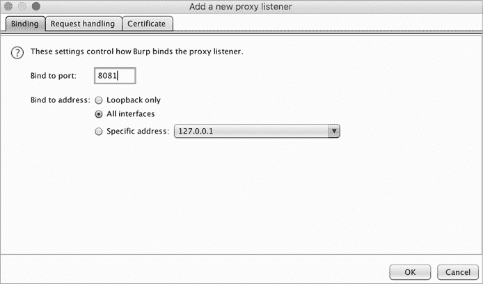

# 破解 Android 应用


你至今已经在整本书中学习了如何破解网页应用程序。大多数漏洞悬赏项目都会提供网页应用程序的赏金，所以精通网页破解是进入漏洞悬赏的最简单方法，因为它将解锁最广泛的目标。

另一方面，移动破解需要一些更多的前置技能，并且需要更多的时间来入门。但由于进入门槛较高，做移动程序的黑客较少。此外，随着公司越来越多地推出复杂的移动产品，移动程序的数量也在增加。移动程序有时会被列在公司主要漏洞悬赏计划的移动或物联网部分。这意味着，如果你学会了破解移动应用程序，你很可能会提交更少的重复报告，找到更多有趣的漏洞。

尽管设置过程更加复杂，但破解移动应用程序与破解网页应用程序非常相似。本章介绍了在开始分析 Android 应用程序之前，你需要学习的额外技能。

拥有移动应用程序的公司通常会有 Android 和 iOS 版本的应用程序。我们不会涉及 iOS 应用程序，而且本章并非一个全面的 Android 应用破解指南。但结合前几章的内容，它应该为你提供了开始自主探索该领域的基础。

## 设置你的移动代理

与配置你的网页浏览器以与代理一起使用的方式相同，你也需要设置你的测试移动设备使其与代理配合使用。这通常涉及在你的设备上安装代理的证书，并调整代理的设置。

如果你能承担的话，可以购买一部新的移动设备，或者使用你的一部旧设备进行测试。移动测试是有风险的：你可能会不小心损坏设备，而且本章提到的许多技术会使设备的保修失效。你也可以使用移动模拟器（一个模拟移动设备的程序）进行测试。

首先，你需要配置 Burp 的代理以接受来自你的移动设备的连接，因为默认情况下，Burp 的代理只接受来自 Burp 所在机器的连接。进入 Burp 的**Proxy**▶**Options**选项卡。在 Proxy Listeners 部分，点击**Add**。在弹出的窗口中（图 23-1），输入一个当前未被使用的端口号，并选择**All interfaces**作为绑定地址选项。点击**OK**。



图 23-1：设置 Burp 接受来自 Wi-Fi 网络中所有设备的连接

现在你的代理应该可以接受来自任何连接到同一 Wi-Fi 网络的设备的连接。因此，我不建议在公共 Wi-Fi 网络上进行此操作。

接下来，你将配置 Android 设备以使用代理。根据你使用的系统，这些步骤可能会有所不同，但过程应该类似于选择**设置**▶**网络**▶**Wi-Fi**，选择（通常是通过长按）你当前连接的 Wi-Fi 网络，然后选择**修改网络**。之后，你应该能够选择代理主机名和端口。在这里，你应该输入你计算机的 IP 地址和你之前选择的端口号。如果你使用的是 Linux 计算机，你可以通过运行以下命令找到计算机的 IP 地址：

```
hostname -i
```

如果你使用的是 Mac，你可以通过运行以下命令找到你的 IP 地址：

```
ipconfig getifaddr en0
```

现在，你的 Burp 代理应该已经准备好开始拦截来自移动设备的流量了。设置移动模拟器与代理配合的过程类似，唯一的区别是有些模拟器需要你从模拟器设置菜单中添加代理信息，而不是从模拟设备本身的网络设置中添加。

如果你还想拦截并解码来自移动设备的 HTTPS 流量，你需要在设备上安装 Burp 的证书。你可以通过在使用 Burp 作为代理的计算机浏览器中访问*http://burp/cert*来实现。保存下载的证书，发送邮件给自己，并将其下载到你的移动设备上。接下来，在你的设备上安装证书。这个过程也会依赖于设备上运行的系统的具体情况，但一般来说，应该是选择**设置**▶**安全性**▶**从存储中安装证书**。点击你刚刚下载的证书，并为证书使用选项选择**VPN 和应用程序**。现在，你就可以使用 Burp 审计 HTTPS 流量了。

## 绕过证书固定

*证书固定*是一种机制，限制应用程序只信任预定义的证书。它也被称为*SSL 固定*或*证书固定*，它提供了针对*中间人攻击*的额外安全层，在这种攻击中，攻击者秘密地拦截、读取并篡改双方之间的通信。如果你想要拦截并解码使用证书固定的应用流量，你必须先绕过证书固定，否则该应用将不信任你代理的 SSL 证书，你将无法拦截 HTTPS 流量。

有时候，绕过证书固定是拦截更高保护级别应用流量所必需的。如果你已经成功设置了你的移动设备以使用代理，但仍然无法看到目标应用的流量，那么该应用可能实现了证书固定。

绕过证书固定的过程将取决于每个应用程序如何实现证书固定。对于 Android 应用程序，你有几种绕过证书固定的方法。你可以使用*Frida*，这是一种允许你将脚本注入到应用程序中的工具。你可以从[`frida.re/docs/installation/`](https://frida.re/docs/installation/)下载 Frida。然后使用通用 Android SSL 证书固定绕过 Frida 脚本([`codeshare.frida.re/@pcipolloni/universal-android-ssl-pinning-bypass-with-frida/`](https://codeshare.frida.re/@pcipolloni/universal-android-ssl-pinning-bypass-with-frida/))。另一个可以用来自动化此过程的工具是 Objection([`github.com/sensepost/objection/`](https://github.com/sensepost/objection/))，它使用 Frida 来绕过 Android 或 iOS 的证书固定。运行 Objection 命令 `android sslpinning disable` 以绕过证书固定。

对于大多数应用程序，你可以通过使用这些自动化工具绕过证书固定。但如果应用程序通过自定义代码实现了证书固定，你可能需要手动绕过它。你可以用自定义证书覆盖打包的证书。或者，你可以更改或禁用应用程序的证书验证代码。执行这些技术的过程是复杂的，并且高度依赖于你所针对的应用程序，因此我不会详细说明。有关这些方法的更多信息，你需要进行一些独立的研究。

## APK 的结构

在攻击 Android 应用程序之前，你必须先了解它们是由什么组成的。Android 应用程序以一种名为*Android Package (**APK)*的文件格式进行分发和安装。APKs 类似于 ZIP 文件，包含了 Android 应用程序运行所需的一切：应用程序代码、应用程序清单文件以及应用程序的资源。本节将描述 Android APK 的主要组件。

首先，*AndroidManifest.xml* 文件包含应用程序的包名、版本、组件、访问权限和引用的库，以及其他元数据。这是探索应用程序的一个良好起点。从这个文件中，你可以获得关于应用程序组件和权限的见解。

理解目标应用程序的组件将为你提供应用程序工作原理的整体概览。应用程序有四种类型的组件：活动（在 `<activity>` 标签中声明）、服务（在 `<service>` 标签中声明）、广播接收器（在 `<receiver>` 标签中声明）和内容提供者（在 `<provider>` 标签中声明）。

*Activities* 是与用户交互的应用程序组件。你所看到的 Android 应用程序窗口是由 Activities 组成的。*Services* 是长期运行的操作，不直接与用户交互，例如在后台检索或发送数据。*BroadcastReceivers* 允许应用响应来自 Android 系统和其他应用的广播消息。例如，一些应用程序仅在设备连接到 Wi-Fi 时才下载大文件，因此它们需要一种在设备连接到 Wi-Fi 网络时接收通知的方式。*ContentProviders* 提供了一种与其他应用共享数据的方法。

应用程序使用的权限，例如发送短信的权限以及其他应用与其交互所需的权限，也在 *AndroidManifest.xml* 文件中声明。这将帮助你了解应用程序能做什么，以及它如何与同一设备上的其他应用程序互动。有关 *AndroidManifest.xml* 中的内容，访问 [`developer.android.com/guide/topics/manifest/manifest-intro/`](https://developer.android.com/guide/topics/manifest/manifest-intro/)。

*classes.dex* 文件包含以 DEX 文件格式编译的应用程序源代码。你可以使用本章稍后介绍的各种 Android 破解工具来提取和反编译这些源代码进行分析。关于如何进行源代码漏洞审查，查看第二十二章。

*resources.arsc* 文件包含应用程序的预编译资源，如字符串、颜色和样式。*res* 文件夹包含未编译到 *resources.arsc* 中的应用程序资源。在 *res* 文件夹中，*res/values/strings.xml* 文件包含应用程序的字面字符串。

*lib* 文件夹包含与平台相关的编译代码。*lib* 中的每个子目录包含用于特定移动架构的源代码。编译后的内核模块存储在这里，通常是漏洞的来源。

*assets* 文件夹包含应用程序的资源，如视频、音频和文档模板。最后，*META-INF* 文件夹包含 *MANIFEST.MF* 文件，该文件存储关于应用程序的元数据。该文件夹还包含 APK 的证书和签名。

## 使用的工具

现在你了解了 Android 应用程序的主要组成部分，你需要知道如何处理 APK 文件并提取 Android 源代码。除了使用 Web 代理检查与测试设备之间的流量外，你还需要一些分析 Android 应用程序的必要工具。本节不会详细说明如何使用这些工具，而是说明何时以及为什么使用它们。其余的你可以通过查阅每个工具的文档页面轻松掌握。

### Android 调试桥

*Android Debug Bridge（**ADB**）*是一个命令行工具，可以让你的电脑与连接的安卓设备进行通信。这意味着，如果你想在电脑上读取或修改应用程序源代码和资源文件，就不必通过电子邮件来回传输它们。例如，你可以使用 ADB 将文件从电脑复制到设备，或者快速安装你正在研究的应用程序的修改版本。ADB 的文档请见[`developer.android.com/studio/command-line/adb/`](https://developer.android.com/studio/command-line/adb/)。

要开始使用 ADB，将设备通过 USB 线连接到你的笔记本电脑。然后在设备上开启*调试模式*。每次你想通过 USB 使用 ADB 时，都必须启用 USB 调试。此过程根据设备的不同而有所不同，但大致上应类似于选择**设置**▶**系统**▶**开发者选项**▶**调试**。这样你就能通过 ADB 从笔记本与设备互动。在安卓 4.1 及以下版本中，开发者选项是默认可见的。而在安卓 4.2 及更高版本中，开发者选项需要通过选择**设置**▶**关于手机**，然后点击**版本号**七次来启用。

在你的移动设备上，应该会看到一个窗口提示你允许笔记本电脑的连接。确保笔记本电脑通过在笔记本终端中运行以下命令与设备连接：

```
adb devices -l
```

现在你可以使用以下命令安装 APKs：

```
adb install `PATH_TO_APK`
```

你也可以通过运行以下命令将文件从设备下载到笔记本电脑：

```
adb pull `REMOTE_PATH LOCAL_PATH`
```

或者将文件从你的笔记本电脑复制到移动设备：

```
adb push `LOCAL_PATH REMOTE_PATH`
```

### Android Studio

*Android Studio*是用于开发安卓应用程序的软件，你可以用它修改现有应用的源代码。它还包括一个*模拟器*，如果你没有实体安卓设备，可以在虚拟环境中运行应用程序。你可以在[`developer.android.com/studio/`](https://developer.android.com/studio/)下载并阅读关于 Android Studio 的相关信息。

### Apktool

*Apktool*，一个用于反向工程 APK 文件的工具，是安卓黑客必备工具，可能是你在分析过程中使用最频繁的工具。它将 APK 转换为可读的源代码文件，并从这些文件中重建 APK。Apktool 的文档请见[`ibotpeaches.github.io/Apktool/`](https://ibotpeaches.github.io/Apktool/)。

你可以使用 Apktool 从 APK 中提取单个文件进行源代码分析。例如，以下命令从名为*example.apk*的 APK 中提取文件：

```
$ apktool d example.apk
```

有时你可能需要修改 APK 的源代码，看看这是否会改变应用程序的行为。在进行修改后，你可以使用 Apktool 重新打包单个源代码文件。这个命令将*example*文件夹的内容打包成*example.apk*文件：

```
$ apktool b example -o example.apk
```

### Frida

*Frida* ([`frida.re/`](https://frida.re/)) 是一个令人惊叹的工具包，可以让你将脚本注入到正在运行的应用程序进程中。你可以用它来检查被调用的函数，分析应用的网络连接，绕过证书钉扎（certificate pinning）。

Frida 使用 JavaScript 作为其语言，因此你需要了解 JavaScript 才能充分利用它。不过，你可以访问大量在线共享的现成脚本。

### 移动安全框架

我还强烈推荐 *Mobile Security Framework* ([`github.com/MobSF/Mobile-Security-Framework-MobSF/`](https://github.com/MobSF/Mobile-Security-Framework-MobSF/))，或者叫 *MobSF*，用于所有与移动应用测试相关的工作。这个用于 Android、iOS 和 Windows 的自动化移动应用测试框架可以进行静态和动态测试。它自动化了我在本章中提到的许多技术，是你掌握 Android 黑客基础知识后，可以加入到工具包中的好工具。

## 漏洞猎杀

现在，你的移动黑客环境已经搭建好，是时候开始在移动应用中寻找漏洞了。幸运的是，黑客攻击移动应用和黑客攻击网页应用并没有太大的不同。

首先，提取应用程序的包内容并查看代码中的漏洞。比较同一组织的移动应用和网页应用的身份验证和授权机制。开发者可能会信任来自移动应用的数据，如果你使用了移动端点，这可能会导致 IDOR（不安全的直接对象引用）或身份验证失效。移动应用通常还会遇到会话管理问题，如重用会话令牌、使用较长的会话时间或使用没有过期的会话 Cookie。这些问题可以与 XSS 联合使用，以获取会话 Cookie，从而使攻击者在用户退出或更改密码后仍能接管账户。有些应用程序使用自定义的加密或哈希实现。寻找不安全的算法、已知算法的弱实现和硬编码的加密密钥。在审查应用程序源代码中的潜在漏洞后，你可以通过在模拟器或真实设备上动态测试来验证你的发现。

移动应用程序是寻找额外网页漏洞的绝佳场所，这些漏洞在其对应的网页应用程序中不存在。你可以用相同的方式去寻找这些漏洞，就像你在寻找网页漏洞时使用的那样：利用 Burp Suite 拦截来自移动应用的敏感操作流量。移动应用常常使用一些独特的端点，这些端点可能没有像网页端点那样经过充分测试，因为较少的黑客会在移动应用上进行攻击。你可以通过寻找那些在该组织网页应用程序中没有出现过的端点来发现它们。

我建议你先测试组织的 Web 应用程序，再深入其移动应用程序，因为移动应用程序通常是其 Web 版本的简化版。运用你已经学到的技能，搜索 IDOR、SQL 注入、XSS 以及其他常见的 Web 漏洞。你还可以通过分析移动应用程序的源代码来寻找常见的 Web 漏洞。

除了 Web 应用程序中你要寻找的漏洞外，还需要寻找一些移动特有的漏洞。*AndroidManifest.xml* 文件包含了关于应用程序及其功能的基本信息。这个文件是分析的一个好起点。解包 APK 文件后，阅读它以获取对应用程序的基本了解，包括它的组件和所需的权限。然后你可以深入其他文件，寻找其他特定于移动的漏洞。

移动应用程序的源代码中常常包含硬编码的秘密或 API 密钥，这些密钥是应用程序访问 Web 服务所必需的。*res/values/strings.xml* 文件存储着应用程序中的字符串。它是查找硬编码的秘密、密钥、端点和其他信息泄露的好地方。你还可以通过使用 `grep` 搜索第二十二章中提到的关键字，在其他文件中查找秘密。

如果你发现扩展名为 *.db* 或 *.sqlite* 的文件，这些是数据库文件。查看这些文件，了解应用程序随附的是什么信息。这些文件也是潜在的秘密和敏感信息泄露的易发来源。请留意诸如会话数据、财务信息，以及属于用户或组织的敏感信息等内容。

最终，寻找移动漏洞并不与破解 Web 应用程序有太大不同。仔细检查客户端和服务器之间的交互，并深入研究源代码。记住一些特殊的漏洞类别，比如硬编码的秘密和存储在数据库文件中的敏感数据，这些通常比 Web 应用程序在移动应用程序中更容易出现。
