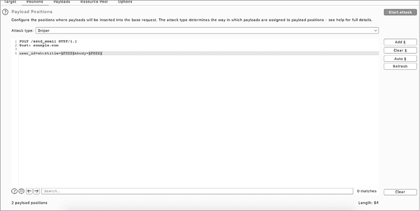
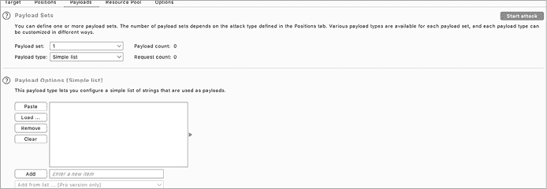

# 使用 Fuzzer 自动发现漏洞


每当我接触到一个新的目标时，我更倾向于手动寻找漏洞。手动测试对于发现新的和意想不到的攻击途径非常有用。它还可以帮助你深入学习新的安全概念。但手动测试也需要大量的时间和精力，因此，就像自动化侦察一样，你应该尽力至少自动化一部分漏洞发现过程。自动化测试可以帮助你在短时间内发现大量漏洞。

事实上，表现最好的漏洞赏金猎人通常会自动化大部分黑客过程。他们自动化他们的侦察工作，并编写程序，持续寻找他们选择目标的漏洞。每当他们的工具通知他们可能存在漏洞时，他们会立即进行验证并报告。

通过一种名为*模糊测试*（或*模糊测试技术*）的自动化技术发现的漏洞，现在占据了大多数新的 CVE 条目。虽然模糊测试通常与二进制漏洞开发相关联，但它也可以用于发现 Web 应用程序中的漏洞。在本章中，我们将讨论如何使用两个工具，Burp Intruder 和 Wfuzz，来进行 Web 应用程序的模糊测试，以及它能帮助你实现什么目标。

## 什么是模糊测试？

*模糊测试*是向应用程序发送各种无效和意外数据并监视应用程序异常的过程。有时，黑客会为特定目的精心制作这些无效数据；其他时候，他们会随机生成这些数据或使用算法生成。在这两种情况下，目标都是诱发意外行为，如崩溃，然后检查错误是否导致可利用的漏洞。模糊测试尤其有助于揭示像内存泄漏、控制流问题和竞态条件这样的漏洞。例如，你可以使用像 American Fuzzy Lop（AFL）这样的工具对已编译的二进制文件进行模糊测试，寻找漏洞（[`github.com/google/AFL/`](https://github.com/google/AFL/)）。

模糊测试有很多种，每一种都针对应用程序中的特定问题进行优化。*Web 应用程序模糊测试*是一种技术，旨在揭示常见的 Web 漏洞，如注入问题、跨站脚本（XSS）和身份验证绕过。

## Web Fuzzer 的工作原理

Web 模糊测试工具会自动生成恶意请求，通过将常见漏洞的有效载荷插入 Web 应用程序的注入点。然后，它们会发送这些请求，并追踪服务器的响应。

为了更好地理解这个过程，让我们来看一下开源 Web 应用程序模糊测试工具 Wfuzz（[`github.com/xmendez/wfuzz/`](https://github.com/xmendez/wfuzz/)）是如何工作的。当提供一个字典文件和一个端点时，Wfuzz 会将所有标记为`FUZZ`的位置替换为字典中的字符串。例如，以下 Wfuzz 命令将会把 URL 中的`FUZZ`替换为*common_paths.txt*字典中的每个字符串：

```
$ **wfuzz -w common_paths.txt http://example.com/FUZZ**
```

你应该为你扫描的每种漏洞类型提供不同的词表。例如，你可以通过提供一个常见文件路径的词表，使模糊测试工具像目录枚举工具一样工作。这样，Wfuzz 将生成枚举 *example.com* 路径的请求：

```
http://example.com/admin
http://example.com/admin.php
http://example.com/cgi-bin
http://example.com/secure
http://example.com/authorize.php
http://example.com/cron.php
http://example.com/administrator
```

你还可以通过提供潜在的 ID 值，使模糊测试工具像一个 IDOR 扫描器一样工作：

```
$ **wfuzz -w ids.txt http://example.com/view_inbox?user_id=FUZZ**
```

假设 *ids.txt* 是一个数字 ID 列表。如果 *example.com/view_inbox* 是用来访问不同用户邮箱的端点，那么这个命令将导致 Wfuzz 生成一系列请求，尝试访问其他用户的邮箱，例如以下内容：

```
http://example.com/view_inbox?user_id=1
http://example.com/view_inbox?user_id=2
http://example.com/view_inbox?user_id=3
```

一旦你收到服务器的响应，你可以分析这些响应，看看在特定路径中是否真的有文件，或者是否能够访问另一个用户的邮箱。如你所见，与漏洞扫描器不同，模糊测试工具在测试漏洞时非常灵活。你可以通过指定不同的有效载荷和注入点来最大程度地自定义它们。

## 模糊测试过程

现在让我们来看看如何将模糊测试整合到你的黑客过程中的步骤！当你接近一个目标时，如何开始对其进行模糊测试？模糊测试应用程序的过程可以分为四个步骤。你可以首先确定应用程序中可以进行模糊测试的端点。然后，决定有效载荷列表并开始模糊测试。最后，监控你的模糊测试工具的结果，并寻找异常。

### 步骤 1：确定数据注入点

在对 Web 应用程序进行模糊测试时，首先要做的事情是识别用户如何向应用程序提供输入。有哪些端点接受用户输入？使用了哪些参数？应用程序使用了哪些头部？你可以将这些参数和头部视为 *数据注入点* 或 *数据输入点*，因为这些是攻击者可以将数据注入应用程序的位置。

到现在为止，你应该已经对在不同用户输入机会中应该寻找哪些漏洞有了直觉。例如，当你看到一个数字 ID 时，应该测试 IDOR，当你看到一个搜索框时，应该测试反射型 XSS。根据数据注入点可能容易受到的漏洞，将你在目标上找到的数据注入点分类：

**测试 IDOR 的数据输入点**

```
GET /email_inbox?user_id=FUZZ
Host: example.comPOST /delete_user
Host: example.com
(POST request parameter)
user_id=FUZZ
```

**测试 XSS 的数据输入点**

```
GET /search?q=FUZZ
Host: example.com
POST /send_email
Host: example.com
(POST request parameter)
user_id=abc&title=FUZZ&body=FUZZ
```

### 步骤 2：决定有效载荷列表

在你识别了数据注入点和可能利用每个点的漏洞之后，确定要向每个注入点提供的数据。你应该用常见的有效载荷对每个注入点进行模糊测试，以测试最可能的漏洞。将 XSS 有效载荷和 SQL 注入有效载荷输入大多数数据输入点也是值得的。

使用一个好的负载列表对于通过模糊测试发现漏洞至关重要。我推荐下载由 Daniel Miessler 提供的 SecLists（[`github.com/danielmiessler/SecLists/`](https://github.com/danielmiessler/SecLists/)）和由 Max Woolf 提供的 Big List of Naughty Strings（[`github.com/minimaxir/big-list-of-naughty-strings/`](https://github.com/minimaxir/big-list-of-naughty-strings/)），它们是一个非常全面的负载列表，适用于模糊测试 Web 应用程序。除了其他功能，这些列表包括针对最常见 Web 漏洞（如 XXS、SQL 注入和 XXE）的负载。另一个适用于枚举和漏洞模糊测试的好词典数据库是 FuzzDB（[`github.com/fuzzdb-project/fuzzdb/`](https://github.com/fuzzdb-project/fuzzdb/)）。

除了使用已知的负载外，你还可以尝试随机生成负载。特别是，创建极长的负载，包含各种编码的奇怪字符的负载，或者包含某些特殊字符的负载，如换行符、回车符等。通过向应用程序提供这样的垃圾数据，你可能能够发现意外的行为并发现新的漏洞类别！

你可以使用在第五章中学到的 bash 脚本，来自动生成随机负载。你将如何生成一个包含特定特殊字符的随机长度字符串？提示：你可以使用`for`循环或 Unix 系统上的文件*/dev/random*。

### 第 3 步：模糊测试

接下来，系统地将你的负载列表传递到应用程序的数据输入点。根据你的需求和编程技能，有几种方法可以做到这一点。最简单的自动化模糊测试方式是使用 Burp intruder（图 25-1）。Burp intruder 提供了一个具有图形用户界面（GUI）的模糊测试工具，并与 Burp 代理无缝集成。每当你遇到一个想要进行模糊测试的请求时，可以右键点击它并选择**发送到 Intruder**。

在 Intruder 标签页中，你可以配置模糊测试器设置，选择数据注入点和负载列表，并开始模糊测试。要将请求的某一部分作为数据注入点，请突出显示请求的部分，并点击窗口右侧的**添加**。



图 25-1：Burp intruder 负载位置选择

然后，选择一个预定义的负载列表或在 Payloads 标签页中生成负载列表（图 25-2）。例如，你可以生成数字列表或随机生成的字母数字字符串。



图 25-2：在 Burp intruder 中选择负载列表

Burp intruder 使用起来很方便，但它也有一个缺点：Burp 的免费版本限制了模糊测试工具的功能，并且对攻击进行时间限制，这意味着它会减缓你的模糊测试并限制你在一定时间内可以发送的请求数量。你每分钟只能发送有限数量的请求，这使得 intruder 的效率低于没有时间限制的模糊测试工具。除非你需要图形界面或者拥有 Burp 的专业版，否则你最好使用开源的模糊测试工具，如 OWASP ZAP 的 fuzzer 或 Wfuzz。在本页稍后，你将学习如何使用 Wfuzz 对目标进行模糊测试。

注意，有时为了防止干扰应用程序的正常运行，你可能需要限制模糊测试工具的速度。对于大型公司来说，这通常不是问题，但如果你没有进行时间限制地对小型公司的应用程序进行模糊测试，可能会意外地发起 DoS 攻击。进行模糊测试时，请始终小心并获得公司的许可！

### 步骤 4：监控结果

分析你的模糊测试工具返回的结果，寻找服务器响应中的模式和异常。需要寻找的内容取决于你使用的负载集和你希望发现的漏洞。例如，当你使用模糊测试工具来查找文件路径时，状态码是判断文件是否存在的一个好指标。如果某个路径名的返回状态码在 200 范围内，你可能发现了一个有效路径。而如果状态码是 404，那么这个文件路径可能是无效的。

在进行 SQL 注入模糊测试时，你可能需要观察响应内容长度或时间的变化。如果某个负载返回的内容比其他负载的内容要长，这可能表明你的负载成功地影响了数据库的操作并改变了返回的内容。另一方面，如果你使用的负载列表会引起应用程序的时间延迟，检查是否有任何负载让服务器的响应速度比平时更慢。运用你在本书中学到的知识来识别潜在漏洞的关键指标。

## 使用 Wfuzz 进行模糊测试

现在你已经了解了大致的操作方法，让我们通过一个实际的例子来演示如何使用 Wfuzz，安装命令如下：

```
$ **pip install wfuzz**
```

模糊测试在信息收集阶段和漏洞猎杀阶段都非常有用：你可以使用模糊测试来列举文件路径、暴力破解认证、测试常见的 Web 漏洞等。

### 路径枚举

在信息收集阶段，尝试使用 Wfuzz 枚举服务器上的文件路径。以下是你可以用来枚举 *example.com* 上文件路径的命令：

```
$ wfuzz -w wordlist.txt -f output.txt --hc 404 --follow http://example.com/**FUZZ**
```

`-w` 标志选项指定用于枚举的字典。在这种情况下，你应该选择一个为目标使用的技术设计的良好的路径枚举字典。`-f` 标志指定输出文件的位置。在这里，我们将结果存储到当前目录下名为 *output.txt* 的文件中。`--hc 404` 选项告诉 Wfuzz 排除任何返回 404 状态码的响应。记住，这个状态码代表文件未找到。通过这个过滤器，我们可以轻松地从结果列表中去除那些指向无效文件或目录的 URL。`--follow` 标志告诉 Wfuzz 跟随所有 HTTP 重定向，以便我们的结果显示 URL 的实际目的地。

让我们使用一个简单的字典运行命令，看看能在 *facebook.com* 上找到什么。为了我们的目的，我们使用一个仅包含四个单词的字典，名为 *wordlist.txt*：

```
authorize.php
cron.php
administrator
secure
```

运行此命令以枚举 Facebook 上的路径：

```
$ **wfuzz -w wordlist.txt -f output.txt --hc 404 --follow http://facebook.com/FUZZ**
```

让我们看一下结果。从左到右，Wfuzz 报告每个请求的列包括：请求 ID、HTTP 响应码、响应行数、响应字数、响应字符数和使用的有效负载：

```
********************************************************
* Wfuzz 2.4.6 - The Web Fuzzer                         *
********************************************************
Target: http://facebook.com/FUZZ
Total requests: 4
===================================================================
ID           Response   Lines    Word     Chars       Payload 
===================================================================
000000004:   200        20 L     2904 W   227381 Ch   "secure" 
Total time: 1.080132
Processed Requests: 4
Filtered Requests: 3
Requests/sec.: 3.703250
```

你可以看到，这些结果只包含一个响应。这是因为我们过滤掉了不相关的结果。由于我们已经去除了所有 404 响应，现在可以集中精力关注那些指向实际路径的 URL。看起来 *facebook.com* 上的 */secure* 返回了 200 OK 状态码，是一个有效的路径。

### 暴力破解认证

一旦你收集到目标的有效文件路径，可能会发现服务器上的某些页面受到保护。大多数情况下，这些页面会返回 403 Forbidden 响应码。那么该怎么办呢？

好吧，你可以尝试暴力破解页面上的认证。例如，有些页面使用 HTTP 的 *basic* 认证方案作为访问控制。在这种情况下，你可以使用 Wfuzz 来模糊化认证头部，使用 `-H` 标志指定自定义头部：

```
$ **wfuzz -w wordlist.txt -H "Authorization: Basic FUZZ" http://example.com/admin**
```

基本认证方案使用一个名为 `Authorization` 的头部，传输经过 base64 编码的用户名和密码对。例如，如果你的用户名和密码是 `admin` 和 `password`，那么你的认证字符串就是 `base64("admin:password")`，即 `YWRtaW46cGFzc3dvcmQ=`。你可以通过使用脚本从常见的用户名和密码对生成认证字符串，然后通过 Wfuzz 将它们提交到目标的受保护页面。

另一种暴力破解基本认证的方法是使用 Wfuzz 的 `--basic` 选项。此选项自动构造认证字符串来暴力破解基本认证，给定一个包含用户名和密码的输入列表。在 Wfuzz 中，你可以用 `FUZZ`、`FUZ2Z`、`FUZ3Z` 等标记不同的注入点。这些注入点将分别用传递进来的第一个、第二个和第三个字典中的单词进行模糊处理。以下是你可以用来同时模糊化用户名和密码字段的命令：

```
$ **wfuzz -w usernames.txt -w passwords.txt --basic FUZZ:FUZ2Z http://example.com/admin**
```

*usernames.txt* 文件包含两个用户名：`admin` 和 `administrator`。*passwords.txt* 文件包含三个密码：`secret`、`pass` 和 `password`。如你所见，Wfuzz 会为你列表中的每个用户名和密码组合发送请求：

```
********************************************************
* Wfuzz 2.4.6 - The Web Fuzzer                         *
********************************************************
Target: http://example.com/admin
Total requests: 6
===================================================================
ID           Response   Lines    Word     Chars       Payload
===================================================================
000000002:   404        46 L     120 W    1256 Ch     "admin – pass"
000000001:   404        46 L     120 W    1256 Ch     "admin – secret"
000000003:   404        46 L     120 W    1256 Ch     "admin – password"
000000006:   404        46 L     120 W    1256 Ch     "administrator – password"000000004:   404        46 L     120 W    1256 Ch     "administrator – secret" 
000000005:   404        46 L     120 W    1256 Ch     "administrator – pass" 
Total time: 0.153867
Processed Requests: 6
Filtered Requests: 0
Requests/sec.: 38.99447
```

其他绕过身份验证的方法包括更改 `User-Agent` 头或伪造用于身份验证的自定义头。你可以通过使用 Wfuzz 来暴力破解 HTTP 请求头完成这些操作。

### 测试常见的 Web 漏洞

最后，Wfuzz 可以帮助你自动测试常见的 Web 漏洞。首先，你可以使用 Wfuzz 对 URL 参数进行模糊测试，检测类似 IDOR 和开放重定向等漏洞。通过在 URL 中放置 `FUZZ` 关键字来模糊测试 URL 参数。例如，如果一个网站使用数字 ID 来表示聊天消息，可以使用以下命令测试各种 ID：

```
$**wfuzz -w wordlist.txt http://example.com/view_message?message_id=FUZZ**
```

然后，通过检查响应代码或响应内容长度来查找有效的 ID，看看你是否能够访问他人的消息。指向有效页面的 ID 通常返回 200 响应代码或更长的网页。

你还可以将有效载荷插入重定向参数中，以测试是否存在开放重定向：

```
$ **wfuzz -w wordlist.txt http://example.com?redirect=FUZZ**
```

要检查有效载荷是否会导致重定向，打开 Wfuzz 的跟随（`--follow`）和详细输出（`-v`）选项。跟随选项指示 Wfuzz 跟随重定向。详细输出选项显示更详细的结果，包括请求过程中是否发生了重定向。看看你是否能构造一个将用户重定向到你网站的有效载荷：

```
$ **wfuzz -w wordlist.txt -v –-follow http://example.com?redirect=FUZZ**
```

最后，测试像 XSS 和 SQL 注入这样的漏洞，通过模糊测试 URL 参数、POST 参数或其他用户输入位置，使用常见的有效载荷列表。

使用 Wfuzz 测试 XSS 时，尝试创建一个脚本列表，将用户重定向到你的页面，然后打开详细输出选项来监控是否有重定向发生。或者，你可以使用 Wfuzz 内容过滤器来检查是否有反射的 XSS 有效载荷。`--filter` 标志让你设置一个结果过滤器。一个特别有用的过滤器是 `content~``STRING`，它返回包含 `STRING` 的响应：

```
$ **wfuzz -w xss.txt --filter "content~FUZZ" http://example.com/get_user?user_id=FUZZ**
```

对于 SQL 注入漏洞，尝试使用现成的 SQL 注入单词列表，并监控每个有效载荷的响应时间、响应代码或响应长度的异常。如果你使用包含时间延迟的 SQL 注入有效载荷，注意查看长时间的响应。如果大多数有效载荷返回某个特定的响应代码，而其中一个没有，进一步调查该响应以查看是否存在 SQL 注入漏洞。较长的响应长度也可能是你成功从数据库中提取数据的迹象。

以下命令使用单词列表 *sqli.txt* 测试 SQL 注入。你可以使用 `-d` 标志指定 POST 请求体数据：

```
$ **wfuzz -w sqli.txt -d "user_id=FUZZ" http://example.com/get_user**
```

### 更多关于 Wfuzz 的信息

Wfuzz 还有许多更高级的选项、过滤器和自定义功能，你可以充分利用。充分发挥 Wfuzz 的潜力，它可以自动化你工作流程中最繁琐的部分，帮助你找到更多的漏洞。想了解更多酷炫的 Wfuzz 技巧，可以查看它的文档：[`wfuzz.readthedocs.io/`](https://wfuzz.readthedocs.io/)。

## 模糊测试与静态分析

在第二十二章中，我讨论了源代码审查在发现 Web 漏洞中的有效性。你现在可能会想：为什么不直接对代码进行静态分析？为什么还要进行模糊测试呢？

静态代码分析是发现漏洞和不当编程习惯的宝贵工具，攻击者可以利用这些漏洞。然而，静态分析也有其局限性。

首先，它是在非实时状态下评估应用程序。对应用程序进行代码审查无法模拟应用程序在实时运行时的反应，也很难预测攻击者可能提供的所有恶意输入。

静态代码分析也需要访问应用程序的源代码。当你进行黑盒测试时，比如在漏洞赏金场景中，你可能无法获得源代码，除非你能够泄露应用程序的源代码或识别出应用程序使用的开源组件。这使得模糊测试成为一种很好的补充测试方法，因为你不需要源代码就能对应用程序进行模糊测试。

## 模糊测试的陷阱

当然，模糊测试并不是万能的解决方案，它在漏洞检测方面也有一定的局限性，其中之一是服务器的速率限制。在远程黑盒测试中，你可能无法向应用程序发送大量有效载荷，而不被服务器检测到你的活动，或触发某种速率限制。这可能会导致你的测试变慢，或者服务器可能会将你封禁。

在黑盒测试中，通过模糊测试发现的漏洞可能也很难准确评估其影响，因为你无法访问源代码，因此只能获取应用程序行为的有限样本。你通常需要进行进一步的手动测试，才能分类漏洞的有效性和重要性。可以将模糊测试视为金属探测器：它只是指引你发现可疑的地方，最终你需要仔细检查，看看是否找到了有价值的东西。

另一个局限性涉及模糊测试能够发现的漏洞类别。虽然模糊测试擅长发现一些基本的漏洞，比如 XSS 和 SQL 注入，并且有时能帮助发现新的漏洞类型，但在检测业务逻辑错误或需要多个步骤才能利用的漏洞时帮助不大。这些复杂的漏洞是潜在攻击的主要来源，仍然需要手动排查。虽然模糊测试应该是你测试流程的一个重要部分，但绝不应是唯一的部分。

## 向你的自动化测试工具包添加新工具

像模糊测试工具或扫描器这样的自动化测试工具可以帮助你发现一些漏洞，但如果你没有花时间理解测试工具包中每个工具的工作原理，它们往往会妨碍你的学习进程。因此，在将工具添加到你的工作流程之前，一定要花时间阅读该工具的文档，并理解其工作原理。你应该对你使用的所有侦查和测试工具做同样的事情。

除了阅读工具的文档外，我还建议你阅读其源代码，特别是如果它是开源的。这可以让你了解其他黑客的方法论，并提供关于领域内顶级黑客如何进行测试的洞察。最后，通过学习其他人如何自动化黑客攻击，你将开始学习如何编写自己的工具。

这里有一个挑战：阅读工具 Sublist3r（[`github.com/aboul3la/Sublist3r/`](https://github.com/aboul3la/Sublist3r/)）和 Wfuzz（[`github.com/xmendez/wfuzz/`](https://github.com/xmendez/wfuzz/)）的源代码。这两个工具都是用 Python 编写的，容易理解。Sublist3r 是一个子域名枚举工具，而 Wfuzz 是一个 Web 应用程序模糊测试工具。Sublist3r 是如何进行子域名枚举的？Wfuzz 是如何对 Web 应用程序进行模糊测试的？你能把它们的应用逻辑写下来吗？从它们接收输入目标的那一刻开始，直到输出结果为止。你能否使用不同的方法重新编写它们实现的功能？

一旦你对工具的工作原理有了扎实的理解，尝试修改它们以添加新功能！如果你认为别人会觉得你的功能有用，你可以为开源项目做出贡献：提议将你的功能添加到工具的官方版本中。

了解你的工具和漏洞利用的工作原理是成为一名大师级黑客的关键。祝你好运，快乐黑客！
