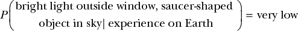
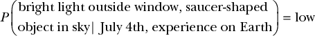
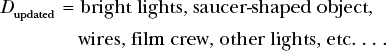
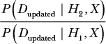
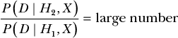

## **1

**贝叶斯思维与日常推理**

在本章的第一部分，我将给你介绍*贝叶斯推理*，这一正式的过程帮助我们在观察到数据后更新我们对世界的信念。我们将通过一个情景进行讲解，探索如何将我们的日常经验映射到贝叶斯推理中。

好消息是，即使在拿起这本书之前，你已经是一个贝叶斯推理者了！贝叶斯统计学与人们自然使用证据来创造新信念并推理日常问题的方式密切相关；困难的部分是将这种自然的思维过程分解成一个严格的数学过程。

在统计学中，我们使用特定的计算和模型来更准确地量化概率。然而现在，我们暂时不使用任何数学或模型；我们只会帮助你熟悉基本概念，并通过直觉来确定概率。然后，在下一章中，我们将为概率赋予具体的数字。在本书的其余部分，你将学到如何利用严格的数学技巧正式建模并推理我们将在本章中讨论的概念。

### **推理关于奇怪的经历**

一天晚上，你被窗外的一道强光惊醒。你从床上跳起来，望向窗外，看到天空中有一个巨大的物体，只能形容为飞碟形状。你通常是一个怀疑主义者，从来不相信外星人相遇，但被窗外的景象完全困惑，你不禁想，*这会是 UFO 吗？！*

贝叶斯推理涉及在面对某种情境时，逐步回顾你的思维过程，以识别何时你在做出概率假设，然后利用这些假设来更新你对世界的信念。在 UFO 的情境中，你已经完成了一次完整的贝叶斯分析，因为你：

1.  观察到的数据

1.  形成假设

1.  基于数据更新你的信念

这种推理通常发生得非常迅速，以至于你没有时间分析自己的思维过程。你在没有质疑的情况下创造了一个新的信念：之前你并不相信 UFO 的存在，但在事件发生后，你更新了你的信念，现在认为自己看到了一架 UFO。

在本章中，你将专注于构建你的信念以及创造这些信念的过程，以便你可以更正式地审视它，我们将在接下来的章节中量化这一过程。

让我们逐步查看每一个推理步骤，从观察数据开始。

#### ***观察数据***

基于数据建立信念是贝叶斯推理的关键组成部分。在你得出任何关于场景的结论之前（例如声称你看到的是 UFO），你需要理解你正在观察的数据，在这种情况下：

+   窗外的一个极其明亮的光点

+   空中悬停的飞碟形物体

根据你过去的经验，你会将看到的窗外景象描述为“令人惊讶”。用概率术语来说，我们可以将其写成：

*P*(窗外明亮的光点，天空中的飞碟形状物体) = 非常低

其中 *P* 代表 *概率*，而两个数据项列在括号内。你可以读这个公式为：“看到窗外明亮的光点和天空中飞碟形状物体的概率是非常低的。”在概率论中，当我们研究多个事件的联合概率时，会用逗号来分隔事件。请注意，这些数据并不包含任何关于 UFO 的具体内容；它们仅仅是你所观察到的现象——这将在后面变得很重要。

我们也可以考察单一事件的概率，表示为：

*P*(下雨) = 可能

这个公式可以读作：“下雨的概率是可能的。”

在我们的 UFO 情景中，我们正在确定*两个*事件同时发生的概率。这两个事件单独发生的概率会完全不同。例如，仅仅是明亮的光点就很可能是路过的车，所以单独发生这个事件的概率比与看到飞碟形状物体同时发生的概率要大（即便是看到飞碟形状物体，它本身仍然是令人惊讶的）。

那么我们是如何确定这个概率的呢？目前我们依赖的是直觉——也就是我们对这些事件发生的可能性的一般感知。在下一章中，我们将看到如何为我们的概率得出确切的数字。

#### ***保持先验信念和条件概率***

你能够早晨醒来，泡一杯咖啡，开车去上班，而不需要做大量的分析，因为你对世界的运作有着*先验信念*。我们的先验信念是我们一生经历（即观察数据）中逐步建立起来的信念集合。你相信太阳会升起，因为自你出生以来，太阳每天都会升起。同样，你可能也有一个先验信念，那就是在十字路口，当对面交通的红灯亮起，而你的绿灯亮时，你可以安全地通过路口。如果没有先验信念，我们每晚都会惊恐地上床睡觉，担心太阳明天可能不会升起，并且在每个路口都会停下来仔细检查来车情况。

我们的先验信念认为，在地球上，同时看到窗外的明亮光点和飞碟形状的物体是一种罕见的现象。然而，如果你生活在一个远离地球的星球上，那里有大量的飞碟，并且经常有星际访客，那么在天空中看到光点和飞碟形状物体的概率会大大增加。

在一个公式中，我们在数据之后输入先验信念，用“|”分隔，如下所示：

我们可以读这个公式为：“根据我们在地球上的经验，看到窗外明亮的光点和天空中飞碟形状物体的概率是非常低的。”

概率结果被称为*条件概率*，因为我们正在*条件化*某个事件发生的概率，基于其他事件的存在。在这种情况下，我们是根据我们的先验经验对观察结果的概率进行条件化。

就像我们用*P*表示概率一样，我们通常用更短的变量名来表示事件和条件。如果你不熟悉阅读方程式，刚开始可能会觉得它们太简洁。不过，过一段时间后，你会发现，短的变量名有助于提高可读性，帮助你理解方程如何推广到更广泛的问题类别。我们将所有的数据赋值给一个变量，*D*：

*D* = 窗外的明亮光线，天上的飞碟形状物体

所以从现在开始，当我们提到数据集的概率时，我们会简单地说，*P*(*D*)。

同样，我们用变量*X*来表示我们的先验信念，如下所示：

*X* = 地球上的经验

我们现在可以将这个方程写作*P*(*D* | *X*)。这样写更简洁，也不改变其含义。

##### **条件化多个信念**

如果有多个变量会显著影响概率，我们也可以添加多条先验知识。假设今天是 7 月 4 日，你住在美国。从先前的经验来看，你知道烟花在独立日（7 月 4 日）是常见的。考虑到你在地球上的经验*并且*今天是 7 月 4 日，看到天空中有光的概率就不那么低，甚至飞碟形状的物体可能与某些烟花展示有关。你可以将这个方程改写为：

考虑到这两种经历，我们的条件概率从“非常低”变为“低”。

##### **在实践中假设先验信念**

在统计学中，我们通常不会显式地为我们所有现有的经验包含条件，因为这可以被假设。出于这个原因，在本书中我们不会为这个条件单独设置变量。然而，在贝叶斯分析中，重要的是要记住，我们对世界的理解总是基于我们之前在世界上的经验。因此，在本章剩余部分，我们会保留“地球上的经验”这一变量，提醒我们这一点。

#### ***形成假设***

到目前为止，我们有了数据*D*（我们看到了一束明亮的光和一个飞碟形状的物体）和先验经验*X*。为了说明你所看到的，你需要形成某种*假设*——一种关于世界如何运作的模型，并做出预测。假设可以有多种形式。我们对世界的所有基本信念都是假设：

+   如果你相信地球自转，你会预测太阳会在特定时间升起和落下。

+   如果你认为你最喜欢的棒球队是最棒的，你会预测他们会赢得比其他队伍更多的比赛。

+   如果你相信占星学，你会预测星星的排列将描述人们和事件。

假设也可以更加正式或复杂：

+   一位科学家可能会假设某种治疗方法能够减缓癌症的生长。

+   一名金融领域的量化分析师可能有一个模型，用于预测市场的行为。

+   一个深度神经网络可能会预测哪些图像是动物，哪些是植物。

所有这些例子都是假设，因为它们有某种方式来理解世界，并利用这种理解来预测世界将如何运作。当我们在贝叶斯统计中思考假设时，我们通常关心的是它们如何预测我们观察到的数据。

当你看到证据并想到 *UFO！* 时，你正在形成一个假设。这个 UFO 假设很可能是基于你在先前经验中看过的无数电影和电视节目。我们可以将我们的第一个假设定义为：

*H*[1] = 一个 UFO 出现在我的后院！

但这个假设在预测什么呢？如果我们倒过来思考这个情境，或许会问：“如果你的后院真有一个 UFO，你会预期看到什么？”你可能会回答：“亮光和一个碟形物体。”因为 *H*[1] 预测了数据 *D*，当我们根据我们的假设来观察数据时，数据的概率增加了。正式地，我们将其写作：

*P*(*D*| *H*[1],*X*) >> *P*(*D*| *X*)

这个方程式说：“根据我相信这是一个 UFO 且基于我的先前经验，看到亮光和碟形物体出现在天上的概率，要比单纯看到亮光和碟形物体却没有任何解释的概率高得多[由双大于符号 *>>* 表示]。”在这里，我们使用了概率的语言来表明我们的假设解释了这些数据。

#### ***在日常语言中识别假设***

很容易看出我们日常语言和概率之间的关系。例如，说某事是“令人惊讶的”，可能就意味着根据我们先前的经验，这件事的发生概率较低。说某事“合乎逻辑”，可能表明根据我们先前的经验，这件事的发生概率较高。尽管一旦指出来可能显得很明显，但概率推理的关键在于仔细思考如何解读数据、构建假设，并且在普通的日常场景中调整你的信念。如果没有 *H*[1]，你会陷入困惑，因为你无法解释你所观察到的数据。

### **收集更多证据并更新你的信念**

现在你有了数据和一个假设。然而，鉴于你作为一个怀疑论者的先前经验，这个假设仍然显得相当荒谬。为了提高你的知识状态并得出更可靠的结论，你需要收集更多的数据。这是统计推理的下一步，也是你直觉思维的下一步。

为了收集更多数据，我们需要进行更多的观察。在我们的情境中，你会透过窗户观察，看看能发现什么：

当你望向外面的明亮光线时，你注意到周围有更多的灯光。你还看到那个大型飞碟形状的物体是通过电线悬挂的，并且看到了一组摄影机团队。你听到一声响亮的拍手声和一个人喊道：“卡！”

你很可能已经瞬间改变了你对这个场景发生了什么的看法。你之前的推测是你可能目击到了飞碟。现在，有了这个新证据，你意识到看起来更像是有人在附近拍电影。

通过这种思考过程，你的大脑瞬间再次进行了复杂的贝叶斯分析！让我们分解一下你头脑中发生了什么，以便更仔细地推理事件。

你从最初的假设开始：

*H*[1] = 飞碟降落了！

单独来看，基于你的经验，这个假设极不可能：

*P*(*H*[1] | *X*) = 非常非常低

然而，鉴于你拥有的数据，这曾是你能想出来的唯一合理解释。当你观察到额外的数据时，你立刻意识到有另一种可能的假设——那就是附近正在拍摄电影：

*H*[2] = 在你窗外正在拍摄电影

单独来看，这个假设的概率也是直观上非常低的（除非你恰好住在电影制片厂附近）：

*P*(*H*[2] | *X*) = 非常低

注意到我们将*H*[1]的概率设置为“非常非常低”，而将*H*[2]的概率设置为“非常低”。这与你的直觉相符：如果有人在没有任何数据的情况下走到你面前，问你：“你觉得哪个更可能，晚上在你附近出现飞碟，还是隔壁正在拍摄电影？”你会说拍电影的情景比飞碟出现更可能。

现在我们只需要一种方法来在改变信念时考虑新数据。

### **比较假设**

你一开始接受了飞碟假设，尽管它不太可能，因为你最初没有其他解释。然而，现在有了另一种可能的解释——正在拍摄电影——因此你形成了一个*替代假设*。考虑替代假设的过程就是用你拥有的数据比较多种理论。

当你看到电线、摄影团队和更多的灯光时，你的数据发生了变化。你更新后的数据是：

在观察到这些额外的数据后，你改变了关于发生了什么的结论。让我们将这个过程分解为贝叶斯推理。你最初的假设*H*[1]给了你一种解释数据并结束困惑的方法，但随着你观察到更多数据，*H*[1]再也无法很好地解释这些数据了。我们可以这样写：

*P*(*D*[updated] | *H*[1], *X*) = 非常非常低

现在你有了一个新的假设*H*[2]，它能更好地解释数据，写成如下：

*P*(*D*[updated] | *H*[2], *X*) >> *P*(*D*[updated] | *H*[1], *X*)

这里的关键是要明白，我们是在比较这些假设解释观察到的数据的程度。当我们说：“在第二个假设下，数据的概率比第一个假设大得多”时，我们的意思是我们观察到的情况由第二个假设解释得更好。这将我们带入贝叶斯分析的真正核心：*你信念的考验是它们解释世界的能力*。我们说一个信念比另一个信念更准确，因为它能更好地解释我们观察到的世界。

数学上，我们将这个概念表示为两种概率的比率：

当这个比率是一个大数字，比如 1,000 时，它意味着“*H*[2]比*H*[1]更能解释数据 1,000 倍”。因为*H*[2]比另一个*H*[1]更能解释数据，我们会把信念从*H*[1]更新到*H*[2]。这正是当你改变对你所观察到的现象可能解释时发生的事情。你现在相信你所看到的是窗外正在拍摄电影，因为这是一个更有可能解释你所观察到的所有数据。

### **数据启发信念；信念不应影响数据**

最后需要强调的一点是，在所有这些例子中，唯一绝对不变的是你的数据。你的假设会改变，你对世界的经验，*X*，可能与其他人的不同，但数据，*D*，是所有人共享的。

考虑以下两个公式。第一个是我们在本章中一直使用的公式：

*P*(*D* | *H*,*X*)

我们可以理解为：“在给定我的假设和世界经验的情况下，数据的概率”，或者更简单地说，“我的信念如何解释我所观察到的情况。”

但在日常思维中常见的情况是相反的，通常是：

*P*(*H* | *D*,*X*)

我们可以这样理解：“在给定数据和我的世界经验的情况下，我的信念的概率”，或者更简单地说，“我所观察到的情况如何支持我的信念。”

在第一个情况下，我们根据收集到的数据和我们对世界的观察来改变我们的信念，这些数据和观察能更好地描述世界。在第二个情况下，我们收集数据来支持我们已有的信念。贝叶斯思维是关于改变自己的想法，并更新你对世界的理解。我们观察到的数据才是唯一真实的，因此我们的信念最终需要发生变化，直到它们与数据一致。

在生活中，你的信念也应该始终是可以改变的。

当摄制组收拾行李时，你注意到所有的面包车上都有军事标志。摄制组脱下外套，露出了军用制服，你听到有人说：“嗯，那应该能骗过任何看见的人……不错的想法。”

随着新证据的出现，你的信念可能会再次发生变化！

### **总结**

让我们回顾一下你所学到的内容。你的信念始于你对世界的现有经验，*X*。当你观察到数据，*D*，它要么与你的经验一致，*P*(*D* | *X*) = 非常高，要么它让你感到惊讶，*P*(*D* | *X*) = 非常低。为了理解这个世界，你依赖于你对观察到事物的信念或假设，*H*。通常，一个新的假设可以帮助你解释那些让你感到惊讶的数据，*P*(*D* | *H*, *X*) >> *P*(*D* | *X*)。当你收集到新数据或提出新想法时，你可以创建更多的假设，*H*[1]，*H*[2]，*H*[3]，……。当一个新的假设能比旧假设更好地解释数据时，你就会更新你的信念：

最后，你应该更加关注数据如何改变你的信念，而不是确保数据支持你的信念，*P*(*H* | *D*)。

在这些基础设置完成后，你已经准备好开始将数字引入混合中。在接下来的第一部分中，你将通过数学建模来精确确定你何时以及如何改变自己的信念。

### **练习**

尝试回答以下问题，看看你对贝叶斯推理的理解有多好。解决方案可以在*[`nostarch.com/learnbayes/`](https://nostarch.com/learnbayes/)*找到。

1.  使用你在本章中学到的数学符号，将以下陈述重写为方程：

    +   下雨的概率很低

    +   给定天阴的情况下，下雨的概率很高

    +   给定下雨的情况下，你带伞的概率要远高于你一般带伞的概率。

1.  将你在以下情境中观察到的数据组织成数学符号，使用我们在本章中讨论的技巧。然后，提出一个假设来解释这些数据：

    你下班回家，发现前门开着，侧窗破了。当你走进屋内时，你立刻注意到你的笔记本电脑不见了。

1.  以下情景为之前的情景添加了数据。展示这些新信息如何改变你的信念，并提出第二个假设来解释这些数据，使用你在本章中学到的符号。

    一个邻里的孩子跑到你面前，连声道歉，说自己不小心把石头扔破了你的窗户。他们声称看到笔记本电脑后，不想让它被盗，于是打开了前门拿走它，而你的笔记本电脑现在安全地在他们家。
