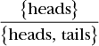
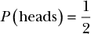
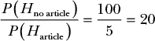
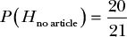
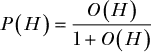
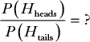
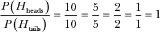
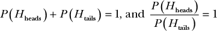

## 2

**测量不确定性**

在第一章中，我们回顾了一些直观使用的基本推理工具，用于理解数据如何影响我们的信念。我们留下了一个关键问题没有解决：我们如何量化这些工具？在概率论中，除了使用像*非常低*和*高*这样的术语描述信念，我们需要给这些信念分配真实的数字。这使我们能够创建关于我们对世界理解的定量模型。通过这些模型，我们可以看到证据如何改变我们的信念，决定何时应当改变我们的思维方式，并深入理解我们当前的知识状态。在本章中，我们将应用这一概念来量化一个事件的概率。

### 什么是概率？

概率的概念在我们日常语言中根深蒂固。每当你说类似“这似乎不太可能！”或者“如果这不是真的，我会很惊讶”或者“我不确定”，你实际上是在表达一个关于概率的观点。概率是我们对世界的信念有多强烈的度量。

在上一章中，我们使用了抽象的定性术语来描述我们的信念。为了真正分析我们如何发展和改变信念，我们需要通过更正式地量化*P*(*X*)来定义概率的具体含义——也就是我们有多强烈地相信*X*。

我们可以将概率看作是逻辑的延伸。在基本的逻辑中，我们有两个值，真和假，它们对应着绝对的信念。当我们说某事是真的时，这意味着我们完全确信它是正确的。虽然逻辑对许多问题有用，但我们很少会认为任何事情是绝对正确或绝对错误的；在我们做出的每个决定中，几乎总是存在某种程度的不确定性。概率让我们能够将逻辑扩展到处理真与假之间的不确定值。

计算机通常将真表示为 1，将假表示为 0，我们也可以使用这个模型来处理概率。*P*(*X*) = 0 相当于说*X* = 假，*P*(*X*) = 1 相当于*X* = 真。在 0 和 1 之间，我们有无限的可能值。一个更接近 0 的值意味着我们更确信某事是假的，而一个更接近 1 的值意味着我们更确信某事是真的。值得注意的是，0.5 的值意味着我们完全不确定某事是真的还是假的。

逻辑的另一个重要部分是*否定*。当我们说“不是正确的”时，我们的意思是错误的。同样地，说“不是错误的”就意味着正确的。我们希望概率的工作方式也相同，因此我们确保*X*的概率和*X*的否定概率之和为 1（换句话说，值要么是*X*，要么不是*X*）。我们可以通过以下公式来表达这一点：

*P*(*X*) + ¬*P*(*X*) = 1

**注意**

*¬ 符号表示“否定”或“不是”。*

使用这种逻辑，我们可以通过将其从 1 中减去来始终找到*P*(*X*)的否定。因此，例如，如果*P*(*X*) = 1，则其否定，1 - *P*(*X*)，必须等于 0，符合我们的基本逻辑规则。如果*P*(*X*) = 0，则其否定 1 - *P*(*X*) = 1。

下一个问题是如何量化这种不确定性。我们可以任意选择值：比如 0.95 表示非常确定，0.05 表示非常不确定。然而，这并不比我们之前使用的抽象术语更有助于确定概率。相反，我们需要使用正式的方法来计算我们的概率。

### 通过计数事件结果来计算概率

计算概率最常见的方法是计数事件结果。我们有两组重要的结果。第一组是事件的所有可能结果。对于硬币抛掷来说，这将是“正面”或“反面”。第二组是您感兴趣的结果的计数。如果您决定正面意味着您赢了，那么您关心的结果就是涉及正面的那些（在单次硬币抛掷的情况下，只有一个事件）。您感兴趣的事件可以是任何事情：抛硬币并得到正面，感染流感，或者 UFO 降落在您卧室外。鉴于这两组结果——您感兴趣的和您不感兴趣的——我们只关心的是我们感兴趣的结果与所有可能结果的比率。

我们将使用硬币抛掷的简单示例，其中唯一可能的结果是硬币落在正面或落在反面。第一步是计算所有可能事件的数量，这种情况下只有两种：正面或反面。在概率理论中，我们使用Ω（大写希腊字母 omega）来表示所有事件的集合：

Ω = {正面, 反面}

我们想知道在单次硬币抛掷中得到正面的概率，写作*P*(正面)。因此，我们看我们关心的结果数，即 1，并将其除以总可能结果数，即 2：

对于单次硬币抛掷，我们可以看到，在两个可能结果中，我们关心的一个结果。因此，得到正面的概率只是：

现在让我们问一个更复杂的问题：当我们抛两枚硬币时，至少得到一个正面的概率是多少？我们的可能事件列表更加复杂；不仅仅是{正面, 反面}，而是所有可能的正面和反面的对：

Ω = {(正面, 正面),(正面, 反面),(反面, 反面),(反面, 正面)}

要弄清楚至少得到一个正面的概率，我们看看我们的对数有多少与我们的条件匹配，这种情况下是：

{(正面, 正面),(正面, 反面),(反面, 正面)}

如您所见，我们关心的事件集合有 3 个元素，而我们可以获得 4 个可能的对。这意味着*P*(至少一个正面) = 3/4。

这些是简单的例子，但如果你能计数你关心的事件和所有可能的事件，你可以得出一个快速简便的概率。正如你所想的那样，随着例子变得更复杂，手动计算每个可能的结果变得不可行。解决这类更难的概率问题通常涉及一个叫做*组合学*的数学领域。在第四章中，我们将看到如何使用组合学来解决一个稍微复杂的问题。

### 将概率计算为信念的比例

计数事件对于物理对象很有用，但对于我们可能遇到的大多数现实生活中的概率问题来说，它并不是那么有效，比如：

+   “明天会下雨的概率有多大？”

+   “你觉得她是公司的总裁吗？”

+   “那是 UFO 吗!?”

几乎每天你都在根据概率做出无数决策，但如果有人问你“你认为自己能准时赶上火车的概率有多大？”你是无法使用刚才提到的方法来计算的。

这意味着我们需要另一种概率方法，用来推理这些更抽象的问题。举个例子，假设你正在和朋友闲聊随机话题。你的朋友问你是否听说过曼德拉效应，由于你没有听说过，他继续告诉你：“这是一种奇怪的现象，很多人错误地记得一些事件。例如，许多人记得纳尔逊·曼德拉在 80 年代死于监狱。但奇怪的是，他从监狱被释放，成为南非总统，并且直到 2013 年才去世！”你怀疑地转向你的朋友，说：“那听起来像是互联网流行心理学。我不认为有人真的记错了这个；我敢打赌，甚至连维基百科上都没有这个条目！”

在这种情况下，你想要衡量*P*(没有关于曼德拉效应的维基百科条目)。假设你处于一个没有手机信号的区域，因此无法快速验证答案。你对自己相信没有这样的条目充满信心，因此你想为这个信念分配一个高概率，但你需要通过给它分配一个从 0 到 1 之间的数字来形式化这个概率。你该从哪里开始呢？

你决定把你的钱放在你的嘴上，对你的朋友说：“这不可能是真的。这样吧：*如果曼德拉效应没有条目，你给我 5 美元，如果有，我给你 100 美元*！”打赌是一种实用的方式，可以表达我们对信念的强烈程度。你相信这个条目的存在是如此不可能，以至于如果你错了你会给朋友 100 美元，而如果你是对的则只从他们那里拿到 5 美元。因为我们在讨论的是关于我们信念的定量值，所以我们可以开始为你认为没有曼德拉效应维基百科条目的信念确定一个确切的概率。

#### *使用赔率来确定概率*

你朋友的假设是关于曼德拉效应有一篇维基百科文章：*H*[有冠词]。而你的替代假设是：*H*[无冠词]。

我们目前还没有具体的概率值，但你的赌注通过给出赌注的*赔率*，表达了你对假设的信心。赔率是表达信念的一种常见方式，表示如果你对事件结果判断错误，你愿意支付多少，而如果判断正确，你希望得到多少回报。例如，假设一匹马赢得比赛的赔率是 12 比 1。这意味着如果你支付$1 来下注，赛道方将在马匹获胜时支付你$12。虽然赔率通常表示为“*m*比*n*”，我们也可以将其看作一个简单的比率：*m*/*n*。赔率和概率之间存在直接关系。

我们可以将你的赌注表示为“100 比 5”。那么我们如何将其转换为概率呢？你的赔率代表了你认为*没有*文章的信心，比你认为*有*文章的信心要强多少倍。我们可以将其表示为你对*没有文章*的信心*P*(*H*[无冠词])，与朋友对*有文章*的信心*P*(*H*[有冠词])的比率，如下所示：

从这两个假设的比率中，我们可以看出，你对*没有文章*的假设的信心是你对朋友*有文章*假设的信心的 20 倍。我们可以利用这一事实，通过一些高中代数计算出你假设的确切概率。

#### *求解概率*

我们开始根据你的假设的概率来编写方程，因为这是我们感兴趣的部分：

*P*(*H*[无冠词]) = 20 × *P*(*H*[有冠词])

我们可以这样理解这个方程：“没有文章的概率是有文章概率的 20 倍。”

只有两种可能性：要么曼德拉效应有一篇维基百科文章，要么没有。因为我们的两个假设涵盖了所有的可能性，所以我们知道*有冠词*的概率就是 1 减去*无冠词*的概率，因此我们可以用*P*(*H*[无冠词])的值来替代*P*(*H*[有冠词])，如下面所示：

*P*(*H*[无冠词]) = 20 × (1 – *P*(*H*[有冠词]))

接下来，我们可以通过将括号内的两个部分都乘以 20 来展开 20 × (1 – *P*(*H*[无冠词]))，得到：

*P*(*H*[无冠词]) = 20 – 20 × *P*(*H*[无冠词])

我们可以通过在方程两边都加上 20 × *P*(*H*[无冠词])来消去方程右侧的*P*(*H*[无冠词])项，从而将*P*(*H*[无冠词])单独留在方程左侧：

21 × *P*(*H*[无冠词]) = 20

然后我们可以将方程两边同时除以 21，最终得到：

现在，您有一个明确的、介于 0 和 1 之间的值，可以将其作为一个具体的、定量的概率，赋予您对曼德拉效应没有文章这一假设的信念。我们可以使用以下公式来概括将赔率转换为概率的过程：

在实际操作中，当你面临为一个抽象信念分配概率时，考虑你会为这个信念下注多少是非常有帮助的。你可能会以 1 比 10 亿的赔率下注太阳明天会升起，但你可能会为你最喜欢的棒球队获胜下注更低的赔率。无论哪种情况，你都可以使用我们刚才讲过的步骤计算该信念的精确概率。

#### *抛硬币中的信念衡量*

现在我们有了一种使用赔率确定抽象概念概率的方法，但这种方法的真正考验是它是否仍然适用于我们通过计数结果来计算的抛硬币。与其将抛硬币看作一个*事件*，不如将问题重新表述为“我有多强烈地相信下一次抛硬币是正面？”现在我们讨论的不是*P*(正面)，而是关于抛硬币的假设或信念，*P*(*H*[正面])。

就像之前一样，我们需要一个替代假设来与我们的信念进行比较。我们可以说，替代假设就是不出现正面*H*[¬heads]，但出现反面*H*[tails]的选项更接近我们的日常语言，所以我们将使用它。归根结底，我们最关心的还是合理性。然而，在这个讨论中，必须承认：

*H*[反面] = *H*[¬正面]，并且*P*(*H*[反面]) = 1 – *P*(*H*[正面])

我们可以将如何建模我们的信念视为这些竞争假设之间的比率：

记住，我们希望将其理解为“我相信结果是正面比相信结果是反面要强多少倍？”就赌注而言，由于每个结果的概率相同，唯一公平的赔率是 1 比 1。当然，只要两个值相等，我们可以选择任何赔率：2 比 2，5 比 5，或 10 比 10\. 这些赔率的比率都是相同的：

鉴于这些比率始终相同，我们可以简单地重复计算曼德拉效应没有维基百科文章的概率时所用的过程。我们知道正面和反面的概率之和必定为 1，并且我们知道这两个概率的比率也是 1。因此，我们有两个描述我们概率的方程：

如果你按照我们在推理曼德拉效应时所用的过程，解答 *P*(*H*[正面]) 问题，你应该会发现这个问题唯一的解答是 1/2。这正是我们通过计算事件概率的第一种方法得到的结果，这也证明了我们计算信念概率的方法足够稳健，可以用于计算事件的概率！

有了这两种方法，我们可以合理地问，在什么情况下应该使用哪一种方法。好消息是，由于我们可以看到它们是等价的，所以你可以根据具体问题选择最简单的方法。

### 总结

在本章中，我们探讨了两种不同类型的概率：事件的概率和信念的概率。我们将概率定义为我们关心的结果与所有可能结果的比例。

尽管这是概率的最常见定义，但它在信念上应用起来比较困难，因为大多数实际的日常概率问题没有明确的结果，因此不能直观地赋予离散的数值。

因此，为了计算信念的概率，我们需要确定我们对一个假设的信念比另一个假设强多少。一个很好的测试方法是你愿意为你的信念下注多少——例如，如果你和朋友打赌，如果朋友能证明 UFO 存在，你给他们 1000 美元，而如果朋友能证明 UFO 不存在，他们只需要给你 1 美元。在这种情况下，你是在说你相信 UFO 不存在的程度是你相信 UFO 存在的 1000 倍。

拿到这些工具后，你可以计算许多不同问题的概率。在下一章中，你将学习如何将逻辑的基本运算符 AND 和 OR 应用于我们的概率。但在继续之前，尝试运用本章所学的知识完成以下练习。

### 练习

尝试回答以下问题，以确保你理解我们如何将 0 到 1 之间的实际值分配给我们的信念。问题的解答可以在 *[`nostarch.com/learnbayes/`](https://nostarch.com/learnbayes/)* 找到。

1.  投掷两个六面骰子，得到大于 7 的值的概率是多少？

1.  投掷三个六面骰子，得到大于 7 的值的概率是多少？

1.  洋基队正在与红袜队比赛。你是个铁杆红袜队粉丝，并且赌朋友红袜队会赢这场比赛。如果红袜队输，你将支付朋友 30 美元，如果红袜队赢，你的朋友只需要支付你 5 美元。你直观上认为红袜队赢的概率是多少？
