## 第三章：不确定性逻辑**

在第二章中，我们讨论了概率是逻辑中真值和假值的扩展，并且它们表现为介于 1 和 0 之间的值。概率的强大之处在于它能够表达在这些极端之间的无限多种可能的值。在本章中，我们将讨论基于这些逻辑运算符的逻辑规则如何也适用于概率。在传统逻辑中，有三个重要的运算符：

+   AND

+   OR

+   NOT

通过这三个简单的运算符，我们可以推理传统逻辑中的任何论点。例如，考虑以下陈述：*如果下雨并且我出门，我需要带伞*。这个陈述包含了一个逻辑运算符：AND。因为有了这个运算符，我们知道，如果下雨是真的，并且我出门也是真的，那么我就需要带伞。

我们也可以用其他运算符来表达这个陈述：*如果没有下雨或者我没有出门，那么我就不需要带伞*。在这种情况下，我们使用基本的逻辑运算符和事实来做出决定，判断何时需要和不需要带伞。

然而，这种类型的逻辑推理只有在我们的事实具有绝对的真或假值时才有效。这个案例是关于决定我是否*现在*需要带伞，因此我们可以确定它是否正在下雨，是否我要出门，从而很容易判断是否需要伞。假设我们改为问：“我明天需要带伞吗？”在这种情况下，我们的事实变得不确定，因为天气预报只给出了明天下雨的概率，而我可能不确定是否需要外出。

本章将解释我们如何扩展三个逻辑运算符以适应概率，使我们能够像在传统逻辑中推理事实一样推理不确定的信息。我们已经看到了如何为概率推理定义 NOT：

¬*P*(*X*) = 1 – *P*(*X*)

在本章的其余部分，我们将看到如何使用剩下的两个运算符——AND 和 OR，来结合概率，从而提供更准确和有用的数据。

### 将概率与 AND 结合

在统计学中，我们使用 AND 来谈论事件组合的概率。例如，概率为：

+   掷骰子得到 6 并且投掷硬币得到正面

+   它正在下雨并且你忘记了带伞

+   中头奖并且被闪电击中

为了理解如何为概率定义 AND，我们将从一个简单的例子开始，涉及到硬币和六面骰子。

#### *求解两个概率的组合*

假设我们想知道投掷硬币得到正面并且掷骰子得到 6 的概率。我们知道，每个事件单独发生的概率分别是：

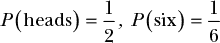

现在我们想知道这两件事同时发生的概率，写成如下形式：

*P*(正面，六点) = ?

我们可以像在第二章中一样计算：我们数出我们关心的结果，并将其除以总结果数。

对于这个例子，假设这些事件是依次发生的。当我们投币时，我们有两个可能的结果，正面和反面，如图 3-1 所示。

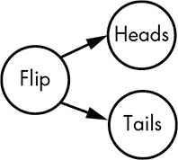

*图 3-1：将投币的两种可能结果可视化为不同路径*

现在，对于每一个可能的投币结果，我们有六种可能的掷骰子结果，如图 3-2 所示。

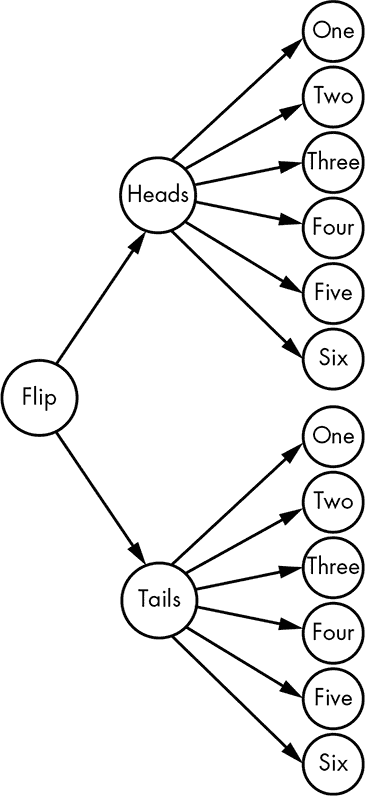

*图 3-2：将投币和掷骰子的可能结果可视化*

使用这个可视化方法，我们可以直接数出可能的解答。投币和掷骰子一共可能有 12 种结果，而我们只关心其中的一种结果，所以：

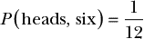

现在我们为这个特定问题找到了一个解决方案。然而，我们真正想要的是一个通用规则，能够帮助我们计算任意数量的概率组合。让我们看看如何扩展我们的解决方案。

#### *应用概率的乘法规则*

我们将使用相同的问题进行这个例子：投币正面朝上并掷出 6 点的概率是多少？首先，我们需要找出投币正面朝上的概率。通过观察我们的分支路径，我们可以计算出在给定概率下有多少条路径分裂开来。我们只关心那些包含正面的路径。因为正面朝上的概率是 1/2，所以我们将一半的可能性排除掉。然后，如果我们只看剩下的正面路径，我们可以看到要获得我们想要的结果：在六面骰子上掷出 6 点的概率是 1/6。在图 3-3 中，我们可以将这个推理过程可视化，并看到只有一个我们关心的结果。

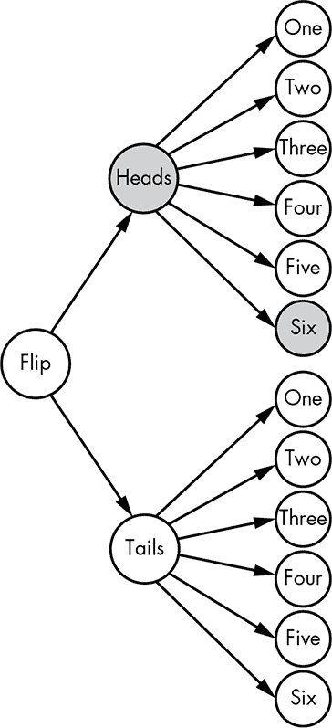

*图 3-3：可视化正面朝上和掷出 6 点的概率*

如果我们将这两个概率相乘，我们可以看到：

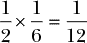

这正是我们之前得到的答案，但我们并没有计算所有可能的事件，而是只计算了我们关心的事件的概率，通过沿着分支进行计算。对于这样一个简单的问题，通过视觉呈现是相当容易的，但展示这个过程的真正价值在于它阐明了一个关于将概率与“且”（AND）结合的通用规则：

*P*(*A*,*B*) = *P*(*A*) × *P*(*B*)

因为我们在相乘结果，也叫做取这些结果的*乘积*，我们称之为概率的*乘积规则*。

这个规则可以扩展以包括更多的概率。如果我们将*P*(*A*,*B*)看作是一个单一的概率，我们可以通过重复这个过程，将其与第三个概率*P*(*C*)结合起来：

*P*(*P*(*A*,*B*),*C*) = *P*(*A*,*B*) × *P*(*C*) = *P*(*A*) × *P*(*B*) × *P*(*C*)

所以我们可以使用乘积法则将无限多的事件组合起来，以得到最终的概率。

#### *示例：计算迟到的概率*

让我们看一个使用乘积法则的例子，这比掷骰子或抛硬币稍微复杂一些。假设你答应和朋友在城对面 4:30 见面喝咖啡，并打算乘坐公共交通工具。现在是 3:30。幸运的是，你所在的车站既有火车也有公交车可以带你去目的地：

+   下一班公交车将在 3:45 到达，并需要 45 分钟才能带你到咖啡店。

+   下一班火车将在 3:50 到达，30 分钟后会把你送到离目的地步行 10 分钟的地方。

火车和公交车都会在 4:30 准时到达。因为时间很紧张，任何延误都会导致你迟到。好消息是，由于公交车比火车早到，如果公交车晚点而火车准时，你仍然可以按时到达。如果公交车准时而火车晚点，你也能按时到达。唯一会导致你迟到的情况是火车和公交车都晚点到达。你如何计算迟到的概率呢？

首先，你需要确定火车晚点和公交车晚点的概率。假设当地的公共交通部门发布了这些数据（在本书后面，你将学会如何从数据中估算这些概率）。

*P*(迟到[火车]) = 0.15

*P*(迟到[公交车]) = 0.2

已发布的数据告诉我们，火车 15%的时间会迟到，公交车 20%的时间会迟到。由于你只有在*火车和公交车都迟到*的情况下才会迟到，因此我们可以使用乘积法则来解决这个问题：

*P*(迟到) = *P*(迟到[火车]) × *P*(迟到[公交车]) = 0.15 × 0.2 = 0.03

尽管公交车或火车迟到的概率相当合理，但它们都迟到的概率要低得多，仅为 0.03。我们也可以说，两者都迟到的概率为 3%。通过这个计算，你可以稍微放松一点，不必那么担心迟到。

### 用 OR 组合概率

逻辑中另一个重要的规则是用 OR 组合概率，以下是一些例子：

+   感冒 或 得流感

+   抛硬币正面朝上 或 投骰子得到 6 点

+   爆胎 或 没油

一个事件或另一个事件发生的概率稍微复杂一些，因为事件可以是互斥的，也可以不是互斥的。如果一个事件发生意味着其他事件不能发生，那么这些事件就是*互斥的*。例如，掷骰子的结果是互斥的，因为一次掷骰子不能同时得到 1 和 6。但是，假设一场棒球比赛如果下雨或教练生病就会取消；这些事件*不是*互斥的，因为完全有可能教练生病并且下雨。

#### *计算互斥事件的 OR 概率*

结合两个事件使用“或”的过程在逻辑上是直观的。如果有人问你：“掷硬币得到正面或反面的概率是多少？”你会回答：“1。”我们知道：

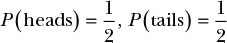

直观地，我们可能会将这些事件的概率相加。我们知道这样做是有效的，因为正面和反面是唯一的可能结果，而所有可能结果的概率必须加起来等于 1。如果所有可能事件的概率加起来不等于 1，那么就会有缺失的结果。那么我们如何知道如果总和小于 1，必定会有缺失的结果呢？

假设我们知道正面概率是*P*(正面) = 1/2，但有人声称反面的概率是*P*(反面) = 1/3。我们还知道，从之前的内容来看，不出现正面的概率必须是：

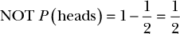

由于不出现正面的概率是 1/2，而声称反面概率只有 1/3，要么缺少了某个事件，要么我们对于反面的概率计算是错误的。

从这里我们可以看出，只要事件是互斥的，我们可以将每个可能事件的概率相加，从而得到任一事件发生的概率，即计算一个事件**或**另一个事件的概率。另一个例子是掷骰子。我们知道掷出 1 的概率是 1/6，掷出 2 的概率也是 1/6：

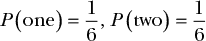

所以我们可以执行相同的操作，将两个概率相加，并看到掷出 1 或 2 的综合概率是 2/6，或者说 1/3：

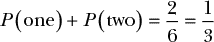

这再次是合乎直觉的。

这个加法规则仅适用于*互斥*事件的组合。从概率学的角度来看，互斥意味着：

*P*(*A*) 和 *P*(*B*) = 0

也就是说，正面和反面同时发生的概率是 0。我们看到这个例子适用：

+   不可能一次投掷一枚硬币既得到正面又得到反面。

+   在一次掷骰子中，不可能同时掷出 1 和 2。

要真正理解如何结合“或”运算的概率，我们需要看看事件*不是*互斥的情况。

#### *使用非互斥事件的加法规则*

继续使用掷骰子和抛硬币的例子，我们来看掷出正面或掷出 6 的概率。许多概率初学者可能天真地认为在这种情况下加法规则也适用。既然我们知道*P*(正面) = 1/2 和 *P*(六) = 1/6，一开始似乎很合理地认为这两事件发生的概率就是 4/6。然而，当我们考虑到掷出正面或掷出小于 6 的数字时，情况就变得明显不对了。因为*P*(小于六) = 5/6，将这些概率加在一起得到 8/6，显然大于 1！由于概率必须介于 0 和 1 之间，这就违反了概率的基本规则，所以我们肯定在某处犯了错误。

问题在于掷出正面和掷出 6 并不是互斥事件。正如我们在本章早些时候所知道的，*P*(正面, 六) = 1/12。因为这两事件同时发生的概率不为 0，所以它们根据定义不是互斥事件。

对于非互斥事件来说，概率加法不起作用的原因是，这样做会重复计算那些两者同时发生的事件。作为重复计算的一个例子，我们来看所有包含正面的掷硬币和掷骰子的结果：

正面 — 1

正面 — 2

正面 — 3

正面 — 4

正面 — 5

正面 — 6

这些结果代表了 12 种可能结果中的 6 种，这是我们所预期的，因为*P*(正面) = 1/2。现在让我们看看所有包含掷出 6 的结果：

正面 — 6

反面 — 6

这些结果代表了 12 种可能结果中的 2 种，将导致我们掷出 6，这也是我们所预期的，因为*P*(六) = 1/6。由于有六种结果满足抛出正面的条件，且有两种满足掷出 6 的条件，我们可能会认为有八种结果代表得到正面或掷出 6。然而，我们会重复计算，因为*正面 — 6*出现在两个列表中。实际上，只有 12 种结果中有 7 种是唯一的。如果我们天真地将*P*(正面)和*P*(六)相加，就会导致重复计算。

为了纠正我们的概率计算，我们必须将所有概率加起来，然后减去两事件同时发生的概率。这就引出了我们用“或”结合非互斥事件概率的规则，称为概率的*和法则*：

*P*(*A*) 或 *P*(*B*) = *P*(*A*) + *P*(*B*) – *P*(*A*,*B*)

我们将每个事件发生的概率相加，然后减去两事件同时发生的概率，以确保我们不会重复计算这些概率，因为它们同时属于*P*(*A*)和*P*(*B*)。因此，使用我们的掷骰子和抛硬币例子，掷出小于 6 的数字或抛出正面的概率是：

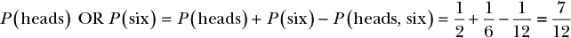

让我们来看一个最终的“或”例子，来真正理解这个概念。

#### *例子：计算收到重罚的概率*

想象一下一个新的情境。你在公路旅行时因为超速被拦下。你意识到自己已经有一段时间没有被拦下了，可能忘记把新注册证或新保险卡放进手套箱。如果这两样东西中有任何一件丢失，你将会收到更贵的罚单。在你打开手套箱之前，你如何给自己赋予一个概率，表示你可能忘记了其中一张卡，并因此收到更高的罚单？

你对自己把注册证放进车里很有信心，所以你给注册证在车里的概率赋值为 0.7。然而，你也相当确定自己把保险卡留在了家里的柜台上，所以你认为新保险卡在车里的几率只有 0.2。因此，我们知道：

*P*(registration) = 0.7

*P*(insurance) = 0.2

然而，这些值是你*确实*把这些东西放进手套箱里的概率。你担心的是它们是否*丢失*。为了计算物品丢失的概率，我们只需要使用否定：

*P*(Missing[reg]) = 1 – *P*(registration) = 0.3

*P*(Missing[ins]) = 1 – *P*(insurance) = 0.8

如果我们试图使用加法法则，而不是完整的加法规则来计算联合概率，我们会看到我们的概率大于 1：

*P*(Missing[reg]) + *P*(Missing[ins]) = 1.1

这是因为这些事件是非互斥的：完全有可能你两张卡都忘了。因此，使用这种方法我们会重复计算。也就是说，我们需要找出两张卡都丢失的概率，这样我们才能减去它。我们可以使用乘积法则来做到这一点：

*P*(Missing[reg], Missing[ins]) = 0.24

现在我们可以使用加法法则来确定其中一张卡丢失的概率，就像我们计算掷硬币正面朝上或掷骰子得到 6 点的概率一样：

*P*(Missing) = *P*(Missing[reg]) + *P*(Missing[ins]) – *P*(Missing[reg], Missing[ins]) = 0.86

在手套箱中有 0.86 的概率丢失某一重要文件，你应该在迎接警察时表现得格外友好！

### 总结

在这一章中，你通过添加“与”运算和“或”运算结合概率的规则，开发出了一个完整的不确定性逻辑。让我们回顾一下到目前为止我们所覆盖的逻辑规则。

在第二章中，你学到概率是按 0 到 1 的尺度来衡量的，0 表示*假*（肯定不会发生），而 1 表示*真*（肯定会发生）。接下来的重要逻辑规则涉及将两个概率通过“与”运算结合起来。我们使用乘积法则，它简单地指出，要计算两个事件同时发生的概率 *P*(*A*) 和 *P*(*B*)，只需要将它们相乘：

*P*(*A*,*B*) = *P*(*A*) × *P*(*B*)

最后的规则涉及通过求和规则来合并概率。求和规则的难点在于，如果我们加上了非互斥的概率，就会对同时发生的情况进行重复计算，因此必须减去两者同时发生的概率。求和规则通过乘积规则来解决这个问题（记住，对于互斥事件，*P*(*A*, *B*) = 0）：

*P*(*A* OR *B*) = *P*(*A*) + *P*(*B*) – *P*(*A*,*B*)

这些规则，以及第二章中涉及的规则，使我们能够表达广泛的概率问题。在本书的剩余部分，我们将以这些规则为基础进行概率推理。

### 练习

尝试回答以下问题，确保你理解概率逻辑规则的应用。解答可以在 *[`nostarch.com/learnbayes/`](https://nostarch.com/learnbayes/)* 找到。

1.  在一次 20 面骰的投掷中，连续三次掷到 20 的概率是多少？

1.  天气预报说明天有 10%的降雨几率，而你出门时有一半的机会忘带雨伞。那么你明天在没有带伞的情况下遇到雨的概率是多少？

1.  生鸡蛋有 1/20,000 的概率含有沙门氏菌。如果你吃了两个生鸡蛋，吃到含有沙门氏菌的生鸡蛋的概率是多少？

1.  在两次投掷硬币时翻到两个正面，或者在三次六面骰掷骰时掷到三个 6 的概率是多少？
