## **创建一个二项概率分布**


在第三章中，你学习了与常见逻辑运算符：与（AND）、或（OR）和非（NOT）对应的一些基本概率规则。在本章中，我们将使用这些规则构建我们的第一个*概率分布*，一种描述所有可能事件及其发生概率的方式。概率分布通常通过可视化来帮助更广泛的观众理解统计学。我们将通过定义一个*泛化*特定概率问题组的函数来得到我们的概率分布，这意味着我们将创建一个分布来计算一系列情境的概率，而不仅仅是某个特定的案例。

我们通过观察每个问题的共性元素并将其抽象化来进行泛化。统计学家使用这种方法来使解决各种问题变得更加容易。当问题非常复杂，或者一些必要的细节可能未知时，这种方法尤其有用。在这些情况下，我们可以使用已知的概率分布作为我们无法完全理解的现实世界行为的估计。

概率分布对于提出关于可能值范围的问题也非常有用。例如，我们可能会使用概率分布来确定一个顾客年收入在 30,000 到 45,000 美元之间的概率，成人身高超过 6 英尺 10 英寸的概率，或者访问某个网页的用户中，25%到 35%的人会注册账户的概率。许多概率分布涉及非常复杂的方程，可能需要一些时间才能习惯。然而，所有的概率分布方程都是从前面章节中涵盖的基本概率规则推导出来的。

### 二项分布的结构

你将在这里学习的分布是*二项分布*，用于计算在给定试验次数和成功结果的概率下，某个成功结果出现的概率。术语*二项*中的“bi”指的是我们关心的两种可能结果：事件发生和事件*不*发生。如果有超过两种结果，则该分布称为*多项式分布*。遵循二项分布的示例问题包括：

+   在三次掷硬币中掷出两次正面

+   购买 100 万张彩票并至少中一次

+   在 10 次掷 20 面骰子中掷出少于三个 20

这些问题都具有相似的结构。事实上，所有二项分布都涉及三个*参数*：

***k*** 我们关心的结果数

***n*** 总试验次数

***p*** 事件发生的概率

这些参数是我们分布的输入。例如，当我们计算在三次掷硬币中出现两次正面的概率时：

+   *k* = 2，我们关心的事件数，在此例中为翻到正面

+   *n* = 3，硬币投掷的次数

+   *p* = 1/2，投掷硬币时翻到正面的概率

我们可以构建一个二项式分布来泛化这种类型的问题，从而轻松解决任何涉及这三个参数的问题。表达此分布的简写符号如下：

*B*(*k*;*n*, *p*)

对于三个硬币投掷的例子，我们可以写作 *B*(2; 3, 1/2)。其中 *B* 是 *二项式* 分布的简称。注意，*k* 与其他参数之间用分号分隔。这是因为当我们讨论一个值的分布时，通常关注的是固定 *n* 和 *p* 下所有 *k* 的值。因此，*B*(*k*; *n*, *p*) 表示我们分布中的每一个值，但整个分布通常仅用 *B*(*n*, *p*) 来表示。

让我们更仔细地看看，看看如何构建一个函数，使我们能够将所有这些问题泛化到二项式分布中。

### 理解并抽象化我们问题的细节

看到如何通过创建分布来简化概率计算是最好的方法之一，首先从一个具体的例子入手并尝试解决它，然后抽象出尽可能多的变量。我们将继续以计算三次硬币投掷中翻到两个正面的概率为例。

由于可能的结果数量较小，我们可以仅通过纸和笔快速计算出我们关心的结果。在三次投掷中有三种可能的结果是两个正面：

HHT，HTH，THH

现在，可能会有冲动通过列举所有其他可能的结果并将我们关心的结果数除以可能结果的总数（在此例中为 8）来解决这个问题。这种方法对于仅仅解决这个问题是可行的，但我们在这里的目标是解决任何涉及从若干次试验中期望一组结果的概率问题。如果我们不进行泛化，而只解决这个问题实例，那么改变这些参数将意味着我们必须重新解决新的问题。例如，仅仅问，“在 *四* 次硬币投掷中获得两个正面的概率是多少？”就意味着我们需要提出另一个独特的解决方案。相反，我们将使用概率规则来推理这个问题。

为了开始泛化，我们将把这个问题分解成可以立即解决的小部分，并将这些部分转化为可管理的方程式。在构建方程时，我们将它们结合起来创建一个二项式分布的通用函数。

首先需要注意的是，我们关心的每一个结果将具有 *相同* 的概率。每个结果只是其他结果的 *排列*，或重新排序：

*P*({正面，正面，反面}) = *P*({正面，反面，正面}) = *P*({反面，正面，正面})

由于这一点，我们将简单地称之为：

*P*(期望结果)

有三个结果，但只有一个可能发生，我们不关心是哪一个。而且由于只有一个结果可能发生，我们知道这些结果是互斥的，表示为：

*P*({正面，正面，反面},{正面，反面，正面},{反面，正面，正面}) = 0

这使得使用概率的加法规则变得简单。现在我们可以将其总结为：

*P*({正面，正面，反面} 或 {正面，反面，正面} 或 {反面，正面，正面}) = *P*(期望结果) + *P*(期望结果) + *P*(期望结果)

当然，把这三者加起来就等于：

3 × *P*(期望结果)

我们已经找到了一个简洁的方式来表示我们关心的结果，但就推广而言，问题在于值 3 是特定于此问题的。我们可以通过简单地将 3 替换为一个叫做*N*[结果]的变量来解决这个问题。这样，我们得到了一个相当不错的推广：

*B*(*k*;*n*, *p*) = *N*[结果] × *P*(期望结果)

现在我们需要解决两个子问题：如何计算我们关心的结果数量，以及如何确定单个结果的概率。一旦我们弄清楚这些问题，就大功告成了！

### 使用二项系数计数我们的结果

首先，我们需要弄清楚给定的*k*（我们关心的结果）和*n*（试验次数）有多少种结果。对于小的数字，我们可以简单地进行计数。如果我们看四次正面出现在五次抛硬币中的情况，我们知道我们关心的结果有五种：

HHHHT, HTHHH, HHTHH, HHHTH, HHHHT

但这并不需要太长时间就变得难以手动完成——例如，“在三次掷骰子中掷出两个 6 点的概率是多少？”

这仍然是一个二项问题，因为只有两个可能的结果：掷出 6 点或未掷出 6 点，但有更多事件可以算作“未掷出 6 点”。如果我们开始列举，很快就会发现，这对一个仅涉及三次骰子投掷的小问题来说也变得繁琐：

6 – 6 – 1

6 – 6 – 2

6 – 6 – 3

. . .

4 – 6 – 6

. . .

5 – 6 – 6

. . .

很明显，列举所有可能的解法对于即使是相对简单的问题也无法扩展。解决方案是组合数学。

#### *组合数学：使用二项系数进行高级计数*

如果我们查看一个叫做*组合数学*的数学领域，我们可以对这个问题有些见解。这只是一个高级计数的名称。

在组合数学中，有一个特殊的运算，叫做*二项系数*，它表示计算从*n*中选择*k*的方式数量——也就是从总试验次数中选择我们关心的结果。二项系数的表示法如下：

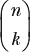

我们读这个表达式为“*n*选择*k*”。所以，对于我们的例子，“在三次掷骰子中选择两个正面”的表示方式是：

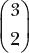

这个运算的定义是：

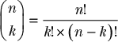

！表示 *阶乘*，它是从 1 到包含符号“！”之前所有数字的积，因此 5! = (5 × 4 × 3 × 2 × 1)。

大多数数学编程语言使用 `choose()` 函数表示二项式系数。例如，在数学语言 R 中，我们可以使用以下调用来计算三次抛硬币中出现两个正面的二项式系数：

```
choose(3,2)

>>3
```

通过这种通用的运算方式来计算我们关心的结果数，我们可以像这样更新我们的通用公式：

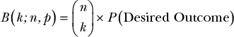

回想一下，*P*(期望结果) 是在三次抛硬币中获得两个正面的所有组合的概率。在前面的方程中，我们将这个值作为占位符使用，但我们实际上并不知道如何计算这个值。我们拼图中的唯一缺失部分是求解 *P*(单一结果)。之后，我们将能够轻松推广到一个完整的问题类别！

#### *计算期望结果的概率*

我们需要弄清楚的就是 *P*(期望结果)，即我们关心的所有可能事件的概率。到目前为止，我们一直将 *P*(期望结果) 作为一个变量来帮助组织我们对这个问题的解答，但现在我们需要确切知道如何计算这个值。让我们看看五次抛硬币中出现两个正面的概率。我们将专注于符合此条件的单一结果：HHTTT。

我们知道，在单次抛硬币中，正面朝上的概率是 1/2，但为了推广这个问题，我们将其表示为 *P*(正面)，这样我们就不会被固定的概率值限制住。利用上一章的乘积法则和否定法则，我们可以将这个问题描述为：

*P*(正面, 正面, 不是正面, 不是正面, 不是正面)

或者，更冗长地说：“抛出正面，正面，非正面，非正面，非正面的概率。”

否定法则告诉我们，“不是正面”可以表示为 1 – *P*(正面)。然后，我们可以使用乘积法则来解决其余部分：

*P*(正面, 正面, 不是正面, 不是正面, 不是正面) = *P*(正面) × *P*(正面) × (1 – *P*(正面)) × (1 – *P*(正面)) × (1 – *P*(正面))

让我们通过使用指数来简化乘法运算：

*P*(正面)² × (1 – *P*(正面))³

如果我们把这些都结合起来，我们可以看到：

(五次抛硬币中有两个正面) = *P*(正面)² × (1 – *P*(正面))³

你可以看到，*P*(正面)² 和 1 – *P*(正面)³ 的指数正好是该情景中正面和非正面的数量。这些等同于 *k*，我们关心的结果数，以及 *n* – *k*，即实验次数减去我们关心的结果数。我们可以将所有这些结合起来，创建一个更加通用的公式，消除特定于此案例的数字：

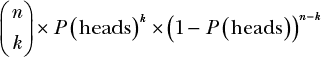

现在让我们将其推广到任何概率，而不仅仅是正面，通过将*P*(正面)替换为*p*。这样我们就得到了*k*的通用解，即我们关心的结果数；*n*，实验次数；以及*p*，单个结果的概率：

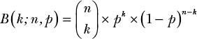

现在我们有了这个方程，就可以解决任何与抛硬币结果相关的问题。例如，我们可以计算 24 次抛硬币中恰好得到 12 个正面的概率，计算方法如下：

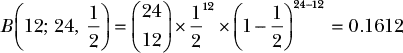

在你学习二项分布之前，解决这个问题会困难得多！

这个公式是二项分布的基础，称为*概率质量函数（PMF）*。名称中的*质量*部分来源于我们可以使用它来计算任何给定*k*值的概率大小，使用固定的*n*和*p*，因此这就是我们概率的“质量”。

例如，我们可以将 10 次抛硬币中所有可能的*k*值代入我们的概率质量函数（PMF）并可视化所有可能值下的二项分布，如图 4-1 所示。

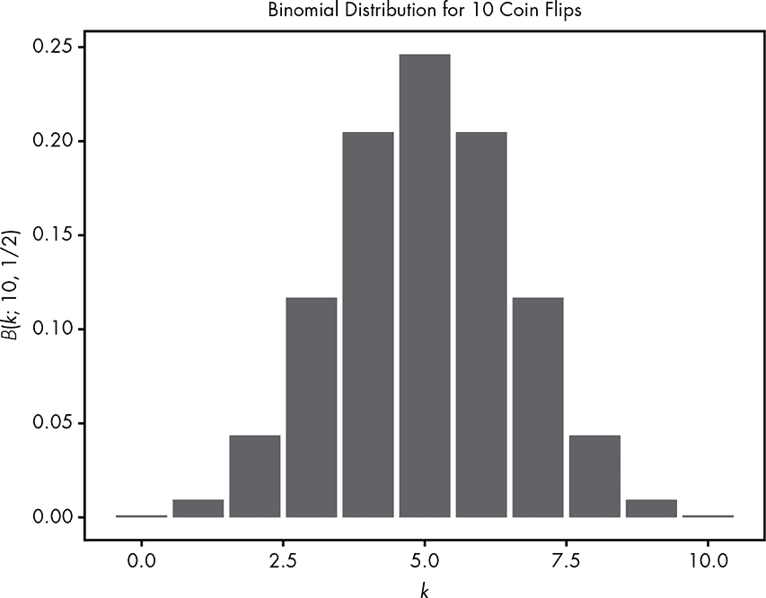

*图 4-1：条形图显示了在 10 次抛硬币中得到* k *的概率*

我们还可以查看相同的分布，了解在掷一个六面骰子 10 次时得到 6 的概率，如图 4-2 所示。

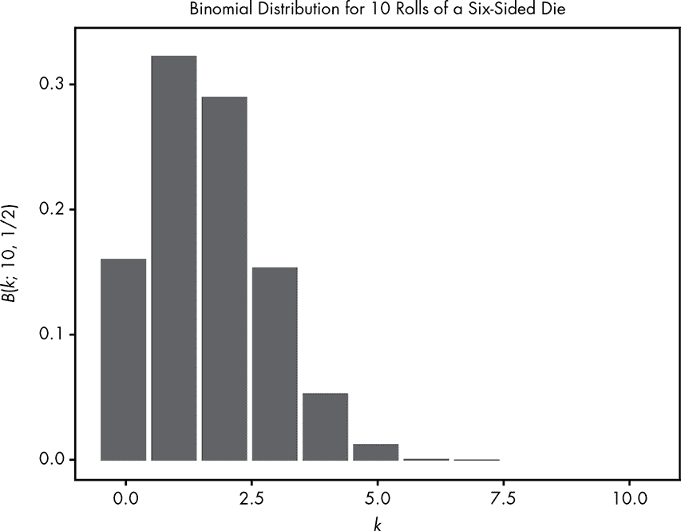

*图 4-2：掷一个六面骰子 10 次得到 6 的概率*

如你所见，概率分布是一种概括整个问题类别的方法。现在我们已经有了分布，我们就拥有了一种强大的方法来解决广泛的问题。但请始终记住，我们是根据简单的概率规则推导出这个分布的。让我们来验证一下。

### 示例：抽卡游戏

*抽卡游戏*是一种特别在日本流行的手机游戏类型，玩家可以用游戏内货币购买虚拟卡片。问题在于所有卡片都是随机发放的，因此当玩家购买卡片时，他们无法选择收到哪张卡片。由于并非所有卡片都同样有吸引力，玩家会被鼓励继续从卡堆中抽卡，直到抽到他们想要的卡片，这种玩法与老虎机类似。我们将看到二项分布如何帮助我们在一个虚拟的抽卡游戏中决定是否承担某个风险。

这是一个情境。你有一款新的手机游戏，*贝叶斯战士*。当前你可以从中抽取的卡池称为*卡池*。卡池中包含一些普通卡片和一些价值更高的特色卡片。正如你可能猜到的，*贝叶斯战士*中的所有卡片都是著名的概率学家和统计学家。这个卡池中的顶级卡片如下，每张卡片都有其相应的抽中概率：

+   Thomas Bayes: 0.721%

+   E. T. Jaynes: 0.720%

+   Harold Jeffreys: 0.718%

+   Andrew Gelman: 0.718%

+   John Kruschke: 0.714%

这些特色卡片只占总概率的 0.03591。由于概率总和必须为 1，抽到那些不太受欢迎的卡片的机会就是另外的 0.96409。此外，我们将从中抽取的卡片堆视为几乎无限大，这意味着抽取一张特定卡片不会改变抽到其他卡片的概率——你抽到的卡片不会从卡片堆中消失。这与从一副未洗牌的实体卡牌中抽取卡片的情况不同。

你真的想要得到 E. T. Jaynes 卡片，以完成你的精英贝叶斯团队。不幸的是，你需要购买游戏内货币——贝叶斯币，才能抽卡。抽一张卡需要花费一枚贝叶斯币，但现在有一个特别优惠，允许你以仅 10 美元购买 100 枚贝叶斯币。这是你愿意在这款游戏上花费的最大金额，*仅仅*在你至少有 50%的机会抽到你想要的卡片时才会购买。这意味着你只有在获得那张精彩的 E. T. Jaynes 卡的概率大于或等于 0.5 时，才会购买贝叶斯币。

当然，我们可以将获得 E. T. Jaynes 卡的概率代入我们的二项分布公式中，看看结果如何：

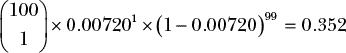

我们的结果小于 0.5，因此我们应该放弃。但等等——我们忘记了一件非常重要的事情！在前面的公式中，我们计算的只是得到*恰好一张*E. T. Jaynes 卡的概率。但我们可能会抽到两张 E. T. Jaynes 卡，甚至三张！所以我们真正想知道的是得到一张或更多张的概率。我们可以将其写成：

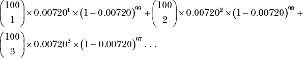

以此类推，对于你可以用贝叶斯币抽取的 100 张卡片，但这个过程会变得非常繁琐，因此我们使用了特殊的数学符号Σ（希腊字母大写 Sigma）：

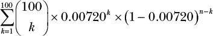

Σ是求和符号；底部的数字表示我们开始的值，顶部的数字表示我们结束的值。所以，前面的方程式实际上是对每个从 1 到*n*的*k*值，使用*p*为 0.00720 的二项分布进行求和。

我们已经使得写下这个问题变得更简单，但现在我们需要实际计算这个值。与其拿出计算器解决这个问题，现在正是开始使用 R 语言的好时机。在 R 中，我们可以使用`pbinom()`函数自动求和我们 PMF 中所有*k*的值。图 4-3 展示了如何使用`pbinom()`来解决我们的具体问题。

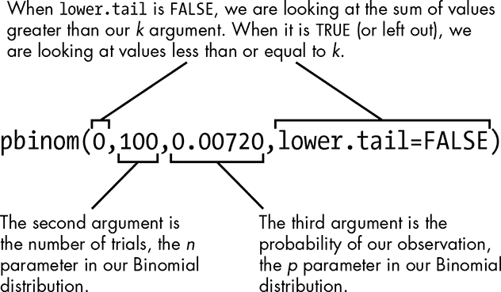

*图 4-3：使用 pbinom()函数解决我们的*贝叶斯战士*问题*

`pbinom()`函数需要三个必选参数和一个可选的第四个参数`lower.tail`（默认为`TRUE`）。当第四个参数为`TRUE`时，第一个参数会计算所有*小于或等于*该参数的概率。当`lower.tail`设置为`FALSE`时，它会计算*严格大于*第一个参数的概率。通过将第一个参数设置为`0`，我们是在计算获得一个或多个 E. T. Jaynes 卡片的概率。我们将`lower.tail`设置为`FALSE`，因为这意味着我们希望得到大于第一个参数的值（默认情况下，我们得到的是小于第一个参数的值）。下一个值表示*n*，即试验次数，第三个参数表示*p*，即成功的概率。

如果我们将我们的数字代入，并如图 4-3 所示，将`lower.tail`设置为`FALSE`，R 将为你的 100 贝叶斯币计算出获得*至少一个*E. T. Jaynes 卡片的概率：

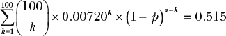

尽管获得*恰好一个*E. T. Jaynes 卡片的概率只有 0.352，但获得*至少一个*E. T. Jaynes 卡片的概率足够高，值得一试。所以，花 10 美元完成你的精英贝叶斯学者卡片收藏吧！

### 总结

在本章中，我们看到可以通过使用概率规则（结合组合学中的一个技巧）创建一个通用规则，解决一个类别的问题。任何涉及想要确定在*n*次试验中出现*k*次结果的概率的问题，其中结果的概率为*p*，我们都可以通过二项分布轻松解决：

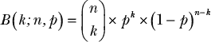

可能令人惊讶的是，这条规则实际上只涉及计数和应用我们的概率规则。

### 练习

尝试回答以下问题，以确保你完全掌握了二项分布。解答可以在*[`nostarch.com/learnbayes/`](https://nostarch.com/learnbayes/)*找到。

1.  如果我们掷 12 次 20 面骰子，求掷出 1 或 20 的概率，二项分布的参数是什么？

1.  一副 52 张的扑克牌中有四张王牌。如果你抽一张牌，放回去再洗牌，接着再抽一张牌，那么在五次抽牌中，只有一张王牌的抽取方式有多少种？

1.  对于问题 2 中的例子，在 10 次抽牌中抽到 5 张王牌的概率是多少（记得每次抽牌后将卡片放回并洗牌）？

1.  当你在找工作时，拥有多个工作机会总是有帮助的，这样你可以在谈判中使用它们。如果你在面试时有 1/5 的机会收到工作邀请，而你一个月内面试了七家公司，那么到月底你至少会收到两个竞争性邀请的概率是多少？

1.  你收到了大量招聘人员的电子邮件，并发现自己在接下来的一个月内安排了 25 场面试。不幸的是，你知道这样会让你精疲力尽，如果你很累，拿到 offer 的概率将降到 1/10。除非你至少有两倍的机会获得至少两个竞争 offer，否则你真的不想去参加这么多面试。如果你参加 25 场面试，还是只参加 7 场，你更有可能获得至少两个 offer？
