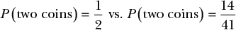
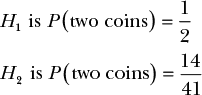
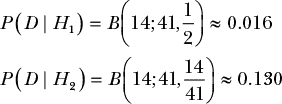
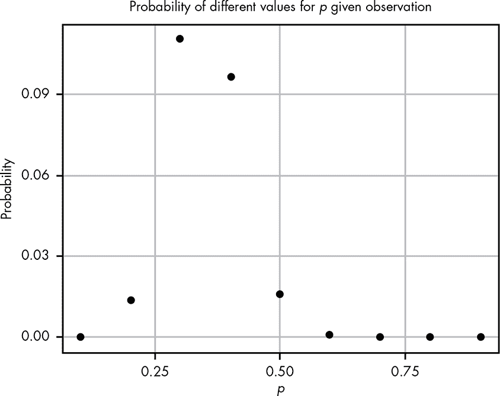
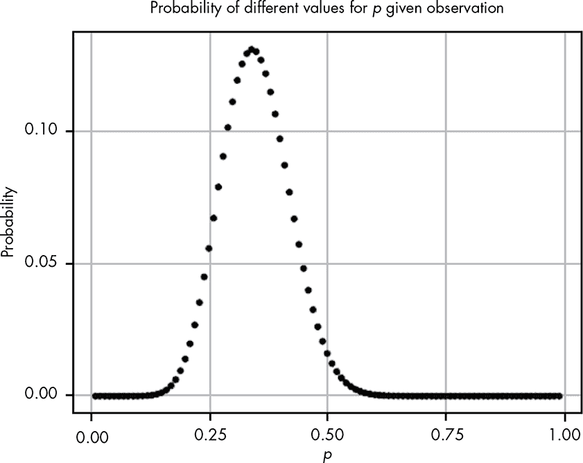
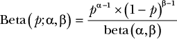
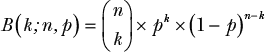
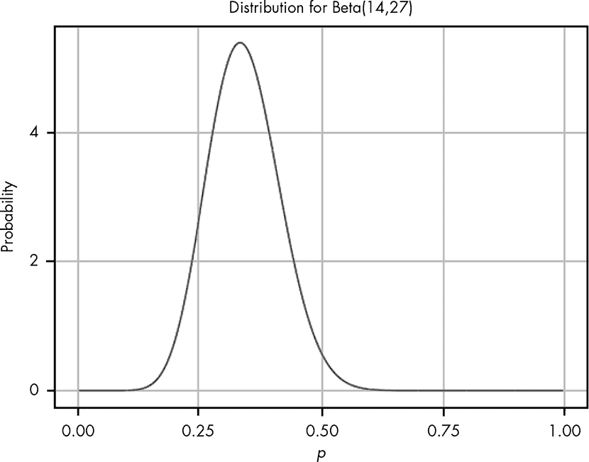
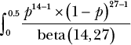
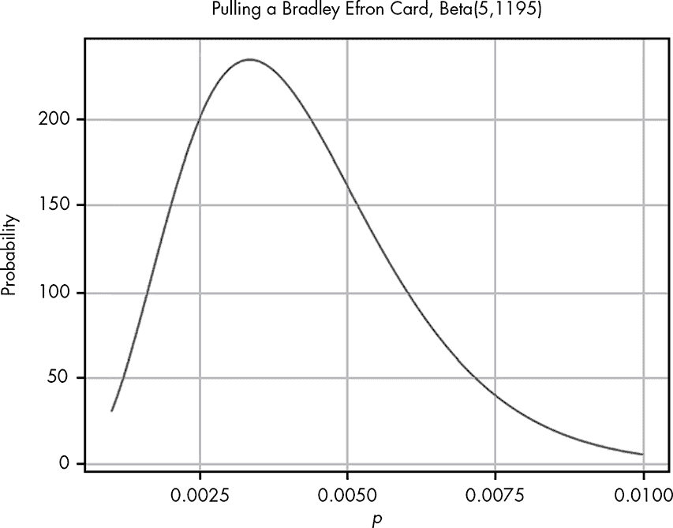

## 贝塔分布**


本章建立在前一章二项分布的基础上，介绍了另一种概率分布——*贝塔分布*。你使用贝塔分布来估算一个事件的概率，前提是你已经观察到了一些试验和成功结果的数量。例如，你可以用它来估算掷硬币时正面朝上的概率，如果到目前为止你已经观察了 100 次投掷，其中有 40 次是正面朝上。

在探索贝塔分布的过程中，我们还将研究概率与统计的区别。在许多概率学的教材中，我们通常会显式地给出事件的概率。然而，在现实生活中，这种情况是非常罕见的。相反，我们通常得到的是数据，然后用这些数据来估算概率。这就是统计学的作用：它允许我们利用数据来估算我们正在处理的概率。

### 一个奇怪的情景：获取数据

这是本章的情景。一天，你走进了一家好奇心商店。店主向你打招呼，在你浏览了一会儿后，他问你有没有什么特别想看的东西。你回答说，想看看他有的最奇怪的东西。他笑了笑，从柜台后面拿出一样东西。你接过一个黑色的盒子，差不多是魔方的大小，似乎异常沉重。你感到好奇，问：“它是做什么的？”

店主指出盒子顶部有一个小缝隙，底部也有一个。“如果你把一个 25 美分硬币放入顶部，”他说，“有时候会有两个从底部出来！”你很兴奋地想试试看，便从口袋里拿出一个硬币放进去。你等待了一会儿，但什么也没发生。然后店主说：“有时候它会吞掉你的硬币。我这个东西已经用了很久了，至今我从没见过它硬币用完或者满到无法再放进去！”

对此感到困惑，但又急于运用新学的概率技能，你问：“拿到两个硬币的概率是多少？”店主困惑地回答：“我不知道。正如你所看到的，这只是一个黑色的盒子，没有说明书。我只知道它的表现。有时你会拿到两个硬币，有时它会吞掉你的硬币。”

#### *区分概率、统计与推理*

尽管这是一个稍显不寻常的日常问题，但它实际上是一个极为常见的概率问题。在到目前为止的所有例子中，除了第一章，我们都知道所有可能事件的概率，或者至少知道我们愿意对它们下注的多少。在现实生活中，我们几乎从未确定任何事件的确切概率；相反，我们只有观察和数据。

这通常被视为概率与统计学之间的划分。在概率论中，我们完全知道所有事件发生的概率，我们关心的是某些观察结果的可能性。例如，我们可能被告知公平掷硬币正面朝上的概率是 1/2，然后想知道 20 次掷硬币中恰好出现 7 次正面朝上的概率。

在统计学中，我们会倒过来看这个问题：假设你观察到 20 次掷硬币中有 7 次正面朝上，那么得到正面朝上的概率是多少？如你所见，在这个例子中，我们并不知道概率是什么。从某种意义上讲，统计学就是概率的反向过程。根据数据推算概率的任务叫做*推断*，它是统计学的基础。

#### *收集数据*

统计推断的核心是数据！到目前为止，我们只从这个奇怪的盒子里获取了一个样本：你投了一枚硬币，没有任何回报。此时我们所知道的只是丢失钱币的可能性。店主说你可以赢，但我们还不确定这一点。

我们想要估计神秘盒子返还两个硬币的概率，为此，我们首先需要观察你在多次尝试后获胜的频率。

店主告诉你，他和你一样好奇，愿意慷慨捐赠一卷硬币——包含价值 10 美元的硬币，即 40 枚硬币——前提是你把任何获胜的硬币归还给他。你投了一枚硬币，结果高兴地发现又弹出了两枚硬币！现在我们有了两条数据：神秘盒子确实有时会付出奖励，有时也会吞掉硬币。

根据我们的两次观察，一次是你失去了硬币，另一次是你赢了，你可能天真地猜测*P*(两个硬币) = 1/2。但由于我们的数据非常有限，仍然有一系列的概率我们可以考虑，作为这个神秘盒子返还两个硬币的真实速率。为了收集更多数据，你将使用卷中的其余硬币。最终，包括你第一次投入的硬币，你得到：

14 次获胜

27 次失败

如果不做进一步分析，你可能直观地想更新你的猜测，将*P*(两个硬币) = 1/2 更新为*P*(两个硬币) = 14/41。但你的原始猜测呢——你的新数据是否意味着 1/2 是不可能的真实概率？

#### *计算概率的概率*

为了帮助解决这个问题，我们来看一下两种可能的概率。这些只是我们关于神奇盒子返还两个硬币的速率的假设：



为了简化，我们将给每个假设分配一个变量：



直观上，大多数人会说*H*[2]更有可能，因为这正是我们观察到的，但我们需要通过数学证明这一点来确保。

我们可以从每个假设解释我们所看到的情况的角度来看待这个问题，简单来说：“如果*H*[1]为真，与*H*[2]为真相比，我们观察到的现象的概率有多大？”事实证明，我们可以使用第四章中的二项分布轻松计算这一点。在这种情况下，我们知道*n* = 41，*k* = 14，暂时假设*p* = *H*[1]或*H*[2]。我们将*D*作为数据的变量。当我们将这些数字代入二项分布时，我们得到以下结果（回想一下，你可以使用第四章中的二项分布公式来进行计算）：



换句话说，如果*H*[1]为真且得到两个硬币的概率是 1/2，那么在 41 次试验中观察到 14 次得到两个硬币的概率大约是 0.016。然而，如果*H*[2]为真且从盒子中得到两个硬币的真实概率是 14/41，那么观察到相同结果的概率大约是 0.130。

这告诉我们，鉴于数据（在 41 次试验中观察到 14 次得到两个硬币），*H*[2]的可能性几乎是*H*[1]的 10 倍！然而，它也表明，任何一个假设都不是*不可能*的，当然，也有很多其他假设我们可以基于数据提出。例如，我们可能会将数据解读为*H*[3] *P*(两个硬币) = 15/42。如果我们想寻找一个模式，我们也可以选择从 0.1 到 0.9 的每一个概率，按 0.1 的增量进行计算；在每个分布中计算观察到的数据的概率；并由此发展我们的假设。图 5-1 展示了在后一种情况下每个值的样子。



*图 5-1：关于获取两个硬币概率的不同假设的可视化*

即使有这么多假设，我们也无法覆盖所有可能的结果，因为我们并不是在处理有限数量的假设。所以让我们通过测试更多的分布来获取更多的信息。如果我们重复上一个实验，从 0.01 开始，按 0.01 的增量测试每一个可能性，一直到 0.99，得到的结果如图 5-2 所示。



*图 5-2：当我们查看更多假设时，我们看到一个明确的模式正在出现。*

我们可能无法测试所有可能的假设，但很明显，已经出现了一个模式：我们看到的某些东西看起来像是一个分布，代表我们认为黑盒子的行为。

这看起来是有价值的信息；我们可以很容易地看到概率最高的地方。然而，我们的目标是建模我们对所有可能假设的信念（即我们信念的完整概率分布）。但我们的方法还有两个问题。首先，由于有无限多的可能假设，通过越来越小的增量来递增并不能准确地表示所有可能性——我们总是遗漏了无限多的部分。在实践中，这不是一个大问题，因为我们通常不关心像 0.000001 和 0.0000011 这样的极端值，但如果我们能更准确地表示这一无限的可能范围，数据会更有用。

其次，如果你仔细观察图表，可能会注意到一个更大的问题：现在有至少 10 个点在 0.1 之上，而我们还有无穷多个点要添加。这意味着我们的概率*加起来不等于 1*！根据概率规则，我们知道所有可能假设的概率必须加起来为 1。如果它们不等，说明有些假设没有被涵盖。如果加起来大于 1，那就违反了概率必须在 0 到 1 之间的规则。尽管这里有无穷多的可能性，我们仍然需要它们加起来为 1。这就是贝塔分布的作用。

### 贝塔分布

为了解决这两个问题，我们将使用贝塔分布。不同于二项分布，它把离散值分解得很好，贝塔分布表示的是连续范围的值，这使我们能够表示出我们可能的无限假设。

我们通过*概率密度函数（PDF）*来定义贝塔分布，这与我们在二项分布中使用的概率质量函数非常相似，但它是为连续值定义的。以下是贝塔分布的 PDF 公式：



现在这个公式看起来比我们二项分布的公式更加可怕！但其实它并没有那么不同。我们不会像构建概率质量函数那样完全从头开始构建这个公式，而是先分析一下这里发生的事情。

#### *解析概率密度函数*

首先来看一下我们的参数：*p*、α（小写希腊字母阿尔法）和β（小写希腊字母贝塔）。

***p*** 表示事件发生的概率。这对应于我们关于黑箱的不同假设，表示可能的概率。

**α** 表示我们观察到一个我们关心的事件的次数，例如从箱子里得到两个硬币。

**β** 表示我们关心的事件*没有*发生的次数。在我们的例子中，这是黑箱吃掉硬币的次数。

总的试验次数是α + β。这与二项分布不同，后者中我们关注的是*k*个观测值，以及有限的*n*次总试验。

PDF 函数的顶部部分应该看起来很熟悉，因为它几乎与二项分布的概率质量函数（PMF）相同，如下所示：



在 PDF 中，与*p^k* × (1 – *p*)^(*n*–*k*)不同，我们有*p*^(α–1) × (1 – *p*)^(β–1)，在这里我们从指数项中减去 1。我们方程的分母中还有另一个函数：*beta*函数（注意是小写），即贝塔分布的名称来源。我们从指数中减去 1，并使用贝塔函数来*归一化*我们的值——这一部分确保我们的分布总和为 1。贝塔函数是从 0 到 1 的积分，即*p*^(α–1) × (1 – *p*)^(β–1)。我们将在下一节讨论积分，但你可以将其理解为当*p*是介于 0 和 1 之间的每个数字时，所有可能的*p*^(α–1) × (1 – *p*)^(β–1)的总和。关于如何通过从指数中减去 1 并通过贝塔函数除以来归一化我们的值的讨论超出了本章的范围；现在，你只需要知道这能让我们的值总和为 1，从而给我们一个可操作的概率。

最终我们得到的是一个函数，用来描述在已观察到α个一种结果和β个另一种结果的情况下，我们对于从箱子中得到两个正面朝上的硬币的真实信念的每个可能假设的概率。记住，我们通过比较不同二项分布（每个分布都有自己的概率*p*）如何描述我们的数据，从而得到了贝塔分布。换句话说，贝塔分布表示所有可能的二项分布如何描述观察到的数据。

#### *将概率密度函数应用于我们的问题*

当我们将黑盒子数据的值代入并可视化贝塔分布时，如图 5-3 所示，我们看到它看起来像图 5-2 中图形的平滑版本。这说明了 Beta(14,27)的 PDF。



*图 5-3：可视化我们关于黑盒子数据的贝塔分布*

如你所见，大部分图形的密度小于 0.5，这符合预期，因为我们的数据表明，放入黑盒子中的四分之一硬币中，少于一半返回了两个正面朝上的硬币。

图表还显示了，黑色箱子至少在一半时间内返回两个硬币的可能性非常小，而这正是我们持续投币时实现盈亏平衡的临界点。我们已经搞清楚了，通过这个箱子，我们更有可能亏钱而不是赚钱，同时又不会丢掉太多硬币。虽然我们可以通过查看图表来看到我们的信念分布，但我们仍然希望能够量化我们对“箱子返回两个硬币的真实概率小于 0.5”的信念有多强。为此，我们只需要一点微积分（和一些 R 语言）。

#### *通过积分量化连续分布*

贝塔分布与二项分布的根本不同在于，二项分布中我们关注的是*k*，即我们关心的结果的数量，它总是一个可以计数的值。而贝塔分布则关注的是*p*，它有无限多个可能的值。这就引出了一个有趣的问题，如果你以前学过微积分，可能会觉得这个问题很熟悉（但如果没有学过也没关系！）。对于我们举的α=14 和β=27 的例子，我们想知道：得到两个硬币的机会是 1/2 的概率是多少？

虽然在二项分布中，由于其有限的结果数量，我们很容易问出某个具体值的概率，但在连续分布中这是一个非常棘手的问题。我们知道概率的基本规则是所有值的总和必须为 1，但每一个具体值的概率是*无限*小的，这意味着实际上任何具体值的概率都是 0。

如果你对微积分中的连续函数不熟悉，这可能显得有些奇怪，简单解释一下：这是由无限多个小块组成的事物所带来的逻辑结果。例如，假设你把一块 1 磅重的巧克力（挺大的！）分成两块，那么每一块的重量就是 1/2 磅。如果你将其分成 10 块，每块的重量就是 1/10 磅。随着你将巧克力分成越来越多的块，每一块变得如此之小，以至于你根本看不见它。对于将巧克力分成无限多块的情况，最终这些块就会消失！

虽然单独的小块消失了，但我们仍然可以谈论区间。例如，即使我们将 1 磅重的巧克力分成无限多块，我们仍然可以计算巧克力一半的重量。同样，在讨论连续分布的概率时，我们也可以求出某些区间的概率和。但如果每一个具体的值的概率是 0，那么总和不也是 0 吗？

这就是微积分派上用场的地方：在微积分中，有一种叫做*积分*的特殊方法，用来求和无限小的值。如果我们想知道盒子返回硬币的概率是否小于 0.5（也就是说，值介于 0 和 0.5 之间），我们可以这样求和：



如果你对微积分有些生疏，拉长的*S*是连续函数的等价物，用于离散函数的∑。它只是表达我们想要将函数中的所有小部分加总起来的一种方式（参见附录 B 了解微积分基本原理的快速概述）。

如果这些数学看起来让你感到害怕，别担心！我们会使用 R 来帮我们计算。R 包括一个叫做`dbeta()`的函数，它是 beta 分布的概率密度函数。这个函数有三个参数，对应于*p*、α和β。我们将其与 R 的`integrate()`函数结合使用，以自动执行这个积分。这里我们计算了，给定数据，得到两枚硬币的概率为 0.5 的可能性：

```
> integrate(function(p) dbeta(p,14,27),0,0.5)
```

结果如下：

```
0.9807613 with absolute error < 5.9e-06
```

“绝对误差”信息出现的原因是计算机无法完美地计算积分，因此总会存在一些误差，尽管通常这些误差太小，不值得我们担心。R 的这个结果告诉我们，鉴于我们的证据，得到两枚硬币的真实概率小于 0.5 的概率为 0.98。这意味着继续往盒子里投入硬币并不是一个好主意，因为你很可能不会打平。

### 反向工程扭蛋游戏

在现实生活中，我们几乎从来不知道事件的真实概率。这就是为什么 beta 分布是我们理解数据时最强大的工具之一。在第四章的扭蛋游戏中，我们知道每张卡片的抽取概率。实际上，游戏开发者很不可能提供这些信息给玩家，原因有很多（比如不希望玩家计算自己抽到想要卡片的可能性）。现在假设我们正在玩一个新的扭蛋游戏，名为*频率主义战士！*，它也有著名的统计学家角色。这次，我们在抽布拉德利·埃弗龙卡片。

我们不知道卡片的赔率，但我们真的很想得到那张卡片——如果可能的话，还想得到多张。我们花了大量的钱，结果从 1200 张卡片中，我们只得到了 5 张布拉德利·埃弗龙卡片。我们的朋友在考虑是否要为游戏花钱，但前提是拉到布拉德利·埃弗龙卡片的概率超过 0.7，且每次拉到该卡片的概率大于 0.005。

我们的朋友让我们判断是否应该花钱抽卡。我们的数据告诉我们，在 1200 张卡片中，只有 5 张是布拉德利·埃弗龙卡片，因此我们可以将其表示为 Beta(5,1195)，如图 5-4 所示（记住，总共抽到的卡片数是α + β）。



*图 5-4：给定我们的数据，获取 Bradley Efron 卡片的 beta 分布*

从我们的可视化中，我们可以看到几乎所有的概率密度都低于 0.01。我们需要知道有多少概率密度在 0.005 之上，这是我们的朋友关心的值。我们可以像之前那样，通过在 R 中对 beta 分布进行积分来解决这个问题。

```
integrate(function(x) dbeta(x,5,1195),0.005,1)

0.29
```

这告诉我们，在我们观察到的证据下，拉到 Bradley Efron 卡片的概率大于等于 0.005 的概率只有 0.29。我们的朋友只有在概率大约为 0.7 或更高时才会抽这张卡片，因此，根据我们从数据收集得到的证据，我们的朋友 *不应* 试试运气。

### 总结

在本章中，你学习了 beta 分布，它与二项分布密切相关，但表现得截然不同。我们通过观察越来越多的二项分布如何解释我们的数据，逐步构建出了 beta 分布。由于我们的假设数量是无限的，我们需要一个能够描述所有假设的连续概率分布。beta 分布使我们能够表示我们对观察到的数据中所有可能概率的信心程度。这使我们能够通过确定我们可能赋予某个事件的概率及我们对每个概率的信心程度来进行统计推断：一种概率的概率。

beta 分布与二项分布之间的主要区别在于，beta 分布是一个 *连续* 的概率分布。因为在分布中有无限多个值，我们不能像在离散概率分布中那样直接对结果进行求和。相反，我们需要使用微积分来求和一系列的值。幸运的是，我们可以使用 R 而不是手动解决复杂的积分问题。

### 练习

尝试回答以下问题，以确保你理解如何使用 Beta 分布来估计概率。解答可以在 *[`nostarch.com/learnbayes/`](https://nostarch.com/learnbayes/)* 找到。

1.  你想使用 beta 分布来确定你手中的硬币是否是公平的——意味着硬币正反面出现的概率相等。你抛硬币 10 次，结果是 4 次正面，6 次反面。使用 beta 分布，硬币在未来抛掷中出现正面的概率超过 60% 的概率是多少？

1.  你再抛硬币 10 次，现在总共得到了 9 次正面和 11 次反面。根据我们定义的公平标准，硬币是公平的概率是多少，误差范围在 5% 以内？

1.  数据是增强你对自己断言信心的最佳方式。你再抛硬币 200 次，结果是 109 次正面，111 次反面。那么，硬币是公平的概率是多少，误差范围在 5% 以内？
