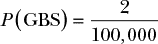
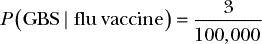
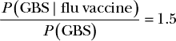
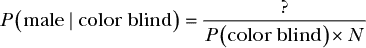
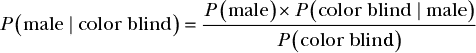
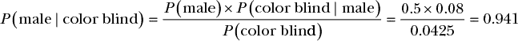
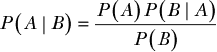

## 条件概率**

到目前为止，我们只处理了*独立*概率。概率是独立的，当一个事件的结果不影响另一个事件的结果时。例如，抛硬币出现正面并不影响掷骰子是否出现 6\. 计算独立概率比计算非独立概率要容易得多，但独立概率往往无法反映现实生活。例如，闹钟不响的概率和你上班迟到的概率是*不*独立的。如果闹钟不响，你上班迟到的可能性比平时要大得多。

在本章中，你将学习如何推理*条件*概率，其中概率不是独立的，而是依赖于特定事件的结果。我还将向你介绍条件概率的一个重要应用：贝叶斯定理。

### 介绍条件概率

在我们第一个条件概率的例子中，我们将研究流感疫苗以及接种它可能带来的并发症。当你接种流感疫苗时，通常会收到一张纸，告知你与其相关的各种风险。一个例子是吉兰-巴雷综合症（GBS）的发病率增加，这是一种非常罕见的疾病，会导致身体的免疫系统攻击神经系统，进而可能引发危及生命的并发症。根据美国疾病控制与预防中心（CDC）的数据，某一年感染 GBS 的概率是 2/100,000。我们可以如下表示这个概率：

通常，流感疫苗只会略微增加你患 GBS 的概率。然而，在 2010 年，爆发了猪流感，如果你在那一年接种了流感疫苗，患 GBS 的概率上升到 3/100,000。在这种情况下，患 GBS 的概率直接取决于你是否接种了流感疫苗，因此它是一个条件概率的例子。我们将条件概率表示为*P*(*A* | *B*)，或者*给定 B 情况下 A 的概率*。从数学上讲，我们可以将患 GBS 的概率表示为：

我们用英语这样读这个表达式：“接种流感疫苗后患 GBS 的概率是 3 万分之一。”

#### *为什么条件概率很重要*

条件概率是统计学的一个重要组成部分，因为它可以帮助我们展示信息如何改变我们的信念。在流感疫苗的例子中，如果你不知道某人是否接种了疫苗，你可以说他们患 GBS 的概率是 2/100,000，因为这是从人群中随机挑选出的任何人该年患 GBS 的概率。如果年份是 2010 年，而某人告诉你他们接种了流感疫苗，你就知道实际的概率是 3/100,000。我们还可以将这两个概率的比值表示为：

所以，如果你在 2010 年接种了流感疫苗，我们有足够的信息可以相信你比一个随机挑选的陌生人更有可能患 GBS，概率高出 50%。幸运的是，在个体层面上，患 GBS 的概率仍然非常低。但如果我们看的是整个群体，我们会预计，在接种了流感疫苗的人群中，GBS 的发病率会比一般人群高出 50%。

还有其他因素也可能增加患 GBS 的概率。例如，男性和老年人更容易患 GBS。通过使用条件概率，我们可以将所有这些信息加以考虑，从而更好地估计个体患 GBS 的可能性。

#### *依赖性与修订后的概率规则*

作为条件概率的第二个例子，我们将使用色盲——一种使人们难以辨认某些颜色的视力缺陷。在整个普通人群中，大约 4.25%的人是色盲。色盲的绝大多数案例都是遗传性的。色盲是由 X 染色体上的缺陷基因引起的。由于男性只有一条 X 染色体，而女性有两条，因此男性比女性更容易受到 X 染色体缺陷的负面影响，因此更可能是色盲。因此，尽管整个群体的色盲率为 4.25%，但女性仅为 0.5%，而男性则为 8%。在我们的所有计算中，我们将简化假设人口中的男女比例是完全 50/50。让我们将这些事实表示为条件概率：

*P*(色盲) = 0.0425

*P*(色盲 | 女性) = 0.005

*P*(色盲 | 男性) = 0.08

假设我们从人群中随机挑选一个人，那么他是男性且色盲的概率是多少？

在第三章中，我们学习了如何使用乘法规则将概率与“与”结合。根据乘法规则，我们可以预期我们问题的结果是：

*P*(男性, 色盲) = *P*(男性) × *P*(色盲) = 0.5 × 0.0425 = 0.02125

但是当我们使用乘法规则与条件概率时，会出现一个问题。如果我们尝试计算一个人是*女性*且色盲的概率，这个问题会变得更加清晰：

*P*(女性，色盲) = *P*(女性) × *P*(色盲) = 0.5 × 0.0425 = 0.02125

这是不对的，因为这两个概率是相同的！我们知道，虽然选中男性或女性的概率是相同的，但如果我们选中一位女性，她是色盲的概率应该比男性低得多。我们的公式应该考虑到这样一个事实：如果我们随机选择一个人，那么他们是色盲的概率取决于他们是男性还是女性。第三章中给出的乘积法则仅适用于概率独立的情况。性别（男性或女性）和色盲是相关的概率。

所以，发现一个色盲男性的真实概率是选中一个男性的概率乘以他是色盲的概率。从数学上来说，我们可以写成：

*P*(男性，色盲) = *P*(男性) × *P*(色盲 | 男性) = 0.5 × 0.08 = 0.04

我们可以将这个解法推广，重新编写我们的乘积法则如下：

*P*(*A*,*B*) = *P*(*A*) × *P*(*B* | *A*)

这个定义同样适用于独立的概率，因为对于独立的概率，*P*(*B*) = *P*(*B* | *A*)。当你考虑掷硬币和掷出 6 点时，这个定义直观地是有道理的；因为 *P*(六) 是 1/6，与掷硬币的结果无关，*P*(六 | 正面) 也是 1/6。

我们还可以更新我们对求和法则的定义，以考虑这一事实：

*P*(*A* 或 *B*) = *P*(*A*) + *P*(*B*) – *P*(*A*) × *P*(*B* | *A*)

现在，我们仍然可以轻松地使用第一部分中的概率逻辑规则来处理条件概率。

有关条件概率和依赖性的重要一点是，实际上，了解两个事件之间的关系通常是困难的。例如，我们可能会问某人拥有皮卡车并且通勤超过一个小时的概率。虽然我们可以提出许多理由来解释为什么一个事件可能依赖于另一个事件——也许拥有皮卡车的人往往住在更偏远的地方，通勤时间较短——但我们可能没有足够的数据来支持这一点。假设两个事件是独立的（即使它们很可能不是）在统计学中是一种非常常见的做法。但是，就像我们关于选中一个色盲男性的例子一样，这个假设有时会给我们带来错误的结果。尽管假设独立性通常是实践中的必要做法，但永远不要忘记依赖性可能带来的巨大影响。

### 逆向条件概率和贝叶斯定理

使用条件概率最令人惊讶的事情之一是反转条件来计算我们所依据事件的概率；也就是说，我们可以使用*P*(*A* | *B*)来得出*P*(*B* | *A*)。举个例子，假设你正在给一家销售色盲矫正眼镜的公司客服代表发邮件。眼镜有点贵，你向客服代表提到你担心它们可能不管用。客服代表回复说：“我也是色盲，我自己有一副——它们真的很好用！”

我们想要计算这个客服代表是男性的概率。然而，客服代表只提供了一个 ID 号，除此之外没有任何信息。那么我们该如何计算这个代表是男性的概率呢？

我们知道*P*(色盲 | 男性) = 0.08，并且*P*(色盲 | 女性) = 0.005，但我们该如何确定*P*(男性 | 色盲)呢？直觉上，我们知道客服代表是男性的可能性更大，但我们需要量化这个概率以确保准确。

幸运的是，我们拥有了解决这个问题所需的所有信息，并且我们知道我们正在计算一个人是男性的概率，前提是他们是色盲：

*P*(男性 | 色盲) = ?

贝叶斯统计的核心是数据，而现在我们只有一条数据（除了现有的概率）：我们知道客服代表是色盲。我们的下一步是查看色盲在人群中的比例；然后，我们可以计算出这个子集中的男性比例。

为了帮助推理，我们引入一个新的变量*N*，它代表整个总人口。正如之前所述，我们首先需要计算整个色盲群体的子集。我们知道*P*(色盲)，所以我们可以将这个方程写成这样：

接下来，我们需要计算既是男性又是色盲的人数。这很容易做，因为我们知道*P*(男性)和*P*(色盲 | 男性)，并且我们有了修订后的乘法规则。所以我们只需将这个概率与总人口相乘：

*P*(男性) × *P*(色盲 | 男性) × *N*

所以，给定客服代表是色盲的前提下，代表是男性的概率为：

我们的人口变量*N*出现在分式的上下两部分，所以*N*被约去：

现在我们可以解决这个问题，因为我们知道了每一条信息：

根据计算，我们知道客服代表是男性的概率为 94.1%！

### 引入贝叶斯定理

在前面的公式中，实际上并没有什么特定于我们色盲案例的内容，所以我们应该能够将其推广到任何给定的*A*和*B*概率。如果我们这样做，我们就得到了本书中最基础的公式——*贝叶斯定理*：

为了理解贝叶斯定理为何如此重要，让我们看一下这个问题的一般形式。我们的信念描述了我们所知道的世界，因此当我们观察到某个现象时，其条件概率表示*在我们相信某事的前提下，我们所看到的现象的可能性*，或者：

*P*(观察到的 | 信念)

例如，假设你相信气候变化，因此你预期你居住的地区在 10 年期间将经历比平常更多的干旱。你的信念是气候变化正在发生，而你的观察是你所在地区的干旱次数；假设过去 10 年中发生了 5 次干旱。确定如果在这一期间*存在*气候变化，你是否会看到恰好 5 次干旱，可能会比较困难。解决这个问题的一种方法是咨询气候科学专家，询问他们基于气候变化假设模型下，发生干旱的概率。

到这个时候，你所做的只是问：“在我相信气候变化属实的前提下，我观察到的现象的概率是多少？”但你真正想要的是某种方法，来量化在观察到这些现象后，你相信气候变化确实在发生的程度。贝叶斯定理允许你反转你询问气候科学家时的*P*(观察到的 | 信念)，并求解基于你观察到的现象，信念的可能性，即：

*P*(信念 | 观察到的)

在这个例子中，贝叶斯定理让你可以将观察到的 10 年内 5 次干旱转化为一个关于你在观察到这些干旱后对气候变化的信念强度的陈述。你需要的其他信息是 10 年内发生 5 次干旱的普遍概率（这可以通过历史数据估算），以及你对气候变化的初始信心。虽然大多数人对气候变化的初始概率不同，但贝叶斯定理使你能够精确量化数据如何改变任何信念。

例如，如果专家说，如果假设气候变化正在发生，那么 10 年内 5 次干旱是非常可能的，大多数人会稍微改变他们的信念，以支持气候变化，无论他们是否怀疑气候变化，还是像阿尔·戈尔那样坚定。

然而，假设专家告诉你，事实上，如果假设气候变化正在发生，那么 10 年内 5 次干旱是非常不可能的。在这种情况下，基于证据，你对气候变化的先前信念将稍微减弱。这里的关键要点是，贝叶斯定理最终使证据能够改变我们信念的强度。

贝叶斯定理允许我们将我们对世界的信念与数据结合，然后将这种结合转化为一个估计值，衡量我们根据所观察到的证据对信念的强度。我们的信念通常只是我们对某个想法的初步确信；这就是贝叶斯定理中的*P*(*A*)。我们经常争论一些话题，比如枪支管控是否能减少暴力，增加考试是否能提高学生表现，或是公共卫生保健是否能减少整体医疗成本。但我们很少考虑证据应该如何改变我们的想法，或者改变我们争论对象的想法。贝叶斯定理允许我们观察关于这些信念的证据，并精确量化*这种证据如何*改变我们的信念。

在本书后面，你将看到我们如何比较信念，以及在某些情况下数据可能出乎意料地未能改变信念（任何与亲戚在晚餐桌上争论过的人都可以证明这一点！）。

在下一章，我们将花更多时间讨论贝叶斯定理。我们将再次推导它，但这次使用乐高积木；这样，我们可以清楚地可视化它是如何运作的。我们还将探索如何从更具体的角度理解贝叶斯定理，建模我们现有的信念以及数据如何改变它们。

### 总结

在本章中，你学习了条件概率，即任何依赖于另一个事件的事件的概率。与独立概率相比，条件概率的计算更为复杂——我们不得不更新乘法规则以考虑依赖关系——但它们引导我们得出了贝叶斯定理，这是理解如何利用数据来更新我们对世界的认知的基础。

### 练习

尝试回答以下问题，看看你对条件概率和贝叶斯定理的理解有多深。答案可以在*[`nostarch.com/learnbayes/`](https://nostarch.com/learnbayes/)* 找到。

+   为了使用贝叶斯定理来确定 2010 年某人患有 GBS 的同时*也*接种了流感疫苗，我们需要哪些信息？

+   从人群中随机挑选一个人，这个人是女性且*不是*色盲的概率是多少？

+   2010 年接种了流感疫苗的男性，患色盲或得了 GBS 的概率是多少？
