## 第七章：贝叶斯定理与 LEGO**

在上一章中，我们介绍了条件概率，并引入了概率论中的一个非常重要的概念——贝叶斯定理，内容如下：

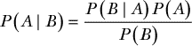

请注意，这里我们从第六章做了一个非常小的修改，写出了*P*(*B* | *A*)*P*(*A*)，而不是*P*(*A*)*P*(*B* | *A*)；这两者含义相同，但有时改变术语的顺序有助于阐明解决问题的不同方法。

使用贝叶斯定理，我们可以反转条件概率——所以当我们知道概率*P*(*B* | *A*)时，我们可以推算出*P*(*A* | *B*)。贝叶斯定理是统计学的基础，因为它允许我们从已知某个观察结果的概率来推导出基于该观察结果的信念强度。例如，如果我们知道打喷嚏的概率在你感冒的情况下，我们可以倒推，得出你感冒的概率，前提是你打了喷嚏。通过这种方式，我们利用证据来更新我们对世界的信念。

在本章中，我们将使用 LEGO 积木来可视化贝叶斯定理，并帮助你更好地理解数学内容。为此，让我们拿出一些 LEGO 积木，并对我们的方程提出一些具体问题。图 7-1 显示了一个 6 × 10 的 LEGO 积木区域；这是一个 60 颗积木的区域（*积木*是 LEGO 砖块上的圆柱形凸起部分，用于将砖块连接在一起）。

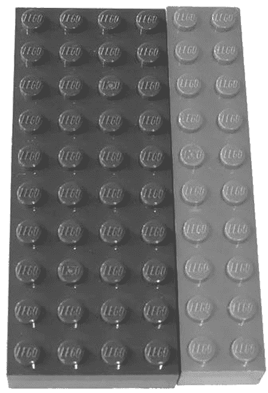

*图 7-1：一个 6 × 10 积木的 LEGO 区域，帮助我们可视化可能事件的空间*

我们可以将这个视为 60 种可能的、互斥事件的空间。例如，蓝色积木可以代表 40 个通过考试的学生，红色积木代表 20 个没通过考试的学生，这些学生来自一个 60 人的班级。在这 60 个积木的区域里，有 40 个蓝色积木，所以如果我们随机选一个点，触摸到蓝色砖块的概率是这样定义的：

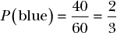

我们可以通过以下方式表示触摸到红色砖块的概率：

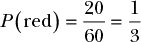

触摸蓝色或红色砖块的概率，正如你所预期的，是 1：

*P*(蓝色) + *P*(红色) = 1

这意味着红色和蓝色砖块就可以描述我们所有可能事件的集合。

现在，让我们在这两块砖块上放置一块黄色砖块，代表另一种可能性——例如，那些熬夜学习没有睡觉的学生——它看起来像图 7-2 所示。

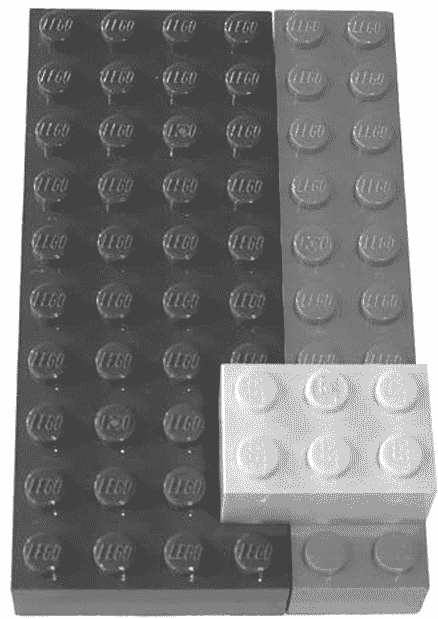

*图 7-2：将一个 2 × 3 的 LEGO 砖块放置在 6 × 10 积木区域上方*

现在，如果我们随机选取一个积木，触摸黄色砖块的概率是：

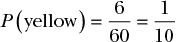

但如果我们将*P*(黄色)加到*P*(红色) + *P*(蓝色)，我们会得到一个大于 1 的结果，而这是不可能的！

问题在于，所有黄色积木都位于红色和蓝色积木空间之上，因此获得一个黄色积木的概率是*条件的*，取决于我们是否处于蓝色或红色空间。正如我们在前一章中所知道的，我们可以将这种条件概率表示为*P*(黄 | 红)，或者说是*在红色条件下得到黄色的概率*。根据我们之前的例子，这就是学生熬夜后未通过考试的概率。

### 通过视觉方式计算条件概率

让我们回到我们的乐高积木，并计算*P*(黄 | 红)的值。图 7-3 为我们提供了问题的视觉帮助。

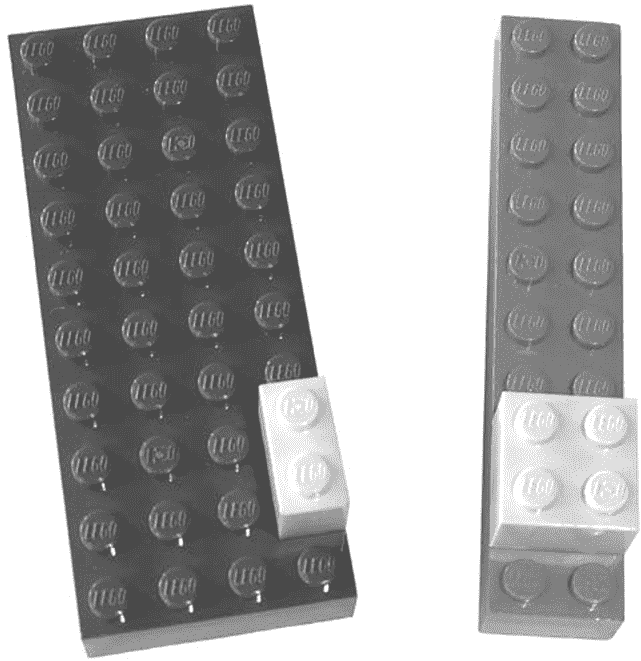

*图 7-3：可视化* P*(黄 | 红)*

让我们通过操作物理模型来演示如何确定*P*(黄 | 红)。

1.  将红色区域与蓝色区域分开。

1.  得到红色空间的总面积，它是一个 2 × 10 的积木区域，因此有 20 个积木钉子。

1.  得到红色空间上黄色积木的面积，是 4 个积木钉子。

1.  将黄色区域的面积除以红色区域的面积。

这给出了*P*(黄 | 红) = 4/20 = 1/5。

太好了——我们已经得出了条件概率黄给定红！到目前为止，一切顺利。那么如果我们反过来，问问*P*(红 | 黄)是多少呢？通俗来说，如果我们知道我们处于一个黄色的空间，那么在下面是红色的概率是多少？或者在我们的测试例子中，假设一个学生熬夜了，给定这个信息，学生没有通过考试的概率是多少？

看着图 7-3，你可能已经通过推理直观地得出了*P*(红 | 黄)的值：“有 6 个黄色的积木钉子，其中 4 个在红色积木上，所以选择一个在红色积木上的黄色积木的概率是 4/6。”如果你确实按照这个思路推理，那恭喜你！你已经独立发现了贝叶斯定理。但为了确保正确，我们接下来用数学来量化这个过程。

### 进行数学推导

从我们的直觉到贝叶斯定理的推导需要一点工作。让我们开始通过数学化我们的直觉来计算存在 6 个黄色积木的情况。我们的思维通过空间推理得出了这一结论，但我们需要用数学方法来解决。为此，我们只需将黄色积木的概率乘以积木的总数：

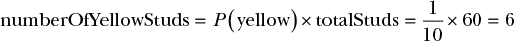

我们直觉推理的下一部分是，4 个黄色积木位于红色上方，这需要更多的工作才能通过数学证明。首先，我们必须确定红色积木的数量；幸运的是，这与计算黄色积木数量的过程相同：

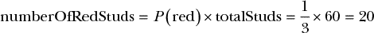

我们也已经计算出了黄色积木覆盖的红色积木的比例，即*P*(黄 | 红)。为了将其转化为一个计数——而不仅仅是一个概率——我们将其乘以我们刚才计算出来的红色积木的数量：

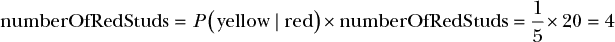

最后，我们得到了黄色覆盖的红色凸起与黄色总数的比值：

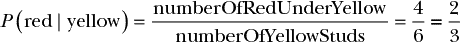

这与我们的直觉分析一致。然而，它看起来并不像一个贝叶斯定理的方程式，贝叶斯定理应该具有以下结构：

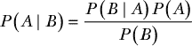

为了达到这个目标，我们必须回过头来展开方程中的各项，如下所示：

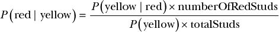

我们知道我们是这样计算的：

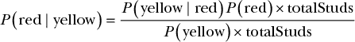

最后，我们只需要从方程中消去 totalStuds，得到：

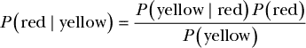

从直觉出发，我们回到了贝叶斯定理！

### 总结

从概念上讲，贝叶斯定理源于直觉，但这并不意味着贝叶斯定理的形式化是显而易见的。我们数学工作的好处在于，它能够从直觉中提取出推理。我们已经确认了我们原始的直觉信念是一致的，现在我们有了一个强大的新工具，可以处理比乐高砖块更复杂的概率问题。

在下一章，我们将学习如何使用贝叶斯定理来推理和通过数据更新我们的信念。

### 练习

尝试回答以下问题，看看你是否已经牢固理解了我们如何使用贝叶斯定理推理条件概率。解答可以在 *[`nostarch.com/learnbayes/`](https://nostarch.com/learnbayes/)* 找到。

1.  堪萨斯城，尽管名字如此，实际上位于美国两个州的边界：密苏里州和堪萨斯州。堪萨斯城大都市区包含 15 个县，其中 9 个在密苏里州，6 个在堪萨斯州。整个堪萨斯州有 105 个县，密苏里州有 114 个县。使用贝叶斯定理计算一个刚搬到堪萨斯城大都市区的亲戚住在堪萨斯州的县的概率。确保展示 *P*(堪萨斯)（假设你的亲戚要么住在堪萨斯州，要么住在密苏里州），*P*(堪萨斯城大都市区) 和 *P*(堪萨斯城大都市区 | 堪萨斯)。

1.  一副扑克牌有 52 张牌，花色是红色或黑色。有四张王牌：两张红色的和两张黑色的。你从牌堆中抽出一张红色王牌并将牌洗匀。你的朋友抽到了一张黑牌。那么这张牌是王牌的概率是多少？
