## 第八章：贝叶斯定理的先验、可能性和后验**

现在我们已经介绍了如何通过空间推理推导贝叶斯定理，让我们来看看如何使用贝叶斯定理作为一个概率工具，逻辑地推理不确定性。在本章中，我们将使用它来计算和量化我们信念的可能性，给定我们观察到的数据。为此，我们将使用定理的三个部分——后验概率、可能性和先验概率——这些将在你使用贝叶斯统计学和概率论的过程中频繁出现。

### 三个部分

贝叶斯定理让我们可以准确量化观察到的数据如何改变我们的信念。在这种情况下，我们想要了解的是：*P*(信念 | 数据)。用通俗的语言来说，我们希望量化在观察到的数据之后，我们的信念有多强烈。这个公式部分的技术术语是*后验概率*，我们将利用贝叶斯定理来解决这个问题。

为了解出后验概率，我们需要下一个部分：在我们关于数据的信念下，数据的概率，即 *P*(数据 | 信念)。这被称为*可能性*，因为它告诉我们，在我们信念的前提下，数据有多可能。

最后，我们想要量化我们最初信念的可能性，即 *P*(信念)。贝叶斯定理中的这一部分被称为*先验概率*，或简称“先验”，因为它代表了在看到数据之前我们信念的强度。可能性和先验结合起来产生后验概率。通常我们需要使用数据的概率，*P*(数据)，来归一化后验，以便它准确反映从 0 到 1 的概率。然而，实际上我们并不总是需要*P*(数据)，所以这个值没有特别的名称。

正如你现在所知道的，我们将我们的信念称为假设 *H*，而用变量 *D* 来表示我们的数据。图 8-1 展示了贝叶斯定理的每个部分。

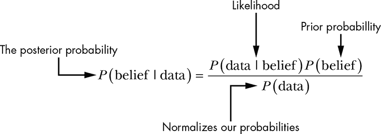

*图 8-1：贝叶斯定理的部分*

在本章中，我们将调查一起犯罪案件，结合这些部分来推理案件情况。

### 调查犯罪现场

假设某天你下班回家，发现窗户被打破，前门敞开，笔记本电脑不见了。你最先的想法可能是“我被抢劫了！”但是，你是如何得出这个结论的？更重要的是，你如何量化这种信念？

你最初的假设是你被抢劫了，因此 *H* = 我被抢劫了。我们想要一个概率来描述你被抢劫的可能性，因此我们想要根据数据来求解的后验是：

*P*(被抢劫 | 窗户破裂，前门敞开，笔记本电脑失踪)

为了解决这个问题，我们将填补贝叶斯定理中的缺失部分。

#### *解决可能性*

首先，我们需要解决的是可能性，在这个案例中，就是在你被抢劫的情况下，观察到相同证据的概率——换句话说，就是证据与假设的契合度：

*P*(破窗、开门、丢失笔记本电脑 | 被抢劫)

我们在问的是，“如果你被抢劫了，那么你看到的证据有多大可能会是你所看到的这些？”你可以想象到很多情景，在这些情景中，抢劫发生时并不一定所有的证据都会出现。例如，一个聪明的小偷可能打开了你的门锁，偷走了你的笔记本电脑，然后锁好门离开，根本不需要打破窗户。或者他可能只是砸碎了窗户，拿走了笔记本电脑，然后从窗户爬出来。我们看到的这些证据直观上似乎在抢劫现场非常常见，因此我们假设如果你被抢劫了，回家时看到这些证据的概率为 3/10。

需要注意的是，尽管我们在这个例子中只是做了一个猜测，但我们也可以做一些研究来获得更好的估计。我们可以去当地警察局询问有关涉及抢劫的犯罪现场证据的统计数据，或者阅读最近抢劫案件的新闻报道。这将为我们提供一个更准确的估计，帮助我们判断如果你被抢劫了，你会看到这些证据的概率。

贝叶斯定理的神奇之处在于，我们可以用它来组织我们的日常信念，也可以用它来处理具有非常精确概率的大数据集。即使你认为 3/10 并不是一个好的估计值，你总是可以回到计算中——就像我们将要做的那样——看看在不同假设下这个值是如何变化的。例如，如果你认为在发生抢劫的情况下，看到这个证据的概率只有 3/100，你也可以很容易地返回并将这些数字代入。贝叶斯统计让人们可以以可度量的方式对信念产生分歧。因为我们是以定量的方式处理我们的信念，所以你可以重新计算本章中的所有内容，看看不同的概率是否对任何最终结果产生了实质性的影响。

#### *计算先验*

接下来，我们需要确定你被抢劫的概率。这是我们的先验。先验非常重要，因为它们允许我们利用背景信息来调整可能性。例如，假设之前描述的场景发生在一个荒岛上，你是唯一的居民。在这种情况下，你几乎不可能被抢劫（至少是被人类抢劫）。再举个例子，如果你住在一个犯罪率很高的社区，抢劫可能是经常发生的事情。为了简化问题，假设我们将被抢劫的先验设定为：

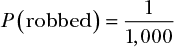

请记住，我们总是可以根据不同的证据在以后调整这些数字。

我们几乎具备了计算后验所需的所有信息；我们只需要归一化数据。那么，在继续之前，让我们看一下未经归一化的后验：

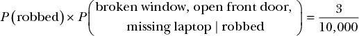

这个值非常小，这令人惊讶，因为直觉告诉我们，根据你观察到的证据，你的房子被抢劫的概率似乎非常非常高。但我们还没有考虑观察到我们证据的概率。

#### *数据归一化*

我们的方程中缺少的部分是你观察到的数据的概率，无论你是否被抢劫。在我们的例子中，这就是你观察到窗户破了，门开着，笔记本电脑丢失的概率，*一次性*发生，无论原因是什么。到目前为止，我们的方程看起来是这样的：

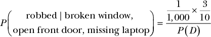

分子中的概率如此之低的原因是我们还没有用你会找到这些奇怪证据的概率来归一化它。

我们可以看到，当我们改变*P*(*D*)时，后验如何变化，见表 8-1。

**表 8-1：** *P*(*D*) 如何影响后验概率

| ***P*(*D*)** | **后验概率** |
| --- | --- |
| 0.050 | 0.006 |
| 0.010 | 0.030 |
| 0.005 | 0.060 |
| 0.001 | 0.300 |

随着我们数据的概率减小，我们的后验概率增加。这是因为当我们观察到的数据变得越来越不太可能时，通常不太可能的解释更能解释事件的发生（见图 8-2）。

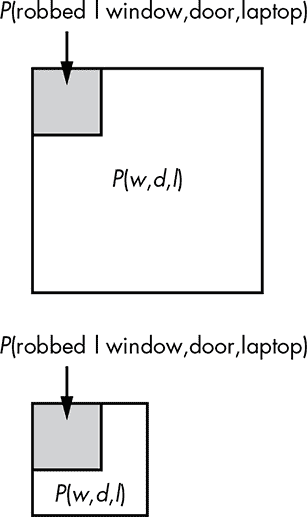

*图 8-2：* 随着数据概率的减少，后验概率增加。

考虑这个极端的例子：你朋友成为百万富翁的唯一方式是他们中了彩票或继承了某个你不知道的家庭成员的财产。因此，你朋友成为百万富翁的可能性是惊人地低的。然而，你发现你朋友*确实*成为了百万富翁。然后，他们中了彩票的可能性就变得更加可能，因为这是他们能成为百万富翁的仅有的两种方式之一。

被抢劫，当然，仅仅是你观察到的事情的一个可能解释，还有更多其他解释。然而，如果我们不知道证据的概率，我们就无法弄清楚如何归一化这些其他可能性。那么，我们的*P*(*D*)是多少呢？这就是棘手的部分。

关于*P*(*D*)的常见问题是，在许多现实世界的情况下，它很难准确计算。对于公式中的每个其他部分——尽管我们只是猜测了一个值用于本次练习——我们可以收集真实数据来提供更具体的概率。对于我们的先验*P*(被抢劫)，我们可能只是查看历史犯罪数据，并确定某一天你街道上的某个房子被抢劫的概率。同样，我们也可以理论上调查过去的抢劫案件，并得出在抢劫的情况下观察到你所见证的证据的更准确的可能性。但我们怎么可能真正猜测*P*(破窗、开着的前门、丢失的笔记本电脑)呢？

我们可以不研究你所观察到数据的概率，而是尝试计算所有其他可能事件的概率，这些事件可能解释你所观察到的现象。因为这些事件的概率之和必须为 1，我们可以倒推，找到*P*(*D*)。但对于这条特定证据来说，可能性几乎是无穷无尽的。

在没有*P*(*D*)的情况下，我们有点困惑。在第六章和第七章中，我们分别计算了客户服务代表是男性的概率和选择不同颜色乐高积木的概率，我们有很多关于*P*(*D*)的信息。这使得我们能够根据我们观察到的情况，得出我们对假设的信念的确切概率。没有*P*(*D*)，我们无法得出*P*(被抢劫 | 破窗、开着的前门、丢失的笔记本电脑)的值。然而，我们并不完全迷失。

好消息是，在某些情况下，我们不需要明确知道*P*(*D*)，因为我们通常只想*比较*假设。在这个例子中，我们将比较你被抢劫的可能性与另一种可能的解释。我们可以通过查看我们未归一化的后验分布的比率来实现这一点。由于*P*(*D*)是一个常数，我们可以安全地将其去除，而不改变我们的分析。

所以，在本章剩余部分，我们将不再计算*P*(*D*)，而是提出一个替代假设，计算其后验概率，然后将其与我们原始假设的后验概率进行比较。虽然这意味着我们无法得出抢劫是你所观察到的证据唯一可能解释的确切概率，但我们仍然可以使用贝叶斯定理来扮演侦探，调查其他可能性。

### 考虑替代假设

让我们提出一个新的假设，与原始假设进行比较。我们的新假设包含三个事件：

1.  一名邻里的孩子打了一颗棒球，正好打破了前窗。

1.  你把门忘了锁。

1.  你忘记了你把笔记本电脑带到公司，实际上它还在那儿。

我们将简单地按列表中的编号引用这些解释，并将它们统称为*H*[2]，使得*P*(*H*[2]) = *P*(1,2,3)。现在我们需要求解此数据的似然度和先验概率。

#### *我们替代假设的可能性*

回想一下，对于我们的可能性，我们想要计算在给定我们假设的情况下你所观察到的事件的概率，或者*P*(*D* | *H*[2])。有趣的是——正如你将看到的那样——这个解释的可能性结果是 1：*P*(*D* | *H*[2]) = 1

如果我们的假设中的所有事件都发生了，那么你对破窗、未锁的门和丢失的笔记本电脑的观察将是确定的。

#### *我们替代假设的先验概率*

我们的先验代表所有三件事情发生的可能性。这意味着我们需要先计算每个事件的概率，然后使用乘法法则来确定先验。对于这个例子，我们假设这些可能的结果是条件独立的。

我们假设的第一部分是一个邻里的孩子把棒球打穿了前窗。虽然这种情况在电影中很常见，但我个人从未听说过发生过这种事。我认识的被抢劫的人要多得多，所以我们假设棒球打穿窗户的概率是我们之前使用的被抢劫概率的一半：

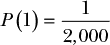

我们假设的第二部分是你没有锁门。这是相当常见的；假设这种情况大约每个月发生一次，那么：

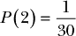

最后，让我们来看一下将笔记本电脑留在公司。虽然把笔记本电脑带到公司并把它留在那里可能很常见，但完全忘记自己一开始把它带进公司就不太常见了。也许这种情况每年发生一次：

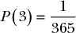

由于我们已经为每个*H*[2]的部分赋予了概率，现在我们可以通过应用乘法法则来计算我们的先验概率：

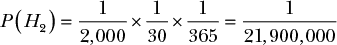

如你所见，所有三件事件发生的先验概率极低。现在我们需要为每个假设计算后验概率以进行比较。

#### *我们替代假设的后验概率*

我们知道我们的可能性，*P*(*D* | *H*[2])等于 1，因此如果我们的第二个假设为真，我们就可以肯定地看到我们的证据。在第二个假设中没有先验概率的情况下，看来我们新假设的后验概率会比原始假设（即你被抢劫）的后验概率强得多（因为即使我们被抢劫了，我们看到数据的可能性也没有那么大）。我们现在可以看到，先验如何极大地改变了我们的非标准化后验概率：

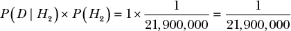

现在我们想通过比率来比较我们的后验信念以及假设的强度。你会看到，我们不需要*P*(*D*)就可以做到这一点。

### 比较我们的非标准化后验概率

首先，我们想比较这两个后验的比率。比率告诉我们一个假设比另一个假设更可能的倍数。我们将我们的原假设定义为*H*[1]，比率看起来像这样：

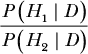

接下来，让我们对每个部分使用贝叶斯定理进行扩展。我们将贝叶斯定理写成 *P*(*H*) × *P*(*D* | *H*) × 1/*P*(*D*)，这样在这种上下文中公式更易于阅读：

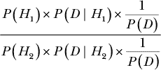

注意，分子和分母中都包含了 1/*P*(*D*)，这意味着我们可以去掉它，保持比例关系。这就是为什么在比较假设时 *P*(*D*) 不重要的原因。现在我们有了一个未归一化的后验比例。因为后验概率告诉我们我们的信念有多强，这个后验的比例告诉我们 *H*[1] 比 *H*[2] 更好地解释我们的数据多少倍，而无需知道 *P*(*D*)。让我们去掉 *P*(*D*) 并代入我们的数字：

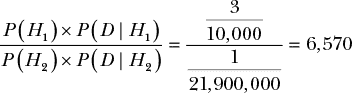

这意味着 *H*[1] 比 *H*[2] 更好地解释我们观察到的现象达 6,570 倍。换句话说，我们的分析表明，我们的原假设 (*H*[1]) 比我们的替代理论 (*H*[2]) 更好地解释了数据。这也很好地符合我们的直觉——根据你观察到的场景，抢劫显然是一个更可能的评估。

我们希望以数学方式表达这种未归一化后验的特性，以便将其用于比较。为此，我们使用以下版本的贝叶斯定理，其中符号 ∝ 表示“与……成比例”：

*P*(*H* | *D*) ∝ *P*(*H*) × *P*(*D* | *H*)

我们可以这样理解：“后验概率——也就是给定数据的假设概率——是*与*先验概率*H*相乘，再乘以给定*H*的数据显示的概率的比例。”

这种形式的贝叶斯定理非常有用，特别是在我们想要比较两个想法的概率，但又无法轻松计算 *P*(*D*) 的情况下。我们不能单独为我们的假设得出一个有意义的概率值，但我们仍然在使用贝叶斯定理的一个版本来比较假设。比较假设意味着我们可以清楚地看到一个解释我们观察到的现象的解释，比另一个更强。

### 总结

本章探讨了贝叶斯定理如何为我们提供一个框架，帮助我们基于已观察到的数据构建对世界的信念。对于贝叶斯分析，贝叶斯定理由三个主要部分组成：后验概率，*P*(*H* | *D*)；先验概率，*P*(*H*)；以及似然性，*P*(*D* | *H*)。

数据本身，或者 *P*(*D*)，在这个列表中显著缺席，因为如果我们仅仅关心比较信念，我们通常不需要它来执行分析。

### 练习

尝试回答以下问题，看看你是否对贝叶斯定理的各个部分有一个扎实的理解。解决方案可以在 *[`nostarch.com/learnbayes/`](https://nostarch.com/learnbayes/)* 找到。

1.  如前所述，你可能不同意最初分配给可能性的概率：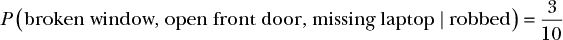

    这如何改变我们对 *H*[1] 相对于 *H*[2] 的信念强度？

1.  你必须多么不可能相信自己会被抢劫——这是我们的先验概率 *H*[1]——才会使得 *H*[1] 与 *H*[2] 的比率相等呢？
