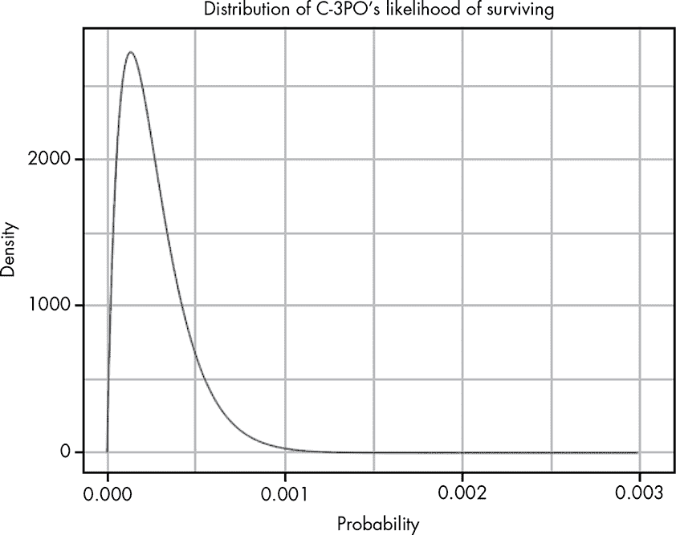
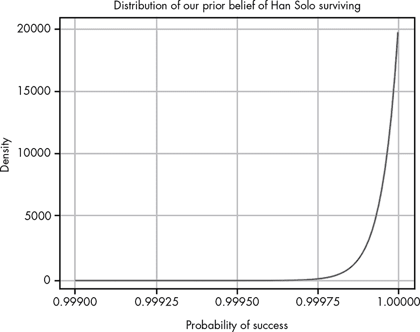
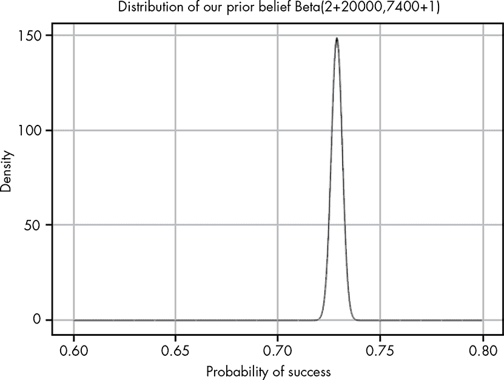

## **9

贝叶斯先验和与概率分布的运用**

先验概率是贝叶斯定理中最具争议的部分，因为它们常常被认为是主观的。然而，在实际应用中，它们通常展示了如何将重要的背景信息应用于充分推理不确定的情况。

在本章中，我们将讨论如何使用先验来解决问题，以及如何使用概率分布来数值化描述我们的信念，将其表示为一系列可能的值，而非单一的值。使用概率分布而非单一值有两个主要原因。

首先，实际上我们可能拥有并考虑各种不同的信念。其次，表示概率范围使我们能够明确表达我们对一组假设的信心。当我们在第五章中研究神秘的黑匣子时，我们探讨了这两个例子。

### C-3PO 对小行星带的怀疑

作为一个例子，我们将使用《星球大战：帝国反击战》中的一个经典统计分析错误。当韩·索罗试图避开敌方战机时，他驾驶着*千年隼*飞入了一片小行星带，知识渊博的 C-3PO 告诉韩，概率对他不利。C-3PO 说：“先生，成功穿越小行星带的可能性大约是 3720 比 1！”

“永远不要告诉我几率！”韩回应道。

表面上看，这只是一个有趣的电影片段，轻视“无聊”的数据分析，但实际上这里有一个有趣的难题。我们观众知道韩能做到，但我们可能也并不反对 C-3PO 的分析。即使是韩也认为这很危险，他说：“他们得疯了才会追我们。”而且，追击的 TIE 战机都没能通过，这为 C-3PO 的数字是否完全错误提供了相当强的证据。

C-3PO 在计算时忽略了一点，那就是韩·索罗是个狠角色！C-3PO 并不是错了，只是他忘记添加一些关键信息。现在的问题是：我们能否找到一种方法，避免 C-3PO 的错误，而不是像韩所提议的那样完全忽视概率？为了回答这个问题，我们需要建模 C-3PO 的思维方式，以及我们对韩的信念，然后通过贝叶斯定理将这些模型结合起来。

我们将在下一节开始讨论 C-3PO 的推理，然后再讨论韩的狠角色。

### 确定 C-3PO 的信念

C-3PO 不仅仅是在胡乱编数字。他精通超过 600 万种交流方式，而这需要大量的数据来支持，因此我们可以假设他有实际的数据来支撑他所说的“大约 3,720 比 1”的说法。因为 C-3PO 提供的是成功穿越小行星场的*大致*几率，我们知道他拥有的数据只能给出一系列可能的成功率范围，而不是一个代表概率的单一值。为了表示这一范围，我们需要查看一个关于成功概率的*分布*，而不是一个单一的值。

对 C-3PO 来说，唯一可能的结果就是成功穿越小行星场或失败。我们将根据 C-3PO 的数据，利用你在第五章中学到的贝塔分布来确定成功的各种可能概率。我们使用贝塔分布是因为它能够准确地建模给定成功和失败次数信息时，事件可能成功的概率范围。

回想一下，贝塔分布是通过一个α（观察到的成功次数）和一个β（观察到的失败次数）来进行参数化的：

*P*(成功率 | 成功和失败) = Beta(α,β)

这个分布告诉我们，根据已有的数据，哪些成功率最可能。

为了弄清楚 C-3PO 的信念，我们将假设他的数据来源。假设 C-3PO 有记录，显示 2 个人成功穿越了小行星场，而 7,440 个人则在一次辉煌的爆炸中结束了旅程！图 9-1 展示了一个概率密度函数图，表示 C-3PO 对成功率的真实信念。

*图 9-1：一个贝塔分布，表示 C-3PO 相信汉会生还*

对于任何一名普通飞行员来说，进入小行星场看起来都是不妙的。从贝叶斯的角度来看，C-3PO 基于观察数据估算的真实成功率，即 3,720:1，是*似然*，我们在第八章中讨论过。接下来，我们需要确定我们的先验。

### 解释汉·索罗的英雄气概

C-3PO 分析的问题在于，他的数据是基于*所有*飞行员的，但汉远不是普通飞行员。如果我们不能为汉的英雄气概量化一个数字，那么我们的分析就有问题——不仅仅是因为汉成功穿越了小行星场，更因为我们*相信*他能够成功。统计学是一种帮助和组织我们推理与信念的工具。如果我们的统计分析不仅与我们的推理和信念相矛盾，还未能改变这些信念，那么我们的分析就出了问题。

我们有一个*先验信念*，认为汉会成功穿越小行星场，因为到目前为止，汉已经成功地从每一个不可能的情境中生还。让汉·索罗成为传奇的原因在于，无论生还看起来多么不可能，他总是能够成功！

对于贝叶斯分析之外的数据分析师来说，先验概率常常是一个非常有争议的问题。很多人觉得，单纯“编造”一个先验并不是客观的。但是这个场景是一个关于为什么忽视我们先前信念更加荒谬的客观章节。试想第一次观看*《星际帝国》*，看到这一幕时，一个朋友真诚地告诉你：“好吧，汉已经死了。”你绝对不会认为这是真的。记住，C-3PO 并没有完全错关于生还的可能性：如果你的朋友说：“好吧，那些 TIE 战斗机已经死了”，你可能会笑着同意。

现在，我们有很多理由相信汉会生还，但没有数字来支持这一信念。让我们试着整理一些东西。

我们将从对汉·索洛强悍程度的某种上限开始。如果我们相信汉绝对不会死，那么电影将变得可预测且无聊。另一方面，我们相信汉会成功的程度，强于 C-3PO 认为他不会成功的程度，所以我们可以说我们认为汉会生还的概率是 20,000 比 1。

图 9-2 展示了我们认为汉会生还的先验概率分布。

*图 9-2：表示我们对于汉·索洛生还的先验信念范围的 Beta 分布*

这是另一种 Beta 分布，我们使用它有两个原因。首先，我们的信念非常粗略，所以我们需要承认生还率是变化的。其次，Beta 分布将使未来的计算更加简便。

现在，有了我们的可能性和先验，我们可以在下一节中计算我们的后验概率。

### 通过后验创造悬念

我们现在已经建立了 C-3PO 的信念（可能性），并且我们已经对自己关于汉的信念进行了建模（先验），但是我们需要一种方法来将这些结合起来。通过结合信念，我们创造了我们的*后验分布*。在这种情况下，后验模型了我们在从 C-3PO 那里得知可能性后产生的悬念：C-3PO 分析的目的部分是为了取笑他的分析思维，但也是为了制造一种真实的危险感。仅凭我们的先验，我们对汉毫不担心，但当我们根据 C-3PO 的数据调整它时，我们形成了一个新的信念，考虑到真实的危险。

后验概率的公式实际上非常简单且直观。由于我们只有可能性和先验，我们可以使用前一章讨论的贝叶斯定理的比例形式：

后验 ∝ 可能性 × 先验

请记住，使用贝叶斯定理的这个比例形式意味着我们的后验分布不一定会加和为 1。但我们很幸运，因为有一种简单的方法可以组合贝塔分布，当我们只有似然和先验时，它会给我们一个*标准化*的后验分布。通过这种方式结合我们的两个贝塔分布——一个代表 C-3PO 的数据（似然），另一个代表我们对汉能在任何情况下生还的先验信念——是相当简单的：

Beta (α[后验], β[后验]) = Beta(α[似然] + α[先验], β[似然] + β[先验])

我们只需将先验和后验的α值与先验和后验的β值相加，就可以得到一个标准化的后验分布。由于这非常简单，使用贝塔分布对于贝叶斯统计来说非常方便。为了确定汉能否穿越小行星带的后验概率，我们可以进行这个简单的计算：

Beta(20002,7401) = Beta(2 + 20000, 7400 + 1)

现在我们可以可视化我们数据的新的分布。图 9-3 展示了我们最终的后验信念。

*图 9-3：将我们的似然与先验结合，给出了一个更有趣的后验分布。*

通过将 C-3PO 的信念与我们认为汉能是个硬汉的信念结合起来，我们发现我们的立场更为合理。我们的后验信念显示生还的机会大约是 73%，这意味着我们仍然认为汉有很大的机会生还，但我们也仍然处于悬念之中。

其实最有用的是，我们不仅仅得到汉生还的可能性原始概率，而是得到一个完整的可能信念分布。书中的许多例子，我们一直简单地使用一个单一的概率值，但在实际应用中，使用完整的分布可以帮助我们在信念的强度上更加灵活。

### 总结

在这一章中，你学到了背景信息在分析面前数据时的重要性。C-3PO 的数据为我们提供了一个似然函数，这与我们对汉能力的先验理解不一致。我们并没有像汉在《星球大战：帝国反击战》中那样直接否定 C-3PO，而是将 C-3PO 的似然与我们的先验相结合，从而得出一个调整后的汉成功的可能性信念。在*《星球大战：帝国反击战》*中，这种不确定性对于场景所创造的紧张气氛至关重要。如果我们完全相信 C-3PO 的数据或我们自己的先验，我们就几乎肯定汉会死，或者几乎肯定他会毫无问题地生还。

你也看到了，可以使用概率分布，而不是单一的概率，来表达一系列可能的信念。在本书的后续章节中，你将更详细地研究这些分布，以更细致地探索你信念的不确定性。

### 练习

尝试回答以下问题，看看你是否理解如何将先验概率和似然分布结合起来，以得出一个准确的后验分布；问题的解答可以在 *[`nostarch.com/learnbayes/`](https://nostarch.com/learnbayes/)* 找到。

1.  一位朋友在地上发现一枚硬币，抛掷后连续得到了六个正面，接着是一个反面。给出描述这一现象的贝塔分布。使用积分方法确定抛出正面的真实概率在 0.4 到 0.6 之间的概率，反映出硬币是相当公平的。

1.  给出一个先验概率，假设硬币*是*公平的。使用一个贝塔分布，使得硬币正面概率在 0.4 到 0.6 之间的真实概率至少有 95%的可能性。

1.  现在，看看还需要多少个正面（没有更多的反面）才能说服你相信硬币*不*公平。在这种情况下，假设这意味着我们对硬币正面概率在 0.4 到 0.6 之间的信念降至 0.5 以下。
