## **介绍：平均和参数估计**

本章介绍了 *参数估计*，这是统计推断中的一个重要部分，利用我们的数据猜测一个未知变量的值。例如，我们可能想要估计网页访问者购买商品的概率、嘉年华糖果罐中糖果的数量，或者粒子的位置信息和动量。在这些情况下，我们都有一个未知值需要估算，并且可以利用我们观察到的信息做出猜测。我们将这些未知值称为 *参数*，而做出关于这些参数最佳猜测的过程称为参数估计。

我们将重点讨论 *平均*，这是最基本的参数估计形式。几乎每个人都知道，取一组观察值的平均值是估算真实值的最佳方法，但很少有人真正停下来问，这种方法为什么有效——它真的有效吗？我们需要证明我们可以信任平均值，因为在后面的章节中，我们将其构建为更复杂的参数估计形式。

### 估算降雪量

假设昨晚下了大雪，你想要准确计算你家院子里降雪的深度，单位为英寸。不幸的是，你没有一个可以提供精确测量的雪深计。你向外看，发现风把雪吹得四处飘散，意味着雪并不均匀地铺展。于是，你决定用尺子在院子里大约七个随机位置测量雪的深度。你得到了以下几个测量值（单位：英寸）：

6.2、4.5、5.7、7.6、5.3、8.0、6.9

雪显然被吹动了很多，而你的院子也不完全平整，因此你的测量值都有些不同。鉴于这种情况，我们如何利用这些测量值来做出对实际降雪量的合理猜测呢？

这个简单的问题是参数估计的一个很好示例。我们正在估算的参数是前一晚实际的降雪深度。请注意，由于风将雪吹得四处飘散，而且你没有雪深计，我们永远无法知道降雪的 *精确* 数量。相反，我们有一组数据，可以使用概率将它们结合起来，确定每个观测值对我们估算的贡献，从而帮助我们做出最佳的猜测。

#### *通过平均测量来最小化误差*

你最初的直觉可能是将这些测量值求平均。在小学时，我们学习通过将元素加总并将总和除以元素的数量来求平均值。所以，如果有 *n* 个测量值，每个测量值标记为 *m[i]*，其中 *i* 是第 *i* 个测量值，我们得到：

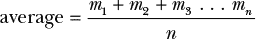

如果我们将数据代入，得到如下解：

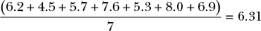

所以，给定我们的七个观测值，我们最好的猜测是大约降了 6.31 英寸的雪。

平均值是我们从小就接受的技巧，因此将其应用于这个问题似乎显而易见，但实际上，很难推理为什么它有效以及它与概率的关系。毕竟，我们的每一项测量都不同，而且它们很可能与实际降雪量不同。几百年来，甚至伟大的数学家也害怕平均数据会把所有这些错误的测量加在一起，从而产生非常不准确的估计。

当我们估计参数时，理解*为什么*我们做出这个决策至关重要；否则，我们可能会使用一个无意中带有偏差或以其他方式系统性错误的估计。在统计学中，一个常见的错误是盲目应用程序而不理解它们，这常常导致将错误的解决方案应用于问题。概率是我们推理不确定性的工具，而参数估计可能是处理不确定性的最常见过程。让我们更深入地探讨一下平均值，看看是否能够更有信心地认为它是正确的路径。

#### *解决我们问题的简化版*

让我们简化一下我们的降雪问题：不再想象所有可能的雪深，而是想象雪落成均匀的块状，使得你的院子形成一个简单的二维网格。图 10-1 展示了这种完美均匀的 6 英寸深积雪，从侧面看的效果（而非鸟瞰图）。

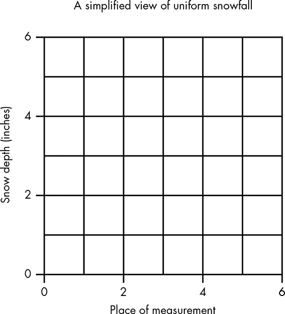

*图 10-1：可视化一个完全均匀的离散降雪*

这是一个完美的场景。我们没有无限多个可能的测量值；相反，我们对六个可能的位置进行了抽样，每个位置只有一个可能的测量值——6 英寸。显然，在这种情况下，平均数是有效的，因为无论我们如何从这些数据中进行抽样，答案总是 6 英寸。

与此相比，图 10-2 展示了当我们考虑到风吹到你房子左侧的积雪时的数据。

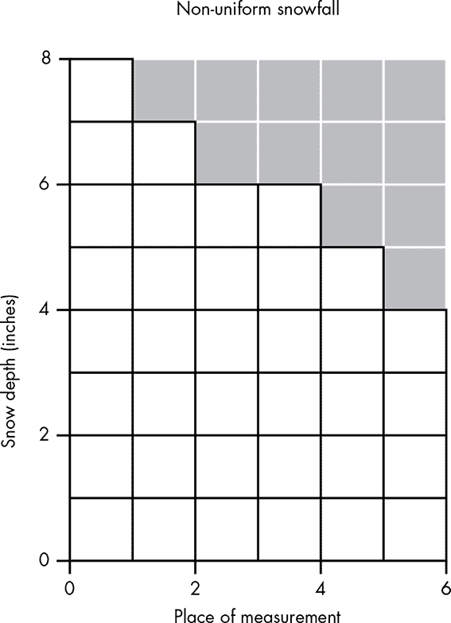

*图 10-2：表示被风吹移的积雪*

现在，我们的问题不再是一个平滑的表面，而是引入了一些不确定性。当然，我们是在作弊，因为我们可以轻松地统计每一块雪并精确知道下了多少雪，但我们可以用这个例子来探索我们如何推理一个不确定的情况。让我们通过测量你院子里每一块积雪来开始调查我们的问题：

8, 7, 6, 6, 5, 4

接下来，我们希望为每个值关联一些概率。由于我们在作弊，并且知道实际的降雪量是 6 英寸，我们还会记录观察值与真实值之间的差异，这被称为*误差*值（参见表 10-1）。

**表 10-1：** 我们的观察值、它们的频率以及与真实值的差异

| **观测值** | **与真实值的差异** | **概率** |
| --- | --- | --- |
| 8 | 2 | 1/6 |
| 7 | 1 | 1/6 |
| 6 | 0 | 2/6 |
| 5 | –1 | 1/6 |
| 4 | –2 | 1/6 |

看一下每个可能观测值与真实测量值之间的差异，我们可以看到，高估某个值的概率被低估某个值的概率所平衡。例如，有 1/6 的概率选择一个比真实值高 2 英寸的测量值，但同样也有相同的概率选择一个比真实值低 2 英寸的测量值。由此我们得出了第一个关键见解，为什么平均值有效：测量误差倾向于相互抵消。

#### *解决一个更极端的案例*

在这种平滑的误差分布下，之前的情境可能没有让你相信，在更复杂的情况下，误差会相互抵消。为了证明这种效果在其他情况下依然成立，让我们看一个更极端的例子。假设风将 21 英寸的雪吹到了六个方格中的一个，而其余方格的积雪仅为 3 英寸，如图 10-3 所示。

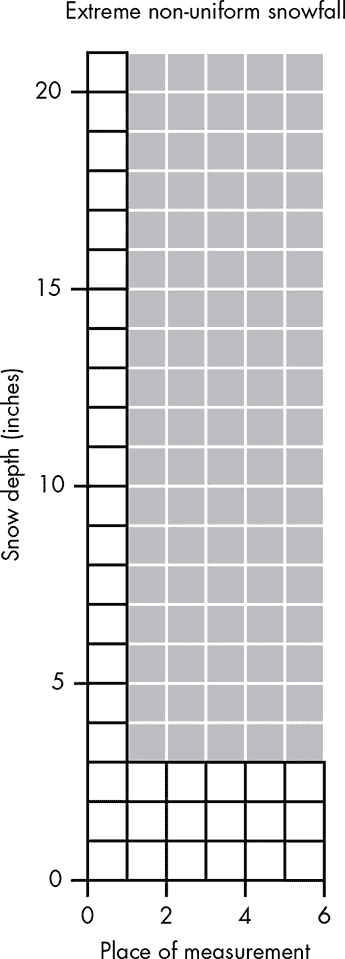

*图 10-3：风将雪吹移的极端案例*

现在我们有了一个非常不同的降雪分布。首先，与前面的例子不同，我们可以采样的值中没有任何一个代表真实的降雪量。此外，我们的误差不再是均匀分布的——我们有一堆低于预期的测量值，还有一个极高的测量值。表 10-2 显示了可能的测量值、与真实值的差异以及每个测量值的概率。

**表 10-2：** 我们极端案例的观测值、差异和概率

| **观测值** | **与真实值的差异** | **概率** |
| --- | --- | --- |
| 21 | 15 | 1/6 |
| 3 | –3 | 5/6 |

很显然，我们不能简单地将一个观测值的误差值与另一个观测值的误差值匹配，然后让它们相互抵消。然而，我们可以利用概率来展示，即使在这种极端分布下，我们的误差依然能够相互抵消。我们可以通过把每个误差测量值看作是由我们的数据进行投票的结果来做到这一点。每个观察到的误差的概率就是我们对该误差的信任度。当我们想要结合这些观测值时，可以将观测值的概率看作是表示其对最终估计的投票强度的值。在这种情况下，–3 英寸的误差比 15 英寸的误差更可能出现五倍，因此–3 会被加权得更重。所以，如果我们进行投票，–3 会获得五票，而 15 只会获得一票。我们通过将每个值乘以其概率并将它们加在一起，来合并所有的投票，从而得到*加权和*。在极端情况下，当所有值都相同，我们只会将观察到的值乘以 1，结果就是该值本身。在我们的示例中，我们得到：

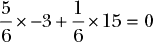

每个观测值中的误差相互抵消，结果为 0！所以，再次说明，无论是否没有任何可能的值是真实的测量，或者误差分布是否不均，关键是当我们根据对该观测值的信任度来加权观测时，误差往往会相互抵消。

#### *通过加权概率估计真实值*

我们现在相当确定，真实测量值的误差会相互抵消。但我们仍然面临一个问题：我们一直在处理真实观测的误差，但要使用这些误差，我们需要知道真实值。当我们不知道真实值时，我们唯一能使用的就是我们的观测值，所以我们需要看看当我们对原始观测值进行加权求和时，误差是否仍然能够相互抵消。

为了证明我们的方法有效，我们需要一些“未知”的真实值。让我们从以下的误差开始：

2, 1, –1, –2

由于真实测量值是未知的，我们用变量*t*表示它，然后加上误差。现在我们可以根据每个观测值的概率对这些观测值进行加权：

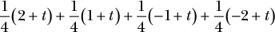

我们所做的只是将误差加到常数值*t*上，这个*t*表示我们的真实测量值，然后根据每个结果的概率对其加权。我们这样做是为了看看是否仍然能够让误差相互抵消，最终只留下*t*值。如果是这样的话，我们可以期待即使在仅仅对原始观测值进行平均时，误差也能相互抵消。

我们的下一步是将概率权重应用于我们的项中的值，得到一个长的求和式：

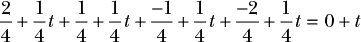

如果我们重新排列这些项，将所有误差放在一起，我们可以看到我们的误差仍然会相互抵消，且加权后的*t*值的总和就是我们未知的真实值*t*：

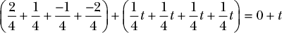

这表明，即使我们将测量定义为一个未知的真实值*t*并添加一些误差值，误差仍然会相互抵消！最终我们只剩下*t*。即使我们不知道真实的测量值或真实的误差是什么，当我们对我们的值进行平均时，误差往往会相互抵消。

在实践中，我们通常无法对所有可能的测量空间进行采样，但我们拥有的样本越多，误差就越有可能被抵消，一般来说，我们的估计会越接近真实值。

#### *定义期望、均值和平均数*

我们在这里得到的正式称为数据的*期望*或*均值*。它只是每个值按其概率加权后的总和。如果我们将每个测量值表示为*x[i]*，每个测量的概率表示为*p[i]*，我们可以通过以下方式数学定义均值——通常用μ（希腊字母 mu 的小写）表示：

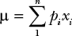

明确来说，这与我们在小学时学到的平均数计算*完全*相同，只是用符号将概率的使用更加明确。举个例子，为了对四个数字求平均，在学校里我们写作：

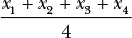

这与写作是相同的：

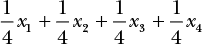

或者我们可以直接说*p[i]* = 1/4，并写成：

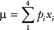

所以，尽管均值实际上只是每个人都熟悉的平均数，但通过从概率原理构建它，我们可以看到*为什么*对数据进行平均有效。不管错误是如何分布的，一个极端的错误概率会被另一个极端的概率所抵消。当我们获取更多样本时，平均值更有可能被抵消，我们开始接近我们所寻找的真实测量值。

### 测量的均值与总结的均值

我们一直在使用均值来从具有一些误差的观察分布中估计一个真实的测量值。但是，均值通常用来作为*总结*一组数据的方式。例如，我们可能会提到如下内容：

+   一个人的平均身高

+   房屋的平均价格

+   学生的平均年龄

在所有这些情况下，我们并不是将均值作为单个真实测量的参数估计；相反，我们是在总结一个总体的属性。准确来说，我们在估计这些总体的某个抽象属性的参数，这些总体可能甚至并不真实。尽管均值是一个非常简单且众所周知的参数估计，但它很容易被滥用，导致奇怪的结果。

当你在计算数据的平均值时，你应该始终问自己一个基本问题：“我到底在尝试测量什么，这个值到底意味着什么？”以我们的降雪例子为例，答案很简单：我们试图估算昨晚下了多少雪，直到风把雪吹得四处飘散。然而，当我们在测量“平均身高”时，答案就不那么明确了。没有所谓的“平均人”，我们观察到的身高差异不是误差——它们是真正的身高差异。一个人并不是 5’5”因为他们的身高部分“漂移”到了一个 6’3”人的身上！

如果你正在建造一个游乐园，并想知道应该对过山车设置什么样的身高限制，以便至少一半的游客能乘坐，那么你有一个真正的值在测量。然而，在这种情况下，均值突然变得不那么有用。更好的衡量标准是估算进入你游乐园的人身高超过 *x* 的概率，其中 *x* 是乘坐过山车的最低身高。

本章中我所做的所有假设都认为我们正在尝试测量一个特定的值，并使用平均值来抵消误差。也就是说，我们将平均值作为一种参数估计的方法，其中我们的参数是一个我们永远无法知道的实际值。虽然平均值对于总结大量数据集也有用，但我们不能再使用“误差抵消”的直觉，因为数据中的变异是真实且有意义的变异，而不是测量中的误差。

### 总结

在本章中，你学习到，你可以信任自己关于通过平均测量来估算未知值的直觉。之所以如此，是因为误差往往会被抵消。我们可以将这种平均的概念正式化为期望值或均值。当我们计算均值时，我们是通过观察这些数据的概率来加权我们的所有观察结果。最后，尽管平均是一种简单的工具来理解，但我们应始终明确我们通过平均想要确定的内容；否则，我们的结果可能会失效。

### 练习

尝试回答以下问题，看看你对通过平均来估算未知测量值的理解程度。答案可以在 *[`nostarch.com/learnbayes/`](https://nostarch.com/learnbayes/)* 中找到。

1.  可能会出现一些误差，这些误差并不会完全像我们希望的那样被抵消掉。在华氏温标中，98.6 度是正常体温，100.4 度是发烧的典型温度阈值。假设你正在照顾一个感到发热且看起来生病的孩子，但你多次从温度计上读取的结果都在 99.5 度到 100.0 度之间：发热，但还不到发烧。你自己尝试温度计，得到的读数在 97.5 度到 98 度之间。那么，温度计可能出了什么问题？

1.  假设你感觉健康并且通常体温一直保持正常，如何调整 100、99.5、99.6 和 100.2 这些测量值来估算孩子是否发烧？
