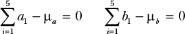
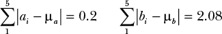
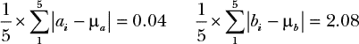
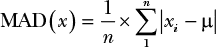
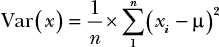
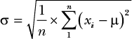
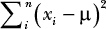

## 第十一章：**衡量数据的分布**

在本章中，您将学习三种不同的方法——平均绝对偏差、方差和标准差——用于量化观察值的*分布*，或是观察值的不同极端。

在上一章中，您学习到均值是猜测未知测量值的最佳方法，而我们的观察值越分散，我们对均值的估计就越不确定。举个例子，如果我们仅根据两辆车拖走后的残留碎片的分布来推测车祸发生的位置，那么碎片分布越广，我们就越不确定两辆车到底在什么地方发生了碰撞。

因为我们的观察值的分布与测量的不确定性相关，所以我们需要能够量化它，以便可以对我们的估计做出概率性的陈述（您将在下一章学习如何做这件事）。

### 往井里丢硬币

假设您和一个朋友在树林里闲逛，偶然发现一个看起来很奇怪的旧井。您往井里看，发现它似乎没有底。为了测试井的深度，您从口袋里拿出一枚硬币并把它丢进去，果然，几秒钟后您听到了水花的声音。由此，您得出结论，井很深，但并不是没有底。

排除超自然因素后，您和您的朋友现在都同样好奇井到底有多深。为了收集更多的数据，您从口袋里拿出五枚硬币并将它们投入井中，得到了以下几次测量结果（单位：秒）：

3.02, 2.95, 2.98, 3.08, 2.97

正如预期的那样，您发现结果有一些变化；这主要是因为确保从相同的高度和时间丢下硬币，并且准确记录水花的过程充满挑战。

接下来，您的朋友也想试着进行一些测量。与其挑选五枚大小相近的硬币，他拿起了一些形状各异的物体，从小石子到树枝都有。将它们投入井中，您的朋友得到了以下测量结果：

3.31, 2.16, 3.02, 3.71, 2.80

这两个样本的均值（μ）大约都是 3 秒钟，但您的测量值和您朋友的测量值的分布程度不同。本章的目标是找出一种方法，量化您和您朋友测量值分布的差异。我们将在下一章中使用这个结果，来确定我们估计值的某些范围的概率。

在本章的其余部分，我们将用变量*a*表示第一组值（您的观察值），用变量*b*表示第二组值（您朋友的观察值）。对于每一组，每个观察值都会有一个下标；例如，*a*[2]表示组*a*中的第二个观察值。

### 寻找平均绝对偏差

我们将从测量每个观测值与均值（μ）之间的差异开始。组*a*和组*b*的均值都是 3。由于μ是我们对真实值的最佳估计，从均值到每个观测值的距离可以作为量化这两个数据分布差异的起点。表 11-1 显示了每个观测值及其与均值的距离。

**表 11-1：** 你和你朋友的观测值及其与均值的差异

| **观测值** | **与均值的差异** |
| --- | --- |
| **组*a*** |  |
| 3.02 | 0.02 |
| 2.95 | –0.05 |
| 2.98 | –0.02 |
| 3.08 | 0.08 |
| 2.97 | –0.03 |
| **组*b*** |  |
| 3.31 | 0.31 |
| 2.16 | –0.84 |
| 3.02 | 0.02 |
| 3.71 | 0.71 |
| 2.80 | –0.16 |

**注意**

*与误差值不同，均值的距离是从真实值的距离，而真实值在这种情况下是未知的。*

量化两个数据分布差异的初步方法可能是直接将它们与均值的差异相加。然而，当我们尝试这个方法时，我们发现两个观测集的差异和是完全相同的，这很奇怪，因为两个数据集的分布差异明显：

我们不能简单地将与均值的差异相加的原因与均值本身的作用有关：正如我们在第十章中所知，误差往往相互抵消。我们需要的是一种数学方法，确保我们的差异在不影响测量有效性的情况下不会相互抵消。

差异相互抵消的原因是一些是负值，一些是正值。所以，如果我们将所有差异转换为正数，我们可以在不影响数值有效性的情况下解决这个问题。

最明显的做法是取差异的*绝对值*；这是该数值与 0 之间的距离，因此 4 的绝对值为 4，–4 的绝对值也为 4。这样我们就得到了负数的正值，而没有改变它们的本质。表示绝对值时，我们将数值用竖线括起来，如| –6 | = | 6 | = 6。

如果我们取表 11-1 中差异的绝对值，并将这些数值代入计算，我们得到一个可以继续使用的结果：

尝试手动计算，应该能得到相同的结果。这是我们特定情况中更有用的方法，但仅适用于两个样本组大小相同的情况。

假设我们有更多 40 个数据点来自组*a*—假设 20 个数据点为 2.9，20 个数据点为 3.1。即使有了这些额外的观测数据，组*a*的数据看起来比组*b*的分布更集中，但组*a*的绝对和现在是 85.19，仅仅因为它有更多的观测数据！

为了纠正这一点，我们可以通过除以观测值的总数来标准化我们的值。不过，我们不会直接进行除法，而是通过乘以总数的倒数，这被称为*乘以倒数*，其形式如下：

现在我们有了一个不依赖于样本大小的分布度量！这个方法的推广如下：

在这里，我们已经计算了观测值与均值之间的绝对差异的均值。这意味着，对于组*a*，平均观测值距离均值为 0.04，对于组*b*，则大约为 0.416 秒。我们将这个公式的结果称为*平均绝对偏差（MAD）*。MAD 是一个非常有用且直观的衡量标准，用于表示观测值的分布情况。鉴于组*a*的 MAD 为 0.04，而组*b*大约为 0.4，我们现在可以说，组*b*的分布大约是组*a*的 10 倍。

### 求方差

另一种在不失真数据的情况下使所有差异为正值的数学方法是将其平方：(*x[i]* – μ)²。与使用 MAD 相比，这种方法至少有两个好处。

第一个好处有点学术性：平方值在数学上比取绝对值更容易处理。在本书中，我们不会直接利用这一点，但对数学家来说，绝对值函数在实践中可能会有些麻烦。

第二个，更实际的原因是，平方会产生*指数惩罚*，意味着与均值相差较远的测量值会受到更大的惩罚。换句话说，小的差异不像大的差异那样重要，这也是我们直观上能够感受到的。如果有人把你的会议安排在错误的房间，比如，如果你最终进入了离正确房间很近的房间，你可能不会太生气；但如果你被送到了另外一个城市的办公室，你几乎肯定会感到不满。

如果我们将绝对值替换为平方差，我们得到如下公式：

这个公式在概率学的研究中占有非常特殊的地位，它被称为*方差*。请注意，方差的公式与 MAD 完全相同，唯一的不同是，MAD 中的绝对值函数被替换为平方函数。由于方差具有更好的数学性质，因此在概率学的研究中，方差比 MAD 使用得更频繁。我们可以通过计算方差来看到我们的结果有多么不同：

Var(group *a*) = 0.002, Var(group *b*) = 0.269

然而，因为我们在进行平方运算，所以我们不再能直观地理解方差结果的含义。MAD 给出了一个直观的定义：这是与均值的平均距离。方差则说：这是平均平方差。回想一下，当我们使用 MAD 时，组 *b* 的分布大约比组 *a* 大 10 倍，但在方差的情况下，组 *b* 的分布现在是 100 倍！

### 求标准差

虽然理论上方差有许多使其有用的特性，但在实际应用中它可能很难解读结果。人们很难理解 0.002 秒平方的差异意味着什么。正如我们所提到的，MAD 的好处在于其结果非常符合我们的直觉。如果组 *b* 的 MAD 是 0.4，那就意味着任何给定观测值与均值之间的平均距离确实是 0.4 秒。但对平方差进行平均时，我们就很难像 MAD 那样理性地思考结果。

为了解决这个问题，我们可以对方差取平方根，以便将其缩放回更符合我们直觉的数值。方差的平方根叫做*标准差*，用希腊字母小写西格玛（σ）表示。它的定义如下：

标准差的公式并不像一开始看起来那么可怕。仔细看看所有不同的部分，考虑到我们的目标是通过数字表示数据的分散程度，我们可以看到：

1.  我们想要的是数据与均值之间的差异，*x[i]* – μ。

1.  我们需要将负数转换为正数，因此我们取平方，(*x[i]* – μ)²。

1.  我们需要把所有的差值加起来：

1.  我们不希望求和结果受到观测数量的影响，因此我们使用 1/*n*进行标准化。

1.  最后，我们对所有的数值取平方根，这样数字就会更接近如果我们使用更直观的绝对距离时的数值。

如果我们查看两组的标准差，就会发现它与 MAD 非常相似。

σ(组 *a*) = 0.046, σ(组 *b*) = 0.519

标准差是 MAD 的直观性与方差的数学简便性之间的一个平衡。请注意，就像在 MAD 中一样，*b*和*a*之间的分布差异是 10 的倍数。标准差如此有用且无处不在，以至于在大多数概率和统计学文献中，方差通常仅定义为σ²，或称为西格玛平方！

现在我们有了三种不同的测量数据分布的方法。我们可以在表 11-2 中看到这些结果。

**表 11-2：** 按方法测量的分布

| **测量分布的方法** | **组 *a*** | **组 *b*** |
| --- | --- | --- |
| 平均绝对偏差 | 0.040 | 0.416 |
| 方差 | 0.002 | 0.269 |
| 标准差 | 0.046 | 0.519 |

这些测量分布的方法没有哪个比其他更正确。迄今为止，最常用的值是标准差，因为我们可以结合均值使用它来定义正态分布，而正态分布反过来又允许我们为测量值的可能真实值定义明确的概率。在下一章中，我们将介绍正态分布，并看看它如何帮助我们理解对测量结果的信心水平。

### 总结

在这一章中，你学习了三种量化一组观察值分布的方法。最直观的分布测量方法是平均绝对偏差（MAD），它是每个观察值与均值的平均距离。虽然直观，但与其他方法相比，MAD 在数学上并不那么有用。

数学上首选的方法是方差，它是我们观察值的平方差。然而，当我们计算方差时，我们会失去对计算结果的直观理解。

我们的第三个选择是使用标准差，它是方差的平方根。标准差在数学上有用，并且能给出合理直观的结果。

### 习题

尝试回答以下问题，看看你对这些不同的分布测量方法理解得如何。解答可以在 *[`nostarch.com/learnbayes/`](https://nostarch.com/learnbayes/)* 中找到。

1.  方差的一个好处是，平方差异使得惩罚呈指数级增长。举一些例子，说明这种性质在什么情况下是有用的。

1.  计算以下值的均值、方差和标准差：1, 2, 3, 4, 5, 6, 7, 8, 9, 10。
