## 第十二章：**正态分布**


在前两章中，你学到了两个非常重要的概念：均值（μ），它使我们能够从多次观察中估算一个测量值；标准差（σ），它使我们能够衡量观察结果的分散程度。

每个概念单独来看都很有用，但结合在一起时，它们的威力更大：我们可以将它们作为最著名的概率分布——*正态分布*的参数。

在这一章中，你将学习如何使用正态分布来确定关于某个估算值的确切概率，看看它与其他估算值相比的可信度。参数估计的真正目标不仅仅是估算一个值，而是为一组*可能值*分配一个概率。这使得我们可以对不确定的值进行更复杂的推理。

在前一章中我们已经确定，均值是基于现有数据估算未知值的可靠方法，而标准差可以用来衡量数据的分散程度。通过衡量我们观察值的分散程度，我们可以确定对均值的信心水平。可以理解的是，观察值越分散，我们对均值的信心就越小。正态分布使我们能够精确量化在考虑到我们的观察结果时，我们在各种信念中有多么确定。

### 为了邪恶目的测量引线

想象一个留着胡子的卡通反派，他想引爆炸弹打破银行金库的门。不幸的是，他只有一颗炸弹，而且炸弹相当大。他知道，如果他离炸弹 200 英尺远，他就可以安全逃生。这需要他 18 秒钟的时间。如果他离炸弹太近，就有死亡的风险。

尽管反派只有一颗炸弹，但他有六根相同大小的引线，因此他决定测试其中五根引线，最后一根留给炸弹。这些引线大小相同，燃烧时间也应该相同。他点燃每根引线并测量燃烧的时间，以确保他有 18 秒钟的时间逃跑。当然，由于匆忙，测量结果有些不一致。以下是他记录的每根引线燃烧所需的时间（单位：秒）：19、22、20、19、23。

到目前为止一切顺利：没有一根引线的燃烧时间少于 18 秒。计算均值得到μ = 20.6，计算标准差得到σ = 1.62。

但现在我们想要确定一个具体的概率，即根据我们观察到的数据，引线在*少于*18 秒内引爆的可能性。因为反派更重视自己的生命而非金钱，他希望自己有 99.9%的把握能在爆炸中生还，否则他就不会尝试抢劫。

在第十章中，你了解到均值是给定一组测量值时对真实值的良好估计，但我们尚未提出任何方法来表达我们*对这个值的信任程度*。

在第十一章中，你了解到可以通过计算标准差来量化观察值的分散程度。这似乎是合乎逻辑的，因为这也可能帮助我们弄清楚均值的替代值有多可能。例如，假设你打破了一个玻璃杯，它碎了。当你清理时，你可能会根据玻璃碎片的分散程度在相邻的房间进行搜索。如果，如图 12-1 所示，碎片非常接近，你会更有信心认为不需要检查下一个房间是否有玻璃碎片。

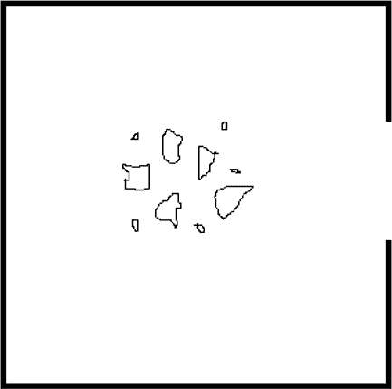

*图 12-1：当碎片靠得很近时，你更能确定清理的地方。*

然而，如果玻璃碎片分布广泛，如图 12-2 所示，即使你没有立即在下一个房间看到玻璃碎片，你也很可能会想要在下一个房间的入口附近进行清扫。同样，如果坏人的引信时间非常分散，即使他没有观察到任何引信在 18 秒以内燃烧，实际上也有可能引信在不到 18 秒的时间内燃尽。

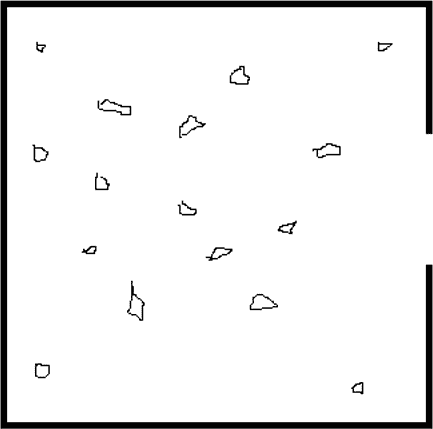

*图 12-2：当碎片分散开时，你无法确定它们可能在哪个位置。*

当观察值在视觉上分散时，我们直观地感到，可能还有其他观察值存在于我们能够看到的极限之外。我们也对中心位置的确定不那么自信。在玻璃的例子中，如果你没有亲眼目睹玻璃掉落，并且玻璃碎片被广泛分散，那么就更难确定玻璃掉落的具体位置。

我们可以用最广泛研究和最著名的概率分布来量化这种直觉：正态分布。

### 正态分布

正态分布是一种连续的概率分布（类似于第五章中的贝塔分布），它最好地描述了在已知均值和标准差的情况下，不确定测量值的可能信度强度。它将 μ 和 σ（均值和标准差）作为其唯一的两个参数。均值 μ = 0 且标准差 σ = 1 的正态分布呈钟形，如图 12-3 所示。

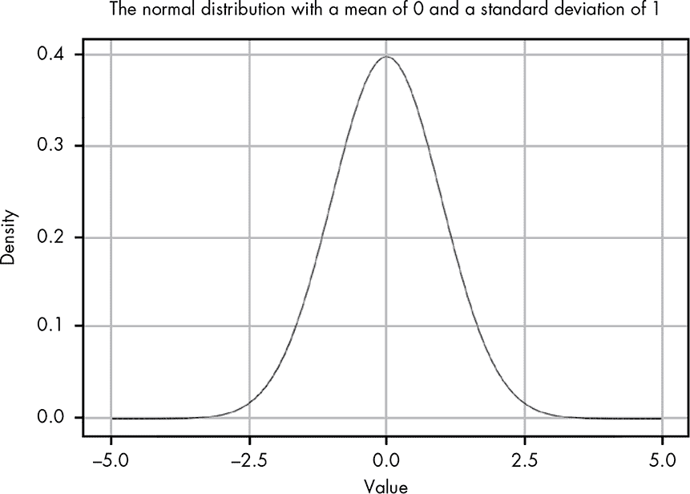

*图 12-3：一个均值 μ = 0 且标准差 σ = 1 的正态分布*

如你所见，正态分布的中心是它的均值。正态分布的宽度由其标准差决定。图 12-4 和 12-5 分别展示了均值 μ = 0 和标准差 σ = 0.5 和 2 的正态分布。

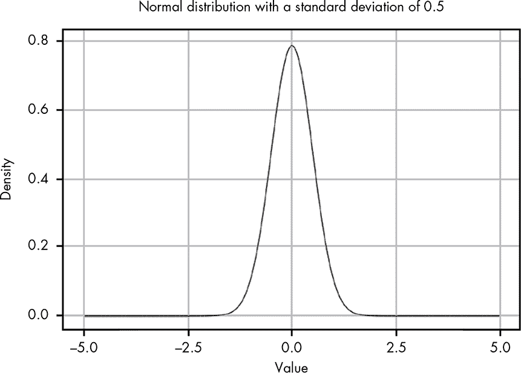

*图 12-4：一个均值 μ = 0 且标准差 σ = 0.5 的正态分布*

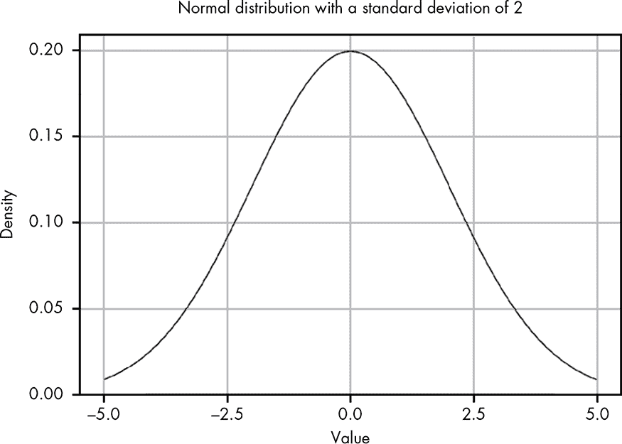

*图 12-5：一个均值为μ = 0，标准差为σ = 2 的正态分布*

当标准差缩小时，正态分布的宽度也会缩小。

正态分布，正如我们所讨论的，反映了我们对均值的信任程度。因此，如果我们的观察值更加分散，我们会相信可能值的范围更广，并且对中心均值的信心较低。相反，如果我们的所有观察值差不多（即σ较小），我们会认为我们的估计相当准确。

当我们对一个问题知道的*唯一*信息仅仅是我们观察到的数据的均值和标准差时，正态分布是最诚实的信念状态的表示。

### 解决保险丝问题

回到我们最初的问题，我们有一个均值为μ = 20.6，标准差为σ = 1.62 的正态分布。除了记录的燃烧时间，我们实际上并不知道保险丝的其他特性，所以我们可以使用观察到的均值和标准差来模拟数据，使用正态分布（参见图 12-6）。

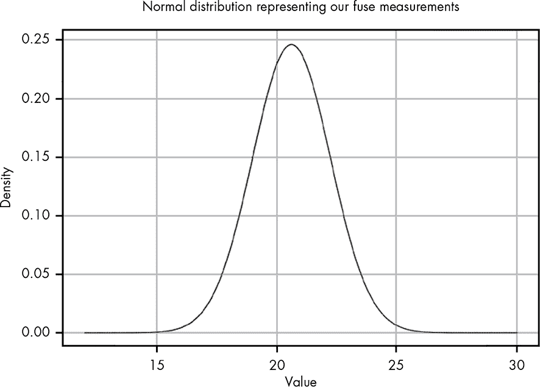

*图 12-6：一个均值为μ = 20.6，标准差为σ = 1.62 的正态分布*

我们要回答的问题是：根据已观察到的数据，保险丝持续 18 秒或更短时间的概率是多少？为了解决这个问题，我们需要使用概率密度函数（PDF），这是你在第五章首次接触的概念。正态分布的 PDF 是：

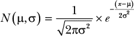

要得到概率，我们需要对小于 18 的值进行*积分*：

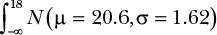

你可以将积分想象成简单地求出你感兴趣的区域下的曲线面积，如图 12-7 所示。

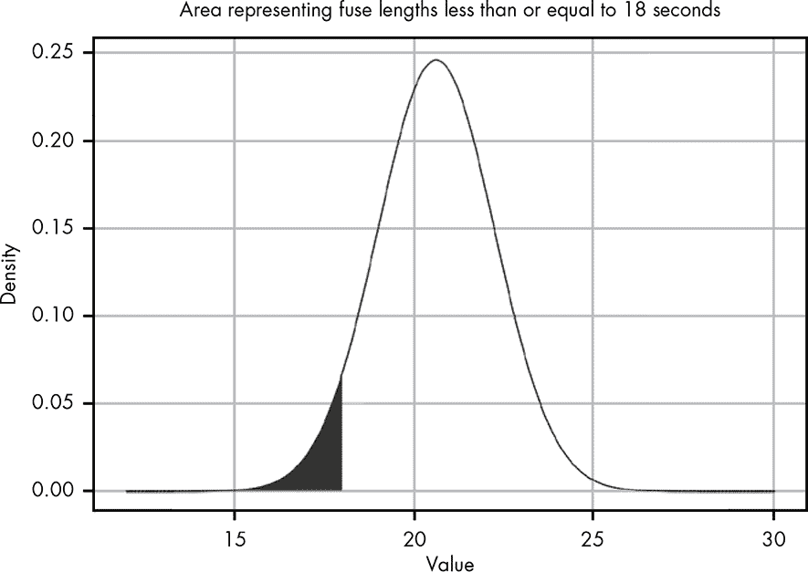

*图 12-7：我们感兴趣的曲线下的区域*

这一区域的面积表示保险丝在给定观察条件下持续 18 秒或更短时间的概率。注意，尽管观察到的所有值都不小于 18，但由于观察值的分布，图 12-6 中的正态分布仍然显示 18 秒或更短时间是可能的。通过对所有小于 18 的值进行积分，我们可以计算出保险丝*不会*持续到我们所需的时间的概率。

手动对这个函数进行积分并不是一项容易的任务。幸运的是，我们有 R 来为我们进行积分。

但在我们开始积分之前，我们需要确定从哪个数字开始积分。正态分布定义在从负无穷（–∞）到正无穷（∞）的所有可能值的范围内。所以从理论上讲，我们想要的是什么呢：

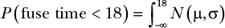

但显然，我们无法在计算机上从负无穷大积分我们的函数！幸运的是，正如你在图 12-6 和 12-7 中看到的，概率密度函数会非常迅速地变成一个极小的值。我们可以看到，PDF 中的线条在 10 附近几乎是平的，这意味着该区域几乎没有概率，因此我们可以从 10 积分到 18。我们也可以选择一个更低的值，比如 0，但由于该区域的概率几乎为零，这不会对我们的结果产生任何实质性的影响。在下一节中，我们将讨论一个启发式方法，它可以让选择下限或上限变得更加容易。

我们将使用 R 的`integrate()`函数和`dnorm()`函数（它只是 R 中用于正态分布 PDF 的函数）来对这个函数进行积分，并计算正态分布的 PDF，如下所示：

```
integrate(function(x) dnorm(x,mean=20.6,sd=1.62),10,18)

0.05425369 with absolute error < 3e-11
```

将值四舍五入，我们可以看到*P*(保险丝时间 < 18) = 0.05，告诉我们保险丝有 5%的几率在 18 秒或更短时间内烧断。即使是恶棍也珍惜自己的生命，在这种情况下，我们的恶棍只有在 99.9%确定自己能安全逃离爆炸时才会尝试银行抢劫。那么今天，银行是安全的！

正态分布的强大之处在于，我们可以以概率的方式推理均值的各种可能替代方案，从而让我们了解均值的现实性。每当我们只知道均值和标准差时，我们都可以使用正态分布来推理数据。

然而，这也是正态分布的危险所在。实际上，如果你在问题中有除了均值和标准差之外的信息，通常最好利用这些信息。我们将在后续的章节中看到这个例子。

### 一些技巧与直觉

尽管 R 使得积分正态分布比手工解积分要容易得多，但当你处理正态分布时，有一个非常有用的技巧，可以进一步简化问题。对于*任何*具有已知均值和标准差的正态分布，你可以通过σ来估算均值周围的曲线下的面积。

例如，从μ - σ（均值减去一个标准差）到μ + σ（均值加上一个标准差）范围内的曲线下的面积包含了分布的 68%的质量。

这意味着 68%的可能值落在均值的±一个标准差范围内，如图 12-8 所示。

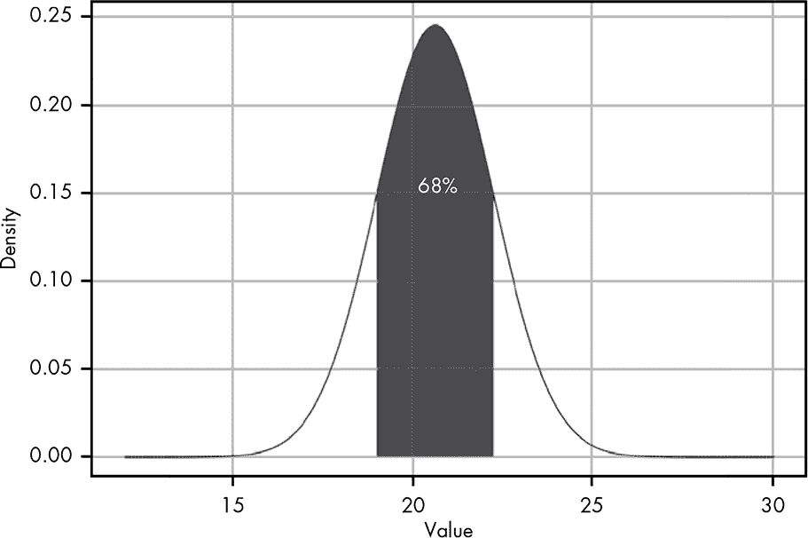

*图 12-8：68%的概率密度（曲线下的面积）位于均值的一个标准差范围内。*

我们可以继续通过将均值的距离增加为σ的倍数。 表 12-1 给出了这些其他区域的概率。

**表 12-1：** 不同均值下的曲线下的面积

| **均值的距离** | **概率** |
| --- | --- |
| σ | 68 百分比 |
| 2σ | 95 百分比 |
| 3σ | 99.7 百分比 |

这个小技巧非常有用，可以快速评估即使在样本较小的情况下，一个值的可能性。你只需要一个计算器，就可以轻松算出μ和σ，这意味着你甚至在开会中也能做出相当准确的估算！

举个例子，在第十章中测量降雪量时，我们得到了以下数据：6.2、4.5、5.7、7.6、5.3、8.0、6.9。对于这些数据，均值是 6.31，标准差是 1.17。这意味着我们可以有 95% 的把握，真实的降雪量介于 3.97 英寸（6.31 - 2 × 1.17）和 8.65 英寸（6.31 + 2 × 1.17）之间。无需手动计算积分或启动计算机使用 R！

即使我们 *确实* 想用 R 来进行积分，这个技巧也可以帮助我们确定积分的最小值或最大值。例如，如果我们想知道反派的炸弹引线能持续超过 21 秒的概率，我们不想从 21 积分到无穷大。我们可以用什么作为我们的上界？我们可以从 21 积分到 25.46（即 20.6 + 3 × 1.62），这相当于距离均值 3 个标准差。从均值偏离 3 个标准差将涵盖我们总概率的 99.7%。剩下的 0.3% 位于分布的两侧，所以只有一半，也就是 0.15% 的概率密度，位于大于 25.46 的区域。因此，如果我们从 21 积分到 25.46，我们的结果将仅少量遗漏一些概率。显然，我们完全可以使用 R 从 21 积分到一个更安全的值，比如 30，但这个技巧帮助我们理解“真正安全”意味着什么。

### “N Sigma” 事件

你可能听过用 *sigma 事件* 来描述某个事件，比如“股价下跌是一个八 sigma 事件。”这个表达的意思是，观察到的数据距离均值有八个标准差。从表 12-1 中我们看到，均值上下的一个、两个和三个标准差分别对应 68%、95% 和 99.7% 的概率。从这些数据你可以直观地理解，一个八 sigma 事件一定是极不可能发生的。实际上，如果你观察到的数据距离均值有五个标准差，那么很可能意味着你的正态分布没有准确地模拟基础数据。

为了展示随着 *n* sigma 增加事件的稀有性变化，假设你正在观察某一天可能会发生的事件。有些事件非常常见，比如醒来看到日出。其他则不那么常见，比如醒来发现今天是你的生日。表 12-2 显示了每增加一个 sigma，预期事件发生所需要的天数。

**表 12-2：** 事件的稀有性随着 *n* Sigma 增加而变化

| **(–/+) 距离均值** | **预期每……** |
| --- | --- |
| σ | 3 天 |
| 2σ | 3 周 |
| 3σ | 1 年 |
| 4σ | 4 十年 |
| 5σ | 5000 年 |
| 6σ | 140 万年 |

所以，三西格玛事件就像是醒来发现今天是你的生日，而六西格玛事件则像是醒来发现一颗巨大的小行星正朝地球撞来！

### 贝塔分布与正态分布

你可能还记得在第五章中，贝塔分布让我们在观察到α个期望结果和β个非期望结果后估计真实的概率，其中总的结果数为α + β。基于这一点，你可能对以下观点提出质疑：正态分布真的是建模参数估计的最佳方法吗，尤其是在我们仅知道某个数据集的均值和标准差的情况下。毕竟，我们可以描述一个情形，其中α = 3，β = 4，只需观察到三个值为 1 的结果和四个值为 0 的结果即可。这将给我们μ = 0.43 和σ = 0.53。然后，我们可以将α = 3 和β = 4 的贝塔分布与μ = 0.43 和σ = 0.53 的正态分布进行比较，如图 12-9 所示。

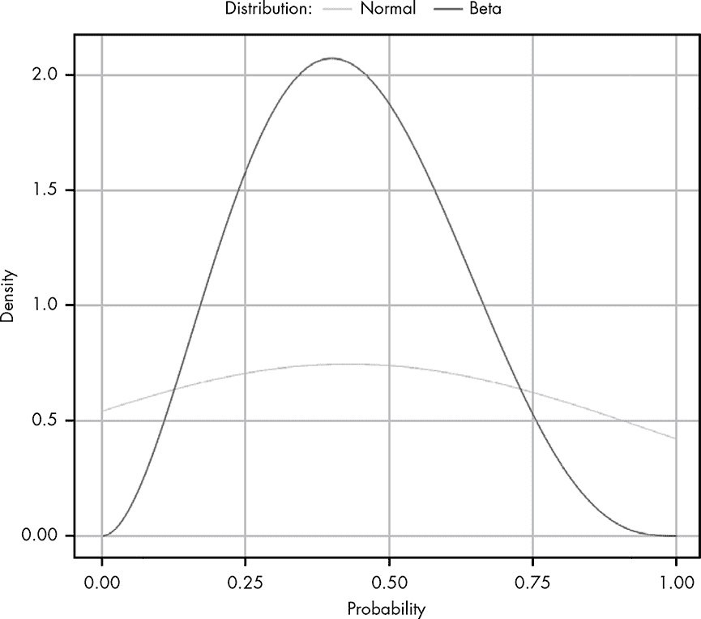

*图 12-9：比较贝塔分布与正态分布*

很明显，这些分布是非常不同的。我们可以看到，对于这两种分布，质量中心大致位于同一位置，但正态分布的边界远远超出了我们图表的范围。这表明一个关键点：只有在你对数据一无所知，除了它的均值和方差时，才可以假设数据服从正态分布。

对于贝塔分布，我们知道我们所寻找的值必须位于 0 到 1 之间。正态分布定义从–∞到∞，这通常包括一些不可能存在的值。然而，在大多数情况下，这并不重要，因为在概率意义上，极端的测量值几乎是不可能的。但对于我们测量事件发生概率的例子来说，这些缺失的信息对建模我们的问题是重要的。

所以，尽管正态分布是一个非常强大的工具，但它无法替代对问题的更多信息的了解。

### 总结

正态分布是使用均值估计观察值的扩展。正态分布将均值和标准差结合起来，模拟我们的观察值与均值之间的分布。这一点很重要，因为它允许我们以概率的方式推理测量中的误差。我们不仅可以使用均值做出最佳猜测，还可以对估计值的可能范围做出概率性陈述。

### 练习

尝试回答以下问题，以了解你对正态分布的理解程度。解决方案可以在*[`nostarch.com/learnbayes/`](https://nostarch.com/learnbayes/)*找到。

1.  观察到一个值比平均值大五个标准差或更多的概率是多少？

1.  发热是指温度高于 100.4 华氏度。根据以下测量值，患者发热的概率是多少？

    100.0, 99.8, 101.0, 100.5, 99.7

1.  假设在第十一章中，我们尝试通过计时投掷硬币来测量井的深度，并得到了以下数值：

    2.5, 3, 3.5, 4, 2

    一个物体下落的距离可以通过以下公式计算（单位：米）：

    distance = 1/2 × G × time²

    其中 G 为 9.8 米/秒²。井深超过 500 米的概率是多少？

1.  没有井的概率是多少（即井的深度为 0 米）？你会注意到，这个概率比你预期的要高，考虑到你观察到*确实*有井。对于这个概率比预期高，有两个合理的解释。第一个是正态分布模型不适用于我们的测量；第二个是，在举例时我选择了你在现实生活中不太可能看到的数值。你认为哪个更有可能？
