## 第十三章：参数估计的工具：PDF、CDF 和分位数函数**


目前为止，我们重点关注了正态分布的构建块及其在参数估计中的应用。在本章中，我们将深入探讨一些数学工具，帮助我们对参数估计做出更精确的推断。我们将通过一个实际问题，展示如何使用各种度量、函数和可视化方法从不同角度来解决它。

本章将深入讨论概率密度函数（PDF）；介绍累积分布函数（CDF），它帮助我们更容易地确定值的范围概率；并介绍分位数，它将我们的概率分布分成具有相等概率的部分。例如，*百分位数*是 100 分位数，意味着它将概率分布分成 100 个相等的部分。

### 估计邮件注册列表的转化率

假设你经营一个博客，并想知道访问你博客的用户订阅你邮件列表的概率。从营销的角度来看，让用户执行一个期望的事件被称为*转化事件*，或简称*转化*，而用户订阅的概率就是*转化率*。

正如在第五章中讨论的那样，当我们知道*订阅人数*（k）和*总访问人数*（n）时，我们会使用贝塔分布来估计*p*，即订阅的概率。贝塔分布所需的两个参数是α，在本例中表示总的订阅人数（*k*），和β，表示未订阅的人数（*n* - *k*）。

当介绍贝塔分布时，你只了解了它的基本外观和行为方式。现在，你将看到如何将其作为参数估计的基础。我们不仅要为我们的转化率做出单一的估计，还要得出一个可能值范围，在这个范围内我们可以非常自信地认为真实的转化率落在其中。

### 概率密度函数

我们将使用的第一个工具是概率密度函数。到目前为止，我们在本书中已经多次见到过 PDF：在第五章中，我们讨论了贝塔分布；在第九章中，我们使用 PDF 来结合贝叶斯先验；在第十二章中，我们再次讨论了正态分布。PDF 是一个函数，它接受一个值并返回该值的概率。

在估计你邮件列表的真实转化率时，假设在前 40,000 个访问者中，你获得了 300 个订阅者。我们问题的 PDF 是贝塔分布，其中α = 300，β = 39,700：

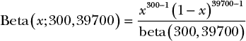

我们花了很多时间讨论在给定一定不确定性的情况下，使用均值作为衡量标准的好处。大多数 PDF 都有一个均值，我们可以通过如下方法专门为贝塔分布计算均值：

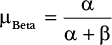

这个公式相对直观：只需将我们关心的结果数（300）除以所有结果的总数（40,000）。这与如果我们将每封邮件看作是 1 的观测值，其他邮件看作是 0 的观测值并对它们求平均时得到的均值是一样的。

均值是我们估算真实转化率参数的第一次尝试。但我们仍然希望了解转化率的其他可能值。让我们继续探索 PDF，看看还能学到什么。

#### *可视化和解读 PDF*

PDF 通常是理解概率分布的首选方法。图 13-1 展示了博客转化率的贝塔分布的 PDF。

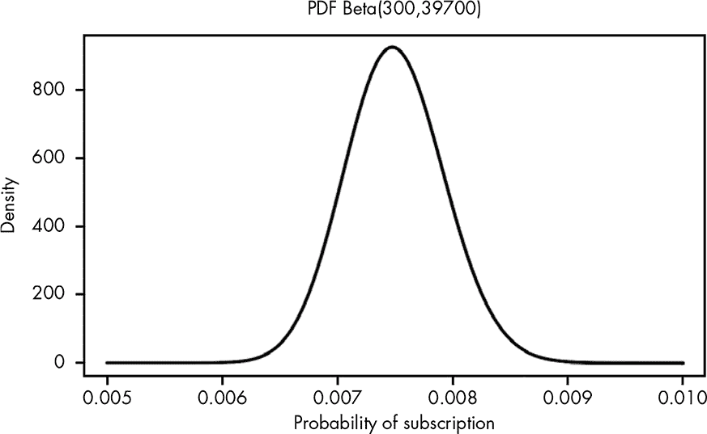

*图 13-1：可视化我们对真实转化率的贝塔 PDF 的信念*

这个 PDF 代表了什么？从数据中我们知道，博客的平均转化率就是

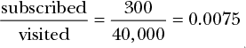

或者说，我们分布的*均值*。转化率*恰好*为 0.0075 的可能性似乎不大，而是比如 0.00751。我们知道，PDF 下的总面积必须加起来为 1，因为这个 PDF 代表了所有可能估计的概率。我们可以通过观察我们关心的范围内 PDF 下的面积，估算我们真实转化率的取值范围。在微积分中，这个曲线下的面积就是*积分*，它告诉我们，在我们感兴趣的 PDF 区域内，总概率有多少。这就像我们在前一章中用正态分布做积分一样。

鉴于我们对测量值有不确定性，并且我们已经有了均值，调查真实转化率比我们观察到的均值 0.0075 高或低 0.001 的可能性会很有用。这样做可以为我们提供一个可接受的误差范围（也就是说，我们对这个范围内的任何值都感到满意）。为此，我们可以计算实际转化率低于 0.0065 的概率，以及实际转化率高于 0.0085 的概率，然后进行比较。我们实际转化率远低于观察值的概率可以通过如下方式计算：

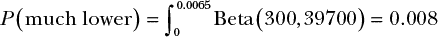

记住，当我们对一个函数进行积分时，我们实际上是在将函数的所有小部分相加。所以，如果我们对α为 300、β为 39,700 的贝塔分布从 0 到 0.0065 进行积分，我们实际上是在将这一范围内所有值的概率加起来，并确定我们真实的转化率位于 0 到 0.0065 之间的概率。

我们也可以提出有关另一个极端的问题，例如：我们是否有可能获得一个异常糟糕的样本，导致我们的真实转化率实际上更高，比如大于 0.0085（意味着转化率比我们预期的更好）？

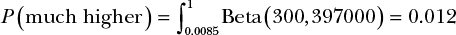

在这里，我们从 0.0085 到最大可能值 1 进行积分，以确定我们的真实值落在这个范围内的概率。因此，在这个例子中，我们观察到的转化率高出 0.001 或更多的概率，实际上比它低于 0.001 或更糟的概率要大。这意味着，如果我们必须在有限的数据下做出决定，我们仍然可以计算出一个极端比另一个极端更可能的程度：

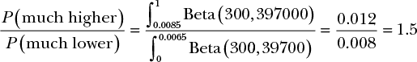

因此，我们的真实转化率大于 0.0085 的概率比低于 0.0065 的概率高出 50%。

#### *在 R 中使用 PDF*

在本书中，我们已经使用了两个 R 函数来处理 PDF（概率密度函数），分别是`dnorm()`和`dbeta()`。对于大多数常见的概率分布，R 支持一个等效的`dfunction()`函数来计算 PDF。

像`dbeta()`这样的函数也用于近似连续 PDF，例如，当你想快速绘制像这样的值时：

```
xs <- seq(0.005,0.01,by=0.00001)

xs.all <- seq(0,1,by=0.0001)

plot(xs,dbeta(xs,300,40000-300),type='l',lwd=3,

     ylab="density",

     xlab="probability of subscription",

     main="PDF Beta(300,39700)")
```

**注意**

*要理解绘图代码，请参阅附录 A。*

在这个示例代码中，我们创建了一个值序列，每个值相差 0.00001——虽然很小，但不像在真正的连续分布中那样无限小。尽管如此，当我们绘制这些值时，我们看到的图形看起来足够接近一个真正的连续分布（如图 13-1 所示）。

### 引入累积分布函数

PDF 的最常见数学用途是积分，用于求解与各种范围相关的概率，就像我们在上一节中做的那样。然而，我们可以通过使用*cdf（累积分布函数）*来节省大量的努力，它将我们的分布的所有部分求和，从而替代了大量的微积分工作。

CDF（累积分布函数）接受一个值并返回该值或更低值的概率。例如，当*x* = 0.0065 时，Beta(300,397000)的 CDF 值约为 0.008。这意味着真实转化率为 0.0065 或更低的概率是 0.008。

CDF 通过计算 PDF 下的累积面积来获得这个概率（对于熟悉微积分的人来说，CDF 是 PDF 的*反导数*）。我们可以将这个过程总结为两步：（1）计算 PDF 每个值下的累积面积，（2）绘制这些值。这就是我们的 CDF。曲线在任何给定 x 值处的值表示获取*x*或更低值的概率。在 0.0065 处，曲线的值为 0.008，就像我们之前计算的那样。

为了理解这一点，我们将问题的 PDF 分成 0.0005 的小块，并关注 PDF 中概率密度最大的区域：0.006 到 0.009 之间的区域。

图 13-2 展示了 Beta(300,39700) PDF 的曲线下的累计面积。如你所见，我们的累计面积考虑了左侧所有区域的面积。

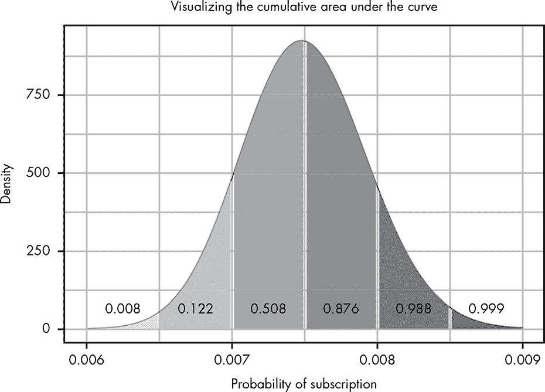

*图 13-2：可视化曲线下的累计面积*

从数学角度讲，图 13-2 表示以下积分序列：

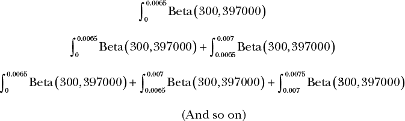

使用这种方法，随着我们沿着 PDF 移动，我们考虑的概率越来越高，直到我们的总面积为 1，或者说是完全的确定性。为了将其转化为 CDF，我们可以想象一个函数，只考虑这些曲线下的区域。图 13-3 展示了如果我们绘制每个点下的面积（这些点相隔 0.0005），会发生什么。

现在我们有了一种可视化方法，可以展示随着我们沿着 PDF 的值移动，曲线下的累计面积是如何变化的。当然，问题在于我们使用的是这些离散的块。在现实中，CDF 只是使用 PDF 的无穷小片段，因此我们得到了一个平滑的曲线（参见图 13-4）。

在我们的例子中，我们直观地推导了 CDF。从数学上推导 CDF 要困难得多，通常会导致非常复杂的方程式。幸运的是，通常我们使用代码来处理 CDF，正如我们在接下来的几个部分中将看到的那样。

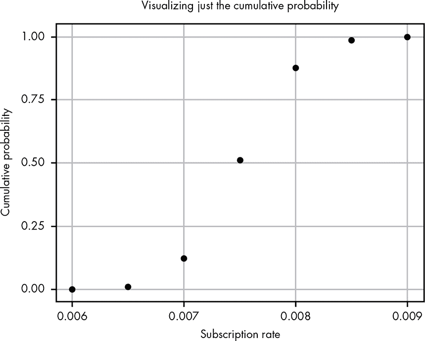

*图 13-3：仅绘制图 13-2 中的累计概率*

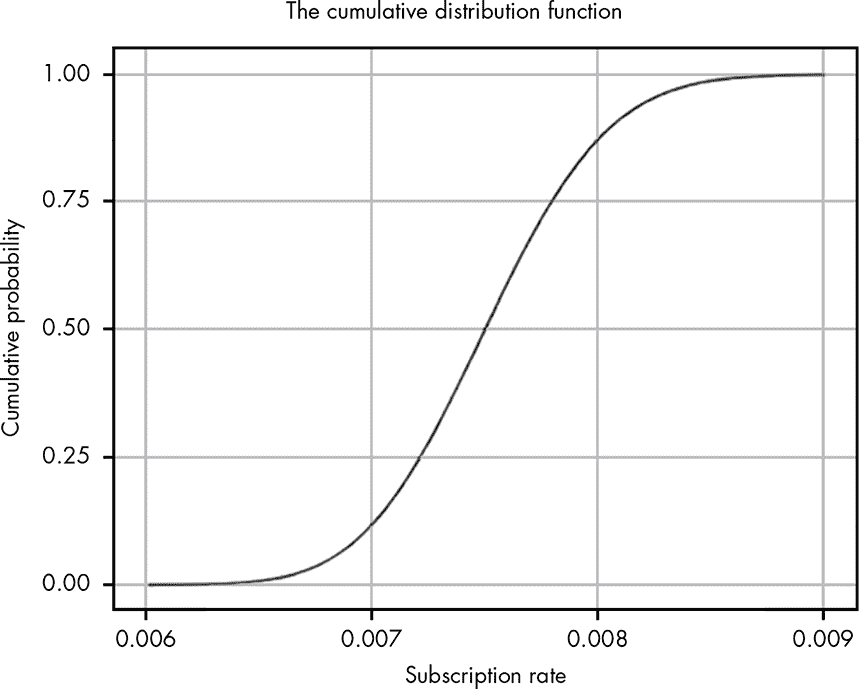

*图 13-4：我们问题的 CDF*

#### *可视化与解释 CDF*

PDF 在视觉上最有用的是快速估计分布的峰值位置，并且大致了解分布的宽度（方差）和形状。然而，使用 PDF 很难通过视觉推断各种范围的概率。CDF 在这方面是一个更好的工具。例如，我们可以使用图 13-4 中的 CDF，直观地推理出比单独使用 PDF 更广泛的概率估计范围。让我们通过几个可视化示例来了解如何使用这个强大的数学工具。

#### *寻找中位数*

中位数是数据中一半值位于一侧，另一半值位于另一侧的点——它是我们数据的确切中间 *值*。换句话说，某个值大于中位数的概率和小于中位数的概率都是 0.5。中位数在数据包含极端值的情况下特别有用，能够很好地总结数据。

与均值不同，计算中位数实际上可能相当复杂。对于小的离散情况，它就像是将观察值排序后选取中间的值那么简单。但对于像我们的贝塔分布这样的连续分布，就要复杂一些。

幸运的是，我们可以在 CDF 的可视化图上轻松找到中位数。我们只需从累积概率为 0.5 的点画一条线，意味着 50%的值在此点以下，50%的值在此点以上。正如图 3-5 所示，这条线与 x 轴交点的地方就是我们的中位数！

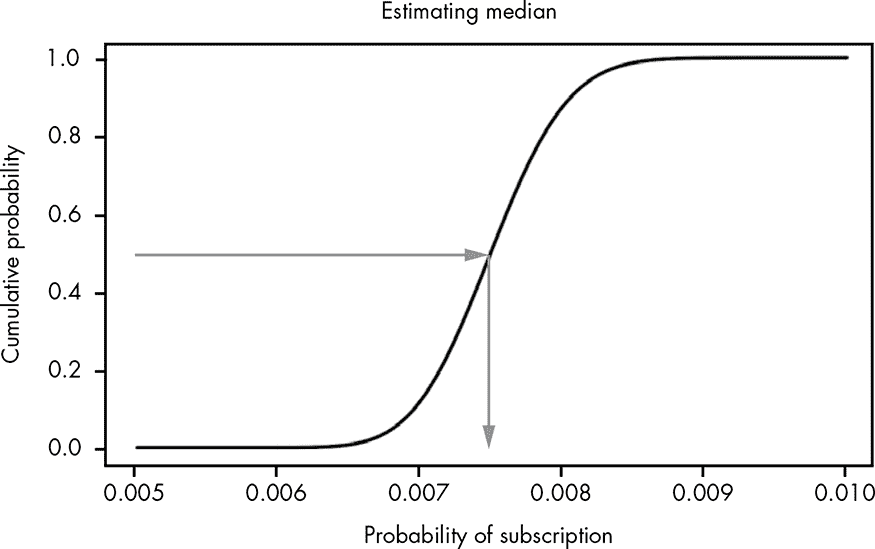

*图 13-5：使用 CDF 直观估计中位数*

我们可以看到数据的中位数大约在 0.007 和 0.008 之间（这恰好非常接近均值 0.0075，意味着数据并没有特别偏斜）。

#### *通过可视化逼近积分*

在处理概率范围时，我们通常需要知道真实值位于某个值*y*和某个值*x*之间的概率。

我们可以通过积分来解决这类问题，但即使 R 使得解决积分变得更容易，理解数据并且不断依赖 R 来计算积分仍然是非常耗时的。由于我们所需要的只是一个粗略的估计，即访客订阅博客的概率落在某个特定范围内，我们并不需要使用积分。累积分布函数（CDF）使得我们非常容易通过观察来判断某个范围的值是否具有很高或很低的发生概率。

为了估计转化率介于 0.0075 和 0.0085 之间的概率，我们可以从 x 轴的这些点画出线条，然后查看它们与 y 轴相交的地方。这两点之间的距离就是近似的积分，如图 13-6 所示。

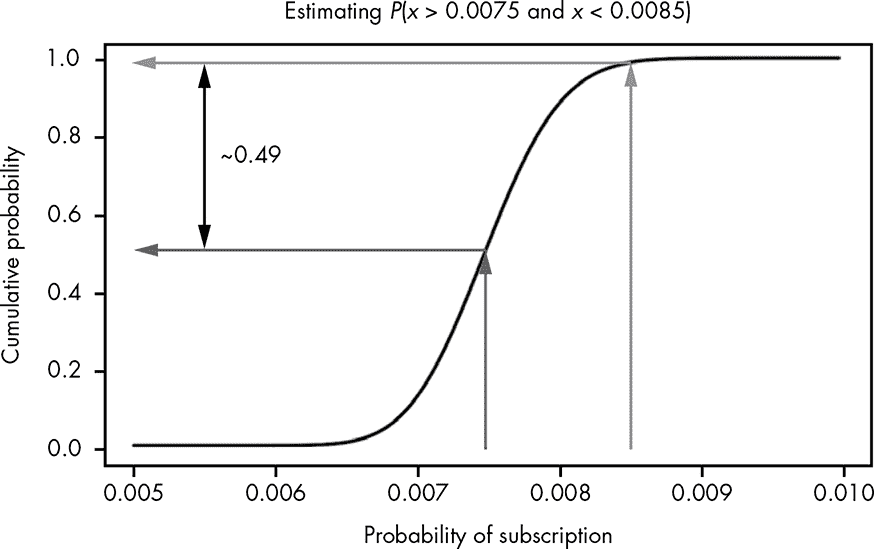

*图 13-6：通过 CDF 直观执行积分*

我们可以看到，在 y 轴上，这些值的范围大约从 0.5 到 0.99，意味着我们的真实转化率位于这两个值之间的概率大约是 49%。最棒的是我们不需要做任何积分！这当然是因为 CDF 表示的是从函数的最小值到所有可能值的积分。

因此，几乎所有关于参数估计的概率性问题都涉及了解某些信念范围相关的概率，CDF 通常比概率密度函数（PDF）更为有用的可视化工具。

#### *估计置信区间*

观察值范围的概率会引导我们到一个非常重要的概率概念：*置信区间*。置信区间是一个值的上下界，通常围绕均值，描述一个高概率范围，通常是 95%、99% 或 99.9%。当我们说“95% 置信区间为 12 到 20”时，我们的意思是我们的真实测量值有 95% 的概率位于 12 和 20 之间。置信区间提供了一种很好的方法来描述在处理不确定信息时的可能范围。

**注意**

*在贝叶斯统计中，我们称之为“置信区间”的东西还有其他一些名字，如“临界区域”或“临界区间”。在一些更传统的统计学派中，“置信区间”有稍微不同的含义，这超出了本书的范围。*

我们可以使用 CDF 来估计置信区间。假设我们想知道覆盖真实转换率 80% 可能值的范围。我们通过结合之前的方法来解决这个问题：我们从 y 轴上的 0.1 和 0.9 画出线条，覆盖 80%的区域，然后简单地查看这些线条与我们的 CDF 在 x 轴上的交点，如 图 13-7 所示。

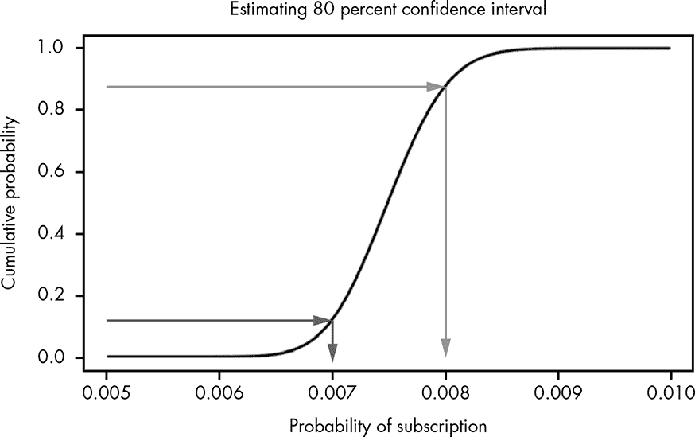

*图 13-7：通过 CDF 直观估计我们的置信区间*

如你所见，x 轴大约在 0.007 和 0.008 处交叉，这意味着我们的真实转换率有 80% 的概率位于这两个值之间。

#### *在 R 中使用 CDF*

就像几乎所有主要的 PDF 函数都以 *d* 开头，例如 `dnorm()`，CDF 函数则以 *p* 开头，如 `pnorm()`。在 R 中，要计算 Beta(300,39700) 小于 0.0065 的概率，我们可以像这样简单地调用 `pbeta()`：

```
pbeta(0.0065,300,39700)

> 0.007978686
```

而要计算转换率大于 0.0085 的真实概率，我们可以这样做：

```
pbeta(1,300,39700) - pbeta(0.0085,300,39700)

> 0.01248151
```

CDF 的一个优点是，无论你的分布是离散的还是连续的，都可以使用。如果我们想确定在五次掷硬币中得到三次或更少正面朝上的概率，例如，我们可以像这样使用二项分布的 CDF：

```
pbinom(3,5,0.5)

> 0.8125
```

### 分位数函数

你可能已经注意到，我们通过 CDF 直观获取的中位数和置信区间不容易通过数学方法计算出来。通过可视化，我们只是从 y 轴画线，然后用这些线来找到 x 轴上的一个点。

从数学上讲，CDF 就像任何其他函数，它接受一个*x*值，通常代表我们试图估算的值，并给出一个*y*值，代表累积概率。但没有明显的方法可以逆向操作；也就是说，我们无法给这个函数一个*y*值来得到*x*值。举个例子，假设我们有一个平方值的函数。我们知道 square(3) = 9，但我们需要一个全新的函数——平方根函数——才能知道 9 的平方根是 3。

然而，逆向操作*正是我们在上一节中做的*，即估算中位数：我们查看 y 轴上的 0.5，然后追溯到 x 轴。我们在视觉上所做的就是计算 CDF 的*反函数*。

虽然在视觉上计算 CDF 的反函数对于估算来说很简单，但我们需要一个单独的数学函数来精确计算它。CDF 的反函数是一个极其常见且有用的工具，称为*分位数函数*。为了计算我们中位数和置信区间的精确值，我们需要使用 beta 分布的分位数函数。就像 CDF 一样，分位数函数在数学上通常很难推导和使用，因此我们通常依赖软件来为我们完成繁重的工作。

#### *可视化和理解分位数函数*

因为分位数函数只是 CDF 的反函数，它看起来就像 CDF 旋转了 90 度，如图 13-8 所示。

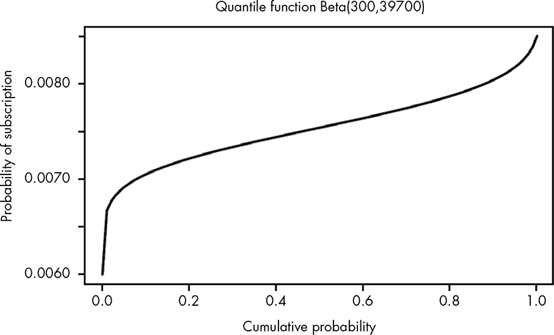

*图 13-8：从视觉上看，分位数函数只是 CDF 的旋转。*

每当你听到类似以下的短语时：

“前 10%的学生...”

“最低 20%的收入者赚得比...还少...”

“最高四分位的表现显著优于...”

你在谈论通过分位数函数找到的值。要通过图形查找分位数，只需在 x 轴上找到你感兴趣的数量，然后查看它与 y 轴相交的地方。y 轴上的值就是该分位数的值。记住，如果你在谈论“前 10%”，实际上你要的是 0.9 分位数。

#### *在 R 中计算分位数*

R 还包括`qnorm()`函数，用于计算分位数。这个函数对于快速回答关于我们概率分布的边界值问题非常有用。例如，如果我们想知道 99.9%的分布小于的值，我们可以使用`qbeta()`，将我们感兴趣的分位数作为第一个参数，beta 分布的 alpha 和 beta 参数作为第二个和第三个参数，像这样：

```
qbeta(0.999,300,39700)

> 0.008903462
```

结果是 0.0089，这意味着我们可以 99.9%确定我们邮件的真实转化率低于 0.0089。接着，我们可以使用分位数函数快速计算我们的估计值的置信区间的确切值。为了找到 95%的置信区间，我们可以找到大于 2.5%下分位数的值和小于 97.5%上分位数的值，它们之间的区间就是 95%的置信区间（未考虑的区域占两端概率密度的 5%）。我们可以使用`qbeta()`轻松计算这些：

我们的下限是`qbeta(0.025,300,39700) = 0.0066781`

我们的上限是`qbeta(0.975,300,39700) = 0.0083686`

现在我们可以有信心地说，我们 95%确定博客访问者的真实转化率介于 0.67%和 0.84%之间。

当然，我们可以根据需要的置信度调整这些阈值。现在我们拥有了所有的参数估计工具，我们可以轻松确定转化率的精确范围。好消息是，我们还可以用这个方法预测未来事件的值范围。

假设你博客上的一篇文章突然火了，得到了 100,000 个访问者。根据我们的计算，我们知道应该期望会有 670 到 840 个新的邮件订阅者。

### 总结

我们已经讨论了很多内容，并探讨了概率密度函数（PDF）、累积分布函数（CDF）和分位数函数之间的有趣关系。这些工具构成了我们如何估计参数并计算我们对这些估计的置信度的基础。这意味着我们不仅可以对一个未知值做出良好的猜测，还可以确定非常强的置信区间，代表一个参数可能的值。

### 练习

尝试回答以下问题，看看你对参数估计工具的理解有多深。解决方案可以在*[`nostarch.com/learnbayes/`](https://nostarch.com/learnbayes/)*找到。

1.  使用第 127 页中绘制 PDF 的代码示例，绘制 CDF 和分位数函数。

1.  回到第十章中测量降雪的任务，假设你有以下的降雪量测量数据（单位：英寸）：

    7.8, 9.4, 10.0, 7.9, 9.4, 7.0, 7.0, 7.1, 8.9, 7.4

    你对于真实降雪量的 99.9%置信区间是多少？

1.  一个孩子正在挨家挨户地卖巧克力棒。到目前为止，她已经拜访了 30 家并卖出了 10 根巧克力棒。今天她还会拜访 40 家。她今天剩下的时间会卖出多少巧克力棒的 95%置信区间是多少？
