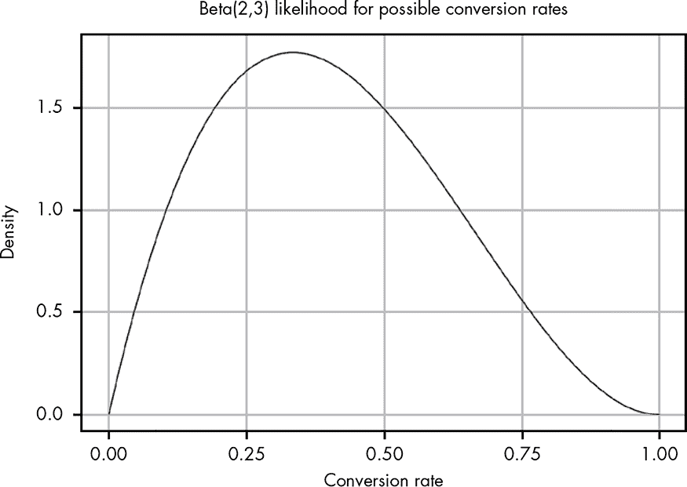
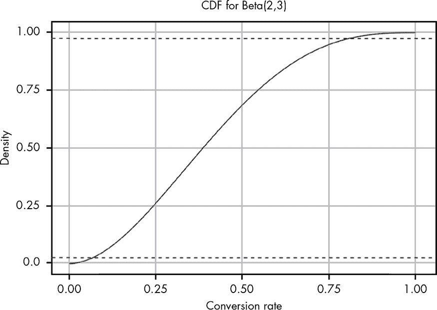
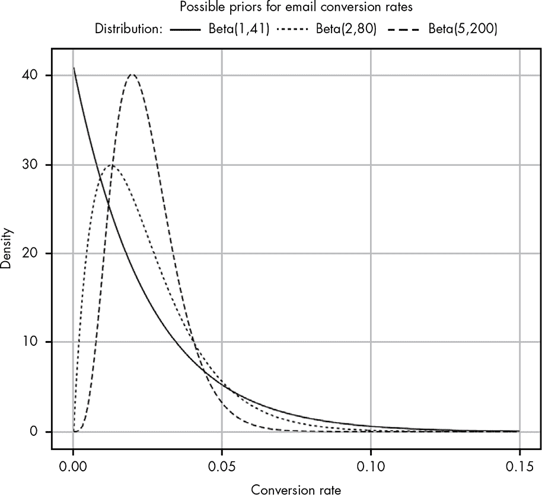
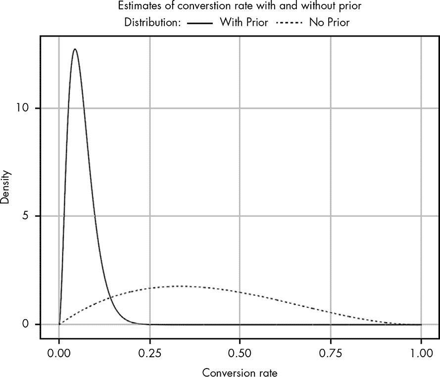
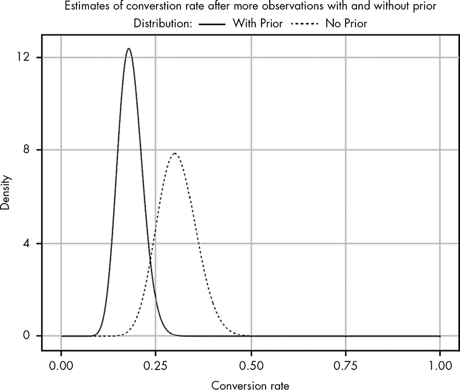
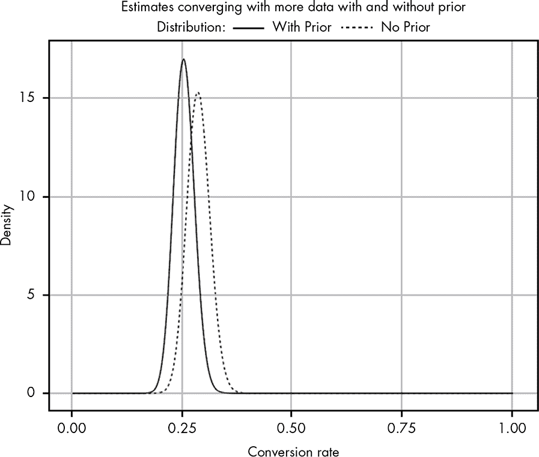
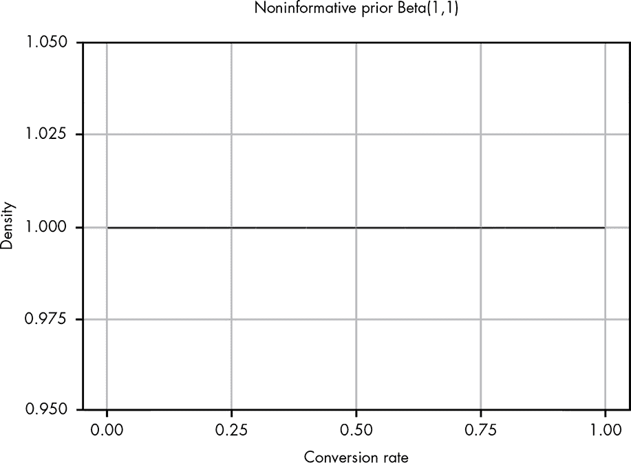

## 第十四章：**带有先验概率的参数估计**

在上一章中，我们看到了如何使用一些重要的数学工具来估计博客访问者订阅电子邮件列表的转化率。然而，我们还没有覆盖参数估计中最重要的部分之一：利用我们对问题的现有信念。

在本章中，你将看到我们如何将先验概率与观察到的数据结合起来，得出一个更好的估计，这个估计将现有知识与我们收集到的数据融合在一起。

### 预测电子邮件转化率

为了理解随着我们获得更多信息，贝塔分布如何变化，我们来看另一个转化率的例子。在这个例子中，我们将尝试确定，当订阅者打开你的邮件时，他们点击链接的概率。大多数提供电子邮件列表管理服务的公司会实时告诉你，有多少人打开了邮件并点击了链接。

目前我们的数据显示，在前五个打开邮件的人中，有两个点击了链接。图 14-1 显示了我们针对这些数据的贝塔分布。

*图 14-1：目前为止我们观察到的贝塔分布*

图 14-1 显示了 Beta(2,3) 分布。我们使用这些数字，因为有两个人点击了链接，三个人没有点击。与上一章中我们有一个相对较窄的可能值峰值不同，在这里，由于我们所掌握的信息非常有限，真实转化率的可能值范围非常广。图 14-2 显示了此数据的 CDF，帮助我们更容易地推理这些概率。

95% 的置信区间（即真实转化率有 95% 的概率落在这个范围内）已经标出，方便查看。在这个点上，我们的数据告诉我们，真实的转化率可能在 0.05 到 0.8 之间！这反映了我们目前为止获得的信息是多么有限。鉴于我们已有两个转化，我们知道真实的转化率不可能是 0；由于我们有三个未转化的例子，我们也知道转化率不可能是 1。几乎所有其他的值都有可能。

*图 14-2：我们观察到的累积分布函数（CDF）*

### 通过先验信息纳入更广泛的背景

但等一下——你可能刚接触电子邮件列表，然而 80% 的点击率听起来相当不太可能。我订阅了很多邮件列表，但我打开邮件时，绝对不可能 80% 的时间都会点击链接。考虑到我自己的行为，拿这个 80% 的点击率当作事实来看，显得有些天真。

结果发现，你的电子邮件服务提供商也认为这很可疑。让我们看一下更广泛的背景。对于与您的博客同类的博客，服务提供商的数据声称，平均只有 2.4% 的人会在打开电子邮件后点击内容链接。

在第九章，你学到过如何使用过去的信息来修改我们对汉·索罗能够成功穿越小行星带的信念。我们的数据告诉我们一件事，但我们的背景信息却告诉我们另一件事。正如你现在所知道的，在贝叶斯的术语中，我们所观察到的数据是我们的*似然*，而外部的背景信息——在这个案例中来自我们的个人经验和电子邮件服务——是我们的*先验概率*。我们现在面临的挑战是如何建模我们的先验。幸运的是，与汉·索罗的情况不同，我们这里确实有一些数据可以帮助我们。

来自电子邮件服务提供商的 2.4% 转化率为我们提供了一个起点：现在我们知道我们需要一个均值大约为 0.024 的 beta 分布（beta 分布的均值是 α / (α + β)）。然而，这仍然给我们留下了一系列可能的选择：Beta(1,41)、Beta(2,80)、Beta(5,200)、Beta(24,976) 等等。那么我们该选用哪一个呢？我们可以绘制这些分布，并看看它们的样子（见图 14-3）。

*图 14-3：比较不同可能的先验概率*

如你所见，组合的α + β值越低，我们的分布越宽。现在的问题是，即使是我们最宽松的选项 Beta(1,41)，似乎也有些过于悲观，因为它将我们的大部分概率密度集中在非常低的值上。尽管如此，我们仍然会坚持使用这个分布，因为它是基于电子邮件提供商数据中的 2.4%的转化率，并且是我们所有先验分布中最弱的一种。作为一个“弱”先验，它意味着随着我们收集更多数据，它会更容易被实际数据所取代。而像 Beta(5,200) 这样的较强先验则需要更多证据才能改变（我们接下来会看到这一点）。决定是否使用强先验是一个判断问题，取决于你预期先验数据能多好地描述你当前的工作情况。正如我们将看到的，即使是一个弱先验，也能帮助我们在处理少量数据时，使估算更具现实性。

记住，在处理 beta 分布时，我们可以通过简单地将两个 beta 分布的参数相加来计算我们的后验分布（即似然和先验的组合）：

Beta(α[后验], β[后验]) = Beta(α[似然] + α[先验], β[似然] + β[先验])

使用这个公式，我们可以比较有先验和没有先验的信念，如图 14-4 所示。

*图 14-4：比较我们的似然（无先验）与我们的后验（有先验）*

哇！这真令人震惊。尽管我们使用的是一个相对较弱的先验，但我们可以看到它对我们认为现实的转化率产生了巨大影响。请注意，对于没有先验的似然函数，我们认为我们的转化率可能高达 80%。如前所述，这非常可疑；任何有经验的电子邮件营销人员都会告诉你，80%的转化率是闻所未闻的。给我们的似然函数添加一个先验后，我们的信念得到调整，使其变得更为合理。但我仍然觉得我们的更新后的信念有些悲观。也许这封邮件的实际转化率不是 40%，但它可能比当前的后验分布所暗示的要好。

我们如何证明我们的博客比电子邮件服务提供商的数据中那些转换率为 2.4%的网站具有更好的转化率呢？任何理性的人都会这样做：用更多的数据！我们等待几个小时收集更多的结果，现在我们发现，在 100 个打开你电子邮件的人中，有 25 个人点击了链接！让我们看一下我们新的后验分布和似然函数之间的差异，如图 14-5 所示。

*图 14-5：用更多数据更新我们的信念*

随着我们继续收集数据，我们看到使用先验的后验分布开始向没有先验的分布偏移。我们的先验仍然在保持我们的自负，为真实的转化率提供了一个更为保守的估计。然而，随着我们将更多证据加入似然函数，它开始对我们的后验信念产生更大的影响。换句话说，额外的观察数据正在做它该做的事：慢慢地把我们的信念倾向于与它所暗示的结果对齐。所以，让我们等到第二天再回来，带回更多的数据！

早晨我们发现有 300 个订阅者打开了他们的电子邮件，其中 86 人点击了链接。图 14-6 展示了我们更新后的信念。

我们在这里见证的是贝叶斯统计中最重要的一点：我们收集的数据越多，先验信念就会被证据所削弱。当我们几乎没有任何证据时，我们的似然函数提出了一些我们知道是荒谬的转化率（例如，80%的点击率），无论从直觉上还是从个人经验来看都是如此。在几乎没有证据的情况下，我们的先验信念压制了我们拥有的任何数据。

但随着我们继续收集与我们先验不一致的数据，我们的后验信念开始向我们自己收集的数据所告诉我们的方向移动，远离最初的先验。

另一个重要的结论是，我们一开始使用的是一个相当弱的先验。即便如此，在仅仅收集了一天、相对较少的信息后，我们仍然能够找到一个看起来更加合理的后验分布。

*图 14-6：添加更多数据后的后验信念*

在这种情况下，先验概率分布极大地帮助了我们在没有数据的情况下使估计更加现实。这个先验概率分布是基于真实数据的，因此我们可以相当有信心，它会帮助我们将估计值更接近现实。然而，在许多情况下，我们根本没有数据来支持我们的先验。那么，在这种情况下，我们该怎么办呢？

### 先验作为量化经验的一种方式

因为我们知道 80%的邮件点击率的想法是可笑的，所以我们使用了来自邮件提供商的数据来得出更好的先验估计。然而，即使我们没有数据来帮助建立先验，我们仍然可以请一位具有营销背景的人来帮助我们做出合理的估计。例如，一位营销人员可能知道根据个人经验，预计转化率应该是 20%左右。

根据这位经验丰富的专业人士提供的信息，您可能会选择一个相对较弱的先验，比如 Beta(2,8)，以表明预计的转化率应该在 20%左右。这个分布只是一个猜测，但重要的是，我们可以量化这个假设。对于几乎每个业务，专家通常可以仅凭以前的经验和观察提供强有力的先验信息，即使他们并没有接受专门的概率学培训。

通过量化这种经验，我们可以获得更准确的估计，并查看它们如何从一个专家到另一个专家发生变化。例如，如果一位营销人员确定真实的转化率应该是 20%，我们可能将这种信念建模为 Beta(200,800)。随着我们收集数据，我们可以比较不同的模型，并创建多个置信区间，定量地建模任何专家的信念。此外，随着我们获得越来越多的信息，这些先验信念带来的差异将会减少。

### 当我们一无所知时，有公平的先验可以使用吗？

有些统计学流派认为，在没有其他先验信息的情况下估计参数时，您应该始终在α和β上各加 1。这相当于使用一个非常弱的先验，认为每个结果的可能性是相等的：Beta(1,1)。这个论点是，在没有信息的情况下，这是我们能提出的“最公平”（即最弱）先验。公平先验的技术术语是*无信息先验*。Beta(1,1)如图 14-7 所示。

*图 14-7：无信息先验 Beta(1,1)*

如您所见，这是完全的直线，因此所有的结果都是同样可能的，平均可能性为 0.5。使用无信息先验的想法是，我们可以添加一个先验来帮助平滑我们的估计，但这个先验并不会偏向任何特定的结果。然而，虽然这看起来可能是处理问题的最公平方式，但即使是这种非常弱的先验，在我们测试它时也可能导致一些奇怪的结果。

举个例子，假设明天太阳升起的概率。假设你 30 岁，至今已经经历了大约 11,000 次日出。现在假设有人问你明天太阳升起的概率。你想公平地使用非信息先验 Beta(1,1)。代表你相信太阳*不会*升起的分布是 Beta(1,11001)，这是基于你的经历。虽然这给出了太阳明天不升起的概率非常低，但它也表明，我们预计到你 60 岁时至少会看到一次太阳*不*升起。所谓的“非信息”先验，实际上对这个世界如何运作有着相当强的看法！

你可能会争辩说，这是因为我们理解天体力学，所以我们已经拥有了强大的先验信息，无法忘记。但真正的问题是，*我们从未观察到太阳不升起的情况*。如果我们回到没有非信息先验的似然函数，我们得到的是 Beta(0,11000)。

然而，当α或β ≤ 0 时，Beta 分布是*未定义的*，这意味着“太阳明天升起的概率是多少？”这个问题的正确答案是，这个问题没有意义，因为我们从未见过反例。

另一个例子是，假设你发现了一个传送门，将你和你的朋友带到了一个新的世界。一只外星生物出现在你面前，朝你开了一枪，那枪看起来很奇怪，差一点打到你。你的朋友问你：“这把枪会走火的概率是多少？”这是一个完全陌生的世界，那把枪看起来既奇怪又有机，你根本不了解它的机制。

从理论上讲，这是使用非信息先验的理想场景，因为你对这个世界完全没有任何先验信息。如果你加上非信息先验，你得到的后验 Beta(1,2)概率，表示枪走火的概率（我们观察到α = 0 次走火，β = 1 次成功射击）。这个分布告诉我们，枪走火的后验平均概率是 1/3，这似乎异常高，因为你甚至不知道*这把奇怪的枪是否会走火*。再说一次，尽管 Beta(0,1)是未定义的，使用它似乎是解决这个问题的理性方法。在缺乏足够数据和任何先验信息的情况下，你唯一诚实的选择就是举手说：“我完全不知道该如何推理这个问题！”

最好的先验是有数据支持的，在完全没有数据的情况下，实际上从没有真正的“公平”先验。每个人都会带着自己的经验和世界观来看待问题。贝叶斯推理的价值，即使你在主观地赋予先验时，也是量化你主观信念的正当理由。正如我们将在本书稍后看到的，这意味着你可以将自己的先验与他人的进行比较，看看它是如何解释周围世界的。Beta(1,1)先验在实践中有时会使用，但只有当你真诚地相信在你所知道的情况下，两个可能的结果是同样可能时，才应该使用它。同样，任何数量的数学也无法弥补绝对的无知。如果你没有数据，也没有对问题的先验理解，唯一诚实的回答就是在你了解更多之前无法得出任何结论。

话虽如此，值得注意的是，关于是否使用 Beta(1,1)或 Beta(0,0)这个话题有着悠久的历史，许多伟大的思想家曾对此争论不休。托马斯·贝叶斯（贝叶斯定理的名字来源）犹豫不决地相信 Beta(1,1)；伟大的数学家西蒙-皮埃尔·拉普拉斯非常确信 Beta(1,1)是正确的；而著名经济学家约翰·梅纳德·凯恩斯则认为使用 Beta(1,1)是如此荒谬，以至于它使所有贝叶斯统计学失去信誉！

### 总结

在本章中，你学习了如何将问题的先验信息纳入计算，从而得出更准确的未知参数估计。当我们只有少量信息时，我们可以轻松地得到看似不可能的概率估计。但是，我们可能有一些先验信息，可以帮助我们从那少量数据中得出更好的推论。通过将这些信息添加到我们的估计中，我们能够得到更现实的结果。

在可能的情况下，最好使用基于实际数据的先验概率分布。然而，通常我们没有足够的数据来支持我们的判断，但我们要么有个人经验，要么可以寻求专家的帮助。在这种情况下，估算一个与你的直觉相符的概率分布是完全可以的。即使你错了，你也会以一种可以定量记录的方式犯错。最重要的是，即使你的先验是错误的，随着你收集更多的观察数据，它最终会被数据所推翻。

### 练习

尝试回答以下问题，看看你对先验的理解有多深。解答可以在 *[`nostarch.com/learnbayes/`](https://nostarch.com/learnbayes/)* 上找到。

1.  假设你和一些朋友在玩气垒球，并通过掷硬币决定谁先拿球。经过 12 轮比赛，你意识到带着硬币的朋友几乎总是先开始：12 次中有 9 次。你的一些其他朋友开始产生怀疑。为以下信念定义先验概率分布：

    +   有一个人轻微地认为朋友在作弊，而正面朝上的概率实际上接近 70％。

    +   有人非常坚信这枚硬币是公平的，并且提供了 50%的概率出现正面。

    +   有人坚信这枚硬币偏向于正面朝上，概率为 70%。

1.  为了测试这枚硬币，你再投掷了 20 次，得到了 9 次正面和 11 次反面。使用你在前一个问题中计算的先验概率，关于硬币正面朝上的真实概率，95%的置信区间是什么？
