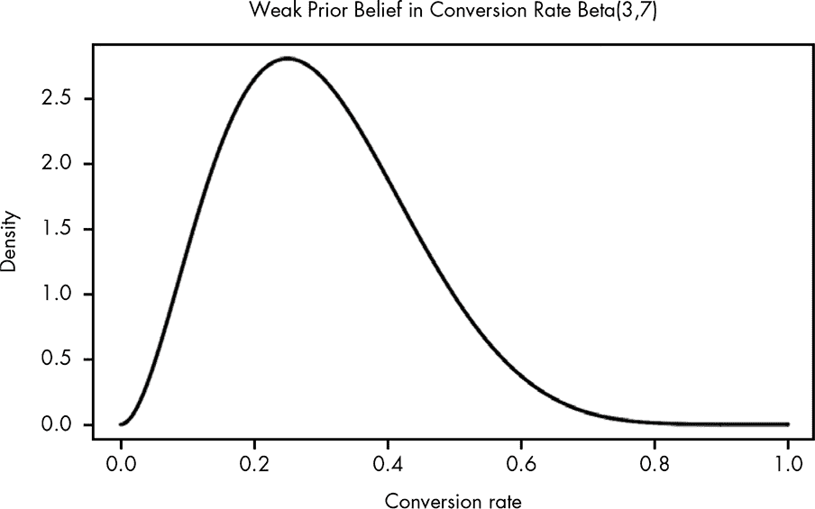
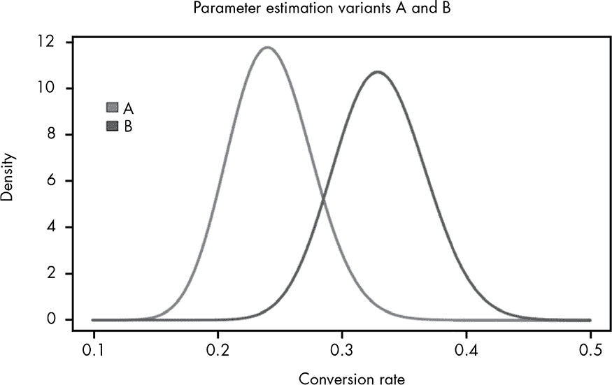
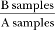
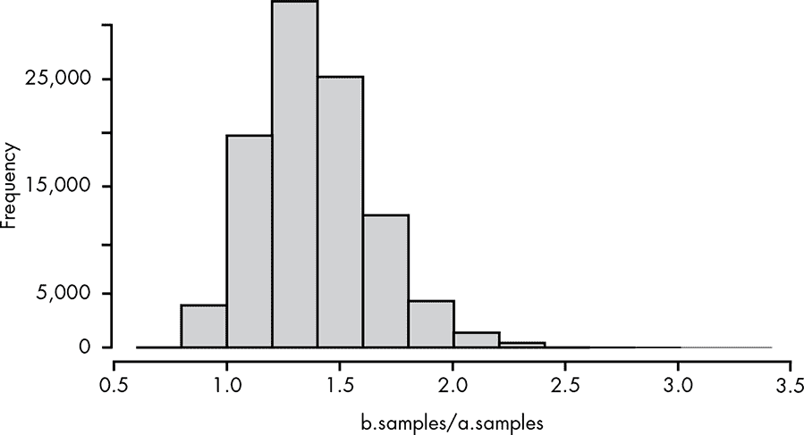
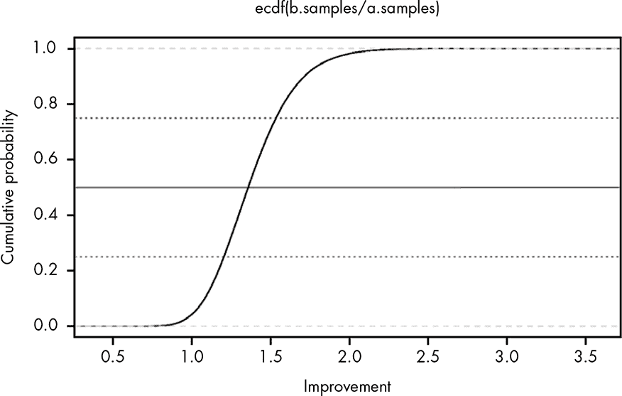

## **15

**从参数估计到假设检验：构建贝叶斯 A/B 测试**


在这一章，我们将构建我们的第一个假设检验——*A/B 测试*。公司通常使用 A/B 测试来尝试不同的产品网页、邮件和其他营销材料，以确定哪些对客户最有效。在这一章中，我们将测试我们的假设，即去除邮件中的图片会提高*点击率*，与认为去除图片会降低点击率的假设进行对比。

由于我们已经知道如何估计单个未知参数，我们需要做的就是估计这两个参数——也就是每封邮件的转化率。然后我们将使用 R 来运行蒙特卡洛模拟，确定哪个假设可能表现更好——换句话说，哪个变体，A 还是 B，更优。A/B 测试可以使用经典的统计技术，如*t*-检验来进行，但通过贝叶斯方法构建我们的测试，能够帮助我们直观理解每个部分，并且也能为我们提供更有用的结果。

到目前为止，我们已经很好地掌握了参数估计的基本知识。我们已经了解了如何使用 PDF、CDF 和分位数函数来学习某些值的可能性，并且我们也了解了如何在估计中加入贝叶斯先验。现在，我们想用我们的估计来比较*两个*未知参数。

### **设置贝叶斯 A/B 测试**

延续上一章的邮件示例，假设我们想知道添加图片是否对我们博客的转化率有帮助或有害。之前，每周的邮件都包含了一些图片。为了本次测试，我们将发送一个带图片的版本，如往常一样，另一个则不包含图片。这个测试被称为*A/B 测试*，因为我们在比较变体 A（带图片）和变体 B（不带图片），目的是确定哪一个表现更好。

假设此时我们有 600 个博客订阅者。由于我们想要利用在本次实验中获得的知识，我们只会对其中 300 人进行测试；这样，我们就可以将剩余的 300 名订阅者发送我们认为最有效的邮件版本。

我们将要测试的 300 人将被分成两组，A 组和 B 组。A 组将收到通常的邮件，邮件顶部有一张大图，而 B 组将收到没有图片的邮件。我们希望的是，简洁的邮件感觉不那么“垃圾”，能鼓励用户点击内容。

#### ***找到我们的先验概率***

接下来，我们需要确定将使用什么先验概率。我们每周都会进行一次邮件营销活动，因此从这些数据中，我们可以合理预期，在任何一封邮件中，点击链接进入博客的概率应该大约是 30%。为了简化起见，我们将对两个变体使用相同的先验概率。我们还将选择一个相对较弱的先验分布版本，这意味着它考虑了更广泛的可能转换率。我们使用弱先验是因为我们并不确切知道 B 变体的表现如何，而且这是一项新的邮件营销活动，因此其他因素可能导致更好的或更差的转化效果。我们将选择 Beta(3,7)作为我们的先验概率分布。这种分布使我们能够表示一个β分布，其中 0.3 是均值，但考虑到可能的各种替代转化率。我们可以在图 15-1 中看到这个分布。



*图 15-1：可视化我们的先验概率分布*

现在我们需要的就是我们的似然，这意味着我们需要收集数据。

#### ***收集数据***

我们发送邮件并获得了表 15-1 中的结果。

**表 15-1：** 邮件点击率

|  | **点击** | **未点击** | **观察到的转化率** |
| --- | --- | --- | --- |
| **变体 A** | 36 | 114 | 0.24 |
| **变体 B** | 50 | 100 | 0.33 |

我们可以将这些变体视为我们试图估计的独立参数。为了为每个变体得出后验分布，我们需要将它们的似然分布和先验分布结合起来。我们已经决定，这些分布的先验应该是 Beta(3,7)，表示我们对转化率可能值的相对较弱的信念，假设没有额外的信息。我们说这是一种弱信念，因为我们并不强烈相信某个特定的数值范围，而是考虑所有可能的转化率都有相对较高的概率。对于每个变体的似然，我们将再次使用β分布，使α为链接被点击的次数，β为未点击的次数。

回顾一下：

Beta(α[后验], β[后验]) = Beta(α[先验] + α[似然], β[先验] + β[似然])

变体 A 将用 Beta(36+3,114+7)表示，变体 B 则用 Beta(50+3,100+7)表示。图 15-2 展示了每个参数的估计值并排显示。



*图 15-2：我们对两种邮件变体的估计的β分布*

显然，我们的数据表明变体 B 更优，因为它获得了更高的转化率。然而，从我们之前关于参数估计的讨论中，我们知道真实的转化率是可能值范围中的一个值。我们也可以在这里看到 A 和 B 的真实转化率存在重叠。如果我们在 A 的测试中只是运气不好，A 的真实转化率实际上可能更高怎么办？如果我们在 B 的测试中只是运气好，B 的转化率实际上可能更低怎么办？很容易想象出一个可能的情况，其中 A 实际上是更好的变体，即使它在我们的测试中表现更差。那么，真正的问题是：我们能有多确定 B 是更好的变体？这就是蒙特卡洛模拟发挥作用的地方。

### **蒙特卡洛模拟**

哪个邮件变体能产生更高点击率的准确答案位于 A 和 B 分布的交集处。幸运的是，我们有一种方法可以找出答案：蒙特卡洛模拟。*蒙特卡洛模拟*是利用随机抽样解决问题的任何技术。在这种情况下，我们将从这两个分布中随机抽样，每个样本根据其在分布中的概率被选择，这样高概率区域的样本会更频繁地出现。例如，正如我们在图 15-2 中看到的，A 中大于 0.2 的值比小于 0.2 的值更可能被抽样出来。然而，从分布 B 中随机抽样几乎肯定会得到大于 0.2 的值。在我们的随机抽样中，我们可能会选择变体 A 的值为 0.2，变体 B 的值为 0.35。每个样本都是随机的，基于 A 和 B 分布中值的相对概率。A 的 0.2 和 B 的 0.35 都可能是我们观察到的证据下，每个变体的真实转化率。这种来自两个分布的个体抽样确认了变体 B 实际上优于 A，因为 0.35 大于 0.2。

然而，我们也可能会抽样到变体 A 的值为 0.3，变体 B 的值为 0.27，这两者都是从各自分布中合理可能被抽样到的值。这两者也是每个变体的真实转化率的合理可能值，但在这种情况下，它们表明变体 B 实际上比变体 A 差。

我们可以想象，后验分布代表了基于我们目前对每个转换率的信念状态，所有可能存在的世界。每次从每个分布中进行采样时，我们看到的都是一个可能的世界。从 图 15-1 中，我们可以直观地看到，我们应该期望更多的世界中 B 确实是更好的变体。我们采样的次数越多，我们就能越精确地知道，在我们采样过的所有世界中，B 在多少个世界里是更好的变体。一旦我们得到了样本，我们可以查看 B 是最好的世界与我们所查看的世界总数的比率，并得出一个准确的概率，表明 B 确实比 A 更好。

#### ***在多少个世界中，B 是更好的变体？***

现在我们只需要编写执行此采样的代码。R 的 `rbeta()` 函数允许我们从 Beta 分布中自动采样。我们可以将每次比较两个样本视为一次试验。我们运行的试验越多，结果就会越精确，所以我们将从 100,000 次试验开始，将此值分配给变量 `n.trials`：

```
n.trials <- 100000
```

接下来我们将把之前的 alpha 和 beta 值放入变量中：

```
prior.alpha <- 3
```

```
prior.beta <- 7
```

接着我们需要从每个变体中收集样本。我们将使用 `rbeta()` 来实现：

```
a.samples <- rbeta(n.trials,36+prior.alpha,114+prior.beta)

b.samples <- rbeta(n.trials,50+prior.alpha,100+prior.beta)
```

我们也将 `rbeta()` 函数的结果保存到变量中，这样我们就可以更方便地访问它们。对于每个变体，我们输入点击博客的人数和未点击的人数。

最后，我们比较 `b.samples` 中有多少次大于 `a.samples`，并将这个数字除以 `n.trials`，这将给我们一个百分比，表示在所有试验中，变体 B 比变体 A 更好的次数：

```
p.b_superior <- sum(b.samples > a.samples)/n.trials
```

我们最终得到的结果是：

```
p.b_superior

> 0.96
```

我们看到的是，在 100,000 次试验中的 96% 的情况下，B 变体更优。我们可以把这看作是在 100,000 个可能的世界中做观察。根据每个变体的可能转换率分布，在 96% 的世界里，B 是两个变体中更好的那个。这个结果表明，即使我们观察的样本数量相对较少，我们也对 B 是更好的变体有相当强的信心。如果你曾经做过经典统计中的 *t* 检验，这大致相当于——如果我们使用 Beta(1,1) 作为先验——从单尾 *t* 检验中获得一个 *p*-值为 0.04（通常被认为是“统计显著”）。然而，我们方法的优点在于，我们能够仅凭概率知识和简单的模拟从零开始构建这个检验。

#### ***每个 B 变体比每个 A 变体好多少？***

现在我们可以准确地说出我们有多确定 B 是更优的变体。然而，如果这个电子邮件营销活动是为一个真实的商业所做的，单纯说“B 更好”并不是一个令人满意的答案。难道你不想知道 *有多好* 吗？

这就是蒙特卡洛模拟的真正力量。我们可以利用上次模拟的精确结果，测试变体 B 可能有多好，方法是查看 B 样本比 A 样本大多少次。换句话说，我们可以看这个比率：



在 R 中，如果我们取之前的`a.samples`和`b.samples`，我们可以计算`b.samples`/`a.samples`。这将给我们一个变体 A 到变体 B 的相对改进的分布。当我们将这个分布绘制为直方图，如图 15-3 所示时，我们可以看到变体 B 在提高点击率方面的预期改进。

从这个直方图中我们可以看到，变体 B 最有可能比 A 提高约 40%（比例为 1.4），尽管也存在一系列可能的值。正如我们在第十三章中讨论的，累积分布函数（CDF）在推理我们的结果时比直方图更有用。由于我们正在处理数据而不是数学函数，我们将使用 R 的`ecdf()`函数来计算*经验*累积分布函数。经验累积分布函数在图 15-4 中进行了说明。



*图 15-3：我们可能看到的改善的直方图*



*图 15-4：我们可能看到的改善的分布*

现在我们可以更清楚地看到我们的结果。实际上，变体 A 更好的机会非常小，即使它更好，也不会有太大差距。我们还可以看到，变体 B 有大约 25%的概率在转化率上比 A 提高 50%或更多，甚至有相当大的概率它可能是 A 的两倍转化率！现在，在选择 B 而不是 A 时，我们实际上可以通过以下方式推理我们的风险：“B 比 A 差 20%的概率和 B 比 A 好 100%的概率差不多。”对我来说，这听起来是个不错的赌注，而且比说“B 和 A 之间有统计学上显著的差异”要更好地表述我们的知识。

### **总结**

在本章中，我们看到如何将参数估计自然地扩展到假设检验的形式。如果我们要检验的假设是“变体 B 的转化率比变体 A 更高”，我们可以从首先对每个变体的可能转化率进行参数估计开始。一旦知道了这些估计值，我们可以使用蒙特卡洛模拟从中进行抽样。通过比较这些样本，我们可以得出假设为真的概率。最后，我们可以进一步测试，看看我们的新变体在这些可能的世界中表现如何，不仅估计假设是否成立，还估计我们可能看到的改进程度。

### **练习**

尝试回答以下问题，看看你对 A/B 测试的理解有多深入。解决方案可以在 *[`nostarch.com/learnbayes/`](https://nostarch.com/learnbayes/)* 中找到。

1.  假设一位有多年经验的市场总监告诉你，他坚信没有图片的变体（B）不会比原始变体有任何不同的表现。你如何在我们的模型中考虑这一点？实施这一变化，并查看你的最终结论如何变化。

1.  主要设计师看到你的结果后坚持认为，变体 B 在没有图片的情况下不可能表现得更好。她认为你应该假设变体 B 的转化率更接近 20%而不是 30%。为此实现一个解决方案，并再次审查我们的分析结果。

1.  假设 95%的置信度意味着你“几乎确定”一个假设是正确的。同时假设你可以在测试中发送的电子邮件数量不再有限制。如果 A 的真实转化率是 0.25，B 是 0.3，探讨需要多少样本才能说服市场总监相信 B 确实更优。对主要设计师做同样的探索。你可以使用以下 R 代码片段生成转化样本：

    ```
    true.rate <- 0.25

    number.of.samples <- 100

    results <- runif(number.of.samples) <= true.rate
    ```
