## 贝叶斯因子与后验比率介绍：**思想的竞争**

在前一章中，我们看到我们可以将假设检验视为参数估计的扩展。在本章中，我们将思考假设检验，而不是作为一种估计方式，而是作为一种使用重要数学工具*贝叶斯因子*来比较思想的方法。贝叶斯因子是一个公式，它通过与另一个假设比较来检验一个假设的合理性。结果告诉我们，一个假设比另一个假设更可能的次数。

然后我们将看到如何将贝叶斯因子与我们的先验信念结合，得出后验比率，后者告诉我们在解释数据时，一个信念比另一个信念强多少。

### 重新审视贝叶斯定理

第六章介绍了贝叶斯定理，其形式如下：

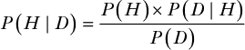

记住，这个公式中有三部分具有特殊的名称：

+   *P*(*H* | *D*)是*后验概率*，它告诉我们在给定数据的情况下，应该多强烈地相信我们的假设。

+   *P*(*H*)是*先验信念*，即在查看数据之前我们对假设的信心概率。

+   *P*(*D* | *H*)是*似然度*，即如果我们的假设成立，获取现有数据的概率。

最后一部分，*P*(*D*)，是观察到的数据的概率，与假设无关。我们需要*P*(*D*)来确保我们的后验概率正确地位于 0 到 1 之间。如果我们拥有所有这些信息，我们可以精确计算出在观察到的数据之后我们应当多强烈地相信我们的假设。但正如我在第八章中提到的，*P*(*D*)通常是很难定义的。在许多情况下，我们不清楚如何确定数据的概率。如果我们只关心比较两个不同假设的相对强度，那么*P*(*D*)就完全没有必要。

基于这些原因，我们常常使用贝叶斯定理的*比例形式*，它允许我们在不知道*P*(*D*)的情况下分析假设的强度。它的形式如下：

*P*(*H* | *D*) ∝ *P*(*H*) × *P*(*D* | *H*)

用通俗的英语来说，贝叶斯定理的比例形式表示，假设的后验概率与先验概率乘以似然度成正比。我们可以使用这个公式，通过比较每个假设的先验信念与似然度的乘积，使用*后验比率*公式来比较两个假设：

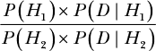

我们现在得到的是一个比率，表示每个假设对我们观察到的数据的解释程度。也就是说，如果比率是 2，则*H*[1]解释观察到的数据是*H*[2]的两倍，而如果比率是 1/2，则*H*[2]解释数据是*H*[1]的两倍。

### 使用后验比率构建假设检验

后验比率公式给出了*后验赔率*，它使我们能够测试我们对数据的假设或信念。即使我们知道了*P*(*D*)，后验赔率仍然是一个有用的工具，因为它允许我们比较不同的观点。为了更好地理解后验赔率，我们将把后验比率公式分解为两个部分：可能性比率，或贝叶斯因子，以及先验概率比率。这是一个标准且非常有帮助的做法，它使得我们更容易分别推理可能性和先验概率。

#### *贝叶斯因子*

使用后验比率公式，假设*P*(*H*[1]) = *P*(*H*[2])——也就是说，我们对每个假设的先验信念是相同的。在这种情况下，假设的先验信念比率就是 1，因此剩下的就是：

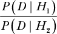

这就是贝叶斯因子，两个假设的可能性比率。

花点时间真正思考这个公式的含义。当我们考虑如何为我们的*H*[1]（即我们对世界的信念）辩护时，我们会考虑收集支持我们信念的证据。因此，一个典型的论证过程通常包括构建一组数据，*D*[1]，以支持*H*[1]，然后与一个朋友进行辩论，朋友收集了一组支持其假设*H*[2]的数据，*D*[2]。

在贝叶斯推理中，我们并不是在收集证据来支持我们的观点；我们是在看我们的观点如何解释眼前的证据。这一比率告诉我们的是，在我们认为**正确**的基础上，给定已观察到的证据，相比于**他人**认为正确的情况，我们的观点的可能性。我们的假设如果比竞争假设更能解释世界，那么它就会获胜。

然而，如果竞争假设比我们的假设更好地解释数据，那么可能是时候改变我们的信念了。关键在于，在贝叶斯推理中，我们并不关心如何支持我们的信念——我们专注于我们的信念如何支持我们所观察到的数据。最终，数据要么确认我们的观点，要么促使我们改变看法。

#### *先验赔率*

到目前为止，我们假设每个假设的先验概率是相同的。但显然这并不总是如此：即使一个假设的可能性非常小，它也可能很好地解释数据。例如，如果你丢失了手机，认为手机落在浴室里的假设和认为外星人把手机带走研究人类技术的假设，都能很好地解释数据。然而，浴室假设显然更可能。这就是为什么我们需要考虑先验概率比率的原因：

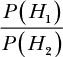

这个比率比较了在我们查看数据之前，两个假设的概率。当与贝叶斯因子一起使用时，这个比率称为我们*H*[1]中的*先验赔率*，并写作 *O*(*H*[1])。这种表示方式很有帮助，因为它可以让我们轻松地注意到我们对所测试假设的信心水平（或信心的弱度）。当这个数字大于 1 时，意味着先验赔率支持我们的假设；而当它小于 1 时，意味着它反对我们的假设。例如，*O*(*H*[1]) = 100 表示，在没有其他信息的情况下，我们认为*H*[1]比替代假设更有可能发生，概率是 100 倍。另一方面，当*O*(*H*[1]) = 1/100 时，替代假设的发生概率是我们的 100 倍。

#### *后验赔率*

如果我们将贝叶斯因子和先验赔率结合起来，就得到了后验赔率：

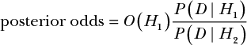

后验赔率计算了我们的假设比竞争假设更好地解释数据的次数。

表 16-1 列出了评估各种后验赔率值的指导原则。

**表 16-1：** 评估后验赔率的指导原则

| **后验赔率** | **证据强度** |
| --- | --- |
| 1 到 3 | 有趣，但没有结论 |
| 3 到 20 | 看起来我们有了些线索 |
| 20 到 150 | 强有力的证据支持*H*[1] |
| > 150 | 压倒性的证据 |

我们可以查看这些赔率的倒数，决定何时改变我们对一个想法的看法。

虽然这些值可以作为一个有用的指导，但贝叶斯推理仍然是一种推理方式，这意味着你必须做出一些判断。如果你和朋友有一个随意的争论，一个后验赔率为 2 可能足以让你感到自信。如果你在试图判断自己是否在喝毒药，后验赔率为 100 可能仍然不够。

接下来，我们将看两个例子，使用贝叶斯因子来确定我们信念的强度。

##### 检验有偏骰子

我们可以将贝叶斯因子和后验赔率作为一种假设检验的形式，其中每个检验都是两个观点之间的竞争。假设你的朋友有一个袋子，里面有三个六面骰子，其中一个是加权的，使它有一半的概率落在 6 上。其他两个是传统的骰子，掷出 6 的概率是⅙。你的朋友拿出了一个骰子，掷了 10 次，结果如下：

6, 1, 3, 6, 4, 5, 6, 1, 2, 6

我们想弄清楚这是不是一个有偏骰子，还是一个普通骰子。我们可以将有偏骰子称为*H*[1]，将普通骰子称为*H*[2]。

让我们从计算贝叶斯因子开始：

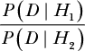

第一步是计算 *P*(*D* | *H*)，即在观察到的数据基础上 *H*[1] 和 *H*[2] 的可能性。在这个例子中，你的朋友掷出了四个 6 和六个非 6。我们知道，如果骰子是加载的，掷出 6 的概率是 1/2，而掷出任何非 6 的概率也是 1/2。这意味着，在假设我们使用的是加载骰子的情况下，看到这些数据的可能性是：

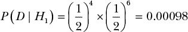

在公平骰子的情况下，掷出 6 的概率是 1/6，而掷出其他任何数字的概率是 5/6。这意味着我们看到这些数据的可能性对于 *H*[2]，即骰子是公平的假设，是：

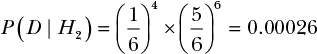

现在我们可以计算我们的贝叶斯因子，它将告诉我们 *H*[1] 比 *H*[2] 更好地解释数据的程度，假设每个假设在最初是等可能的（这意味着先验赔率比率为 1）：

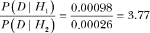

这意味着 *H*[1]，即骰子被加载的假设，比 *H*[2] 更好地解释了我们观察到的数据，几乎是 *H*[2] 的四倍。

然而，这只有在 *H*[1] 和 *H*[2] 起初具有相同可能性的情况下才成立。但我们知道袋子里有两个公平骰子和一个加载骰子，这意味着每个假设的可能性并不相等。根据袋子里骰子的分布，我们知道这是每个假设的先验概率：

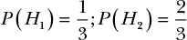

从这些中，我们可以计算 *H*[1] 的先验赔率：

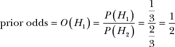

因为袋子里只有一个加载骰子和两个公平骰子，我们抽到公平骰子的可能性是抽到加载骰子的两倍。根据我们对 *H*[1] 的先验赔率，现在我们可以计算我们的完整后验赔率：

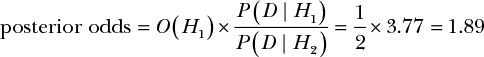

尽管初始的似然比显示 *H*[1] 比 *H*[2] 更好地解释数据，几乎是 *H*[2] 的四倍，但后验赔率却告诉我们，因为 *H*[1] 的可能性只有 *H*[2] 的一半，所以 *H*[1] 实际上只是比 *H*[2] 强大约两倍的解释。

从这里来看，如果你必须得出结论是否骰子是加载的，你最好的选择是认为它确实是加载的。然而，后验赔率小于 2 并不是特别强的证据支持 *H*[1]。如果你真的想知道骰子是否被加载，你需要再掷几次，直到某个假设的证据足够强大，能够让你做出更有力的判断。

现在让我们看一个使用贝叶斯因子来确定我们信念强度的第二个例子。

##### 在线自我诊断罕见病

许多人曾犯过在深夜上网查找自己症状的错误，结果发现自己被一些奇怪可怕的疾病吓得目瞪口呆！不幸的是，他们的分析几乎总是忽略了贝叶斯推理，而这种推理或许能够缓解一些不必要的焦虑。在这个例子中，假设你犯了查找症状的错误，并发现两种可能的疾病符合你的症状。与其毫无理由地惊慌失措，不如用后验比率来权衡每种可能性。

假设有一天你醒来时发现自己有听力困难，并且一只耳朵里有耳鸣（耳鸣）。这让你整天都很烦躁，当你下班回家后，你决定是时候上网查找可能导致这些症状的原因了。你变得越来越担心，最终得出两个可能的假设：

**耳垢堵塞** 你的一只耳朵里有过多的耳垢。快速去看医生，医生会帮你解决这个问题。

**前庭神经鞘瘤** 你有一个长在前庭神经髓鞘上的脑肿瘤，导致不可逆的听力丧失，可能需要进行脑部手术。

在这两种可能性中，前庭神经鞘瘤的可能性最让人担忧。当然，它可能只是耳垢，但如果不是呢？如果你真的是脑肿瘤怎么办？由于你最担心脑肿瘤的可能性，你决定将这个假设定为你的 *H*[1]。你的 *H*[2] 是你的一只耳朵里有太多耳垢。

让我们看看后验比率是否能让你冷静下来。

和我们之前的例子一样，我们将从观察这些症状在每个假设为真的情况下的可能性开始，并计算贝叶斯因子。这意味着我们需要计算 *P*(*D* | *H*)。你观察到了两个症状：听力丧失和耳鸣。

对于前庭神经鞘瘤，听力丧失的概率是 94%，耳鸣的概率是 83%，这意味着如果你患有前庭神经鞘瘤，出现听力丧失和耳鸣的概率是：

*P* (*D* | *H*[1]) = 0.94 × 0.89 = 0.78

接下来，我们对 *H*[2] 进行同样的分析。对于耳垢堵塞，听力丧失的概率是 63%，耳鸣的概率是 55%。如果你有耳垢堵塞，出现这些症状的可能性是：

*P* (*D* | *H*[2]) = 0.63 × 0.55 = 0.35

现在我们有足够的信息来查看我们的贝叶斯因子：

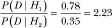

哎呀！仅仅看贝叶斯因子并没有多少帮助来缓解你对脑肿瘤的担忧。只考虑可能性比率，似乎如果你患有前庭神经鞘瘤，比耳垢堵塞的可能性高出两倍多！幸运的是，我们的分析还没有完成。

下一步是确定每个假设的先验赔率。撇开症状不谈，某人患有某个问题的可能性与患另一个问题的可能性有多大？我们可以找到每种疾病的流行病学数据。事实证明，前庭神经鞘瘤是一种罕见疾病，每年每百万人的发病率为 11 例。先验赔率如下：

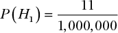

不出所料，耳垢堵塞要常见得多，每年每百万人的发病率为 37,000 例：

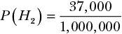

要获得*H*[1]的先验赔率，我们需要查看这两个先验概率的比率：

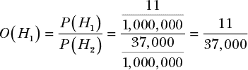

单凭先验信息，一个人患耳垢堵塞的可能性大约是患前庭神经鞘瘤的 3,700 倍。但在你松一口气之前，我们还需要计算完整的后验赔率。这只是意味着将我们的贝叶斯因子乘以先验赔率：

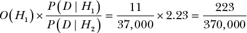

这个结果表明*H*[2]的可能性大约是*H*[1]的 1,659 倍。最后，你可以放心了，知道早上去看医生进行简单的耳朵清理就能解决这一切！

在日常推理中，人们很容易高估可怕情况的概率，但通过使用贝叶斯推理，我们可以拆解实际风险，看看它们到底有多可能发生。

### 总结

在本章中，你学会了如何使用贝叶斯因子和后验赔率来比较两个假设。贝叶斯因子并不是集中于提供数据来支持我们的信念，而是测试我们的信念在多大程度上支持我们所观察到的数据。结果是一个比率，反映了一个假设比另一个假设解释数据的效果好多少倍。我们可以用它来强化我们的先验信念，当它们比其他信念更好地解释数据时。另一方面，当结果是一个分数时，我们可能需要考虑改变自己的想法。

### 练习

尝试回答以下问题，看看你对贝叶斯因子和后验赔率的理解有多深。解决方案可以在 *[`nostarch.com/learnbayes/`](https://nostarch.com/learnbayes/)* 找到。

1.  回到骰子问题，假设你的朋友犯了个错误，突然意识到实际上有两个加权骰子和一个公平骰子。这如何改变我们的先验，以及因此改变我们的后验赔率？你是否更愿意相信正在掷的骰子是加权骰子？

1.  回到罕见疾病的例子，假设你去看医生，清理完耳朵后，你注意到症状依然存在。更糟糕的是，你出现了一个新症状：头晕。医生提出另一种可能的解释——迷路炎，这是一种内耳的病毒感染，其中 98%的病例涉及头晕。然而，听力丧失和耳鸣在这种疾病中较为少见；听力丧失的发生率仅为 30%，耳鸣的发生率仅为 28%。头晕也是前庭神经鞘瘤的一个可能症状，但只出现在 49%的病例中。在普通人群中，每百万的人中每年有 35 人患上迷路炎。当你比较迷路炎和前庭神经鞘瘤的假设时，后验几率是多少？
