## 《暮光之城》中的贝叶斯推理**

在第十六章中，我们使用了贝叶斯因子和后验赔率来判断一个假设比另一个竞争假设更有可能。然而，贝叶斯推理的这些工具不仅仅用于比较假设。在本章中，我们将使用贝叶斯因子和后验赔率来量化说服某人接受一个假设所需的证据量。我们还将看到如何估计他人对某个假设的先验信念强度。我们将通过一集经典电视节目*《暮光之城》*的著名情节来完成这些任务。

### 《暮光之城》中的贝叶斯推理

我最喜欢的《暮光之城》的一集叫做“Nick of Time”。在这一集中，一对年轻的新婚夫妇——唐和帕特——在一个小镇的餐馆里等待修理他们的车。在餐馆里，他们遇到了一个叫做神秘预言机的占卜机器，它接受“是”或“不是”的问题，并且只需一分钱，就能吐出带有答案的卡片。

非常迷信的唐向神秘预言机提出了一系列问题。当机器正确回答时，他开始相信其超自然的能力。然而，帕特依然对机器的能力持怀疑态度，尽管神秘预言机继续提供正确的答案。

尽管唐和帕特看着相同的数据，他们得出了不同的结论。我们如何解释为什么他们在面对相同的证据时会有不同的推理？我们可以使用贝叶斯因子来深入了解这两个人物如何看待数据。

### 使用贝叶斯因子来理解神秘预言机

在这一集中，我们面临两个竞争的假设。我们可以将它们称为*H*和（或“非*H*”），因为一个假设是另一个的否定：

***H*** 神秘预言机确实能够预测未来。

 神秘预言机只是运气好。

在这个例子中，我们的数据*D*是神秘预言机提供的*n*个正确答案的序列。*n*越大，支持*H*的证据就越强。*暮光之城*一集的主要假设是，神秘预言机每次都能正确预测，因此问题是：这个结果是超自然现象，还是仅仅是巧合？对于我们来说，*D*，我们的数据，始终代表着*n*个正确答案的序列。现在我们可以评估我们的可能性，或者给定每个假设下获得这些数据的概率。

*P*(*D* | *H*)是在假设神秘预言者能够预测未来的情况下，连续得到*n*个正确答案的概率。这个可能性将始终为 1，无论提出多少个问题。这是因为，如果神秘预言者是超自然的，它将始终给出正确的答案，无论是问一个问题还是一千个问题。当然，这也意味着如果神秘预言者的一个答案错了，那么这个假设的概率将下降到 0，因为一个预言机器不可能犯错。在这种情况下，我们可能需要提出一个较弱的假设——例如，假设神秘预言者的正确率是 90%（我们将在第十九章探讨类似的问题）。

*P*(*D* | )是在假设神秘预言者只是随机给出答案的情况下，连续得到*n*个正确答案的概率。在这里，*P*(*D* | ) = 0.5*^n*。换句话说，如果机器只是随便猜测，那么每个答案有 50%的概率是正确的。

为了比较这些假设，让我们来看一下这两种可能性的比率：

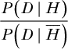

提醒一下，这个比率衡量的是在假设两种假设等可能的情况下，数据在给定*H*与的情况下，数据发生的可能性增加了多少倍。现在让我们看看这些观点如何进行比较。

#### *测量贝叶斯因子*

正如我们在前一章所做的，我们将暂时忽略先验赔率的比率，专注于比较可能性的比率，或者说贝叶斯因子。我们假设（暂时）神秘预言者有相同的机会既是超自然的，也只是幸运的。

在这个例子中，我们的分子*P*(*D* | *H*)始终为 1，所以对于任何*n*值，我们都有：

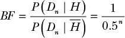

假设神秘预言者已经给出了三个正确答案。在这一点上，*P*(*D*[3] | *H*) = 1，*P*(*D* | *H*) = 0.5³ = 0.125。显然，*H*更好地解释了数据，但当然没有人——甚至是迷信的唐——会仅仅凭借三个正确的猜测就相信它。假设先验赔率相同，我们的贝叶斯因子为三次提问时是：

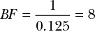

我们可以使用我们在表 16-1 中用来评估后验赔率的相同准则来评估贝叶斯因子（如果我们假设每个假设的可能性是相等的），如表 17-1 所示。正如你所看到的，贝叶斯因子（BF）为 8 远不足以得出结论。

**表 17-1：** 评估贝叶斯因子的指南

| **BF** | **证据的强度** |
| --- | --- |
| 1 到 3 | 有趣，但没有决定性结论 |
| 3 到 20 | 看起来我们发现了一些线索 |
| 20 到 150 | 强有力的证据支持*H*[1] |
| > 150 | 强有力的证据支持*H*[1] |

所以，在回答了三个问题并且 BF = 8 的情况下，我们至少应该对神秘预言者的能力产生好奇，尽管我们还不应完全相信它。

但到这一集的这一点，Don 似乎已经相当确定神秘先知是心灵感应者了。只需要四个正确的答案，他就能确信无疑。另一方面，Pat 则需要 14 个问题才能*开始认真考虑*这种可能性，最终得出一个贝叶斯因子为 16,384——比她实际需要的证据要多得多。

计算贝叶斯因子并没有解释为什么 Don 和 Pat 对证据形成了不同的信念。那到底是怎么回事呢？

#### *考虑先验信念*

我们模型中缺少的元素是每个角色对这些假设的先验信念。记住，Don 是一个极其迷信的人，而 Pat 是一个怀疑论者。显然，Don 和 Pat 在他们的心理模型中使用了额外的信息，因为他们各自得出的结论的强度不同，而且时间也非常不同。这在日常推理中非常常见：两个人常常会对完全相同的事实做出不同的反应。

我们可以通过简单地想象在没有任何额外信息的情况下*P*（*H*）和*P*（）的初始概率来建模这一现象。我们称之为*先验赔率比*，正如你在第十六章中看到的：

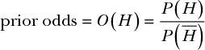

与贝叶斯因子相关的先验信念概念实际上非常直观。假设我们走进《怪谈空间》中的餐馆，我问你：“神秘先知是心灵感应者的概率有多大？”你可能会回答：“呃，一百万分之一！那东西绝对不是超自然的。”从数学角度来看，我们可以这样表示：

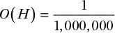

现在让我们将这种先验信念与我们的数据结合。为此，我们将把我们的先验赔率与似然比的结果相乘，以获得根据我们观察到的数据得出的后验赔率：

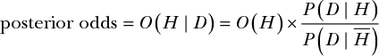

在没有看到任何证据之前，认为神秘先知是心灵感应者的机会只有百万分之一，这是一种相当强烈的怀疑态度。贝叶斯方法很好地反映了这种怀疑。如果你一开始就认为神秘先知是超自然的假设极不可能，那么你将需要更多的证据才能改变看法。假设神秘先知答对了五个问题。我们的贝叶斯因子就变成了：

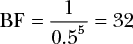

贝叶斯因子为 32 表示我们相当相信神秘先知确实是超自然的。然而，如果我们将我们非常怀疑的先验赔率加进去计算后验赔率，我们会得到以下结果：

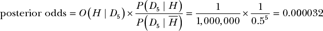

现在我们的后验赔率告诉我们这台机器不太可能是心灵感应者。这一结果与我们的直觉非常一致。再次强调，如果你一开始就不相信一个假设，那么要说服你改变看法将需要大量证据。

实际上，如果我们倒推，后验比率可以帮助我们计算出需要多少证据才能让你相信 *H*。在后验比率为 2 时，你才刚刚开始考虑超自然假设。所以，如果我们求解出大于 2 的后验比率，我们就可以确定说服你的条件。

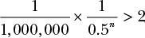

如果我们将 *n* 求解到最接近的整数，我们得到：

*n* > 21

在连续答对 21 个问题后，即使是一个强烈的怀疑者，也应该开始认为神秘先知实际上可能是通灵的。

因此，我们的先验比率不仅可以告诉我们在已有背景下我们有多强烈地相信某件事。它还可以帮助我们量化我们需要多少证据才能被说服相信一个假设。反过来也成立；如果在连续答对 21 个问题后，你发现自己坚信 *H*，你可能需要削弱你的先验比率。

### 发展我们自己的通灵能力

到这一步，我们已经学会了如何比较假设，并计算出在我们对 *H* 的先验信念下，能够说服我们相信 *H* 所需要的有利证据量。接下来，我们将看一下利用后验比率可以做的另一个技巧：根据唐和帕特对证据的反应量化他们的先验信念。

我们并不确切知道唐和帕特在第一次走进餐馆时，对于神秘先知是否是通灵者的可能性有多强的信念。但我们*知道*，唐需要大约七个正确的答案，才能对神秘先知的超自然能力几乎完全确信。我们可以估计，在这个时刻，唐的后验比率是 150——根据表格 17-1，这是*非常强*的信念门槛。现在我们可以写出我们所知道的一切，除了 *O*(*H*)，我们将为其求解：

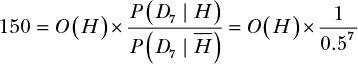

解这个方程得到 *O*(*H*)：

*O*(*H*)[Don] = 1.17

现在我们得到的是一个量化模型，用于表示唐的迷信信念。由于他的初始比率大于 1，唐在进入餐馆时就略微倾向于相信神秘先知是超自然的，尽管还没有收集任何数据。这是合理的，因为他本身具有迷信的天性。

现在说到帕特。当她答对 14 个问题时，帕特开始变得紧张，称神秘先知“是个愚蠢的破烂东西！”虽然她开始怀疑神秘先知可能是通灵的，但她并不像唐那样确信。我估计她的后验比率是 5——这是她可能开始想，“也许神秘先知*可能*有通灵的能力……”现在我们可以用同样的方式为帕特的信念创建后验比率：

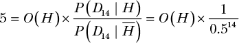

当我们求解 *O*(*H*) 时，我们可以将帕特的怀疑心态建模为：

*O*(*H*)[Pat] = 0.0003

换句话说，Pat 走进餐馆时会声称预言者是超自然的几率大约是 1/3,000。这再次符合我们的直觉；Pat 一开始非常坚信，那个算命机不过是她和 Don 等餐时用来消遣的游戏。

我们在这里所做的事情是令人瞩目的。我们运用了概率规则，得出了关于某人信仰的定量陈述。实质上，我们已经变成了读心术大师！

### 总结

在这一章中，我们探讨了三种使用贝叶斯因子和后验赔率的方式，以便用概率推理的方式来解决问题。我们从回顾上一章学到的内容开始：我们可以使用后验赔率来比较两个观点。然后我们看到，如果我们知道一个假设相对于另一个假设的先验信念的赔率，我们就可以准确地计算出需要多少证据来让我们改变信念。最后，我们用后验赔率来为每个人的先验信念分配一个值，通过观察说服他们需要多少证据。最终，后验赔率远不止是测试观点的一种方式，它为我们提供了一个框架，用于思考在不确定性下的推理。

现在，你可以运用自己“神秘”的贝叶斯推理能力来解答以下练习：

### 练习

尝试回答以下问题，看看你是否理解了量化证据的数量，以说服某人接受某个假设，以及估算他人先验信念的强度。解决方案可以在*[`nostarch.com/learnbayes/`](https://nostarch.com/learnbayes/)*找到。

1.  每次你和朋友聚在一起看电影时，你都会抛硬币决定谁来选电影。你的朋友总是选正面，而且每周五连续 10 周，硬币都落在正面。你提出了一个假设：这枚硬币可能是双正面，而不是一面正面一面反面。为硬币是伪造的假设与硬币是公平的假设设立一个贝叶斯因子。仅凭这个比值，是否说明你的朋友在欺骗你？

1.  现在想象三种情况：你的朋友是个恶作剧者，你的朋友大多数时候诚实，但偶尔可能会小心机，而你的朋友非常值得信赖。在每种情况下，估算你的假设的先验赔率比，并计算后验赔率。

1.  假设你非常信任这个朋友。将他们作弊的先验赔率设为 1/10,000。为了让你对他们的清白产生疑问——比如，后验赔率为 1，硬币需要落多少次正面？

1.  你的另一个朋友也和这个朋友一起玩，在硬币连续四周都正面朝上的情况下，坚信你们俩都被欺骗了。这种信心意味着后验概率大约为 100。你会如何评估这个朋友在事前就认为第一个朋友是骗子的信念？
