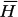
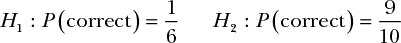
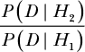
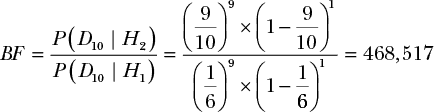
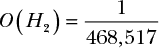
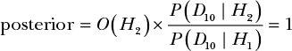
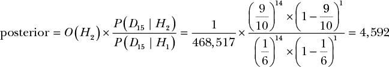
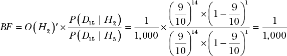
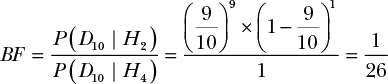
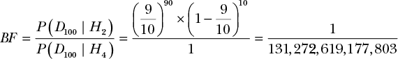

## 第十八章：**当数据不能说服你时**

在上一章中，我们用贝叶斯推理分析了一个《阴阳魔界》的两种假设：

+   ***H*** 这个算命的神秘预言者具备超自然能力。

+    这个算命的神秘预言者并非超自然，只是运气好。

我们还学会了如何通过改变先验几率比率来解释怀疑论。例如，如果你像我一样，认为神秘预言者绝对没有超能力，那么你可能会希望将先验几率设得极低——像 1/1,000,000 那样。

然而，根据你个人的怀疑程度，你可能觉得即使是 1/1,000,000 的几率比，也不足以说服你相信预言者的能力。

即使在获得预言者 1,000 个正确答案后——尽管你之前持非常怀疑的态度，这也意味着你几乎有天文数字的概率相信预言者是具备超能力的——你仍然可能不相信其超自然的力量。我们可以通过将先验几率设得更极端来表示这种情况，但我个人并不认为这种解决方案令人满意，因为无论多少数据，都无法说服我相信神秘预言者实际上是具备超能力的。

在本章中，我们将深入探讨那些数据无法按我们预期说服人们的问题。在现实世界中，这种情况相当普遍。任何在假期晚餐时与亲戚争论过的人，可能都注意到，往往是你提供的反驳证据越多，他们似乎越坚信自己先前的信念！为了充分理解贝叶斯推理，我们需要能够从数学角度理解为何会出现这种情况。这将帮助我们在统计分析中识别并避免类似的情形。

### 一个掷骰子的超能力朋友

假设你的朋友告诉你，他们能以 90%的准确率预测六面骰子的结果，因为他们是超能力者。你觉得这个说法难以置信，于是你通过贝叶斯因子设置了一个假设检验。和神秘预言者的例子一样，你有两个假设要比较：

第一个假设，*H*[1]，代表你相信骰子是公平的，并且你的朋友没有超能力。如果骰子是公平的，那么猜中结果的概率是 1/6。第二个假设，*H*[2]，代表你的朋友相信他们确实能够以 90%的概率预测出骰子的结果，因此这个假设给出的比率是 9/10。接下来，我们需要一些数据来开始检验他们的说法。你的朋友掷了 10 次骰子，正确猜中结果 9 次。

#### *比较似然性*

就像我们在前几章常做的那样，我们将从贝叶斯因子入手，暂时假设每个假设的先验几率相等。我们将似然比公式化为：

这样，我们的结果将告诉我们，你朋友声称自己是通灵的解释数据的效果，比你的假设好多少倍（或者差多少倍）。在这个例子中，为了简洁起见，我们在公式中用*BF*表示“贝叶斯因子”。这是我们的结果，考虑到你的朋友准确预测了 10 次中的 9 次：

我们的似然比显示，朋友是通灵的假设比朋友仅仅运气好的假设解释数据的效果好 468,517 倍。这有点令人担忧。根据我们在前几章看到的贝叶斯因子图表，这意味着我们应该几乎可以确定*H*[2]是真的，而且你的朋友是通灵的。除非你已经是超能力存在的深信者，否则这里似乎有点不对劲。

#### *结合先验比率*

在本书的大多数情况下，当仅仅依靠似然得出的结果很奇怪时，我们可以通过加入先验概率来解决问题。显然，我们不相信朋友的假设比我们相信我们自己的假设强烈得多，因此制定一个强大的先验比率支持我们的假设是有意义的。我们可以通过简单地设置一个足够高的比率，使其抵消贝叶斯因子的极端结果，看看是否能够解决我们的困境：

现在，当我们计算完整的后验比率时，我们发现我们再次不相信你的朋友是通灵的：

目前，看起来先验比率再次将我们从只看贝叶斯因子时出现的问题中拯救了出来。

但假设你的朋友再掷骰子五次，并成功预测了所有五次的结果。现在我们有了一组新的数据，*D*[15]，表示 15 次掷骰子，其中 14 次朋友猜对了。现在，当我们计算后验比率时，我们看到即使是我们的极端先验也几乎无济于事：

使用我们现有的先验，仅仅增加五次掷骰子，我们的后验比率达到了 4,592——这意味着我们几乎可以确定你的朋友真的是通灵的！

在我们之前的大多数问题中，我们通过添加合理的先验来修正了非直观的后验结果。我们为你朋友是通灵的可能性添加了一个相当极端的先验，但我们的后验比率仍然强烈支持他们是通灵的假设。

这是一个重大问题，因为贝叶斯推理应该与我们日常的逻辑感知一致。显然，掷骰子 15 次，猜中 14 次是极不寻常的，但很难让人相信猜测者真的拥有超能力！然而，如果我们无法用假设检验来解释这里发生了什么，这就意味着我们无法依赖我们的检验来解决日常的统计问题。

#### *考虑替代假设*

这里的问题是我们*不想相信你的朋友是通灵的*。如果你在现实生活中遇到这种情况，你很可能会迅速得出其他结论。例如，你可能会认为你的朋友正在使用一个被做了手脚的骰子，它有 90%的概率掷出某个特定的结果。这就代表了一个*第三个*假设。我们的贝叶斯因子只考虑了两种可能的假设：*H*[1]，即骰子是公平的假设，以及*H*[2]，即你的朋友是通灵的假设。

到目前为止，我们的贝叶斯因子告诉我们，比起你的朋友猜对公平骰子的掷点，*H*[2]，即你的朋友是通灵的假设，更有可能成立。当我们以这种方式思考结论时，它就更有意义了：根据这些结果，骰子是公平的可能性极小。我们不愿接受*H*[2]这个替代假设，因为我们自己对这个世界的看法并不支持*H*[2]是一个现实的解释。

理解这一点很重要：假设检验仅仅是比较两种事件的解释，但实际上通常有无数种可能的解释。如果获胜的假设不能说服你，你总是可以考虑第三种解释。

让我们来看看当我们将*H*[2]，我们获胜的假设，与一个新假设*H*[3]进行比较时会发生什么：即骰子被做了手脚，所以它有 90%的概率出现某个特定结果。

我们将以一个新的先验赔率来开始考虑*H*[2]，我们称之为*O*(*H*[2])′（这个撇号是数学中常用的符号，表示“像但不完全相同”）。这将代表*H*[2]/*H*[3]的赔率。现在，我们只需要说，我们认为你的朋友使用一个被做了手脚的骰子的可能性是你的朋友真的通灵的可能性的 1,000 倍（尽管我们的实际先验可能极为极端）。这意味着，你的朋友是通灵的先验赔率为 1/1,000。如果我们重新审视我们的新后验赔率，我们得出了以下有趣的结果：

根据这个计算，我们的后验赔率与我们的先验赔率相同，*O*(*H*[2])′。这是因为我们的两个似然值相同。换句话说，*P*(*D*[15] | *H*[2]) = *P*(*D*[15] | *H*[3])。对于这两个假设来说，朋友正确猜测骰子掷出的结果的似然性是完全相同的，因为每个假设对成功的概率赋予的值是一样的。这意味着我们的贝叶斯因子始终为 1。

这些结果与我们的日常直觉非常契合；毕竟，撇开先验赔率不谈，每个假设对我们所看到的数据的解释是一样的好。这意味着，如果在考虑数据之前，我们相信某个解释比另一个更有可能，那么无论新的证据如何，都不会改变我们的看法。所以，我们不再对我们观察到的数据感到困惑；我们只是找到了一个更好的解释。

在这种情况下，无论数据多么丰富，都不会改变我们相信*H*[3]而非*H*[2]的看法，因为两者对我们观察到的现象的解释同样合理，而且我们已经认为*H*[3]比*H*[2]更可能是正确的解释。这里有趣的是，即使我们的先验信念完全不合理，我们也可能会陷入这种情况。也许你是一个强烈相信心灵现象的人，并且认为你的朋友是地球上最诚实的人。在这种情况下，你可能会把先验概率*O*(*H*[2])′设定为 1,000。如果你相信这一点，那么无论有多少数据，都无法说服你相信你的朋友在使用作弊的骰子。

在这种情况下，重要的是要意识到，如果你想解决一个问题，你需要愿意改变你的先验信念。如果你不愿放弃那些无法辩解的先验信念，那么至少你必须承认你已经不再以贝叶斯或逻辑的方式推理了。我们都持有不合理的信念，这完全没问题，只要我们不试图用贝叶斯推理来为它们辩护。

### 与亲戚和阴谋论者的争论

任何在节日聚餐时与亲戚争论政治、气候变化或他们最喜欢的电影的人，都曾亲身经历过这样一种情况：他们在比较两个都能同样合理解释数据的假设（对争论者而言），而唯一剩下的就是先验信念。那么，当更多数据无法改变任何东西时，我们如何改变别人（或我们自己）的信念呢？

我们已经看到，如果你比较相信你的朋友在用作弊的骰子和相信他们有心灵感应的假设，更多的数据无法改变你对你朋友说法的看法。这是因为你的假设和你朋友的假设对数据的解释同样合理。为了让你的朋友说服你相信他们有心灵感应，他们必须改变你的先验信念。例如，既然你怀疑骰子可能被做了手脚，你的朋友可以提议让你选择他们掷的骰子。如果你买了一颗新骰子并交给朋友，而他们依然能准确预测每次掷骰的结果，你可能会开始相信。这种逻辑适用于任何你遇到的两个假设能够同样合理解释数据的情况。在这种情况下，你必须看看是否有办法改变你的先验信念。

假设在你为朋友买了新的骰子之后，他们继续成功，而你*仍然*不相信他们；你现在声称他们一定有某种秘密的掷骰子方法。作为回应，你的朋友让你为他们掷骰子，他们继续成功地预测结果——然而你*仍然*不相信他们。在这种情况下，除了隐藏的假设之外，还发生了其他事情。你现在有了一个 *H*[4]——你的朋友完全在作弊——并且你不会改变你的想法。这意味着对于任何 *D[n]*，*P*(*D[n]* | *H*[4]) = 1。显然，我们已经脱离了贝叶斯的范畴，因为你已经基本上承认了你不会改变自己的想法，但让我们看一下如果你的朋友坚持试图说服你，数学上会发生什么。

让我们看看这两种解释，*H*[2] 和 *H*[4]，如何使用我们的数据 *D*[10] 来竞争，其中有 9 次预测正确和 1 次预测失败。这个贝叶斯因子的计算是：

因为你拒绝相信任何除了你朋友作弊之外的可能性，所以你观察到的概率是，并且永远是，1。即使数据完全符合我们预期的你朋友是通灵者的情形，我们发现我们的信念能解释这些数据的能力是前者的 26 倍。你的朋友深知改变你顽固的想法有多困难，依然坚持投掷 100 次，得到 90 次正确，10 次错误。我们的贝叶斯因子显示出一种非常奇怪的现象：

即使数据似乎强烈支持你朋友的假设，因为你拒绝改变自己的信念，你现在更加坚信自己是对的！当我们不允许自己的思想发生任何改变时，更多的数据反而会让我们更确信自己是正确的。

这种模式对任何曾与政治极端的亲戚或坚信阴谋论的人争论过的人来说可能都很熟悉。在贝叶斯推理中，我们的信念至少应该是可证伪的，这一点至关重要。在传统科学中，*可证伪性*意味着某件事可以被证明是错误的，但在我们的案例中，这仅仅意味着必须有某种方式来减少我们对假设的信念。

贝叶斯推理中不可证伪信念的危险不仅在于它们无法被证明是错误的——而在于，即便是与之矛盾的证据也能强化这些信念。你的朋友不应继续试图说服你，而应该首先问：“我能展示什么来改变你的想法？”如果你的回答是*没有什么*能够改变你的想法，那么你的朋友最好不要再向你提供更多证据。

所以下次你和亲戚在政治或阴谋论上争论时，你应该问他们：“什么证据会改变你的想法？”如果他们没有答案，你最好不要试图通过更多的证据来捍卫自己的观点，因为那只会增加你亲戚对他们信念的确信。

### 总结

在这一章中，你了解了假设检验可能出错的一些方式。虽然贝叶斯因子是两种观点之间的竞争，但很有可能还有其他同样有效的假设值得进行测试。

有时，我们发现两个假设同样能够很好地解释数据；你同样有可能认为你朋友的正确预测是由他朋友的超能力或者骰子的作弊引起的。在这种情况下，只有每个假设的先验赔率才重要。这也意味着，在这些情况下，获取更多数据永远不会改变我们的信念，因为它永远不会让任何一个假设相较于另一个假设占优势。在这些情况下，最好考虑如何改变影响结果的先验信念。

在更极端的情况下，我们可能会遇到一个根本无法改变的假设。这就像是有一个关于数据的阴谋论。当情况是这样的时，不仅更多的数据永远无法说服我们改变信念，反而会产生相反的效果。如果一个假设无法被证伪，更多的数据只会让我们更确信这个阴谋论。

### 练习

尝试回答以下问题，看看你是否理解如何处理贝叶斯推理中的极端情况。答案可以在*[`nostarch.com/learnbayes/`](https://nostarch.com/learnbayes/)*找到。

1.  当两个假设同样能解释数据时，改变我们想法的一种方式是看看我们是否能够攻击先验概率。有哪一些因素可能会增加你对你朋友超能力的先验信念？

1.  有一个实验声称，当人们听到“*佛罗里达*”这个词时，他们会联想到老年人，并且这会影响他们的步伐速度。为了验证这一点，我们让两组 15 个学生穿越一个房间；其中一组听到“*佛罗里达*”这个词，另一组没有。假设 *H*[1] = 这两组的步伐速度没有差异，*H*[2] = 因为听到“*佛罗里达*”这个词，佛罗里达组的步伐更慢。还假设：

    实验显示，*H*[2]的贝叶斯因子为 19。假设某人不相信这个实验，因为 *H*[2] 的先验赔率较低。那么，什么样的先验赔率能够解释这个人不信服的原因，并且贝叶斯因子需要达到多少才能使这个不信服的人后验赔率达到 50？

    现在假设先验赔率无法改变怀疑者的看法。想出一个替代的 *H*[3]，来解释佛罗里达组步伐较慢的现象。记住，如果 *H*[2] 和 *H*[3] 都能同样好地解释数据，只有在支持 *H*[3] 的先验赔率较高时，才会有人声称 *H*[3] 比 *H*[2] 更为真实，因此我们需要重新思考实验，减少这些赔率。想出一个能够改变 *H*[3] 相对于 *H*[2] 的先验赔率的实验。
