## **19

**从假设检验到参数估计**


到目前为止，我们使用后验赔率仅仅比较了两个假设。这对于简单的问题来说是足够的；即使我们有三个或四个假设，我们也可以通过进行多个假设检验来测试它们，就像我们在前一章所做的那样。但有时候，我们想要搜索一个非常大的假设空间来解释我们的数据。例如，你可能想猜测一个罐子里有多少颗果冻豆，一栋远处建筑物的高度，或者一架航班到达需要多少分钟。在所有这些情况下，有许多可能的假设——多到无法为它们全部进行假设检验。

幸运的是，有一种方法可以处理这种情况。在第十五章中，我们学习了如何将参数估计问题转化为假设检验。在本章中，我们将做相反的事情：通过查看几乎连续的可能假设范围，我们可以使用贝叶斯因子和后验赔率（假设检验）作为一种参数估计的形式！这种方法使我们能够评估的不仅仅是两个假设，并为我们提供了一个简单的框架来估计任何参数。

### 嘉年华游戏真的是公平的吗？

假设你正在参加一个嘉年华活动。当你走过游戏区时，你注意到有人正在和一名嘉年华工作人员争论，旁边是一个装满小塑料鸭子的池塘。出于好奇，你走近一听，听到那名玩家大声喊道：“这个游戏是有问题的！你说中奖的机会是二分之一，我已经捡了 20 只鸭子，结果只得到了一个奖品！我看中奖的机会明明是二十分之一！”

既然你已经对概率有了深刻的理解，你决定亲自解决这个争论。你向工作人员和愤怒的顾客解释，如果你观察当天的更多游戏，你将能够使用贝叶斯因子来确定谁是对的。你决定将结果分为两个假设：*H*[1]，表示工作人员声称中奖的概率是 1/2，以及 *H*[2]，表示愤怒的顾客声称中奖的概率只是 1/20：

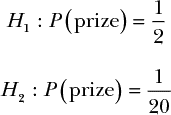

工作人员辩称，由于他没有看到顾客捡鸭子的过程，他认为你不应该使用他报告的数据，因为没有其他人能验证这些数据。你觉得这个理由是合理的。于是，你决定观察接下来的 100 场游戏，并将其作为你的数据。当顾客捡了 100 只鸭子后，你观察到其中有 24 只鸭子带有奖品。

现在，进入贝叶斯因子！由于我们对顾客或工作人员的主张没有强烈的看法，我们暂时不考虑先验赔率或计算完整的后验赔率。

为了得到我们的贝叶斯因子，我们需要计算每个假设下的 *P*(*D* | *H*)：

*P*(*D* | *H*[1]) = (0.5)²⁴ × (1 – 0.5)⁷⁶

*P*(*D* | *H*[2]) = (0.05)²⁴ × (1 – 0.05)⁷⁶

现在，单独来看，这两个概率都非常小，但我们关心的只是比例。我们将以 *H*[2]/*H*[1] 的形式来看待我们的比例，这样我们的结果就能告诉我们客户的假设比服务员的假设更能解释数据多少倍：

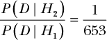

我们的贝叶斯因子告诉我们，*H*[1]，即服务员的假设，比 *H*[2] 更能解释数据 653 倍，这意味着服务员的假设（即捡起一只鸭子时获得奖品的概率是 0.5）是更可能的。

这应该立刻让人觉得很奇怪。显然，如果奖品的真实概率是 0.5，从 100 只鸭子中只获得 24 个奖品的概率看起来非常不可能。我们可以使用 R 的 `pbinom()` 函数（在第十三章中介绍）来计算二项分布，这将告诉我们在假设获得奖品的概率确实为 0.5 的情况下，获得 24 个*或更少*奖品的概率：

```
> pbinom(24,100,0.5)

9.050013e-08
```

正如你所看到的，如果奖品的真实概率是 0.5，获得 24 个或更少奖品的概率极低；将其展开到完整的小数值，我们得到的概率是 0.00000009050013！*H*[1] 绝对有问题。尽管我们不相信服务员的假设，但它仍然比客户的假设更能解释数据。

那么，缺少的是什么呢？过去我们经常发现，当仅仅依赖贝叶斯因子得出的结果没有意义时，先验概率往往起着重要作用。但正如我们在第十八章中看到的，也有一些情况，先验并不是问题的根源。在这种情况下，使用以下方程似乎是合理的，因为我们对结果没有强烈的偏好：

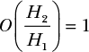

但也许问题在于你对嘉年华游戏的先入为主的不信任。由于贝叶斯因子极力偏向服务员的假设，我们需要让先验赔率至少为 653，才能得到一个支持客户假设的后验赔率：

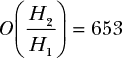

这对游戏的公平性有极深的不信任！这里一定存在除先验之外的其他问题。

#### *考虑多个假设*

一个明显的问题是，虽然直觉上似乎很清楚服务员的假设是错的，但客户的替代理论也太极端，根本不可能是对的，因此我们有两个错误的假设。如果客户认为中奖的概率是 0.2，而不是 0.05 呢？我们将这个假设称为 *H*[3]。将 *H*[3] 与服务员的假设进行比较，结果会大大改变我们的似然比：

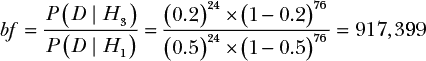

在这里，我们看到*H*[3]解释数据的效果远远好于*H*[1]。通过 917,399 的贝叶斯因子，我们可以确信*H*[1]远不是最能解释我们观察到的数据的最佳假设，因为*H*[3]将其远远甩在了后头。我们在第一次假设检验中遇到的问题是，顾客的信念比服务员的信念对事件的描述差得多。然而，正如我们所看到的，这并不意味着服务员是对的。当我们提出一个替代假设时，我们发现它比服务员和顾客的假设都要好得多。

当然，我们还没有真正解决问题。如果外面有一个更好的假设呢？

#### *使用 R 搜索更多假设*

我们想要一个更通用的解决方案，能够搜索我们所有的可能假设并挑选出最好的一个。为此，我们可以使用 R 的`seq()`函数创建一个我们想要与*H*[1]进行比较的假设序列。

我们将考虑从 0 到 1 之间每个 0.01 的增量作为一个可能的假设。这意味着我们会考虑 0.01、0.02、0.03，依此类推。我们将 0.01——即我们每次增加的假设量——称为`dx`（这是微积分中常用的符号，表示“最小的变化”），并用它来定义一个`hypotheses`变量，表示我们希望考虑的所有可能假设。在这里，我们使用 R 的`seq()`函数，通过将值按`dx`递增，生成一个从 0 到 1 之间的假设值范围：

```
dx <- 0.01

hypotheses <- seq(0,1,by=dx)
```

接下来，我们需要一个可以计算任意两个假设的似然比的函数。我们的`bayes.factor()`函数将接受两个参数：`h_top`，即顶部假设（分子）获得奖品的概率，以及`h_bottom`，即我们正在竞争的假设（服务员的假设）。我们将这样设置：

```
bayes.factor <- function(h_top,h_bottom){

  ((h_top)²⁴*(1-h_top)⁷⁶)/((h_bottom)²⁴*(1-h_bottom)⁷⁶)

}
```

最后，我们计算所有这些可能假设的似然比：

```
bfs <- bayes.factor(hypotheses,0.5)
```

然后，我们使用 R 的基本绘图功能来查看这些似然比的样子：

```
plot(hypotheses,bfs, type='l')
```

图 19-1 显示了结果图。

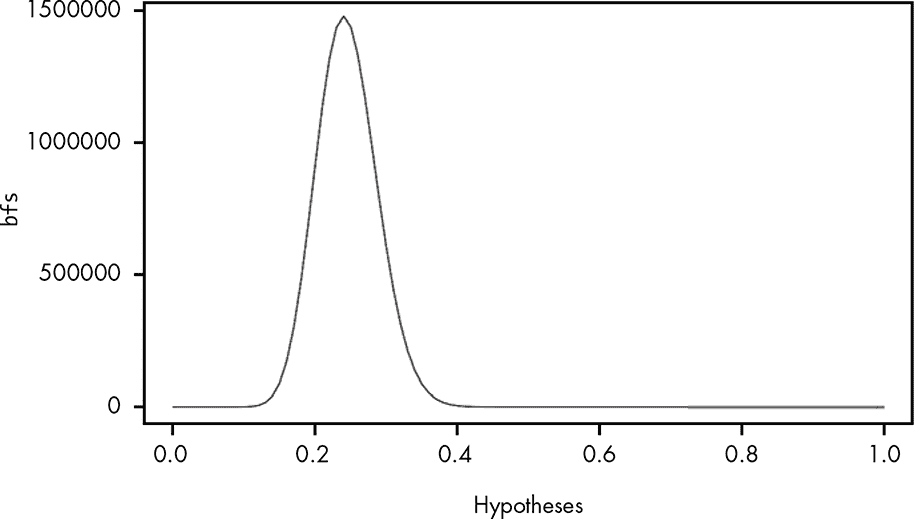

*图 19-1：为每个假设绘制贝叶斯因子*

现在我们可以清楚地看到观察到的数据有不同的解释分布。使用 R，我们可以查看一系列可能的假设，其中我们线条上的每个点代表对应假设的贝叶斯因子，横坐标是假设值。

我们还可以通过使用`max()`函数和我们的`bfs`向量来查看最大的贝叶斯因子有多高：

```
> max(bfs)

1.47877610^{6}
```

然后我们可以检查哪个假设对应于最高的似然比，这将告诉我们我们应该最相信哪个假设。为此，输入：

```
> hypotheses[which.max(bfs)]

0.24
```

现在我们知道，概率 0.24 是我们最好的猜测，因为这个假设与服务员的假设相比，产生了最高的似然比。在第十章中，你学到了使用数据的均值或期望值通常是得出参数估计的一种好方法。这里我们只是简单地选择了能够最好地解释数据的假设，因为我们目前没有办法根据发生的概率来加权我们的估计。

#### *将先验信息加入我们的似然比*

现在假设你将你的发现展示给客户和服务员。两人都同意你的发现相当有说服力，但接着另一个人走过来对你说：“我曾经做过这种游戏，我可以告诉你，出于某种奇怪的行业原因，设计这些鸭子游戏的人从不把奖品率设定在 0.2 到 0.3 之间。我敢打赌，真实的奖品率不会在这个范围内，赔率是 1,000 比 1。除此之外，我没有任何线索。”

现在我们有了一些先验赔率，希望使用它们。由于前游戏制作人给了我们一些关于他先验信念的关于获奖概率的实质赔率，我们可以尝试将这个赔率与我们当前的贝叶斯因子列表相乘，并计算后验赔率。为了做到这一点，我们为我们拥有的每个假设创建一个先验赔率比的列表。正如前游戏制作人所说，0.2 到 0.3 之间的所有概率的先验赔率比应该是 1/1,000。由于制作人对其他假设没有意见，这些假设的赔率比将是 1。我们可以使用一个简单的`ifelse`语句，利用我们的`hypotheses`向量，来创建一个我们的赔率比向量：

```
priors <- ifelse(hypotheses >= 0.2 & hypotheses <= 0.3, 1/1000,1)
```

然后，我们可以再次使用`plot()`来显示这个事先分布：

```
plot(hypotheses,priors,type='l')
```

图 19-2 展示了我们事先的赔率分布。

因为 R 是一个基于向量的语言（关于这一点的更多信息，请参见附录 A），我们可以简单地将我们的`priors`与`bfs`相乘，得到一个新的`posteriors`向量，表示我们的贝叶斯因子：

```
posteriors <- priors*bfs
```

最后，我们可以绘制每个假设的后验赔率图：

```
plot(hypotheses,posteriors,type='l')
```

图 19-3 显示了这个图。

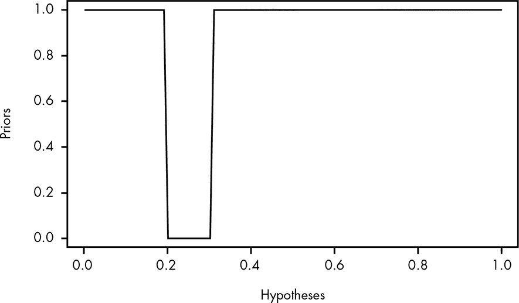

*图 19-2：可视化我们的先验赔率比*

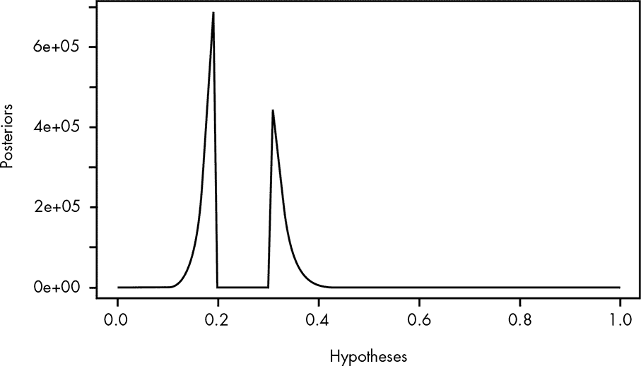

*图 19-3：绘制我们的贝叶斯因子分布*

正如我们所看到的，我们得到了一种非常奇怪的可能信念分布。我们对 0.15 到 0.2 之间以及 0.3 到 0.35 之间的值有合理的信心，但发现 0.2 到 0.3 之间的范围极不可能。但这个分布是真实地代表了我们对每个假设的信念强度，基于我们对鸭子游戏制造过程的了解。

虽然这种可视化图很有帮助，但我们实际上希望能够像处理真实的概率分布一样处理这些数据。这样，我们就可以问一些关于我们对可能假设范围的信任程度的问题，并计算出我们的分布期望值，从而得到一个我们认为的假设单一估计值。

### 构建概率分布

真实的概率分布是所有可能的信念总和为 1 的分布。拥有一个概率分布将使我们能够计算数据的期望（或均值），以便对真实的获奖率做出更好的估计。它还将使我们能够轻松地对一系列值求和，从而得出置信区间和其他类似的估计值。

问题是，如果我们将所有假设的后验比值加起来，它们的和并不为 1，正如这个计算所示：

```
> sum(posteriors)

3.140687510^{6}
```

这意味着我们需要将我们的后验比值归一化，使它们的和为 1。为此，我们只需将`posteriors`向量中的每个值除以所有值的和：

```
p.posteriors <- posteriors/sum(posteriors)
```

现在我们可以看到我们的`p.posteriors`值的和为 1：

```
> sum(p.posteriors)

1
```

最后，让我们绘制我们新的`p.posteriors`：

```
plot(hypotheses,p.posteriors,type='l')
```

图 19-4 展示了该图。

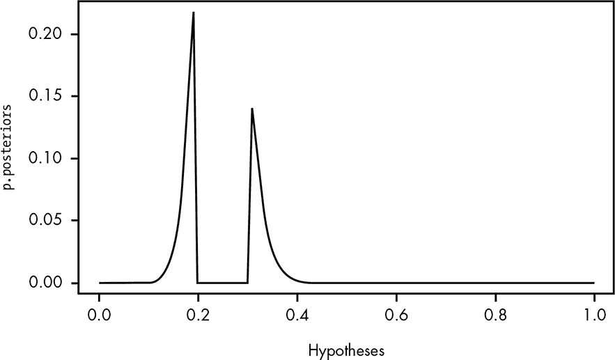

*图 19-4：我们归一化后的后验比值（注意 y 轴的比例）*

我们还可以使用`p.posteriors`来回答一些我们可能对数据有的常见问题。例如，我们现在可以计算真实的获奖率低于服务员所声称的概率。我们只需将所有小于 0.5 的概率加起来：

```
sum(p.posteriors[which(hypotheses < 0.5)])

> 0.9999995
```

如我们所见，奖品率低于服务员假设的概率接近 1。也就是说，我们几乎可以确定服务员高估了真实的奖品率。

我们还可以计算我们的分布期望，并将此结果作为我们对真实概率的估计值。请记住，期望值只是按其值加权的所有估计值的总和：

```
> sum(p.posteriors*hypotheses)

0.2402704
```

当然，我们可以看到我们的分布有些不典型，中间有一个大间隙，所以我们可能只是想选择最*可能*的估计值，如下所示：

```
> hypotheses[which.max(p.posteriors)]

0.19
```

现在我们已经使用贝叶斯因子提出了一系列关于真实可能的获奖概率估计值。这意味着我们已经将贝叶斯因子作为一种参数估计的方法！

### 从贝叶斯因子到参数估计

让我们再花点时间单独看一下我们的似然比率。当我们没有为任何假设使用先验概率时，你可能会觉得我们已经有了一个非常好的方法来解决这个问题，而不需要贝叶斯因子。我们观察到 24 只带奖品的鸭子和 76 只不带奖品的鸭子。难道我们不能直接使用我们那熟悉的 beta 分布来解决这个问题吗？正如我们从第五章以来多次讨论的那样，如果我们想估计某个事件的发生率，我们总是可以使用 beta 分布。图 19-5 显示了一个 alpha 为 24、beta 为 76 的 beta 分布图。

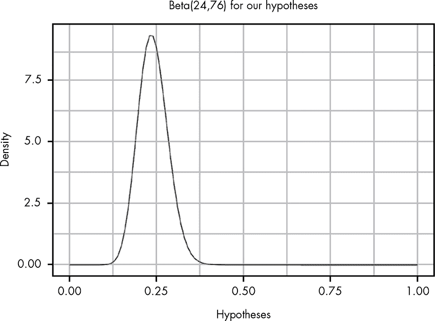

*图 19-5：具有 alpha 为 24 和 beta 为 76 的 beta 分布*

除了 y 轴的刻度外，这个图几乎与我们似然比率的原始图相同！事实上，如果我们做一些简单的调整，我们可以让这两个图完美对齐。如果我们按我们的 `dx` 的大小缩放 beta 分布，并标准化我们的 `bfs`，我们可以看到这两个分布变得非常接近（见图 19-6）。

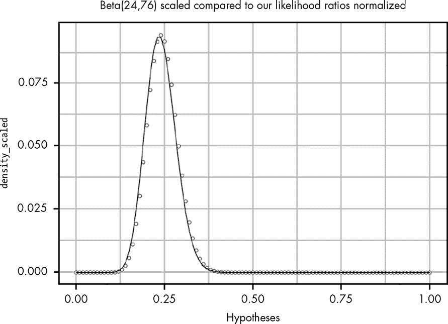

*图 19-6：我们的初始似然比率分布与 Beta(24,76) 映射得相当接近。*

现在似乎只有一点点差异。我们可以通过使用最弱的先验来修正这一点，这表明获得奖品和不获得奖品的可能性是相等的——也就是说，通过将 1 加到 alpha 和 beta 参数中，如图 19-7 所示。

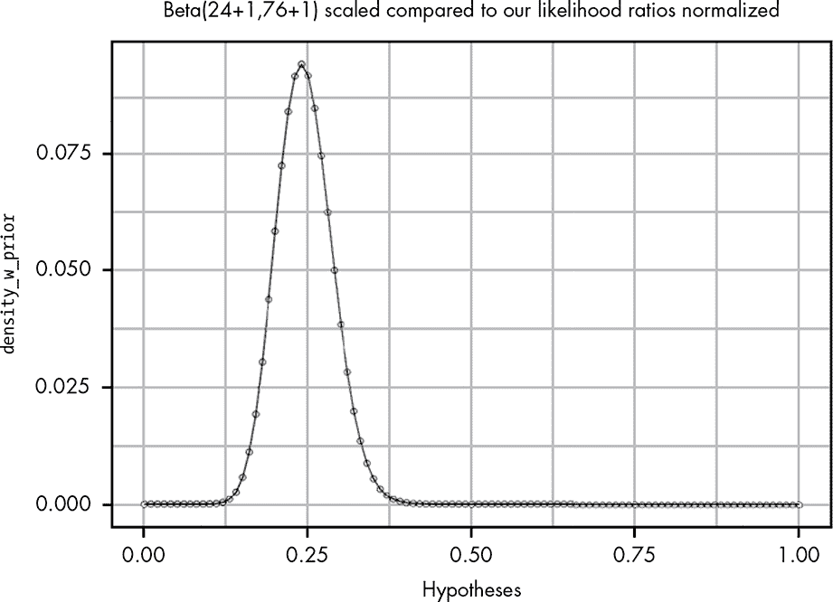

*图 19-7：我们的似然比率完美地映射到一个 Beta(24+1,76+1) 分布。*

现在我们可以看到这两个分布完全对齐。第五章提到，beta 分布是从我们基本的概率规则推导出来的有一定难度。然而，通过使用贝叶斯因子，我们能够经验性地重现一个修改版的 beta 分布，并假设其先验为 Beta(1,1)。而且我们做这一切时不需要任何复杂的数学！我们所需要做的就是：

1.  定义给定假设下证据的概率。

1.  考虑所有可能的假设。

1.  将这些值标准化，创建一个概率分布。

在本书中每次使用 beta 分布时，我们都使用了一个 beta 分布的先验。这使得数学变得更简单，因为我们可以通过结合似然和先验 beta 分布的 alpha 和 beta 参数来得到后验分布。换句话说：

Beta(α[后验], β[后验]) = Beta(α[先验] + α[似然], β[先验] + β[似然])

然而，通过从贝叶斯因子构建我们的分布，我们能够轻松地使用一个独特的先验分布。贝叶斯因子不仅是设置假设检验的一个伟大工具，事实上，它也是我们解决问题所需的所有工具，无论是假设检验还是参数估计。我们只需要能够定义两个假设之间的基本比较，这样我们就可以开始了。

当我们在第十五章中构建我们的 A/B 测试时，我们弄清楚了如何将许多假设检验简化为参数估计问题。现在你已经看到了最常见形式的假设检验也可以用于执行参数估计。凭借这两个相关的洞察，几乎没有限制我们可以通过仅使用概率的基本规则来解决的概率问题类型。

### 总结

现在你已经完成了贝叶斯统计的学习之旅，你可以真正欣赏你所学的知识的美妙。从概率的基本规则开始，我们可以推导出贝叶斯定理，贝叶斯定理让我们将证据转化为一个表达我们信念强度的陈述。通过贝叶斯定理，我们可以推导出贝叶斯因子，这是一个用于比较两个假设如何解释我们观察到的数据的工具。通过迭代可能的假设并归一化结果，我们可以使用贝叶斯因子为未知值创建参数估计。反过来，这使我们能够通过比较我们的估计进行无数其他的假设检验。而我们需要做的，正是使用概率的基本规则来定义我们的似然，*P*(*D* | *H*)！

### 练习

尝试回答以下问题，看看你在使用贝叶斯因子和后验比率进行参数估计方面的理解程度。解决方案可以在 *[`nostarch.com/learnbayes/`](https://nostarch.com/learnbayes/)* 找到。

1.  我们的贝叶斯因子假设我们在观察 *H*[1]: *P*(奖品) = 0.5。这让我们推导出了一个贝塔分布版本，α为 1，β为 1。如果我们选择一个不同的概率值为 *H*[1]，这是否会有所不同？假设 *H*[1]: *P*(奖品) = 0.24，那么看看归一化后使其总和为 1 的分布，是否与原假设的分布有所不同。

1.  为分布写一个先验，其中每个假设比前一个假设的可能性大 1.05 倍（假设我们的 `dx` 保持不变）。

1.  假设你观察到了另一个鸭子游戏，其中包括 34 只有奖鸭和 66 只没有奖鸭。你如何设置一个检验来回答“在这个游戏中，你赢得奖品的机会比我们示例中的游戏更大吗？”实现这一点需要比本书中使用的 R 语言更复杂一些，但看看你能否自己学会这些，开始你在更高级贝叶斯统计学的冒险吧！
