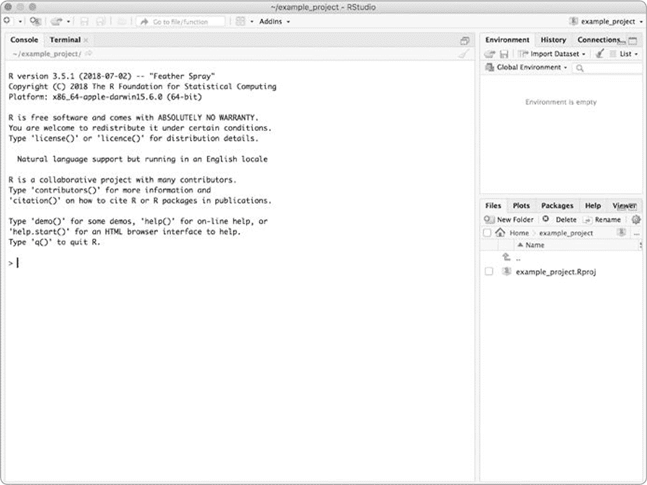
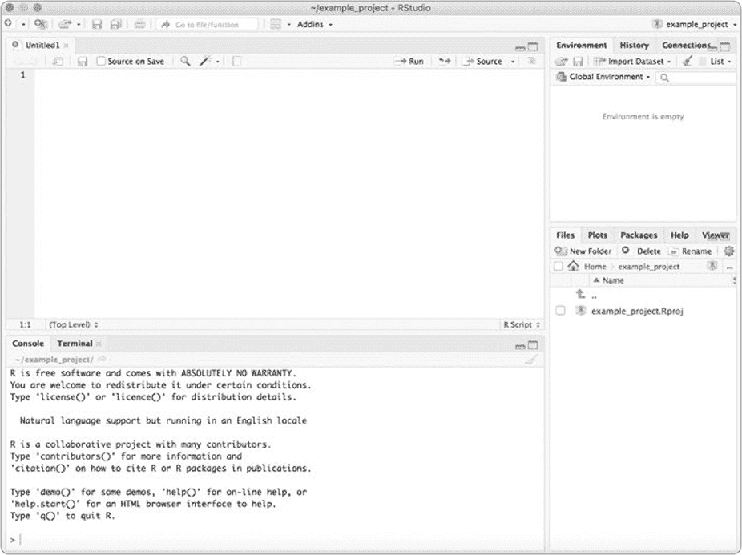
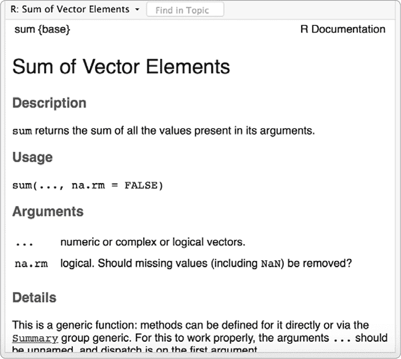
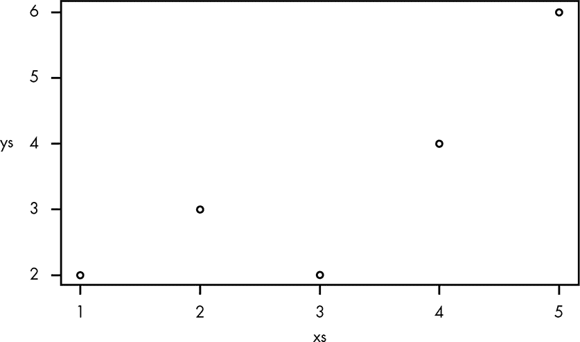
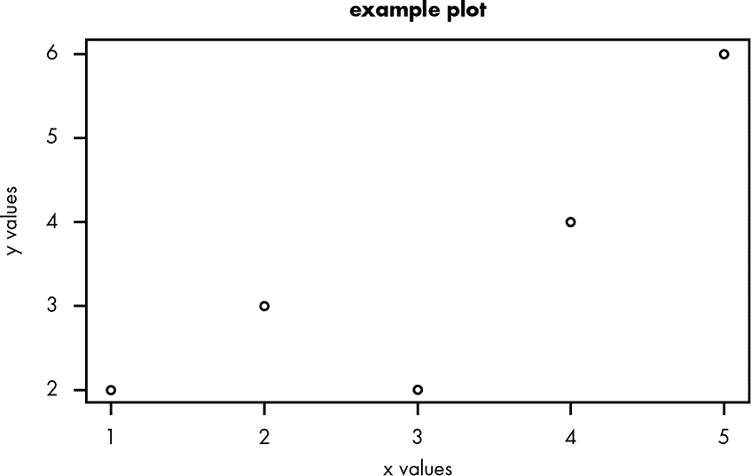
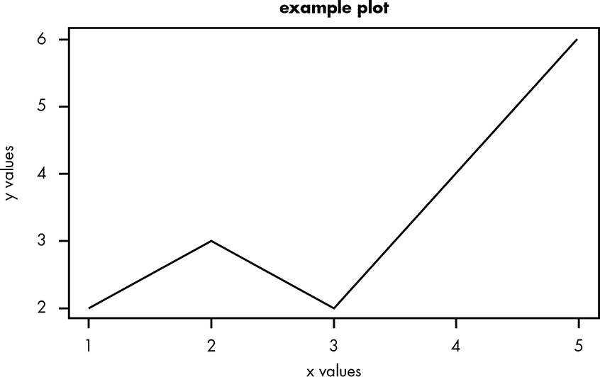
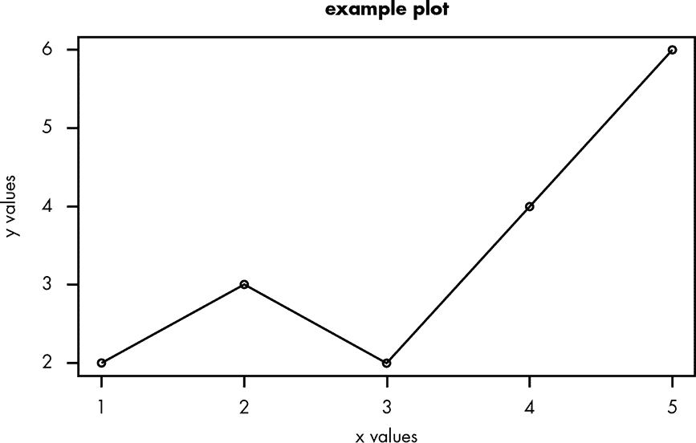
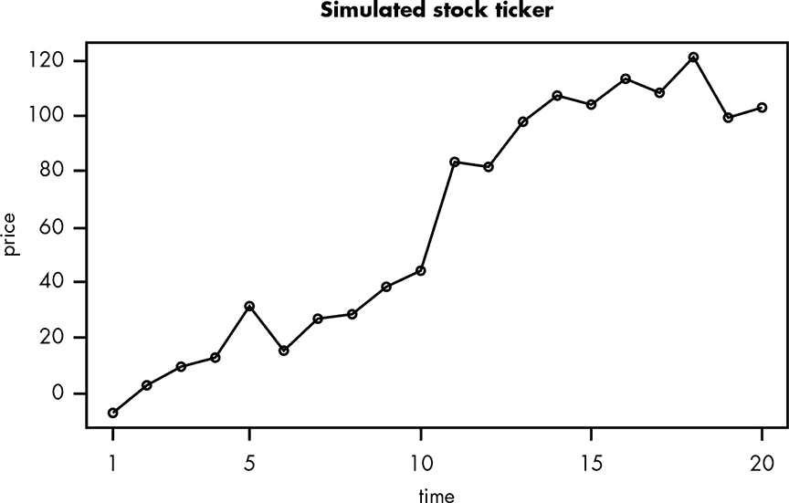

## **A

R**快速介绍


在本书中，我们使用 R 编程语言来帮助我们完成一些复杂的数学工作。R 是一种专门用于统计学和数据科学的编程语言。如果你没有 R 的使用经验，或者没有编程经验，别担心——本附录将帮助你入门。

### R 和 RStudio

要运行本书中的代码示例，你需要在电脑上安装 R。安装 R，请访问 *[`cran.rstudio.com/`](https://cran.rstudio.com/)* 并按照你使用的操作系统的安装步骤进行安装。

安装完 R 后，你还应该安装 *RStudio*，它是一个集成开发环境（IDE），使得运行 R 项目变得极为简单。从 *[www.rstudio.com/products/rstudio/download/](http://www.rstudio.com/products/rstudio/download/)* 下载并安装 RStudio。

当你打开 RStudio 时，你应该会看到几个面板（见图 A-1）。



*图 A-1：查看 RStudio 中的控制台*

最重要的面板是中间的大面板，叫做 *控制台*。在控制台中，你可以输入书中的任何代码示例，并通过按下 ENTER 键来运行它们。控制台会立即运行你输入的所有代码，这使得跟踪你到目前为止写过的代码变得困难。

要编写可以保存并稍后继续使用的程序，你可以将代码放入一个 *R 脚本* 中，R 脚本是一个文本文件，稍后你可以加载到控制台中。R 是一种极具交互性的编程语言，因此不要把控制台仅仅看作是你可以测试代码的地方，应该把 R 脚本看作是一种可以快速加载到控制台中使用的工具。

### 创建 R 脚本

要创建 R 脚本，在 RStudio 中选择 **文件▸新建文件▸R 脚本**。这将会在左上方创建一个新的空白面板（见图 A-2）。



*图 A-2：创建 R 脚本*

在这个面板中，你可以输入代码并将其保存为文件。要运行代码，只需点击面板右上角的 **源代码** 按钮，或者点击 **运行** 按钮来运行单独的代码行。源代码按钮将自动把你的文件加载到控制台，就像你自己输入的那样。

### R 中的基本概念

本书中我们将把 R 用作一个高级计算器，这意味着你只需要理解一些基础知识，就能自己解决问题并扩展书中的示例。

#### *数据类型*

所有编程语言都有不同类型的数据，你可以根据不同的用途使用这些数据并以不同的方式进行操作。R 有丰富的数据类型和数据结构，但本书中我们只会使用其中一小部分。

##### 双精度

我们在 R 中使用的数字都属于 *双精度* 类型（即“double-precision floating-point”，是计算机中表示小数的最常见方式）。双精度是表示小数的默认类型。除非另有指定，否则你在控制台输入的所有数字都是双精度类型。

我们可以使用标准的数学运算操作符对双精度类型的数字进行操作。例如，我们可以用 `+` 操作符对两个数字进行加法运算。在控制台中试试看：

```
> 5 + 2

[1] 7
```

我们还可以使用 `/` 操作符来除以任何会得到小数结果的数字：

```
> 5/2

[1] 2.5
```

我们可以像这样用 `*` 操作符来乘以值：

```
> 5 * 2

[1] 10
```

并使用 `^` 操作符对值进行指数运算。例如，5² 是：

```
> 5²

[1] 25
```

我们还可以在数字前加 `-` 使其变为负数：

```
> 5 - -2

[1] 7
```

我们也可以使用带有 `e+` 的科学计数法。所以 5 × 10² 就是：

```
> 5e+2

[1] 500
```

如果我们使用 `e-`，我们将得到与 5 × 10^(–2) 相同的结果：

```
> 5e-2

[1] 0.05
```

了解这一点很有用，因为有时如果结果太大，R 会以科学计数法的形式返回结果，这样可能会更易于显示，如下所示：

```
> 5*10²⁰

[1] 5e+20
```

##### 字符串

R 中的另一个重要类型是 *字符串*，它只是用于表示文本的一组字符。在 R 中，我们用引号将字符串括起来，像这样：

```
> "hello"

[1] "hello"
```

请注意，如果你把一个数字放在字符串中，你就不能在常规的数字运算中使用该数字，因为字符串和数字是不同的类型。例如：

```
> "2" + 2

Error in "2" + 2 : non-numeric argument to binary operator
```

在本书中，我们不会频繁使用字符串。我们主要用它们来传递函数参数和为图表添加标签。但如果你使用文本，记住它们是很重要的。

##### 逻辑类型

*逻辑* 或 *二进制* 类型是真或假值，由代码 `TRUE` 和 `FALSE` 表示。请注意，`TRUE` 和 `FALSE` 不是字符串——它们不被引号包围，且全部字母大写。（R 还允许你使用 `T` 或 `F` 来代替写出完整的单词。）

我们可以将逻辑类型与符号 `&`（“与”）和 `|`（“或”）结合，执行基本的逻辑操作。例如，如果我们想知道某个事物是否可能同时为真 *且* 为假，我们可以输入：

```
> TRUE & FALSE
```

R 会返回：

```
[1] FALSE
```

这告诉我们一个值不能同时为真和假。

那么，真 *或* 假呢？

```
> TRUE | FALSE

[1] TRUE
```

像字符串一样，在本书中逻辑值主要用来作为我们将要使用的函数的参数，或者作为比较两个不同值的结果。

#### *缺失值*

在实际统计学和数据科学中，数据经常缺失一些值。例如，假设你有一个月每天早晚的温度数据，但某一天出现了故障，导致缺失了早晨的温度。由于缺失值非常常见，R 语言有一种特殊的方式来表示它们：使用值`NA`。处理缺失值非常重要，因为它们在不同的上下文中可能意味着截然不同的事情。例如，当你测量降水量时，缺失值可能意味着雨量计里没有雨水，或者可能意味着那天晚上温度非常低，导致雨量计破裂，所有的水都泄漏了。在第一种情况下，我们可能会认为缺失值意味着 0，但在后者情况下，缺失值到底应该是多少就不太清楚了。将缺失值与其他值区分开来，迫使我们考虑这些差异。

为了提示我们在尝试使用缺失值时弄清楚它们的含义，R 会在任何涉及缺失值的操作中输出`NA`：

```
> NA + 2

[1] NA
```

正如我们稍后将看到的，R 中的各种函数可以用不同的方式处理缺失值，但对于本书中的 R，你不需要担心缺失值。

#### *向量*

几乎每种编程语言都有一些特殊功能，使得它在解决特定领域的问题时格外合适。R 语言的特别之处在于它是一个*向量语言*。向量是一个值的列表，R 做的每一件事都是对向量的操作。我们使用代码`c(...)`来定义向量（即使我们只输入一个值，R 也会自动为我们处理！）。

为了理解向量的工作原理，我们来看一个例子。请输入下面的代码到脚本中，而不是控制台。我们首先通过将变量`x`赋值为向量`c(1,2,3)`，并使用赋值操作符`<-`来创建一个新的向量，如下所示：

```
x <- c(1,2,3)
```

现在我们有了一个向量，可以将它用于我们的计算中。当我们执行一个简单的操作，比如将`3`加到`x`时，在控制台中输入这个操作会得到一个相当意外的结果（尤其是如果你习惯了其他编程语言的话）：

```
> x + 3

[1] 4 5 6
```

`x + 3`的结果告诉我们，如果将`3`加到`x`向量中的每个值上，会发生什么情况。（在许多其他编程语言中，我们可能需要使用`for`循环或其他迭代器来执行此操作。）

我们也可以将向量相加。在这里，我们将创建一个新向量，包含三个元素，每个元素的值为`2`。我们将这个向量命名为`y`，然后将`y`加到`x`上：

```
> y <- c(2,2,2)

> x + y

[1] 3 4 5
```

如你所见，这个操作将`x`中的每个元素与`y`中的对应元素相加。

如果我们将两个向量相乘会怎样？

```
> x * y

[1] 2 4 6
```

`x`中的每个值都被其在`y`中对应的值相乘。如果列表大小不一样，或者不是同一大小的倍数，那么我们会遇到错误。如果一个向量是另一个向量的倍数，R 会反复将较小的向量应用到较大的向量上。然而，在本书中，我们不会利用这一特性。

我们可以通过基于现有的向量定义另一个向量来轻松地组合向量。在这里，我们通过将`x`和`y`组合在一起创建向量`z`：

```
> z <- c(x,y)

> z

[1] 1 2 3 2 2 2
```

请注意，这个操作没有给我们一个向量的向量；相反，我们得到了一个单一的向量，其中包含了`x`和`y`中所有的值，顺序就是你在定义`z`时设定的`x`和`y`的顺序。

对于初学者来说，学习在 R 中高效使用向量可能有点棘手。具有非向量语言经验的程序员常常是最难适应的。别担心：在本书中，我们将使用向量使代码更易读。

### 函数

*函数*是执行特定操作的代码块，我们将在 R 中使用它们来解决问题。

在 R 和 RStudio 中，所有函数都配有文档。如果你在 R 控制台中输入`?`加上函数名，你将看到该函数的完整文档。例如，如果你在 RStudio 控制台中输入`?sum`，你应该能在右下角的屏幕上看到如图 A-3 所示的文档。



*图 A-3：查看 sum()函数的文档*

这份文档给出了`sum()`函数的定义及其一些用法。`sum()`函数将一个向量的值相加。文档中提到它接受`...`作为参数，这意味着它可以接受任意数量的值。通常这些值是一个数字向量，但它们也可以是多个向量。

文档还列出了一个*可选参数*：`na.rm = FALSE`。可选参数是你不需要传递给函数的参数，函数仍然可以正常工作；如果你没有传递可选参数，R 将使用该参数的默认值。在`na.rm`的情况下，它会自动删除任何缺失值，默认值在等号后是`FALSE`。这意味着默认情况下，`sum()`不会删除缺失值。

#### *基础函数*

以下是 R 中一些最重要的函数。

##### length()和 nchar()函数

`length()`函数将返回一个向量的长度：

```
> length(c(1,2,3))

[1] 3
```

由于该向量中有三个元素，`length()`函数返回`3`。

因为 R 中的一切都是向量，所以你可以使用`length()`函数来查找任何东西的长度——即使是像`“doggies”`这样的字符串：

```
> length("doggies")

[1] 1
```

R 告诉我们`“doggies”`是一个包含一个字符串的向量。

现在，如果我们有两个字符串，`“doggies”`和`“cats”`，我们将得到：

```
> length(c("doggies","cats"))

[1] 2
```

要查找字符串中的字符数，我们使用`nchar()`函数：

```
> nchar("doggies")

[1] 7
```

注意，如果我们对`c(“doggies”,”cats”)`向量使用`nchar()`，R 会返回一个新向量，包含每个字符串的字符数：

```
> nchar(c("doggies","cats"))

[1] 7 4
```

##### sum()、cumsum()和 diff()函数

`sum()`函数接受一个数字向量，并将所有这些数字相加：

```
> sum(c(1,1,1,1,1))

[1] 5
```

正如我们在前一节的文档中看到的，`sum()`接受`...`作为其参数，这意味着它可以接受任意数量的值：

```
> sum(2,3,1)

[1] 6

> sum(c(2,3),1)

[1] 6

> sum(c(2,3,1))

[1] 6
```

如你所见，无论我们提供多少个向量，`sum()`都会将它们加起来，就好像它们是一个整数的单一向量。如果你想对多个向量求和，你需要分别对它们调用`sum()`。

另外请记住，`sum()`函数有一个可选参数`na.rm`，默认设置为`FALSE`。`na.rm`参数决定了`sum()`是否移除`NA`值。

如果我们将`na.rm`保持为`FALSE`，当我们尝试对包含缺失值的向量使用`sum()`时，会发生以下情况：

```
> sum(c(1,NA,3))

[1] NA
```

正如我们在引入`NA`时看到的，将一个值加到`NA`值上会得到`NA`。如果我们希望 R 给出一个数字作为答案，我们可以通过设置`na.rm = TRUE`来告诉`sum()`去除`NA`值：

```
> sum(c(1,NA,3),na.rm = TRUE)

[1] 4
```

`cumsum()`函数接受一个向量并计算其*累积和*——一个与输入向量长度相同的向量，将每个数字替换为它前面所有数字的和（包括该数字）。下面是一个代码示例，使这一点更加清晰：

```
> cumsum(c(1,1,1,1,1))

[1] 1 2 3 4 5

> cumsum(c(2,10,20))

[1] 2 12 32
```

`diff()`函数接受一个向量，并从向量中每个数字中减去前一个数字：

```
> diff(c(1,2,3,4,5))

[1] 1 1 1 1

> diff(c(2,10,3))

[1]  8 -7
```

注意，`diff()`函数的结果比原始向量少了一个元素。这是因为第一个值没有被减去。

##### `:`运算符和`seq()`函数

通常，我们会希望自动生成向量，而不是手动列出每个元素。为了自动创建某个范围内的整数向量，我们可以使用`:`运算符来分隔范围的起始值和结束值。R 甚至能够判断你是想递增还是递减（将`c()`包裹此运算符并非严格必要）：

```
> c(1:5)

[1] 1 2 3 4 5

> c(5:1)

[1] 5 4 3 2 1
```

当你使用`:`时，R 会从第一个值数到最后一个值。

有时我们希望按其他增量计数，而不是每次增加 1。`seq()`函数允许我们创建递增指定数值的序列向量。`seq()`的参数依次是：

1.  序列的起始

1.  序列的结束

1.  序列的递增量

这里有一些使用`seq()`的示例：

```
> seq(1,1.1,0.05)

[1] 1.00 1.05 1.10

> seq(0,15,5)

[1]  0  5 10 15

> seq(1,2,0.3)

[1] 1.0 1.3 1.6 1.9
```

如果我们想用`seq()`函数倒数到某个值，我们可以使用负值作为递增量，例如这样：

```
> seq(10,5,-1)

[1] 10  9  8  7  6  5
```

##### `ifelse()`函数

`ifelse()`函数告诉 R 根据某个条件执行两种操作之一。如果你习惯于其他语言中的普通`if ... else`控制结构，这个函数可能会有点让人困惑。在 R 中，它接受以下三个参数（按顺序）：

1.  一个关于向量的陈述，表明该向量的值可能为真或假

1.  当条件为真时会发生什么

1.  当条件为假时会发生什么

`ifelse()`函数会一次性操作整个向量。当向量只包含单个值时，它的使用非常直观：

```
> ifelse(2 < 3,"small","too big")

[1] "small"
```

这里的条件是 2 小于 3，我们要求 R 如果成立则输出`“small”`，否则输出`“too big”`。

假设我们有一个包含多个值的向量`x`：

```
> x <- c(1,2,3)
```

`ifelse()`函数会为向量中的每个元素返回一个值：

```
> ifelse(x < 3,"small","too big")

[1] "small"   "small"   "too big"
```

我们还可以在`ifelse()`的结果参数中使用向量。假设除了我们的`x`向量外，我们还有另一个向量`y`：

```
y <- c(2,1,6)
```

我们想生成一个新列表，其中包含向量中每个元素对应的`x`和`y`的最大值。我们可以使用`ifelse()`来非常简单地解决这个问题：

```
> ifelse(x > y,x,y)

[1] 2 2 6
```

你可以看到 R 已将`x`中的值与`y`中相应的值进行了比较，并输出每个元素中较大的那个。

### 随机抽样

我们经常使用 R 来随机抽样。这使得计算机可以为我们选择一个随机的数字或值。我们使用这个样本来模拟活动，例如抛硬币、玩“剪刀石头布”或从 1 到 100 之间选择一个数字。

#### *runif()函数*

一种随机抽样的方法是使用`runif()`函数，它是“随机均匀”的缩写，接受一个必需的参数`n`，并在 0 到 1 的范围内提供相应数量的样本：

```
> runif(5)

[1] 0.8688236 0.1078877 0.6814762 0.9152730 0.8702736
```

我们可以将这个函数与`ifelse()`结合使用，以 20%的概率生成值`A`。在这种情况下，我们将使用`runif(5)`创建五个 0 到 1 之间的随机值。如果某个值小于 0.2，则返回``A``；否则，返回`“B”`：

```
> ifelse(runif(5) < 0.2,"A","B")

[1] "B" "B" "B" "B" "A"
```

由于我们生成的数字是随机的，因此每次运行`ifelse()`函数时我们都会得到不同的结果。以下是一些可能的结果：

```
> ifelse(runif(5) < 0.2,"A","B")

[1] "B" "B" "B" "B" "B"

> ifelse(runif(5) < 0.2,"A","B")

 [1] "A" "A" "B" "B" "B"
```

`runif()`函数可以接受可选的第二和第三个参数，分别是均匀抽样范围的最小值和最大值。默认情况下，函数使用的是 0 到 1（包括 1）之间的范围，但你可以设置成任何你想要的范围：

```
> runif(5,0,2)

[1] 1.4875132 0.9368703 0.4759267 1.8924910 1.6925406
```

#### *rnorm()函数*

我们还可以使用`rnorm()`函数从正态分布中抽样，书中将更深入讨论这一点（正态分布内容见第十二章）：

```
> rnorm(3)

[1]  0.28352476  0.03482336 -0.20195303
```

默认情况下，`rnorm()`从均值为 0，标准差为 1 的正态分布中抽样，就像这个例子一样。对于不熟悉正态分布的读者来说，这意味着样本将围绕 0 呈“钟形”分布，大多数样本接近 0，极少有小于-3 或大于 3 的样本。

`rnorm()`函数有两个可选参数，`mean`和`sd`，允许你分别设置不同的均值和标准差：

```
> rnorm(4,mean=2,sd=10)

[1] -12.801407  -9.648737   1.707625  -8.232063
```

在统计学中，从正态分布中抽样通常比从均匀分布中抽样更为常见，因此`rnorm()`非常有用。

#### *sample()函数*

有时，我们想要从其他分布中进行采样，而不仅仅是从一个经过充分研究的分布中进行采样。假设你有一个抽屉，里面装着多种颜色的袜子：

```
socks <- c("red","grey","white","red","black")
```

如果你想模拟随机挑选两只袜子的行为，你可以使用 R 的 `sample()` 函数，该函数的参数是一个值的向量和要采样的元素数量：

```
> sample(socks,2)

[1] "grey" "red"
```

`sample()` 函数的行为就像我们从抽屉里挑选了两只随机的袜子 —— 而且没有将任何袜子放回去。如果我们采样五只袜子，我们将得到最初抽屉里所有的袜子：

```
> sample(socks,5)

[1] "grey"  "red"   "red"   "black" "white"
```

这意味着如果我们尝试从抽屉中拿出六只袜子，而抽屉里只有五只袜子可用，我们将会得到一个错误：

```
> sample(socks,6)

Error in sample.int(length(x), size, replace, prob) :

  cannot take a sample larger than the population when 'replace = FALSE'
```

如果我们希望同时进行采样并且“把袜子放回去”，我们可以将可选参数 `replace` 设置为 `TRUE`。现在，每次我们采样一只袜子时，我们都会把它放回抽屉。这使得我们能够采样更多的袜子，而抽屉里的袜子数量并不会改变。这也意味着抽屉中袜子的分布永远不会变化。

```
> sample(socks,6,replace=TRUE)

[1] "black" "red"   "black" "red"   "black" "black"
```

有了这些简单的采样工具，你可以在 R 中运行出令人惊讶的复杂模拟，省去了大量数学计算。

#### *使用 set.seed() 获取可预测的随机结果*

R 生成的“随机数”并不是真正的随机数。像所有编程语言一样，随机数是通过*伪随机数生成器*生成的，该生成器采用一个*种子值*，并利用该种子值生成一串足够随机的数字，适用于大多数用途。种子值设置了随机数生成器的初始状态，并决定接下来会生成哪些数字。在 R 中，我们可以通过 `set.seed()` 函数手动设置这个种子。设置种子在我们希望使用相同的随机结果时非常有用：

```
> set.seed(1337)

> ifelse(runif(5) < 0.2,"A","B")

[1] "B" "B" "A" "B" "B"

> set.seed(1337)

> ifelse(runif(5) < 0.2,"A","B")

[1] "B" "B" "A" "B" "B"
```

正如你所看到的，当我们使用相同的种子两次，并调用 `runif()` 函数时，它生成了相同的所谓随机值。使用 `set.seed()` 的主要好处是使结果可复现。这可以大大简化跟踪程序中涉及采样的 bug，因为每次运行程序时，结果都不会发生变化。

### 定义你自己的函数

有时编写我们自己的函数来执行一些需要反复操作的特定任务是非常有用的。在 R 中，我们可以使用关键字 `function` 来定义函数（在编程语言中，*关键字*是指编程语言为特定用途保留的特殊单词）。

下面是一个函数的定义，它接受一个单一参数 `val` —— 这里代表用户输入的值 —— 然后将 `val` 进行两倍和立方操作。

```
double_then_cube <- function(val){

  (val*2)³

}
```

一旦我们定义了函数，就可以像使用 R 的内建函数一样使用它。下面是我们应用于数字 8 的 `double_then_cube()` 函数：

```
> double_then_cube(8)

[1] 4096
```

此外，由于我们定义函数时所做的所有操作都是*向量化*的（也就是说，所有的值都作用于值的向量），我们的函数不仅能作用于单个值，也能作用于向量：

```
> double_then_cube(c(1,2,3))

[1] 8 64 216
```

我们也可以定义接受多个参数的函数。这里定义的 `sum_then_square()` 函数将两个参数相加，然后对结果进行平方：

```
sum_then_square <- function(x,y){

  (x+y)²

}
```

通过在函数定义中包含两个参数 `(x,y)`，我们告诉 R `sum_then_square()` 函数期望两个参数。现在我们可以像这样使用我们新的函数：

```
> sum_then_square(2,3)

[1] 25

> sum_then_square(c(1,2),c(5,3))

[1] 36 25
```

我们也可以定义需要多行代码的函数。在 R 中，当调用函数时，它始终返回函数定义最后一行计算的结果。这意味着我们可以像这样重写 `sum_then_square()`：

```
sum_then_square <- function(x,y){

  sum_of_args <- x+y

  square_of_result <- sum_of_args²

  square_of_result

}
```

通常，当你编写函数时，你会希望将它们写入 R 脚本文件中，这样你就可以保存它们并在以后重用。

### 创建基本图表

在 R 中，我们可以非常轻松地生成数据的图表。虽然 R 拥有一个非常强大的绘图库 `ggplot2`，其中包含许多用于生成美丽图表的有用函数，但我们暂时将自己限制在 R 的基础绘图函数，这些函数本身已经非常有用。

为了展示绘图如何工作，我们将创建两个值的向量，即我们的 `xs` 和 `ys`：

```
> xs <- c(1,2,3,4,5)

> ys <- c(2,3,2,4,6)
```

接下来，我们可以将这些向量作为参数传递给 `plot()` 函数，后者将为我们绘制数据。`plot()` 函数有两个参数：x 轴上各点的值和 y 轴上这些点的值，顺序是这样的：

```
> plot(xs,ys)
```

此函数应在 RStudio 的左下角窗口中生成 图 A-4 中所示的图表。



*图 A-4：使用 R 的 plot() 函数创建的简单图表*

该图表显示了我们 `xs` 值与其对应的 `ys` 值之间的关系。如果我们回到函数中，可以使用可选的 `main` 参数为该图表添加标题。我们还可以使用 `xlab` 和 `ylab` 参数更改 x 轴和 y 轴的标签，像这样：

```
plot(xs,ys,

     main="example plot",

     xlab="x values",

     ylab="y values"

     )
```

新的标签应按 图 A-5 中的显示方式出现。



*图 A-5：使用 plot() 函数更改图表标题和标签*

我们还可以使用 `type` 参数更改图表的类型。我们生成的第一种图表叫做 *点图*，但如果我们想制作折线图，通过每个值绘制一条线，我们可以设置 `type="l"`：

```
plot(xs,ys,

     type="l",

     main="example plot",

     xlab="x values",

     ylab="y values"

     )
```

然后它看起来就像 图 A-6。



*图 A-6：使用 R 的 plot() 函数生成的折线图*

或者我们可以两者都做！一个叫做 `lines()` 的 R 函数可以向现有图表添加线条。它接受与 `plot()` 相似的大多数参数：

```
plot(xs,ys,

     main="example plot",

     xlab="x values",

     ylab="y values"

     )

lines(xs,ys)
```

图 A-7 显示了此函数生成的图表。



*图 A-7：使用 R 的 lines() 函数向现有图表添加线条*

使用 R 的基础图形还有很多令人惊叹的方式，你可以通过查阅 `?plot` 获取更多信息。然而，如果你想在 R 中创建真正美丽的图表，建议研究 `ggplot2` 库 (*[`ggplot2.tidyverse.org/`](https://ggplot2.tidyverse.org/)*).

### 练习：模拟股票价格

现在，让我们把学到的所有内容结合起来，创建一个模拟的股票行情！人们通常使用正态分布随机值的累积和来模拟股票价格。首先，我们通过使用 `seq()` 函数生成一个从 1 到 20 的数值序列，每次递增 1 来模拟一段时间内的股票价格变动。我们将代表这段时间的向量命名为 `t.vals`。

```
 t.vals <- seq(1,20,by=1)
```

现在，`t.vals` 是一个包含从 1 到 20 的数字序列的向量，每次递增 1。接下来，我们通过对每个 `t.vals` 中的时间点使用正态分布值的累积和来创建模拟的价格。为此，我们将使用 `rnorm()` 来抽取与 `t.vals` 长度相等的随机值，然后使用 `cumsum()` 来计算这些值的累积和。这将代表价格基于随机运动的上下波动；较小的波动比极端波动更常见。

```
 price.vals <- cumsum(rnorm(length(t.vals),mean=5,sd=10))
```

最后，我们可以将所有这些数值绘制成图，看看它们的效果！我们将同时使用 `plot()` 和 `lines()` 函数，并根据它们所代表的内容标记坐标轴。

```
plot(t.vals,price.vals,

     main="Simulated stock ticker",

     xlab="time",

     ylab="price")

lines(t.vals,price.vals)
```

`plot()` 和 `lines()` 函数应生成图 A-8 所示的图表。



*图 A-8：为我们模拟的股票行情生成的图表*

### 总结

本附录应涵盖足够的 R 知识，以便你理解本书中的示例。我建议你跟着书中的章节学习，然后通过修改代码示例来进一步探索。R 还提供了丰富的在线文档，如果你想深入实验，可以参考它们。
