## 第二十一章：**B

足够的微积分知识来应对**

在本书中，我们偶尔会使用一些微积分的概念，尽管不需要实际手动解决微积分问题！需要的是真正理解一些微积分的基础知识，例如导数和（尤其是）积分。本附录绝不是试图深入教授这些概念或展示如何解题，而是简要概述这些思想以及它们在数学符号中的表示方式。

### 函数

一个 *函数* 就是一个数学“机器”，它接受一个值，对其进行操作并返回另一个值。这与 R 中的函数非常相似（见 附录 A）：它们接受一个值并返回一个结果。例如，在微积分中，我们可能会有一个名为 *f* 的函数，定义如下：

*f*(*x*) = *x*²

在这个例子中，*f* 接受一个值 *x* 并将其平方。如果我们输入值 3 到 *f* 中，例如，我们得到：

*f*(3) = 9

这与高中代数中你可能见过的情况有所不同，在那里你通常会有一个值 *y* 和一些包含 *x* 的方程式。

*y* = *x*²

函数之所以重要，部分原因在于它们使我们能够抽象化我们所做的实际计算。也就是说，我们可以说像 *y* = *f*(*x*) 这样的表达式，只关注函数本身的抽象行为，而不必关心它是如何定义的。这就是我们在本附录中采用的方法。

作为一个例子，假设你正在训练参加一场 5 公里的比赛，并且你正在使用一块智能手表来跟踪你的距离、速度、时间和其他因素。你今天去跑步，跑了半个小时。然而，你的智能手表出现了故障，只记录了你 30 分钟跑步过程中每小时的速度（mph）。图 B-1 显示了你能够恢复的数据。

对于这个附录，可以将你的奔跑速度视为由一个函数 *s* 创建的，该函数接受一个参数 *t*，即时间（小时）。一个函数通常以它所接受的参数来表示，所以我们会写作 *s*(*t*)，它的结果是一个给出你在时间 *t* 时刻的当前速度的值。你可以将函数 *s* 看作是一个机器，它接受当前时间并返回你在那个时间点的速度。在微积分中，我们通常会有一个 *s*(*t*) 的具体定义，比如 *s*(*t*) = *t*² + 3*t* + 2，但在这里我们仅讨论一般概念，因此不需要关注 *s* 的具体定义。

**注意**

*在整本书中，我们将使用 R 来处理所有的微积分需求，因此实际上你只需要理解它背后的基本概念，而不是解决微积分问题的具体步骤。*

从这个函数中，我们可以学到一些东西。很明显，在这次跑步中，你的步伐有些不均匀，从接近 8 mph 的高点到刚开始时接近 4.5 mph 的低点，速度有上有下。

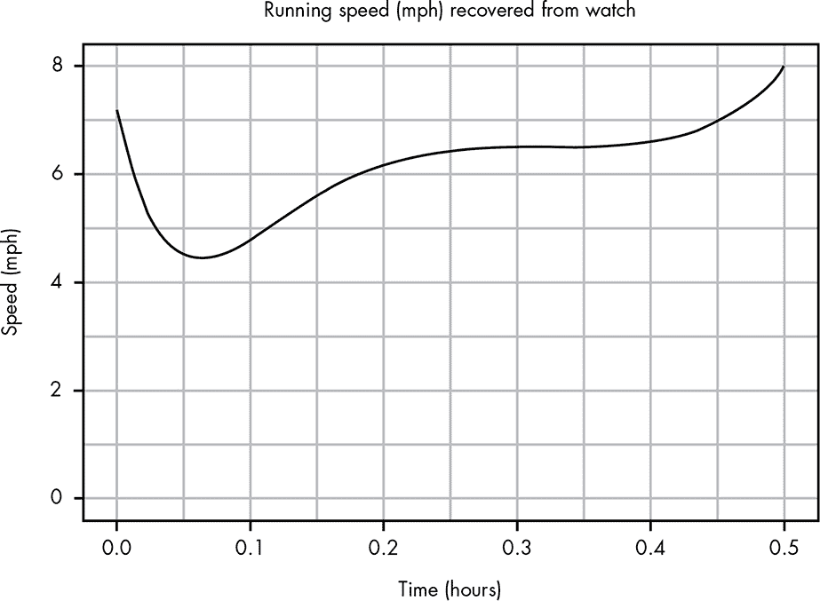

*图 B-1：你跑步时在某一时刻的速度*

然而，仍然有许多有趣的问题你可能想回答，比如：

+   你跑了多远？

+   你什么时候减速最多？

+   你什么时候加速最快？

+   在什么时间段内你的速度比较稳定？

我们可以通过这个图表对最后一个问题做出相当准确的估计，但其他问题似乎无法仅凭现有数据回答。然而，事实证明，我们可以利用微积分的力量回答*所有*这些问题！让我们看看怎么做。

#### *确定你跑了多远*

目前我们的图表只显示你在某一时刻的跑步速度，那么我们如何得知你跑了多远呢？

理论上这听起来不太难。例如，假设你整个过程中的速度都保持在 5 英里每小时，那么你在 0.5 小时内跑了 5 英里每小时的速度，因此你跑的总距离是 2.5 英里。这直观上是有道理的，因为你每小时跑 5 英里，但你只跑了半小时，所以你跑的距离是你一个小时跑的距离的一半。

但我们的问题涉及到你跑步时几乎每一刻的速度都是不同的。让我们换个角度看这个问题。图 B-2 展示了恒定跑步速度下的数据图。

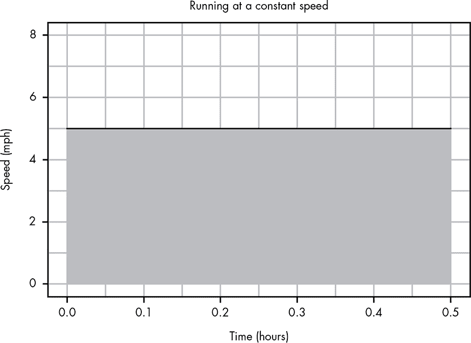

*图 B-2：将距离可视化为速度/时间图的面积*

你可以看到，这些数据生成了一条直线。如果我们考虑这条线下的空间，我们可以看到它是一个大块，实际上代表了你跑的距离！这个块高 5，长 0.5，所以这个块的面积是 5 × 0.5 = 2.5，这就给出了 2.5 英里的结果！

现在，让我们看一个简化的问题，假设你的速度在不同的时间段内变化：你在 0.0 到 0.3 小时之间以 4.5 英里的速度跑步，在 0.3 到 0.4 小时之间以 6 英里的速度跑步，剩下的 0.1 小时以 3 英里的速度跑步。如果我们像在图 B-3 中一样将这些结果可视化为块或*塔形*区域，我们就可以用同样的方法解决这个问题。

第一座塔是 4.5 × 0.3，第二座是 6 × 0.1，第三座是 3 × 0.1，所以：

4.5 × 0.3 + 6 × 0.1 + 3 × 0.1 = 2.25

通过查看这些塔形区域下的面积，我们得到了你跑的总距离：2.25 英里。

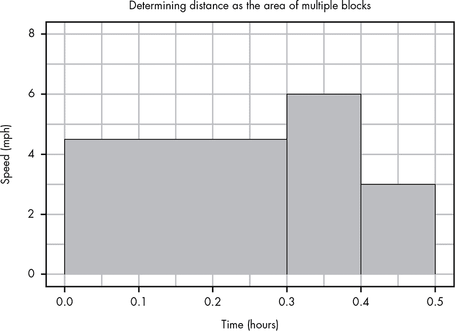

*图 B-3：我们可以通过将这些塔形区域加在一起，轻松计算出你跑的总距离。*

#### *计算曲线下的面积：积分*

你现在已经看到，我们可以通过计算线下的面积来得出你跑了多远。不幸的是，我们原始数据的线是弯曲的，这让问题变得有点困难：我们怎么计算弯曲线下的塔形区域呢？

我们可以通过想象一些与我们曲线模式相近的大塔来开始这个过程。如果我们从三座塔开始，就像在图 B-4 中看到的那样，这并不是一个坏的估计。

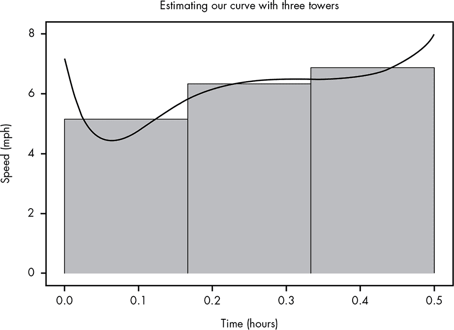

*图 B-4：用三座塔近似曲线*

通过计算这些塔的面积，我们得到一个估算的总旅行距离为 3.055 英里。但显然，通过使用更多、更小的塔，我们可以得到更好的估算，如图 B-5 所示。

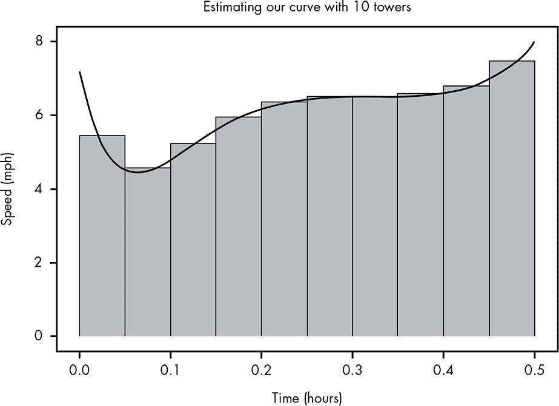

*图 B-5：通过使用 10 个塔代替 3 个塔更好地逼近曲线*

将这些塔的面积加起来，我们得到 3.054 英里，这是一个更精确的估算。

如果我们想象永远重复这个过程，使用更多、更薄的塔，最终我们将得到曲线下的完整面积，如图 B-6 所示。

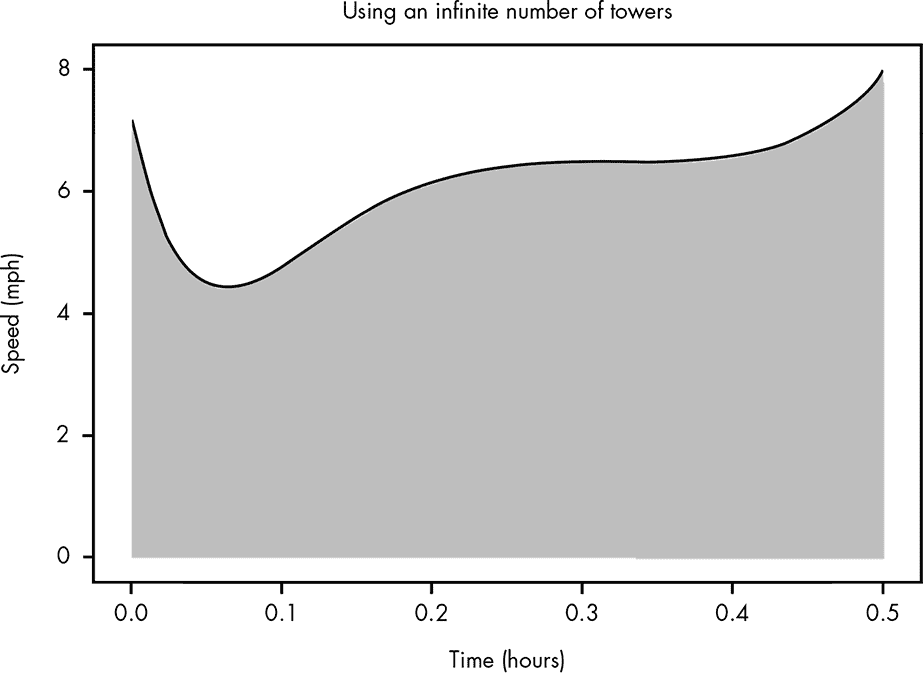

*图 B-6：完全捕获曲线下的面积*

这表示你半小时跑步的准确行进面积。如果我们能够加上无数个塔，我们将得到 3.053 英里的总距离。我们的估算已经非常接近，而随着我们使用更多、更小的塔，估算会变得更加精确。微积分的力量在于它能够计算出曲线下的*精确*面积，或称为*积分*。在微积分中，我们将*距离*函数 s(*t*)从 0 到 0.5 的积分表示为数学符号如下：

这个∫只是一个花哨的 S，表示所有小塔在*s*(*t*)中的面积的总和。*dt*符号提醒我们这里讨论的是变量*t*的微小部分；*d*是数学中用来表示这些小塔的方式。当然，在这个符号中，只有一个变量*t*，所以我们不容易混淆。同样，在这本书中，我们通常省略*dt*（或其等效的变量符号），因为在例子中已经很明显了。

在我们最后的符号中，我们设定了积分的开始和结束，这意味着我们不仅可以计算整个跑步过程的距离，也可以计算其中的一段距离。假设我们想知道你在 0.1 到 0.2 小时之间跑了多远。我们可以表示为：

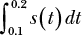

我们可以像图 B-7 所示那样可视化这个积分。

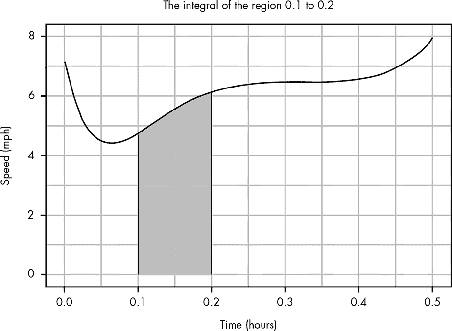

*图 B-7：可视化从 0.1 到 0.2 区间下的曲线面积*

仅这个阴影区域的面积为 0.556 英里。

我们甚至可以将我们的函数的积分视为另一个函数。假设我们定义了一个新函数，dist(*T*)，其中*T*表示我们的“总跑步时间”：

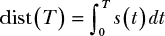

这给我们提供了一个函数，告诉我们在时间*T*时你已经旅行的*距离*。我们还可以看到为什么我们想要使用*dt*，因为我们可以看到我们的积分应用于小写的*t*参数，而不是大写的*T*参数。图 B-8 绘制了你在跑步过程中任意时刻*T*的总距离。

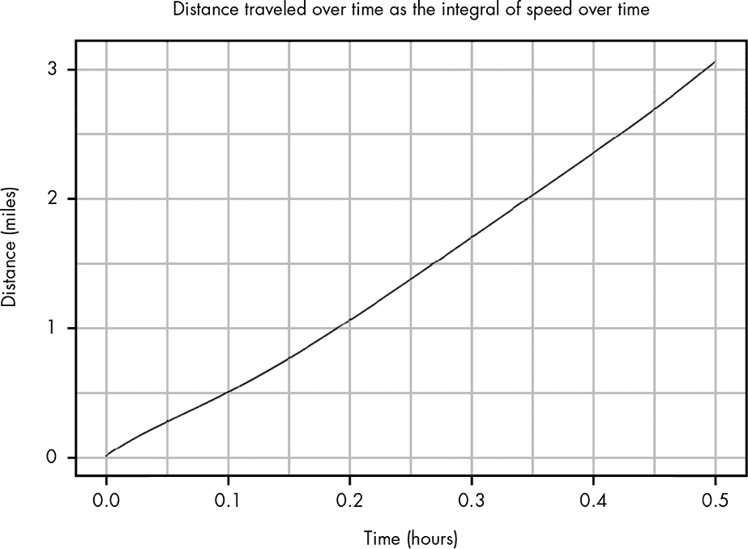

*图 B-8：积分图将时间与速度的图转化为时间与距离的图。*

通过这种方式，积分将我们的函数 *s*（“某时的速度”）转换为一个函数 *dist*（“某时的行驶距离”）。如前所示，我们函数在两个点之间的积分代表了两个不同时间之间行驶的距离。现在，我们正在查看从起始时间 0 到任意给定时间 *t* 的总行驶距离。

积分很重要，因为它使我们能够计算曲线下的面积，而这比计算直线下的面积要复杂得多。在本书中，我们将使用积分的概念来确定事件在两个数值范围之间的概率。

#### *测量变化率：导数*

你已经看到我们如何利用积分来计算行驶的距离，当我们只有记录的各个时间点的速度数据时。但在我们的速度变化测量下，我们也许会感兴趣于计算各个时间点的*变化率*。当我们谈论速度变化的速率时，我们指的是*加速度*。在我们的图表中，有几个关于变化率的有趣点：你减速最快的时候、加速最快的时候，以及速度最稳定的时候（即变化率接近 0）。

就像积分一样，计算加速度的主要挑战是它似乎总在变化。如果我们有一个恒定的变化率，那么计算加速度并不困难，如图 B-9 所示。

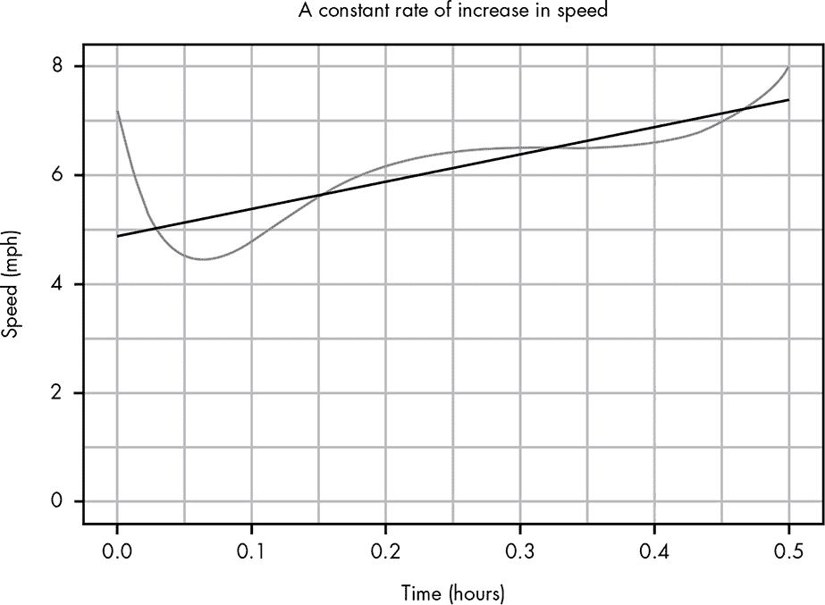

*图 B-9：可视化恒定变化率（与实际变化率的比较）*

你可能还记得基础代数中我们可以使用这个公式画任何一条直线：

*y* = *mx* + *b*

其中 *b* 是直线与 y 轴交点的点，*m* 是直线的斜率。*斜率* 表示直线的变化率。对于图 B-9 中的直线，完整的公式是：

*y* = 5*x* + 4.8

斜率为 5 意味着每当 *x* 增加 1 时，*y* 增加 5；4.8 是该直线与 x 轴的交点。在这个例子中，我们可以将这个公式理解为 *s*(*t*) = 5*t* + 4.8，意思是每行进一英里，你的速度加速 5 英里/小时，并且你从 4.8 英里/小时的速度开始。由于你已经跑了半英里，利用这个简单的公式，我们可以计算出：

*s*(*t*) = 5 × 0.5 + 4.8 = 7.3

这意味着在你跑步结束时，你的速度将是 7.3 英里/小时。我们也可以通过类似的方法，计算你在跑步中的任何时刻的确切速度，只要加速度是恒定的！

对于我们的实际数据，因为曲线是弯曲的，所以很难在单一时刻确定斜率。相反，我们可以计算出直线的各个部分的斜率。如果我们将数据分成三个子区段，就可以在每个部分之间画出直线，如图 B-10 所示。

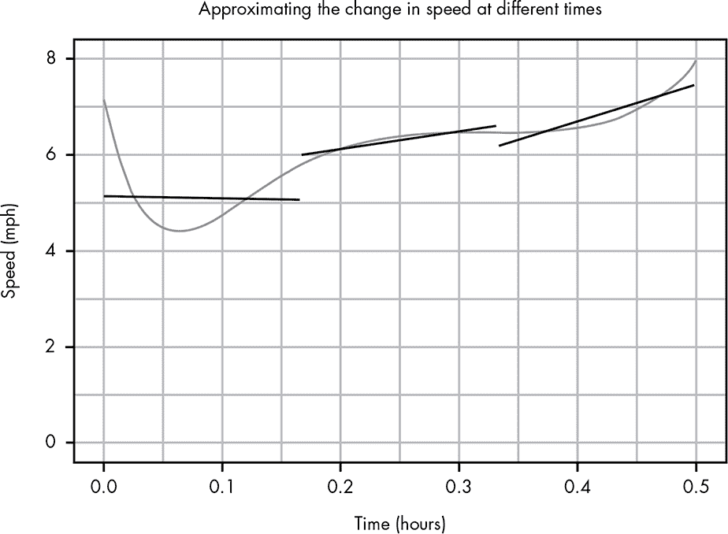

*图 B-10：使用多个斜率来更好地估算你的变化率*

现在，显然这些直线并不能完全匹配我们的曲线，但它们可以帮助我们看到你加速最快、减速最慢以及相对稳定的部分。

如果我们将函数进一步分成更多的部分，我们可以得到更精确的估算，如图 B-11 所示。

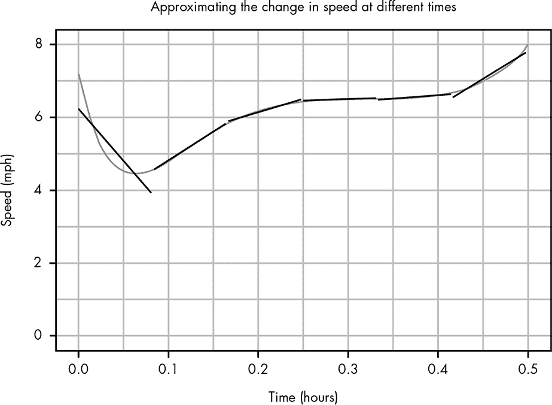

*图 B-11：增加更多的斜率可以更好地逼近你的曲线。*

在这里，我们看到的模式类似于我们求积分时的做法，那个时候我们将曲线下方的面积分成越来越小的塔楼，直到我们把无数小塔楼加在一起。现在我们要做的是把直线分成无数小线段。最终，代替单一的 *m* 来表示斜率的是一个新函数，表示我们原始函数中每一点的变化率。这就是所谓的*导数*，其数学表示形式如下：

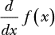

同样，*dx*只是提醒我们，我们正在观察非常小的自变量 *x* 的部分。图 B-12 展示了我们 *s*(*t*) 函数的导数图，它让我们能够看到你在跑步时每一刻的速度变化率。换句话说，这就是你跑步过程中加速度的图像。看着 y 轴，你可以看到在一开始你迅速减速，而在大约 0.3 小时时你经历了一个加速度为 0 的阶段，这意味着你的配速没有变化（通常在练习比赛时这是好事！）。我们还可以清楚地看到你在哪一时刻获得了最快的速度。通过原始的图像，我们很难看出你是在 0.1 小时左右（第一次加速后）还是在跑步结束时获得了更快的速度。然而，通过导数，我们可以清楚地看到，在结束时的最后一波加速确实比开始时要快。

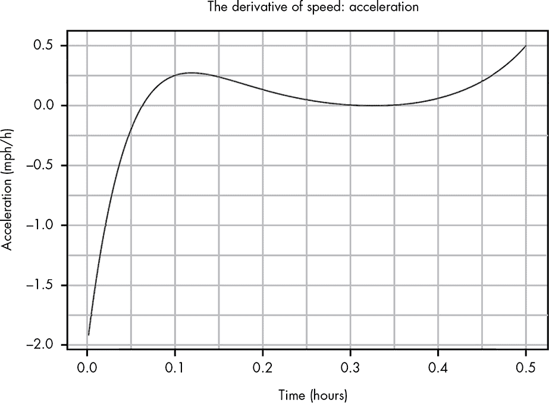

*图 B-12：导数是另一个函数，描述了*s(x)*在每个点的斜率。*

导数就像是直线的斜率，只不过它告诉我们曲线在某一点的倾斜程度。

### 微积分基本定理

我们将讨论一个最后非常引人注目的微积分概念。积分和导数之间有一个非常有趣的关系。（证明这个关系超出了本书的范围，因此我们这里只关注关系本身。）假设我们有一个函数 *F*(*x*)，其中 *F* 是大写的 *F*。这个函数特别之处在于它的导数是 *f*(*x*)。例如，我们的 `dist` 函数的导数就是我们的 *s* 函数；也就是说，任意时刻的位移变化就是你的速度。速度的导数是加速度。我们可以用数学公式描述为：

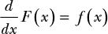

在微积分中，我们称*F*为*f*的*反导数*，因为*f*是*F*的导数。根据我们的例子，加速度的反导数是速度，而速度的反导数是距离。现在假设对于任何值的*f*，我们想要在 10 和 50 之间进行积分；也就是说，我们想要：

我们可以通过从*F*(50)中减去*F*(10)来简单地得到这个结果，因此：

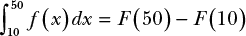

积分与导数之间的关系被称为*微积分基本定理*。这是一个非常令人惊讶的工具，因为它让我们能够以数学方式求解积分，而这通常比求导数要困难得多。通过基本定理，如果我们能找到我们想要求积分的函数的反导数，我们就能轻松地进行积分。理解这一点是手动进行积分的核心。

一门完整的微积分课程（或两门）通常会更深入地探讨积分和导数的相关话题。然而，正如前面提到的，在本书中我们只会偶尔使用微积分，并且所有的计算都将使用 R 语言。尽管如此，了解微积分和那些不熟悉的∫符号的大致含义还是很有帮助的！
