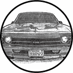

## 引言

2014 年，Open Garages——一个致力于共享和合作研究汽车安全的团体——发布了第一版*《汽车黑客手册》*，作为汽车黑客课程的教材。原书设计得适合放入车载手套箱，并覆盖了为期一到两天的汽车安全课程的基础内容。我们当时没想到那本书会引起如此大的兴趣：在第一周内就有超过 30 万次下载。事实上，这本书的受欢迎程度一度导致我们的互联网服务提供商（ISP）宕机两次！这让他们有点不高兴。（没关系，他们原谅了我们，这很好，因为我喜欢我的小型 ISP。嗨，SpeedSpan.net！）

读者的反馈大多数是非常积极的；大部分批评意见集中在手册过于简短，缺乏足够的细节。此书旨在解决这些问题。*《汽车黑客手册》*深入讲解了汽车黑客技术，甚至涵盖了一些与安全直接无关的内容，如性能调优和一些有助于理解和操作车辆的工具。

### **为什么汽车黑客对我们所有人都有好处**

如果你正在阅读这本书，你可能已经知道为什么你会想要黑客汽车。但为了以防万一，这里有一份详细列出汽车黑客的好处的实用清单：

**理解你的车辆如何工作**

汽车行业已经推出了一些令人惊叹的车辆，配备了复杂的电子设备和计算机系统，但它们却很少发布关于这些系统如何工作的相关信息。一旦你了解了车辆网络是如何工作的，以及它是如何在自己内部和外部进行通信的，你就能更好地诊断和排除故障。

**修理你的车辆电气系统**

随着车辆的进化，它们变得更加电子化，机械化程度降低。不幸的是，汽车电子系统通常对除经销商机械师以外的其他人封闭。虽然经销商可以获取比个人通常能获得的更多信息，但汽车制造商自己也外包零件并要求使用专有工具来诊断问题。了解你的车辆电子系统如何工作，可以帮助你绕过这一障碍。

**改装你的车辆**

理解车辆如何进行通信，可以带来更好的改装效果，比如提高燃油效率和使用第三方替换零件。一旦你理解了通信系统，你就可以无缝地将其他系统集成到你的车辆中，比如显示性能的额外屏幕，或者与原厂设备一样完美集成的第三方组件。

**发现未记录的功能**

有时候，车辆可能配备了未记录的功能或仅仅是被禁用的功能。发现未记录的或被禁用的功能并加以利用，可以让你充分发挥车辆的潜力。例如，车辆可能有一个未记录的“代客泊车模式”，让你在将车钥匙交给代客泊车人员之前，将车辆置于受限模式。

**验证你车辆的安全性**

截至目前，车辆安全指南尚未涉及恶意电子威胁。尽管车辆和桌面电脑一样容易受到恶意软件的攻击，但汽车制造商并不要求对车辆的电子设备进行安全审计。这种情况完全不可接受：我们把家人和朋友载在这些车里，每个人都需要知道我们的车辆是尽可能安全的。如果你学会了如何入侵你的汽车，你就能知道车辆的脆弱点，从而采取预防措施，并成为更好的高安全标准的倡导者。

**帮助汽车行业**

汽车行业同样可以从本书中获得知识。本书提供了识别威胁的指导方针，以及绕过现有保护措施的现代技术。除了帮助你设计安全实践外，本书还为研究人员提供了如何沟通他们的发现的指导。

当今的汽车比以往任何时候都更加电子化。在《IEEE Spectrum》上的一篇报告《这辆车依赖于代码》中，作者罗伯特·N·查雷特指出，截至 2009 年，汽车通常配备超过 100 个微处理器、50 个电子控制单元、5 英里的线路和 1 亿行代码（*[`spectrum.ieee.org/transportation/systems/this-car-runs-on-code`](http://spectrum.ieee.org/transportation/systems/this-car-runs-on-code)*）。丰田的工程师开玩笑说，他们在车辆上安装轮子唯一的原因是为了防止计算机刮到地面。随着计算机系统在车辆中的角色变得更加重要，进行安全审查也变得更加重要和复杂。

**警告**

*汽车黑客攻击不容掉以轻心。操作你车辆的网络、无线连接、车载计算机或其他电子设备可能会损坏或使其失效。在实验本书中的任何技术时，请非常小心，并始终将安全性作为首要考虑因素。正如你可能想象的那样，本书的作者和出版商对于你的车辆可能造成的任何损坏概不负责。*

### **本书内容**

*《汽车黑客手册》*带你了解黑客入侵汽车所需的知识。我们首先概述了与汽车安全相关的政策，然后深入探讨如何检查你的车辆是否安全，以及如何在更复杂的硬件系统中发现漏洞。

以下是每章内容的概览：

• **第一章：理解威胁模型** 教你如何评估一辆车。你将学会如何识别高风险组件所在的领域。如果你在汽车行业工作，这将成为构建你自己威胁模型系统的有用指南。

• **第二章：总线协议** 详细介绍了在审计车辆时可能遇到的各种总线网络，并探讨了每种总线使用的布线、电压和协议。

• **第三章：使用 SocketCAN 进行车辆通信** 演示了如何在 Linux 上使用 SocketCAN 接口整合多个 CAN 硬件工具，以便无论你的设备如何，你都能编写或使用一个工具。

• **第四章：诊断与日志记录** 讲解了如何读取发动机代码、统一诊断服务以及 ISO-TP 协议。你将学习不同模块服务的工作原理，它们的常见弱点，以及关于你的信息是如何记录的以及存储位置。

• **第五章：反向工程 CAN 总线** 详细说明了如何分析 CAN 网络，包括如何设置虚拟测试环境，以及如何使用与 CAN 安全相关的工具和模糊测试器。

• **第六章：ECU 黑客技术** 重点介绍了运行在 ECU 上的固件。你将发现如何访问固件，如何修改它，以及如何分析固件的二进制数据。

• **第七章：搭建与使用 ECU 测试平台** 讲解了如何从车辆中拆卸部件，搭建一个安全的测试环境。还讨论了如何读取接线图，并模拟发动机到 ECU 的组件，如温度传感器和曲轴。

• **第八章：攻击 ECU 与其他嵌入式系统** 介绍了集成电路调试引脚和方法论。我们还探讨了侧信道分析攻击，如差分功率分析和时钟故障注入，并提供了逐步的示例。

• **第九章：车载信息娱乐系统** 详细介绍了信息娱乐系统的工作原理。由于车载信息娱乐系统可能具有最大的攻击面，我们将重点讨论不同的方式来访问其固件并在系统上执行操作。本章还讨论了一些可用于测试的开源车载信息娱乐系统。

• **第十章：车与车通信** 解释了拟议的车与车网络的工作原理。本章涵盖了加密技术以及多个国家提出的不同协议方案。我们还将讨论车与车系统的一些潜在弱点。

• **第十一章: 武器化 CAN 发现** 详细介绍了如何将你的研究转化为可行的漏洞攻击。你将学会如何将概念验证代码转换为汇编代码，最终转化为 shellcode，并且你会探索如何仅针对目标车辆进行攻击，包括如何在不被发现的情况下探测车辆。

• **第十二章: 使用 SDR 攻击无线系统** 介绍了如何使用软件定义无线电分析无线通信，如 TPMS、钥匙扣和防盗系统。我们回顾了在处理防盗器时可能遇到的加密方案，以及已知的漏洞。

• **第十三章: 性能调优** 讨论了增强和修改车辆性能的技术。我们将介绍芯片调校以及常用的调整工具和技术，以便让引擎按你想要的方式运作。

• **附录 A: 行业工具** 提供了在建立汽车安全实验室时会用到的软件和硬件工具清单。

• **附录 B: 诊断代码模式与 PID** 列出了常见的模式和实用的 PIDS。

• **附录 C: 创建你自己的开放车库** 讲解了如何加入汽车黑客社区，并启动自己的开放车库。

到书籍结尾时，你应该对车辆计算机系统的工作原理、最脆弱的地方以及这些漏洞可能被利用的方式有更深入的了解。
