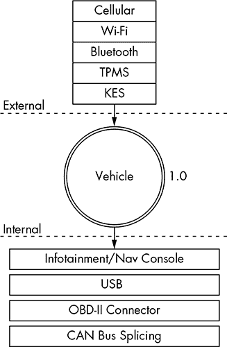
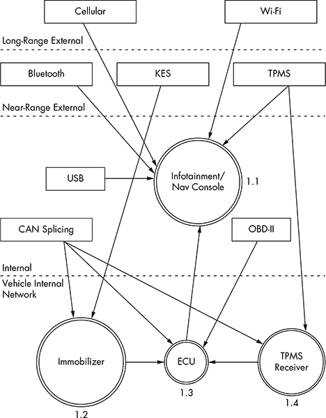
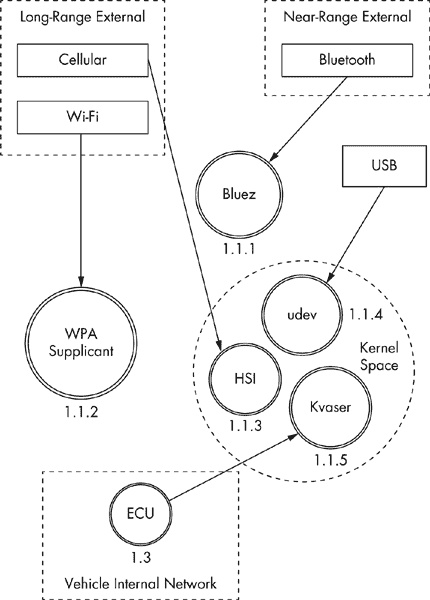

## 第一章：**理解威胁模型**

如果你来自软件渗透测试领域，你可能已经熟悉攻击面。对于我们其他人来说，*攻击面*指的是所有可能攻击目标的方式，从单个组件的漏洞到影响整个车辆的漏洞。

在讨论攻击面时，我们并不是考虑如何利用目标，而只是关心进入目标的入口点。你可以将攻击面想象成物体的表面积与体积的关系。两个物体可能有相同的体积，但表面积却大不相同。表面积越大，暴露于风险的可能性就越高。如果你把物体的体积看作它的价值，那么我们在强化安全时的目标就是创造一个低风险与价值比率。

### 寻找攻击面

在评估车辆的攻击面时，想象自己是一个恶意间谍，试图对车辆进行破坏。为了找到车辆安全性上的弱点，评估车辆的周边环境，并记录车辆的外部环境。确保考虑所有数据可能进入车辆的方式，这些方式都是车辆与外部世界进行通信的途径。

在检查车辆外部时，问自己以下问题：

• 接收了哪些信号？无线电波？钥匙扣？距离传感器？

• 是否有物理键盘访问？

• 是否有触摸或运动传感器？

• 如果车辆是电动的，它是如何充电的？

在检查内部时，考虑以下事项：

• 音频输入选项有哪些：CD？USB？蓝牙？

• 是否有诊断端口？

• 仪表盘有哪些功能？是否有 GPS？蓝牙？互联网？

如你所见，数据进入车辆的方式有很多。如果这些数据被破坏或故意恶意操作，会发生什么？这就是威胁建模的作用所在。

### 威胁建模

关于威胁建模已经写了整本书，但我将给你一个快速的概览，以便你能够构建自己的威胁模型。（如果你有更多问题，或者这一部分让你感兴趣，请毫不犹豫地再读一本关于这个主题的书！）

在对汽车进行威胁建模时，你需要收集目标架构的信息，并创建图表来说明汽车各部分如何进行通信。然后，利用这些图来识别高风险输入，并保持审计清单；这将帮助你优先考虑可能带来最大回报的入口点。

威胁模型通常是在产品开发和设计过程中创建的。如果生产特定产品的公司有良好的开发生命周期，它会在产品开发开始时创建威胁模型，并在产品通过开发生命周期时不断更新该模型。威胁模型是活文档，随着目标的变化以及你对目标了解的深入而变化，因此你应该经常更新你的威胁模型。

你的威胁模型可以包含不同的层次；如果模型中的某个过程很复杂，你应该考虑通过添加更多层次来进一步拆解图表。然而，在开始时，Level 2 是你能够达到的最远层次。我们将在接下来的章节中讨论不同的层次，从威胁 Level 0 开始。

#### *Level 0：鸟瞰图*

在这一层，我们使用了在考虑攻击面时建立的清单。想一想数据如何进入车辆。将车辆画在中心，然后标记外部和内部空间。图 1-1 展示了一个可能的 Level 0 图示。

矩形框表示输入，中心的圆圈代表整个车辆。在它们到达车辆之前，输入会穿过两条虚线，表示外部和内部威胁。

车辆圆圈并不代表一个输入，而是一个复杂的过程——即一系列可以进一步拆解的任务。流程有编号，正如你所看到的，这个是 1.0。如果你的威胁模型中有多个复杂的部分，你将按顺序为它们编号。例如，第二个流程为 2.0，第三个为 3.0，以此类推。当你了解车辆的功能时，你会更新图表。如果你现在还不认识图表中的所有缩写词，也没关系；你很快就会认识了。

*图 1-1：Level 0 输入*

#### *Level 1：接收器*

要继续查看 Level 1 图表，选择一个流程进行探索。由于我们的图表中只有一个流程，让我们深入研究车辆流程，并专注于每个输入所连接的内容。

图 1-2 中显示的 Level 1 地图几乎与 Level 0 的相同。唯一的区别是这里我们指定了接收 Level 0 输入的车辆连接。我们暂时不会深入查看接收器；我们只关注输入所连接的基本设备或区域。

*图 1-2：Level 1 输入与车辆连接图*

注意在图 1-2 中，我们为每个接收器编号。第一位数字表示来自图 1-1 中的 Level 0 图的流程标签，第二位数字是接收器的编号。由于娱乐信息单元既是一个复杂的过程又是一个输入，我们为其提供了一个流程圆圈。现在我们有了其他三个流程：防盗器、ECU 和 TPMS 接收器。

Level 1 图中的虚线表示信任边界之间的划分。图表顶部的输入是最不可信的，而底部的输入是最可信的。通信通道穿越的信任边界越多，该通道的风险就越大。

#### *Level 2：接收器拆解*

在二级层级中，我们检查车辆内部发生的通信。我们的示例图（图 1-3）集中在一个基于 Linux 的信息娱乐控制台，接收器 1.1\。这是其中一个较为复杂的接收器，通常直接连接到车辆的内部网络。

在图 1-3 中，我们将通信通道分组为带虚线的框，代表信任边界。现在，信息娱乐控制台内部有一个新的信任边界，称为内核空间。与内核直接通信的系统风险较高，因为它们可能绕过信息娱乐单元的任何访问控制机制。因此，蜂窝通道的风险高于 Wi-Fi 通道，因为它跨越了一个进入内核空间的信任边界；而 Wi-Fi 通道则与用户空间中的 WPA supplicant 进程进行通信。

*图 1-3：信息娱乐控制台的二级地图*

该系统是一个基于 Linux 的车载信息娱乐（IVI）系统，使用了与 Linux 环境通用的部件。在内核空间中，你会看到对内核模块 udev、HSI 和 Kvaser 的引用，它们接收来自我们威胁模型的输入。udev 模块加载 USB 设备，HSI 是处理蜂窝通信的串行驱动程序，而 Kvaser 是车辆的网络驱动程序。

二级的编号模式现在是 *X*.*X*.*X*，识别系统与之前相同。在零级时，我们选择了车辆进程 1.0 并进行了更深入的分析。然后，我们将一级内的所有进程标记为 1.1、1.2 等等。接着，我们选择了标记为 1.1 的信息娱乐进程，并进一步拆解，生成二级图。因此，在二级中，我们将所有复杂的进程标记为 1.1.1、1.1.2 等等。（你可以继续使用相同的编号方案，进一步深入到各个进程中。该编号方案用于文档化目的，能够让你在适当的层级中引用准确的进程。）

**注意**

*理想情况下，在这个阶段，你应该映射出哪些进程处理哪些输入，但我们现在只能进行猜测。在现实世界中，你需要反向工程信息娱乐系统才能找到这些信息。*

在构建或设计汽车系统时，你应该尽可能深入挖掘尽可能多的复杂过程。将开发团队引入，并开始讨论每个应用程序使用的方法和库，以便将它们纳入各自的威胁图中。你很可能会发现，应用层的信任边界通常位于应用程序与内核、应用程序与库、应用程序与其他应用程序，甚至是各个功能之间。在探索这些连接时，标记出具有更高权限或处理更敏感信息的方法。

### 威胁识别

现在我们已经深入分析了两层威胁建模图，我们可以开始识别潜在的威胁。威胁识别通常和一群人以及白板一起做会更有趣，但你也可以单独做作为思考练习。

让我们一起做这个练习。从级别 0——鸟瞰视角开始，考虑输入、接收器和威胁边界的潜在高层问题。现在，让我们列出所有潜在的威胁，并用我们的威胁模型进行分析。

#### *级别 0：鸟瞰视角*

在确定级别 0 的潜在威胁时，尽量保持高层次。一些威胁可能看起来不现实，因为你知道额外的障碍或保护措施，但重要的是在这个列表中包含所有可能的威胁，即使一些已经被解决了。这里的重点是头脑风暴每个过程和输入的所有风险。

级别 0 的高层威胁是，攻击者可能会：

• 远程接管车辆

• 关闭车辆

• 窃听车内乘客

• 解锁车辆

• 偷盗车辆

• 跟踪车辆

• 妨碍安全系统

• 在车辆上安装恶意软件

起初，可能很难想到很多攻击场景。在这个阶段，让非工程师参与通常是有益的，因为作为开发者或工程师，你可能会过于专注于内部工作，以至于自然而然地不经意地否定一些想法。

发挥创造力，尽量想出你能想到的最像詹姆斯·邦德反派的攻击方式。也许想想其他攻击场景，看看它们是否也适用于车辆。例如，考虑勒索软件，这是一种恶意软件，能够加密或锁定你的电脑或手机，直到你支付给远程控制该软件的人。这个方法能用于车辆吗？答案是肯定的。把*勒索软件*写下来。

#### *级别 1：接收器*

级别 1 的威胁识别更侧重于每个部分的连接，而不是可能直接连接到输入的连接。我们在这一层所假设的漏洞，涉及影响与车辆设备连接的那些部分。

我们将这些威胁分解为与蜂窝网络、Wi-Fi、钥匙扣（KES）、轮胎压力监测传感器（TPMS）、信息娱乐控制台、USB、蓝牙和控制器局域网（CAN）总线连接相关的威胁分组。如你在以下列表中所见，进入车辆的潜在方式有很多。

##### 蜂窝网络

攻击者可能会利用车辆中的蜂窝网络连接来：

• 从任何地方访问车辆的内部网络

• 利用信息娱乐单元中处理来电的应用程序

• 通过信息娱乐单元访问用户身份模块（SIM）

• 利用蜂窝网络连接到远程诊断系统（如 OnStar）

• 窃听蜂窝通信

• 干扰求救呼叫

• 跟踪车辆的运动

• 设置一个伪造的全球移动通信系统（GSM）基站

##### Wi-Fi

攻击者可以利用 Wi-Fi 连接来：

• 从 300 码（约 274 米）或更远的距离访问车辆网络

• 找到处理传入连接的软件漏洞

• 在娱乐信息单元上安装恶意代码

• 破解 Wi-Fi 密码

• 设置假冒经销商接入点，欺骗车辆以为正在接受服务

• 截取通过 Wi-Fi 网络传输的通信

• 跟踪车辆

##### 钥匙扣

攻击者可以利用钥匙扣连接来：

• 发送格式错误的钥匙扣请求，将车辆的防盗系统置于未知状态。（防盗系统应确保车辆处于锁定状态，防止被改装。我们需要确保其保持正常功能。）

• 主动探测防盗系统以耗尽车载电池

• 锁定钥匙

• 捕获在握手过程中从防盗系统泄露的加密信息

• 暴力破解钥匙扣算法

• 克隆钥匙扣

• 干扰钥匙扣信号

• 耗尽钥匙扣的电池电量

##### 轮胎压力监测传感器

攻击者可以利用 TPMS 连接来：

• 向发动机控制单元（ECU）发送不可能的条件，导致故障，从而可能被利用

• 欺骗 ECU 过度修正假冒的路况

• 使 TPMS 接收器或 ECU 进入无法恢复的状态，可能导致驾驶员停车检查报告的故障轮胎，甚至可能关闭车辆

• 根据 TPMS 唯一 ID 跟踪车辆

• 假冒 TPMS 信号，引发内部警报

##### 娱乐信息控制台

攻击者可以利用娱乐信息控制台连接来：

• 将控制台置于调试模式

• 修改诊断设置

• 找到导致意外结果的输入漏洞

• 向控制台安装恶意软件

• 使用恶意应用程序访问内部 CAN 总线网络

• 使用恶意应用程序窃听车辆乘员的操作

• 使用恶意应用程序假冒显示给用户的数据，如车辆位置

##### USB

攻击者可以利用 USB 端口连接来：

• 在娱乐信息单元上安装恶意软件

• 利用娱乐信息单元 USB 堆栈中的漏洞

• 连接带有特别制作文件的恶意 USB 设备，设计用来破坏娱乐信息单元上的导入器，如通讯录和 MP3 解码器

• 在车辆上安装修改过的更新软件

• 短路 USB 端口，从而损坏娱乐信息系统

##### 蓝牙

攻击者可以利用蓝牙连接来：

• 在娱乐信息单元上执行代码

• 利用娱乐信息单元蓝牙堆栈中的漏洞

• 上传格式错误的信息，例如设计用于执行代码的损坏通讯录

• 从近距离（300 英尺以内）访问车辆

• 干扰蓝牙设备

##### 控制器局域网络

攻击者可以利用 CAN 总线连接来：

• 安装恶意诊断设备向 CAN 总线发送数据包

• 可直接插入 CAN 总线，尝试在没有钥匙的情况下启动车辆

• 可直接插入 CAN 总线以上传恶意软件

• 安装恶意诊断设备以追踪车辆

• 安装恶意诊断设备直接连接到 CAN 总线，启用远程通信，将原本内部的攻击变成外部威胁

#### *级别 2：接收器故障*

在级别 2，我们可以进一步讨论如何识别特定的威胁。通过查看具体的应用程序处理了哪些连接，我们可以开始根据可能的威胁执行验证。

我们将把威胁分为五个组：Bluez（蓝牙守护进程）、wpa_supplicant（Wi-Fi 守护进程）、HSI（高速同步接口蜂窝内核模块）、udev（内核设备管理器）和 Kvaser 驱动程序（CAN 收发器驱动程序）。在以下列表中，我已指定了每个程序的威胁。

##### Bluez

旧版或未打补丁的 Bluez 守护进程：

• 可能存在可利用的漏洞

• 可能无法处理损坏的地址簿

• 可能没有配置以确保适当的加密

• 可能未配置以处理安全握手

• 可能使用默认密码

##### wpa_supplicant

• 旧版本可能存在可利用的漏洞

• 可能没有强制执行适当的 WPA2 样式无线加密

• 可能连接到恶意接入点

• 可能通过 BSSID（网络接口）泄露驱动程序信息

##### HSI

• 旧版本可能存在可利用的漏洞

• 可能容易受到可注入的串行通信（中间人攻击，其中攻击者将串行命令插入数据流）攻击

##### udev

• 旧版、未打补丁的版本可能容易受到攻击

• 可能没有维护的设备白名单，允许攻击者加载未测试或不打算使用的附加驱动程序或 USB 设备

• 可能允许攻击者加载外部设备，例如键盘，以访问娱乐信息系统

##### Kvaser 驱动程序

• 旧版、未打补丁的版本可能存在可利用的漏洞

• 可能允许攻击者向 Kvaser 设备上传恶意固件

这些潜在漏洞列表绝不是详尽无遗的，但它们应该能让你了解这一头脑风暴过程是如何进行的。如果你要查看车辆潜在威胁的三级地图，你将选择其中一个过程，如 HSI，并开始查看其内核源代码，以识别可能容易受到攻击的敏感方法和依赖项。

### 威胁评级系统

在记录了许多威胁之后，我们现在可以根据风险等级对它们进行评分。常见的评分系统包括 DREAD、ASIL 和 MIL-STD-882E。DREAD 常用于网页测试，而汽车行业和政府则分别使用 ISO 26262 ASIL 和 MIL-STD-882E 进行威胁评分。不幸的是，ISO 26262 ASIL 和 MIL-STD-882E 聚焦于安全故障，并不足以应对恶意威胁。关于这些标准的更多细节可以参考 *[`opengarages.org/index.php/Policies_and_Guidelines`](http://opengarages.org/index.php/Policies_and_Guidelines)*。

#### *DREAD 评分系统*

DREAD 代表以下内容：

**损害潜力** 损害的程度有多大？

**可重复性** 复现的难易程度如何？

**可利用性** 攻击的难易程度如何？

**受影响用户** 有多少用户受到影响？

**可发现性** 漏洞容易被发现吗？

表 1-1 列出了每个评级类别的风险等级（从 1 到 3）。

**表 1-1：** DREAD 评分系统

|  | **评级类别** | **高 (3)** | **中 (2)** | **低 (1)** |
| --- | --- | --- | --- | --- |
| **D** | 损害潜力 | 可能颠覆安全系统并获得完全信任，最终接管环境 | 可能泄露敏感信息 | 可能泄露无关紧要的信息 |
| **R** | 可重复性 | 总是可以复现 | 仅在特定条件或时间窗口下可复现 | 即使提供有关漏洞的具体信息，也很难复现 |
| **E** | 可利用性 | 允许新手攻击者执行该漏洞利用 | 允许熟练的攻击者创建一个可以反复使用的攻击 | 仅允许具备深入知识的熟练攻击者执行攻击 |
| **A** | 受影响用户 | 影响所有用户，包括默认设置用户和关键客户 | 影响部分用户或特定设置 | 仅影响极少数用户；通常影响一个不常用的功能 |
| **D** | 可发现性 | 可以在公开的攻击说明中轻松找到 | 影响一个很少使用的部分，意味着攻击者需要非常有创意才能发现其恶意用途 | 很难被发现，意味着攻击者不太可能找到利用它的方式 |

现在我们可以将前面章节中识别的威胁与 表 1-1 中的每个 DREAD 类别进行匹配，并根据威胁的高低进行评分（1-3）。例如，如果我们查看在 “Level 2: Receiver Breakdown” 中讨论的 Level 2 HSI 威胁，位于 第 10 页，我们可以得出如 表 1-2 所示的威胁评分。

**表 1-2：** HSI Level 2 威胁与 DREAD 评分

| **HSI 威胁** | **D** | **R** | **E** | **A** | **D** | **总计** |
| --- | --- | --- | --- | --- | --- | --- |
| 一个可能被利用的老旧未打补丁的 HSI 版本 | 3 | 3 | 2 | 3 | 3 | 14 |
| 可能容易受到注入串行通信攻击的 HSI | 2 | 2 | 2 | 3 | 3 | 12 |

你可以通过使用总计栏中的数值来识别整体评分，如 表格 1-3 所示。

**表格 1-3：** DREAD 风险评分表

| **总计** | **风险等级** |
| --- | --- |
| 5–7 | 低 |
| 8–11 | 中等 |
| 12–15 | 高 |

在进行风险评估时，最好将评分结果保持可见，以便读者能够更好地理解风险。在 HSI 威胁的情况下，我们可以为每个威胁分配高风险，如 表格 1-4 所示。

**表格 1-4：** 应用 DREAD 风险等级的 HSI 2 级威胁

| **HSI 威胁** | **D** | **R** | **E** | **A** | **D** | **总计** | **风险** |
| --- | --- | --- | --- | --- | --- | --- | --- |
| 可能存在漏洞且未修补的旧版 HSI | 3 | 3 | 2 | 3 | 3 | 14 | 高 |
| 可能容易受到注入串行通信攻击的 HSI | 2 | 2 | 2 | 3 | 3 | 12 | 高 |

尽管这两种风险都标记为高风险，但我们可以看到旧版 HSI 模型的风险略高于可注入串行攻击，因此我们可以优先处理这个风险。我们还可以看到，注入串行通信风险较低的原因是其破坏程度较轻，而且其利用难度比旧版 HSI 更高。

#### *CVSS：DREAD 的替代方案*

如果 DREAD 对你来说不够详细，可以考虑更详细的风险评估方法，称为 *通用漏洞评分系统（CVSS）*。与 DREAD 相比，CVSS 提供了更多的分类和细节，分为三个组：基础、时间和环境。每个组进一步细分为子领域——基础组有六个，时间组有三个，环境组有五个，总共有 14 个评分领域！（有关 CVSS 如何工作的详细信息，请参阅 *[`www.first.org/cvss/cvss-guide`](http://www.first.org/cvss/cvss-guide)*。）

**注意**

*虽然我们可以使用 ISO 26262 ASIL 或 MIL-STD-882E 来评估威胁，但我们需要比“风险 = 概率 × 严重性”更详细的信息。如果你在进行安全审查时必须在这两种系统中选择一个，建议选择美国国防部（DoD）的 MIL-STD-882E。汽车安全完整性等级（ASIL）系统过于频繁地将风险评为 QM 等级，基本上意味着“无关紧要”。而 DoD 系统则更倾向于给出较高的排名，等同于更高的生命价值。此外，MIL-STD-882E 设计用于贯穿系统生命周期的应用，包括处置，且与安全开发生命周期很好契合。*

### 与威胁模型结果的合作

到目前为止，我们已经列出了许多潜在的威胁，并按照风险对它们进行了排序。那么接下来呢？这取决于你所在的团队。如果使用军事术语，攻击方是“红队”，防守方是“蓝队”。如果你在红队，你的下一步是开始攻击那些风险最高且最有可能成功的区域。如果你在蓝队，回到风险图表，针对每个威胁采取相应的对策。

例如，如果我们以“DREAD 评级系统”中第 11 页的两个风险为例，我们可以为每个风险添加一个对策部分。表 1-5 包含了 HSI 代码执行风险的对策，而表 1-6 则包含了 HSI 截取风险的对策。

**表 1-5:** HSI 代码执行风险

| **威胁** | **在内核空间执行代码** |
| --- | --- |
| 风险 | 高 |
| 攻击技术 | 利用 HSI 的旧版本漏洞 |
| 对策 | 应该用最新的内核版本更新内核及内核模块 |

**表 1-6:** 截取 HSI 命令

| **威胁** | **截取并注入来自蜂窝网络的命令** |
| --- | --- |
| 风险 | 高 |
| 攻击技术 | 截取 HSI 上的串行通信 |
| 对策 | 所有通过蜂窝网络发送的命令都经过加密签名 |

现在你已经有了一份包含高风险漏洞和解决方案的文档。你可以根据未实施该解决方案的风险，优先考虑那些尚未实现的解决方案。

### 总结

在本章中，你学习了使用威胁模型来识别和记录你的安全姿态的重要性，并且需要让技术人员和非技术人员一起头脑风暴可能的场景。接着我们深入分析了这些场景，以识别所有潜在的风险。通过打分系统，我们对每个潜在风险进行了排名和分类。通过这种方式评估威胁后，我们最终得到了一个文档，定义了我们当前的产品安全姿态、已实施的任何对策，以及仍需处理的高优先级任务列表。
