## **总线协议**

在本章中，我们将讨论在车辆通信中常见的不同总线协议。你的车辆可能只使用其中一种，或者如果它是在 2000 年之前生产的，它可能根本没有使用这些协议。

总线协议管理着数据包在车辆网络中的传输。多个网络和成百上千的传感器在这些总线上通信，发送控制车辆行为和网络在任何特定时间了解信息的消息。

每个制造商都会决定哪个总线和哪些协议最适合其车辆。一个协议，CAN 总线，在所有车辆上都有一个标准的位置：OBD-II 连接器上。也就是说，实际在车辆 CAN 总线上传输的数据包并没有统一标准。

关键车辆通信，如转速管理和刹车控制，发生在高速总线线路上，而非关键通信，如门锁和空调控制，发生在中速到低速总线线路上。

我们将详细介绍你可能在车辆上遇到的不同总线和协议。要确定你特定车辆的总线线路，请在线查找其 OBD-II 引脚图。

### CAN 总线

CAN 是一种简单的协议，广泛应用于制造业和汽车行业。现代车辆充满了小型嵌入式系统和电子控制单元（ECU），它们可以使用 CAN 协议进行通信。自 1996 年以来，CAN 已成为美国汽车和轻型卡车的标准，但直到 2008 年才成为强制性要求（欧洲车辆为 2001 年）。如果你的车是在 1996 年之前生产的，它仍然可能支持 CAN，但你需要检查一下。

CAN 使用两条线路：CAN 高电平（CANH）和 CAN 低电平（CANL）。CAN 使用 *差分信号*（低速 CAN 除外，详见 “GMLAN 总线” 在 第 20 页），这意味着当一个信号到达时，CAN 会在一条线上的电压升高，同时另一条线的电压下降相同的幅度（见 图 2-1）。差分信号用于必须容忍噪声的环境，例如汽车系统和制造业。

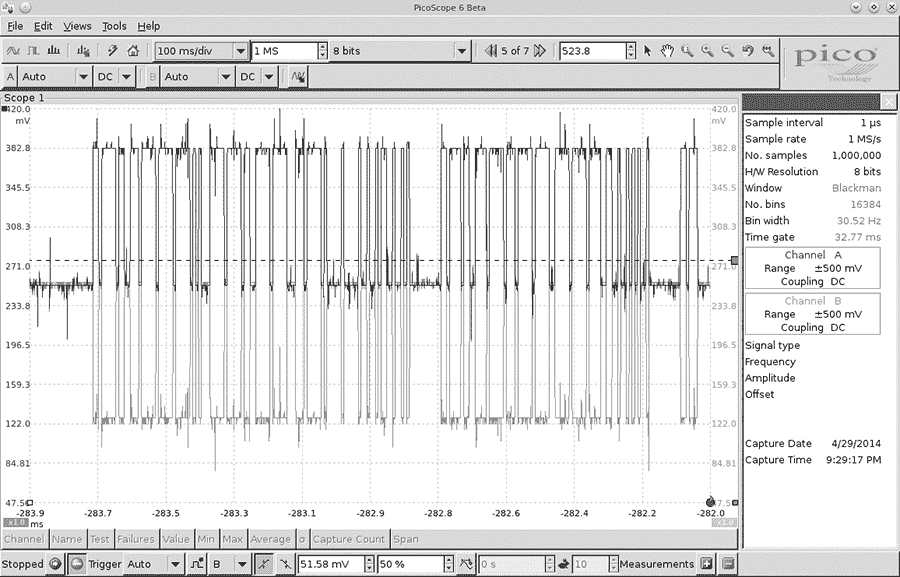

*图 2-1：CAN 差分信号*

图 2-1 展示了使用 PicoScope 捕获的信号，PicoScope 同时监听 CANH（图表顶部的较暗线条）和 CANL（图表底部的较亮线条）。注意，当一个比特在 CAN 总线上传输时，信号会同时在两个方向上传播，电压分别升高和降低 1V。传感器和 ECU 有一个收发器，它检查是否同时触发了这两个信号；如果没有，收发器会将数据包拒绝为噪声。

这两根双绞线构成总线，并要求在每端进行终端匹配。终端端口上的两根电缆之间有一个 120 欧姆的电阻。如果模块不在总线的末端，它不需要考虑终端匹配。作为可能接入线路的人，只有在你移除终端设备以进行线缆监测时，才需要担心终端匹配问题。

#### *OBD-II 连接器*

许多车辆都配备了 OBD-II 连接器，也叫做*诊断链接连接器（DLC）*，它与车辆的内部网络进行通信。你通常会在方向盘柱下方或仪表板的其他地方找到这个连接器，它通常位于一个相对容易访问的地方。你可能需要四处寻找，但它的外形类似于图 2-2 中的样子。

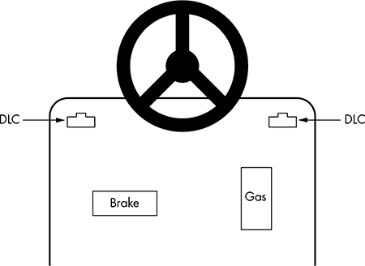

*图 2-2：OBD-II 连接器的可能位置*

在一些车辆中，你会在小的接入面板后面找到这些连接器。它们通常是黑色或白色的。有些连接器很容易访问，而另一些则被藏在塑料下方。只要搜索，就能找到！

#### *寻找 CAN 连接*

CAN 信号在电缆中容易找到，因为其静态电压为 2.5V。当有信号输入时，它会增加或减少 1V（3.5V 或 1.5V）。CAN 电缆穿过车辆，并在 ECU 和其他传感器之间连接，通常是双线对的形式。如果你连接一个万用表并检查车辆电缆的电压，你会发现它们在静态时为 2.5V，或者波动 1V。如果你找到一个电压为 2.5V 的电缆，那它几乎可以肯定是 CAN 电缆。

你应该在 OBD-II 连接器的针脚 6 和 14 上找到 CANH 和 CANL 连接，如图 2-3 所示。

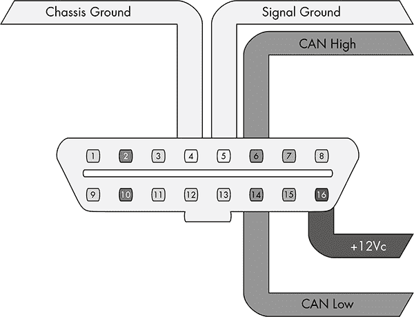

*图 2-3：OBD-II 连接器上的 CAN 引脚线缆视图*

在图中，针脚 6 和 14 用于标准的高速 CAN 线路（HS-CAN）。中速和低速通信发生在其他针脚上。一些汽车使用 CAN 进行中速（MS-CAN）和低速（LS-CAN）通信，但许多车辆使用不同的协议进行这些通信。

你会发现，并不是所有的总线都可以通过 OBD-II 连接器暴露出来。你可以使用接线图来帮助定位额外的“内部”总线线路。

#### *CAN 总线数据包布局*

CAN 数据包有两种类型：*标准型*和*扩展型*。扩展型数据包类似于标准型，但具有更大的空间来容纳 ID。

##### 标准数据包

每个 CAN 总线数据包包含四个关键元素：

**仲裁 ID** 仲裁 ID 是一种广播消息，标识尝试通信的设备 ID，尽管任何设备都可以发送多个仲裁 ID。如果两个 CAN 数据包同时沿着总线发送，仲裁 ID 较低的那个数据包会赢。

**标识符扩展（IDE）** 对于标准 CAN，这个位始终为 0。

**数据长度代码（DLC）** 这是数据的大小，范围从 0 到 8 字节。

**数据** 这是数据本身。标准 CAN 总线数据包承载的数据最大可以达到 8 字节，但某些系统通过填充数据包来强制使用 8 字节。

图 2-4 展示了标准 CAN 数据包的格式。

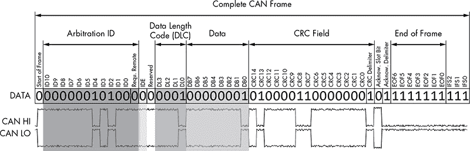

*图 2-4：标准 CAN 数据包格式*

由于 CAN 总线的数据包是广播的，网络上所有控制器都能看到*每个*数据包，就像以太网网络上的 UDP 一样。数据包不携带关于哪个控制器（或攻击者）发送了什么信息。因为任何设备都可以看到和发送数据包，所以在总线上任何设备都可以模拟其他设备。

##### 扩展数据包

扩展数据包与标准数据包类似，只是它们可以链在一起，以创建更长的 ID。扩展数据包被设计为适应标准 CAN 格式，以保持向后兼容性。所以如果某个传感器不支持扩展数据包，在同一网络上其他数据包传输扩展 CAN 数据包时，它也不会出错。

标准数据包与扩展数据包的一个区别在于它们对标志的使用。通过网络转储查看扩展数据包时，你会发现与标准数据包不同，扩展数据包使用替代远程请求（SRR），代替远程传输请求（RTR），并且 SSR 设置为 1。它们还会将 IDE 设置为 1，并且它们的数据包会有一个 18 位标识符，这是标准 11 位标识符的第二部分。还有一些特定于某些制造商的 CAN 风格协议，它们与标准 CAN 一样，向后兼容扩展 CAN。

#### *ISO-TP 协议*

ISO 15765-2，也称为*ISO-TP*，是通过 CAN 总线发送数据包的标准，它通过将 CAN 数据包链在一起来扩展 8 字节的 CAN 限制，支持最多 4095 字节。ISO-TP 最常见的用途是诊断（参见“统一诊断服务”第 54 页）和 KWP 消息（CAN 的替代协议），但它也可以用于任何需要通过 CAN 传输大量数据的场合。`can-utils`程序包括`isotptun`，一个概念验证的隧道工具，适用于 SocketCAN，允许两个设备通过 CAN 隧道传输 IP。（有关如何安装和使用`can-utils`的详细说明，请参见“设置`can-utils`连接到 CAN 设备”第 36 页。）

为了将 ISO-TP 封装到 CAN 中，第一个字节用于扩展寻址，每个数据包剩余 7 个字节用于数据。通过 ISO-TP 发送大量信息可能会轻易地淹没总线，因此在总线活跃时使用此标准进行大规模传输时需要小心。

#### *CANopen 协议*

另一种扩展 CAN 协议的例子是 CANopen 协议。CANopen 将 11 位标识符分解为 4 位功能代码和 7 位节点 ID，这种组合被称为*通信对象标识符（COB-ID）*。该系统中的广播消息将功能代码和节点 ID 都设为 0x。CANopen 在工业环境中比在汽车环境中更为常见。

如果你看到一堆 0x0 的仲裁 ID，那么你发现的很可能是一个使用 CANopen 进行通信的系统。CANopen 与普通 CAN 非常相似，但在仲裁 ID 方面有一个定义明确的结构。例如，心跳消息的格式是 0x700 + 节点 ID。与标准 CAN 总线相比，CANopen 网络更容易进行反向工程和文档化。

#### *GMLAN 总线*

GMLAN 是通用汽车实现的 CAN 总线。它基于 ISO 15765-2 ISO-TP，就像 UDS（参见“统一诊断服务”第 54 页）一样。GMLAN 总线包括一个单线低速总线和一个双线高速总线。低速总线是一个单线 CAN 总线，工作速度为 33.33Kbps，最多支持 32 个节点，采用这种方式是为了降低通信和布线成本。它用于传输非关键性信息，如信息娱乐中心、暖通空调控制、车门锁、发动机防盗器等。相比之下，高速总线以 500Kbps 的速度运行，最多支持 16 个节点。GMLAN 网络中的节点与该总线上的传感器相关联。

### SAE J1850 协议

SAE J1850 协议最初在 1994 年被采用，至今仍可在一些现代车辆中找到，例如一些通用汽车和克莱斯勒的车辆。这些总线系统比 CAN 总线更老旧、速度更慢，但实现成本较低。

J1850 协议有两种类型：脉冲宽度调制（PWM）和可变脉冲宽度（VPW）。图 2-5 显示了在 OBD-II 连接器上找到 PWM 引脚的位置。VPW 只使用引脚 2。

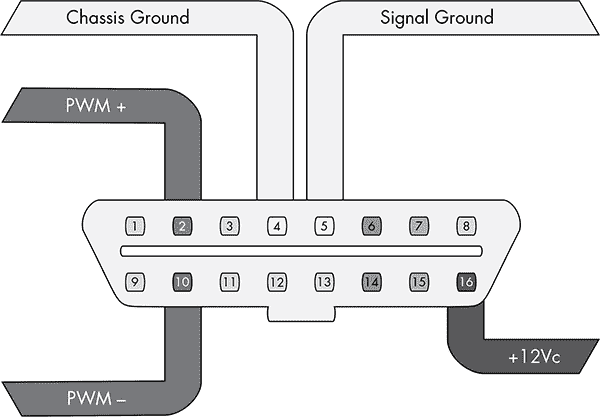

*图 2-5：PWM 引脚电缆视图*

速度分为三类：A 类、B 类和 C 类。PWM 和 VPW 的 10.4Kbps 速度被认为是 A 类，这意味着它们是专门用于商业、工业和商业环境中的设备。（10.4Kbps 的 J1850 VPW 总线满足汽车行业对低辐射排放的要求。）B 类设备可以在任何地方使用，包括住宅环境，并且有一个第二个 SAE 标准实现，可以以 100Kbps 进行通信，但价格稍贵。最终的实现可以达到 1Mbps，并且用于 C 类设备。正如你所预料的那样，这第三种实现是最昂贵的，主要用于实时关键系统和媒体网络。

#### *PWM 协议*

PWM 在引脚 2 和 10 上使用差分信号，主要由福特使用。它以 5V 的高电压和 41.6Kbps 的速度工作，并使用类似于 CAN 的双线差分信号。

PMW 使用固定比特信号，因此 1 始终为高信号，0 始终为低信号。除此之外，通信协议与 VPW 相同。它们的区别在于速度、电压和用于构成总线的线数。

#### *VPW 协议*

VPW 是一种单线总线系统，仅使用引脚 2，通常由通用汽车和克莱斯勒使用。VPW 的高电压为 7V，速度为 10.4Kbps。

与 CAN 相比，VPW 解读数据的方式存在一些关键差异。首先，由于 VPW 使用依赖时间的信号，接收 1 位不仅仅是由总线上的高电位决定。该位必须保持高或低一定时间才能被认为是一个 1 位或 0 位。将总线拉高会使其达到大约 7V，而发送低信号则会将其拉至接地或接近接地电平。这个总线在非传输阶段通常处于接近接地电平（最高 3V）。

VPW 数据包采用图 2-6 中的格式。

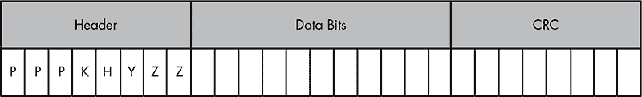

*图 2-6：VPW 格式*

数据部分是一个固定大小——始终是 11 位，后跟一个 1 位的 CRC 有效性检查。表 2-1 显示了头部位的含义。

**表 2-1：** 头部位的含义

| **头部位** | **含义** | **备注** |
| --- | --- | --- |
| PPP | 消息优先级 | 000 = 最高，111 = 最低 |
| H | 头部大小 | 0 = 3 字节，1 = 单字节 |
| K | 帧内响应 | 0 = 必须，1 = 不允许 |
| Y | 地址模式 | 0 = 功能型，1 = 物理型 |
| ZZ | 消息类型 | 将根据 K 和 Y 的设置有所不同 |

在帧内响应（IFR）数据可能会紧随此消息之后。通常，在 CRC 后会出现一个 200μs 长的低电位信号作为数据结束（EOD）信号，如果包含 IFR 数据，则它会在 EOD 后立即开始。如果不使用 IFR，EOD 会延长至 280μs，形成帧结束（EOF）信号。

### 关键词协议与 ISO 9141-2

关键词协议 2000（ISO 14230），也称为 *KWP2000*，使用引脚 7，常见于 2003 年后生产的美国车辆。使用 KWP2000 发送的消息可以包含最多 255 字节。

KWP2000 协议有两种变种，主要在波特率初始化方面有所不同。具体变种如下：

• ISO 14230-4 KWP（5 波特初始化，10.4 K 波特）

• ISO 14230-4 KWP（快速初始化，10.4 K 波特率）

ISO 9141-2 或 K-Line 是 KWP2000 的一种变种，通常见于欧洲车辆。K-Line 使用引脚 7 和（可选的）引脚 15，如图 2-7 所示。K-Line 是一种类似于串行的 UART 协议。UART 使用起始位，并且可能包括奇偶校验位和停止位。（如果你曾经配置过调制解调器，你应该会认识到这些术语。）

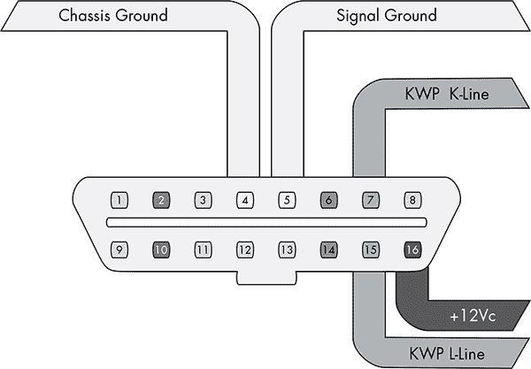

*图 2-7：KWP K-Line 引脚电缆视图*

图 2-8 显示了协议的数据包布局。与 CAN 数据包不同，K-Line 数据包有一个源（发送者）和一个目标（接收者）地址。K-Line 可以使用与 CAN 相同或类似的参数 ID（PID）请求结构。（关于 PID 的更多内容，请参见 “统一诊断服务” 第 54 页。）

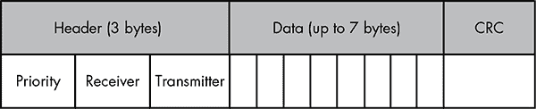

*图 2-8：KWP K-Line 数据包布局*

### 局部互联网络协议

*局部互联网络（LIN）*是最便宜的车辆协议。它的设计是为了补充 CAN 协议。它没有仲裁或优先级代码；相反，由单一的主节点负责所有的传输。

LIN 最多可以支持 16 个从节点，它们主要只是监听主节点的信号。它们确实需要偶尔响应，但这不是它们的主要功能。通常，LIN 主节点会连接到 CAN 总线上。

LIN 的最大速度为 20Kbps。LIN 是一个单线总线，工作电压为 12V。你不会看到 LIN 被直接连接到 OBD 连接器，但它常常用来替代直接的 CAN 数据包，以处理简单设备的控制，因此需要注意它的存在。

一个 LIN 消息帧包括一个由主节点始终发送的头部，以及一个由主节点或从节点发送的响应部分（参见图 2-9）。

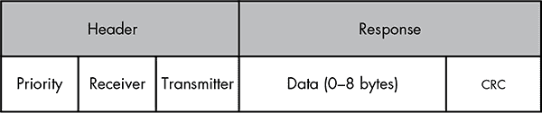

*图 2-9：LIN 格式*

SYNC 字段用于时钟同步。ID 代表消息内容——即正在传输的数据类型。ID 可以包含多达 64 种可能性。ID 60 和 61 用于承载诊断信息。

在读取诊断信息时，主节点发送 ID 60，而从节点则以 ID 61 响应。所有 8 个字节都用于诊断。第一个字节称为诊断节点地址（NAD）。字节范围的前一半（即 1–127）被定义为符合 ISO 标准的诊断，而 128–255 则可以是特定于该设备的。

### MOST 协议

*媒体导向系统传输（MOST）协议*是为多媒体设备设计的。通常，MOST 以环形拓扑或虚拟星型拓扑布局，支持最多 64 个 MOST 设备。一个 MOST 设备作为时序主节点，持续向环中输入帧。

MOST 的传输速率约为 23 Mbaud，并支持最多 15 个未压缩的 CD 质量音频或 MPEG1 音频/视频通道。一个独立的控制通道以 768 Kbaud 的速率运行，并向 MOST 设备发送配置消息。

MOST 有三种速度：MOST25、MOST50 和 MOST150。标准 MOST 或 MOST25 运行在塑料光纤（POF）上。传输通过 650 纳米的红光波长使用 LED 完成。一个类似的协议，MOST50，双倍了带宽并增加了帧长至 1025 位。MOST50 流量通常通过无屏蔽双绞线（UTP）电缆传输，而非光纤。最后，MOST150 实现了以太网，并将帧率提高到 3072 位或 150Mbps——大约是 MOST25 带宽的六倍。

每个 MOST 帧有三个通道：

**同步** 流数据（音频/视频）

**异步** 数据包分发数据（TCP/IP）

**控制** 控制和低速数据（HMI）

除了时钟主设备，MOST 网络主设备还会自动为设备分配地址，这允许一种即插即用的结构。MOST 的另一个独特特点是，与其他总线不同，它通过独立的输入端口和输出端口来路由数据包。

#### *MOST 网络层*

除非你的目标是破解汽车的视频或音频流，否则 MOST 协议可能不会让你太感兴趣。不过，MOST 确实允许访问车载麦克风或手机系统，以及可能对恶意软件作者感兴趣的交通信息。

图 2-10 显示了 MOST 是如何划分到开放系统互联（OSI）模型的七层中的，OSI 模型标准化了网络通信。如果你熟悉其他基于媒体的网络协议，那么 MOST 可能会显得熟悉。

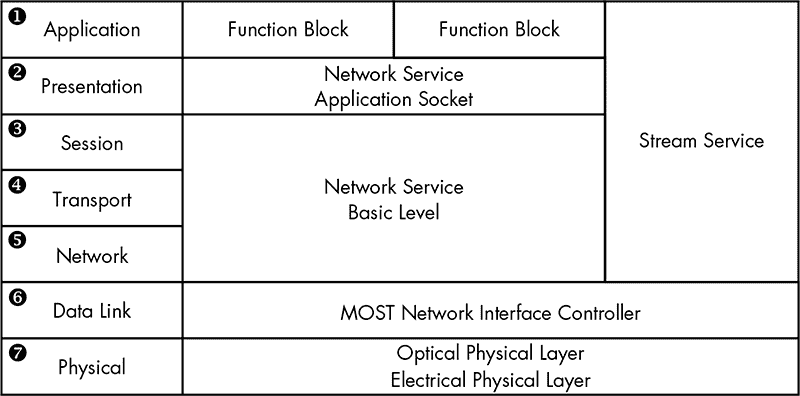

*图 2-10：MOST 被划分为 OSI 模型的七层。OSI 层位于右列。*

#### *MOST 控制块*

在 MOST25 中，一个块由 16 个帧组成。一个帧是 512 位，形态如图 2-11 所示。

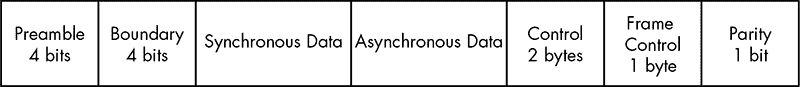

*图 2-11：MOST25 帧*

同步数据包含 6 到 15 个四元组（每个四元组为 4 字节），异步数据包含 0 到 9 个四元组。一个控制帧为 2 字节，但当组合完整块（或 16 个帧）时，最终得到 32 字节的控制数据。

组装后的控制块布局如图 2-12 所示。

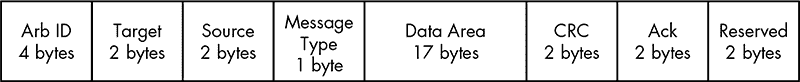

*图 2-12：组装后的控制块布局*

数据区域包含 FblockID、InstID、FktID、操作类型（OP Type）、Tel ID、Tel Len 和 12 字节数据。FblockID 是核心组件 ID，也就是功能块。例如，FblockID 为 0x52 可能是导航系统。InstID 是功能块的实例。可以有多个核心功能，例如有两个 CD 更换。InstID 用于区分要与哪个核心通信。FktID 用于查询更高级别的功能块。例如，FktID 为 0x0 时，查询功能块支持的功能 ID 列表。操作类型（OP Type）是要执行的操作类型，例如获取、设置、递增、递减等。Tel ID 和 Len 分别表示电报的类型和长度。电报类型表示单次传输或多包传输，电报的长度则表示电报本身的长度。

MOST50 的布局与 MOST25 相似，但数据部分更大。MOST150 提供两个额外的通道：以太网和 Isochronous。以太网像普通的 TCP/IP 和 Appletalk 设置一样工作。Isochronous 有三种机制：突发模式、恒定速率和数据包流传输。

#### *破解 MOST*

MOST 可以通过已经支持 MOST 的设备进行破解，例如通过车辆的娱乐信息单元或通过车载 MOST 控制器。基于 Linux 的项目 most4linux 提供了 MOST PCI 设备的内核驱动程序，截至目前，支持西门子 CT SE 2 和 OASIS Silicon Systems 或 SMSC PCI 卡。most4linux 驱动程序允许通过 MOST 网络进行用户空间通信，并链接到高级 Linux 声音架构（ALSA）框架以读取和写入音频数据。目前，most4linux 应被视为 alpha 版本，但它包含一些示例实用程序，您可以基于这些工具进行开发，具体包括：

`most_aplay` 播放一个 *.wav* 文件

`ctrl_tx` 发送广播控制消息并检查状态

`sync_tx` 持续发送

`sync_rx` 持续接收

当前的 most4linux 驱动程序是为 2.6 Linux 内核编写的，因此如果您想要制作一个通用嗅探器，可能会遇到一些困难。MOST 实现起来相当昂贵，因此一个通用嗅探器不会便宜。

### FlexRay 总线

FlexRay 是一种高速总线，能够以最高 10Mbps 的速度进行通信。它适用于时间敏感的通信，例如电子节气门、电子转向、电子刹车等。FlexRay 的实现比 CAN 更昂贵，因此大多数实现使用 FlexRay 作为高端系统的总线，使用 CAN 作为中端系统，使用 LIN 作为低成本设备。

#### *硬件*

FlexRay 使用双绞线布线，但也可以支持双通道配置，这样可以增加容错性和带宽。然而，大多数 FlexRay 实现仅使用类似于 CAN 总线实现的单对布线。

#### *网络拓扑*

FlexRay 支持标准的总线拓扑，类似于 CAN 总线，其中许多 ECUs 通过一对双绞线总线运行。它还支持像以太网那样的星型拓扑，可以支持更长的段。当采用星型拓扑时，FlexRay 中心节点是一个主动的 FlexRay 设备，与其他节点进行通信。在总线布局中，FlexRay 需要适当的电阻终端，类似于标准的 CAN 总线。如果需要，可以将总线和星型拓扑结合，创建混合布局。

#### *实现*

在创建 FlexRay 网络时，制造商必须告知设备有关网络设置的信息。回想一下，在 CAN 网络中，每个设备只需要知道波特率以及它关心的 ID（如果有的话）。在总线布局中，只有一个设备可以在总线上进行通信。在 CAN 总线的情况下，谁先发言的顺序通过仲裁 ID 来决定。

相比之下，当 FlexRay 配置为在总线上通信时，它使用一种叫做 *时分多路访问（TDMA）* 的方案来保证确定性：速率始终相同（确定性），系统依赖于发射器在数据包通过电缆时填充数据，类似于 GSM 等蜂窝网络的工作方式。FlexRay 设备不会自动检测网络或网络上的地址，因此必须在制造时将这些信息预先编程。

尽管这种静态寻址方式在制造过程中降低了成本，但对于测试设备来说，参与总线通信可能会比较棘手，因为设备在加入 FlexRay 网络后，不知道哪些数据应该放入哪些槽位。为了解决这个问题，像字段总线交换格式（FIBEX）这样的特定数据交换格式在 FlexRay 开发过程中应运而生。

FIBEX 是一种 XML 格式，用于描述 FlexRay、CAN、LIN 和 MOST 网络的设置。FIBEX 拓扑图记录了 ECUs 以及它们如何通过通道连接，并且可以实现网关，以确定总线之间的路由行为。这些拓扑图还可以包含所有信号及其预期的解释方式。

FIBEX 数据在固件编译时使用，并允许开发人员在代码中引用已知的网络信号；编译器会处理所有的放置和配置。要查看 FIBEX，请从 *[`sourceforge.net/projects/fibexplorer/`](http://sourceforge.net/projects/fibexplorer/)* 下载 FIBEX Explorer。

#### *FlexRay 周期*

一个 FlexRay 周期可以视为一个数据包。每个周期的长度在设计时确定，应该由四个部分组成，如 图 2-13 所示。

*图 2-13：FlexRay 周期的四个部分*

静态部分包含保留时隙，用于表示始终具有相同意义的数据。动态部分的时隙包含可能具有不同表示的数据。符号窗口用于网络信号传输，而空闲部分（安静时间）用于同步。

FlexRay 上最小的时间单位被称为*宏时隙*，通常为一毫秒。所有节点都同步时间，并且它们会同时触发其宏时隙数据。

FlexRay 周期的静态部分包含一组固定数量的时隙来存储数据，就像空的火车车厢一样。当 ECU 需要更新静态数据单元时，它会填充其定义的时隙或车厢；每个 ECU 都知道为其定义了哪个车厢。这个系统之所以能工作，是因为 FlexRay 总线上的所有参与者都是时间同步的。

动态部分被分割成微时隙，通常为一个宏时隙的长度。动态部分通常用于存储较不重要、间歇性的数据，如内部空气温度。随着微时隙的通过，ECU 可能选择填充这些微时隙。如果所有微时隙都已满，ECU 必须等待下一个周期。

在图 2-14 中，FlexRay 周期被表示为火车车厢。负责填充静态时隙信息的发送器会在周期通过时进行填充，但动态时隙是按先到先得的方式填充的。所有火车车厢的大小相同，代表 FlexRay 的时间确定性特性。

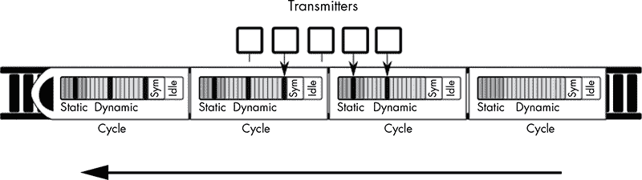

*图 2-14：表示周期的 FlexRay 火车*

大多数 FlexRay 设备通常不会直接使用符号窗口，这意味着从黑客的角度来看，你绝对应该对这个部分进行修改。FlexRay 集群在由 FlexRay 状态管理器控制的状态下工作。根据 AUTOSAR 4.2.1 标准，这些状态如下：准备好、唤醒、启动、停止请求、在线、在线被动、仅键槽、以及冷启动数较少。

虽然大多数状态是显而易见的，但有些需要进一步解释。具体来说，在线是正常的通信状态，而在线被动应该仅在同步错误时出现。在在线被动模式下，不会发送或接收数据。仅键槽意味着数据只能在键槽中传输。冷启动数较少意味着总线仍在完全通信模式下运行，但仅依赖于同步帧。还有其他操作状态，如配置、休眠、仅接收和待机。

#### *数据包布局*

FlexRay 使用的实际数据包包含多个字段，并根据静态或动态时隙适配到周期中（见图 2-15）。

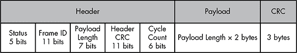

*图 2-15：FlexRay 数据包布局*

状态位为：

• 保留位

• 负载前导指示符

• NULL 帧指示符

• 同步帧指示符

• 启动帧指示符

帧 ID 是数据包应该在静态时隙中传输的时隙。当数据包用于动态时隙（1–2047）时，帧 ID 表示该数据包的优先级。如果两个数据包具有相同的信号，则优先级最高的数据包会胜出。有效负载长度是以字（2 字节）为单位的数字，最大可达 127 字，这意味着一个 FlexRay 数据包可以携带 254 字节的数据——是 CAN 数据包的 30 倍以上。头部 CRC 应该是显而易见的，周期计数器作为通信计数器使用，每当一个通信周期开始时会递增。

静态时隙的一个非常巧妙的特点是，ECU 可以读取早期的静态时隙，并根据这些输入在同一周期内输出一个值。例如，假设你有一个组件，在输出任何必要的调整之前，需要知道每个车轮的位置。如果静态周期的前四个时隙包含每个车轮的位置，校准 ECU 可以读取这些时隙，并且仍然有时间在后续时隙中填充任何调整。

#### *嗅探 FlexRay 网络*

截至本文撰写时，Linux 尚未官方支持 FlexRay，但一些厂商提供了补丁，添加了对某些内核和架构的支持。（Linux 支持 FlexCAN，但 FlexCAN 是一种受 FlexRay 启发的 CAN 总线网络。）

目前，没有标准的开源工具用于嗅探 FlexRay 网络。如果你需要一个通用工具来嗅探 FlexRay 流量，目前你必须选择一个专有的产品，而这些产品价格不菲。如果你想在没有 FIBEX 文件的情况下监控 FlexRay 网络，你*至少*需要知道总线的波特率。理想情况下，你还应该知道周期长度（以毫秒为单位），并且如果可能的话，知道集群分区的大小（静态与动态的比例）。从技术上讲，FlexRay 集群最多可以有 1048 种配置，包含 74 个参数。你可以在 Eric Armengaud、Andreas Steininger 和 Martin Horauer 的论文《基于 FlexRay 的汽车通信网络中的自动参数识别》（IEEE，2006）中找到有关识别这些参数的方法。

在一个有两个通道的 FlexRay 网络上进行数据包欺骗时，你需要同时欺骗两个通道。此外，你还会遇到名为 *Bus Guardian* 的 FlexRay 实现，它旨在防止任何设备对总线的泛洪或垄断。Bus Guardian 在硬件级别通过 FlexRay 芯片上的一个引脚工作，这个引脚通常称为 *Bus Guardian Enable (BGE)*。这个引脚通常标记为可选，但 Bus Guardian 也可以将该引脚电平拉高，从而禁用一个行为异常的设备。

### 汽车以太网

由于 MOST 和 FlexRay 昂贵且逐渐失去支持（FlexRay 联盟似乎已经解散），大多数新型车辆正在转向以太网。以太网的实现有所不同，但基本上与标准计算机网络中的以太网相同。通常，CAN 数据包会被封装为 UDP，音频则作为 IP 语音（VoIP）进行传输。以太网可以以最高 10Gbps 的速度传输数据，使用非专有协议和任何选择的拓扑结构。

尽管 CAN 流量没有统一标准，制造商们已开始使用 IEEE 802.1AS 音视频桥接（AVB）标准。该标准支持服务质量（QoS）和流量整形，并且使用时间同步的 UDP 数据包。为了实现这种同步，节点们遵循*最佳主时钟*算法，以确定哪个节点将成为时间主节点。主节点通常会与外部时间源同步，例如 GPS 或（在最坏的情况下）车载振荡器。主节点通过发送定时数据包（10 毫秒）与其他节点同步，接收节点则回应一个*延迟请求*，通过这种交换计算出时间偏差。

从研究人员的角度来看，车辆以太网的唯一挑战在于如何与以太网进行通信。您可能需要制作或购买定制电缆与车辆以太网电缆进行通信，因为这些电缆看起来不会像您在网络机房中找到的标准双绞线。通常，连接器只会是与 ECU 连接的电线。不要指望连接器会有自己的插头，但如果有，它看起来不会像 RJ-45 连接器。有些暴露的连接器实际上是圆形的，如图 2-16 所示。

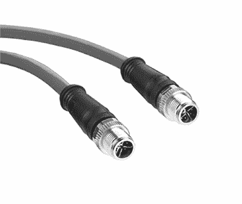

*图 2-16：圆形以太网连接器*

### OBD-II 连接器引脚图

OBD-II 接头中的其余引脚是制造商特定的。引脚映射因制造商不同而有所变化，以下是一些指导原则。您的接头可能会根据品牌和型号有所不同。例如，图 2-17 展示的是一款通用汽车的接头引脚图。

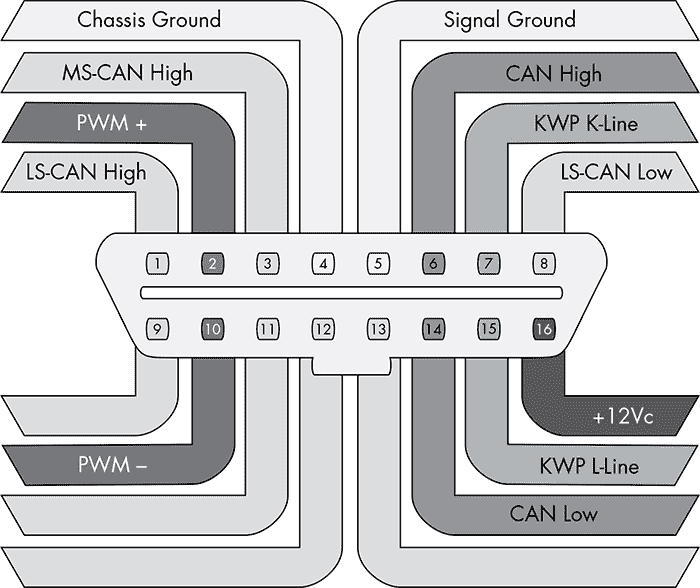

*图 2-17：通用汽车车辆的完整 OBD 接头引脚视图*

请注意，OBD 连接器可能有多个 CAN 线路，例如低速线路（LS-CAN）或中速线路（MS-CAN）。低速线路工作在约 33Kbps，中速线路约 128Kbps，高速（HS-CAN）约 500Kbps。

在将嗅探器连接到车辆的 OBD-II 连接器时，通常会使用 DB9 到 OBDII 的连接器。图 2-18 展示的是插头视图，而非电缆的视图。

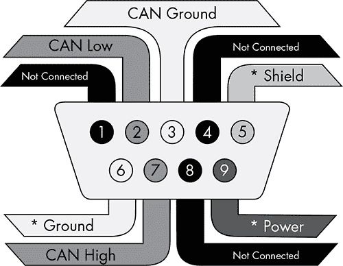

*图 2-18：典型的 DB9 连接器插头视图。带星号（*）的引脚表示该引脚是可选的。一个 DB9 适配器可能只有三个连接引脚。*

这个针脚排列在英国是常见的，如果你自己做电缆，这个会是最容易使用的。然而，一些嗅探器，例如许多 Arduino 扩展板，预期使用美式 DB9 连接器（见 图 2-19）。

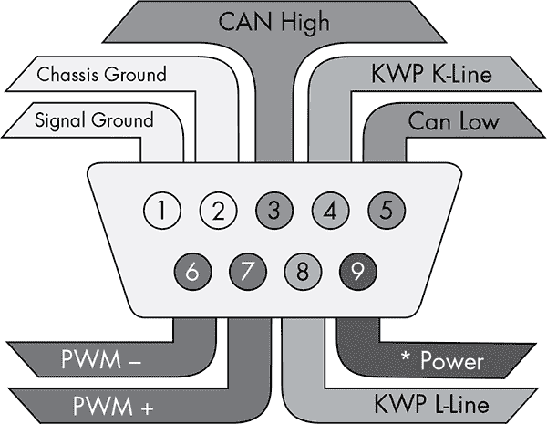

*图 2-19：美式 DB9 连接器，插头视图*

美版的功能更多，除了 CAN 之外，你还可以访问其他 OBD 连接器。幸运的是，两个类型的连接器的电源都位于第 9 针，因此即使你误抓了错误的电缆，也不会损坏你的嗅探器。一些嗅探器，如 CANtact，有跳线可以根据你使用的电缆类型进行设置。

### OBD-III 标准

OBD-III 是 OBD-II 标准的一个相当有争议的演进版本。OBD-II 最初设计时是为了符合排放测试要求（至少从监管者的角度来看），但现在，动力总成控制模块（PCM）已经知道车辆是否符合规定，但车主每隔一年仍然需要去进行测试的麻烦没有解决。OBD-III 标准允许 PCM 在无需车主干预的情况下远程传输其状态。通常，这种通信是通过路边的应答器完成的，但手机和卫星通信也能起作用。

加利福尼亚州空气资源委员会（CARB）自 1994 年起开始测试 OBD-III 的路边读取器，并能够在时速 100 英里的交通流中读取来自八条车道的车辆数据。如果系统检测到故障，它将把诊断故障码（DTC）和车辆识别号（VIN）传输给附近的应答器（参见 “诊断故障码” 第 52 页）。这个系统的目的是在无需等待最多两年的排放检查的情况下，报告污染物进入大气层。

大多数 OBD-III 的实现都是特定于制造商的。车辆会将故障信息发送回制造商，然后联系车主告知需要修理。如你所想，这种系统存在一些明显的法律问题需要解决，包括私有财产的群众监控风险。当然，执法机构也有很多滥用的空间，比如测速陷阱、追踪、锁车等。

一些提交的关于将 OBD-III 集成到车辆中的提案声称，使用应答器存储以下信息：

• 当前查询的日期和时间

• 上次查询的日期和时间

• VIN

• 状态，例如“正常”，“故障”或“无响应”

• 存储的故障码（DTC）

• 接收站号码

需要注意的是，即使 OBD-III 仅发送 DTC 和 VIN，添加额外的元数据，如位置、时间和车辆通过转发器的历史记录，也是微不足道的。大多数情况下，OBD-III 是床下的幽灵。截至本文写作时，它尚未与转发器方法一起部署，尽管像 OnStar 这样的“回家”系统正在部署，以通知汽车经销商各种安全或安全问题。

### 总结

在操作目标车辆时，你可能会遇到多种不同的总线和协议。遇到这种情况时，检查你特定车辆的 OBD-II 连接器所使用的引脚，帮助你确定需要哪些工具，以及在逆向车辆网络时可能会遇到的情况。

本章我重点介绍了通过 OBD-II 连接器轻松访问的总线，但你还应该查看你的车辆接线图，以确定在哪里可以找到传感器之间的其他总线线路。并非所有的总线线路都通过 OBD-II 连接器暴露出来，当你寻找某个特定数据包时，可能更容易定位模块并跟踪离开特定模块的总线线路，从而逆向工程某个特定数据包。（有关如何读取接线图的详细信息，请参见第七章）。
