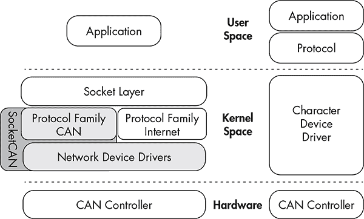
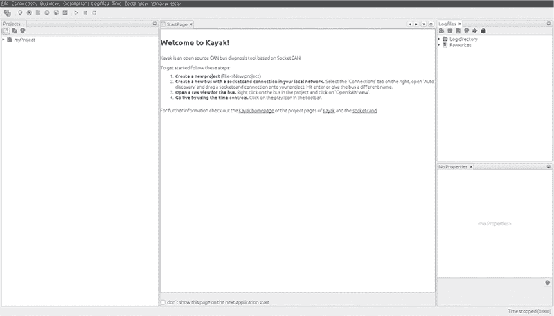
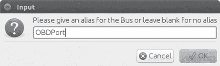
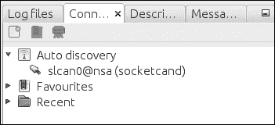
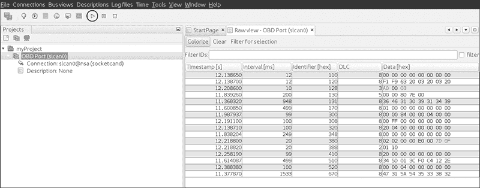

## **3**

**使用 SocketCAN 进行车辆通信**


当您开始使用 CAN 进行车辆通信时，您可能会发现它是不同驱动程序和软件工具的大杂烩。理想情况是将 CAN 工具及其不同的接口统一为一个通用接口，以便我们可以轻松地在工具之间共享信息。

幸运的是，有一套具有共同接口的工具，并且是免费的！如果您使用 Linux 或在虚拟机（VM）上安装了 Linux，您已经拥有这个接口。这个接口称为 SocketCAN，于 2006 年在开源开发网站 BerliOS 上创建。今天，术语 *SocketCAN* 用于指代将 CAN 驱动程序实现为网络设备（如以太网卡），并描述应用程序通过网络套接字编程接口访问 CAN 总线的实现。在本章中，我们将设置 SocketCAN，以便更轻松地与车辆进行通信。

大众集团研究贡献了最初的 SocketCAN 实现，支持内置 CAN 芯片和卡驱动程序，外部 USB 和串行 CAN 设备，以及虚拟 CAN 设备。`can-utils` 软件包提供了几个应用程序和工具，用于与 CAN 网络设备交互、CAN 特定协议，并能设置虚拟 CAN 环境。为了测试本书中的许多示例，请在您系统上的 Linux 虚拟机中安装最新版本。最新版本的 Ubuntu 中已经包含了`can-utils`。

SocketCAN 与 Linux 网络堆栈紧密结合，这使得创建支持 CAN 的工具变得非常容易。SocketCAN 应用程序可以使用标准的 C 套接字调用与自定义网络协议族 `PF_CAN`，这种功能允许内核处理 CAN 设备驱动程序，并与现有的网络硬件进行接口，提供一个通用的接口和用户空间实用工具。

图 3-1 比较了传统 CAN 软件的实现与统一的 SocketCAN。



*图 3-1：SocketCAN 布局（左）和传统 CAN 软件（右）*

使用传统的 CAN 软件，应用程序通常具有自己的协议，通常与字符设备（如串行驱动程序）和实际的硬件驱动程序交流。在图的左侧，SocketCAN 是在 Linux 内核中实现的。通过创建自己的 CAN 协议族，SocketCAN 可以与现有的网络设备驱动程序集成，从而使应用程序能够将 CAN 总线接口视为通用网络接口。

### **设置 can-utils 以连接到 CAN 设备**

要安装 `can-utils`，您必须使用 2008 年或更新的 Linux 发行版，或者运行 2.6.25 或更高版本的 Linux 内核。首先我们将安装 `can-utils`，然后介绍如何配置它以适应您的特定设置。

#### ***安装 can-utils***

你应该能够使用包管理器安装`can-utils`。这里有一个 Debian/Ubuntu 的示例：

```
$ sudo apt-get install can-utils
```

如果你的包管理器中没有 `can-utils`，可以通过 `git` 命令从源代码安装：

```
$ git clone https://github.com/linux-can/can-utils
```

截至本文写作时，`can-utils` 包含 *configure*、*make* 和 *make install* 文件，但在旧版本中，你只需输入 `make` 来从源代码安装。

#### ***配置内建芯片组***

下一步取决于你的硬件。如果你正在寻找 CAN 嗅探器，应该检查受支持的 Linux 驱动程序列表，以确保你的设备兼容。截至本文写作时，Linux 内建的 CAN 驱动程序支持以下芯片组：

• Atmel AT91SAM SoC

• 博世 CC770

• ESD CAN-PCI/331 卡

• Freescale FlexCAN

• Freescale MPC52xx SoC（MSCAN）

• 英特尔 AN82527

• Microchip MCP251x

• NXP（飞利浦）SJA1000

• TI SoC

像 SJA1000 这样的 CAN 控制器通常集成在 ISA、PCI、PCMCIA 卡或其他嵌入式硬件中。例如，EMS PCMCIA 卡驱动程序实现对其 SJA1000 芯片的访问。当你将 EMS PCMCIA 卡插入笔记本电脑时，`ems_pcmcia` 模块会加载到内核中，随后需要加载 `sja1000` 模块和 `can_dev` 模块。`can_dev` 模块提供标准配置接口——例如，用于设置 CAN 控制器的比特率。

Linux 内核的模块化概念同样适用于通过总线硬件连接 CAN 控制器的 CAN 硬件驱动程序，如 `kvaser_pci`、`peak_pci` 等。当你插入一个受支持的设备时，这些模块应该会自动加载，你可以通过输入 `lsmod` 命令看到它们。USB 驱动程序，如 `usb8dev`，通常实现一个专有的 USB 通信协议，因此不会加载 CAN 控制器驱动程序。

例如，当你插入一个 PEAK-System PCAN-USB 适配器时，`can_dev` 模块会加载，`peak_usb` 模块会完成初始化。使用显示消息命令 `dmesg`，你应该看到类似如下的输出：

```
$ dmesg
--snip --
[ 8603.743057] CAN device driver interface
[ 8603.748745] peak_usb 3-2:1.0: PEAK-System PCAN-USB adapter hwrev 28 serial
    FFFFFFFF (1 channel)
[ 8603.749554] peak_usb 3-2:1.0 can0: attached to PCAN-USB channel 0 (device
    255)
[ 8603.749664] usbcore: registered new interface driver peak_usb
```

你可以通过 `ifconfig` 验证接口是否加载成功，并确保现在存在一个 `can0` 接口：

```
$ ifconfig can0
can0      Link encap:UNSPEC  HWaddr 00-00-00-00-00-00-00-00-00-00-00-00-00-00-00-00
          UP RUNNING NOARP  MTU:16  Metric:1
          RX packets:0 errors:0 dropped:0 overruns:0 frame:0
          TX packets:0 errors:0 dropped:0 overruns:0 carrier:0
          collisions:0 txqueuelen:10
          RX bytes:0 (0.0 B)  TX bytes:0 (0.0 B)
```

现在设置 CAN 总线速度。（你可以在 第五章 找到有关总线速度的更多信息。）你需要设置的关键组件是比特率，这是总线的速度。典型的高速 CAN（HS-CAN）值为 500Kbps。250Kbps 或 125Kbps 通常用于低速 CAN 总线。

```
$ sudo ip link set can0 type can bitrate 500000
$ sudo ip link set up can0
```

一旦你启动了 `can0` 设备，就应该能在这个接口上使用 `can-utils` 提供的工具。Linux 使用 netlink 在内核和用户空间工具之间进行通信。你可以通过 `ip link` 命令访问 netlink。要查看所有 netlink 选项，请输入以下命令：

```
$ ip link set can0 type can help
```

如果你开始看到异常行为，比如没有数据包捕获或数据包错误，接口可能已经停止。如果你正在使用外部设备，只需拔掉电源或重置。如果设备是内部的，可以运行以下命令来重置它：

```
$ sudo ip link set canX type can restart-ms 100
$ sudo ip link set canX type can restart
```

#### ***配置串行 CAN 设备***

外部 CAN 设备通常通过串口进行通信。实际上，即使是车辆上的 USB 设备，通常也通过串行接口进行通信——通常是来自 Future Technology Devices International, Ltd.的 FTDI 芯片。

以下设备已知与 SocketCAN 兼容：

• 任何支持 LAWICEL 协议的设备

• CAN232/CANUSB 串行适配器 (*[`www.can232.com/`](http://www.can232.com/)*)

• VSCOM USB 转串口适配器 (*[`www.vscom.de/usb-to-can.htm`](http://www.vscom.de/usb-to-can.htm)*)

• CANtact (*[`cantact.io`](http://cantact.io)*)

**注意**

*如果您正在使用 Arduino 或自己构建嗅探器，必须在固件中实现 LAWICEL 协议——也称为 SLCAN 协议——才能使您的设备正常工作。有关详细信息，请参见* [`www.can232.com/docs/canusb_manual.pdf`](http://www.can232.com/docs/canusb_manual.pdf) *和* [`github.com/linux-can/can-misc/blob/master/docs/SLCAN-API.pdf`](https://github.com/linux-can/can-misc/blob/master/docs/SLCAN-API.pdf)。

为了使用 USB 转串口适配器，您必须首先初始化串行硬件和 CAN 总线上的波特率：

```
$ slcand -o -s6 -t hw -S 3000000 /dev/ttyUSB0
$ ip link set up slcan0
```

`slcand`守护进程提供了将串行通信转换为网络驱动程序`slcan0`所需的接口。以下选项可以传递给`slcand`：

`-o` 打开设备

`-s6` 设置 CAN 总线的波特率和速度（参见表 3-1）

`-t hw` 指定串行流控制，选择`HW`（硬件）或`SW`（软件）

`-S 3000000` 设置串口波特率或比特率速度

`/dev/ttyUSB0` 您的 USB FTDI 设备

表 3-1 列出了传递给`-s`的数字及其对应的波特率。

**表 3-1：** 编号与对应的波特率

| **编号** | **波特率** |
| --- | --- |
| 0 | 10Kbps |
| 1 | 20Kbps |
| 2 | 50Kbps |
| 3 | 100Kbps |
| 4 | 125Kbps |
|  5  | 250Kbps |
| 6 | 500Kbps |
| 7 | 800Kbps |
| 8 | 1Mbps |

如您所见，输入`-s6`会使设备准备好与 500Kbps 的 CAN 总线网络通信。

设置这些选项后，您应该现在拥有一个`slcan0`设备。要确认，请输入以下命令：

```
$ ifconfig slcan0
slcan0    Link encap:UNSPEC  HWaddr 00-00-00-00-00-00-00-00-00-00-00-00-00-00-00-00
          NOARP  MTU:16  Metric:1
          RX packets:0 errors:0 dropped:0 overruns:0 frame:0
          TX packets:0 errors:0 dropped:0 overruns:0 carrier:0
          collisions:0 txqueuelen:10
          RX bytes:0 (0.0 B)  TX bytes:0 (0.0 B)
```

`ifconfig`返回的大部分信息都被设置为通用默认值，可能都是 0。这是正常的。我们只是确保能够通过`ifconfig`看到设备。如果我们看到`slcan0`设备，说明我们应该能够使用工具通过串行端口与 CAN 控制器通信。

**注意**

*此时，查看您的物理嗅探器设备是否有额外的指示灯可能会很有帮助。通常，CAN 嗅探器会有绿灯和红灯，用来表示它是否能与 CAN 总线正确通信。您的 CAN 设备必须插入计算机和车辆，才能使这些指示灯正常工作。并非所有设备都有这些指示灯。（请检查您的设备手册。）*

#### ***设置虚拟 CAN 网络***

如果你没有 CAN 硬件进行实验，不用担心。你可以设置一个虚拟 CAN 网络进行测试。只需加载 `vcan` 模块即可。

```
$ modprobe vcan
```

如果你检查 `dmesg`，你不应该看到比这样的消息更多的内容：

```
$ dmesg
[604882.283392] vcan: Virtual CAN interface driver
```

现在你只需按照 “配置内置芯片组” 第 37 页 (page 37) 中的内容设置接口，但不需要为虚拟接口指定波特率。

```
$ ip link add dev vcan0 type vcan
$ ip link set up vcan0
```

为了验证你的设置，请输入以下内容：

```
$ ifconfig vcan0
vcan0     Link encap:UNSPEC  HWaddr 00-00-00-00-00-00-00-00-00-00-00-00-00-00-00-00
          UP RUNNING NOARP  MTU:16  Metric:1
          RX packets:0 errors:0 dropped:0 overruns:0 frame:0
          TX packets:0 errors:0 dropped:0 overruns:0 carrier:0
          collisions:0 txqueuelen:0
          RX bytes:0 (0.0 B)  TX bytes:0 (0.0 B)
```

只要你在输出中看到 `vcan0`，就可以开始使用了。

### **CAN 工具套件**

通过启动我们的 CAN 设备，接下来我们从高层次了解 `can-utils`。它们在此简要列出和描述，我们将在全书中使用它们，并随着使用深入探讨它们的细节。

`asc2log` 此工具将以下格式的 ASCII CAN 转储解析为标准的 SocketCAN 日志文件格式：

0.002367 1 390x Rx d 8 17 00 14 00 C0 00 08 00

`bcmserver` Jan-Niklas Meier 的概念验证（PoC）广播管理服务器接受如下命令：

vcan1 A 1 0 123 8 11 22 33 44 55 66 77 88

默认情况下，它监听端口 28600。它可以用于处理一些重复的 CAN 消息时的繁重工作。

`canbusload` 此工具确定哪个 ID 对总线上的流量贡献最大，并接受以下参数：

interface@bitrate

你可以指定任意数量的接口，并让 `canbusload` 显示带宽占用最严重的条形图。

`can-calc-bit-timing` 此命令计算内核支持的每个 CAN 芯片组的比特率和相应的寄存器值。

`candump` 此工具转储 CAN 数据包，也可以接受过滤器并记录数据包。

`canfdtest` 此工具执行两个 CAN 总线的发送和接收测试。

`cangen` 此命令生成 CAN 数据包，并可以按设定的间隔进行传输。它还可以生成随机数据包。

`cangw` 此工具管理不同 CAN 总线之间的网关，还可以在转发数据包到下一个总线之前对数据包进行过滤和修改。

`canlogserver` 此工具监听端口 28700（默认情况下）以接收 CAN 数据包，并将它们以标准格式记录到 `stdout`。

`canplayer` 此命令重放以标准 SocketCAN “紧凑”格式保存的数据包。

`cansend` 此工具向网络发送一个单独的 CAN 帧。

`cansniffer` 此交互式嗅探器按 ID 分组数据包，并突出显示更改的字节。

`isotpdump` 此工具转储 ISO-TP CAN 数据包，详细说明见 “使用 ISO-TP 和 CAN 发送数据” 第 55 页 (page 55)。

`isotprecv` 此工具接收 ISO-TP CAN 数据包并输出到 `stdout`。

`isotpsend` 此命令发送从 `stdin` 输入的 ISO-TP CAN 数据包。

`isotpserver` 此工具实现了 TCP/IP 与 ISO-TP 的桥接，并接受格式为 `1122334455667788` 的数据包。

`isotpsniffer` 此交互式嗅探器类似于 `cansniffer`，但专为 ISO-TP 数据包设计。

`isotptun` 这个工具在 CAN 网络上创建一个网络隧道。

`log2asc` 这个工具将标准紧凑格式转换为以下 ASCII 格式：

0.002367 1 390x Rx d 8 17 00 14 00 C0 00 08 00

`log2long` 这个命令将标准紧凑格式转换为用户可读格式。

`slcan_attach` 这是一个用于串行线 CAN 设备的命令行工具。

`slcand` 这个守护进程处理串行线 CAN 设备。

`slcanpty` 这个工具创建一个 Linux 虚拟终端接口（PTY），以便与基于串行的 CAN 接口进行通信。

#### ***安装额外的内核模块***

一些更高级和实验性的命令，例如基于 ISO-TP 的命令，要求你安装额外的内核模块，例如 `can-isotp`，才能使用。截止目前，这些额外的模块并未包含在标准 Linux 内核中，你可能需要单独编译它们。你可以通过以下方式获取额外的 CAN 内核模块：

```
$ git clone https://gitorious.org/linux-can/can-modules.git
$ cd can-modules/net/can
$ sudo ./make_isotp.sh
```

一旦 `make` 完成，它应该会创建一个 *can-isotp.ko* 文件。

如果你在仓库的根文件夹中运行 `make`，它会尝试编译一些不同步的模块，因此最好只编译当前目录下需要的模块。要加载新编译的 `can-isotp.ko` 模块，运行 `insmod`：

```
# sudo insmod ./can-isotp.ko
```

`dmesg` 应该显示它已经正确加载：

```
$ dmesg
[830053.381705] can: isotp protocol (rev 20141116 alpha)
```

**注意**

*一旦 ISO-TP 驱动程序证明稳定，它应该被移入 Linux 的稳定内核分支。根据你阅读的时间，它可能已经被移入，所以在编译自己的版本之前，务必检查它是否已经安装。*

#### ***can-isotp.ko 模块***

`can-isotp.ko` 模块是 Linux 网络层中的一个 CAN 协议实现，它要求系统加载 `can.ko` 核心模块。`can.ko` 模块为所有内核中的 CAN 协议实现提供网络层基础设施，比如 `can_raw.ko`、`can_bcm.ko` 和 `can-gw.ko`。如果它正常工作，你应该会看到以下命令的输出：

```
# sudo insmod ./can-isotp.ko
[830053.374734] can: controller area network core (rev 20120528 abi 9)
[830053.374746] NET: Registered protocol family 29
[830053.376897] can: netlink gateway (rev 20130117) max_hops=1
```

当 `can.ko` 没有加载时，你会看到以下内容：

```
# sudo insmod ./can-isotp.ko
insmod: ERROR: could not insert module ./can-isotp.ko: Unknown symbol in
module
```

如果你忘记连接你的 CAN 设备或加载 CAN 内核模块，你会看到这个奇怪的错误消息。如果你输入 `dmesg` 以获取更多信息，你会看到错误消息中引用的一系列缺失符号。

```
$ dmesg
[830760.460054] can_isotp: Unknown symbol can_rx_unregister (err 0)
[830760.460134] can_isotp: Unknown symbol can_proto_register (err 0)
[830760.460186] can_isotp: Unknown symbol can_send (err 0)
[830760.460220] can_isotp: Unknown symbol can_ioctl (err 0)
[830760.460311] can_isotp: Unknown symbol can_proto_unregister (err 0)
[830760.460345] can_isotp: Unknown symbol can_rx_register (err 0)
```

`dmesg` 输出显示了大量的 `Unknown symbol` 消息，特别是在 `can_``x` 方法周围。（忽略 `(err 0)` 消息。）这些消息告诉我们 `_isotop` 模块无法找到与标准 CAN 功能相关的方法。这些消息表明你需要加载 `can.ko` 模块。一旦加载，所有功能应该就能正常工作。

### **编写 SocketCAN 应用程序**

虽然 `can-utils` 非常强大，但你会发现你可能需要编写自定义工具来执行特定操作。（如果你不是开发人员，可能希望跳过这一部分。）

#### ***连接到 CAN 套接字***

为了编写你自己的工具，首先需要连接到 CAN 套接字。在 Linux 上连接到 CAN 套接字和连接到任何你可能知道的 TCP/IP 网络套接字是一样的。以下显示的是特定于 CAN 的 C 代码，以及连接到 CAN 套接字所需的最小代码。这段代码会将套接字绑定到 `can0` 作为原始 CAN 套接字。

```
int s;
struct sockaddr_can addr;
struct ifreq ifr;

s = socket(PF_CAN, SOCK_RAW, CAN_RAW);

strcpy(ifr.ifr_name, "can0");
ioctl(s, SIOCGIFINDEX, &ifr);

addr.can_family = AF_CAN;
addr.can_ifindex = ifr.ifr_ifindex;

bind(s, (struct sockaddr *)&addr, sizeof(addr));
```

让我们来剖析一下特定于 CAN 的部分：

```
s = socket(PF_CAN, SOCK_RAW, CAN_RAW);
```

这行指定了协议族 `PF_CAN`，并将套接字定义为 `CAN_RAW`。如果你打算创建一个广播管理器（BCM）服务，你也可以使用 `CAN_BCM`。BCM 服务是一种更复杂的结构，可以监控字节变化和循环 CAN 数据包传输的队列。

这两行命名了接口：

```
strcpy(ifr.ifr_name, "can0");
ioctl(s, SIOCGIFINDEX, &ifr);
```

这些行设置 `sockaddr` 的 CAN 家族，并绑定到套接字，允许你从网络读取数据包：

```
addr.can_family = AF_CAN;
addr.can_ifindex = ifr.ifr_ifindex;
```

#### ***设置 CAN 帧***

接下来，我们要设置 CAN 帧，并将 CAN 网络上的字节读取到我们新定义的结构中：

```
struct can_frame frame;
nbytes = read(s, &frame, sizeof(struct can_frame));
```

`can_frame` 在 *linux/can.h* 中定义为：

```
struct can_frame {
        canid_t can_id;  /* 32 bit CAN_ID + EFF/RTR/ERR flags */
        __u8    can_dlc; /* frame payload length in byte (0 .. 8) */
        __u8    data[8] __attribute__((aligned(8)));
};
```

写入 CAN 网络就像 `read` 命令，但方向相反。简单吧？

#### ***Procfs 接口***

SocketCAN 网络层模块也实现了 *procfs* 接口。访问 *proc* 中的信息可以让 bash 脚本编写更容易，并提供一种快速查看内核活动的方式。你可以在 */proc/net/can/* 和 */proc/net/can-bcm/* 中找到提供的网络层信息。你可以通过 `cat` 搜索 *rcvlist_all* 文件，查看 CAN 接收器的挂钩列表：

```
$ cat /proc/net/can/rcvlist_all
    receive list 'rx_all':
      (vcan3: no entry)
      (vcan2: no entry)
      (vcan1: no entry)
      device   can_id   can_mask  function  userdata   matches  ident
      vcan0     000     00000000  f88e6370  f6c6f400         0  raw
     (any: no entry)
```

其他一些有用的 *procfs* 文件包括以下内容：

***统计*** CAN 网络层统计

***重置统计*** 重置统计（例如，用于测量）

***版本*** SocketCAN 版本

你可以在 *proc* 中限制传输数据包的最大长度：

```
$ echo 1000 > /sys/class/net/can0/tx_queue_len
```

将此值设置为你认为适合你应用程序的最大数据包长度。通常情况下，你不需要更改这个值，但如果你发现有流量限制问题，可以尝试调整它。

### **Socketcand 守护进程**

Socketcand (*[`github.com/dschanoeh/socketcand`](https://github.com/dschanoeh/socketcand)*) 提供了一个进入 CAN 网络的网络接口。虽然它不包括 `can-utils`，但仍然非常有用，特别是在开发类似 Go 这样的编程语言应用时，Go 语言无法设置本章中描述的 CAN 低级套接字选项。

Socketcand 包含一个完整的协议，用于控制与 CAN 总线的交互。例如，你可以向 socketcand 发送以下命令来打开回环接口：

```
< can0 C listen_only loopback three_samples >
```

socketcand 的协议本质上与前面提到的 Jan-Niklas Meier 的 BCM 服务器相同；实际上它是 BCM 服务器的一个分支。（不过，Socketcand 比 BCM 服务器更为健壮。）

### **Kayak**

Kayak (*[`kayak.2codeornot2code.org/`](http://kayak.2codeornot2code.org/)*), 一个基于 Java 的 CAN 诊断和监控 GUI（参见图 3-2），是与 socketcand 一起使用的最佳工具之一。Kayak 与 OpenStreetMaps 连接进行地图显示，并能处理 CAN 定义。作为一个基于 Java 的应用程序，它是平台无关的，因此依赖 socketcand 来处理与 CAN 收发器的通信。

你可以下载 Kayak 的二进制包或从源码编译。为了编译 Kayak，安装最新版本的 Apache Maven，并克隆 Kayak 的 Git 仓库 (*[git://github.com/dschanoeh/Kayak](http://git://github.com/dschanoeh/Kayak)*)。克隆完成后，运行以下命令：

```
$ mvn clean package
```

你应该能在 *Kayak/application/target/kayak/bin* 文件夹中找到你的二进制文件。



*图 3-2：Kayak GUI 界面*

在启动 Kayak 之前，先启动 socketcand：

```
$ socketcand -i can0
```

**注意**

*你可以将任意多个 CAN 设备连接到 socketcand，用逗号分隔。*

接下来，启动 Kayak 并执行以下步骤：

1.  使用 CTRL-N 创建一个新项目并为其命名。

1.  右键点击项目并选择 **Newbus**；然后为你的总线命名（参见图 3-3）。

    

    *图 3-3：为 CAN 总线创建名称*

1.  点击右侧的 **连接** 标签；你的 socketcand 应该会出现在自动发现下（参见图 3-4）。

    

    *图 3-4：在连接标签下找到自动发现*

1.  将 socketcand 连接拖动到总线连接上。（在设置之前，总线连接应该显示为 *连接：无*。）要查看总线，你可能需要通过点击总线名称旁的下拉箭头来展开，如图 3-5 所示。

    

    *图 3-5：设置总线连接*

1.  右键点击总线并选择 **打开 RAW 视图**。

1.  按下播放按钮（见图 3-6 中的圆圈部分）；你应该会开始看到来自 CAN 总线的数据包。

    

    *图 3-6：打开 RAW 视图并按播放按钮查看来自 CAN 总线的数据包。*

1.  从工具栏中选择 **颜色化**，使你更容易看到和读取变化的数据包。

Kayak 可以轻松地记录和回放数据包捕获会话，并支持 CAN 定义（以开放的 KDC 格式存储）。截至目前，GUI 不支持创建定义，但我稍后会展示如何创建定义。

Kayak 是一个很棒的开源工具，可以在任何平台上运行。此外，它拥有一个友好的 GUI 和先进的功能，允许你定义所看到的 CAN 数据包并以图形方式查看它们。

### **总结**

在本章中，你学习了如何使用 SocketCAN 作为 CAN 设备的统一接口，以及如何设置你的设备并为你的 CAN 总线应用适当的比特率。我回顾了所有带有 SocketCAN 支持的默认 `can-utils` 工具包，并展示了如何编写低级 C 代码直接与 CAN 套接字进行交互。最后，你学习了如何使用 socketcand 来实现远程与 CAN 设备的交互，并设置 Kayak 以便与 socketcand 配合使用。现在你已经设置好了与车辆的通信，接下来你就可以尝试一些攻击了。
