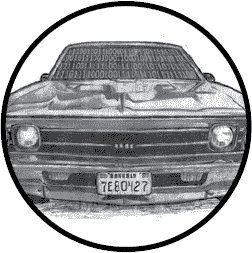
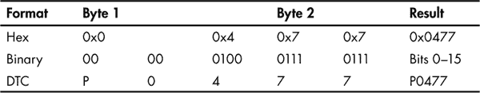
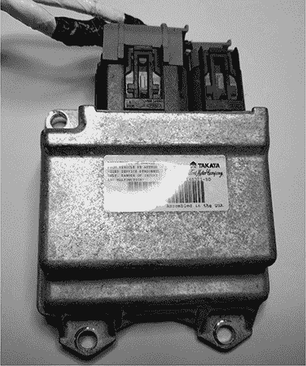

## **4**

**诊断与日志记录**



OBD-II 连接器主要供技师快速分析和排查车辆故障。（请参见《OBD-II 连接器》第 17 页了解如何定位 OBD 连接器。）当车辆出现故障时，它会保存与该故障相关的信息，并触发发动机警告灯，也称为*故障指示灯（MIL）*。这些常规的诊断检查由车辆的主 ECU（电子控制单元）——动力总成控制模块（PCM）处理，PCM 可能由多个 ECU 组成（但为了简化讨论，我们将其称为 PCM）。

如果在实验过程中触发故障，需要能够读写 PCM 才能清除故障代码。在本章中，我们将学习如何获取和清除诊断代码，以及如何查询 ECU 的诊断服务。我们还将学习如何访问车辆的碰撞数据记录以及如何强行破解隐藏的诊断代码。

### **诊断故障代码**

PCM 将故障代码存储为诊断故障代码（DTC）。DTC 存储在不同的地方。例如，基于内存的 DTC 存储在 PCM 的 RAM 中，这意味着当电池断电时，它们会被清除（就像所有存储在 RAM 中的 DTC 一样）。更严重的 DTC 则存储在能够在断电时保存的区域。

故障通常分为硬故障和软故障。软故障通常是间歇性问题，而硬故障则是无法自行消失，需要某种干预的故障。为了确定故障是硬故障还是软故障，技师通常会清除 DTCs（诊断故障代码），然后驾驶车辆看故障是否会重新出现。如果故障重新出现，则是硬故障。软故障可能是由于某些问题引起的，比如油箱盖松动。

并非所有故障都会立即触发 MIL 灯。具体来说，A 类故障（表示严重排放故障）会立即点亮 MIL 灯，而 B 类故障（不影响车辆排放系统的故障）在首次触发时会作为*待处理*故障存储。PCM 会等待记录多个相同的故障后才会触发 MIL 灯。C 类故障通常不会点亮 MIL 灯，而是触发“发动机即将维修”类型的信息。D 类故障则根本不会触发 MIL 灯。

当存储 DTC 时，PCM 会拍摄所有相关的发动机组件的快照，这些快照被称为*冻结帧数据*，通常包括如下信息：

• 涉及的 DTC

• 发动机负荷

• 发动机转速（RPM）

• 发动机温度

• 燃油修正

• 进气歧管压力/质量空气流量（MAP/MAF）值

• 操作模式（开环/闭环）

• 油门位置

• 车速

一些系统只存储一个冻结帧，通常是为首次触发的 DTC 或优先级最高的 DTC，而其他系统则会记录多个冻结帧。

在理想的情况下，这些快照应该在 DTC 发生时立刻捕捉到，但通常情况下，冻结帧会在 DTC 触发后的大约五秒钟才会记录下来。

#### ***DTC 格式***

DTC 是一个五字符的字母数字代码。例如，你会看到像 P0477（排气压力控制阀低）和 U0151（与约束控制模块失去通信）这样的代码。第一个字节位置的代码代表了设置该代码的组件的基本功能，如表 4-1 所示。

**表 4-1：** 诊断代码布局

| **字节位置** | **描述** |
| --- | --- |
| 1 | P (0x0) = 动力总成，B (0x1) = 车身，C (0x2) = 底盘，U (0x3) = 网络 |
| 2 | 0,2,3（SAE 标准）1,3（制造商特定） |
| 3 | 位置 1 的子组 |
| 4 | 具体故障区域 |
| 5 | 具体故障区域 |

**注意**

*当设置为 3 时，字节 2 既是一个 SAE 定义的标准，又是一个制造商特定的代码。最初，3 专门用于制造商，但现在正在推动将 3 标准化为标准代码。在现代汽车中，如果你在第二位置看到 3，它可能是一个 SAE 标准代码。*

DTC 中的五个字符在网络上传输时仅由两个原始字节表示。表 4-2 展示了如何将这两个 DTC 字节拆解成完整的 DTC 代码。

**表 4-2：** 诊断代码二进制拆解



除了前两个字符外，其余字符之间存在一一对应关系。请参见表 4-1，了解前两个比特是如何分配的。

你应该能够在线查找符合 SAE 标准的任何代码的含义。以下是一些常见动力总成 DTC 的示例范围：

• P0001–P0099：燃油和空气计量，辅助排放控制

• P0100–P0199：燃油和空气计量

• P0200–P0299：燃油和空气计量（喷油器电路）

• P0300–P0399：点火系统或失火

• P0400–P0499：辅助排放控制

• P0500–P0599：车辆速度控制和怠速控制系统

• P0600–P0699：计算机输出电路

• P0700–P0799：变速器

若想了解特定代码的含义，可以到你当地的汽车商店拿起一本 Chilton 系列的维修手册。在那里，你会找到你的车辆的所有 OBD-II 诊断代码列表。

#### ***使用扫描工具读取 DTC***

机械故障码通过扫描工具进行检查。扫描工具是很有用的，但并非车辆黑客必需的工具。你可以在任何汽车配件商店或者互联网上找到它们，价格在 100 美元到 3000 美元之间。

对于最便宜的解决方案，你可以在 eBay 上购买一个约 10 美元的 ELM327 设备。这些通常是需要额外软件（如移动应用程序）才能完全作为扫描工具使用的加密狗。软件通常是免费的或低于 5 美元。基础扫描工具应该能够探测车辆的故障系统并报告常见的非制造商特定 DTC 代码。高端工具应该有制造商特定的数据库，允许你进行更详细的测试。

#### ***擦除 DTCs***

一旦故障在与首次发现时相似的条件下不再出现，DTCs 通常会自动擦除。对于此目的，*相似*定义如下：

• 发动机转速与标记条件相差不超过 375 RPM

• 发动机负荷与标记条件相差不超过 10%

• 发动机温度相似

在正常情况下，一旦 PCM 在三次检查后不再检测到故障，MIL 指示灯会熄灭，DTCs 会被擦除。还有其他方法可以清除这些故障代码：你可以通过扫描工具（前一部分讨论过）或断开车辆电池来清除软性 DTCs。然而，永久性或硬性 DTCs 会存储在 NVRAM 中，只有当 PCM 不再检测到故障时才会被清除。原因很简单：防止修车工在问题仍然存在的情况下手动关闭 MIL 灯并清除 DTCs。永久性 DTCs 为修车工提供故障历史记录，使他们能更好地进行修复。

### **统一诊断服务**

*统一诊断服务 (UDS)* 旨在提供一种统一方式，让修车工能够了解车辆的状态，而无需支付昂贵的汽车制造商专有的 CAN 总线数据包布局许可费。

不幸的是，虽然 UDS 的设计目的是让车辆信息即使对普通修车工也能轻松获取，但现实情况却有所不同：CAN 数据包的发送方式相同，但内容因品牌、型号甚至年份而异。

汽车制造商向经销商出售关于数据包内容的许可证。实际上，UDS 只是作为一个网关，提供部分车辆信息，但并不是全部。UDS 系统并不会影响车辆的运行；它基本上只是一个只读的视图，用于查看车辆的状态。然而，利用 UDS 可以执行更高级的操作，如诊断测试或固件修改（这些测试通常只在高端扫描工具中提供）。此类诊断测试向系统发送请求执行某项操作，且该请求会生成信号，如其他 CAN 数据包，用于执行该操作。例如，诊断工具可能会发出解锁车门的请求，结果是该组件发送一个独立的 CAN 信号，实际完成解锁车门的工作。

#### ***通过 ISO-TP 和 CAN 发送数据***

由于 CAN 帧的数据量限制为 8 字节，UDS 使用 ISO-TP 协议通过 CAN 总线发送较大的数据输出。你仍然可以使用常规 CAN 读取或发送数据，但响应不会完整，因为 ISO-TP 允许多个 CAN 数据包串联。

要测试 ISO-TP，请连接到具有诊断功能模块的 CAN 网络，例如 ECU。然后使用 SocketCAN 的 `cansend` 应用程序通过正常的 CAN 发送设计用于 ISO-TP 的数据包：

```
$ cansend can0 7df#02010d
Replies similar to 7e8 03 41 0d 00
```

在这个列表中，`7df` 是 OBD 诊断代码，`02` 是数据包的大小，`01` 是模式（显示当前数据；有关常见模式和 PID 的列表，请参见附录 B），`0d` 是服务（由于车辆停放，车辆速度为 0）。响应会将 0x8 添加到 ID（`7e8`）；接下来的字节是响应的大小。然后，响应会将 0x40 添加到请求类型，这里的请求类型为 0x41。接着，服务会重复并跟随服务数据。ISO-TP 规定了如何响应 CAN 数据包。

普通的 CAN 数据包使用“无回执”结构，意味着它们只是发送数据，并且不等待返回数据包。ISO-TP 指定了一种接收响应数据的方法。由于这个响应数据不能使用相同的仲裁 ID 发送回去，接收方通过将 0x8 添加到 ID 来返回响应，并通过将 0x40 添加到请求中来标明这是一个正面响应。（如果响应失败，应该会看到 0x7F，而不是正面加 0x40 的响应。）

表 4-3 列出了最常见的错误响应。

**表 4-3:** 常见 UDS 错误响应

| **十六进制（第 4 字节）** | **缩写** | **描述** |
| --- | --- | --- |
| 10 | GR | 一般拒绝 |
| 11 | SNS | 不支持该服务 |
| 12 | SFNS | 子功能不支持 |
| 13 | IMLOIF | 消息长度不正确或格式无效 |
|  14  | RTL | 响应太长 |
| 21 | BRR | 忙碌的重复请求 |
| 22 | CNC | 条件不正确 |
| 24 | RSE | 请求顺序错误 |
| 25 | NRFSC | 子网组件无响应 |
| 26 | FPEORA | 失败阻止执行请求的操作 |
| 31 | ROOR | 请求超出范围 |
| 33 | SAD | 安全访问被拒绝 |
| 35 | IK | 无效的密钥 |
| 36 | ENOA | 超过尝试次数 |
| 37 | RTDNE | 所需的时间延迟尚未过期 |
| 38-4F | RBEDLSD | 由扩展数据链路安全文档保留 |
| 70 | UDNA | 不接受上传/下载 |
| 71 | TDS | 数据传输已暂停 |
| 72 | GPF | 一般编程失败 |
| 73 | WBSC | 错误的块序列计数器 |
| 78 | RCRRP | 请求已正确接收，但响应正在等待 |
| 7E | SFNSIAS | 活跃会话中不支持子功能 |
| 7F | SNSIAS | 活跃会话中不支持该服务 |

例如，如果你使用服务 0x11 来重置 ECU，而 ECU 不支持远程重置，你可能会看到如下流量：

```
$ cansend can0 7df#021101
Replies similar to 7e8 03 7F 11 11
```

在这个响应中，我们可以看到，在 0x7e8 后，接下来的字节是 0x03，表示响应的大小。下一个字节 0x7F，表示服务 0x11 的错误，即第三个字节。最后一个字节 0x11，表示返回的错误——在这种情况下，表示服务不支持（SNS）。

要发送或接收超过标准 CAN 包 8 字节的数据，使用 SocketCAN 的 ISO-TP 工具。在一个终端中运行 `istotpsend`，然后在另一个终端中运行 `isotpsniffer`（或 `isotprecv`）来查看对 `istotpsend` 命令的响应。（不要忘记按照第三章中所述的步骤，使用 `insmod` 加载你的 `can-isotp.ko` 模块。）

例如，在一个终端中，像这样设置一个嗅探器：

```
$ isotpsniffer -s 7df -d 7e8 can0
```

然后，在另一个终端中，通过命令行发送请求包：

```
$ echo "09 02" | isotpsend -s 7DF -d 7E8 can0
```

使用 ISO-TP 时，你需要指定源地址和目标地址（ID）。在 UDS 的情况下，源地址是 0x7df，目标（响应）地址是 0x7e8。（使用 ISO-TP 工具时，地址中的起始 0x 不需要指定。）

在这个示例中，我们发送一个包含 PID 0x02 和模式 0x09 的包，目的是请求车辆的 VIN。嗅探器中的响应应该显示车辆的 VIN，如输出的最后一行所示：

```
$ isotpsniffer -s 7df -d 7e8 can0
 can0  7DF  [2]  09 02  - '..'
 can0  7E8  [20]  49➊ 02➋ 01➌ 31 47 31 5A 54 35 33 38 32 36 46 31 30 39 31 34 39
     - 'I..1G1ZT53826F109149'
```

前 3 个字节组成 UDS 响应。0x49 ➊ 是服务 0x09 + 0x40，表示 PID 0x02 ➋ 的正响应，即下一个字节。第三个字节 0x01 ➌，表示返回的数据项数量（此例中为一个 VIN）。返回的 VIN 是 1G1ZT53826F109149。将此 VIN 输入 Google，你应该能看到关于这辆车的详细信息，这辆车来自于从废弃汽车中拆下的 ECU。表 4-4 显示了你应该看到的信息。

**表 4-4:** VIN 信息

| **车型** | **年份** | **品牌** | **车身** | **发动机** |
| --- | --- | --- | --- | --- |
| Malibu | 2006 | Chevrolet | 四门轿车 | 3.5L V6 OHV 12V |

如果你通过普通的 CAN 嗅探器监控这个 UDS 查询，你会看到多个响应包在 0x7e8 上。你可以手动或通过简单的脚本重新组装一个 ISO-TP 包，但 ISO-TP 工具使这变得更加简单。

**注意**

*如果你在运行 ISO-TP 工具时遇到困难，请确保你已正确编译并安装了适当的内核模块（参见“安装附加内核模块”第 42 页）。*

#### ***理解模式和 PID***

在诊断代码的数据部分，首字节是模式。在汽车手册中，模式以 $ 开头，如 $1。$ 表示数字是十六进制的。模式 $1 与 0x01 相同，$0A 与 0x0A 相同，依此类推。这里列出了一些示例，更多内容可以参考附录 B。

**0x01: 显示当前数据**

显示给定 PID 的数据流。发送 PID 0x00 会返回 4 字节的位编码可用 PID（0x01 到 0x20）。

**0x02: 显示冻结帧数据**

与 0x01 相同的 PID 值，只不过返回的数据来自冻结帧状态。

**0x03: 显示已存储的“确认”诊断故障代码**

与 “DTC 格式” 中提到的 DTC 匹配，见 第 52 页。

**0x04: 删除 DTC 并清除诊断历史**

清除 DTC 和冻结帧数据。

**0x07: 显示“待定”诊断代码**

显示曾经出现过但尚未确认的代码；状态待定。

**0x08: 控制车载组件/系统的操作**

允许技术员手动激活和停用系统执行器。系统执行器支持电子驱动操作并物理控制不同设备。这些代码不是标准的，因此常见的扫描工具在此模式下无法做很多事情。经销商的扫描工具有更多权限访问车辆内部，并且是黑客逆向工程的有趣目标。

**0x09: 请求车辆信息**

使用模式 0x09 可以提取多个数据。

**0x0a: 永久诊断码**

该模式提取通过模式 0x04 删除的 DTC。这些 DTC 只有在 PCM 验证故障条件不再存在后才会被清除（见 “删除 DTC” 第 54 页）。

#### ***强力破解诊断模式***

每个制造商都有自己的专有模式和 PID，通常可以通过查看“获取”的经销商软件或使用工具或强力破解来获得。强力破解最简单的方法是使用一个开源工具叫做 *CaringCaribou (CC)*，可以在 *[`github.com/CaringCaribou/caringcaribou`](https://github.com/CaringCaribou/caringcaribou)* 下载。

CaringCaribou 包含一组专为与 SocketCAN 一起使用的 Python 模块。其中一个模块是 DCM 模块，专门处理发现诊断服务。

要开始使用 CaringCaribou，请在您的主目录中创建一个 RC 文件，*~/.canrc.*

```
 [default]
interface = socketcan_ctypes
channel = can0
```

将您的通道设置为您的 SocketCAN 设备的通道。现在，为了发现您的车辆支持的诊断，运行以下命令：

```
$ ./cc.py dcm discovery
```

这将向每个仲裁 ID 发送测试器存在代码。一旦工具收到有效响应（0x40+服务）或错误响应（0x7f），它将打印仲裁 ID 和回复 ID。以下是使用 CaringCaribou 进行的示例发现会话：

```
-------------------
CARING CARIBOU v0.1
-------------------

Loaded module 'dcm'

Starting diagnostics service discovery
Sending diagnostics Tester Present to 0x0244
Found diagnostics at arbitration ID 0x0244, reply at 0x0644
```

我们看到有一个诊断服务响应 0x0244。太好了！接下来，我们探测 0x0244 上的不同服务：

```
$ ./cc.py dcm services 0x0244 0x0644

-------------------
CARING CARIBOU v0.1
-------------------

Loaded module 'dcm'

Starting DCM service discovery
Probing service 0xff (16 found)
Done!

Supported service 0x00: Unknown service
Supported service 0x10: DIAGNOSTIC_SESSION_CONTROL
Supported service 0x1a: Unknown service
Supported service 0x00: Unknown service
Supported service 0x23: READ_MEMORY_BY_ADDRESS
Supported service 0x27: SECURITY_ACCESS
Supported service 0x00: Unknown service
Supported service 0x34: REQUEST_DOWNLOAD
Supported service 0x3b: Unknown service
Supported service 0x00: Unknown service
Supported service 0x00: Unknown service
Supported service 0x00: Unknown service
Supported service 0xa5: Unknown service
Supported service 0xa9: Unknown service
Supported service 0xaa: Unknown service
Supported service 0xae: Unknown service
```

请注意，输出中列出了多个重复的服务 0x00。这通常是由于对非 UDS 服务的错误响应所致。例如，0x0A 以下的请求是旧模式，无法响应官方 UDS 协议。

**注意**

*截至目前，CaringCaribou 仍处于开发初期阶段，您的结果可能会有所不同。目前可用的版本没有考虑旧模式，并且错误地解析响应，这就是为什么您会看到几个服务的 ID 为 0x00。暂时忽略这些服务，它们是误报。CaringCaribou 的发现选项会在响应诊断会话控制（DSC）请求的第一个仲裁 ID 处停止扫描。您可以使用* `-min` *选项从上次扫描停止的地方重新启动扫描，方法如下：*

```
$ ./cc.py dcm discovery -min 0x245
```

在我们的示例中，扫描将在稍后停止扫描，停在这个更常见的诊断 ID：

```
Found diagnostics at arbitration ID 0x07df, reply at 0x07e8
```

#### ***保持车辆在诊断状态***

在进行某些类型的诊断操作时，保持车辆处于诊断状态非常重要，因为这可以减少中断的可能性，从而允许您执行需要几分钟的操作。为了保持车辆处于这种状态，您需要持续发送数据包，告知车辆有诊断技术人员在场。

这些简单的脚本将使车辆保持在诊断状态，这对于刷写 ROM 或暴力破解非常有用。测试者在场的数据包将车辆保持在诊断状态。它起到心跳的作用，因此您需要每一到两秒发送一次，如下所示：

```
#!/bin/sh
while :
do
    cansend can0 7df#013e
    sleep 1
done
```

您也可以使用 `cangen` 做同样的事情：

```
$ cangen -g 1000 -I 7DF -D 013E -L 2 can0
```

**注意**

*截至目前，* `cangen` *在串行线 CAN 设备上并不总是有效。一种可能的解决方法是告诉* `slcand` *使用 canX 风格的名称，而不是 slcanX。*

使用 `ReadDataByID` 命令通过 ID 读取数据并查询设备信息。0x01 是标准查询。增强版的 0x22 可以返回标准 OBD 工具无法获取的信息。

使用 `SecurityAccess` 命令（0x27）访问受保护信息。这可以是一个滚动密钥，意味着密码或密钥每次都会改变，但重要的是，如果成功，控制器会有响应。例如，如果您发送密钥 0x1，并且它是正确的访问码，那么您应该收到 0x2 的回应。某些操作，如刷写 ROM，将需要您发送 `SecurityAccess` 请求。如果您没有生成必要挑战响应的算法，您将需要暴力破解密钥。

### **事件数据记录器日志**

您可能知道飞机上有黑匣子，记录关于飞行的信息以及驾驶舱内和无线电传输中的对话。所有 2015 年及以后的车辆也被要求配备一种黑匣子，称为*事件数据记录器（EDR）*，但 EDR 仅记录飞机黑匣子记录的部分信息。EDR 存储的信息包括以下内容（您可以在 SAE J1698-2 中找到更完整的列表）：

• 安全气囊部署

• 刹车状态

• Delta-v（纵向速度变化）

• 点火周期

• 安全带状态

• 转向角度

• 油门位置

• 车辆速度

尽管这些数据与冻结帧数据非常相似，但其目的是在发生碰撞时收集和存储信息。EDR 会不断地存储信息，通常每次只存储大约 20 秒的数据。这些信息最初存储在车辆的气囊控制模块（ACM）中，但现代车辆将这些数据分布在车辆的 ECU 中。这些模块从其他 ECU 和传感器收集数据并将其存储，以便在碰撞后恢复。 图 4-1 显示了一个典型的 EDR。



*图 4-1：典型的事件数据记录器*

#### ***从 EDR 中读取数据***

读取 EDR 数据的官方方式是使用碰撞数据检索（CDR）工具包。基本的 CDR 工具将连接到 OBD 接口，并从主 ECU 获取数据（或对车辆进行成像）。CDR 工具还可以访问其他模块中的数据，例如 ACM 或翻滚传感器（ROS）模块，但通常需要直接插入这些设备，而不是通过 OBD 端口进行连接。（你可以在这里找到一份详细的清单，列出了哪些车辆可以检索到黑匣子数据： *[`www.crashdatagroup.com/research/vehiclecoverage.html`](http://www.crashdatagroup.com/research/vehiclecoverage.html)*。）

CDR 套件包括专有的硬件和软件。硬件通常的费用约为 2000 美元，软件的费用会根据你希望支持的车辆类型数量而有所不同。车辆碰撞数据的格式通常也被视为专有数据，许多制造商将通信协议授权给工具提供商，以制作 CDR。显然，这并不符合消费者的最佳利益。美国国家公路交通安全管理局（NHTSA）已提议采用标准的 OBD 通信方法来访问这些数据。

#### ***SAE J1698 标准***

SAE J1698 标准列出了事件数据收集的推荐做法，并通过采样率定义事件记录：高采样、低采样和静态采样。高采样是碰撞事件中记录的数据，低采样是碰撞前的数据，静态采样是不会改变的数据。许多车辆受 SAE J1698 的影响，但并不一定完全遵循其针对所有车辆数据的规则。

一些记录的元素包括：

• 巡航控制状态

• 驾驶员控制：驻车制动、前大灯、前雨刷、档位选择、乘客气囊禁用开关

• 最前座轨道位置

• 操作时长

• 指示灯状态：VEDI、SRS、PAD、TPMS、ENG、DOOR、IOD

• 纬度和经度

• 座位位置

• SRS 部署状态/时间

• 空气/车厢温度

• 车辆里程

• VIN

虽然 SAE J1698 标准中提到纬度和经度记录，许多制造商声称出于隐私原因不记录这些信息。你的研究结果可能会有所不同。

#### ***其他数据检索实践***

不是所有的制造商都遵守 SAE J1698 标准。例如，自 1990 年代以来，通用汽车在其车辆的感知与诊断模块（SDM）中收集了一小部分 EDR 数据。SDM 存储车辆的 Delta-v，即车辆速度的纵向变化。SDM 不会记录任何碰撞后的信息。

另一个例子是福特的 EDR，称为*约束控制模块（RCM）*。福特存储的是车辆的纵向和横向加速度数据，而不是 Delta-v。如果车辆具有电子油门控制，PCM 会存储额外的 EDR 数据，包括乘客是否为成年人、油门/刹车踏板的踩下百分比，以及事故发生时诊断代码是否处于激活状态。

### **自动碰撞通知系统**

*自动碰撞通知（ACN）系统* 是与制造商或第三方联系并提供事件信息的“电话回家”系统。这些系统与其他碰撞恢复系统相吻合，并通过与制造商或第三方联系来扩展功能。一个主要的区别是，没有规则或标准来确定 ACN 收集和发送的数据。ACN 是特定于每个制造商的，每个系统发送的信息都不同。例如，Veridian 自动碰撞通知系统（2001 年发布）报告以下信息：

• 碰撞类型（正面、侧面、后面）

• 日期和时间

• Delta-v

• 经度和纬度

• 车辆的品牌、型号和年份

• 主要受力方向

• 可能的乘员人数

• 翻车（是或否）

• 安全带使用情况

• 车辆的最终停放位置（正常、左侧、右侧、车顶）

### **恶意意图**

攻击者可能会针对车辆的 DTC 和冻结帧数据，以隐藏恶意活动。例如，如果某个漏洞需要利用一个短暂的、临时的条件来成功，车辆的冻结帧数据很可能会因为记录延迟而错过这一事件。捕获的冻结帧快照很少包含有助于确定 DTC 是否由恶意意图触发的信息。（因为黑匣子 EDR 系统通常只在发生碰撞时触发，攻击者不太可能会针对它们，因为它们不太可能包含有用的数据。）

攻击者在进行模糊测试时，可能会检查是否触发了 DTC，并利用 DTC 中包含的信息来确定受到影响的组件。此类攻击最有可能发生在攻击的研究阶段（当攻击者试图确定随机生成的数据包影响了哪些组件时），而不是在活跃的漏洞利用过程中。

访问和模糊测试厂商特定的 PID—通过刷写固件或使用模式 0x08—可能会产生有趣的结果。由于每个厂商的接口都保密，评估网络的实际风险变得非常困难。不幸的是，安全专家需要逆向或模糊测试这些专有接口，以确定哪些内容是暴露的，然后才能开展工作以确定是否存在漏洞。恶意行为者也需要做同样的事情，尽管他们不会愿意分享他们的发现。如果他们能够保密未记录的入口点和弱点，那么他们的漏洞利用将持续更长时间而不被发现。拥有进入车辆的秘密接口并不会增加安全性；这些漏洞无论人们是否允许讨论，都会存在。因为出售这些代码有利可图（有时高达 50,000 美元以上），所以该行业缺乏与社区合作的动力。

### **总结**

在本章中，您已经超越了传统的 CAN 数据包，理解了更复杂的协议，如 ISO-TP。您学习了如何将 CAN 数据包连接起来，以编写更大的消息或在 CAN 上创建双向通信。您还学习了如何读取和清除任何 DTC（诊断故障代码）。您了解了如何查找未记录的诊断服务，并查看了记录有关您及您驾驶习惯的数据类型。您还探讨了恶意方如何利用诊断服务的一些方法。
