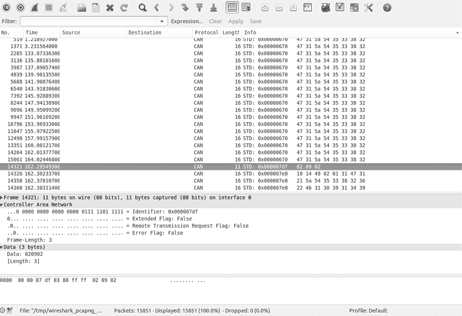
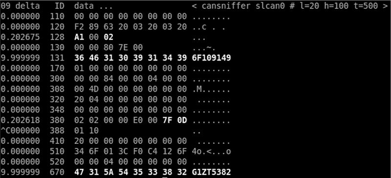
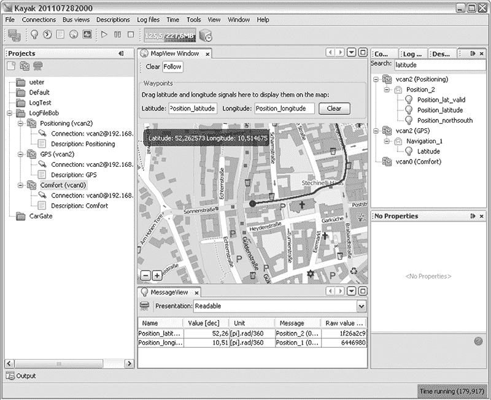
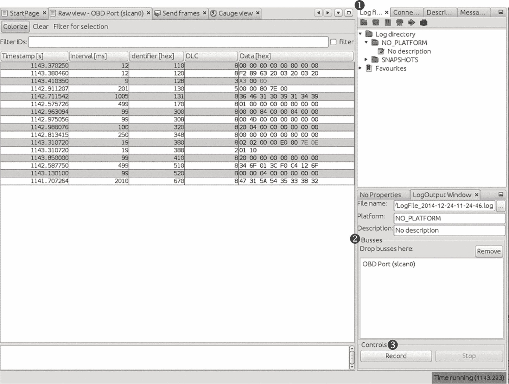
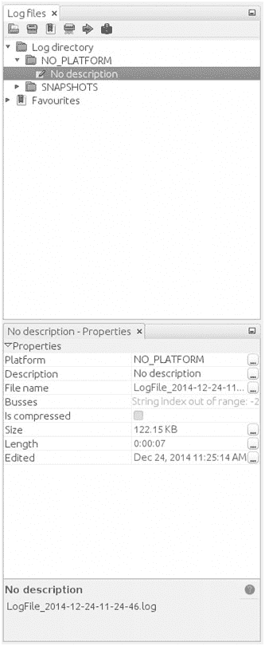
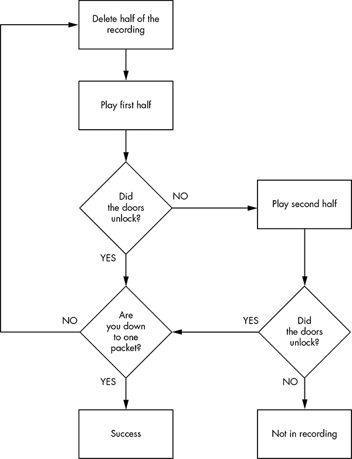
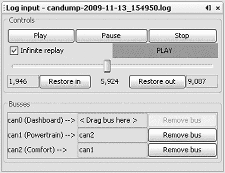
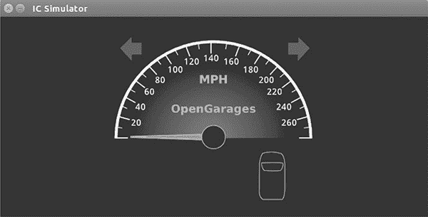
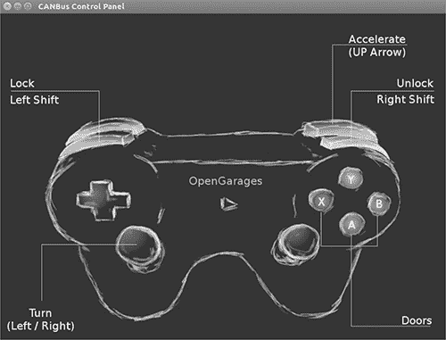
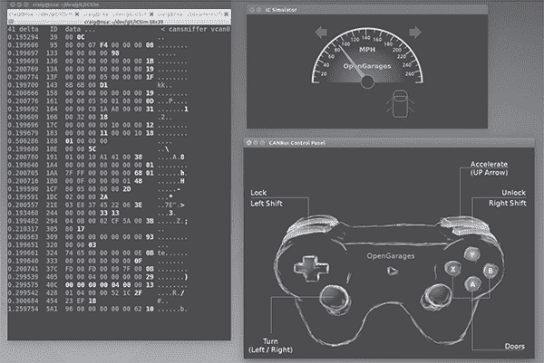

## **逆向工程 CAN 总线**


为了逆向工程 CAN 总线，我们首先必须能够读取 CAN 数据包并识别每个数据包的控制功能。也就是说，我们不需要访问官方的诊断 CAN 数据包，因为它们主要是只读的窗口。相反，我们感兴趣的是访问 *所有* 其他充斥在 CAN 总线上的数据包。其余的非诊断数据包才是汽车实际用来执行动作的。理解这些数据包所包含的信息可能需要很长时间，但这些知识对于理解汽车的行为至关重要。

### 定位 CAN 总线

当然，在我们逆向分析 CAN 总线之前，首先需要定位 CAN 总线。如果您可以访问 OBD-II 接口，车辆的接头针脚图应该能告诉您 CAN 总线的位置。（有关 OBD 接口和针脚图的常见位置，请参见第二章。）如果您无法访问 OBD-II 接口，或者正在寻找隐藏的 CAN 信号，请尝试以下方法：

• 寻找成对的扭绞线。CAN 总线通常由两根扭在一起的线组成。

• 使用万用表检查 2.5V 基准电压。（这可能很难识别，因为总线通常很嘈杂。）

• 使用万用表检查电阻值。CAN 总线在总线两端使用 120 欧姆的终端电阻，因此您怀疑是 CAN 的两根双绞线之间应该有 60 欧姆的电阻。

• 使用双通道示波器，并计算两个可疑 CAN 线之间的差值。您应该得到一个恒定的信号，因为差分信号应该会相互抵消。（差分信号的讨论请参见《CAN 总线》，第 16 页）。

**注意**

*如果汽车关闭，CAN 总线通常是静默的，但插入汽车钥匙或拉动车门把手这样简单的操作通常会唤醒汽车并生成信号。*

一旦您识别出 CAN 网络，下一步就是开始监控流量。

### 使用 can-utils 和 Wireshark 逆向分析 CAN 总线通信

首先，您需要确定总线上运行的通信类型。您通常需要识别某个特定的信号或某个组件的通信方式——例如，汽车是如何解锁的，或者传动系统是如何工作的。为此，找到目标组件使用的总线，然后逆向工程通过该总线传输的数据包，以识别它们的目的。

要监视 CAN 上的活动，你需要一个可以监视和生成 CAN 数据包的设备，比如在附录 A 中讨论的设备。市场上有*大量*这类设备。那些售价不到 20 美元的便宜 OBD-II 设备在技术上是可行的，但它们的嗅探器速度很慢，很多数据包会被遗漏。最好使用尽可能开放的设备，因为它们与大多数软件工具兼容——开源硬件和软件是理想的选择。然而，专门设计用来嗅探 CAN 的专有设备应该仍然有效。我们将使用 `candump`，来自 `can-utils` 套件，以及 Wireshark 来捕获和过滤数据包。

通用的数据包分析方法对 CAN 无效，因为 CAN 数据包是针对每个车辆的品牌和型号独特的。而且，由于 CAN 上的噪声很大，逐个分析每个按顺序流过的数据包也太繁琐了。

#### *使用 Wireshark*

Wireshark (*[`www.wireshark.org/`](https://www.wireshark.org/)*) 是一个常用的网络监控工具。如果你有网络方面的背景，你的第一反应可能是使用 Wireshark 来查看 CAN 数据包。技术上这是可行的，但我们很快就会看到，Wireshark 并不是这个任务的最佳工具。

如果你想使用 Wireshark 捕获 CAN 数据包，可以和 SocketCAN 一起使用。Wireshark 可以监听 canX 和 vcanX 设备，但不能监听 slcanX，因为串行链路设备不是标准的 netlink 设备，它们需要一个翻译守护进程才能工作。如果你需要在 Wireshark 中使用 slcanX 设备，尝试将名称从 *slcanX* 更改为 *canX*。（我在第二章中详细讨论了 CAN 接口。）

如果重命名接口不起作用，或者你只是需要将 CAN 数据包从 Wireshark 无法读取的接口移动到 Wireshark 可以读取的接口，你可以桥接这两个接口。你需要在桥接模式下使用 `candump`，来自 `can-utils` 软件包，将数据包从 `slcan0` 发送到 `vcan0`。

```
$ candump -b vcan0 slcan0
```

注意在 图 5-1 中，数据部分没有被解码，只显示原始的十六进制字节。这是因为 Wireshark 的解码器仅处理基本的 CAN 头，并不知道如何处理 ISO-TP 或 UDS 数据包。突出显示的数据包是一个 UDS 请求 VIN。（我已将屏幕中的数据包按标识符排序，而不是按时间排序，以便更容易阅读。）



*图 5-1：Wireshark 在 CAN 总线上的应用*

#### *使用 candump*

与 Wireshark 一样，`candump` 不会为你解码数据；这个任务留给你作为逆向工程师来完成。列表 5-1 使用 `slcan0` 作为嗅探设备。

```
$ candump slcan0
  slcan0➊  388➋  [2]➌  01 10➍
  slcan0   110   [8]    00 00 00 00 00 00 00 00
  slcan0   120   [8]    F2 89 63 20 03 20 03 20
  slcan0   320   [8]    20 04 00 00 00 00 00 00
  slcan0   128   [3]    A1 00 02
  slcan0   7DF   [3]    02 09 02
  slcan0   7E8   [8]    10 14 49 02 01 31 47 31
  slcan0   110   [8]    00 00 00 00 00 00 00 00
  slcan0   120   [8]    F2 89 63 20 03 20 03 20
  slcan0   410   [8]    20 00 00 00 00 00 00 00
  slcan0   128   [3]    A2 00 01
  slcan0   380   [8]    02 02 00 00 E0 00 7E 0E
  slcan0   388   [2]    01 10
  slcan0   128   [3]    A3 00 00
  slcan0   110   [8]    00 00 00 00 00 00 00 00
  slcan0   120   [8]    F2 89 63 20 03 20 03 20
  slcan0   520   [8]    00 00 04 00 00 00 00 00
  slcan0   128   [3]    A0 00 03
  slcan0   380   [8]    02 02 00 00 E0 00 7F 0D
  slcan0   388   [2]    01 10
  slcan0   110   [8]    00 00 00 00 00 00 00 00
  slcan0   120   [8]    F2 89 63 20 03 20 03 20
  slcan0   128   [3]    A1 00 02
  slcan0   110   [8]    00 00 00 00 00 00 00 00
  slcan0   120   [8]    F2 89 63 20 03 20 03 20
  slcan0   128   [3]    A2 00 01
  slcan0   380   [8]    02 02 00 00 E0 00 7C 00
```

*列表 5-1：通过 CAN 总线传输的流量的 `candump`*

这些列被拆分显示了嗅探设备 ➊、仲裁 ID ➋、CAN 数据包的大小 ➌，以及 CAN 数据本身 ➍。现在你已经有了一些捕获的数据包，但它们并不是最容易阅读的。我们将使用过滤器来帮助识别我们想要更详细分析的数据包。

#### *分组来自 CAN 总线的数据流*

CAN 网络上的设备噪声很大，通常在设定的间隔或由事件（例如解锁门）触发时产生脉冲。这种噪声使得没有过滤器的情况下从 CAN 网络流式传输数据变得徒劳。好的 CAN 嗅探软件会根据数据流中的仲裁 ID 对数据包的变化进行分组，只突出显示自上次看到该数据包以来发生变化的数据部分。通过这种方式分组数据包，可以更容易地发现直接由车辆操作引起的变化，允许您积极监控工具的嗅探部分，并观察与物理变化相关的颜色变化。例如，如果每次解锁门时，您在数据流中看到相同的字节变化，您就知道您可能已经识别出了至少控制门解锁功能的字节。

##### 使用 cansniffer 分组数据包

`cansniffer`命令行工具通过仲裁 ID 对数据包进行分组，并突出显示自上次嗅探器查看该 ID 以来发生变化的字节。例如，图 5-2 显示了在设备`slcan0`上运行`cansniffer`的结果。



*图 5-2:* `cansniffer` *示例输出*

您可以添加`-c`标志以对任何变化的字节进行着色。

```
$ cansniffer -c slcan0
```

`cansniffer`工具还可以移除不发生变化的重复 CAN 流量，从而减少您需要监视的数据包数量。

##### 过滤数据包显示

`cansniffer`的一个优点是您可以向它发送键盘输入，以便在终端中显示时过滤结果。（请注意，在`cansniffer`输出结果时，您不会看到您输入的命令。）例如，要在`cansniffer`收集数据包时仅查看 ID 301 和 308，请输入以下内容：

```
-000000
+301
+308
```

输入`-000000`会关闭所有数据包，而输入+`301`和+`308`则会过滤掉所有除了 ID 301 和 308 的其他数据包。

`-000000`命令使用了*位掩码*，它对仲裁 ID 进行逐位比较。掩码中使用的任何二进制值为 1 的位是必须为真的位，而二进制值为 0 的位则是通配符，可以匹配任何内容。全为 0 的位掩码告诉`cansniffer`匹配任何仲裁 ID。位掩码前面的减号（-）移除了所有匹配的位，即所有数据包。

您还可以使用过滤器和位掩码与`cansniffer`一起抓取一系列 ID。例如，以下命令将 ID 从 500 到 5FF 添加到显示中，其中 500 是应用于位掩码 700 的 ID，以定义我们感兴趣的范围。

```
+500700
```

要显示所有 5*XX*的 ID，您可以使用以下二进制表示：

```
ID  Binary Representation
500  101 0000 0000
700  111 0000 0000
------------------
     101 XXXX XXXX
      5    X    X
```

您可以指定 F00 代替 700，但由于仲裁 ID 仅由 3 个位组成，因此只需要一个 7。

使用 7FF 作为掩码与未指定 ID 的位掩码相同。例如：

```
+3017FF
```

与以下相同：

```
+301
```

该掩码使用二进制运算，并对两个数字 0x301 和 0x7FF 执行`与`运算：

ID    二进制表示

301   011  0000  0001

7FF   111  1111  1111

______________________________

011  0000  0001

3    0      1

对于不熟悉`AND`操作的人来说，每个二进制位都会被比较，如果*两个*都是 1，那么输出就是 1。例如，`1 AND 1 = 1`，而`1 AND 0 = 0`。

如果你更喜欢使用 GUI 界面，Kayak 是一个 CAN 总线监控应用程序，它也使用 socketcand，并将捕获的数据包显示为彩色。Kayak 不会像`cansniffer`那样删除重复的数据包，但它提供了一些命令行上无法轻松获得的独特功能，例如将识别的数据包记录为 XML（*.kcd*文件），这些文件可以被 Kayak 用于显示虚拟仪器集群和映射数据（参见图 5-3）。



*图 5-3：Kayak GUI 界面*

#### *使用记录和回放*

一旦你使用`cansniffer`或类似工具确定了需要关注的特定数据包，下一步就是记录和回放数据包，以便分析它们。我们将查看两种不同的工具来完成此操作：`can-utils`和 Kayak。它们具有类似的功能，选择工具将取决于你正在处理的工作内容和你的界面偏好。

`can-utils`套件使用简单的 ASCII 格式记录 CAN 数据包，你可以通过简单的文本编辑器查看它，大多数工具都支持这种格式的记录和回放。例如，你可以使用`candump`记录，重定向标准输出或使用命令行选项将数据记录到文件中，然后使用`canplayer`回放记录。

图 5-4 显示了 Kayak 与`cansniffer`等效的布局视图。



*图 5-4：Kayak 记录到日志文件*

要使用 Kayak 记录 CAN 数据包，首先点击日志文件选项卡中的播放按钮 ➊。然后将一个或多个总线从项目面板拖动到日志输出窗口选项卡的总线字段 ➋。按下日志输出窗口底部的记录和停止按钮 ➌ 来开始或停止记录。一旦数据包捕获完成，日志应显示在日志目录下拉菜单中（见图 5-5）。

如果你打开 Kayak 日志文件，你将看到类似于清单 5-2 中的代码片段。这个例子中的值不会直接与图 5-4 中的值一一对应，因为 GUI 按 ID 分组，类似于`cansniffer`，但日志是按顺序排列的，类似于`candump`。

```
PLATFORM NO_PLATFORM
DESCRIPTION "No description"
DEVICE_ALIAS OBD Port slcan0
(1094.141850)➊ slcan0➋  128#a20001➌
(1094.141863)  slcan0   380#02020000e0007e0e
(1094.141865)  slcan0   388#0110
(1094.144851)  slcan0   110#0000000000000000
(1094.144857)  slcan0   120#f289632003200320
```

*清单 5-2：Kayak 日志文件的内容*



*图 5-5：日志文件选项卡设置的右侧面板*

除了一些元数据（`PLATFORM`、`DESCRIPTION`和`DEVICE_ALIAS`），日志基本上与`can-utils`包捕获的日志相同：➊是时间戳，➋是总线，➌是通过`#`符号分隔的仲裁 ID 和数据。要播放捕获的数据，右键单击右侧面板中的**日志描述**，然后打开录制（参见图 5-5）。

清单 5-3 展示了使用`candump`和`-l`命令行选项创建的日志文件：

```
(1442245115.027238) slcan0 166#D0320018
(1442245115.028348) slcan0 158#0000000000000019
(1442245115.028370) slcan0 161#000005500108001C
(1442245115.028377) slcan0 191#010010A141000B
```

*清单 5-3：`candump`日志文件*

请注意，清单 5-3 中的`candump`日志文件与图 5-4 中 Kayak 展示的几乎完全相同。（有关不同`can-utils`程序的更多详情，请参见《CAN 工具套件》，见第 41 页。）

#### *创意数据包分析*

现在我们已经捕获了数据包，是时候确定每个数据包的作用了，这样我们就可以用它来解锁东西或利用 CAN 总线。让我们从一个简单的动作开始，这个动作最有可能只切换一个单一的比特——解锁车门的代码——并查看我们是否能找到控制该行为的数据包。

##### 使用 Kayak 查找解锁门控制

CAN 总线上有大量噪音，因此即使有一个好的嗅探器，找到单个比特的变化也可能非常困难。但这里有一个通用的方法来识别单个 CAN 数据包的功能：

1.  按下**录制**。

1.  执行物理操作，比如解锁车门。

1.  停止**录制**。

1.  按下**播放**。

1.  查看该操作是否被重复。例如，门是否解锁了？

如果按下播放没有解锁门，可能有几个地方出了问题。首先，你可能错过了录制中的动作，所以请尝试重新录制并执行该操作。如果你还是无法录制和回放该操作，消息可能是硬接入到物理锁按钮上的，通常情况下，驾驶员侧的门锁就是这样。尝试在录制时解锁乘客侧车门。如果这仍然无效，解锁动作的消息可能位于你正在监控的其他 CAN 总线上——你需要找到正确的总线——或者回放可能导致了冲突，导致数据包被覆盖。尝试多次回放录音，以确保回放正常工作。

一旦你有了执行所需操作的录音，使用图 5-6 中展示的方法，过滤噪音并定位用于通过 CAN 总线解锁车门的确切数据包和比特。

现在，继续将数据包捕获的大小减半，直到只剩一个数据包，此时你应该能够找出哪些比特位或字节用于解锁车门。最快的方法是打开你的嗅探器，并过滤掉你之前筛选出的仲裁 ID。解锁车门，变化的比特位或字节应该会被高亮显示。现在，尝试解锁汽车的后车门，观察字节的变化。你应该能够准确判断出解锁每个车门需要改变哪个比特位。



*图 5-6：解锁逆向流程示例*

##### 使用 can-utils 查找门解锁控制

为了通过 `can-utils` 来识别数据包，你可以使用 `candump` 来记录数据，并使用 `canplayer` 播放日志文件，正如前面所提到的。然后，使用文本编辑器缩减文件大小，再进行播放。缩减到只剩一个数据包时，你就可以通过 `cansend` 来帮助你确定哪个字节或哪些比特位控制了目标操作。例如，通过移除日志文件的不同部分，你可以找出触发门解锁的那个 ID：

```
slcan0  300   [8]  00 00 84 00 00 0F 00 00
```

现在，你可以编辑每个字节并重新播放该行，或者你可以使用 `cansniffer`，并使用 +300 作为过滤器，仅筛选出 300 的仲裁 ID，监视在你解锁车门时哪个字节发生了变化。例如，如果控制门解锁的字节是第六个字节—在前面的示例中是 0x0F—我们知道当第六个字节是 0x00 时，车门解锁；当它是 0x0F 时，车门锁定。

**注意**

*这是一个假设的示例，假定我们已经按照本章之前列出的所有步骤找到了这个特定的字节。具体细节会因每辆车而异。*

我们可以通过 `cansend` 来验证我们的发现：

```
$ cansend slcan0 300#00008400000F0000
```

如果发送此数据后，所有的门都锁上了，那么我们就成功地找到了控制门解锁的包。

现在，改变 0x0F 会发生什么呢？要找出答案，解锁汽车，这次发送 0x01：

```
$ cansend slcan0 300#0000840000010000
```

注意到只有驾驶员侧车门锁定，其余车门保持解锁。如果你重复这个过程并使用 0x02，那么只有前排乘客侧车门会锁定。当你再次使用 0x03 时，驾驶员侧车门和前排乘客侧车门都会锁定。但为什么 0x03 控制的是两扇车门，而不是其他第三扇车门呢？当你查看其二进制表示时，答案可能会更加清晰：

```
0x00 = 00000000
0x01 = 00000001
0x02 = 00000010
0x03 = 00000011
```

第一个比特代表驾驶员侧车门，第二个比特代表前排乘客侧车门。当比特为 1 时，车门锁定；当比特为 0 时，车门解锁。当你发送 0x0F 时，意味着你将所有可能影响车门锁定的比特位设置为二进制 1，从而锁定所有车门：

```
0x0F = 00001111
```

剩下的四个比特位怎么办？找出它们的作用的最佳方法就是将它们设置为 1，并监控车辆的变化。我们已经知道，至少部分 0x300 信号与车门相关，因此可以相对放心地假设其他四个比特也与车门相关。如果不是，它们可能控制不同的车门相关行为，例如打开行李厢。

**注意**

*如果在切换某个比特时没有得到响应，可能是该比特根本没有被使用，仅仅是被保留。*

#### *获取转速表读数*

获取转速表（即车辆速度）信息的方法与解锁车门相同。诊断代码报告车辆的速度，但无法设置速度如何显示（这岂不是更有趣？），因此我们需要找出车辆控制仪表盘（IC）读数的方式。

为了节省空间，转速值不会以读取值的十六进制形式显示；相反，值会进行移位，使得 1000 转速看起来像 0xFA0。这个值通常被称为“移位”，因为在代码中，开发人员使用位移操作来执行相当于乘法或除法的操作。对于 UDS 协议，实际的值如下：


更糟的是，你无法同时监控 CAN 流量并查询诊断转速以寻找变化的值。这是因为车辆通常使用专有的方法压缩转速值。尽管诊断值已经设定，但它们并不是车辆实际使用的数据包和数值，因此我们需要通过反向解析原始 CAN 数据包来找到实际值。（在做这项操作之前，一定要把车停在安全的位置，拉好手刹，最好将车抬起或者放在滚筒上，以防止车突然启动并将你压伤。）

按照你用于寻找解锁车门控制的步骤进行操作：

1.  按下**录制**。

1.  按下油门踏板。

1.  停止**录制**。

1.  按下**回放**。

1.  查看转速表指示是否有所移动。

在此测试过程中，你可能会发现许多引擎指示灯闪烁并且变得疯狂，因为这个数据包做的远不止解锁车门。忽略所有闪烁的警告灯，按照图 5-6 中的流程图找到导致转速表变化的仲裁 ID。这次发生碰撞的机会会比寻找解锁车门的比特时更大，因为涉及的内容更多。因此，你可能需要录制比之前更多的流量。（记住之前提到的数值转换，并且记住，这个仲裁 ID 中可能有多个字节控制报告的速度。）

##### 使用 Kayak 工具

为了简化操作，我们将使用 Kayak 的图形界面而不是 `can-utils` 来寻找控制转速表的仲裁 ID。同样，确保车辆固定在开阔地带，紧急刹车已拉起，最好将车辆升起或放在滚筒上。开始录制并给引擎加点油。然后停止录制并回放数据。转速表应有所移动；如果没有，可能是你连接到了错误的总线，需要按照本章前面的说明找到正确的总线。

一旦你从车辆获得预期的反应，重复使用找到车门解锁的二分法过程，并添加一些额外的 Kayak 选项。

Kayak 的回放界面允许你设置回放为无限循环，并且更重要的是，可以设置“输入”和“输出”数据包（见图 5-7）。滑动条表示捕获的数据包数量。使用滑动条可以选择回放时开始和停止的包。你可以通过滑动条快速跳转到录音的中间或其他部分，这使得回放一部分非常方便。



*图 5-7：Kayak 回放界面*

至于测试，你无法像解锁汽车时那样只发送一个数据包，因为车辆会不断报告其当前速度。为了克服这个噪声，你需要比正常通信更快地发送数据，以避免总是发生碰撞。例如，如果你在真实数据包播放之后立即播放你的数据包，那么最后看到的更新将是修改后的数据。减少总线上的噪声可以减少碰撞，并让演示更加干净。如果你能在真实数据包之后立即发送伪造的数据包，通常比单纯地洪水式发送数据包得到更好的结果。

要使用`can-utils`持续发送数据包，你可以使用一个带有`cansend`或`cangen`的`while`循环。（当使用 Kayak 的发送帧对话框发送数据包时，请确保选中间隔框。）

### 使用仪表盘模拟器创建背景噪声

仪表盘模拟器（ICSim）是 Open Garages 推出的最有用的工具之一，Open Garages 是一个促进机械师、性能调校师和安全研究人员之间开放合作的组织（见附录 A）。ICSim 是一个软件工具，旨在产生一些关键的 CAN 信号，以提供大量看似“正常”的背景 CAN 噪声——本质上，它是让你在不需要动你的车的情况下练习 CAN 总线逆向工程。（ICSim 仅限 Linux，因为它依赖于虚拟 CAN 设备。）你通过使用 ICSim 学到的方法可以直接应用到目标车辆上。ICSim 设计为一种安全的方式，让你熟悉 CAN 逆向工程，以便过渡到实际车辆时能够尽可能无缝。

#### *设置 ICSim*

从*[`github.com/zombieCraig/ICSim`](https://github.com/zombieCraig/ICSim)*获取 ICSim 的源代码，并按照下载的 README 文件中的说明编译软件。在运行 ICSim 之前，你应该在 README 中找到一个名为*setup_vcan.sh*的示例脚本，运行它来设置一个`vcan0`接口供 ICSim 使用。

ICSim 包括两个组件，`icsim`和`controls`，它们通过 CAN 总线互相通信。要使用 ICSim，首先将仪表盘加载到 vcan 设备，如下所示：

```
$ ./icsim vcan0
```

作为回应，你应该看到 ICSim 仪表盘，带有转向灯、速度表和一辆车的图片，这些会用于显示车门的锁定与解锁状态（见图 5-8）。



*图 5-8：ICSim 仪表盘*

`icsim`应用程序只监听 CAN 信号，因此当 ICSim 首次加载时，你不应该看到任何活动。为了控制模拟器，像这样加载 CANBus 控制面板：

```
$ ./controls vcan0
```

应该会出现如图 5-9 所示的 CANBus 控制面板。



*图 5-9：ICSim 控制界面*

屏幕看起来像一个游戏控制器；事实上，你可以插入一个 USB 游戏控制器，它应该被 ICSim 支持。（截至本文撰写时，你也可以使用`sixad`工具通过蓝牙连接 PS3 控制器。）你可以使用控制器以类似于使用游戏主机驾驶汽车的方式操作 ICSim，或者你可以通过按下键盘上的相应键来控制它（见图 5-9）。

**注意**

*控制面板加载后，你应该看到速度表在 0 mph 附近保持空闲。如果指针有些抖动，你就知道它在工作。控制应用程序仅向 CAN 总线写入数据，无法通过其他方式与`icsim`进行通信。控制虚拟汽车的唯一方式是通过 CAN。*

CANBus 控制面板的主要控制项如下：

**加速（上箭头）** 按下此键使得速度表加速。你按住键的时间越长，虚拟车辆行驶得越快。

**转向（左/右箭头）** 按住一个转向方向键以闪烁转向灯。

**锁定（左 SHIFT），解锁（右 SHIFT）** 这个操作需要你同时按下两个按钮。按住左 SHIFT 并按下一个按钮（A、B、X 或 Y）来锁定相应的车门。按住右 SHIFT 并按下一个按钮来解锁车门。如果按住左 SHIFT 然后按右 SHIFT，它将*解锁*所有车门。如果按住右 SHIFT 然后按左 SHIFT，它将*锁定*所有车门。

确保你可以将 ICSim 和 CANBus 控制面板放在同一屏幕上，以便你可以看到它们如何相互影响。然后，选择控制面板，确保它准备好接收输入。玩一下这些控制项，确保 ICSim 能正确响应。如果你没有看到控制项的响应，请确保选择并激活了 ICSim 控制窗口。

#### *在 ICSim 上读取 CAN 总线流量*

当你确认一切正常工作时，启动你选择的嗅探器并查看 CAN 总线流量，如图 5-10 所示。尝试识别哪些数据包控制着车辆，并创建脚本以在不使用控制面板的情况下控制 ICSim。

你在图 5-10 中看到的大部分数据变化是由真实 CAN 总线的回放文件引起的。你需要筛选这些消息，以确定正确的数据包。所有回放和数据包发送方法都可以与 ICSim 一起使用，因此你可以验证你的发现。



*图 5-10：使用 ICSim 的屏幕布局*

#### *改变 ICSim 的难度*

ICSim 的一个优点是，你可以通过让目标 CAN 流量更难找到来挑战自己。ICSim 支持四个难度级别——0 到 3，级别 1 为默认值。级别 0 是一个超级简单的 CAN 数据包，它执行预定的操作，没有任何背景噪音，而级别 3 会随机化数据包中的所有字节。要让模拟器选择不同的 ID 和目标字节位置，请使用 ICSim 的随机化选项：

```
$ ./icsim -r vcan0
Using CAN interface vcan0
Seed: 1419525427
```

该选项将一个随机种子值打印到控制台屏幕上。

将此值与选择的难度级别一起传入 CANBus 控制面板：

```
$ ./controls -s 1419525427 -l 3 vcan0
```

你也可以回放或分享一个特定的种子值。如果你找到一个喜欢的，或者想与朋友竞赛看谁先解码数据包，可以使用类似这样的固定种子值启动 ICSim：

```
$ ./icsim -s 1419525427 vcan0
```

接下来，使用相同的种子值启动 CANBus 控制面板，将随机控制面板与 ICSim 同步。如果种子值不相同，它们将无法进行通信。

第一次使用 ICSim 时，可能需要一些时间来找到正确的数据包，但经过几次操作后，你应该能够迅速识别出哪些数据包是你的目标。

尝试在 ICSim 中完成以下挑战：

1.  创建“危险信号灯”。使两个转向信号灯同时闪烁。

1.  创建一个命令，仅锁定后面两个车门。

1.  将速度表尽可能设置为 220 mph。

### 使用 OpenXC 反向工程 CAN 总线

根据你的车辆，反向工程 CAN 总线的一种解决方案是 OpenXC，这是一个开放的硬件和软件标准，能够将专有的 CAN 协议转换为易于阅读的格式。OpenXC 项目由福特汽车公司发起——目前，OpenXC 仅由福特支持——但它可以与任何支持该标准的汽车制造商兼容。（请访问 *[`openxcplatform.com/`](http://openxcplatform.com/)* 获取如何获取预制加密狗的信息。）

理想情况下，像 OpenXC 这样的 CAN 数据开放标准将消除许多应用程序需要反向工程 CAN 流量的需求。如果汽车行业其他公司能就一个定义如何工作标准达成一致，将极大地提升车主自己动手改装和开发创新工具的能力。

#### *翻译 CAN 总线消息*

如果车辆支持 OpenXC，你可以将车辆接口（VI）插入 CAN 总线，VI 应该能够翻译专有的 CAN 消息并将它们发送到你的电脑，这样你就可以读取支持的数据包，而无需进行逆向工程。从理论上讲，OpenXC 应该允许通过标准 API 访问任何 CAN 数据包。此访问可能是只读的，也可能允许你传输数据包。如果更多的汽车制造商最终支持 OpenXC，它可以为第三方工具提供比标准 UDS 诊断命令更原始的车辆访问权限。

**注意**

*OpenXC 支持 Python 和 Android，并包括如* `openxc-dump` *等工具，用于显示 CAN 活动。*

OpenXC 默认 API 的字段如下：

• `accelerator_pedal_position`

• `brake_pedal_status`

• `button_event`（通常是方向盘按钮）

• `door_status`

• `engine_speed`

• `fuel_consumed_since_last_restart`

• `fuel_level`

• `headlamp_status`

• `high_beam_status`

• `ignition_status`

• `latitude`

• `longitude`

• `odometer`

• `parking_brake_status`

• `steering_wheel_angle`

• `torque_at_transmission`

• `transmission_gear_position`

• `vehicle_speed`

• `windshield_wiper_status`

不同的车辆可能支持与这里列出的信号不同的信号，或者根本不支持任何信号。

OpenXC 还支持用于记录车辆行程的 JSON 跟踪输出。JSON 提供了一种通用的数据格式，便于大多数其他现代编程语言使用，如 列出 5-4 中所示。

```
{"metadata": {
    "version": "v3.0",
    "vehicle_interface_id": "7ABF",
    "vehicle": {
        "make": "Ford",
        "model": "Mustang",
        "trim": "V6 Premium",
        "year": 2013
    },
    "description": "highway drive to work",
    "driver_name": "TJ Giuli",
    "vehicle_id": "17N1039247929"
}
```

*列出 5-4：简单的 JSON 文件输出*

注意，JSON 中的元数据定义使得人类和编程语言都能相对容易地读取和解释。上述 JSON 列表是一个定义文件，所以 API 请求会更小。例如，当请求字段 `steering_wheel_angle` 时，转换后的 CAN 数据包将如下所示：

```
{"timestamp": 1385133351.285525, "name": "steering_wheel_angle", "value": 45}
```

你可以像这样通过 OBD 接口与 OpenXC 进行交互：

```
$ openxc-diag –message-id 0x7df –mode 0x3
```

#### *写入 CAN 总线*

如果你想将数据写回总线，你*可能*可以使用如下的行，将方向盘角度写回车辆，但你会发现设备只会重新发送少量消息到 CAN 总线。

```
$ openxc-control write –name steering_wheel_angle –value 42.0
```

从技术上讲，OpenXC 也支持原始的 CAN 写入，如下所示：

```
$ openxc-control write –bus 1 –id 42 –data 0x1234
```

这将我们从已翻译的 JSON 数据带回到原始的 CAN 黑客技术，正如本章前面所述。如果你想编写一个应用程序或嵌入式图形界面，只读取并响应你的车辆信息，并且你拥有一辆新款福特车，那么这可能是实现这些目标的最快途径。

#### *黑客 OpenXC*

如果你已经完成了 CAN 信号的逆向工程工作，你甚至可以制作自己的 VI OpenXC 固件。编译你自己的固件意味着你没有任何限制，所以你可以随心所欲地读取和写入数据，甚至可以创建“未支持”的信号。例如，你可以创建一个 `remote_engine_start` 信号，并将其添加到自己的固件中，从而提供一个简单的接口来启动你的车。太棒了，开源！

考虑一个表示`engine_speed`的信号。列表 5-5 将设置一个基本配置来输出`engine_speed`信号。我们将发送一个 2 字节长、消息 ID 为 0x110 的 RPM 数据，从第二个字节开始。

```
{  "name" : "Test Bench",
     "buses": {
        "hs": {
            "controller": 1,
            "speed": 500000
        }
   },
    "messages": {
       "0x110": {
          "name": "Acceleration",
          "bus", "hs",
          "signals": {
             "engine_speed_signal": {
                "generic_name": "engine_speed",
                "bit_position": 8,
                "bit_size": 16
             }
          }
       }
   }
}
```

*列表 5-5：定义`engine_speed`的简单 OpenXC 配置文件*

你想要修改的 OpenXC 配置文件存储在 JSON 中。首先，我们通过使用文本编辑器创建一个 JSON 文件来定义总线。在示例中，我们为一个在 500Kbps 运行的高速总线上的信号创建一个 JSON 配置。

一旦你定义了 JSON 配置文件，就可以使用以下代码将其编译成一个 CPP 文件，进而编译成固件：

```
$ openxc-generate-firmware-code –message-set ./test-bench.json > signals.cpp
```

然后，使用以下命令重新编译 VI 固件：

```
$ fab reference build
```

如果一切顺利，你应该会得到一个*.bin*文件，可以上传到你的 OpenXC 兼容设备。默认总线设置为原始读/写模式，默认情况下将固件设置为警告性的只读模式，除非信号或整个总线被设置为支持写入。要设置这些，当定义总线时，你可以添加`raw_can_mode`或`raw_writable`并将其设置为 true。

通过为 OpenXC 制作自己的配置文件，你可以绕过预发布固件中设置的限制，并支持除福特外的其他车辆。理想情况下，其他制造商会开始支持 OpenXC，但采用进展缓慢，而且总线限制非常严格，你可能还是希望使用自定义固件。

### CAN 总线模糊测试

对 CAN 总线进行模糊测试是发现未记录的诊断方法或功能的好方法。模糊测试采取随机的、类似散弹枪的反向工程方法。在进行*模糊测试*时，你会向输入发送随机数据并观察是否有意外的行为，对于车辆来说，这可能是物理变化，比如 IC 消息，或者组件崩溃，比如关闭或重启。

好消息是，制作一个 CAN 模糊测试器很容易。坏消息是，它很少有用。有效的数据包通常是用于引发特定变化的数据包集合的一部分，比如一个诊断服务，只有在成功传递安全令牌之后才会激活，因此很难在模糊测试时判断应该集中在哪个数据包上。此外，一些 CAN 数据包只有在移动的车辆内才可见，这会非常危险。尽管如此，不要排除将模糊测试作为潜在攻击方法，因为有时你可以用它来找到未记录的服务或导致目标组件崩溃的漏洞。

一些嗅探器直接支持模糊测试——这一特性通常出现在传输部分，表现为工具能够传输数据部分字节递增的数据包。例如，在 SocketCAN 的情况下，你可以使用`cangen`来生成随机的 CAN 流量。其他一些开源 CAN 嗅探解决方案也允许使用 Python 等语言进行轻松的脚本编写或编程。

一个很好的模糊测试起点是查看 UDS 命令，特别是“未记录”的制造商命令。在进行未记录的 UDS 模式模糊测试时，我们通常会寻找来自未知模式的任何响应。例如，当针对 ECU 的 UDS 诊断时，你可能会向 ID 0x7DF 发送随机数据，并从一个意外模式收到错误数据包。然而，如果你使用像 CaringCaribou 这样的暴力破解工具，通常会有更简洁的方法来实现相同的目标，比如监控或逆向诊断工具本身。

### 问题解决指南

CAN 总线及其组件具有容错能力，这限制了逆向 CAN 总线时可能造成的损坏。然而，如果你正在对 CAN 总线进行模糊测试或在实时 CAN 总线网络中重播大量 CAN 数据，问题可能会出现。以下是一些常见问题及其解决方法。

**IC 灯闪烁**

在向 CAN 总线发送数据包时，IC 灯闪烁是很常见的，通常可以通过重启车辆来重置这些灯。如果重启车辆后问题仍未解决，尝试断开并重新连接电池。如果这样仍无法解决问题，确保电池充足电量，因为电池电量低也可能导致 IC 灯闪烁。

**汽车无法启动**

如果汽车关闭后无法重新启动，通常是因为你在汽车未完全运行的情况下与 CAN 总线进行操作，这样会快速消耗电池。为了重新启动，可以使用备用电池启动车辆。

如果你已经尝试使用跳线启动，但汽车仍无法启动，可能需要拔掉一个保险丝并重新插回去以重新启动汽车。查找汽车手册中的发动机保险丝，首先拔掉你最怀疑的保险丝。保险丝可能没有熔断，因此只需拔出并重新插回去，强制相关设备重新启动。你选择拔掉的保险丝将取决于你的汽车类型，但如果发动机无法启动，你将需要找到主要部件来断开并检查。寻找主要电子设备周围的保险丝。控制前大灯的保险丝可能不是罪魁祸首。通过排除法找出导致问题的设备。

**汽车无法关闭**

你可能会发现无法关闭汽车。这是一个糟糕但幸运的罕见情况。首先，检查你是否在向 CAN 总线发送大量流量；如果是，停止并断开与 CAN 总线的连接。如果你已经与 CAN 总线断开连接，且汽车仍无法关闭，你需要开始拔掉保险丝，直到汽车能关闭为止。

**车辆反应失控**

这只有在你在行驶中的车辆上注入数据包时才会发生，这是一个非常糟糕的主意，绝对不应这样做！如果你必须在车辆行驶时进行审计，应该将其抬离地面或放在滚筒上。

**砖化**

逆向工程 CAN 总线绝不应导致“砖化”——即将车辆彻底损坏，以至于无法使用。要让车辆“砖化”，你需要修改固件，这样做会使车辆或组件失去保修，并且是自担风险。

### 总结

在本章中，你学习了如何从仪表板下方杂乱的电缆中识别出 CAN 总线电缆，以及如何使用像`cansniffer`和 Kayak 这样的工具嗅探流量并识别不同数据包的作用。你还学习了如何将 CAN 流量分组，以便比使用传统的数据包嗅探工具（如 Wireshark）时更容易识别更改。

现在你应该能够查看 CAN 流量并识别变化的数据包。一旦识别出这些数据包，你可以编写程序来传输它们，创建 Kayak 文件来定义它们，或者为 OpenXC 创建翻译器，方便使用加密狗与车辆进行交互。现在，你已经具备了识别和控制运行在 CAN 总线上的车辆组件所需的所有工具。
