## 6

**ECU 黑客攻击**

*由 Dave Blundell 撰写*


一辆车通常有十多个电子控制器，其中许多通过网络互相通信。这些计算机化设备有很多不同的名称，包括*电子控制单元*（ECU）、*发动机控制单元（ECU）*、*变速器控制单元（TCU）*，或*变速器控制模块（TCM）*。

虽然这些术语在正式场合中有特定的含义，但在实际操作中，相似的术语往往是互换使用的。对某一制造商来说可能是 TCU，对另一家制造商来说是 TCM，但这两个电子控制器执行的功能相同或极为相似。

大多数汽车控制模块都有防止你更改其代码和操作的措施，这些措施从非常强到极其薄弱不等。你无法知道你正在处理的具体系统，直到你对某一系统进行调查。在本章中，我们将更详细地探讨特定的安全机制，但首先我们将研究如何获取这些系统的访问权限。然后，在第八章中，我们将讨论一些更具体的 ECU 黑客攻击，如故障攻击和调试。ECU 的攻击路径分为三种不同的类别：

**前门攻击** 控制原始设备制造商（OEM）的访问机制

**后门攻击** 应用更传统的硬件黑客方法

**漏洞** 发现意外的访问机制

我们将首先概述这些攻击类别，然后分析你发现的数据。值得记住的是，虽然 ECU 和其他控制模块的黑客攻击目标通常是相同的——获取访问权限以重新编程并改变行为——但不太可能会有一个“万能钥匙”适用于所有控制器。然而，OEM（原始设备制造商）通常缺乏创意，很少改变其方法，因此对一个控制器的见解往往适用于同一制造商的类似型号。另外，今天很少有汽车制造商从零开始开发自己的汽车计算机，通常是从第三方如电装（Denso）、博世（Bosch）、大陆（Continental）等公司获得预制解决方案。由于这种设计方法，来自不同汽车制造商的车辆使用相似的计算机系统通常源自相同的供应商。

### 前门攻击

OBD-II 标准要求你能够通过 OBD-II 连接器重新编程车辆，而反向工程原始编程方法是一个确保有效的攻击路径。我们将以 J2534 和 KWP2000 为例，探讨常见的编程协议。

#### *J2534：标准化车辆通信 API*

SAE J2534-1 标准，简称 *J2534*，旨在通过使用 J2534 API，促进数字工具供应商之间的互操作性，该 API 概述了微软 Windows 与车辆通信的推荐方式。（你可以从 SAE 购买 J2534 API，链接地址为 *[`standards.sae.org/j2534/1_200412/`](http://standards.sae.org/j2534/1_200412/)*。）在 J2534 标准被采纳之前，每个软件供应商都会创建自己的专有硬件和驱动程序与车辆通信，从而进行计算机化修理。由于这些专有工具并不总是可以供小型车行使用，美国环保署（EPA）在 2004 年要求采用 J2534 标准，以便独立维修店也能使用与经销商相同的专用计算机工具。J2534 引入了一系列 DLL 文件，将标准的 API 调用映射到与车辆通信所需的指令，从而允许多个制造商发布与 J2534 兼容硬件配合使用的软件。

#### *使用 J2534 工具*

J2534 工具提供了一种方便的方式来观察 OEM 工具与车辆计算机的互动。制造商通常利用 J2534 更新计算机固件，有时还提供强大的诊断软件。通过观察和捕获使用 J2534 与车辆交换的信息，你可以看到 OEM 如何执行某些任务，这可能为你提供解锁“前门”所需的信息。

使用 J2534 工具攻击车辆系统时，基本思路是观察、记录、分析并扩展功能。当然，第一步是获取并配置 J2534 应用程序及其对应的接口硬件，以便执行你想要观察的任务。一旦设置完成，下一步是观察并记录与目标的通信，同时使用 J2534 工具对目标执行操作，比如更新配置参数。

观察 J2534 事务的主要方式有两种：一种是通过在 PC 上使用 J2534 shim DLL 观察 J2534 API 调用，另一种是通过使用单独的嗅探工具观察实际的总线流量以捕获数据。

J2534 工具是窃听工厂嵌入式车辆系统协议的关键，它们是攻击前门的主要方式之一。成功分析这些通信将使你掌握像 OEM（原始设备制造商）一样访问车辆系统的知识。它还将使你能够编写具有完全访问权限的应用程序，读取和重新编程系统，进而使你能够直接与车辆通信，而无需使用 J2534 接口或 OEM 的 J2534 软件。

##### J2534 Shim DLLs

J2534 shim 是一个软件 J2534 接口，它连接到物理 J2534 接口，然后传递并记录它收到的所有命令。这个虚拟接口是一种中间人攻击，允许你记录 J2534 应用程序与目标之间的所有 API 调用。然后，你可以检查命令日志，以确定 J2534 接口和设备之间实际交换的数据。

要找到一个开源的 J2534 shim，可以在* code.google.com *上搜索 *J2534-logger*。你也应该能够找到预编译的二进制文件。

##### J2534 与嗅探器

你也可以使用 J2534 生成有趣的流量，然后使用第三方嗅探器观察和记录。这没有什么神奇的：这只是一个优秀的例子，展示了如何生成可能难以捕获的有用数据包。 （有关监控网络流量的更多信息，请参见第五章。）

#### *KWP2000 和其他早期协议*

在 J2534 之前，已经有许多可闪存编程的 ECU 和其他控制单元，例如关键词协议 2000（KWP2000 或 ISO14230）。从 OSI 网络的角度来看，它主要是一种应用协议。它可以在 CAN 或 ISO9141 之上作为物理层使用。你会发现大量支持 KWP2000 协议的闪存工具，它们通过串行/USB 串行接口与 PC 进行通信，并支持使用此协议进行诊断和刷新，只需在线搜索即可找到。 （有关关键词协议 2000 的更多信息，请参见第二章。）

#### *利用前门方法：种子-密钥算法*

现在我们已经讨论了合法工具如何使用前门，是时候利用这一攻击向量，学习如何操作比喻中的“门锁”了。为了做到这一点，我们必须理解嵌入式控制器用来验证合法用户的算法；这几乎总是种子-密钥算法。种子-密钥算法通常会生成一个伪随机的*种子*，并期望在允许访问之前针对每个种子提供一个特定的响应或*密钥*。一个典型的有效交换可能是这样的：

```
ECU seed: 01 C3 45 22 84
Tool key: 02 3C 54 22 48
```

或者这样：

```
ECU seed: 04 57
Tool key: 05 58
```

不幸的是，没有标准的种子-密钥算法。你可能会遇到 16 位种子和 16 位密钥、32 位种子和 16 位密钥，或者 32 位种子和 32 位密钥。生成密钥的算法因平台而异。大多数算法是简单算术运算和一个或多个用于计算的值的组合。有几种方法可以搞清楚这些算法，从而为你提供对 ECU 的访问权限：

• 通过其他方式获取设备的固件。对其进行反汇编并分析嵌入式代码，以找出负责生成种子-密钥对的代码。

• 获取一个合法的软件工具——例如，J2534 重编程软件——它能够生成合法的种子密钥对，并使用反汇编工具分析 PC 应用程序代码，以确定使用的算法。

• 观察一个合法工具交换密钥，并分析这些密钥对的模式。

• 创建一个设备，欺骗合法工具反复提供响应。这种方法相较于纯粹的被动观察的主要优势在于，它可以让你选择种子，从而重现密钥。

你可以在*[`pcmhacking.net/forums/viewtopic.php?f=4&t=1566&start=10`](http://pcmhacking.net/forums/viewtopic.php?f=4&t=1566&start=10)*找到有关通用汽车逆向工程种子密钥算法的更多信息，在*[`nefariousmotorsports.com/forum/index.php?topic=4983.0`](http://nefariousmotorsports.com/forum/index.php?topic=4983.0)*找到有关 VAG MED9.1 的更多信息。

### 后门攻击

有时，正面攻击可能过于复杂；你可能没有合适的工具，或者锁太难破解。不必绝望——记住，汽车控制模块是嵌入式系统，所以你可以使用所有常见的硬件黑客方法。事实上，相比于尝试逆向工程厂商设置的正面锁，使用更直接的硬件后门方法往往更有意义，尤其是在尝试重新编程引擎模块时。如果你能获取到模块的转储数据，通常可以进行反汇编并分析，从而搞清楚正面锁的密钥如何工作。硬件后门攻击的第一步是分析电路板。

在逆向任何系统的电路板时，应该从最大的芯片开始。因为这些较大的处理器和内存芯片可能是最复杂的。建议列出零件号，利用 Google、*[datasheet.com](http://datasheet.com)*或类似网站，获取数据手册。有时，你可能会遇到定制的应用特定集成电路（ASIC）和独立芯片，特别是在较旧的 ECU 中，这些芯片会比常规零件更难处理。在很多情况下，你需要根据这些部件与可识别部件的连接方式，推测它们的功能。

关键是要注意内存芯片——SRAM、EEPROM、FlashROM、一次性可编程 ROM、串行 EEPROM、串行 Flash、NVSRAM 等。不同平台使用的内存类型差异极大；这里列出的每一种类型的内存芯片都有可能在实际应用中遇到。较新的设计较少使用并行内存，更倾向于使用串行芯片。较新的微控制器很少使用外部内存，因为它们的内部 Flash 存储容量已经大幅增加。任何存在的非易失性内存芯片都可以从电路板上拆卸下来，读取后再替换。第八章会详细讲解如何逆向电路板。

### 漏洞

尽管可以说这只是另一种反向门的例子，但利用工具值得特别关注。与拆解计算机不同，利用工具是通过向系统提供精心设计的输入，使其执行超出正常操作范围的动作。通常，利用工具是基于漏洞或问题构建的。这个漏洞可能导致系统崩溃、重启，或从车辆用户的角度来看，执行一些不希望发生的行为。某些漏洞为缓冲区溢出攻击提供了机会，这使得仅通过向设备输入意外的输入就能控制它。巧妙设计的一组输入触发漏洞，进而使设备执行攻击者提供的任意代码，而不是触发通常的故障条件。

然而，并不是所有的漏洞都能转化为利用工具——有些漏洞只会导致问题或关闭核心系统。虽然漏洞通常是偶然发现的，但大多数利用工具需要精心制作。没有系统的先验知识，你不太可能将已知漏洞转化为利用工具，这些知识通常来自于固件分析。最起码，你需要对体系结构有基本了解，才能编写必要的代码。大多数情况下，这些知识需要在编写利用工具之前通过研究收集。

寻找合适的攻击向量的漏洞很难，编写利用工具同样困难，因此基于漏洞的利用工具相对少见。虽然低估利用工具的重要性是愚蠢的，但在第八章和这里介绍的其他方法在大多数情况下是理解和重新编程汽车系统的更实际途径。

### 汽车固件逆向

黑客攻击汽车控制模块，足够深入以提取其当前固件和配置，实际上只是冒险的开始。在这个阶段，你可能拥有从 4KB 到 4MB 的原始机器可用代码，其中混合了各种参数和实际代码，这些代码构成了处理器将运行的程序。假设你在本章或本书后续章节的某个黑客攻击中获得了固件中的一个二进制块。接下来，你需要反汇编该二进制文件。

首先，你必须知道这个二进制文件适用于哪个芯片。互联网上有一些免费的反编译器，支持不同的芯片。否则，你可以花钱购买 IDA Pro，它支持多种芯片。这些工具会将二进制文件中的十六进制值转换为汇编指令。下一步是弄清楚你到底在看什么。

当你开始分析原始数据时，对你逆向工程的设备功能有一个高层次的理解是非常重要的，这将帮助你知道该寻找什么。你可以首先跟踪一些*线索*，这些线索几乎肯定会引导你找到有趣和有用的材料。接下来，我们将查看一些具体的示例，了解如何使用常见的汽车控制器功能来洞察它们的工作原理，这样我们可能就能改变它们的行为。

#### *自诊断系统*

每个发动机控制器都有某种类型的自诊断系统，通常会监控大多数关键的发动机功能，分析这些内容是理解固件的绝佳途径。调查拆解的一个好起点是确定这些程序的位置。这将使你深入了解与所有传感器和检查错误的功能相关的内存位置。任何现代车辆都应该支持 OBD-II 数据包，这些数据包标准化了报告的诊断数据。即使是 OBD-II 标准之前制造的控制器也有报告故障的方式。有些控制器有一个系统，通过将模拟输入短接到地面，并通过内部 LED 或“检查引擎”灯闪烁显示代码。例如，知道代码 10 表示进气温度传感器故障，就意味着你可以找到设置错误代码 10 的代码片段，帮助你识别与进气温度传感器相关的内部变量。

如需了解更多关于诊断的详细信息，请参见第四章。

#### *库函数*

改变控制单元行为通常是逆向工程 ECU 固件的主要目标之一，识别控制器使用的数据是该过程中的一个重要步骤。大多数 ECU 都有一组库函数，用于代码中的常规任务。用于表查找的库函数值得在逆向工程过程中尽早识别，因为这些函数可以直接指向你感兴趣的参数。每次使用表时，都会调用一个函数来获取结果。调用此类函数的频率很高，因此很容易识别。

通常，ECU 中存储的每种数据——一维字节数组；二维字数组；三维无符号、带符号和浮点短整型数组；等等——都有一个独特的引用函数。调用时，每个表查找程序至少需要传入表的索引（或起始地址）和轴变量。通常，表查找程序可以重用，传递关于表结构的信息，例如表中有多少行和列。

校准数据通常存储在程序存储器中，并且有访问这些数据的例程。微控制器通常有特殊的指令来访问程序存储器，这些指令提供了独特的签名，便于查找并使表格查找例程特别容易被发现。这些查找例程的一个次要特征是，它们往往包含大量的插值数学。此外，表格查找例程通常在程序存储器中紧密地分布在一起，使得在找到一个例程后，查找其他例程变得更加容易。在识别出参考例程后，搜索所有对它们的调用可以为识别控制器用来做出决策的绝大多数数据提供关键。传递给这些函数的参数通常包括表格的起始地址、表格的结构或形状，以及用于索引表格元素的变量。有了这些信息，你就离改变控制器的行为更近了一步。

##### 寻找已知表格

识别表格的一种方法是利用车辆传感器的特定物理和电气特性，这些特性将在 ECU 固件中显示出可识别的特征。例如，带有 MAF 传感器的 ECU 会有一个表格，将 MAF 的原始电压或频率读数转化为进入发动机的气流量，从而提供内部表示。

幸运的是，MAF 输出信号由物理学决定——也就是金氏定律——因此曲线将始终具有特征形状，尽管每个传感器的形状略有不同。这将导致表格具有一组可观察到的特征值，可以在 ROM 中查看。了解这些数据是普遍存在的，接下来我们来仔细看看不同程序中如何显示校准数据。

图 6-1 和 图 6-2 展示了形状相似的福特和日产传感器曲线；它们所展示的相似性扩展到多个制造商。

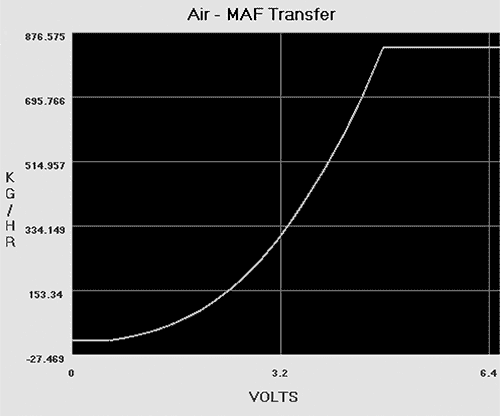

*图 6-1：福特 MAF 转换图*

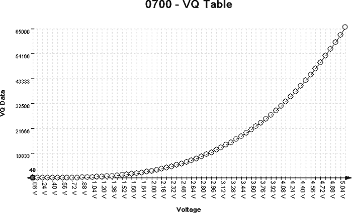

*图 6-2：日产 MAF VQ 图*

图 6-2 到 图 6-6 展示了同一数据的五种不同视图。图 6-3 展示了在十六进制编辑器中，图 6-2 中所示的 VQ 曲线会是什么样子。

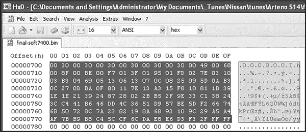

*图 6-3：HxD 十六进制编辑器中的 VQ 表格：128 字节或 64 到 16 位字*

图 6-4 和 6-5 显示了在 *[`github.com/blundar/analyze.exe/`](https://github.com/blundar/analyze.exe/)* 上可以找到的 analyze.exe 中的 VQ 表。analyze.exe 是一个简单的可视化工具，它根据数值大小为单元格上色。你可以选择数据的精度——例如，1 = 8 位字节，2 = 16 位字，4 = 32 位长整型——以及你希望显示的行和列数。这个简单的视觉排列通常比使用十六进制编辑器（如在 图 6-3 中）更容易识别哪些是代码，哪些是数据。

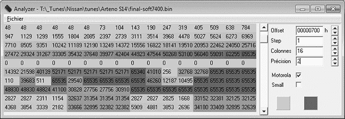

*图 6-4：analyze.exe 中的 VQ 表：前四行的 16×16 位值，值范围从 48 到 65535*

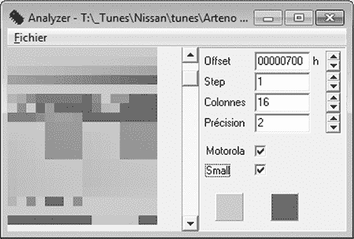

*图 6-5：前四行的 16x16 位值*

再次查看 图 6-4 和 6-5 中在 analyze.exe 中阴影处理的前四行 16×16 位值。注意，图 6-1 和 6-2 中的平滑非线性曲线如何模拟这些值的平滑非线性变化。图 6-6 显示了相同的值，在 64 列布局中，你可以看到 图 6-5 中前四行的完整梯度。无论你查看哪种类型的载体，整体数据结构都将是相似的。

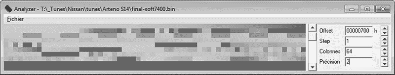

*图 6-6：每行从 64 位到 16 位字的转换*

像十六进制编辑器或 analyze.exe 这样的数据可视化工具，也在你不确定要寻找的确切形状或模式时非常有用。无论你正在查看哪种类型的载体，数据结构通常会具有在可执行代码中不常见的顺序和模式。图 6-7 显示了 analyze.exe 中数据的明显视觉模式——值逐渐变化和重复的现象应该很容易被察觉。

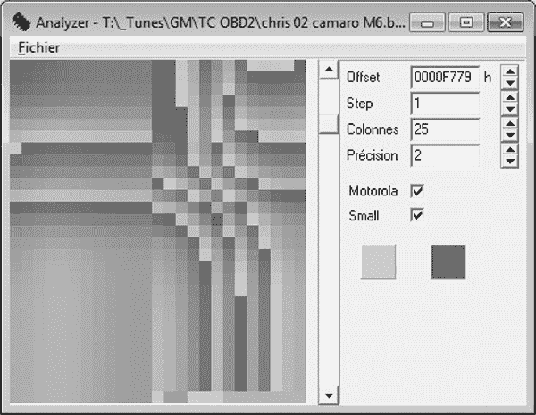

*图 6-7：表格数据中的模式和逐渐变化出现在 2002 款雪佛兰 Camaro ROM 中，通过 analyze.exe 可视化*

另一方面，当你查看 图 6-8 中的代码时，它呈现出更为随机、混乱的外观。（在 图 6-7 和 6-8 中，精度设置为 2，因为使用的微控制器单元是 16 位处理器，可以合理假设大部分数据项也将是 16 位的。）

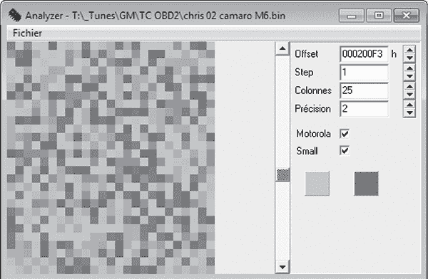

*图 6-8：这段随机代码没有像大多数表格中那样整齐、有序的模式。*

##### 从 MCU 中学到更多

希望这些示例能帮助你将你期望在表格数据中找到的知识与其在二进制大对象中的表示进行连接。了解目标系统中使用的微控制器单元（MCU）的能力，可以为你查看二进制数据时提供有关预期数据类型的线索。

通常，数据表示格式由硬件决定。了解运行程序的 MCU 寄存器的大小，对于识别参数非常有帮助。大多数参数的大小通常与给定 MCU 的寄存器相同或更小。比如，像 68HC11 这样的 8 位 MCU，通常会有很多 8 位数据。在 8 位 MCU 上看到主要是 4 字节或 32 位无符号长整型数据是不常见的。虽然像 68332 这样的 MCU 上 16 位数据变得更加常见，但在 MPC5xx Power 架构 MCU 及其后续版本中，32 位数据成为常态。在没有浮点处理器的 MCU 上，找到浮点数据是很不寻常的。

#### *比较字节以识别参数*

通常可以获得多个 bin 文件，这些文件可以在相同的物理 ECU 上运行。越多越好！在十六进制编辑器中进行简单比较会显示文件之间哪些字节不同。代码保持不变而参数发生变化是常见的——但不能保证。如果文件之间的差异小于 5％，通常可以安全地假设这些差异是参数。如果你知道两个 bin 文件之间功能上的变化，并且知道哪些字节发生了变化，那么你可以获得更多线索，帮助你将 ROM 中的变化与参数的变化关联起来。

图 6-9 和 6-10 比较了 1996 年 V8 Mustang 与 1997 年 V6 Thunderbird，展示了在 114,688 字节中有 6,667 个差异。这是一个极端的例子，展示了相同的代码在不同参数下的变化，但与整体文件大小相比，差异仅约为 5.8％。

大多数处理器使用由所用处理器定义的中断向量表。参考处理器的数据手册可以定义中断例程的结构，从而帮助你快速识别中断处理程序。通过追踪处理器的中断引脚到 ECU 内的电路，再到车辆接线图中可以参考的引脚，可以帮助你识别用于服务硬件功能的代码块，例如燃油和点火控制、曲轴和凸轮信号处理以及空转功能。

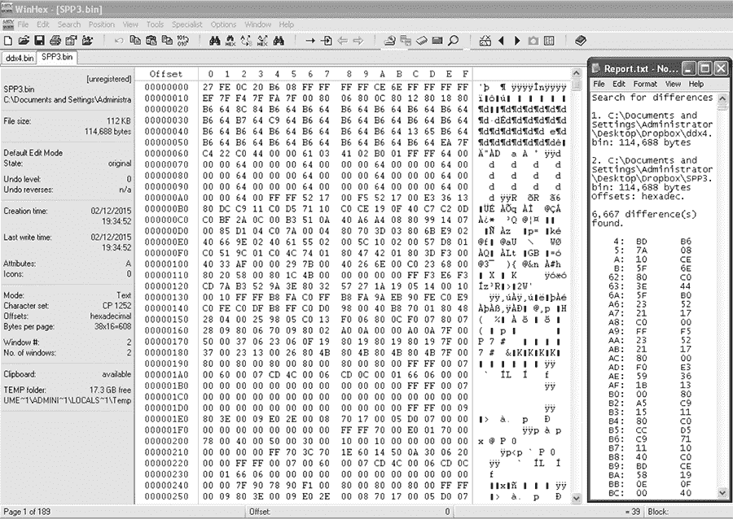

*图 6-9：1996 年 V8 Mustang*（DXE2.bin）*与 1997 年 V6 Thunderbird*（SPP3.bin）*的比较*

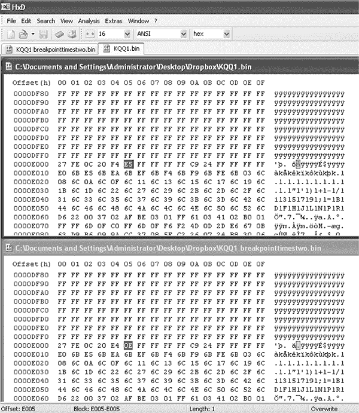

*图 6-10：HxD 十六进制编辑器的文件比较功能*

#### *使用 WinOLS 识别 ROM 数据*

WinOLS 是一款流行的商业程序，用于修改 bin 文件。它结合了一系列工具来计算和更新 ROM 中的校验和，并配有一组工具用于识别表格。图 6-11 和 6-12 展示了 WinOLS 的使用情况。

如果已知 ROM 类型，它有许多模板，可以自动识别配置参数。大多数已知的内置 ROM 类型都面向博世 Motronic ECU。模板和配置可以保存、共享，并出售，使用户能够更轻松地对特定文件进行修改。WinOLS 可以说是用于识别 ROM 中有趣数据的最常见软件，它不涉及代码分析。它的设计旨在便于快速调整控制器的设置。

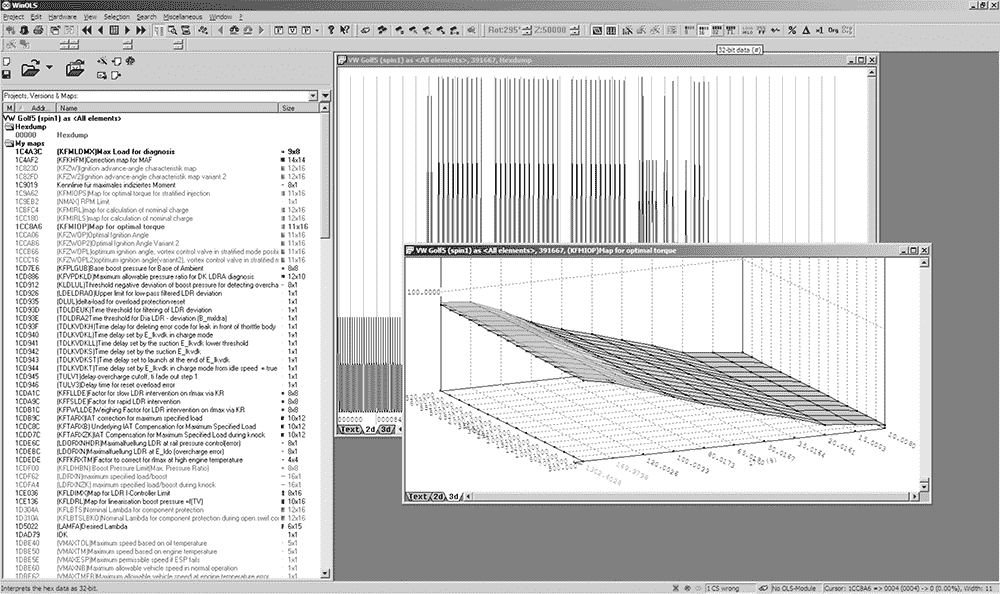

*图 6-11：WinOLS 支持 2D 和 3D 表格视图，如这些替代视图所示。*

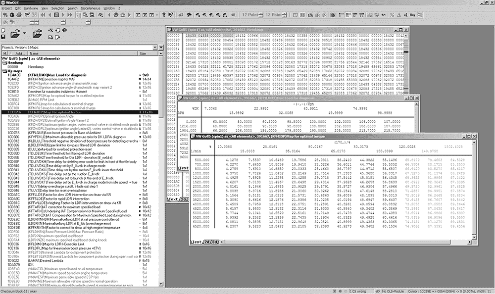

*图 6-12：WinOLS 用于分析 2006 年大众 2.0Tsi ECU*

### 代码分析

代码分析可能是一个漫长而复杂的任务。如果你是从零开始，没有经验，分析一段复杂的代码可能需要数百小时。现代控制单元的代码通常有一到两兆字节，这在你用汇编语言查看时是一大堆代码。1995 年的 ECU 代码为 32 千字节（而不是兆字节），可能有超过 10,000 条汇编指令需要整理。最重要的是：不要低估这种方法所需的工作量。我会简要介绍一些工具，但没有足够的空间对这个话题进行深入讨论，尤其是对于那些不熟悉这一过程的人来说。（毕竟，关于代码分析已经有整本书了。）在这里，我只会讨论一些特别适用于汽车嵌入式系统的工具和方法。

在分析一个新的目标时，首先要识别你正在使用的架构。了解哪个处理器执行了这段二进制代码，将帮助你选择合适的软件工具进一步辅助分析。如果你无法通过芯片上的标记来识别处理器，可以在线搜索数据手册来帮助识别。

要分析代码，你可能需要找到一个反汇编器。快速搜索一下 Google，你会发现有很多这样的工具。一些反汇编器只针对单一架构——例如 Dis51——而一些则是为汽车逆向工程专门编写的——例如 Dis66k。还有一些，像 CATS dasm、IDA Pro、Hopper、dasmx 和 GNU 二进制工具（binutils）中的 objdump，支持多种处理器架构。IDA Pro 支持的嵌入式目标比大多数其他程序都要多，但它也是最昂贵的反汇编器之一。GNU binutils 也支持相当广泛的架构，但大多数系统中包含的版本仅针对“本地”架构构建。如果重新构建 binutils 并启用所有架构，将为你打开一些大门。你的预算和支持的处理器将决定哪些反汇编器是可用的。

拿出反汇编工具，开始尝试理解这些杂乱无章的内容，但正如我之前警告的，这可能需要几百个小时。采用“分而治之”的心态效果最佳——聚焦于小任务，而不是整个项目。如果你通过后门方法获得了二进制文件，你可能已经拆解了 ECU 来识别处理器。如果你破解了 J2534 编程例程，你可能不知道是哪个处理器在主导操作。在这种情况下，你需要不断地通过反汇编器使用不同的设置进行运行，直到得到一个有意义的结果。

你需要寻找反汇编后能清晰显示的汇编代码，这意味着它看起来有逻辑。如果你对错误的架构进行了反汇编，或者使用了错误的设置，你仍然会看到汇编指令，但汇编动作将没有意义。反汇编有点像一门艺术，可能需要一些实践来识别“干净”的汇编，尤其是当非执行表格和数据在代码中散布时，要学会识别反汇编器是否提供了正确的响应。

这里有一些提示，帮助你理解反汇编代码：

• OEM（原始设备制造商）喜欢为技术申请专利。如果你能找到与系统相关的专利，你可能会得到一份关于反汇编代码的指导性文档。这很可能是最一致可用的高层次过程指南，有助于你理解汽车计算机中的逻辑。专利通常至少领先于生产一到两年，甚至更多。

• 查看任何可用的软件，以便通过操作手头的 ECU 获取代码段的结构和目的。你通常可以通过售后软件中可修改的表格推测出行为模型。

• 否则，从车辆的接线图开始，追踪连接通过 ECU 电路到达 MCU 的特定引脚。这应该能告诉你哪个 MCU 硬件处理了哪个功能。交叉引用中断表，或查找服务特定硬件的调用，以识别哪些代码段处理该硬件功能。

一般的，或旧式的，反汇编器会输出非常冗长的文本。每个单独的指令都会被解析。一些反汇编器会尝试标记作为数据引用的区域，并避免对其进行反汇编。其他反汇编器则需要特别告知哪些区域是代码，哪些区域是数据。

#### *一个普通反汇编器的工作*

为了看到反汇编的实际效果，我们将查看 1990 年日产 300ZX 双涡轮 ROM 的简单反汇编。这款 ECU 使用的是一颗 28 引脚的外部 27C256 EPROM，因此相对容易获取其内容。这个平台使用的是 HD6303 MCU，它是摩托罗拉 6800 8 位 MCU 的一个衍生版本，似乎可以通过免费的反汇编工具 DASMx 进行支持（请参见*[`www.16paws.com/ECU/DASMxx/DASMx.htm`](http://www.16paws.com/ECU/DASMxx/DASMx.htm)*）。DASMx 附带的说明非常简洁：要反汇编*foo.bin*，需要创建一个文件*foo.sym*，描述使用的平台类型，然后在内存中创建一个入口点来放置映像、已知的符号等。是时候进行架构速成课程了！

关于内存结构的一个关键点是，MCU 可以寻址 65535 字节（64KB）。这个信息告诉你在查看二进制文件中的地址时应该期待什么。进一步的阅读表明，中断向量表位于可寻址内存的*末尾*，而复位向量——每个处理器在重置后开始的地方——位于 0xFFFE/0xFFFF。假设我们从读取 EPROM 中获得的 32KB（0x7FFF 十六进制）二进制文件包含了中断向量表，那么我们可以推断出二进制映像需要从内存地址 0x8000 开始，这样它就可以在 0xFFFF 结束（0xFFFF – 0x7FFF = 0x8000）。同时，搜索在线资源查看是否有其他人正在做类似的事情也很有帮助。例如，* [`forum.nistune.com/viewtopic.php?f=2&t=417`](http://forum.nistune.com/viewtopic.php?f=2&t=417)*上的帖子是关于一个较小的 16KB 二进制文件，它基于 0xC000 入口点的设置。在实际调用反汇编工具之前做更多的前期调研和研究，越有可能获得合理的结果。

图 6-13 展示了 300ZX 二进制文件的符号表。在每个`符号`旁边是固件使用的内存地址。这些内存地址可以保存如来自芯片不同物理引脚的输入数据或内部信息（如时序）等值。

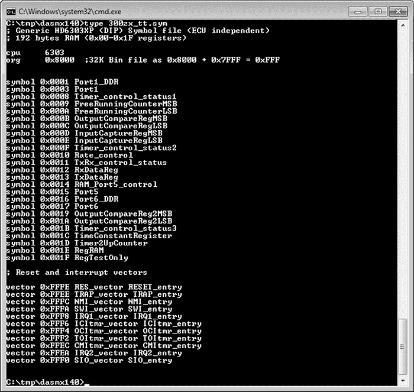

*图 6-13：DASMx 反汇编 32KB 300ZX 二进制文件的符号文件*

我们将使用 DASMx 来反汇编这个二进制文件。如图 6-14 所示，DASMx 报告了一个日立 6303 MCU，其源文件的长度或大小为 32KB，即 32768 字节。

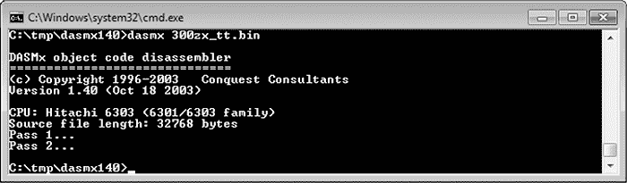

*图 6-14：运行 DASMx 反汇编 32KB 300ZX 二进制文件*

现在，交叉你的手指，祈祷得到一个有意义的结果！

结果就是图 6-15 中显示的向量表，看起来是合理的：所有地址都位于指定的 0x8000 入口点之上。注意，复位向量（0xFFFE，`RES-vector`）指向位于 0xBE6D 的`RESET_entry`。

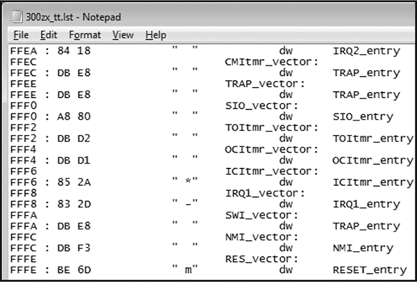

*图 6-15：反汇编的向量表*

我们可以在 0xBE6D 处反汇编复位向量，该位置也是代码的入口点。在图 6-16 中，我们看到一个例程，`RESET_entry`，它看起来像是清除了一块 RAM。这是初始复位序列中一个合理的部分，因为在启动时，固件通常会将数据区域初始化为全零。

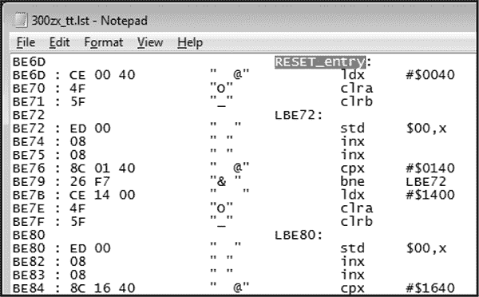

*图 6-16：复位向量反汇编*

我们已经将这个示例进行到获取反汇编二进制镜像并检查基本合理性为止。现在，进入更难的部分：跟踪代码，将其拆分为多个例程，并试图弄清楚它是如何工作的。

#### *交互式反汇编器*

截至本文写作时，IDA Pro 是目前最受欢迎的交互式反汇编器。它执行与刚才讨论的简单反汇编器相同的任务，还做得更多。具体来说，IDA Pro 为寄存器和变量命名；一旦 IDA Pro 识别并命名了一个变量或内存地址——例如，$FC50–RPM——它会为代码中对该变量的所有引用赋予一个描述性名称，而不是较难识别的普通十六进制地址。IDA Pro 还可以绘制代码图表，以可视化程序流程。

IDA Pro 的一个优点是它可以编程，允许为定制汽车处理器添加额外的操作码，并为进一步处理反汇编代码（例如，将汇编代码反编译为更高级的语言代码）提供插件；它还允许使用结构体、联合体、类和其他用户定义的数据类型。

最后，IDA Pro 支持的嵌入式平台比当前市面上几乎所有其他反汇编器都要多。

虽然你不一定需要这些功能来成功分析代码，但它们会大大简化工作。图 6-17 和 6-18 是使用 IDA Pro 进行的实际代码分析的截图。感谢 Matt Wallace 在公开论坛上慷慨地发布了这些示例。

图 6-18 中的用户通过多种硬件破解方法获得了 Acura NSX ECU 固件，将代码拆解后使用 IDA Pro 进行了分析，并对其进行了重写。接下来，用户确定了从 ECU 日志数据并修改其操作所需的功能。最终的结果使得用户能够在工厂电脑上使用强制进气——即涡轮增压器和机械增压器；如果没有 ECU 修改，这是不可能实现的。

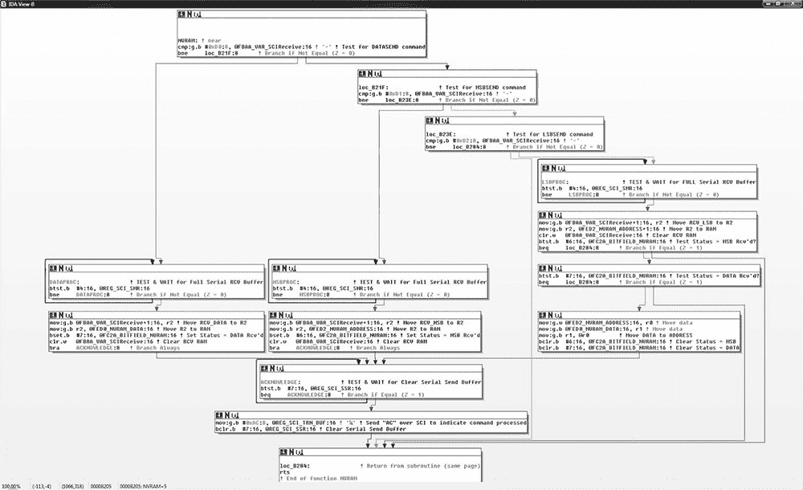

*图 6-17：显示为 NVRAM 实时编程编写的自定义例程的 IDA 图*

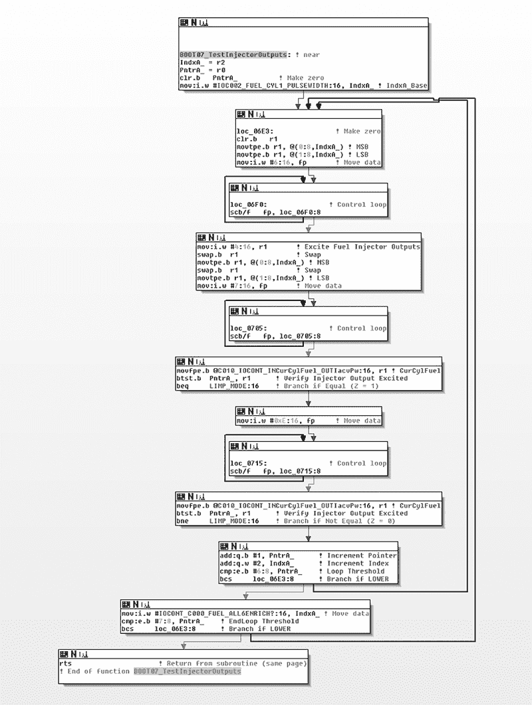

*图 6-18：用于检查 NSX ECU 燃油喷射器的代码的 IDA 图*

### 总结

因为对 ECU 的破解通常涉及到比现代设备（如手机）使用的处理器更小的处理器，因此用于反向工程固件的工具在不同的目标设备之间有所不同。通过结合多种技术，比如使用数据可视化来定位表格，和直接反向固件，你可以识别出你感兴趣的修改区域。本章讨论的方法是性能调校员常用的技术，用于调整车辆的燃油效率表现。这些方法都可以用来解锁隐藏在你车辆代码中的功能。我们将在第十三章中更详细地探讨性能调校。
