## **构建和使用 ECU 测试台**


一个 ECU 测试台，如图 7-1 所示，由 ECU、电源、可选的电源开关和 OBD-II 连接器组成。你还可以添加 IC 或其他与 CAN 相关的系统进行测试，但仅构建一个基本的 ECU 测试台已经是学习 CAN 总线和如何创建自定义工具的一个很好的方法。在本章中，我们将一步一步地讲解如何为开发和测试构建测试台。

### 基本 ECU 测试台

最基本的测试台是你想要测试的设备和一个电源。当你为 ECU 提供适当的电力时，你就可以开始对它的输入和通讯进行测试。例如，图 7-1 展示了一个基本的测试台，包含了一个 PC 电源和一个 ECU。

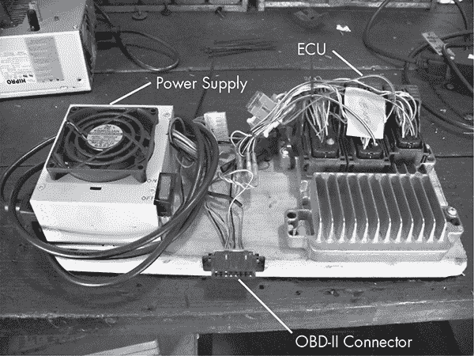

*图 7-1：一个简单的 ECU 测试台*

然而，你通常至少会希望添加一些组件或端口，以使测试台更容易使用和操作。为了更方便地开关设备，你可以为电源添加一个开关。OBD 端口允许专用的机械工具与车辆的网络进行通信。为了使 OBD 端口能够完全工作，我们需要将 ECU 的车辆网络电缆暴露到 OBD 端口。

#### *寻找 ECU*

找到 ECU 的一个地方当然是在废品场。你通常会在车的中控台的收音机后面或手套箱后面找到 ECU。如果你找不到它，可以尝试利用庞大的电缆束追溯到 ECU。自己拆卸时（费用大约为$150），务必从支持 CAN 的车辆中拆下 ECU。你可以使用像*【http://www.auterraweb.com/aboutcan.html】(http://www.auterraweb.com/aboutcan.html)*这样的参考网站来帮助你识别目标车辆。另外，当你移除 ECU 时，确保至少保留一段电缆，这样以后接线会更方便。

如果你不太喜欢从废车中拆卸设备，可以在像*【car-part.com】(http://car-part.com)*这样的网上网站上订购 ECU。费用会稍微高一些，因为你需要支付给别人去获取零件并将其寄给你。务必确保你购买的 ECU 包含了电缆束。

**注意**

*在线购买 ECU 的一个缺点是，如果你需要多个零件，可能很难从同一辆车上获得它们。例如，你可能需要车身控制模块（BCM）和 ECU，因为你希望包括钥匙，而防盗系统在 BCM 中。在这种情况下，如果你混合搭配来自两辆不同车辆的部件，车辆就无法“正常启动”。*

与其收集或购买一个二手的 ECU，你也可以使用一个预构建的模拟器，比如 ScanTool 的 ECUsim 2000（参见图 7-2）。像 ECUsim 这样的模拟器每个协议的价格大约为 200 美元，并且只支持 OBD/UDS 通信。模拟器可以生成故障和 MIL 灯，并包括用于改变常见车辆参数（如速度）的故障旋钮。然而，除非你正在构建一个仅使用 UDS 数据包的应用程序，否则模拟器可能不是最佳选择。

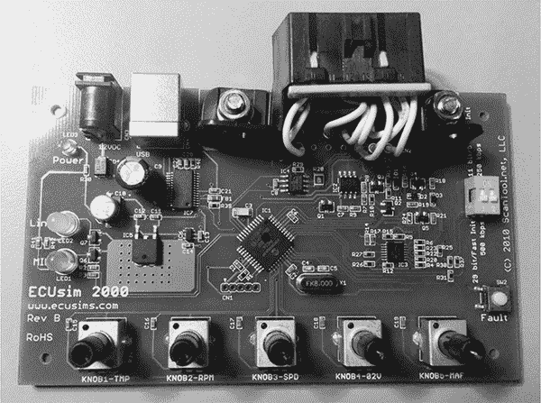

*图 7-2：ECUsim OBD 模拟器*

#### *解剖 ECU 接线*

一旦你有了所有的零件，你需要找到 ECU 的接线图，以确定需要连接哪些线路来使其工作。访问像 ALLDATA (*[`www.alldata.com/`](http://www.alldata.com/)*) 或 Mitchell 1 (*[`mitchell1.com/main/`](http://mitchell1.com/main/)*) 这样的网站来获取完整的接线图。你会发现现成的维修手册有时会包含接线图，但它们通常不完整，并且只涵盖常见的维修区域。

接线图并不总是容易阅读，主要是因为有些接线图将许多小组件结合在一起（参见图 7-3）。尝试在脑海中分解每个组件，以便更好地了解需要关注哪些线路。

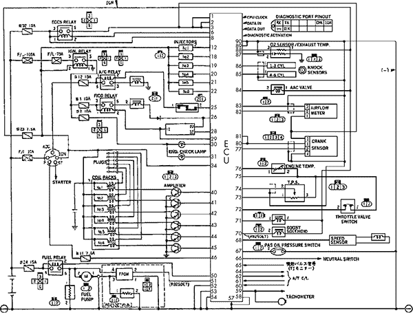

*图 7-3：ECU 接线图示例*

##### 引脚图

你可以从 *[`www.innovatemotorsports.com/resources/ecu_pinout.php`](http://www.innovatemotorsports.com/resources/ecu_pinout.php)* 以及像 ALLDATA 和 Mitchell 1 这样的商业资源中获取多个不同车辆的 ECU 引脚图。像 Chilton 这样的汽车维修手册包括块图，但你会发现它们通常只涵盖最常见的维修组件，而不是整个 ECU。

##### 块图

块图通常比显示所有组件在同一张图纸上的接线图更易于阅读。块图通常仅显示单个组件的接线，并提供主组件的高级概览，而原理图则显示所有电路细节。一些块图还包括图例，显示该图所指的连接器块及该模块上的连接器；你通常可以在块图的角落找到这些信息（参见表 7-1）。

**表 7-1：** 示例连接器图例

| **连接器 ID** | **引脚数量** | **颜色** |
| --- | --- | --- |
| C1 | 68 | WH |
| C2 | 68 | L-GY |
| C3 | 68 | M-GY |
| C4 | 12 | BK |

图例应给出连接器的编号、引脚数量和颜色。例如，表 7-1 中的 C1 = 68 WH 表示 C1 连接器有 68 个引脚，并且是白色的。L-GY 可能表示浅灰色，以此类推。像 C2-55 这样的连接器编号指的是连接器 2 的引脚 55。连接器通常在行的第一个和最后一个引脚上标有编号。

#### *接线*

一旦你获得了连接器的接线信息，就可以开始接线了。将 CAN 接到连接器上的正确端口，正如在《OBD-II 连接器针脚图》第 31 页所讨论的那样。当你提供电源（来自旧 PC 的电源应该足够）并添加一个 CAN 嗅探器时，你应该能够看到数据包。你可以使用任何汽车商店都能买到的简单 OBD-II 扫描工具。如果一切接线正确，扫描工具应该能识别出车辆，前提是你的测试台包括主 ECU。

**注意**

*你的 MIL（发动机故障灯）很可能会被扫描工具/ECU 报告为*开启*状态。*

如果你已经接好了所有线，但仍然看不到 CAN 总线上的数据包，可能是缺少终端电阻。为了解决这个问题，首先可以添加一个 120 欧姆的电阻，因为 CAN 总线的两端都有 120 欧姆的电阻。如果这样不行，再加一个电阻。最大缺失电阻应为 240 欧姆。如果总线依然无法工作，那么请重新检查你的电缆并再试一次。

**注意**

*许多组件通过简单的方式与 ECU 通信，或者通过设定的数字信号，或者通过模拟信号。模拟信号可以通过电位器轻松模拟，通常你可以将一个 1 千欧的电位器连接到发动机温度和燃油线来控制它们。*

### 构建更先进的测试台

如果你准备深入研究汽车黑客技术，考虑构建一个更先进的 ECU 测试台，就像在《图 7-4》中所示的那样。

该单元将 ECU 与 BCM 集成在一起，因为它还拥有启动车辆所需的原始钥匙。注意，选配的 IC 在左下方有两个 1 千欧的可变电阻（也叫电位器），这两个电位器都连接到发动机温度和燃油线。我们使用这些电位器来生成传感器信号，如下面的章节所述。这个特定的测试台还包括一个小型 MCU，允许你模拟向 ECU 发送曲轴和凸轮轴信号。

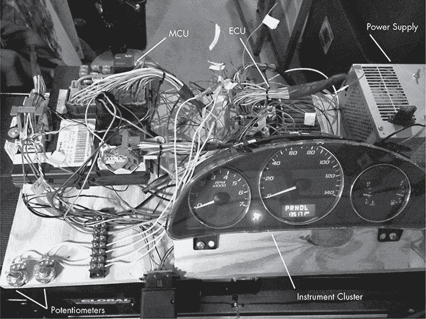

*图 7-4：更复杂的测试台*

更复杂的设备，如《图 7-4》所示，使得确定 CAN 流量变得轻而易举：只需加载一个嗅探器，调整旋钮，观察数据包变化。如果你知道你针对的线和它们接收的输入类型，你可以轻松模拟大多数组件的信号。

#### *模拟传感器信号*

正如我之前提到的，你可以在这个设置中使用电位器来模拟各种车辆传感器，包括以下几种：

• 冷却液温度传感器

• 燃油传感器

• 氧气传感器，用于检测排气中的燃烧后氧气

• 油门位置，这在实际车辆中可能已经是一个电位器

• 压力传感器

如果你的目标是生成更复杂或数字化的信号，可以使用一个小型微控制器，如 Arduino 或 Raspberry Pi。

对于我们的测试台，我们还想控制转速和/或车速表指针。为了实现这一点，我们需要了解 ECU 是如何测量速度的。

#### *霍尔效应传感器*

霍尔效应传感器通常用于感知发动机转速和曲轴位置（CKP），并生成数字信号。在图 7-5 中，霍尔效应传感器使用一个快门轮，或一个带有间隙的轮子，来测量旋转速度。砷化镓晶体在暴露于磁场时会改变其导电性。随着快门轮的旋转，晶体检测到磁铁并在没有被轮子遮挡时发送脉冲。通过测量脉冲的频率，你可以推算出车辆的速度。

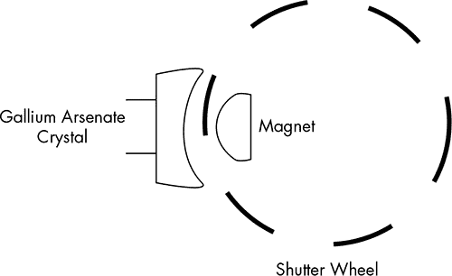

*图 7-5：霍尔效应传感器的快门轮示意图*

你也可以使用凸轮轴定时链轮来测量速度。当你观察凸轮轴定时链轮时，磁铁位于车轮的一侧（见图 7-6）。

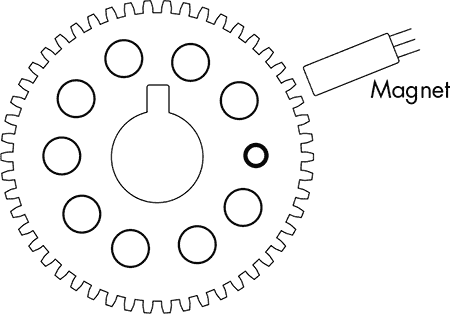

*图 7-6：凸轮轴定时链轮*

使用示波器检测信号线表明霍尔效应传感器会产生方波。通常，凸轮轴传感器有三根线：电源、接地和信号线。电源通常是 12V，但信号线通常在 5V 下返回 ECM。凸轮轴传感器也有光学传感器，它们的工作原理类似，区别在于一侧是 LED，另一侧是光电池。

你可以使用一个缺齿的定时齿轮（称为*触发轮*）或一个定时标记来测量完整的旋转时间。了解凸轮轴何时完成一整圈非常重要。感应型凸轮轴传感器会产生正弦波，通常会有一个缺齿，用来检测完整的旋转。

图 7-7 显示了凸轮轴传感器的信号大约每 2 毫秒重复一次。在约 40 毫秒的位置，波形中的跳跃或间隙是因为缺失齿到达的地方。该间隙的位置标志着凸轮轴完成一整圈的点。为了将这些凸轮轴信号模拟到 ECU 测试台，你需要为你的微控制器编写一个小的程序。当编写微控制器代码以模拟这些传感器时，了解你的车辆使用何种类型的传感器非常重要，这样你就知道在模拟齿轮时是否使用数字输出或模拟输出。

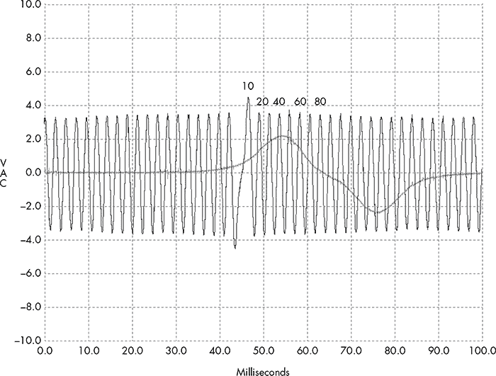

*图 7-7：示波器下的凸轮轴传感器信号*

### 模拟车辆速度

现在，我们将建立一个测试台来模拟车辆速度。我们将使用这个测试台与图 7-4 中展示的 IC 一起，通过 OBD-II 连接器提取车辆的 VIN。这将为我们提供车辆的确切年份、品牌、型号和发动机类型。（我们在《统一诊断服务》中手动做过这件事，详见第 54 页。）表 7-2 显示了结果。

**表 7-2：** 车辆信息

| **VIN** | **车型** | **年份** | **品牌** | **车身** | **发动机** |
| --- | --- | --- | --- | --- | --- |
| 1G1ZT53826F109149 | Malibu | 2006 | Chevrolet | Sedan 4Door | 3.5L V6 OHV 12V |

一旦我们知道了车辆的制造年份和发动机类型，就可以获取接线图来确定哪些 ECU 电线控制发动机转速（见图 7-8）。然后，我们可以向 ECU 发送模拟的转速数据，以便测量效果。使用接线图来模拟真实的发动机行为可以帮助我们轻松识别 CAN 总线上的目标信号。

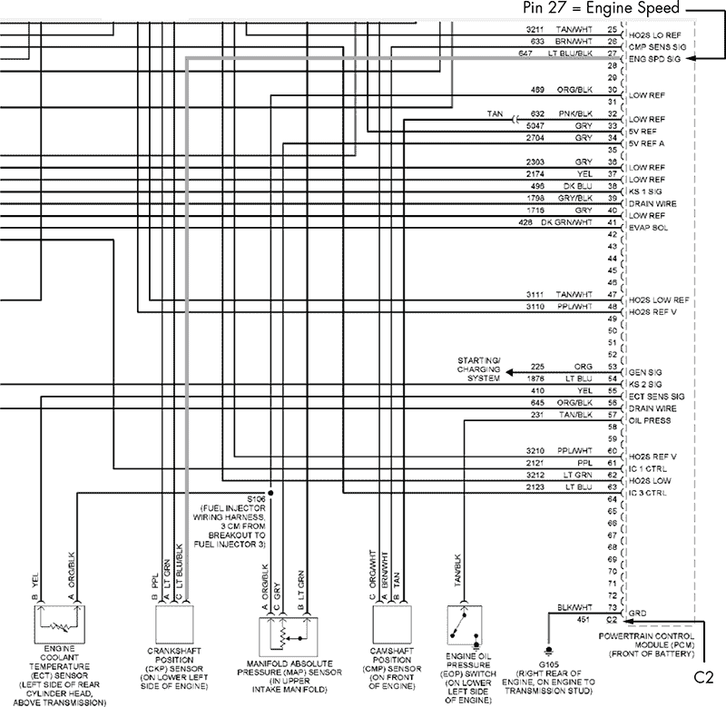

*图 7-8：显示发动机转速引脚的接线图*

图 7-8 中的接线图展示了如何从 CKP 传感器追踪电线，使得 C2 连接器的 27 脚能够接收来自曲轴传感器的发动机转速。确定了接线图中的这个引脚后，我们在 ECU 上找到相应的电线。我们可以将这根电线连接到 Arduino 的任何数字 IO 引脚。在这个例子中，我们将使用引脚 2，并将电位计连接到 A0，用来控制 CKP 传感器的“齿轮”向 ECM 发送的转速。引脚 2 将向 C2 引脚 27 发送输出。

为了模拟从 CKP 传感器发送的发动机转速，我们编写了一个 Arduino 草图，用来发送高低脉冲，延迟间隔与电位计位置相对应（见清单 7-1）。

```
int ENG_SPD_PIN = 2;
long interval = 500;
long previousMicros = 0;
int state = LOW;

// the setup routine runs once when you press reset
void setup() {
  pinMode(ENG_SPD_PIN, OUTPUT);
}

// the loop routine repeats forever
void loop() {
  unsigned long currentMicros = micros();

  // read the input on analog pin 0
  int sensorValue = analogRead(A0);
  interval = map(sensorValue, 0, 1023, 0, 3000);

  if(currentMicros - previousMicros > interval) {
    previousMicros = currentMicros;

    if (state == LOW)
      state = HIGH;
    else
      state = LOW;

    if (interval == 0)
      state = LOW;  // turning the pot all the way down turns it "off"

    digitalWrite(ENG_SPD_PIN, state);
  }
}
```

*清单 7-1：用于模拟发动机转速的 Arduino 草图*

现在，我们将这个草图上传到 Arduino，启动测试台，并在转动电位计的旋钮时，IC 上的转速表会跟随移动。在图 7-9 中，`cansniffer`流量的第二行显示了字节 2 和字节 3——0x0B 和 0x89——随着我们旋转电位计旋钮而变化，用于仲裁 ID 0x110（列出为*ID*的那一列）。

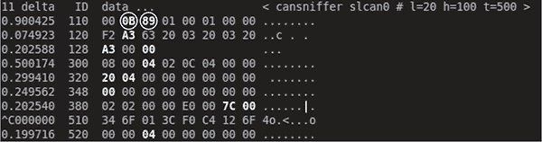

*图 7-9:* `cansniffer` *识别转速*

**注意**

*0x0B 和 0x89 并不直接转换为转速；它们只是简写。换句话说，如果你要达到 1000 转速，你不会看到 1000 的十六进制值。当你查询发动机转速时，将这两个字节转换为转速的常见算法如下：*

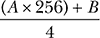

*A 是第一个字节，* B *是第二个字节。如果你将这个算法应用到图 7-9 中显示的内容（从十六进制转换为十进制），你会得到以下结果：*

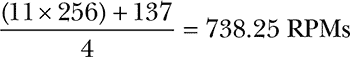

*你可以简化这个方法，直接使用 0xB89，它在十进制形式下是 2953。当你将其除以 4 时，你得到 738.25 转速。*

当这张截图拍摄时，指针在转速表的 1 以下略微空转，所以这可能是相同的算法。（有时你会发现，真实的 CAN 数据包中的数值并不总是与使用 UDS 服务的现成诊断工具的算法一致，但它们一致时是非常好的。）

为了验证仲裁 ID 0x110 的第 2 和第 3 字节控制 RPM，我们将发送我们自己的自定义数据包。通过使用一个循环将以下数据包发送到总线，我们将把指针固定在最大转速。

```
$ cansend slcan0 110#00ffff3500380000
```

尽管这种方法有效，一旦连接，它只需要几秒钟就能识别出负责 RPM 的 CAN 数据包，但仍然存在一些明显的问题。每隔一段时间，就会出现一个 CAN 信号，它将值重置为 00 00，并停止转速表的指针移动。因此，虽然 ECM 相当确定曲轴在旋转，但它正在检测到问题并尝试重置。

你可以使用在第三章中讨论的 ISO-TP 工具来提取数据。在两个不同的终端中，我们可以检查是否存在诊断代码。（你也可以使用扫描工具。）

在一个终端中，输入以下内容：

```
$ isotpsniffer -s 7df -d 7e8 slcan0
```

在另一个终端中，发送这个命令：

```
$ echo "03" | isotpsend -s 7DF -d 7E8 slcan0
```

你应该在第一个终端中看到这个输出：

```
slcan0 7DF [1] 03 - '.'
slcan0 7E8 [6] 43 02 00 68 C1 07 - 'C..h..'
```

看起来我们已经有一个 DTC 设置了。查询 PID 0x03 返回了一个 4 字节的 DTC（0x0068C107）。前两个字节构成了标准 DTC（0x00 0x68）。这转换为 P0068，在《Chilton 手册》中被称为“节气门体气流性能”。通过快速搜索 Google，你会发现这只是一个通用错误代码，通常由 PCM 认为发生的情况与它从进气歧管获取的数据之间的差异引起。如果我们也想伪造这些数据，我们还需要伪造三个附加传感器：MAF 传感器、节气门位置传感器和进气歧管压力（MAP）。然而，修复这些问题可能并不会真正解决我们的困境。PCM 可能仍然认为车辆运行正常，但除非你真的在乎篡改所有数据，否则你也许可以找到其他方法来欺骗 PCM 输出你想要的信号，而无需担心触发 DTC 故障。

如果你不想使用 Arduino 发送信号，你也可以购买一个信号发生器。专业的信号发生器至少需要$150，但你也可以从 SparkFun 购买一个，价格约为$50（*[`www.sparkfun.com/products/11394/`](http://www.sparkfun.com/products/11394/)*）。另一个很好的选择是 Megasquirt 的 JimStim。这可以作为一个套件或完全组装的版本，价格为$90，从 DIYAutoTune 购买（*[`www.diyautotune.com/catalog/jimstim-15-megasquirt-stimulator-wheel-simulator-assembled-p-178.html`](http://www.diyautotune.com/catalog/jimstim-15-megasquirt-stimulator-wheel-simulator-assembled-p-178.html)*）。

### 总结

在本章中，你学习了如何构建一个 ECU 测试台，作为一种经济实惠的车辆安全测试解决方案。我们讨论了如何获取构建测试台的零件，以及如何阅读接线图，以便了解如何连接这些零件。你还学习了如何构建一个更先进的测试台，可以模拟发动机信号，从而欺骗组件让它们认为车辆存在。

建立测试平台在初期研究过程中可能是一个耗时的过程，但最终会带来回报。将测试放在测试平台上进行不仅更安全，而且这些设备也非常适合培训，并且可以运输到你需要的地方。
